# Course Roadmap

The curriculum is organized in three tiers. **Tier 0** refreshers reactivate dormant knowledge (short, fast-paced). **Tier 1** bridge courses build the rigor and machinery the grad-level material assumes. **Tier 2** is the destination material. Courses unlock when their prerequisites reach the ~60% mark — you don't need to finish a prereq to start.

**Target:** every course ends at "enough to be dangerous" — defined per course by a concrete *Dangerous Checklist* in its syllabus (can-do statements, not topics covered).

## Dependency graph

```mermaid
graph TD
    subgraph T0["Tier 0 — Refreshers"]
        proofs[Proofs Primer]
        calc[Calculus]
        linalg[Linear Algebra]
        ode[Differential Equations]
        prob0[Probability & Stats]
        mech[Newtonian Mechanics]
        em[Electromagnetism]
        game0[Game Theory]
        micro0[Mathematical Micro]
    end
    subgraph T1["Tier 1 — Bridges"]
        ra[Real Analysis]
        ca[Complex Analysis]
        top[Topology]
        pt[Probability Theory]
        am[Analytical Mechanics]
        pde[PDEs]
        fa[Functional Analysis]
        dg[Differential Geometry]
        aa[Abstract Algebra]
        dyn[Dynamical Systems]
        sc[Stochastic Calculus]
        it[Information Theory]
    end
    subgraph T2["Tier 2 — Destinations"]
        ggt[Grad Game Theory]
        gmicro[Grad Micro]
        qm[Quantum Mechanics]
        sm[Statistical Mechanics]
        rel[Relativity SR+GR]
        astro[Astrophysics]
        rt[Representation Theory]
        qft[Quantum Field Theory]
        fluid[Fluid Dynamics]
        gmacro[Grad Macro]
        econ[Econometrics]
        mfin[Mathematical Finance]
        poleco[Political Economy]
        sl[Statistical Learning]
    end
    subgraph HU["Humanities"]
        polphil[Political Philosophy]
    end

    calc --> ode
    calc --> prob0
    calc --> mech
    calc --> em
    proofs --> ra
    proofs --> top
    calc --> ra
    ra --> ca
    ra --> top
    ra --> pt
    prob0 --> pt
    ode --> mech
    ode --> em
    mech --> am
    calc --> micro0
    prob0 --> game0
    game0 --> ggt
    pt --> ggt
    ra --> ggt
    micro0 --> gmicro
    ra --> gmicro
    linalg --> gmicro
    linalg --> qm
    am --> qm
    ca --> qm
    pt --> sm
    am --> sm
    mech --> rel
    em --> rel
    am --> rel
    top --> rel
    linalg --> rel
    sm --> astro
    mech --> astro
    em --> astro
    rel --> astro
    qm --> astro

    calc --> pde
    ode --> pde
    ra --> pde
    ra --> fa
    linalg --> fa
    top --> fa
    calc --> dg
    linalg --> dg
    top --> dg
    proofs --> aa
    linalg --> aa
    ode --> dyn
    linalg --> dyn
    ra --> dyn
    pt --> sc
    ra --> sc
    pt --> it
    linalg --> it
    aa --> rt
    linalg --> rt
    qm --> qft
    rel --> qft
    am --> qft
    pde --> fluid
    mech --> fluid
    gmicro --> gmacro
    ra --> gmacro
    pt --> gmacro
    pt --> econ
    linalg --> econ
    prob0 --> econ
    sc --> mfin
    pt --> mfin
    gmicro --> mfin
    ggt --> poleco
    micro0 --> poleco
    pt --> sl
    linalg --> sl
    prob0 --> sl

    pde -.-> qm
    fa -.-> qm
    rt -.-> qm
    dg -.-> rel
    it -.-> sm
    poleco -.-> polphil
```

*(Dashed edges are "deepens/illuminates" relationships, not hard prerequisites.)*

## Tier 0 — Refreshers (~10–16 lessons each)

| id | Course | Prereqs | Lessons | Notes |
|---|---|---|---|---|
| `proofs-primer` | How to Read & Write Proofs | — | ~8 | Logic, sets, induction, epsilon-delta reading, proof patterns. The on-ramp to analysis and topology. |
| `calc-refresher` | Calculus (single + multivariable) | — | ~14 | Through vector calculus (grad/div/curl, line & surface integrals) — E&M needs it. |
| `linalg-refresher` | Linear Algebra | — | ~12 | Through spectral theorem and SVD; inner-product spaces (QM needs them). |
| `ode-refresher` | Differential Equations | calc | ~10 | ODEs, linear systems, phase portraits, intro PDEs (separation of variables). |
| `prob-stat-refresher` | Probability & Statistics | calc | ~12 | Distributions, expectation, LLN/CLT, Bayes, basic inference. |
| `mechanics-refresher` | Newtonian Mechanics | calc, ode | ~12 | Kinematics through rotation, oscillations, central forces. |
| `em-refresher` | Electromagnetism | calc, ode | ~12 | Maxwell's equations and what they mean; circuits light. |
| `game-theory-refresher` | Game Theory | prob (light) | ~10 | Normal/extensive form, Nash, mixed strategies, repeated games. |
| `micro-refresher` | Mathematical Microeconomics | calc | ~10 | Consumer/producer theory with calculus, Lagrangians, comparative statics. |

## Tier 1 — Bridges (~18–28 lessons each)

| id | Course | Prereqs | Notes |
|---|---|---|---|
| `real-analysis` | Real Analysis | proofs, calc | Sequences, limits, continuity, differentiation, Riemann integration, uniform convergence. |
| `complex-analysis` | Complex Analysis | real-analysis (½) | Holomorphy, Cauchy's theorem, residues, conformal maps. |
| `topology` | Topology | proofs, real-analysis (½) | Point-set core + taste of algebraic (fundamental group). |
| `probability-theory` | Probability Theory | prob-stat, real-analysis (½) | Measure-theoretic-lite: sigma-algebras, modes of convergence, conditional expectation, martingales intro. |
| `analytical-mechanics` | Analytical Mechanics | mechanics, ode | Calculus of variations, Lagrangian, Hamiltonian, symmetry & Noether. **The gateway to QM and field theory.** |
| `pdes` | Partial Differential Equations | calc, ode, real-analysis | Heat/wave/Laplace, separation of variables, Fourier & Green's functions, Sturm–Liouville. The workhorse QM/EM/GR lean on. |
| `functional-analysis` | Functional Analysis | real-analysis, linalg, topology | Banach/Hilbert spaces, operators, the spectral theorem. The rigorous home of QM. |
| `differential-geometry` | Differential Geometry | calc, linalg, topology | Manifolds, tensors, forms, connections, curvature. The honest foundation for GR & gauge theory. |
| `abstract-algebra` | Abstract Algebra | proofs, linalg | Groups, rings, fields, quotients, homomorphisms. Foundation for representation theory & coding. |
| `dynamical-systems` | Dynamical Systems & Chaos | ode, linalg, real-analysis | Flows, stability, bifurcations, chaos, strange attractors, routes to chaos. |
| `stochastic-calculus` | Stochastic Calculus | probability-theory, real-analysis | Brownian motion, Itô calculus, SDEs, Girsanov, Feynman–Kac. The engine for mathematical finance. |
| `information-theory` | Information Theory | probability-theory, linalg | Entropy, mutual information, source & channel coding, max-entropy. Bridges stat-mech ↔ ML ↔ econ. |

## Tier 2 — Destinations (~20–40 lessons each)

| id | Course | Prereqs | Notes |
|---|---|---|---|
| `grad-game-theory` | Grad Game Theory | game-theory, probability-theory, real-analysis | Opens with an **optimization & fixed-points module** (convexity, Kakutani, duality), then existence proofs, Bayesian games, mechanism design, repeated games/folk theorems. |
| `grad-micro` | Grad Microeconomics | micro, real-analysis, linalg | Opens with an **optimization module** (convexity, KKT, duality, dynamic programming), then choice/preference axioms, GE (Arrow–Debreu), welfare theorems, information economics. |
| `quantum-mechanics` | Quantum Mechanics | linalg, analytical-mechanics, complex (light) | State vectors, operators, Schrödinger equation, spin, entanglement, perturbation theory. |
| `stat-mech` | Statistical Mechanics | probability-theory, analytical-mechanics | Ensembles, entropy, partition functions, phase transitions. Bridges probability ↔ physics; feeds astro. |
| `relativity` | Relativity (SR + GR) | mechanics, em, analytical-mechanics, linalg, topology (light) | SR from postulates, a **classical field theory** module, then geodesics, Einstein equations, black holes, cosmology. Now leans on `differential-geometry` for its geometry. |
| `astrophysics` | Astrophysics | mechanics, em, stat-mech, relativity (light), qm (light) | Stellar structure, compact objects, galaxies, cosmology. The capstone — uses everything. |
| `representation-theory` | Group & Representation Theory | abstract-algebra, linalg | Representations, characters, Lie groups/algebras. SU(2)/SO(3) = angular momentum & spin; the language of gauge symmetry. |
| `qft` | Quantum Field Theory | quantum-mechanics, relativity, analytical-mechanics | Canonical quantization, Feynman diagrams, QED, path integrals, renormalization. The physics summit. |
| `fluid-dynamics` | Fluid Dynamics | calc, ode, pdes, mechanics | Euler & Navier–Stokes, vorticity, viscous flow, waves, instability & turbulence. |
| `grad-macro` | Grad Macroeconomics | grad-micro, real-analysis, probability-theory | Recursive methods, growth, OLG, RBC/DSGE, consumption/investment, asset pricing, policy. The pair to grad-micro. |
| `econometrics` | Econometrics | probability-theory, linalg, prob-stat | OLS geometry, inference, identification, IV, panel & diff-in-diff, causal inference, MLE/GMM. |
| `mathematical-finance` | Mathematical Finance | stochastic-calculus, probability-theory, grad-micro | No-arbitrage & risk-neutral pricing, Black–Scholes, portfolio theory/SDF, term structure. |
| `political-economy` | Political Economy & Social Choice | grad-game-theory, micro | Social choice, voting & elections, collective action, political agency, coalitions & redistribution. |
| `statistical-learning` | Statistical Learning Theory | probability-theory, linalg, prob-stat | Bias–variance, regularization, VC/PAC generalization, kernels/SVM, trees/boosting, neural nets, unsupervised. |

## Humanities track

The scaffolding is subject-agnostic, so non-math tracks slot in cleanly. The first entry:

| id | Course | Prereqs | Notes |
|---|---|---|---|
| `political-philosophy` | Political Philosophy | — (proofs-primer optional) | Authority, justice (Rawls/Nozick), liberty, equality, democracy. Prose-driven, no math. The normative companion to `political-economy`. |

## Future shelf (not scheduled)

Measure theory proper, algebraic topology, category theory, numerical & computational methods, condensed-matter physics (after QM + stat-mech), particle physics / the Standard Model (after QFT), general relativity electives (cosmology deep-dive), reinforcement learning & sequential decision-making, macroeconometrics & time series, philosophy of science / formal epistemology, ethics & decision theory (extends the humanities track).

## Suggested default path

Run 2 courses at a time — one math, one applied — so lessons cross-pollinate:

1. `calc-refresher` + `mechanics-refresher`
2. `linalg-refresher` + `game-theory-refresher`
3. `proofs-primer` + `micro-refresher`, then `prob-stat-refresher` + `em-refresher`, `ode-refresher`
4. `real-analysis` + `analytical-mechanics`
5. `probability-theory` + `complex-analysis`, then `topology`
6. Tier 2 in any order the graph allows; `astrophysics` last.

The advanced electives above (`pdes`, `functional-analysis`, `differential-geometry`, `abstract-algebra`, `dynamical-systems`, `stochastic-calculus`, `information-theory`, and their Tier-2 destinations) slot in wherever their prerequisites are met — pick by interest. `political-philosophy` needs no prerequisites and can run alongside anything as a change of pace.

## Status

Course status lives in [progress/progress.json](progress/progress.json) — run `/status` for a dashboard.
