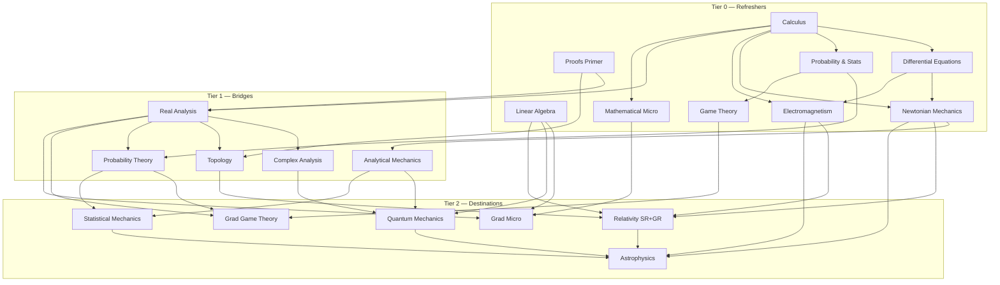

# Course Roadmap

The curriculum is organized in three tiers. **Tier 0** refreshers reactivate dormant knowledge (short, fast-paced). **Tier 1** bridge courses build the rigor and machinery the grad-level material assumes. **Tier 2** is the destination material. Courses unlock when their prerequisites reach the ~60% mark — you don't need to finish a prereq to start.

**Target:** every course ends at "enough to be dangerous" — defined per course by a concrete *Dangerous Checklist* in its syllabus (can-do statements, not topics covered).

## Dependency graph

## Tier 0 — Refreshers (~10–16 lessons each)

| id | Course | Prereqs | Lessons | Notes |
|---|---|---|---|---|
| `proofs-primer` | How to Read & Write Proofs | — | ~8 | Logic, sets, induction, epsilon-delta reading, proof patterns. The on-ramp to analysis and topology. |
| `calc-refresher` | Calculus (single + multivariable) | — | ~14 | Through vector calculus (grad/div/curl, line & surface integrals) — E&M needs it. |
| `linalg-refresher` | Linear Algebra | — | ~12 | Through spectral theorem and SVD; inner-product spaces (QM needs them). |
| `ode-refresher` | Differential Equations | calc | ~10 | ODEs, linear systems, phase portraits, intro PDEs (separation of variables). |
| `prob-stat-refresher` | Probability & Statistics | calc | ~12 | Distributions, expectation, LLN/CLT, Bayes, basic inference. |
| `mechanics-refresher` | Newtonian Mechanics | calc, ode | ~12 | Kinematics through rotation, oscillations, central forces. |
| `em-refresher` | Electromagnetism | calc, ode | ~12 | Maxwell's equations and what they mean; circuits light. |
| `game-theory-refresher` | Game Theory | prob (light) | ~10 | Normal/extensive form, Nash, mixed strategies, repeated games. |
| `micro-refresher` | Mathematical Microeconomics | calc | ~10 | Consumer/producer theory with calculus, Lagrangians, comparative statics. |

## Tier 1 — Bridges (~20–28 lessons each)

| id | Course | Prereqs | Notes |
|---|---|---|---|
| `real-analysis` | Real Analysis | proofs, calc | Sequences, limits, continuity, differentiation, Riemann integration, uniform convergence. |
| `complex-analysis` | Complex Analysis | real-analysis (½) | Holomorphy, Cauchy's theorem, residues, conformal maps. |
| `topology` | Topology | proofs, real-analysis (½) | Point-set core + taste of algebraic (fundamental group). |
| `probability-theory` | Probability Theory | prob-stat, real-analysis (½) | Measure-theoretic-lite: sigma-algebras, modes of convergence, conditional expectation, martingales intro. |
| `analytical-mechanics` | Analytical Mechanics | mechanics, ode | Calculus of variations, Lagrangian, Hamiltonian, symmetry & Noether. **The gateway to QM and field theory.** |

## Tier 2 — Destinations (~25–40 lessons each)

| id | Course | Prereqs | Notes |
|---|---|---|---|
| `grad-game-theory` | Grad Game Theory | game-theory, probability-theory, real-analysis | Opens with an **optimization & fixed-points module** (convexity, Kakutani, duality), then existence proofs, Bayesian games, mechanism design, repeated games/folk theorems. |
| `grad-micro` | Grad Microeconomics | micro, real-analysis, linalg | Opens with an **optimization module** (convexity, KKT, duality, dynamic programming), then choice/preference axioms, GE (Arrow–Debreu), welfare theorems, information economics. |
| `quantum-mechanics` | Quantum Mechanics | linalg, analytical-mechanics, complex (light) | State vectors, operators, Schrödinger equation, spin, entanglement, perturbation theory. |
| `stat-mech` | Statistical Mechanics | probability-theory, analytical-mechanics | Ensembles, entropy, partition functions, phase transitions. Bridges probability ↔ physics; feeds astro. |
| `relativity` | Relativity (SR + GR) | mechanics, em, topology (light), linalg | SR from postulates, then a **differential-geometry interlude** (manifolds, tensors, curvature — the honest way into GR), then geodesics, Einstein equations, black holes, cosmology. |
| `astrophysics` | Astrophysics | mechanics, em, stat-mech, relativity (light), qm (light) | Stellar structure, compact objects, galaxies, cosmology. The capstone — uses everything. |

## Future shelf (not scheduled)

Functional analysis (deepens QM), measure theory proper, stochastic calculus (finance/econ), information theory, PDEs, algebraic topology, econometrics, macro theory, political economy / social choice (natural extension of game theory toward the philosophy/politics interest).

## Suggested default path

Run 2 courses at a time — one math, one applied — so lessons cross-pollinate:

1. `calc-refresher` + `mechanics-refresher`
2. `linalg-refresher` + `game-theory-refresher`
3. `proofs-primer` + `micro-refresher`, then `prob-stat-refresher` + `em-refresher`, `ode-refresher`
4. `real-analysis` + `analytical-mechanics`
5. `probability-theory` + `complex-analysis`, then `topology`
6. Tier 2 in any order the graph allows; `astrophysics` last.

## Status

Course status lives in [progress/progress.json](progress/progress.json) — run `/status` for a dashboard.
