# Course Roadmap

The library is shelved by **field** (the subject area) and, within each field, by **tier** (difficulty). **Tier F** foundations sit below college level; **Tier 0** refreshers reactivate dormant knowledge (short, fast-paced); **Tier 1** bridge courses build the rigor and machinery grad-level material assumes; **Tier 2** is the destination material. Courses unlock when their prerequisites reach the ~60% mark — you don't need to finish a prereq to start.

**Target:** every course ends at "enough to be dangerous" — defined per course by a concrete *Dangerous Checklist* in its syllabus (can-do statements, not topics covered).

Field expansion (Foundations, CS, Chemistry, Engineering, Earth/Space, Life Sciences) is planned in [EXPANSION.md](EXPANSION.md); [roadmap.json](roadmap.json) is the machine-readable companion — keep the two in sync.

## Fields

| Field | Status |
|---|---|
| Foundations | seeding (Tier F) |
| Mathematics | established |
| Computer Science | seeding |
| Physics | established |
| Chemistry | seeding |
| Engineering | seeding (nuclear = flagship) |
| Earth & Space | seeding |
| Life Sciences | seeding |
| Economics & Finance | established |
| Humanities | deferred |

## Dependency graph

```mermaid
graph TD
    subgraph T0["Tier 0 — Refreshers"]
        proofs[Proofs Primer]
        calc[Calculus]
        linalg[Linear Algebra]
        ode[Differential Equations]
        prob0[Probability & Stats]
        mech[Newtonian Mechanics]
        em[Electromagnetism]
        game0[Game Theory]
        micro0[Mathematical Micro]
    end
    subgraph T1["Tier 1 — Bridges"]
        ra[Real Analysis]
        ca[Complex Analysis]
        top[Topology]
        pt[Probability Theory]
        am[Analytical Mechanics]
        pde[PDEs]
        fa[Functional Analysis]
        dg[Differential Geometry]
        aa[Abstract Algebra]
        dyn[Dynamical Systems]
        sc[Stochastic Calculus]
        it[Information Theory]
    end
    subgraph T2["Tier 2 — Destinations"]
        ggt[Grad Game Theory]
        gmicro[Grad Micro]
        qm[Quantum Mechanics]
        sm[Statistical Mechanics]
        rel[Relativity SR+GR]
        astro[Astrophysics]
        rt[Representation Theory]
        qft[Quantum Field Theory]
        fluid[Fluid Dynamics]
        gmacro[Grad Macro]
        econ[Econometrics]
        mfin[Mathematical Finance]
        poleco[Political Economy]
        sl[Statistical Learning]
    end
    subgraph HU["Humanities"]
        polphil[Political Philosophy]
    end

    calc --> ode
    calc --> prob0
    calc --> mech
    calc --> em
    proofs --> ra
    proofs --> top
    calc --> ra
    ra --> ca
    ra --> top
    ra --> pt
    prob0 --> pt
    ode --> mech
    ode --> em
    mech --> am
    calc --> micro0
    prob0 --> game0
    game0 --> ggt
    pt --> ggt
    ra --> ggt
    micro0 --> gmicro
    ra --> gmicro
    linalg --> gmicro
    linalg --> qm
    am --> qm
    ca --> qm
    pt --> sm
    am --> sm
    mech --> rel
    em --> rel
    am --> rel
    top --> rel
    linalg --> rel
    sm --> astro
    mech --> astro
    em --> astro
    rel --> astro
    qm --> astro

    calc --> pde
    ode --> pde
    ra --> pde
    ra --> fa
    linalg --> fa
    top --> fa
    calc --> dg
    linalg --> dg
    top --> dg
    proofs --> aa
    linalg --> aa
    ode --> dyn
    linalg --> dyn
    ra --> dyn
    pt --> sc
    ra --> sc
    pt --> it
    linalg --> it
    aa --> rt
    linalg --> rt
    qm --> qft
    rel --> qft
    am --> qft
    pde --> fluid
    mech --> fluid
    gmicro --> gmacro
    ra --> gmacro
    pt --> gmacro
    pt --> econ
    linalg --> econ
    prob0 --> econ
    sc --> mfin
    pt --> mfin
    gmicro --> mfin
    ggt --> poleco
    micro0 --> poleco
    pt --> sl
    linalg --> sl
    prob0 --> sl

    pde -.-> qm
    fa -.-> qm
    rt -.-> qm
    dg -.-> rel
    it -.-> sm
    poleco -.-> polphil
```

The graph is by tier (the difficulty axis); field is the orthogonal shelving axis.

*(Dashed edges are "deepens/illuminates" relationships, not hard prerequisites. Foundations sit below Tier 0 as an optional floor and are omitted from the graph to keep the refresher roots prereq-free. The graph shows the established core; expansion courses (see [EXPANSION.md](EXPANSION.md)) are listed in the field tables below with their prerequisites.)*

---

## Foundations

Below college level — the on-ramp for genuinely-from-scratch or very rusty fundamentals. No prerequisites.

| id | Course | Tier | Prereqs | Notes |
|---|---|---|---|---|
| `arithmetic-number-sense` | Arithmetic & Number Sense | F | — | Fractions, ratios, percents, estimation, mental math. The floor below algebra. |
| `algebra-foundations` | Algebra I & II | F | arithmetic | Equations, factoring, functions, exponents & logs. The language everything downstream is written in. |
| `geometry` | Euclidean Geometry | F | algebra | Congruence, similarity, circles, area — proof-based. The classic first taste of rigor. |
| `trigonometry` | Trigonometry | F | geometry, algebra | Unit circle, identities, triangle-solving, waves. The bridge from geometry to calculus. |
| `precalculus` | Precalculus | F | algebra, trig | Functions, polynomials, conics, sequences. Assembles the toolkit calculus assumes. |
| `discrete-math-intro` | Discrete Math for Beginners | F | arithmetic, algebra | Counting, logic, sets, basic proof. The gentle on-ramp to `proofs-primer` and CS. |

## Mathematics

| id | Course | Tier | Prereqs | Notes |
|---|---|---|---|---|
| `proofs-primer` | How to Read & Write Proofs | 0 | algebra, discrete-intro | Logic, sets, induction, epsilon-delta reading, proof patterns. The on-ramp to analysis and topology. |
| `calc-refresher` | Calculus (single + multivariable) | 0 | precalc | Through vector calculus (grad/div/curl, line & surface integrals) — E&M needs it. |
| `linalg-refresher` | Linear Algebra | 0 | precalc | Through spectral theorem and SVD; inner-product spaces (QM needs them). |
| `ode-refresher` | Differential Equations | 0 | calc | ODEs, linear systems, phase portraits, intro PDEs (separation of variables). |
| `prob-stat-refresher` | Probability & Statistics | 0 | calc | Distributions, expectation, LLN/CLT, Bayes, basic inference. |
| `real-analysis` | Real Analysis | 1 | proofs, calc | Sequences, limits, continuity, differentiation, Riemann integration, uniform convergence. |
| `complex-analysis` | Complex Analysis | 1 | real-analysis (½) | Holomorphy, Cauchy's theorem, residues, conformal maps. |
| `topology` | Topology | 1 | proofs, real-analysis (½) | Point-set core + taste of algebraic (fundamental group). |
| `probability-theory` | Probability Theory | 1 | prob-stat, real-analysis (½) | Measure-theoretic-lite: sigma-algebras, modes of convergence, conditional expectation, martingales intro. |
| `pdes` | Partial Differential Equations | 1 | calc, ode, real-analysis | Heat/wave/Laplace, separation of variables, Fourier & Green's functions, Sturm–Liouville. The workhorse QM/EM/GR lean on. |
| `functional-analysis` | Functional Analysis | 1 | real-analysis, linalg, topology | Banach/Hilbert spaces, operators, the spectral theorem. The rigorous home of QM. |
| `differential-geometry` | Differential Geometry | 1 | calc, linalg, topology | Manifolds, tensors, forms, connections, curvature. The honest foundation for GR & gauge theory. |
| `abstract-algebra` | Abstract Algebra | 1 | proofs, linalg | Groups, rings, fields, quotients, homomorphisms. Foundation for representation theory & coding. |
| `dynamical-systems` | Dynamical Systems & Chaos | 1 | ode, linalg, real-analysis | Flows, stability, bifurcations, chaos, strange attractors, routes to chaos. |
| `stochastic-calculus` | Stochastic Calculus | 1 | probability-theory, real-analysis | Brownian motion, Itô calculus, SDEs, Girsanov, Feynman–Kac. The engine for mathematical finance. |
| `information-theory` | Information Theory | 1 | probability-theory, linalg | Entropy, mutual information, source & channel coding, max-entropy. Bridges stat-mech ↔ ML ↔ econ. |
| `discrete-mathematics` | Discrete Mathematics | 0 | discrete-intro | Logic, sets, combinatorics, recurrences, graphs — the mathematics of the discrete, and the backbone of CS. |
| `number-theory` | Number Theory | 1 | proofs | Primes, congruences, Diophantine equations, quadratic reciprocity, and the arithmetic behind RSA. |
| `graph-theory` | Graph Theory | 1 | proofs | Connectivity, trees, matchings, coloring, planarity, flows, and a taste of spectral graph theory. |
| `combinatorics` | Enumerative & Algebraic Combinatorics | 1 | proofs | Bijections, generating functions, inclusion–exclusion, permutations & partitions, Ramsey theory. |
| `numerical-analysis` | Numerical Analysis | 1 | calc, linalg | Floating point, root-finding, interpolation, quadrature, linear solvers, ODE integrators — with error & stability. |
| `convex-optimization` | Convex Optimization | 1 | calc, linalg, real-analysis | Convex sets & functions, duality, KKT conditions, gradient/Newton/interior-point methods. |
| `fourier-analysis` | Fourier & Harmonic Analysis | 1 | calc, ode, real-analysis | Fourier series & transforms, convergence, Parseval, distributions, applications to signals & PDEs. |
| `mathematical-logic` | Logic & Set Theory | 1 | proofs | Propositional & first-order logic, soundness & completeness, ZFC, ordinals & cardinals, a taste of Gödel. |
| `representation-theory` | Group & Representation Theory | 2 | abstract-algebra, linalg | Representations, characters, Lie groups/algebras. SU(2)/SO(3) = angular momentum & spin; the language of gauge symmetry. |
| `measure-theory` | Measure Theory | 2 | real-analysis | σ-algebras, Lebesgue measure & integration, the convergence theorems, and Lᵖ spaces. |
| `algebraic-topology` | Algebraic Topology | 2 | topology, abstract-algebra | Homotopy, the fundamental group, covering spaces, and homology — the tools past π₁. |
| `algebraic-geometry` | Algebraic Geometry | 2 | abstract-algebra, topology | Affine & projective varieties, the Nullstellensatz, sheaves, and a first look at schemes. |
| `category-theory` | Category Theory | 2 | abstract-algebra | Categories, functors, natural transformations, universal properties, limits, and adjunctions. |

## Physics

| id | Course | Tier | Prereqs | Notes |
|---|---|---|---|---|
| `mechanics-refresher` | Newtonian Mechanics | 0 | calc, ode | Kinematics through rotation, oscillations, central forces. |
| `em-refresher` | Electromagnetism | 0 | calc, ode | Maxwell's equations and what they mean; circuits light. |
| `analytical-mechanics` | Analytical Mechanics | 1 | mechanics, ode | Calculus of variations, Lagrangian, Hamiltonian, symmetry & Noether. **The gateway to QM and field theory.** |
| `waves-optics` | Waves & Optics | 0 | calc, ode | Oscillations, the wave equation, interference, diffraction, polarization, and geometric & physical optics. |
| `thermodynamics-physics` | Classical Thermodynamics | 0 | calc | The four laws, heat engines, entropy, and thermodynamic potentials — before the statistical picture. |
| `mathematical-methods-physics` | Mathematical Methods for Physics | 1 | calc, ode, linalg | The physicist's toolbox: vector calculus, special functions, complex methods, tensors, Green's functions. |
| `computational-physics` | Computational Physics | 1 | ode, linalg | Numerical integration of ODEs/PDEs, Monte Carlo, molecular dynamics, and simulating physical systems. |
| `quantum-mechanics` | Quantum Mechanics | 2 | linalg, analytical-mechanics, complex (light) | State vectors, operators, Schrödinger equation, spin, entanglement, perturbation theory. |
| `stat-mech` | Statistical Mechanics | 2 | probability-theory, analytical-mechanics | Ensembles, entropy, partition functions, phase transitions. Bridges probability ↔ physics; feeds astro. |
| `relativity` | Relativity (SR + GR) | 2 | mechanics, em, analytical-mechanics, linalg, topology (light) | SR from postulates, a **classical field theory** module, then geodesics, Einstein equations, black holes, cosmology. Leans on `differential-geometry`. |
| `astrophysics` | Astrophysics | 2 | mechanics, em, stat-mech, relativity (light), qm (light) | Stellar structure, compact objects, galaxies, cosmology. The capstone — uses everything. |
| `qft` | Quantum Field Theory | 2 | quantum-mechanics, relativity, analytical-mechanics | Canonical quantization, Feynman diagrams, QED, path integrals, renormalization. The physics summit. |
| `fluid-dynamics` | Fluid Dynamics | 2 | calc, ode, pdes, mechanics | Euler & Navier–Stokes, vorticity, viscous flow, waves, instability & turbulence. |
| `nuclear-particle-physics` | Nuclear & Particle Physics | 2 | quantum-mechanics | Nuclear structure & decay, scattering, the particle zoo, symmetries, and the Standard Model. |
| `condensed-matter` | Condensed Matter / Solid State | 2 | quantum-mechanics, stat-mech | Crystal lattices, band structure, phonons, semiconductors, magnetism, and superconductivity. |
| `plasma-physics` | Plasma Physics | 2 | em, stat-mech | Single-particle motion, kinetic theory, MHD, and waves & instabilities — the bridge to fusion. |
| `biophysics` | Biophysics | 2 | stat-mech | The statistical physics of life: random walks, polymers, membranes, molecular motors, reaction kinetics. |
| `photonics-quantum-optics` | Quantum Optics & Photonics | 2 | quantum-mechanics, em | Quantized light, coherence, cavity QED, single photons, and the optics behind lasers. |
| `cosmology` | Cosmology | 2 | relativity | The expanding universe, the FLRW model & ΛCDM, the CMB, nucleosynthesis, inflation, and structure formation. |

## Computer Science

New field (Phase 7 in [EXPANSION.md](EXPANSION.md)).

| id | Course | Tier | Prereqs | Notes |
|---|---|---|---|---|
| `programming-foundations` | Programming & Data Structures | 0 | — | Programming fundamentals plus the core data structures: lists, stacks, trees, hashing, graphs — with Big-O. |
| `algorithms` | Algorithms | 1 | programming-foundations, discrete-mathematics | Divide-and-conquer, dynamic programming, greedy methods, graph algorithms, and complexity analysis. |
| `theory-of-computation` | Automata & Computability | 1 | discrete-mathematics | Regular & context-free languages, automata, Turing machines, decidability, and reductions. |
| `computer-architecture` | Computer Architecture | 1 | digital-logic | From logic gates to CPUs: instruction sets, pipelining, caches, and the memory hierarchy. |
| `operating-systems` | Operating Systems | 1 | programming-foundations, computer-architecture | Processes & threads, scheduling, virtual memory, file systems, and concurrency. |
| `computer-networks` | Networking | 1 | programming-foundations | The TCP/IP stack, routing, reliable transport, congestion control, and security basics. |
| `databases` | Database Systems | 1 | programming-foundations | The relational model, SQL, normalization, indexing, transactions, and query processing. |
| `computational-complexity` | Complexity Theory | 2 | theory-of-computation | P vs NP, NP-completeness & reductions, space complexity, and randomized & approximation classes. |
| `programming-languages` | Programming Languages & Compilers | 2 | theory-of-computation, algorithms | Lexing & parsing, type systems, semantics, the lambda calculus, and code generation. |
| `cryptography` | Cryptography | 2 | number-theory, algorithms | One-way functions, symmetric & public-key crypto (AES/RSA/ECC), hashing, protocols, and zero-knowledge. |
| `distributed-systems` | Distributed Systems | 2 | operating-systems, computer-networks | Time & consistency, replication, consensus (Paxos/Raft), the CAP theorem, and fault tolerance. |
| `machine-learning` | Machine Learning | 2 | linalg, prob-stat, convex-optimization | Regression, SVMs, trees, clustering, and model selection — the applied companion to statistical-learning. |
| `deep-learning` | Deep Learning | 2 | machine-learning | Neural networks, backpropagation, CNNs, RNNs, transformers, and training at scale. |
| `reinforcement-learning` | Reinforcement Learning | 2 | machine-learning, probability-theory | MDPs, dynamic programming, TD & Q-learning, policy gradients, and deep RL. |
| `computer-graphics` | Computer Graphics | 2 | linalg, programming-foundations | Rasterization, ray tracing, transformations, shading, and the linear algebra of rendering. |
| `quantum-computing` | Quantum Computing | 2 | linalg, quantum-mechanics | Qubits, gates & circuits, teleportation, and the Deutsch-Jozsa, Grover, and Shor algorithms. |

## Chemistry

New field (Phase 8 in [EXPANSION.md](EXPANSION.md)).

| id | Course | Tier | Prereqs | Notes |
|---|---|---|---|---|
| `general-chemistry` | General Chemistry | 0 | algebra | Atoms, stoichiometry, bonding, thermochemistry, equilibrium, acids & bases, and redox. |
| `organic-chemistry` | Organic Chemistry I & II | 1 | general-chemistry | Structure & bonding, functional groups, reaction mechanisms, stereochemistry, and synthesis. |
| `inorganic-chemistry` | Inorganic Chemistry | 1 | general-chemistry | Periodic trends, coordination complexes, crystal-field theory, symmetry, and organometallics. |
| `analytical-chemistry` | Analytical & Instrumental Chemistry | 1 | general-chemistry | Quantitative analysis, equilibria, chromatography, spectroscopy, and mass spectrometry. |
| `physical-chemistry` | Physical Chemistry | 2 | general-chemistry, quantum-mechanics | Chemical thermodynamics, kinetics, and quantum chemistry — chemistry from physical first principles. |
| `quantum-chemistry` | Quantum Chemistry | 2 | physical-chemistry | Molecular-orbital theory, the variational & Hartree-Fock methods, DFT, and computational chemistry. |
| `biochemistry` | Biochemistry | 2 | organic-chemistry | Proteins & enzymes, metabolism, nucleic acids, and bioenergetics. |
| `electrochemistry` | Electrochemistry | 2 | physical-chemistry | Redox thermodynamics, the Nernst equation, electrode kinetics, batteries, fuel cells, and corrosion. |
| `polymer-chemistry` | Polymer & Materials Chemistry | 2 | organic-chemistry, physical-chemistry | Polymerization, molecular weight, chain conformations, the glass transition, and self-assembly. |

## Engineering

New field (Phases 4–6 in [EXPANSION.md](EXPANSION.md)); the nuclear shelf (Phase 5) is the flagship.

| id | Course | Tier | Prereqs | Notes |
|---|---|---|---|---|
| `statics` | Statics | 0 | calc | Forces, moments, equilibrium, trusses & frames, friction, centroids — the engineering foundation for structures. |
| `engineering-dynamics` | Dynamics | 0 | calc, ode | Kinematics & kinetics of particles and rigid bodies, work-energy, impulse-momentum, and vibrations. |
| `circuits` | Circuit Analysis | 0 | calc, ode | Kirchhoff's laws, nodal/mesh analysis, RLC transients, phasors, and AC power. |
| `mechanics-of-materials` | Mechanics of Materials | 1 | statics | Stress & strain, axial/torsion/bending, beam deflection, buckling, and failure criteria. |
| `engineering-thermodynamics` | Engineering Thermodynamics | 1 | calc | Properties, the first & second law for open systems, power & refrigeration cycles. |
| `heat-transfer` | Heat Transfer | 1 | engineering-thermodynamics, ode | Conduction, convection, radiation, heat exchangers, and transient conduction. |
| `control-systems` | Control Systems | 1 | ode, linalg | Feedback, transfer functions, root locus, Bode plots, PID, and state-space control. |
| `signals-systems` | Signals & Systems | 1 | ode, fourier-analysis | LTI systems, convolution, the Fourier/Laplace/z-transforms, sampling, and filtering. |
| `materials-science` | Materials Science & Engineering | 1 | calc | Structure-property relationships: crystals, defects, phase diagrams, mechanical & electronic properties. |
| `electronics` | Electronics & Semiconductors | 1 | circuits | Diodes, BJTs, MOSFETs, amplifiers, op-amps, and digital-gate basics. |
| `digital-logic` | Digital Logic Design | 1 | discrete-mathematics | Boolean algebra, combinational & sequential logic, finite-state machines, and datapaths. |
| `structural-analysis` | Structural Analysis | 1 | mechanics-of-materials | Trusses, frames, beams, deflections, indeterminate structures, and influence lines. |
| `operations-research` | Operations Research | 1 | linalg, convex-optimization | Linear & integer programming, network flows, queueing theory, and scheduling. |
| `intro-nuclear-engineering` | Intro to Nuclear Engineering & Radiation | 1 | em, ode | Nuclear reactions & cross-sections, fission, ionizing radiation, and dose — the foundations of the field. |
| `reactor-physics` | Reactor Physics & Neutron Transport | 2 | intro-nuclear-engineering, pdes | Neutron diffusion & transport, criticality, the six-factor formula, and reactor kinetics. |
| `reactor-thermal-hydraulics` | Reactor Thermal-Hydraulics | 2 | heat-transfer, fluid-dynamics | Core heat removal, single- & two-phase flow, boiling, and thermal safety margins. |
| `nuclear-materials` | Nuclear Materials | 2 | materials-science, intro-nuclear-engineering | Radiation damage, fuels & cladding, and material behavior under irradiation. |
| `radiation-detection-shielding` | Radiation Detection & Shielding | 2 | intro-nuclear-engineering | Radiation interactions with matter, detectors, dosimetry, and shielding & attenuation. |
| `fusion-plasma` | Fusion & Plasma Engineering | 2 | plasma-physics, intro-nuclear-engineering | Magnetic & inertial confinement, tokamaks, the Lawson criterion, and the path to fusion power. |
| `nuclear-fuel-cycle` | Nuclear Fuel Cycle & Policy | 2 | intro-nuclear-engineering | Mining to waste: enrichment, fuel fabrication, reprocessing, waste, and proliferation & policy. |
| `communications` | Communication Systems | 2 | signals-systems, prob-stat | Modulation (AM/FM/digital), noise, matched filters, and channel capacity. |
| `power-systems` | Power Systems | 2 | circuits, em | Three-phase power, transformers, transmission lines, load flow, and grid stability. |
| `semiconductor-devices` | Semiconductor Devices | 2 | condensed-matter, electronics | Band theory applied: carrier transport, p-n junctions, BJTs, MOSFETs, and photodevices. |
| `aerodynamics` | Aerodynamics | 2 | fluid-dynamics | Airfoils, lift & drag, potential flow, boundary layers, and compressible/supersonic flow. |
| `orbital-mechanics` | Astrodynamics | 2 | mechanics, ode | Two-body orbits, Kepler's laws, orbital maneuvers, transfers, and rendezvous. |
| `propulsion` | Propulsion | 2 | engineering-thermodynamics, fluid-dynamics | Thermodynamic cycles, jet & rocket engines, nozzles, and the rocket equation. |
| `robotics` | Robotics & Kinematics | 2 | control-systems, linalg | Forward/inverse kinematics, manipulator dynamics, trajectory planning, and feedback control. |
| `transport-phenomena` | Transport Phenomena | 2 | fluid-dynamics, heat-transfer | Unified momentum, heat, and mass transfer — the chemical-engineering keystone. |
| `reaction-engineering` | Chemical Reaction Engineering | 2 | engineering-thermodynamics | Reaction kinetics, batch/CSTR/PFR reactor design, catalysis, and selectivity. |

## Earth & Space

New field (Phase 9 in [EXPANSION.md](EXPANSION.md)). (Cosmology lives under Physics as a sibling of `astrophysics`.)

| id | Course | Tier | Prereqs | Notes |
|---|---|---|---|---|
| `geology` | Geology | 0 | — | Minerals & rocks, plate tectonics, the rock cycle, geologic time, and Earth's structure. |
| `atmospheric-science` | Atmospheric Science | 1 | calc, thermodynamics-physics | Atmospheric thermodynamics, moisture & stability, circulation, and weather systems. |
| `geophysics` | Geophysics | 2 | mechanics, pdes | Seismology, gravity & magnetics, heat flow, and imaging Earth's interior. |
| `climate-science` | Climate Physics | 2 | atmospheric-science | Radiative balance, the greenhouse effect, feedbacks, the carbon cycle, and climate models. |
| `oceanography` | Physical Oceanography | 2 | fluid-dynamics | Ocean circulation, waves, tides, water masses, and the ocean's role in climate. |
| `planetary-science` | Planetary Science | 2 | mechanics, thermodynamics-physics | Planet formation, interiors, atmospheres, surfaces, and habitability. |

## Life Sciences

New field (Phase 9 in [EXPANSION.md](EXPANSION.md)).

| id | Course | Tier | Prereqs | Notes |
|---|---|---|---|---|
| `general-biology` | General Biology | 0 | — | Cells, energy & metabolism, genetics, evolution, and the organization of life. |
| `molecular-cell-biology` | Molecular & Cell Biology | 1 | general-biology | Biomolecules, DNA to RNA to protein, membranes, organelles, and cell signaling. |
| `genetics` | Genetics | 1 | general-biology | Mendelian & molecular genetics, linkage & mapping, mutation, and population genetics. |
| `evolution-ecology` | Evolution & Ecology | 1 | general-biology, prob-stat | Natural selection, drift, speciation, population dynamics, and community ecology. |
| `physiology` | Human Physiology | 1 | general-biology | Organ systems, homeostasis, nerve & muscle, circulation, and feedback control. |
| `neuroscience` | Neuroscience | 2 | molecular-cell-biology | Neurons & action potentials, synapses, neural circuits, sensory systems, and plasticity. |
| `computational-biology` | Computational Biology | 2 | molecular-cell-biology, algorithms | Sequence alignment, phylogenetics, genomics, and modeling biological data. |
| `systems-biology` | Systems Biology | 2 | molecular-cell-biology, dynamical-systems | Gene-regulatory & metabolic networks, dynamics, feedback, and modeling the cell. |
| `immunology` | Immunology | 2 | molecular-cell-biology | Innate & adaptive immunity, antibodies, T & B cells, and the logic of immune defense. |

## Economics & Finance

| id | Course | Tier | Prereqs | Notes |
|---|---|---|---|---|
| `game-theory-refresher` | Game Theory | 0 | prob (light) | Normal/extensive form, Nash, mixed strategies, repeated games. |
| `micro-refresher` | Mathematical Microeconomics | 0 | calc | Consumer/producer theory with calculus, Lagrangians, comparative statics. |
| `grad-game-theory` | Grad Game Theory | 2 | game-theory, probability-theory, real-analysis | Optimization & fixed-points module, existence proofs, Bayesian games, mechanism design, repeated games/folk theorems. |
| `grad-micro` | Grad Microeconomics | 2 | micro, real-analysis, linalg | Optimization module (convexity, KKT, duality, DP), choice/preference axioms, GE (Arrow–Debreu), welfare theorems, information economics. |
| `grad-macro` | Grad Macroeconomics | 2 | grad-micro, real-analysis, probability-theory | Recursive methods, growth, OLG, RBC/DSGE, consumption/investment, asset pricing, policy. The pair to grad-micro. |
| `econometrics` | Econometrics | 2 | probability-theory, linalg, prob-stat | OLS geometry, inference, identification, IV, panel & diff-in-diff, causal inference, MLE/GMM. |
| `mathematical-finance` | Mathematical Finance | 2 | stochastic-calculus, probability-theory, grad-micro | No-arbitrage & risk-neutral pricing, Black–Scholes, portfolio theory/SDF, term structure. |
| `statistical-learning` | Statistical Learning Theory | 2 | probability-theory, linalg, prob-stat | Bias–variance, regularization, VC/PAC generalization, kernels/SVM, trees/boosting, neural nets, unsupervised. |

## Humanities

Deferred per current priorities (STEM-first); retained here for continuity.

| id | Course | Tier | Prereqs | Notes |
|---|---|---|---|---|
| `political-economy` | Political Economy & Social Choice | 2 | grad-game-theory, micro | Social choice, voting & elections, collective action, political agency, coalitions & redistribution. |
| `political-philosophy` | Political Philosophy | 1 | — (proofs optional) | Authority, justice (Rawls/Nozick), liberty, equality, democracy. Prose-driven, no math. The normative companion to `political-economy`. |

---

## Future shelf (not yet in the graph)

Planned fields and courses are enumerated phase-by-phase in [EXPANSION.md](EXPANSION.md): **Foundations** (seeded above), **Mathematics** expansion (discrete math, number theory, graph theory, combinatorics, numerical analysis, convex optimization, Fourier/harmonic analysis, logic & set theory; later measure theory, algebraic topology, algebraic geometry, category theory), **Physics** breadth (waves & optics, thermodynamics, mathematical methods, computational physics, nuclear & particle, condensed matter, plasma, biophysics, quantum optics), **Engineering** (core mechanics/thermal/controls shelf, the **nuclear engineering** flagship, EE, aero/mech/chem/civil/materials), **Computer Science**, **Chemistry**, **Earth & Space**, and **Life Sciences**. Also on the shelf: reinforcement learning, macroeconometrics/time series, philosophy of science, ethics & decision theory, and a future theology track.

## Suggested default path

Run 2 courses at a time — one math, one applied — so lessons cross-pollinate:

1. `calc-refresher` + `mechanics-refresher`
2. `linalg-refresher` + `game-theory-refresher`
3. `proofs-primer` + `micro-refresher`, then `prob-stat-refresher` + `em-refresher`, `ode-refresher`
4. `real-analysis` + `analytical-mechanics`
5. `probability-theory` + `complex-analysis`, then `topology`
6. Tier 2 in any order the graph allows; `astrophysics` last.

The advanced electives (`pdes`, `functional-analysis`, `differential-geometry`, `abstract-algebra`, `dynamical-systems`, `stochastic-calculus`, `information-theory`, and their Tier-2 destinations) slot in wherever their prerequisites are met — pick by interest. Foundations (Tier F) are an optional floor for anything that feels shaky.

## Status

Course status lives in [progress/progress.json](progress/progress.json) — run `/status` for a dashboard.
