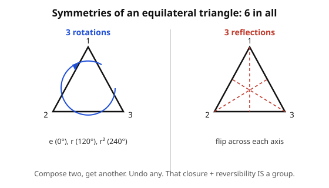

# Abstract Algebra · Lesson 1.1: What is a group? Axioms and first examples

> ⏱ ~15 min · Module 1: Groups — symmetry made precise · Builds on: the proof habits of [proofs-primer](../../proofs-primer/syllabus.md) · Unlocks: [1.2 Cyclic groups and order](01-02-cyclic-groups-order.md)

## Why this matters

Rotate a square by 90°, flip a molecule across a plane, shuffle a deck, add two hours to a clock, invert a matrix — these look like different subjects, but they all obey the *same four rules*. Abstract algebra is the decision to study those rules directly instead of re-deriving them in every setting. The payoff is enormous: prove something once about "groups" and it holds for symmetries of crystals, solutions of polynomial equations, quantum states, and error-correcting codes all at once. A **group** is the distilled essence of "a reversible operation," and this lesson pins down exactly what that means. Everything in the course — rings, fields, Galois theory — is built on it.

## The idea

Look at an equilateral triangle. Which rigid motions leave it sitting in exactly the same spot (allowing the corners to swap)? There are six: do nothing, rotate 120°, rotate 240°, and three flips across the axes through each vertex. Call this collection of motions a *thing*, and notice three facts about it.

**They combine.** Do one motion, then another, and the net result is again one of the six — never something new. Rotating 120° then flipping is *some* flip; you can't escape the set by composing.

**One of them does nothing.** "Leave it alone" is a legitimate motion, and combining it with anything changes nothing. It's the reference point.

**Each one undoes.** Rotate 120° clockwise and you can rotate 120° back; flip and flip again to return. Every motion has a partner that cancels it.

That's the whole story. A group is any set equipped with a way to combine two elements into a third, where combining stays inside the set, there's a "do nothing" element, and everything is reversible. The triangle is just a picture of it. Strip the picture away and keep the rules, and the same skeleton turns up in the integers under addition, the nonzero reals under multiplication, and a hundred other places.

## The formal version

A **group** is a set $G$ together with a **binary operation** $\circ$ — a rule that takes two elements $a, b \in G$ and returns an element $a \circ b$ — satisfying four axioms:

- **(G1) Closure.** For all $a, b \in G$, the result $a \circ b$ is again in $G$.
  *In words:* combining two elements never throws you out of the set.
- **(G2) Associativity.** For all $a, b, c \in G$, $\ (a \circ b) \circ c = a \circ (b \circ c)$.
  *In words:* when you combine three in a row, where you put the parentheses doesn't matter — so "$a \circ b \circ c$" is unambiguous.
- **(G3) Identity.** There exists an element $e \in G$ with $e \circ a = a \circ e = a$ for every $a \in G$.
  *In words:* there's a "do nothing" element that leaves everything unchanged.
- **(G4) Inverses.** For each $a \in G$ there exists $a^{-1} \in G$ with $a \circ a^{-1} = a^{-1} \circ a = e$.
  *In words:* every element can be undone.

The element $a \circ b$ is often written just $ab$, and we call it the **product** even when $\circ$ isn't multiplication of numbers. We write $|G|$ for the number of elements, the **order** of the group.

Notice what is *not* required: that $a \circ b = b \circ a$. When that extra symmetry *does* hold — $ab = ba$ for all $a, b$ — we call the group **abelian** (after Niels Abel). Abelian groups are the "commutative" ones. The triangle's symmetries are *not* abelian: rotate-then-flip differs from flip-then-rotate, which is exactly why nonabelian groups carry more information and are the interesting case.

### First examples

- **$(\mathbb{Z}, +)$ — the integers under addition.** Closed (integer + integer is an integer), associative, identity $e = 0$, and the inverse of $n$ is $-n$. Abelian. The prototype.
- **$(\mathbb{Z}/n\mathbb{Z}, +)$ — clock arithmetic.** The elements are remainders $\{0, 1, \dots, n-1\}$, added mod $n$: on a 12-hour clock, $9 + 5 = 2$. Identity $0$; the inverse of $k$ is $n - k$ (since $k + (n-k) = n \equiv 0$). Finite and abelian — our first finite group, and the one we build on in [1.2](01-02-cyclic-groups-order.md).
- **$(\mathbb{R}^*, \times)$ — nonzero reals under multiplication.** Here $\mathbb{R}^* = \mathbb{R} \setminus \{0\}$. Identity $1$; the inverse of $x$ is $1/x$. Why exclude $0$? Because $0$ has no multiplicative inverse — there is no real number $y$ with $0 \cdot y = 1$. Axiom (G4) *forces* us to throw $0$ out. Abelian.
- **Symmetries of a triangle (a preview).** The six motions above, under composition, form a group of order $6$ — the **dihedral group** $D_3$, our first *nonabelian* example. We dissect it in [1.3](01-03-dihedral-symmetric-groups.md).

### Non-examples (which axiom fails matters)

- **$(\mathbb{N}, +)$** — naturals $\{1, 2, 3, \dots\}$ under addition. Closed, associative, but **no inverses**: the undo of $3$ would be $-3$, which isn't a natural number. (G4) fails. (Even including $0$ for an identity, inverses still fail.)
- **$(\mathbb{Z}, \times)$** — integers under multiplication. Identity is $1$, but **no inverses**: the undo of $2$ would be $1/2 \notin \mathbb{Z}$. Only $\pm 1$ are invertible. (G4) fails.

Diagnosing *which* axiom breaks is the core skill — that's Problem 1.

## Picture

## Worked examples

**Example 1 (a clean axiom check — $(\mathbb{Z}/5\mathbb{Z}, +)$).** The set is $\{0, 1, 2, 3, 4\}$ with addition mod $5$. Run the checklist.

- **Closure:** adding two of these and reducing mod $5$ lands back in $\{0,1,2,3,4\}$ by definition of "remainder." E.g. $3 + 4 = 7 \equiv 2$. ✓
- **Associativity:** inherited from ordinary integer addition — $(a+b)+c$ and $a+(b+c)$ are equal as integers, hence equal after reducing mod $5$. ✓
- **Identity:** $0$, since $0 + k = k$ for every $k$. ✓
- **Inverses:** the inverse of $k$ is $5 - k$ (with $0$ its own inverse): $1{+}4 = 5 \equiv 0$, $2{+}3 = 5 \equiv 0$. Every element has one. ✓

All four hold, and $a + b = b + a$, so $(\mathbb{Z}/5\mathbb{Z}, +)$ is an **abelian group of order 5**.

**Example 2 (symmetries of a non-square rectangle — the Klein four-group $V$).** Take a rectangle that is *not* a square (so no 90° rotation survives). Its rigid symmetries are exactly four:

- $e$ — identity (do nothing),
- $h$ — flip across the horizontal axis,
- $v$ — flip across the vertical axis,
- $r$ — rotate $180°$.

Compose them and record results in a **Cayley table** (row element first, then column):

| $\circ$ | $e$ | $h$ | $v$ | $r$ |
|:---:|:---:|:---:|:---:|:---:|
| $e$ | $e$ | $h$ | $v$ | $r$ |
| $h$ | $h$ | $e$ | $r$ | $v$ |
| $v$ | $v$ | $r$ | $e$ | $h$ |
| $r$ | $r$ | $v$ | $h$ | $e$ |

Read off the axioms: every entry is one of the four elements (**closure**); $e$'s row and column are unchanged (**identity**); each element appears on the diagonal as $e$, so every element is *its own inverse* (**inverses** — e.g. flipping twice returns you home). Associativity holds because these are honest compositions of motions. So $V$ is a **group of order 4**.

Is it abelian? The table is **symmetric across the main diagonal** — $h \circ v = r = v \circ h$, and likewise for every pair — so **yes, $V$ is abelian**. This is the *Klein four-group*, the smallest group that isn't just a clock: unlike $\mathbb{Z}/4\mathbb{Z}$, here *every* non-identity element has order 2. We'll see in [1.2](01-02-cyclic-groups-order.md) why that makes it genuinely different.

### Consequences forced by the axioms

The four rules are spare, but they already pin down facts you'd otherwise take on faith. Each proof is a short exercise in the axiomatic reasoning from [proofs-primer](../../proofs-primer/syllabus.md).

- **The identity is unique.** Suppose $e$ and $e'$ both act as identities. Then $e = e \circ e' = e'$ — the first equality uses $e'$ as an identity, the second uses $e$. So there is only ever *one* "do nothing" element.
- **Inverses are unique.** If $b$ and $c$ both invert $a$, then $b = b \circ e = b \circ (a \circ c) = (b \circ a) \circ c = e \circ c = c$. (Associativity is the load-bearing step.) So "$a^{-1}$" names one specific element — Problem 2 asks you to reproduce this.
- **Cancellation.** If $ab = ac$, multiply both sides on the left by $a^{-1}$: $a^{-1}(ab) = a^{-1}(ac) \Rightarrow (a^{-1}a)b = (a^{-1}a)c \Rightarrow b = c$. In a group you may cancel a common factor — no "divide by zero" pitfalls, because every element is invertible.
- **Socks and shoes: $(ab)^{-1} = b^{-1}a^{-1}$.** Check it does the job: $(ab)(b^{-1}a^{-1}) = a(bb^{-1})a^{-1} = a\,e\,a^{-1} = aa^{-1} = e$. The undo of "socks then shoes" is "shoes off, then socks off" — reverse the order. In a nonabelian group the order genuinely matters; getting it backwards gives the wrong element.

## Watch out

- **Closure is a real condition, not bookkeeping.** The odd integers under addition fail immediately: $3 + 5 = 8$ is even. Always check that the operation can't escape the set before touching the other axioms.
- **The operation is half the data.** "$\mathbb{Z}$" is not a group — "$(\mathbb{Z}, +)$" is. The same set is a group under $+$ and a non-group under $\times$. Never name a group without naming its operation.
- **Abelian is the exception you must earn, not assume.** By default $ab \neq ba$. Writing $(ab)^{-1} = a^{-1}b^{-1}$ silently assumes commutativity and is *wrong* in general — the socks-and-shoes reversal is the correct rule.
- **"Identity" means two-sided.** $e \circ a = a \circ e = a$ must hold on both sides; likewise inverses must cancel from both sides. In an abelian group these coincide, but don't assume it before you've checked commutativity.

## One-liner

> A group is a set where one operation can always be done and always be undone — closure, associativity, an identity to do nothing, and an inverse to take everything back.

## Problems

**P1 (🟢)** For each of the following, decide whether it is a group. If not, name the *first* axiom that fails and give a witness.
(a) $(\mathbb{Q}, \times)$ — all rationals under multiplication.
(b) The odd integers under multiplication.

**P2 (🟡)** Prove directly from the axioms that inverses are unique: if $a \circ b = a \circ c = e$ and also $b \circ a = c \circ a = e$, then $b = c$. State which axiom each step uses.

**P3 (🔴)** Let $GL_2(\mathbb{R})$ be the set of $2\times 2$ real matrices with nonzero determinant, under matrix multiplication. Show it is a group, and show it is nonabelian by exhibiting a witness pair $A, B$ with $AB \neq BA$.

Solutions

**P1.**

(a) **Not a group.** Closure, associativity, and identity ($1$) all hold, but **(G4) inverses fails**: the element $0 \in \mathbb{Q}$ has no multiplicative inverse (no rational $y$ with $0 \cdot y = 1$). Witness: $0$. *(Fix: $(\mathbb{Q}^*, \times)$, the nonzero rationals, is a group — same reason we excluded $0$ from $\mathbb{R}^*$.)*

(b) **Not a group** — and it fails *earlier*, at **(G3) identity**: the multiplicative identity is $1$, which *is* odd, so far so good — but check **(G4) inverses** with that identity: the odd integer $3$ needs an odd integer $y$ with $3y = 1$, i.e. $y = 1/3 \notin \mathbb{Z}$. No inverse. Witness: $3$. *(Closure is actually fine here — odd $\times$ odd $=$ odd — so the honest first failure is inverses, not closure. Naming the right axiom is the point.)*

**P2.** We show $b = c$ using only the axioms.

$$b = b \circ e \quad(\text{G3, identity})$$
$$= b \circ (a \circ c) \quad(\text{given } a \circ c = e)$$
$$= (b \circ a) \circ c \quad(\text{G2, associativity})$$
$$= e \circ c \quad(\text{given } b \circ a = e)$$
$$= c \quad(\text{G3, identity}).$$

Hence any two inverses of $a$ are equal, so the inverse is unique. (Associativity is the essential move — without it the third step collapses.)

**P3.** *Closure:* if $\det A \neq 0$ and $\det B \neq 0$, then $\det(AB) = \det A \cdot \det B \neq 0$, so $AB \in GL_2(\mathbb{R})$. ✓
*Associativity:* matrix multiplication is associative (it represents composition of linear maps, and composition of functions is always associative). ✓
*Identity:* the matrix $I = \begin{pmatrix} 1 & 0 \\ 0 & 1 \end{pmatrix}$ has $\det I = 1 \neq 0$ and satisfies $IA = AI = A$. ✓
*Inverses:* $\det A \neq 0$ is *exactly* the condition for $A^{-1}$ to exist, and $\det(A^{-1}) = 1/\det A \neq 0$, so $A^{-1} \in GL_2(\mathbb{R})$. ✓
So $GL_2(\mathbb{R})$ is a group. (This is the general linear group; see [linalg-refresher](../../linalg-refresher/syllabus.md) for why invertibility $\Leftrightarrow$ nonzero determinant.)

*Nonabelian — a witness pair:* take
$$A = \begin{pmatrix} 1 & 1 \\ 0 & 1 \end{pmatrix}, \qquad B = \begin{pmatrix} 1 & 0 \\ 1 & 1 \end{pmatrix}.$$
Then
$$AB = \begin{pmatrix} 1 & 1 \\ 0 & 1 \end{pmatrix}\begin{pmatrix} 1 & 0 \\ 1 & 1 \end{pmatrix} = \begin{pmatrix} 2 & 1 \\ 1 & 1 \end{pmatrix}, \qquad BA = \begin{pmatrix} 1 & 0 \\ 1 & 1 \end{pmatrix}\begin{pmatrix} 1 & 1 \\ 0 & 1 \end{pmatrix} = \begin{pmatrix} 1 & 1 \\ 1 & 2 \end{pmatrix}.$$
Since $AB \neq BA$, the group is nonabelian. (Both $A, B$ have determinant $1 \neq 0$, so they genuinely live in $GL_2(\mathbb{R})$.)

## Connections

- **Backward:** every proof in "consequences forced by the axioms" is the [proofs-primer](../../proofs-primer/syllabus.md) discipline in miniature — assume only the four rules, chain equalities, cite each justification. Uniqueness-of-identity is a textbook "suppose two, show they're equal" argument.
- **Forward:** [1.2](01-02-cyclic-groups-order.md) zooms in on the simplest groups — those generated by a single element, like the clock $\mathbb{Z}/n\mathbb{Z}$ — and introduces the *order* of an element. [1.3](01-03-dihedral-symmetric-groups.md) develops the triangle's nonabelian symmetry group $D_3$ and the symmetric groups $S_n$ of all shuffles.
- **Sideways (linear algebra):** $GL_2(\mathbb{R})$ from Problem 3 generalizes to $GL_n(\mathbb{R})$, the invertible matrices — the bridge between this course and [linalg-refresher](../../linalg-refresher/syllabus.md). Groups of matrices are where abstract algebra meets geometry.
- **Sideways (physics):** "the symmetries of a system form a group" is the organizing principle of modern physics — rotational symmetry, particle conservation laws, and the structure of quantum states all come from group theory. The machinery that turns these abstract groups into concrete matrices acting on states is *representation theory*, which this course sets up and [representation-theory](../../representation-theory/syllabus.md) develops in full.
