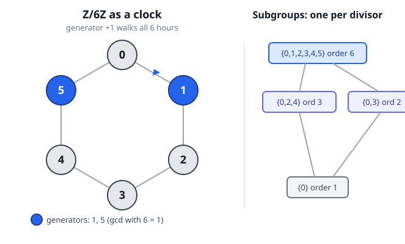

# Abstract Algebra · Lesson 1.2: Cyclic groups and order

> ⏱ ~15 min · Module 1: Groups and first structure · Builds on: [1.1 What is a group?](01-01-group-axioms-first-examples.md) · Unlocks: [1.3 Dihedral and symmetric groups](01-03-dihedral-symmetric-groups.md)

## Why this matters

Before we meet the wild groups — symmetries of a cube, shuffles of a deck, rotations of spacetime — we should own the tame ones completely. **Cyclic groups are the simplest groups there are**, and they're the only infinite family we will ever understand *totally*: we can name every element, every generator, and every subgroup by hand. They're also everywhere in disguise. The hours on a clock, the roots of unity in the complex plane, the exponents in modular arithmetic, and the additive structure of $\mathbb{Z}$ itself are all *the same group wearing different clothes*. Nail cyclic groups now and half of the counting arguments in the rest of the course become one-liners.

## The idea

Take a single element $g$ and just keep applying the operation to it: $g$, then $g\cdot g$, then $g\cdot g\cdot g$, and so on (plus the inverses going the other way). The set of everything you reach this way is the **cyclic group generated by $g$**. It is the smallest group containing $g$ — nothing more than "$g$ and its consequences."

Two things can happen. Either you keep landing on brand-new elements forever (that's $\mathbb{Z}$: $\dots,-2,-1,0,1,2,\dots$ as repeated $+1$), or you eventually loop back to where you started — like a clock, where after 12 hours you're home again. That looping number, **the first time $g$ powers back to the identity**, is the *order* of $g$, and it is the single most important number attached to an element. "Cyclic" is exactly the mental image: walk around a circle in fixed steps, and after finitely many steps you return.

The punchline of the whole lesson: **that's the entire zoo.** Up to relabeling, there is exactly one cyclic group of each finite size and exactly one infinite cyclic group. Clock arithmetic is not *an* example of a cyclic group — it *is* what cyclic groups are.

## The formal version

Fix a group $G$ with identity $e$, written multiplicatively (so $g^n$ means $g$ combined with itself $n$ times, and $g^{-n}=(g^{-1})^n$).

**Order of an element.** The **order** of $g$, written $|g|$ or $\operatorname{ord}(g)$, is the *smallest* integer $n>0$ with $g^n=e$. If no such $n$ exists, $g$ has **infinite order**.
*In words:* how many steps until $g$ marches back to the identity.

**Order of a group.** The **order of $G$**, written $|G|$, is simply the number of elements in $G$ (possibly infinite). Same word, two meanings — one counts steps, one counts elements — and Lesson 1.5 will glue them together.

**Cyclic group.** $G$ is **cyclic** if there is some $g\in G$ with
$$\langle g\rangle := \{\,g^k : k\in\mathbb{Z}\,\} = G.$$
Such a $g$ is a **generator**, and $\langle g\rangle$ reads "the subgroup generated by $g$." *In words:* one element's powers sweep out the whole group.

Here $|\langle g\rangle| = |g|$: the size of the group a single element generates equals that element's order. (If $|g|=n$, its distinct powers are exactly $e,g,g^2,\dots,g^{n-1}$, then it repeats.)

**Classification theorem.** Every cyclic group is isomorphic to exactly one of:
$$(\mathbb{Z},+) \quad(\text{infinite}), \qquad (\mathbb{Z}/n\mathbb{Z},+)\quad(\text{finite of order } n).$$
*In words:* there is essentially **one** cyclic group of each order. "$\cong$" (isomorphic) means there's a relabeling of elements that turns one group's operation table into the other's — same structure, different names. (We'll define isomorphism precisely in Module 2; for now trust the picture: matching group tables.)

**Additive vs. multiplicative notation.** Same object, two dialects. In $\mathbb{Z}/n\mathbb{Z}$ the operation is *addition mod $n$*, so "powers of $g$" are really *multiples*: $g^k$ becomes $k\cdot g$, and $g^n=e$ becomes $n\cdot g\equiv 0$. When the group is roots of unity or a multiplicative group mod a prime, we write $g^k$ literally. Don't let the notation fool you into thinking these are different worlds.

**Generators of $\mathbb{Z}/n\mathbb{Z}$.** The element $k$ generates $\mathbb{Z}/n\mathbb{Z}$ **iff** $\gcd(k,n)=1$. So the number of generators is $\varphi(n)$ (Euler's totient — how many of $1,\dots,n$ are coprime to $n$).
*In words:* a step size generates the whole clock exactly when it shares no factor with $n$; otherwise it gets trapped on a sub-cycle.

**Subgroups of a cyclic group.** Every subgroup of a cyclic group is itself cyclic. For $\mathbb{Z}/n\mathbb{Z}$ there is **exactly one subgroup of order $d$ for each divisor $d\mid n$** — no more, no fewer. (This clean lattice is what problem 🔴 asks you to prove.)

**Order of a power.** In a cyclic group of order $n$, for any $k$,
$$\operatorname{ord}(g^k) = \frac{n}{\gcd(n,k)}.$$
*In words:* raising $g$ to the $k$ divides its order down by whatever $k$ shares with $n$. This one formula computes every element's order at a glance — no repeated multiplying.

## Picture

The hexagon is $\mathbb{Z}/6\mathbb{Z}$: start at $0$ and take steps of $+1$ to visit all six "hours." The blue nodes $1$ and $5$ are the two generators (the $k$ with $\gcd(k,6)=1$, and indeed $\varphi(6)=2$). Step by $+2$ instead and you're trapped on $\{0,2,4\}$ — the order-3 subgroup. The lattice on the right shows there's exactly one subgroup per divisor of $6$: orders $1,2,3,6$.

## Worked examples

**Example 1 (own $\mathbb{Z}/12\mathbb{Z}$ completely).** Here $n=12$, so $g=1$ is a generator and every element is $k\cdot 1$. Use $\operatorname{ord}(k)=\dfrac{12}{\gcd(12,k)}$.

| $k$ | $\gcd(12,k)$ | $\operatorname{ord}(k)=12/\gcd$ |
|---|---|---|
| $1$ | $1$ | $12$ |
| $3$ | $3$ | $4$ |
| $4$ | $4$ | $3$ |
| $8$ | $4$ | $3$ |
| $9$ | $3$ | $4$ |
| $10$ | $2$ | $6$ |

*All generators* are the $k$ with $\gcd(12,k)=1$: namely $1,5,7,11$ — that's $\varphi(12)=4$ of them, matching the "order $12$" rows you'd get for each.

*All subgroups*, one per divisor of $12$ (divisors $1,2,3,4,6,12$). The order-$d$ subgroup is generated by $\tfrac{12}{d}$:
$$\{0\},\ \ \langle 6\rangle=\{0,6\},\ \ \langle 4\rangle=\{0,4,8\},\ \ \langle 3\rangle=\{0,3,6,9\},\ \ \langle 2\rangle=\{0,2,4,6,8,10\},\ \ \mathbb{Z}/12\mathbb{Z}.$$
Six divisors, six subgroups. That's the whole subgroup structure — nothing hidden.

**Example 2 (a *multiplicative* cyclic group).** The nonzero residues mod $5$ under *multiplication*, written $(\mathbb{Z}/5\mathbb{Z})^*=\{1,2,3,4\}$, form a group of order $4$. Is it cyclic? Test $g=2$ by taking literal powers mod $5$:
$$2^1=2,\quad 2^2=4,\quad 2^3=8\equiv 3,\quad 2^4=16\equiv 1.$$
So $\langle 2\rangle=\{2,4,3,1\}$ — all four elements. Yes, cyclic, with $2$ a generator, hence $(\mathbb{Z}/5\mathbb{Z})^*\cong\mathbb{Z}/4\mathbb{Z}$. Read off orders from the cycle: $\operatorname{ord}(2)=4$, $\operatorname{ord}(4)=2$ (since $4^2=16\equiv1$), $\operatorname{ord}(3)=4$, $\operatorname{ord}(1)=1$.

Two lessons in one here. First, "cyclic" is about *structure*, not about which symbol you write for the operation — this multiplicative group is a relabeled $\mathbb{Z}/4\mathbb{Z}$. Second, don't expect it for free: $(\mathbb{Z}/8\mathbb{Z})^*=\{1,3,5,7\}$ has *every* non-identity element of order $2$ ($3^2=9\equiv1$, $5^2=25\equiv1$, $7^2=49\equiv1$), so no single generator exists — it is **not** cyclic. That $(\mathbb{Z}/p\mathbb{Z})^*$ *is* cyclic for every prime $p$ is a real theorem (Module 4 proves it for all finite fields); $8$ isn't prime, and the pattern breaks.

## Watch out

- **"Order" is overloaded.** Order *of an element* = steps back to $e$; order *of a group* = element count. Same word, and they're deeply related (Lagrange, 1.5), but never conflate them mid-sentence.
- **The order-of-a-power formula needs a *finite* cyclic group of known order $n$.** $\operatorname{ord}(g^k)=n/\gcd(n,k)$ is a statement about $\langle g\rangle$ of size $n$, not about a random element of some huge group. Find the ambient cyclic order first.
- **Generator $\ne$ "small."** In $\mathbb{Z}/12\mathbb{Z}$, $11$ generates just as surely as $1$ does (it's $-1$, stepping backward around the clock). Coprimality is the test — not size, not being "first."
- **Additive habits leaking into multiplicative groups (and vice versa).** In $\mathbb{Z}/6\mathbb{Z}$ the identity is $0$ and you *add*; in $(\mathbb{Z}/5\mathbb{Z})^*$ the identity is $1$ and you *multiply*. Writing $g^k=e$ vs. $k g=0$ is the same equation in two dialects — keep track of which room you're in.
- **Not every group is cyclic.** Cyclic is the *easy* case, not the general one. The moment a group needs two elements to generate it (the symmetries in 1.3), you leave this comfortable world.

## One-liner

> A cyclic group is one element's powers marching around a clock; up to relabeling it's just $\mathbb{Z}$ or $\mathbb{Z}/n\mathbb{Z}$, its generators are the steps coprime to $n$, and it has exactly one subgroup per divisor.

## Problems

**P1 (🟢)** In $\mathbb{Z}/10\mathbb{Z}$: (a) find the order of $2$, $5$, and $6$; (b) list *all* generators of the group.

**P2 (🟡)** Let $G$ be a group with $|G|=p$ where $p$ is prime. Prove $G$ is cyclic, and that its only subgroups are $\{e\}$ and $G$ itself. (You may use the fact — a Lagrange preview — that the order of any element divides $|G|$.)

**P3 (🔴)** Let $G=\langle g\rangle$ be cyclic of order $n$. Show that for each divisor $d\mid n$ there is **exactly one** subgroup of order $d$. (Both parts: it *exists*, and it's *unique*.)

Solutions

**P1.** Use $\operatorname{ord}(k)=\dfrac{10}{\gcd(10,k)}$.
(a) $\operatorname{ord}(2)=\tfrac{10}{\gcd(10,2)}=\tfrac{10}{2}=5$; $\operatorname{ord}(5)=\tfrac{10}{\gcd(10,5)}=\tfrac{10}{5}=2$; $\operatorname{ord}(6)=\tfrac{10}{\gcd(10,6)}=\tfrac{10}{2}=5$.
Sanity check on $5$: $5+5=10\equiv0$, so order $2$. ✓ And on $2$: $2,4,6,8,0$ — five steps home. ✓
(b) Generators are the $k$ with $\gcd(k,10)=1$: $k=1,3,7,9$. (That's $\varphi(10)=4$; note $10=2\cdot5$ gives $\varphi=10(1-\tfrac12)(1-\tfrac15)=4$.)

**P2.** Since $p\ge 2$ is prime, $G$ has some element $g\ne e$. Let $d=\operatorname{ord}(g)$. Then $\langle g\rangle$ is a subgroup of order $d$, and by the given fact $d\mid p$. Because $p$ is prime, $d\in\{1,p\}$. But $g\ne e$ forces $d\ne1$, so $d=p$. Hence $\langle g\rangle$ has $p$ elements — all of $G$ — so $G=\langle g\rangle$ is cyclic.

Now let $H\le G$ be any subgroup. Its order $|H|$ divides $p$ (same fact, applied to the subgroup), so $|H|\in\{1,p\}$: either $H=\{e\}$ or $H=G$. There are no nontrivial proper subgroups. $\blacksquare$

*(Takeaway: prime order is the most rigid possible structure — the group is forced to be cyclic, and it has no interior at all.)*

**P3.** Write $G=\{e,g,g^2,\dots,g^{n-1}\}$ with $g^n=e$, and fix a divisor $d\mid n$; set $m=n/d$.

*Existence.* Consider $H=\langle g^{m}\rangle$. By the order-of-a-power formula, $\operatorname{ord}(g^{m})=\dfrac{n}{\gcd(n,m)}=\dfrac{n}{m}=d$ (since $m\mid n$ gives $\gcd(n,m)=m$). So $H$ is a subgroup of order exactly $d$. Existence done.

*Uniqueness.* Suppose $K\le G$ also has order $d$. Every element of $G$ is a power $g^k$, so $K$ consists of certain powers of $g$; let $g^{k}$ be an element of $K$ with $k$ the smallest positive exponent appearing. A standard fact (division algorithm) shows $K=\langle g^{k}\rangle$: any $g^{j}\in K$ has $j=qk+r$ with $0\le r<k$, and $g^{r}=g^{j}(g^{k})^{-q}\in K$, so minimality forces $r=0$, i.e. $k\mid j$. Thus $K$ is cyclic, generated by $g^{k}$, and
$$|K|=\operatorname{ord}(g^{k})=\frac{n}{\gcd(n,k)}=d \ \Longrightarrow\ \gcd(n,k)=\frac{n}{d}=m.$$
So $m\mid k$, which means $g^{k}\in\langle g^{m}\rangle=H$; hence $K=\langle g^k\rangle\subseteq H$. Two finite subgroups with $K\subseteq H$ and $|K|=|H|=d$ must be equal, so $K=H$. Therefore the order-$d$ subgroup is unique. $\blacksquare$

*(This is the theorem behind the tidy "one subgroup per divisor" lattice in the Picture — and it fails spectacularly for non-cyclic groups, where a single order can host many subgroups.)*

## Connections

- **Backward:** $\mathbb{Z}/n\mathbb{Z}$ and $\mathbb{Z}$ arrived in [1.1](01-01-group-axioms-first-examples.md) as first examples; now we see they aren't just examples — they are the *complete list* of cyclic groups. The axiom-checking you did there is what guarantees $\langle g\rangle$ is genuinely a group.
- **Forward (1.5):** "$\operatorname{ord}(g)$ divides $|G|$," which P2 used as a gift, is exactly **Lagrange's theorem** — the bridge between the two meanings of "order." [1.5 Cosets and Lagrange](01-05-cosets-lagrange.md) proves it, and P2 becomes a two-line corollary.
- **Forward (Module 3):** the *same* set $\mathbb{Z}/n\mathbb{Z}$ gains a second operation (multiplication) to become a **ring** in [3.1](03-01-rings-ring-homomorphisms.md); today's additive cyclic group is half of that richer object.
- **Forward (Module 4):** Example 2's "$(\mathbb{Z}/5\mathbb{Z})^*$ is cyclic" generalizes to the deep fact that the multiplicative group $\mathrm{GF}(p^n)^*$ of *any* finite field is cyclic — the engine behind primitive roots and finite-field cryptography. See [4.3 Finite fields](04-03-finite-fields.md).
- **Sideways (number theory):** the generator count $\varphi(n)$ and the subgroup-per-divisor structure are Euler's totient and the identity $\sum_{d\mid n}\varphi(d)=n$ in group-theoretic disguise. In plain terms, this is the mathematics of **modular ("clock") arithmetic** — the reason $7$ o'clock plus $8$ hours is $3$ o'clock, made structural.
