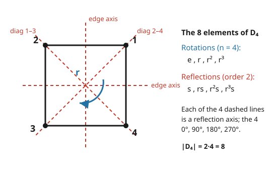

# Abstract Algebra · Lesson 1.3: Dihedral and symmetric groups

> ⏱ ~15 min · Module 1: Groups and structure · Builds on: [1.2 Cyclic groups and order](01-02-cyclic-groups-order.md) · Unlocks: [1.4 Subgroups](01-04-subgroups.md)

## Why this matters

So far every group you've met commutes: $\mathbb{Z}$, $\mathbb{Z}/n\mathbb{Z}$, any cyclic group. That's comfortable and completely unrepresentative. The moment symmetry gets *geometric* — rotating a square, shuffling a deck, permuting the roots of a polynomial — order stops mattering: **doing $A$ then $B$ is generally not the same as doing $B$ then $A$.** This lesson introduces the two families that every algebraist keeps in their pocket as the standard nonabelian examples: the **dihedral groups** $D_n$ (symmetries of a shape) and the **symmetric groups** $S_n$ (all rearrangements of a list). Between them they generate almost every finite group you'll ever want to test a conjecture against.

## The idea

Pick up a regular $n$-gon and ask: *what rigid motions leave it looking identical?* You can **rotate** it by a multiple of $\frac{2\pi}{n}$ — $n$ of those, counting "don't move" — and you can **flip** it over any of its $n$ axes of symmetry. That's $2n$ motions total, and they form a group under composition: the **dihedral group $D_n$**. It's built from two moves, a rotation $r$ and a single flip $s$, and the entire structure comes down to one fact about how a flip talks to a rotation: **flipping, rotating, then flipping again reverses the rotation.**

The symmetric group is even more basic. Forget geometry: just take the set $\{1,2,\dots,n\}$ and consider every possible way to shuffle it — every **bijection** from the set to itself. Compose two shuffles and you get a third; each has an undo. That's $S_n$, and it has $n!$ elements. It's the *most* nonabelian thing around — in fact every finite group hides inside some $S_n$ (that's Cayley's theorem, coming in Module 2), so understanding permutations is understanding groups in general.

The connection: a symmetry of the $n$-gon *is* a permutation of its $n$ corners. So $D_n$ lives inside $S_n$ — a small, rigid subgroup of the vast set of all shuffles.

## The formal version

**Dihedral group.** $D_n$ is the group of symmetries of a regular $n$-gon, with $|D_n| = 2n$. It is generated by two elements:

- $r$ = rotation by $\frac{2\pi}{n}$, with **order** $n$ (i.e. $r^n = e$ and no smaller power is $e$);
- $s$ = any one reflection, with **order** $2$ (a flip undoes itself: $s^2 = e$);

subject to the **braiding relation**
$$s\,r\,s = r^{-1} \qquad(\text{equivalently } sr = r^{-1}s,\ \text{ or } sr^k = r^{-k}s).$$

In words: *conjugating a rotation by a flip turns it into the opposite rotation.* Every element is then either a pure rotation or a rotation-followed-by-flip:
$$D_n = \{\,e, r, r^2, \dots, r^{n-1},\ s, rs, r^2s, \dots, r^{n-1}s\,\}.$$
That's $n + n = 2n$ distinct elements, and the relation lets you rewrite *any* product into this normal form. ($r^k$ here means "rotate $k$ steps"; $r^k s$ means "flip, then rotate $k$ steps.")

**Symmetric group.** $S_n$ is the group of all bijections $\sigma:\{1,\dots,n\}\to\{1,\dots,n\}$ under composition, with $|S_n| = n!$.

**Cycle notation.** Write $\sigma$ as a product of **disjoint cycles**. The cycle $(a_1\,a_2\,\cdots\,a_k)$ means $a_1\mapsto a_2\mapsto\cdots\mapsto a_k\mapsto a_1$; anything not listed is fixed. In words: *follow where each element goes until you loop back, then start a new cycle with an untouched element.* Disjoint cycles commute (they move disjoint stuff), and this decomposition is unique up to reordering.

> **Convention (fixed for this whole course): we compose right-to-left, like functions.** In a product $\sigma\tau$, apply $\tau$ **first**, then $\sigma$. So $(\sigma\tau)(i) = \sigma(\tau(i))$.

**Order of a permutation.** If $\sigma$ has disjoint-cycle lengths $\ell_1,\dots,\ell_m$, then
$$\mathrm{ord}(\sigma) = \operatorname{lcm}(\ell_1,\dots,\ell_m).$$
In words: *each cycle returns home after its own length; the whole thing resets when they all coincide.*

**Sign / parity.** Every permutation is a product of **transpositions** (2-cycles). The number of transpositions isn't unique, but its **parity** is: a permutation is **even** or **odd**, never both (proved in P3). Define
$$\operatorname{sgn}(\sigma) = (-1)^{\#\text{transpositions}} \in \{+1,-1\}.$$
A $k$-cycle is a product of $k-1$ transpositions, so $\operatorname{sgn}$ of a $k$-cycle is $(-1)^{k-1}$. Crucially, $\operatorname{sgn}:S_n\to\{\pm1\}$ is a **homomorphism** — $\operatorname{sgn}(\sigma\tau)=\operatorname{sgn}(\sigma)\operatorname{sgn}(\tau)$ — and the even permutations (its kernel) form the **alternating group** $A_n$, with $|A_n| = n!/2$.

**The embedding.** Number the corners of the $n$-gon $1,\dots,n$. Every symmetry permutes them, giving an injective homomorphism $D_n \hookrightarrow S_n$: rotation $r$ becomes the $n$-cycle $(1\,2\,\cdots\,n)$, and each reflection becomes a product of transpositions.

## Picture

## Worked examples

**Example 1 (the guts of $D_4$).** Label the square's corners $1,2,3,4$. Take $r=(1\,2\,3\,4)$ (rotate one step) and $s=(2\,4)$ (the reflection across the $1$–$3$ diagonal: it fixes $1,3$ and swaps $2,4$). The eight elements are exactly
$$\{\,e,\ r,\ r^2,\ r^3,\ s,\ rs,\ r^2s,\ r^3s\,\}.$$

*Verify the braiding relation $srs = r^{-1}$.* Compose right-to-left, tracking each corner through $s$, then $r$, then $s$:

| start | after $s$ | after $r$ | after $s$ | net |
|---|---|---|---|---|
| $1$ | $1$ | $2$ | $4$ | $1\mapsto4$ |
| $2$ | $4$ | $1$ | $1$ | $2\mapsto1$ |
| $3$ | $3$ | $4$ | $2$ | $3\mapsto2$ |
| $4$ | $2$ | $3$ | $3$ | $4\mapsto3$ |

So $srs = (1\,4\,3\,2) = (1\,2\,3\,4)^{-1} = r^{-1}$. ✓ The flip really does reverse the rotation.

*See noncommutativity directly.* Compute both orders (right-to-left again):
$$rs:\quad 1\mapsto2,\ 2\mapsto1,\ 3\mapsto4,\ 4\mapsto3 \ \Rightarrow\ rs = (1\,2)(3\,4),$$
$$sr:\quad 1\mapsto4,\ 4\mapsto1,\ 2\mapsto3,\ 3\mapsto2 \ \Rightarrow\ sr = (1\,4)(2\,3).$$
$rs \neq sr$ — order matters. (Consistency check: the relation predicts $sr = r^{-1}s = r^3s$, and indeed $r^3s = (1\,4\,3\,2)(2\,4) = (1\,4)(2\,3)$. ✓)

**Example 2 (permutation arithmetic in $S_4$).** Multiply $(1\,2\,3)(2\,4)$ — apply $(2\,4)$ first, then $(1\,2\,3)$:

| $i$ | after $(2\,4)$ | after $(1\,2\,3)$ | net |
|---|---|---|---|
| $1$ | $1$ | $2$ | $1\mapsto2$ |
| $2$ | $4$ | $4$ | $2\mapsto4$ |
| $3$ | $3$ | $1$ | $3\mapsto1$ |
| $4$ | $2$ | $3$ | $4\mapsto3$ |

Reading off $1\mapsto2\mapsto4\mapsto3\mapsto1$:
$$(1\,2\,3)(2\,4) = (1\,2\,4\,3).$$
**Order:** it's a single $4$-cycle, so $\operatorname{lcm}(4) = 4$. **Sign:** a $4$-cycle $=$ three transpositions, so $\operatorname{sgn} = (-1)^3 = -1$ (odd). Cross-check via the homomorphism: $\operatorname{sgn}(1\,2\,3)=+1$ (even, a $3$-cycle) and $\operatorname{sgn}(2\,4)=-1$ (a transposition), and $(+1)(-1) = -1$. ✓

## Watch out

- **Which side does the flip go on?** With the right-to-left convention, $rs$ means "$s$ then $r$." Flip the convention and you'll swap $rs\leftrightarrow sr$ everywhere. Pick one — we chose right-to-left, like function composition — and never waver mid-computation.
- **Disjoint cycles commute; overlapping ones do not.** $(1\,2)(3\,4)=(3\,4)(1\,2)$ (they touch nothing in common), but $(1\,2\,3)(2\,4)\neq(2\,4)(1\,2\,3)$. Only reorder cycles freely once they're *disjoint*.
- **Order is the lcm, not the sum or the max.** A permutation of shape $(3\text{-cycle})(2\text{-cycle})$ has order $\operatorname{lcm}(3,2)=6$, not $5$ and not $3$.
- **$s^2 = e$, but $s$ isn't central.** Every reflection is its own inverse, yet it fails to commute with $r$. "Self-inverse" is about $s$ alone; "commutes" is about $s$ and $r$ together — different questions.

## One-liner

> $D_n$ is $n$ rotations and $n$ flips glued by $srs=r^{-1}$; $S_n$ is every shuffle of $n$ things, read off as disjoint cycles whose lengths give order (lcm) and parity (sign).

## Problems

**P1 (🟢)** In $S_6$, the permutation $\sigma$ acts by
$$1\mapsto3,\quad 2\mapsto5,\quad 3\mapsto6,\quad 4\mapsto4,\quad 5\mapsto2,\quad 6\mapsto1.$$
Write $\sigma$ in disjoint-cycle form, and find its order and its sign.

**P2 (🟡)** Work in $D_5$ (order $10$), with $r$ of order $5$, $s$ of order $2$, and $sr^k = r^{-k}s$.
(a) Simplify $r^2\,s\,r^3$ to the normal form $r^a$ or $r^a s$.
(b) Count how many elements of $D_5$ have each possible order.

**P3 (🔴)** Prove that no permutation is both even and odd — i.e. $\operatorname{sgn}$ is well-defined — so that a permutation's parity doesn't depend on how you factor it into transpositions.

Solutions

**P1.** Trace the orbits. Start at $1$: $1\mapsto3\mapsto6\mapsto1$, giving the cycle $(1\,3\,6)$. Next untouched element is $2$: $2\mapsto5\mapsto2$, giving $(2\,5)$. And $4$ is fixed. So
$$\sigma = (1\,3\,6)(2\,5).$$
**Order:** cycle lengths $3$ and $2$, so $\operatorname{ord}(\sigma)=\operatorname{lcm}(3,2)=6$.
**Sign:** the $3$-cycle is even ($2$ transpositions), the $2$-cycle is odd ($1$ transposition), total $3$ transpositions, so $\operatorname{sgn}(\sigma)=(-1)^3=-1$ (odd).

**P2.** (a) Push the $s$ to the right using $sr^3 = r^{-3}s$:
$$r^2\,s\,r^3 = r^2\,(s\,r^3) = r^2\,(r^{-3}s) = r^{-1}s = r^{4}s$$
(since $r^{-1}=r^{4}$ in $D_5$). So $r^2 s r^3 = r^4 s$.

(b) Split by type. The identity $e$ has order $1$ — that's $1$ element. The four nontrivial rotations $r, r^2, r^3, r^4$: because $5$ is prime, each generates all of $\langle r\rangle$, so **each has order $5$** — that's $4$ elements. Every reflection $r^k s$ ($k=0,\dots,4$) satisfies $(r^k s)^2 = r^k (s r^k) s = r^k r^{-k} s s = e$, and none is the identity, so **each has order $2$** — that's $5$ elements. Tally:
$$\text{order }1:\ 1,\qquad \text{order }2:\ 5,\qquad \text{order }5:\ 4,\qquad \text{total } 10. \checkmark$$

**P3.** Introduce the **Vandermonde polynomial** in variables $x_1,\dots,x_n$:
$$\Delta = \prod_{1\le i<j\le n}(x_i - x_j).$$
Let a permutation $\sigma$ act by relabeling indices: $\sigma\cdot\Delta = \prod_{i<j}(x_{\sigma(i)} - x_{\sigma(j)})$. Every factor $(x_{\sigma(i)}-x_{\sigma(j)})$ is $\pm$ one of the original factors, and no two land on the same one (because $\sigma$ is a bijection on the index pairs), so $\sigma\cdot\Delta = \pm\Delta$. Define
$$\varepsilon(\sigma) = \frac{\sigma\cdot\Delta}{\Delta}\in\{+1,-1\}.$$
This depends only on $\sigma$ — it's read straight off the polynomial, with no mention of transpositions.

*$\varepsilon$ is a homomorphism.* Acting by $\tau$ then $\sigma$ relabels twice, so $(\sigma\tau)\cdot\Delta = \sigma\cdot(\tau\cdot\Delta) = \sigma\cdot(\varepsilon(\tau)\Delta) = \varepsilon(\tau)\,(\sigma\cdot\Delta) = \varepsilon(\tau)\varepsilon(\sigma)\Delta$. Hence $\varepsilon(\sigma\tau)=\varepsilon(\sigma)\varepsilon(\tau)$.

*A transposition gives $-1$.* Take $\tau=(a\,b)$ with $a<b$. Swapping the labels $a$ and $b$ flips the sign of exactly the factors that involve $a$ or $b$: the single factor $(x_a-x_b)$, plus, for each index $k$ strictly between $a$ and $b$, the pair $(x_a-x_k)$ and $(x_k-x_b)$ trade in a way that flips one sign each. Counting them gives $2(b-a)-1$ sign changes — an **odd** number — so $\varepsilon\big((a\,b)\big) = (-1)^{\text{odd}} = -1$.

*Conclusion.* Suppose $\sigma$ is written as a product of $t$ transpositions. By the homomorphism property and the previous step,
$$\varepsilon(\sigma) = (-1)^t.$$
But $\varepsilon(\sigma)$ is a fixed number determined by $\sigma$ alone. Therefore $(-1)^t$ is the same for *every* factorization, i.e. the parity of $t$ is an invariant of $\sigma$. In particular $\sigma$ cannot be both even ($t$ even) and odd ($t$ odd), and we may legitimately set $\operatorname{sgn}(\sigma)=\varepsilon(\sigma)$. $\blacksquare$

## Flashback

**From Lesson 1.2 (Cyclic groups and order):** In $\mathbb{Z}/12\mathbb{Z}$ (integers mod $12$ under addition), find the order of the element $9$, and list every element that **generates** the whole group.

Solution

The order of $k$ in $\mathbb{Z}/n\mathbb{Z}$ is $\dfrac{n}{\gcd(k,n)}$. For $k=9$, $n=12$: $\gcd(9,12)=3$, so
$$\operatorname{ord}(9) = \frac{12}{3} = 4.$$
(Check: $9,18\equiv6,27\equiv3,36\equiv0$ — back to $0$ after $4$ steps. ✓)

An element $k$ generates all of $\mathbb{Z}/12\mathbb{Z}$ exactly when $\gcd(k,12)=1$ (order $12$). Those are
$$\{\,1,\ 5,\ 7,\ 11\,\}$$
— the units mod $12$, four of them (that's $\varphi(12)=4$). Note $9$ is *not* among them, consistent with its order being only $4$.

## Connections

- **Backward:** $D_n$ makes good on [1.1](01-01-group-axioms-first-examples.md)'s promise that groups need not be abelian — here's the first family where $ab\ne ba$ concretely. And the rotation part $\langle r\rangle$ is a straight lift of [1.2](01-02-cyclic-groups-order.md): $r$ generates a cyclic subgroup of order $n$ sitting inside $D_n$, so everything you know about cyclic order applies to rotations verbatim.
- **Forward:** [1.4 Subgroups](01-04-subgroups.md) will name $\langle r\rangle\le D_n$ and $A_n\le S_n$ as its headline examples. [2.4 Group actions](02-04-group-actions.md) formalizes exactly what we did informally — "$S_n$ acts on $\{1,\dots,n\}$" and "$D_n$ acts on the corners." [2.5 Conjugacy](02-05-orbits-stabilizers-conjugacy.md) reveals that the **cycle type** of a permutation is precisely its conjugacy class, and the boss problem in [2.6](02-06-burnside-counting.md) identifies the rotation group of a cube with $S_4$.
- **Sideways (linear algebra):** each permutation $\sigma$ becomes a **permutation matrix** $P_\sigma$ (a shuffled identity), and $\det P_\sigma = \operatorname{sgn}(\sigma)$ — the very same $\pm1$ from P3. The determinant's alternating sign *is* the sign homomorphism in disguise; see the [linear algebra refresher](../../linalg-refresher/syllabus.md).
