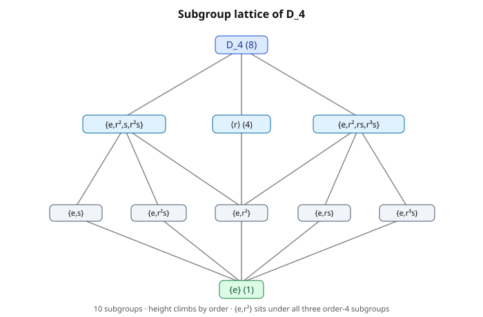

# Abstract Algebra · Lesson 1.4: Subgroups

> ⏱ ~15 min · Module 1: Groups and symmetry · Builds on: [1.3 Dihedral and symmetric groups](01-03-dihedral-symmetric-groups.md) · Unlocks: [1.5 Cosets and Lagrange's theorem](01-05-cosets-lagrange.md)

## Why this matters

A group is rarely handed to you clean. You meet a big, complicated symmetry group — all $24$ symmetries of a cube, all $n!$ shuffles of a deck — and the first thing you do is look for the *smaller groups living inside it*. The rotations sitting inside all symmetries. The even permutations inside all permutations. Those interior groups are **subgroups**, and almost every structural theorem in the course is a statement about how a group is built from its subgroups: Lagrange's theorem (next lesson) counts them, quotients (Module 2) collapse them, Galois theory (Module 4) mirrors a field tower against a subgroup tower. Learn to spot a subgroup fast and you've learned to take a group apart.

## The idea

A subgroup is exactly what the word promises: a subset that is *already a group* using the operation it inherited from the parent. Nothing new is invented — same multiplication, same identity — you just check that the subset doesn't "leak." If you multiply two elements of $H$, do you stay in $H$? If you invert one, are you still inside? If yes to both (and $H$ isn't empty), $H$ is a self-contained group riding inside $G$.

The payoff of that self-containment is that you get to reuse everything: associativity is automatic (it held in $G$, so it holds in any subset), and the identity and inverses are forced to be the *same ones $G$ already has*. So the whole verification collapses to "does this subset stay closed under the group's arithmetic?" — which is why the tests below are so short.

## The formal version

**Subgroup.** $H$ is a **subgroup** of $G$, written $H \leq G$, if $H \subseteq G$ and $H$ is itself a group under $G$'s operation. *In words: a subset that is already a group on its own.* Every group has two automatic subgroups: the whole group $G$ and the **trivial subgroup** $\{e\}$.

**Two-step subgroup test.** A subset $H \subseteq G$ is a subgroup iff:
1. $H \neq \varnothing$ (equivalently $e \in H$),
2. $a, b \in H \implies ab \in H$ (closed under the product), and
3. $a \in H \implies a^{-1} \in H$ (closed under inverses).

*In words: nonempty, and you can't multiply or invert your way out of it.* You do **not** re-check associativity (inherited) or that $e$ acts as identity (same $e$).

**One-step subgroup test.** $H$ is a subgroup iff $H \neq \varnothing$ and
$$a, b \in H \implies ab^{-1} \in H.$$
*In words: one combined move — take any two elements, and "$a$ undo $b$" lands back inside.* (Setting $a=b$ gives $e \in H$; then $a=e$ gives $b^{-1}\in H$; then general $a,b^{-1}$ gives closure — so this single condition packs all three above.)

**Finite shortcut.** If $H$ is a *finite* nonempty subset closed under the product, it is automatically a subgroup — closure alone forces inverses. *Reason:* for $a \in H$, the powers $a, a^2, a^3, \dots$ all lie in $H$ but $H$ is finite, so two powers collide, $a^i = a^j$ with $i<j$; then $a^{j-i}=e \in H$ and $a^{j-i-1}=a^{-1}\in H$. Inverses come free.

**Generated subgroup.** For a subset $S \subseteq G$, the **subgroup generated by $S$**, written $\langle S\rangle$, is the smallest subgroup containing $S$ — concretely, all finite products of elements of $S$ and their inverses. *In words: everything you can reach from $S$ using the group operations, and nothing more.* When $S=\{g\}$ this is the cyclic subgroup $\langle g\rangle = \{\dots, g^{-1}, e, g, g^2, \dots\}$ from [1.2](01-02-cyclic-groups-order.md).

**Center.** The **center** of $G$ is
$$Z(G) = \{\, g \in G : gx = xg \text{ for all } x \in G \,\}.$$
*In words: the elements that commute with absolutely everything.* $Z(G)$ is always a subgroup (proved in Problem 3), and it measures how far $G$ is from abelian: $Z(G) = G$ exactly when $G$ is abelian, and $Z(G) = \{e\}$ means the *only* universally-commuting element is the identity.

**Two facts to carry forward.** The **intersection** of any collection of subgroups is again a subgroup (if $a,b$ survive in every $H_i$, so does $ab^{-1}$ — the one-step test passes in each, hence in the intersection). The **union** usually is *not*: in $\mathbb{Z}$, $2\mathbb{Z}\cup 3\mathbb{Z}$ contains $2$ and $3$ but not $2+3=5$.

## Picture

The subgroups of a group, ordered by inclusion, form a **lattice** — a diagram where a line rising from $H$ to $K$ means $H \leq K$. Here is $D_4$, the symmetries of the square (with $r$ = quarter-turn, $s$ = a reflection), which has exactly ten subgroups.

Read it top-down: $D_4$ sits above three subgroups of order $4$ (the rotations $\langle r\rangle$ and two "rectangle" groups), each of which sits above subgroups of order $2$, all resting on $\{e\}$. The height of a node tracks its order — a preview of Lagrange, where **every** subgroup's order will be forced to divide $8$.

## Worked examples

**Example 1 (subgroup test on $D_4$).** $D_4 = \{e, r, r^2, r^3, s, rs, r^2s, r^3s\}$ with $r^4=e$, $s^2=e$, $sr=r^{-1}s$.

*The rotations.* Let $H=\langle r\rangle = \{e,r,r^2,r^3\}$. It's finite and nonempty, so by the finite shortcut I only check closure: $r^i r^j = r^{i+j \bmod 4}$ never leaves $\{e,r,r^2,r^3\}$. So $H \leq D_4$, with $|H|=4$. Since $|D_4|=8$, its **index** (number of copies needed to fill $D_4$, made precise in 1.5) is $8/4 = 2$.

*A single reflection.* Let $K=\langle s\rangle$. Powers of $s$: $s^2=e$, so $\langle s\rangle=\{e,s\}$, closed (both products $ss=e$, $se=s$ stay in) and finite — a subgroup of order $2$. Every reflection likewise generates its own order-$2$ subgroup, giving the five order-$2$ nodes in the picture.

**Example 2 (computing a center).** Find $Z(D_4)$. A rotation $r^k$ is central iff it commutes with $s$ (if it commutes with the reflection and with $r$, it commutes with everything, since $r,s$ generate). Using $sr = r^{-1}s = r^{3}s$:
$$s\,r^k = r^{-k}\,s = r^{4-k}\,s, \qquad r^k\, s = r^k s.$$
These agree iff $r^{4-k}=r^k$, i.e. $4-k \equiv k \pmod 4$, i.e. $2k \equiv 0 \pmod 4$, i.e. $k \in \{0,2\}$. So $e$ and $r^2$ commute with $s$. What about a reflection like $s$? Check against $r$: $rs$ versus $sr = r^3 s$ — these are different elements, so $s \notin Z(D_4)$ (and the same kills every reflection). Hence
$$Z(D_4) = \{e, r^2\}.$$
Geometrically $r^2$ is the $180^\circ$ turn — the point symmetry that commutes with every symmetry of the square.

Contrast $S_3$ (symmetries of the triangle, $=D_3$). Checking each non-identity element, none commutes with all others — e.g. the transposition $(1\,2)$ and the $3$-cycle $(1\,2\,3)$ fail to commute: $(1\,2)(1\,2\,3)=(1\,3)$ but $(1\,2\,3)(1\,2)=(2\,3)$. So $Z(S_3)=\{e\}$. In fact $Z(S_n)=\{e\}$ for all $n\geq 3$: symmetric groups are as non-abelian as possible at the center.

## Watch out

- **"Closed under the product" is not enough in general — only when $H$ is finite.** For infinite $H$ you still owe the inverse check. The positive integers under addition are closed but have no inverses; not a subgroup of $\mathbb{Z}$.
- **A subset containing $e$ and closed under products can still fail.** In $\mathbb{Z}$, the set $\{0,1,2,3,\dots\}$ (nonneg integers) has the identity and is closed under $+$, yet isn't a subgroup — no negatives. Don't stop at closure.
- **The union of two subgroups is almost never a subgroup.** $\langle s\rangle \cup \langle r^2\rangle = \{e,s,r^2\}$ in $D_4$ isn't closed: $s\cdot r^2 = r^2 s$ isn't in the set. To combine subgroups, take the subgroup they *generate*, $\langle H\cup K\rangle$, not their union.
- **The center is not "the abelian part."** $Z(G)$ collects elements central against *the whole group*; two non-central elements can still commute with each other. $Z$ measures global commutativity, not local.

## One-liner

> A subgroup is a subset you can't multiply or invert your way out of — check $ab^{-1}\in H$ (closure alone if $H$ is finite), and the center is the subgroup of elements that commute with everyone.

## Problems

**P1 (🟢)** For each subset, use the subgroup test to decide if it's a subgroup; if not, name the exact axiom that fails.
(a) The even integers $2\mathbb{Z} = \{\dots,-2,0,2,4,\dots\}$ inside $(\mathbb{Z},+)$.
(b) $E = \{\,g \in D_4 : g \text{ has even order}\,\}$ inside $D_4$ (recall order = smallest $n$ with $g^n=e$; the identity has order $1$).

**P2 (🟡)** List all $10$ subgroups of $D_4$, organized by order. (Use the presentation from Example 1; you may cite the finite shortcut.)

**P3 (🔴)** (a) Prove that $Z(G)$ is a subgroup of $G$ for any group $G$. (b) Sketch the classic corollary: if $G/Z(G)$ is cyclic then $G$ is abelian (so in fact $G/Z(G)$ can never be a nontrivial cyclic group). *You need not have met quotient groups yet — part (b) just needs the idea that every element of $G$ is $z\,a^k$ for some $z\in Z(G)$ and a fixed $a$.*

Solutions

**P1.**

(a) **Subgroup.** Use the one-step test. $2\mathbb{Z}$ is nonempty ($0=2\cdot0$). Take $a=2m$, $b=2n$; the operation is $+$ so $ab^{-1}$ means $a-b = 2m-2n = 2(m-n) \in 2\mathbb{Z}$. Closure under "subtract" holds, so $2\mathbb{Z}\leq\mathbb{Z}$. (This is the general pattern: every subgroup of $\mathbb{Z}$ is $n\mathbb{Z}$ for some $n\geq0$, because a subgroup is closed under subtraction and hence is generated by its smallest positive element.)

(b) **Not a subgroup — closure fails.** The even-order elements of $D_4$ are everything except $e$: the four reflections have order $2$, and $r,r^3$ have order $4$, $r^2$ has order $2$. But this set $E$ excludes $e$ (order $1$), so it isn't even nonempty-with-identity in the right way — and worse, it isn't closed. Concretely $s$ and $rs$ both have order $2$ (reflections), yet $s\cdot rs = s r s = r^{-1}s\,s = r^{-1} = r^3$, which has order $4$ — fine, still even — but take $s\cdot s = e$, and $e$ has order $1$, which is **odd**. So the product of two even-order elements landed on an odd-order element: $E$ is not closed under the operation. Not a subgroup. *(The trap: "even order" feels group-like, but order is not preserved by multiplication, and the identity always has order $1$.)*

**P2.** Ten subgroups, by order. Write $D_4=\{e,r,r^2,r^3,s,rs,r^2s,r^3s\}$.

- **Order 1 (1 subgroup):** $\{e\}$.
- **Order 2 (5 subgroups):** generated by each element of order $2$. Those elements are $r^2$ and the four reflections $s,rs,r^2s,r^3s$:
 $\{e,r^2\},\ \{e,s\},\ \{e,rs\},\ \{e,r^2s\},\ \{e,r^3s\}$.
- **Order 4 (3 subgroups):**
 the rotation group $\langle r\rangle=\{e,r,r^2,r^3\}$;
 and the two "Klein four" groups pairing $r^2$ with a commuting reflection pair —
 $\{e,r^2,s,r^2s\}$ and $\{e,r^2,rs,r^3s\}$.
 (Check the last is closed, e.g. $rs\cdot r^3s = r s r^3 s = r\,r^{-3} s s = r^{-2}=r^2$ ✓; $s$ pairs with $r^2s$ because $s\cdot r^2 s = r^{-2}=r^2$ ✓.)
- **Order 8 (1 subgroup):** $D_4$ itself.

Total $1+5+3+1=10$. ✓ (Note every order is a divisor of $8$ — Lagrange, foreshadowed.)

**P3.**

**(a) $Z(G)\leq G$.** Use the two-step test.
- *Nonempty:* $e$ commutes with every $x$ ($ex=x=xe$), so $e\in Z(G)$.
- *Closed under products:* let $a,b\in Z(G)$ and $x\in G$. Then
$$(ab)x = a(bx) = a(xb) = (ax)b = (xa)b = x(ab),$$
using $b$ central, then $a$ central. So $ab\in Z(G)$.
- *Closed under inverses:* let $a\in Z(G)$, $x\in G$. From $ax=xa$, multiply on both sides by $a^{-1}$: left-multiply and right-multiply to get $a^{-1}(ax)a^{-1} = a^{-1}(xa)a^{-1}$, i.e. $xa^{-1} = a^{-1}x$. So $a^{-1}\in Z(G)$.

All three hold, so $Z(G)$ is a subgroup. $\blacksquare$ (It is even a *normal* subgroup — every conjugate $gag^{-1}=a$ for central $a$ — the entry point for 2.2.)

**(b) $G/Z(G)$ cyclic $\implies G$ abelian.** Write $Z=Z(G)$. Saying $G/Z$ is cyclic means every element of $G$ lies in one of the "shifted copies" $a^k Z$ of a single generator's coset — concretely, there is a fixed $a\in G$ so that every $g\in G$ can be written
$$g = a^{k}\,z \quad\text{for some integer } k \text{ and some } z\in Z.$$
Now take two elements $g_1=a^{k}z_1$ and $g_2=a^{m}z_2$ with $z_1,z_2\in Z$. Since central elements commute with *everything*, slide them past freely:
$$g_1 g_2 = a^{k}z_1\,a^{m}z_2 = a^{k}a^{m} z_1 z_2 = a^{k+m}z_1z_2,$$
$$g_2 g_1 = a^{m}z_2\,a^{k}z_1 = a^{m}a^{k} z_2 z_1 = a^{k+m}z_2z_1.$$
Powers of the single element $a$ commute with each other ($a^k a^m=a^{m}a^{k}$), and $z_1z_2=z_2z_1$ because central elements commute. Hence $g_1g_2=g_2g_1$ for all $g_1,g_2$ — $G$ is abelian. $\blacksquare$

The contrapositive is the memorable version: **$G/Z(G)$ is never a nontrivial cyclic group.** (E.g. for $D_4$, $|G/Z|=8/2=4$; it must be the *non*-cyclic Klein four-group, not $\mathbb{Z}/4\mathbb{Z}$.)

## Flashback

**From Lesson 1.3 (Dihedral and symmetric groups):** In $S_5$, let $\sigma = (1\,2\,3)(4\,5)$. Compute the order of $\sigma$, and compute $\sigma^{-1}$ in cycle notation.

Solution

**Order.** $\sigma$ is a product of disjoint cycles of lengths $3$ and $2$, which commute, so $\sigma^n = (1\,2\,3)^n (4\,5)^n$. This is the identity exactly when *both* factors are, i.e. when $3 \mid n$ and $2 \mid n$. The smallest such $n$ is $\operatorname{lcm}(3,2)=6$. So $\operatorname{ord}(\sigma)=6$. (General rule from 1.3: the order of a permutation is the lcm of its disjoint-cycle lengths.)

**Inverse.** Reverse each cycle: $(1\,2\,3)^{-1}=(1\,3\,2)$ and $(4\,5)^{-1}=(4\,5)$. Since the cycles are disjoint (commute),
$$\sigma^{-1} = (1\,3\,2)(4\,5).$$
Check: $\sigma\sigma^{-1}$ sends $1\to2\to$ (under $\sigma^{-1}$, $2\to1$)$\,\to1$ ✓, and $4\to5\to4$ ✓.

## Connections

- **Backward to [1.2](01-02-cyclic-groups-order.md):** the cyclic subgroup $\langle g\rangle$ is the simplest subgroup — a single generator's orbit — and every element's *order* is exactly $|\langle g\rangle|$. Subgroups are the general species of which cyclic groups were the first specimen.
- **Backward to [1.3](01-03-dihedral-symmetric-groups.md):** the rotations $\langle r\rangle \leq D_n$ (index $2$) and the alternating group $A_n \leq S_n$ (even permutations, also index $2$) are the marquee examples — "throw away the orientation-reversing symmetries" is a subgroup construction.
- **Forward to [1.5](01-05-cosets-lagrange.md):** cosets tile $G$ into equal-size translates of a subgroup $H$, forcing $|H|$ to divide $|G|$ (Lagrange). The lattice heights in the picture are exactly this divisibility.
- **Forward to [2.2](02-02-normal-subgroups-quotients.md):** the center is the first *normal* subgroup you meet — the kind you can quotient by. $G/Z(G)$ (Problem 3) is your first taste of a quotient group.
- **Sideways to linear algebra:** a subgroup is the group-theoretic cousin of a **subspace** — a subset closed under the ambient operations (there: vector addition and scaling; here: product and inverse), inheriting the parent's structure for free. "Generated subgroup $\langle S\rangle$" is the exact analogue of "span of a set of vectors." See the subspace discussion in [linalg-refresher](../../linalg-refresher/syllabus.md).
