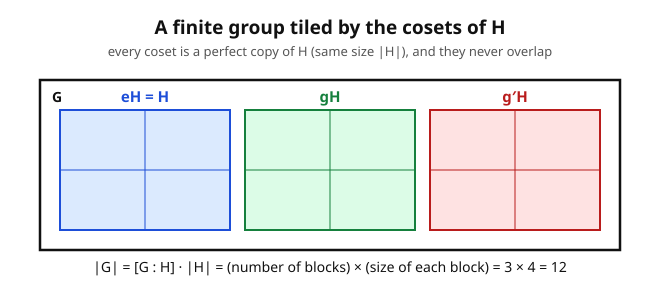

# Abstract Algebra · Lesson 1.5: Cosets and Lagrange's theorem

> ⏱ ~15 min · Module 1: Groups and their structure · Builds on: [1.4 Subgroups](01-04-subgroups.md) · Unlocks: Module 2 — [2.1 Homomorphisms, kernels, and images](02-01-homomorphisms-kernels-images.md)

## Why this matters

So far a subgroup has been a thing you *check for*: is this subset closed, does it hold inverses? This lesson turns subgroups into the source of the first genuine **law of nature** in group theory. Lagrange's theorem says the size of any subgroup must **divide** the size of the group — no exceptions, no near-misses. That single divisibility fact is a wrecking ball: it instantly tells you a group of order 7 has *no* proper nontrivial subgroups, that no element of a group of order 10 can have order 3, and — cashed out in $(\mathbb{Z}/p\mathbb{Z})^*$ — it *is* Fermat's little theorem, the engine under RSA. The whole machine runs on one idea: a subgroup cuts its parent into equal-sized, non-overlapping tiles. Count the tiles, count the tile, and you've counted the group.

## The idea

Pick a subgroup $H \le G$. Now shove all of $H$ over by a fixed element $g$: multiply every element of $H$ on the left by $g$. You get a new set

$$gH = \{\,gh : h \in H\,\},$$

called a **left coset** of $H$. The key intuition — and it's the whole lesson — is that $gH$ is a *perfect translate* of $H$: same shape, same size, just slid to a new location. $H$ itself is one of these cosets (take $g = e$). As $g$ ranges over $G$, the cosets sweep out all of $G$, and here's the miracle: they tile it. Every element sits in exactly one coset; two cosets are either **identical** or **completely disjoint** — never partially overlapping. And every tile has *exactly* $|H|$ elements.

Stack those facts and Lagrange falls out by pure counting: $G$ is chopped into some number of tiles, each of size $|H|$, so $|G|$ is that number times $|H|$. Hence $|H|$ divides $|G|$. That's it. The theorem is really a statement about tiling a floor with identical tiles — the count of tiles times the tile size is the floor.

(There are **right cosets** $Hg = \{hg : h \in H\}$ too, sliding on the other side. They tile $G$ just as well, into equally many pieces. Left and right cosets can be *different sets* when $G$ isn't abelian — that subtlety is exactly what Module 2 promotes into the definition of a *normal* subgroup.)

## The formal version

Fix a finite group $G$ and a subgroup $H \le G$. Write $|X|$ for the number of elements of a set $X$, and $e$ for the identity.

**Cosets have the same size.** The map $h \mapsto gh$ is a bijection from $H$ to $gH$.
*In words:* left-multiplication by $g$ is reversible (undo it with $g^{-1}$), so it can't merge or lose elements — every coset is a faithful copy of $H$, hence $|gH| = |H|$.

**The equality test.** For $g_1, g_2 \in G$,
$$g_1 H = g_2 H \iff g_1^{-1} g_2 \in H.$$
*In words:* two elements land in the same coset exactly when they differ by something already inside $H$. ($H$ can't tell $g_1$ and $g_2$ apart.) As a special case, $gH = H \iff g \in H$.

**Cosets partition $G$.** The distinct left cosets are pairwise disjoint and their union is all of $G$.
*In words:* every element belongs to one and only one coset — they tile the group with no gaps and no overlaps. (Proof sketch: $g \in gH$ since $e \in H$, so they cover $G$; and if two cosets share even one element they satisfy the equality test above, forcing them to be the *same* set.)

**Index.** The number of distinct left cosets of $H$ in $G$ is the **index**, written $[G : H]$.

**Lagrange's theorem.** For finite $G$,
$$|G| = [G : H]\cdot |H|, \qquad\text{so } |H| \text{ divides } |G|.$$
*In words:* group size equals (number of tiles) $\times$ (tile size); therefore a subgroup's order must be a divisor of the group's order.

**The corollaries that do the work.**

1. **Order of an element divides $|G|$.** For any $g$, the powers of $g$ form the cyclic subgroup $\langle g\rangle$, whose size is the order of $g$ (from [1.2](01-02-cyclic-groups-order.md)). Lagrange applies to it, so $\mathrm{ord}(g) \mid |G|$.
2. **$g^{|G|} = e$ for every $g$.** Since $\mathrm{ord}(g) \mid |G|$, raising to the $|G|$ completes a whole number of loops back to $e$.
3. **Groups of prime order are cyclic.** If $|G| = p$ is prime, any non-identity $g$ has order dividing $p$ and $\ne 1$, hence order $p$ — so $\langle g\rangle$ is *all* of $G$.
4. **Fermat's little theorem.** In $(\mathbb{Z}/p\mathbb{Z})^*$ (the nonzero residues mod a prime $p$, under multiplication), the order is $p-1$, so corollary 2 gives $a^{p-1} \equiv 1 \pmod p$ for every $a$ not divisible by $p$. Number theory's workhorse is a one-line consequence of counting cosets.

**The converse is false — read this twice.** Lagrange is a one-way street: $|H|$ *must* divide $|G|$, but a divisor of $|G|$ need **not** be the order of any subgroup. The standard counterexample: $A_4$ has order $12$, yet it has **no subgroup of order $6$** — even though $6 \mid 12$. (State it; we won't prove it here.) So Lagrange *rules things out*; it never *promises* something exists.

## Picture

## Worked examples

**Example 1 (cosets of the rotations in $D_4$).** Let $D_4$ be the symmetry group of the square, order $8$: rotations $\{e, r, r^2, r^3\}$ (where $r$ is a quarter-turn) and reflections $\{s, rs, r^2s, r^3s\}$. Take $H = \langle r\rangle = \{e, r, r^2, r^3\}$, the rotation subgroup, $|H| = 4$.

- $eH = H = \{e, r, r^2, r^3\}$ — all the **rotations**.
- $sH = \{s, sr, sr^2, sr^3\}$. Using $sr = r^{-1}s = r^3 s$ (the dihedral relation), this set is $\{s, r^3 s, r^2 s, rs\}$ — all four **reflections**.

Two cosets, so $[D_4 : H] = 2$, and Lagrange checks out: $|D_4| = [D_4:H]\cdot|H| = 2 \cdot 4 = 8$. ✓ The subgroup of rotations splits the group cleanly into "rotations" and "reflections" — a partition you already felt intuitively, now certified as a coset decomposition. (Any $H$ of index 2 does this, and Problem 3 shows why such an $H$ is special.)

**Example 2 (Fermat's little theorem from Lagrange, $p = 7$).** Consider $(\mathbb{Z}/7\mathbb{Z})^* = \{1,2,3,4,5,6\}$ under multiplication mod $7$ — a group of order $6$. Corollary 2 says $a^{6} \equiv 1 \pmod 7$ for every $a$ in it, with **no computation of $a$'s individual order required** — Lagrange guarantees $\mathrm{ord}(a) \mid 6$, so the $6$th power finishes a whole number of cycles.

Spot-check $a = 3$: $3^2 = 9 \equiv 2$, $3^3 \equiv 6$, $3^6 = (3^3)^2 \equiv 6^2 = 36 \equiv 1 \pmod 7$. ✓ (Here $3$ actually has order $6$, a generator; but $2$ has order $3$, and *still* $2^6 = (2^3)^2 \equiv 1^2 = 1$.) The general statement $a^{p-1}\equiv 1 \pmod p$ is identical, run in $(\mathbb{Z}/p\mathbb{Z})^*$ of order $p-1$.

## Watch out

- **The converse trap.** "$6$ divides $12$, so $A_4$ has an order-6 subgroup." *No.* Lagrange never manufactures subgroups; it only forbids the wrong sizes. Divisibility is necessary, not sufficient.
- **Cosets aren't subgroups.** Only $eH = H$ contains the identity; every *other* coset $gH$ (with $g \notin H$) fails to — so it can't be a subgroup. A coset is a *translate* of a subgroup, not a subgroup itself.
- **Left vs. right.** $gH$ and $Hg$ need not be equal when $G$ is nonabelian. They always have the same *size* and there are equally many of each, but as *sets* they can differ. When they always coincide, $H$ earns the name **normal** — the gateway to Module 2.
- **Order of element vs. order of group.** Corollary 1 says $\mathrm{ord}(g)$ divides $|G|$; it does **not** say every divisor of $|G|$ is achieved as some element's order. ($S_4$ has order $24$ but no element of order $24$ — see Problem 2.)

## One-liner

> A subgroup tiles its group into equal, non-overlapping translates — so the subgroup's size, and every element's order, must divide the group's size.

## Problems

**P1 (🟢)** In $\mathbb{Z}/8\mathbb{Z}$ (integers mod 8 under addition) let $H = \langle 2\rangle$. List all the (left) cosets of $H$, state the index $[\,\mathbb{Z}/8\mathbb{Z} : H\,]$, and confirm the Lagrange count $|G| = [G:H]\cdot|H|$. (Cosets here are written additively as $a + H$.)

**P2 (🟡)** Work in $S_4$, the symmetric group on $\{1,2,3,4\}$, $|S_4| = 24$.
(a) Tabulate how many elements have each possible order.
(b) Use Lagrange to list which subgroup orders are *a priori* possible.
(c) Identify a subgroup of order $8$ (a Sylow 2-subgroup, isomorphic to $D_4$) and describe its three cosets.

**P3 (🔴)** Prove: if $[G : H] = 2$, then $H$ is **normal** — meaning $gH = Hg$ for every $g \in G$. (A pure coset-counting argument; this is the fact that made "rotations vs. reflections" in Example 1 so clean, and it foreshadows [2.2](02-02-normal-subgroups-quotients.md).)

Solutions

**P1.** $H = \langle 2\rangle = \{0, 2, 4, 6\}$, so $|H| = 4$. Build cosets $a + H$:

- $0 + H = \{0,2,4,6\}$ — the evens.
- $1 + H = \{1,3,5,7\}$ — the odds.

Any other representative reproduces one of these: e.g. $2 + H = \{2,4,6,0\} = 0+H$ (since $2 \in H$, the equality test $g_1^{-1}g_2 = -2 + 4 = 2 \in H$ confirms it), and $3 + H = \{3,5,7,1\} = 1 + H$. So there are exactly **two** cosets: $[\mathbb{Z}/8\mathbb{Z} : H] = 2$. Lagrange: $|G| = [G:H]\cdot|H| = 2 \cdot 4 = 8$. ✓ (This is $\mathbb{Z}/8\mathbb{Z}$ split into even and odd residues — the same evens/odds partition, now as cosets.)

**P2.**
**(a)** The elements of $S_4$ sorted by cycle type, with orders:

| Cycle type | Example | Order | Count |
|---|---|---|---|
| identity | $e$ | $1$ | $1$ |
| transposition $(a\,b)$ | $(1\,2)$ | $2$ | $6$ |
| double transposition $(a\,b)(c\,d)$ | $(1\,2)(3\,4)$ | $2$ | $3$ |
| 3-cycle $(a\,b\,c)$ | $(1\,2\,3)$ | $3$ | $8$ |
| 4-cycle $(a\,b\,c\,d)$ | $(1\,2\,3\,4)$ | $4$ | $6$ |

Totals by **order**: order $1$: **1**; order $2$: $6 + 3 = $ **9**; order $3$: **8**; order $4$: **6**. Grand total $1+9+8+6 = 24$ ✓. Every order appearing ($1,2,3,4$) divides $24$, exactly as Corollary 1 demands. Note what's *absent*: no element of order $6, 8, 12,$ or $24$, even though those divide $24$ — divisibility is necessary, not sufficient.

**(b)** By Lagrange a subgroup order must divide $|S_4| = 24$, so the a-priori-possible orders are the divisors
$$\{1,\ 2,\ 3,\ 4,\ 6,\ 8,\ 12,\ 24\}.$$
(As it happens all eight are realized in $S_4$: trivial group; $\langle(1\,2)\rangle$; $\langle(1\,2\,3)\rangle$; a Klein four $\{e,(1\,2)(3\,4),(1\,3)(2\,4),(1\,4)(2\,3)\}$ or $\langle(1\,2\,3\,4)\rangle$; a point-stabilizer $S_3$ of order 6; the $D_4$ below; $A_4$; and $S_4$ itself. But Lagrange alone only tells you the list is *at most* these divisors — recall $A_4$, order 12, has no order-6 subgroup despite $6 \mid 12$.)

**(c)** A subgroup of order $8$: think of $1,2,3,4$ as the corners of a square in cyclic order, and take the eight symmetries of that square sitting inside $S_4$:
$$D_4 = \{\,e,\ (1\,2\,3\,4),\ (1\,3)(2\,4),\ (1\,4\,3\,2),\ (1\,3),\ (2\,4),\ (1\,2)(3\,4),\ (1\,4)(2\,3)\,\}.$$
The first four are the rotations ($\langle(1\,2\,3\,4)\rangle$); the last four are the reflections (two diagonal, two edge). This is $\cong D_4$, order $8$. Index $[S_4 : D_4] = 24/8 = 3$, so there are **three** cosets, each of size $8$, together covering all $24$ permutations.

A clean way to *name* the three cosets: $D_4$ is exactly the set of permutations preserving the pairing of opposite corners $\{\{1,3\},\{2,4\}\}$ (the two diagonals). There are three ways to split $\{1,2,3,4\}$ into two pairs, and each coset $gD_4$ is the set of permutations carrying the diagonal-pairing to one specific target pairing:

- $e\,D_4 = D_4$ — fixes the pairing $\{13 \mid 24\}$.
- $(2\,3)\,D_4$ — sends the pairing to $\{12 \mid 34\}$.
- $(3\,4)\,D_4$ — sends the pairing to $\{14 \mid 23\}$.

Three target pairings, three cosets of $8$; $3 \times 8 = 24$. ✓ (This coset picture *is* the action of $S_4$ on the 3 pairings — a preview of group actions in [2.4](02-04-group-actions.md).)

**P3.** Suppose $[G:H] = 2$: there are exactly two left cosets, and exactly two right cosets. One left coset is $H$ itself (namely $eH$); since the two left cosets partition $G$ and are disjoint, the *other* left coset must be everything else, $G \setminus H$. Identically, one right coset is $H$ and the other is $G \setminus H$.

Now take any $g \in G$ and show $gH = Hg$:

- If $g \in H$: then $gH = H$ (equality test, $g^{-1}\cdot e \in H$... more directly $g \in H \Rightarrow gH = H$) and likewise $Hg = H$. So $gH = Hg = H$. ✓
- If $g \notin H$: then $gH \ne H$, so $gH$ must be the *other* left coset, $gH = G \setminus H$. Likewise $Hg \ne H$ forces $Hg = G \setminus H$. So $gH = G \setminus H = Hg$. ✓

In every case $gH = Hg$, so $H$ is normal. $\blacksquare$ Intuitively: with only two tiles, "$H$" and "not $H$", the left tiling and the right tiling have *no choice* but to agree — there's nowhere else for the second tile to go. Every index-2 subgroup is automatically normal.

## Flashback

**From Lesson 1.4 (Subgroups / the center):** Find the **center** $Z(D_4) = \{z \in D_4 : zg = gz \text{ for all } g \in D_4\}$, and confirm it is a subgroup. Then note what Lagrange predicts about its size. (Use the dihedral relation $sr = r^{-1}s$; $D_4 = \{e,r,r^2,r^3,s,rs,r^2s,r^3s\}$ with $r^4 = e$, $s^2 = e$.)

Solution

Test each element for commuting with *everything*.

- $r^2$ commutes with all rotations (rotations commute among themselves). Against a reflection: $r^2 s = s\,r^{-2} = s\,r^2$ (since $r^{-2} = r^2$), so $r^2 s = s r^2$. It commutes with $s$, hence with every reflection $r^k s$ too. So $r^2 \in Z(D_4)$.
- $r$ is **not** central: $rs \ne sr$ because $sr = r^{-1}s = r^3 s \ne rs$.
- $s$ is **not** central: $sr = r^3 s \ne rs$.
- $e$ is trivially central.

So $Z(D_4) = \{e, r^2\}$, of order $2$. It's a subgroup (closed: $r^2 \cdot r^2 = e$; inverses: each element is its own inverse; contains $e$) — and in general the center is always a subgroup, which is the 1.4 fact this instantiates. Lagrange check: $|Z(D_4)| = 2$ divides $|D_4| = 8$. ✓ (As it must — the center is a subgroup, so its order was *never free* to be anything but a divisor of 8.)

## Connections

- **Backward:** the tile size $|H|$ is an *order* in the [1.2](01-02-cyclic-groups-order.md) sense — Corollary 1 is Lagrange applied to the cyclic subgroup $\langle g\rangle$ built there. The subgroups being tiled with are exactly the ones you learned to certify in [1.4](01-04-subgroups.md).
- **Forward:** when left and right cosets coincide ($H$ normal), the cosets can themselves be *multiplied* and become the elements of a brand-new group $G/H$ — the **quotient**, the centerpiece of [2.2](02-02-normal-subgroups-quotients.md). Problem 3 already hands you a whole family of normal subgroups (every index-2 one). The index $[G:H]$ resurfaces as $|G/H|$, and again in the field-theory degree $[K:F]$ of Module 4.
- **Sideways (number theory):** Corollary 4 is **Fermat's little theorem** $a^{p-1}\equiv 1 \pmod p$; running the same argument in $(\mathbb{Z}/n\mathbb{Z})^*$ gives **Euler's theorem** $a^{\varphi(n)}\equiv 1 \pmod n$ — the identity RSA encryption rests on. Prime-order-implies-cyclic (Corollary 3) will reappear when we classify small groups and, in [3.5](03-05-characteristic-prime-fields.md)/[4.3](04-03-finite-fields.md), when the multiplicative group of a finite field turns out to be cyclic.
