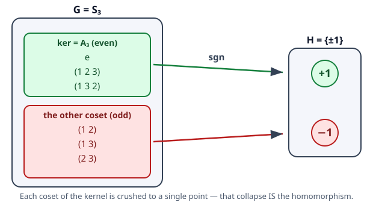

# Abstract Algebra · Lesson 2.1: Homomorphisms, kernels, and images

> ⏱ ~15 min · Module 2: Homomorphisms, quotients, and actions — the machinery · Builds on: [1.5 Cosets and Lagrange's theorem](01-05-cosets-lagrange.md) · Unlocks: [2.2 Normal subgroups and quotient groups](02-02-normal-subgroups-quotients.md)

## Why this matters

Module 1 taught you what a group *is*. Module 2 is about the maps *between* groups — and this single idea, the **homomorphism**, is the engine the rest of the course runs on. Every theorem you're about to meet (quotient groups, the isomorphism theorems, group actions, and eventually the whole of representation theory) is a statement about structure-preserving maps and the two subgroups every such map carries with it: its **kernel** and its **image**. Get this lesson into your bones and the next five feel inevitable.

The payoff is a way to compare groups. When are two groups "secretly the same"? When does one group sit inside another? When does a big group collapse onto a small one, and what exactly gets crushed in the collapse? All three questions are answered by one map and its kernel.

## The idea

A group homomorphism is a map that **respects the multiplication**. You can multiply first and then map, or map first and then multiply, and you land in the same place. That's the entire content — but it forces a surprising amount.

Think of $\det : \mathrm{GL}_2(\mathbb{R}) \to \mathbb{R}^*$ (invertible matrices to nonzero reals). The determinant throws away almost everything about a matrix — the individual entries, the eigenvectors, the geometry — and keeps one number. Yet it keeps *exactly* the number that multiplies correctly: $\det(AB) = \det(A)\det(B)$. The map is lossy, and the **kernel** is a precise measure of the loss: it's the set of matrices the map can't tell apart from the identity — here, everything with determinant $1$, the group $\mathrm{SL}_2$. A big kernel means a lot got crushed; a trivial kernel means nothing did, and the map is faithful.

That crushing is geometric. The kernel doesn't just collapse on its own — it drags entire cosets down with it. Every fiber of the map (everything landing on a single target point) is one coset of the kernel, and the map staples each coset to a point. Hold that picture: **a homomorphism is the kernel's cosets, each pressed flat onto the image.**

## The formal version

**Homomorphism.** A map $\varphi : G \to H$ between groups is a *homomorphism* if
$$\varphi(ab) = \varphi(a)\,\varphi(b) \quad \text{for all } a,b \in G.$$
*In words:* the product of the images is the image of the product — multiplication survives the trip. (The product on the left uses $H$'s operation; the one inside uses $G$'s. Same equation, two different multiplications.)

**Immediate consequences.** From that one line, with no extra hypotheses:

- $\varphi(e_G) = e_H$. *Proof:* $\varphi(e_G) = \varphi(e_G e_G) = \varphi(e_G)\varphi(e_G)$; cancel one copy in $H$.
- $\varphi(g^{-1}) = \varphi(g)^{-1}$. *Proof:* $\varphi(g)\varphi(g^{-1}) = \varphi(g g^{-1}) = \varphi(e_G) = e_H$, so $\varphi(g^{-1})$ is the inverse of $\varphi(g)$.

*In words:* a homomorphism automatically sends identity to identity and inverses to inverses — you never have to check those, they come free.

**Isomorphism.** A homomorphism that is also a bijection. If one exists, we write $G \cong H$ and call the groups *isomorphic* — literally "same shape." They may be built from wildly different stuff (permutations vs. rotations vs. numbers mod $n$), but as groups they are indistinguishable: relabel the elements and the multiplication tables match exactly.

**Kernel and image.** For a homomorphism $\varphi : G \to H$:
$$\ker \varphi = \{\, g \in G : \varphi(g) = e_H \,\}, \qquad \operatorname{im}\varphi = \{\, \varphi(g) : g \in G \,\}.$$
*In words:* the kernel is what maps to the identity (the part of $G$ that gets crushed); the image is what you actually hit in $H$. Both are subgroups — $\ker\varphi \le G$ and $\operatorname{im}\varphi \le H$ — each an easy axiom check using $\varphi(e_G)=e_H$ and the consequences above.

**The kernel detects injectivity.** This is the key theorem of the lesson:
$$\varphi \text{ is injective} \iff \ker\varphi = \{e_G\}.$$
*In words:* a homomorphism is one-to-one exactly when nothing but the identity gets crushed. So checking injectivity — normally a statement about *all pairs* $a,b$ — collapses to inspecting a single subgroup.

*Proof.* ($\Rightarrow$) Suppose $\varphi$ is injective. If $g \in \ker\varphi$ then $\varphi(g) = e_H = \varphi(e_G)$, and injectivity forces $g = e_G$. So $\ker\varphi = \{e_G\}$.
($\Leftarrow$) Suppose $\ker\varphi = \{e_G\}$. If $\varphi(a) = \varphi(b)$, then
$$\varphi(ab^{-1}) = \varphi(a)\varphi(b)^{-1} = \varphi(a)\varphi(a)^{-1} = e_H,$$
so $ab^{-1} \in \ker\varphi = \{e_G\}$, giving $ab^{-1} = e_G$, i.e. $a = b$. So $\varphi$ is injective. $\blacksquare$

The engine of ($\Leftarrow$) is exactly [1.5](01-05-cosets-lagrange.md)'s coset logic: the fibers of $\varphi$ *are* the cosets of $\ker\varphi$, so a one-point kernel means every fiber is a single point.

## Concrete instance

The cleanest homomorphism to see whole is the **sign map** $\operatorname{sgn} : S_3 \to \{\pm 1\}$, where $\{\pm 1\}$ is the group $\{+1, -1\}$ under multiplication. It sends a permutation to $+1$ if it's a product of an even number of transpositions, $-1$ if odd. Here is the entire map:

| $\sigma \in S_3$ | written as transpositions | $\operatorname{sgn}(\sigma)$ |
|---|---|---|
| $e$ | (empty) — 0 swaps | $+1$ |
| $(1\,2\,3)$ | $(1\,2)(2\,3)$ — 2 swaps | $+1$ |
| $(1\,3\,2)$ | $(1\,3)(2\,3)$ — 2 swaps | $+1$ |
| $(1\,2)$ | 1 swap | $-1$ |
| $(1\,3)$ | 1 swap | $-1$ |
| $(2\,3)$ | 1 swap | $-1$ |

Read the columns as a homomorphism at work. The three elements mapping to $+1$ are $\ker(\operatorname{sgn}) = A_3 = \{e, (1\,2\,3), (1\,3\,2)\}$ — the alternating group, a subgroup of order $3$. The other three form the single remaining coset, and they all map to $-1$. The image is all of $\{\pm 1\}$. Notice $|A_3| \cdot |\{\pm1\}| = 3 \cdot 2 = 6 = |S_3|$: kernel-size times image-size recovers $|G|$, because the map partitions $S_3$ into $|\{\pm1\}| = 2$ cosets each of size $|A_3| = 3$. That's Lagrange, quietly doing the bookkeeping — and it's the whole reason the 🔴 problem below works.

## Worked examples

**Example 1 (verify a homomorphism; read off kernel and image).** Claim: $\det : \mathrm{GL}_2(\mathbb{R}) \to \mathbb{R}^*$ is a homomorphism.

*Homomorphism:* the multiplicativity of the determinant is exactly the defining equation, $\det(AB) = \det(A)\det(B)$, and the target is legitimate because an invertible matrix has $\det \ne 0$, so we really land in $\mathbb{R}^* = \mathbb{R}\setminus\{0\}$. Done.

*Kernel:* $A \in \ker\det \iff \det A = 1$. That set is $\mathrm{SL}_2(\mathbb{R})$, the special linear group — so $\ker\det = \mathrm{SL}_2(\mathbb{R})$, which is where "the kernel is a familiar subgroup" first pays off.

*Image:* every nonzero real is achieved. For any $a \ne 0$, the matrix $\begin{pmatrix} a & 0 \\ 0 & 1\end{pmatrix}$ is invertible with determinant $a$. So $\operatorname{im}\det = \mathbb{R}^*$: the map is surjective. Its kernel $\mathrm{SL}_2$ is huge (infinite), so $\det$ is massively non-injective — as it must be, since it compresses a group of matrices down to a line of scalars.

**Example 2 (reduction mod $n$ — the prototype for everything ahead).** Define $\varphi : \mathbb{Z} \to \mathbb{Z}/6\mathbb{Z}$ by $\varphi(n) = n \bmod 6$, where both groups use addition.

*Homomorphism:* $\varphi(m+n) = (m+n)\bmod 6 = (m \bmod 6) + (n \bmod 6) = \varphi(m) + \varphi(n)$, since remainders add mod $6$. ✓

*Kernel:* $\varphi(n) = 0 \iff n$ is a multiple of $6 \iff n \in 6\mathbb{Z}$. So $\ker\varphi = 6\mathbb{Z}$.

*Image:* every residue $0,1,2,3,4,5$ is $\varphi$ of itself, so $\operatorname{im}\varphi = \mathbb{Z}/6\mathbb{Z}$ — surjective.

Now stare at the shapes: the *domain quotiented by the kernel* is $\mathbb{Z}/6\mathbb{Z}$ (that's literally the notation — the cosets of $6\mathbb{Z}$ inside $\mathbb{Z}$), and the *image* is also $\mathbb{Z}/6\mathbb{Z}$. Those are the same group. This is the first isomorphism theorem in embryo — $G/\ker\varphi \cong \operatorname{im}\varphi$ — which [2.3](02-03-isomorphism-theorems.md) proves in general. Every quotient you'll ever build is secretly the image of some homomorphism, and vice versa.

Two more to keep in your pocket: **$\operatorname{sgn} : S_n \to \{\pm 1\}$** has kernel $A_n$ (the general version of the Concrete instance); **$\exp : (\mathbb{R}, +) \to (\mathbb{R}^*, \times)$**, $x \mapsto e^x$, is a homomorphism ($e^{x+y} = e^x e^y$) with kernel $\{0\}$ — hence injective — turning addition into multiplication (image $= (0,\infty)$).

## Watch out

- **The kernel is upstream, the image is downstream.** $\ker\varphi \le G$ lives in the *domain*; $\operatorname{im}\varphi \le H$ lives in the *codomain*. Mixing them up wrecks every argument. Kernel measures collapse *before* the map; image is what survives *after*.
- **"Homomorphism" does not mean "injective."** Most useful homomorphisms are deliberately lossy ($\det$, $\operatorname{sgn}$, reduction mod $n$). Only an *isomorphism* keeps everything, and injectivity is precisely the trivial-kernel condition — never assume it.
- **You still must check the multiplication axiom — but nothing else.** Identity-to-identity and inverse-to-inverse are theorems, not hypotheses. Don't waste time verifying them, and don't forget the one thing that *isn't* free: $\varphi(ab) = \varphi(a)\varphi(b)$.
- **Order of operations matters when $H$ is nonabelian.** $\varphi(g^{-1}) = \varphi(g)^{-1}$, not "some other inverse" — but if you compose or invert products, respect $H$'s (possibly noncommutative) multiplication.

## One-liner

> A homomorphism preserves multiplication and nothing more is promised; its kernel is the exact debris of what got crushed, and it's injective precisely when that debris is only the identity.

## Problems

**P1 (🟢)** Two quick maps.
(a) Is $\varphi : (\mathbb{Z}, +) \to (\mathbb{Z}, +)$, $\varphi(n) = 2n$, a homomorphism? If so, find $\ker\varphi$ and $\operatorname{im}\varphi$.
(b) For a group $G$, define the squaring map $s : G \to G$ by $s(g) = g^2$. Show $s$ is a homomorphism **if and only if** $G$ is abelian.

**P2 (🟡)** Prove the key theorem directly: for a homomorphism $\varphi : G \to H$, show $\varphi$ is injective if and only if $\ker\varphi = \{e_G\}$. (Write both directions in full; don't just cite the lesson.)

**P3 (🔴)** Let $\varphi : G \to H$ be a homomorphism of **finite** groups.
(a) Prove $|\operatorname{im}\varphi|$ divides both $|G|$ and $|H|$ — hence divides $\gcd(|G|, |H|)$.
(b) Conclude that the only homomorphism $\mathbb{Z}/5\mathbb{Z} \to \mathbb{Z}/7\mathbb{Z}$ is the trivial one (everything $\mapsto 0$).

Solutions

**P1.**
(a) Yes: $\varphi(m+n) = 2(m+n) = 2m + 2n = \varphi(m) + \varphi(n)$. ✓
Kernel: $\varphi(n) = 0 \iff 2n = 0 \iff n = 0$, so $\ker\varphi = \{0\}$ (hence $\varphi$ is injective).
Image: $\operatorname{im}\varphi = \{2n : n \in \mathbb{Z}\} = 2\mathbb{Z}$, the even integers — injective but not surjective.

(b) The map $s$ is a homomorphism iff $s(ab) = s(a)s(b)$ for all $a,b$, i.e.
$$(ab)^2 = a^2 b^2 \iff abab = aabb.$$
Left-cancel $a$ and right-cancel $b$ from $abab = aabb$: this gives $ba = ab$. Every step is reversible (cancellation is an "iff"), so
$$s \text{ is a homomorphism} \iff ba = ab \text{ for all } a,b \iff G \text{ is abelian}. \ \blacksquare$$
(Concretely, in the nonabelian $S_3$, take $a=(1\,2)$, $b=(1\,3)$: $(ab)^2 \ne a^2 b^2$ since $a^2 = b^2 = e$ but $ab$ is a $3$-cycle with $(ab)^2 \ne e$.)

**P2.**
($\Rightarrow$) Assume $\varphi$ injective. Let $g \in \ker\varphi$. Then $\varphi(g) = e_H = \varphi(e_G)$ (the second equality because $\varphi(e_G) = e_H$ always). Injectivity gives $g = e_G$. Since the identity is always in the kernel, $\ker\varphi = \{e_G\}$.

($\Leftarrow$) Assume $\ker\varphi = \{e_G\}$. Suppose $\varphi(a) = \varphi(b)$. Multiply both sides in $H$ by $\varphi(b)^{-1} = \varphi(b^{-1})$:
$$\varphi(a)\varphi(b^{-1}) = \varphi(b)\varphi(b^{-1}) = e_H.$$
By the homomorphism property the left side is $\varphi(ab^{-1})$, so $\varphi(ab^{-1}) = e_H$, meaning $ab^{-1} \in \ker\varphi = \{e_G\}$. Thus $ab^{-1} = e_G$, i.e. $a = b$. So $\varphi$ is injective. $\blacksquare$

**P3.**
(a) *Divides $|H|$:* $\operatorname{im}\varphi$ is a subgroup of $H$, so by Lagrange's theorem ([1.5](01-05-cosets-lagrange.md)) $|\operatorname{im}\varphi|$ divides $|H|$.
*Divides $|G|$:* the fibers of $\varphi$ are the cosets of $\ker\varphi$. Precisely, if $\varphi(g) = h$ then $\varphi^{-1}(h) = g\ker\varphi$, a coset of size $|\ker\varphi|$ (all cosets share one size). Distinct image points give distinct, disjoint cosets, and every element of $G$ lies in exactly one, so
$$|G| = (\text{number of fibers}) \cdot |\ker\varphi| = |\operatorname{im}\varphi| \cdot |\ker\varphi|.$$
Hence $|\operatorname{im}\varphi|$ divides $|G|$. Dividing both $|G|$ and $|H|$, it divides their gcd. $\blacksquare$
(This $|G| = |\operatorname{im}\varphi|\cdot|\ker\varphi|$ is exactly the counting that becomes $G/\ker\varphi \cong \operatorname{im}\varphi$ in [2.3](02-03-isomorphism-theorems.md).)

(b) Here $|G| = 5$, $|H| = 7$, and $\gcd(5,7) = 1$. By (a), $|\operatorname{im}\varphi|$ divides $1$, so $|\operatorname{im}\varphi| = 1$: the image is $\{0\}$, meaning $\varphi(x) = 0$ for every $x$. The trivial homomorphism is the only one. $\blacksquare$
(Same argument kills any homomorphism between two groups of coprime order — a small preview of how divisibility constraints pin down maps.)

## Flashback

**From [1.3](01-03-dihedral-symmetric-groups.md) (permutations):** For $\sigma = (1\,3\,5)(2\,4) \in S_5$, find (a) the order of $\sigma$ and (b) whether $\sigma$ is even or odd — and connect the parity to today's lesson.

Solution

(a) $\sigma$ is a product of disjoint cycles of lengths $3$ and $2$, so its order is $\operatorname{lcm}(3, 2) = 6$. (Applying $\sigma$ six times returns both cycles to start simultaneously.)

(b) Parity is the number of transpositions mod $2$. A $k$-cycle is a product of $k-1$ transpositions, so the $3$-cycle contributes $2$ (even) and the $2$-cycle contributes $1$ (odd); total $3$ transpositions — **odd**. So $\operatorname{sgn}(\sigma) = -1$.

Connection: parity *is* the value of the homomorphism $\operatorname{sgn} : S_5 \to \{\pm 1\}$ from this lesson. Saying $\sigma$ is odd is exactly saying $\sigma \notin \ker(\operatorname{sgn}) = A_5$ — it sits in the other coset. Order and sign are independent readings of $\sigma$: the sign only sees it through the sign homomorphism's lossy lens. $\blacksquare$

## Connections

- **Backward:** homomorphisms are the maps that respect the group structure defined in [1.1](01-01-group-axioms-first-examples.md). The proof that $\ker$-cosets are the fibers — and the counting $|G| = |\ker\varphi|\cdot|\operatorname{im}\varphi|$ — is [1.5](01-05-cosets-lagrange.md)'s Lagrange machinery reused; Lagrange is also what bounds images (P3).
- **Forward:** kernels are not just *any* subgroups — they are exactly the **normal** subgroups, the ones you can quotient by ([2.2](02-02-normal-subgroups-quotients.md)). Then [2.3](02-03-isomorphism-theorems.md)'s first isomorphism theorem upgrades the Example 2 / P3(a) pattern into the theorem $G/\ker\varphi \cong \operatorname{im}\varphi$. In Module 3, **ring homomorphisms** ([3.1](03-01-rings-ring-homomorphisms.md)) mirror this story beat for beat, with *ideals* playing the role of kernels.
- **Sideways (linear algebra):** a linear map $T : V \to W$ is precisely a homomorphism of the additive groups $(V, +)$ that also respects scaling; its kernel is the **null space** and its image is the **column space**. The rank–nullity theorem $\dim V = \dim\ker T + \dim\operatorname{im} T$ is the vector-space incarnation of $|G| = |\ker\varphi|\cdot|\operatorname{im}\varphi|$ — and the first isomorphism theorem in disguise. See [linalg-refresher](../../linalg-refresher/syllabus.md).
