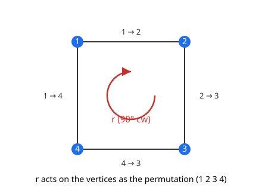

# Abstract Algebra · Lesson 2.4: Group actions

> ⏱ ~15 min · Module 2: Homomorphisms, quotients, and actions · Builds on: [2.3 The isomorphism theorems](02-03-isomorphism-theorems.md) · Unlocks: [2.5 Orbits, stabilizers, and conjugacy classes](02-05-orbits-stabilizers-conjugacy.md)

## Why this matters

So far a group has been an abstract table of elements with a multiplication rule. But the reason groups were invented is that they *do* something: they permute the corners of a square, shuffle a deck, rotate a molecule, mix the roots of a polynomial. A **group action** is the precise statement of "this group is the symmetries of that thing." It's the hinge that turns abstract algebra back into concrete combinatorics and geometry — and every counting theorem, every orbit, every conjugacy class in the rest of this module is really a statement about an action. In representation theory it becomes the whole subject: a linear action *is* a representation.

## The idea

A group element should be readable as a *motion* of some set $X$. The rotation $r$ of a square isn't just an abstract symbol — it sends corner 1 to corner 2, corner 2 to corner 3, and so on. It **permutes** the four corners. And these motions have to compose the way the group multiplies: doing $r$ then $r$ had better move the corners exactly the way the single element $r^2$ does. That's the entire content of an action — every group element becomes a way of rearranging $X$, and the rearrangements stack up consistently with the group law.

Here's the punchline to keep in your pocket: **an action is nothing more than a homomorphism from $G$ into the group of all permutations of $X$.** Each $g$ is assigned a shuffle of $X$; the two axioms below are exactly the demand that this assignment respect multiplication and the identity — i.e. that it's a homomorphism. So actions aren't a new gadget; they're [2.1](02-01-homomorphisms-kernels-images.md)'s homomorphisms pointed at a symmetric group.

## The formal version

Let $G$ be a group and $X$ a set. A **(left) group action** of $G$ on $X$ is a map
$$G \times X \to X, \qquad (g, x) \mapsto g \cdot x$$
satisfying two axioms:

1. **Identity:** $e \cdot x = x$ for all $x \in X$ (the identity moves nothing).
2. **Compatibility:** $(gh) \cdot x = g \cdot (h \cdot x)$ for all $g, h \in G$, $x \in X$ (multiplying then acting = acting then acting).

Here $e$ is the identity of $G$, and $g \cdot x$ denotes the point that $g$ sends $x$ to.

**In words:** each group element is a way of moving the points of $X$ around, the identity element is the do-nothing move, and composing two moves matches the group's own multiplication.

**The permutation-representation view.** Write $\mathrm{Sym}(X)$ for the group of all bijections $X \to X$ under composition (when $X = \{1, \dots, n\}$ this is the symmetric group $S_n$ from [1.3](01-03-dihedral-symmetric-groups.md)). For a fixed $g$, define $\sigma_g : X \to X$ by $\sigma_g(x) = g \cdot x$. Then:

> An action of $G$ on $X$ is **exactly the same data** as a homomorphism $\varphi : G \to \mathrm{Sym}(X)$, via $\varphi(g) = \sigma_g$.

Why: axiom (2) says $\sigma_{gh} = \sigma_g \circ \sigma_h$ (that's $\varphi$ being a homomorphism), and axiom (1) forces $\sigma_e = \mathrm{id}$. Each $\sigma_g$ is a bijection because $\sigma_{g^{-1}}$ is its inverse ($\sigma_g \circ \sigma_{g^{-1}} = \sigma_{gg^{-1}} = \sigma_e = \mathrm{id}$). This $\varphi$ is the **permutation representation** of the action. **In words:** to act on $X$ is precisely to assign each group element an honest shuffle of $X$, consistently.

**Two adjectives you'll use constantly.**

- The action is **faithful** if $\varphi$ is injective — equivalently $\ker\varphi = \{e\}$, i.e. only the identity acts as the do-nothing permutation. By the first isomorphism theorem ([2.3](02-03-isomorphism-theorems.md)), a faithful action gives an embedding $G \hookrightarrow \mathrm{Sym}(X)$: $G$ literally *is* a group of permutations.
- The action is **transitive** if for every pair $x, y \in X$ there's some $g$ with $g \cdot x = y$ — you can get from any point to any other. (In 2.5's language: there's a single orbit.)

**Cayley's theorem.** Every group acts on *itself* by left multiplication: take $X = G$ and $g \cdot x = gx$. Check it — $e \cdot x = ex = x$, and $(gh)\cdot x = (gh)x = g(hx) = g\cdot(h\cdot x)$, both just associativity. This action is faithful ($gx = x$ for all $x$ forces $g = e$), so:

> **Cayley's theorem.** Every group $G$ embeds in $\mathrm{Sym}(G)$. If $G$ is finite of order $n$, then $G \hookrightarrow S_n$.

**In words:** every abstract group is secretly a group of permutations. There's nothing more general out there — permutation groups are the whole zoo.

## Picture

The dihedral group $D_4$ (symmetries of the square) doesn't just abstractly exist — it *does* something to the four corners. The rotation $r$ picks up the whole square and, from the corners' point of view, applies the permutation $(1\ 2\ 3\ 4)$. That assignment of each symmetry to a shuffle of the corners is the action.

## Worked examples

**Example 1 — $D_4$ acting on the four vertices; its permutation representation.**

$D_4 = \{e, r, r^2, r^3, s, sr, sr^2, sr^3\}$ has 8 elements: $r$ is rotation by $90^\circ$ (order 4) and $s$ is a reflection (order 2). Number the corners $1,2,3,4$ clockwise as in the picture. Each symmetry physically moves the square, hence permutes the corners; reading off where each corner lands gives a map $\varphi : D_4 \to S_4$:

$$\varphi(e) = \mathrm{id}, \quad \varphi(r) = (1\,2\,3\,4), \quad \varphi(r^2) = (1\,3)(2\,4), \quad \varphi(r^3) = (1\,4\,3\,2).$$

For the reflection $s$ across the diagonal through corners $1$ and $3$: it fixes $1$ and $3$, swaps $2$ and $4$, so $\varphi(s) = (2\,4)$. The other reflections fill in similarly (e.g. the vertical-axis reflection is $(1\,2)(3\,4)$).

- **It's a homomorphism.** Check compatibility on a sample: $\varphi(r)\varphi(r) = (1\,2\,3\,4)(1\,2\,3\,4) = (1\,3)(2\,4) = \varphi(r^2)$. ✓ Composing the corner-shuffles of $r$ and $r$ reproduces the corner-shuffle of $r^2$ — exactly axiom (2).
- **It's faithful.** No non-identity symmetry of the square leaves all four corners fixed (a rigid motion pinned at all four corners is the identity), so $\ker\varphi = \{e\}$. Hence $D_4 \hookrightarrow S_4$: the 8 elements of $D_4$ appear as 8 distinct permutations in $S_4$ (which has 24 elements total). $D_4$ *is* a subgroup of $S_4$.

**Example 2 — Cayley's theorem for $\mathbb{Z}/3\mathbb{Z}$.**

Let $G = \mathbb{Z}/3\mathbb{Z} = \{0, 1, 2\}$ under addition mod 3. Act on itself by left "multiplication," which here is addition: $g \cdot x = g + x$. Compute the permutation $\sigma_g$ of $\{0,1,2\}$ for each $g$:

- $\sigma_0$: adds $0$ — the identity, $\mathrm{id}$.
- $\sigma_1$: $0 \mapsto 1 \mapsto 2 \mapsto 0$, the 3-cycle $(0\,1\,2)$.
- $\sigma_2$: $0 \mapsto 2 \mapsto 1 \mapsto 0$, the 3-cycle $(0\,2\,1)$.

Relabel $\{0,1,2\}$ as $\{1,2,3\}$ if you prefer $S_3$'s usual names. The map $\varphi(g) = \sigma_g$ sends $\mathbb{Z}/3\mathbb{Z}$ isomorphically onto $\{\mathrm{id}, (1\,2\,3), (1\,3\,2)\} \subset S_3$ — the rotation subgroup $A_3$. So the abstract group $\mathbb{Z}/3\mathbb{Z}$ is realized as a group of $3$-cycles. This is Cayley's theorem made completely explicit: a "pure" cyclic group shown to *be* permutations. (Note the embedding lands in $S_3$, which has $6$ elements — Cayley's $S_{|G|}$ is roomy, never tight.)

## Watch out

- **Axiom (2) is composition, not a product.** $(gh)\cdot x = g\cdot(h\cdot x)$ means "apply $h$ first, then $g$." A common slip is checking $g\cdot(h\cdot x) = h\cdot(g\cdot x)$ — that's false unless $G$ is abelian, and it's not what's required.
- **The map $\varphi(g) = \sigma_g$ is a homomorphism; the individual $\sigma_g$ is a bijection.** Don't conflate the two levels. $\varphi$ lives in $\mathrm{Hom}(G, \mathrm{Sym}(X))$; each value $\sigma_g$ lives in $\mathrm{Sym}(X)$.
- **"Faithful" is about the kernel, not transitivity, and vice versa.** They're independent: $\mathbb{Z}/3\mathbb{Z}$ on itself is both, but $G$ acting *trivially* ($g\cdot x = x$ for all $g$) on a 2-point set is transitive on neither... actually is neither faithful (kernel is all of $G$) nor transitive. Keep the two adjectives separate — one is about $\ker\varphi$, the other about reaching every point.
- **Cayley embeds into $S_{|G|}$, which is enormous.** $|S_n| = n!$ dwarfs $n$. The theorem is existence, not efficiency; the copy of $G$ is a tiny sliver of $S_{|G|}$.

## One-liner

> A group action is a homomorphism $G \to \mathrm{Sym}(X)$ — each element becomes a shuffle of $X$ — and Cayley's theorem says every group is faithfully such a thing on itself, so abstract groups *are* permutation groups.

## Problems

**P1 (🟢)** Let $G = \mathbb{Z}/4\mathbb{Z} = \{0,1,2,3\}$ act on $X = \{0,1,2,3\}$ by $g \cdot x = (x + g) \bmod 4$.
(a) Verify the two action axioms.
(b) Write the permutation representation $\varphi : \mathbb{Z}/4\mathbb{Z} \to S_4$ by giving $\sigma_g$ in cycle notation for each $g$.

**P2 (🟡)** For any group $G$, define the **conjugation action** of $G$ on itself by $g \cdot x = g x g^{-1}$.
(a) Show this is a group action (check both axioms).
(b) Show its kernel — the set of $g$ acting as the identity permutation — is exactly the center $Z(G) = \{g : gx = xg \text{ for all } x\}$.

**P3 (🔴)** Prove Cayley's theorem: for any group $G$, the left-multiplication action $g\cdot x = gx$ on $X = G$ is faithful, and conclude $G$ embeds in $\mathrm{Sym}(G)$ (so $G \hookrightarrow S_{|G|}$ when $G$ is finite).

Solutions

**P1.**

(a) *Identity:* $0 \cdot x = (x + 0) \bmod 4 = x$. ✓
*Compatibility:* $(g + h)\cdot x = (x + g + h)\bmod 4$, and $g\cdot(h\cdot x) = g\cdot\big((x+h)\bmod 4\big) = (x + h + g)\bmod 4$. Addition mod 4 is commutative and associative, so these agree. ✓

(b) Each $\sigma_g$ shifts $\{0,1,2,3\}$ by $g$:
$$\sigma_0 = \mathrm{id}, \quad \sigma_1 = (0\,1\,2\,3), \quad \sigma_2 = (0\,2)(1\,3), \quad \sigma_3 = (0\,3\,2\,1).$$
(Check $\sigma_1^2 = (0\,1\,2\,3)^2 = (0\,2)(1\,3) = \sigma_2$, matching $1 + 1 = 2$. ✓) This is the same $4$-cycle pattern as $r$ in $D_4$ from Example 1 — $\mathbb{Z}/4\mathbb{Z}$ is exactly the rotation subgroup.

**P2.**

(a) *Identity:* $e\cdot x = exe^{-1} = x$. ✓
*Compatibility:* compute both sides.
$$(gh)\cdot x = (gh)\,x\,(gh)^{-1} = ghx h^{-1}g^{-1}.$$
$$g\cdot(h\cdot x) = g\cdot(hxh^{-1}) = g(hxh^{-1})g^{-1} = ghxh^{-1}g^{-1}.$$
Equal (using $(gh)^{-1} = h^{-1}g^{-1}$). ✓ So conjugation is an action.

(b) The kernel is $\{g \in G : g\cdot x = x \text{ for all } x\}$, i.e. $\{g : gxg^{-1} = x \text{ for all } x \in G\}$. Now
$$gxg^{-1} = x \iff gx = xg,$$
by right-multiplying both sides by $g$. So $g$ is in the kernel iff $gx = xg$ for *every* $x$ — which is precisely the definition of $g \in Z(G)$. Hence $\ker\varphi = Z(G)$. (Consequence, via the first isomorphism theorem: $G/Z(G) \cong \varphi(G) \le \mathrm{Sym}(G)$, the group of "inner automorphisms" — a preview of 2.5.)

**P3.** Define $\sigma_g : G \to G$ by $\sigma_g(x) = gx$, giving $\varphi : G \to \mathrm{Sym}(G)$, $\varphi(g) = \sigma_g$.

*It's an action (so $\varphi$ is a well-defined homomorphism into $\mathrm{Sym}(G)$).* $e\cdot x = ex = x$, and $(gh)\cdot x = (gh)x = g(hx) = g\cdot(h\cdot x)$ by associativity. Each $\sigma_g$ is a bijection with inverse $\sigma_{g^{-1}}$, so it genuinely lands in $\mathrm{Sym}(G)$.

*It's faithful.* Suppose $g \in \ker\varphi$, i.e. $\sigma_g = \mathrm{id}$, so $gx = x$ for all $x \in G$. Take $x = e$: then $g = ge = g\cdot e = e$. Hence $\ker\varphi = \{e\}$.

*Conclusion.* By the first isomorphism theorem ([2.3](02-03-isomorphism-theorems.md)), $\varphi$ with trivial kernel is injective, so
$$G \cong \varphi(G) \le \mathrm{Sym}(G),$$
an embedding of $G$ into $\mathrm{Sym}(G)$. If $|G| = n$, then $\mathrm{Sym}(G) \cong S_n$ (relabel the $n$ elements as $\{1,\dots,n\}$), giving $G \hookrightarrow S_n$. $\blacksquare$

(Notice the trick: to kill $g$ we evaluated the "for all $x$" condition at the single well-chosen point $x = e$. Faithfulness of a regular action always comes down to this — the identity element has no nontrivial stabilizer.)

## Flashback

**From Lesson 2.3 (The isomorphism theorems).** Consider the homomorphism $\det : GL_2(\mathbb{R}) \to \mathbb{R}^\times$ (invertible $2\times 2$ real matrices to nonzero reals under multiplication), $A \mapsto \det A$. Identify its kernel and image, and state what the first isomorphism theorem tells you about the quotient.

Solution

$\det$ is a homomorphism because $\det(AB) = \det(A)\det(B)$.

- **Image:** every nonzero real is achieved — e.g. $\mathrm{diag}(t, 1)$ has determinant $t$ for any $t \neq 0$ — so $\mathrm{im}(\det) = \mathbb{R}^\times$ (the map is surjective).
- **Kernel:** $\ker(\det) = \{A : \det A = 1\} = SL_2(\mathbb{R})$, the special linear group.

The first isomorphism theorem gives
$$GL_2(\mathbb{R}) / SL_2(\mathbb{R}) \cong \mathbb{R}^\times.$$
In words: collapsing all matrices with the same determinant to a point leaves exactly the group of possible determinant values. In particular $SL_2(\mathbb{R})$ is normal in $GL_2(\mathbb{R})$ (kernels always are — [2.2](02-02-normal-subgroups-quotients.md)), and the quotient is one-dimensional's worth of "scaling information."

## Connections

- **Backward:** the whole lesson rests on [2.1](02-01-homomorphisms-kernels-images.md) — an action *is* a homomorphism $G \to \mathrm{Sym}(X)$, and faithfulness plus the first isomorphism theorem ([2.3](02-03-isomorphism-theorems.md)) is what turns it into an embedding. The permutation groups $S_n$ and $D_n$ being acted through come straight from [1.3](01-03-dihedral-symmetric-groups.md).
- **Forward:** fix a point $x$ and ask "where can $g$ send it?" (its orbit) and "which $g$ pin it?" (its stabilizer) — that's [2.5](02-05-orbits-stabilizers-conjugacy.md), where the conjugation action of P2 produces conjugacy classes and the class equation. Averaging fixed points over the group counts orbits — Burnside's lemma in [2.6](02-06-burnside-counting.md), the payoff for coloring and enumeration problems.
- **Sideways (linear algebra):** when $X$ is a vector space and every $\sigma_g$ is a *linear* map, the permutation matrices you met in the [linalg refresher](../../linalg-refresher/syllabus.md) are the simplest case — a permutation action written in coordinates.
- **Sideways (representation theory):** a linear action $G \to GL(V)$ **is** a group representation. Everything here is the set-level rehearsal for the vector-space story in [representation theory](../../representation-theory/syllabus.md) — orbits become invariant subspaces, characters count fixed points.
- **Sideways (physics):** "the symmetries of a system act on its states" is a group action in exactly this sense — a rotation of space acts on the configurations of a molecule or the wavefunctions of a system, and the conserved quantities track the structure of that action.
