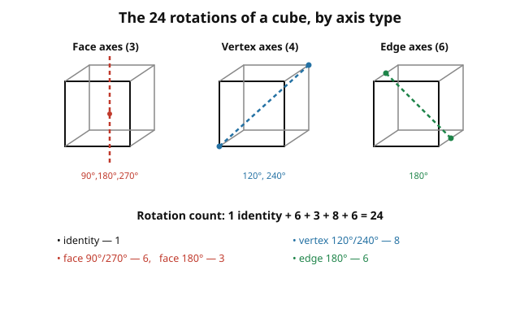

# Abstract Algebra · Lesson 2.6: Counting with Burnside's lemma

> ⏱ ~15 min · Module 2: Homomorphisms, quotients, and actions · Builds on: [2.5 Orbits, stabilizers, and conjugacy classes](02-05-orbits-stabilizers-conjugacy.md) · Unlocks: Module 3 — [3.1 Rings and ring homomorphisms](03-01-rings-ring-homomorphisms.md)

## Why this matters

How many *genuinely different* ways can you paint the six faces of a cube with three colors? Naively there are $3^6 = 729$ paintings — but rotate the cube and many of those are the same object seen from a new angle. The honest count is the number of **orbits** of the rotation group acting on the $729$ colorings. Listing orbits by hand is hopeless. Burnside's lemma turns that hopeless enumeration into a short arithmetic exercise: instead of counting patterns, you count *what each symmetry leaves alone* and average. It is the single most useful counting tool that comes out of group theory, and it powers everything from counting chemical isomers to enumerating distinct dice, necklaces, and switching circuits.

## The idea

You want $|X/G|$ — the number of orbits, i.e. the number of configurations that are truly distinct once you allow the group's symmetries to move things around. Directly grouping $729$ colorings into orbits is a nightmare.

Burnside's trick: **look at the problem from the symmetries' side.** Each group element $g$ fixes some configurations (leaves them literally unchanged) and scrambles the rest. It turns out the number of orbits is exactly the **average**, over all $g \in G$, of how many configurations $g$ fixes. A highly symmetric configuration is fixed by many group elements and thereby "spread thin" across the average; a generic one is fixed only by the identity. When you average, every orbit contributes exactly $1$ — which is precisely what "number of orbits" should mean.

Why an average? Because the same double-counting that made orbit–stabilizer work in [2.5](02-05-orbits-stabilizers-conjugacy.md) is at play. Count the pairs $(g,x)$ where $g$ fixes $x$: sum over $g$ and you get "total fixed points"; sum over $x$ and orbit–stabilizer collapses each orbit to a single unit of $|G|$. Equate the two and divide.

## The formal version

**Burnside's lemma (Cauchy–Frobenius).** Let a finite group $G$ act on a finite set $X$. For $g \in G$ write $\mathrm{Fix}(g) = \{x \in X : g \cdot x = x\}$, the set of points $g$ leaves unmoved. Then the number of orbits is

$$|X/G| \;=\; \frac{1}{|G|} \sum_{g \in G} |\mathrm{Fix}(g)|.$$

In words: **the number of distinct configurations equals the average number of configurations left unchanged by a symmetry.**

*Proof (double-count the fixed pairs).* Let $P = \{(g,x) \in G \times X : g\cdot x = x\}$. Count $P$ two ways.

By $g$: for each $g$, the $x$'s paired with it are exactly $\mathrm{Fix}(g)$, so $|P| = \sum_{g} |\mathrm{Fix}(g)|$.

By $x$: for each $x$, the $g$'s paired with it are exactly the stabilizer $\mathrm{Stab}(x)$, so $|P| = \sum_{x} |\mathrm{Stab}(x)|$.

Now use orbit–stabilizer from 2.5: $|\mathrm{Stab}(x)| = |G|/|\mathrm{Orbit}(x)|$. Group the sum $\sum_x$ orbit by orbit. Within one orbit $\mathcal{O}$, every $x$ has $|\mathrm{Orbit}(x)| = |\mathcal{O}|$, so each contributes $|G|/|\mathcal{O}|$, and there are $|\mathcal{O}|$ of them — the orbit's total is exactly $|G|$. Summing over the (say) $N$ orbits gives $\sum_x |\mathrm{Stab}(x)| = N\,|G|$. Therefore

$$\sum_{g}|\mathrm{Fix}(g)| = N\,|G| \quad\Longrightarrow\quad N = \frac{1}{|G|}\sum_g |\mathrm{Fix}(g)|. \qquad\blacksquare$$

**The counting recipe for colorings.** In almost every application $X$ is "all ways to color some slots (beads, faces, edges) with $k$ colors," and $G$ permutes the slots. A coloring is fixed by $g$ **iff it is constant on each cycle** of the permutation $g$ induces on the slots — because $g$ carries slot to slot around a cycle, and the color can only survive if every slot in that cycle already wears the same color. So if $g$'s action on the slots has $c(g)$ disjoint cycles (fixed points count as $1$-cycles),

$$|\mathrm{Fix}(g)| = k^{\,c(g)}.$$

In words: **each cycle is one free color choice.** The whole problem reduces to counting cycles of each group element — pure bookkeeping.

## Picture

The boss problem lives on the cube's rotation group. Its $24$ elements sort into four families by the kind of axis they spin around; this is the entire classification you'll average over.

## Worked examples

**Example 1 (necklace — 2-color, 4 beads, rotations only).** Slots are $4$ beads on a ring; $G = C_4 = \{e, r, r^2, r^3\}$ is the cyclic group of rotations by $0,1,2,3$ steps; $k = 2$ colors. Count cycles of each rotation acting on the $4$ bead-positions:

| $g$ | permutation of beads | cycles $c(g)$ | $\mathrm{Fix}(g)=2^{c(g)}$ |
|---|---|---|---|
| $e$ | $(1)(2)(3)(4)$ | $4$ | $2^4=16$ |
| $r$ | $(1\,2\,3\,4)$ | $1$ | $2^1=2$ |
| $r^2$ | $(1\,3)(2\,4)$ | $2$ | $2^2=4$ |
| $r^3$ | $(1\,4\,3\,2)$ | $1$ | $2^1=2$ |

$$|X/G| = \frac{1}{4}\big(16 + 2 + 4 + 2\big) = \frac{24}{4} = 6.$$

So there are $6$ distinct 2-color necklaces of $4$ beads. (Sanity check by hand: $\bullet\bullet\bullet\bullet$, $\circ\circ\circ\circ$, one black bead, two black adjacent, two black opposite, three black — that's $6$. ✓)

**Example 2 — BOSS PROBLEM: 3-colorings of the 6 faces of a cube under rotation.** Slots are the $6$ faces; $G$ is the rotation group of the cube, $|G| = 24$; $k = 3$ colors. We need the cycle count $c(g)$ of each rotation's action **on the faces**. Classify the $24$ rotations (see the figure):

- **Identity** ($1$ element). Fixes every face: $6$ cycles. $\mathrm{Fix} = 3^6 = 729$.
- **Face axes, $\pm 90°$** ($3$ axes $\times\ 2 = 6$ elements). Axis through two opposite faces: those $2$ faces are fixed ($1$-cycles), the $4$ side faces spin in a single $4$-cycle. Cycles $= 2 + 1 = 3$. $\mathrm{Fix} = 3^3 = 27$ each.
- **Face axes, $180°$** ($3$ axes $\times\ 1 = 3$ elements). The $2$ axis faces stay fixed; the $4$ side faces pair up into two $2$-cycles. Cycles $= 2 + 2 = 4$. $\mathrm{Fix} = 3^4 = 81$ each.
- **Vertex axes, $\pm 120°$** ($4$ axes $\times\ 2 = 8$ elements). Axis through two opposite corners; the $6$ faces split into two $3$-cycles (the three faces around each of the two corners). Cycles $= 2$. $\mathrm{Fix} = 3^2 = 9$ each.
- **Edge axes, $180°$** ($6$ axes $\times\ 1 = 6$ elements). Axis through midpoints of two opposite edges; the $6$ faces pair into three $2$-cycles. Cycles $= 3$. $\mathrm{Fix} = 3^3 = 27$ each.

Tally the elements: $1 + 6 + 3 + 8 + 6 = 24$. ✓ Now average:

$$|X/G| = \frac{1}{24}\Big(\underbrace{729}_{\text{id}} + \underbrace{6\cdot 27}_{\text{face }90°} + \underbrace{3\cdot 81}_{\text{face }180°} + \underbrace{8\cdot 9}_{\text{vertex}} + \underbrace{6\cdot 27}_{\text{edge}}\Big).$$

$$= \frac{1}{24}\big(729 + 162 + 243 + 72 + 162\big) = \frac{1368}{24} = \boxed{57}.$$

There are exactly **57** distinct 3-colorings of a cube's faces up to rotation. The naive count $729$ overcounted by roughly the size of the group, but not exactly — symmetric colorings (fixed by many rotations) are why $729/24 = 30.375$ is *not* the answer; Burnside corrects for them automatically.

## Watch out

- **Average, not "divide by $|G|$."** The tempting shortcut $|X|/|G|$ ($729/24$) is usually wrong and often not even an integer. You must average the *fixed-point counts*, which weights symmetric configurations correctly.
- **Cycles of the action on the slots, not on the colors.** $c(g)$ counts cycles of the permutation $g$ induces on faces/beads/edges — the things being colored — not anything about the $k$ colors. Draw the permutation carefully; a $90°$ face turn is a $4$-cycle on the side faces, not four fixed faces.
- **Get the group right.** "Rotations of a cube" (order $24$) is different from "rotations *and* reflections" (the full symmetry group, order $48$). If mirror images count as the same, use the bigger group — the answer changes. Similarly, a necklace you can flip over uses the dihedral group $D_n$, not just $C_n$.
- **The identity always contributes $k^{(\#\text{slots})}$** and is usually the biggest term — a quick check that you set up $|X|$ correctly.

## One-liner

> To count configurations up to symmetry, don't list orbits — average, over the group, how many configurations each symmetry leaves fixed, and read off each fixed count as one free color choice per cycle.

## Problems

**P1 (🟢)** Count the distinct 2-color necklaces of $n = 6$ beads under rotation ($G = C_6$). Use Burnside; show the cycle count of each rotation.

**P2 (🟡)** Count the distinct 2-colorings of the $4$ **vertices** of a square, where two colorings are the same if related by a symmetry in the full dihedral group $D_4$ (order $8$: $4$ rotations and $4$ reflections). Tabulate $c(g)$ for all $8$ symmetries.

**P3 (🔴)** Count the distinct 3-colorings of the $12$ **edges** of a cube under the rotation group (order $24$). Reuse the axis classification from Example 2, but track each rotation's action on the *edges* instead of the faces. Then sanity-check the whole method: pick one specific coloring and confirm its orbit size via orbit–stabilizer from [2.5](02-05-orbits-stabilizers-conjugacy.md).

Solutions

**P1.** Slots $=6$ beads, $G=C_6=\{e,r,\dots,r^5\}$, $k=2$. A rotation by $j$ steps ($0\le j\le 5$) decomposes the $6$ positions into $\gcd(6,j)$ cycles, each of length $6/\gcd(6,j)$:

| $g$ | $\gcd(6,j)$ | cycles $c(g)$ | $2^{c(g)}$ |
|---|---|---|---|
| $r^0=e$ | $6$ | $6$ | $64$ |
| $r^1$ | $1$ | $1$ | $2$ |
| $r^2$ | $2$ | $2$ | $4$ |
| $r^3$ | $3$ | $3$ | $8$ |
| $r^4$ | $2$ | $2$ | $4$ |
| $r^5$ | $1$ | $1$ | $2$ |

$$|X/G| = \frac{1}{6}(64+2+4+8+4+2) = \frac{84}{6} = 14.$$

There are **14** distinct 2-color necklaces of $6$ beads. (This matches the general necklace formula $\frac{1}{n}\sum_{d\mid n}\varphi(d)\,2^{n/d}$; here $\frac{1}{6}\big(\varphi(1)2^6+\varphi(2)2^3+\varphi(3)2^2+\varphi(6)2^1\big)=\frac{1}{6}(64+8+8+4)=\frac{84}{6}=14$.)

**P2.** Slots $= 4$ vertices of the square, labeled $1,2,3,4$ around the rim. $G=D_4$, $|G|=8$, $k=2$. List the induced permutation on vertices and count cycles:

| $g$ | vertex permutation | $c(g)$ | $2^{c(g)}$ |
|---|---|---|---|
| $e$ | $(1)(2)(3)(4)$ | $4$ | $16$ |
| $r$ (90°) | $(1\,2\,3\,4)$ | $1$ | $2$ |
| $r^2$ (180°) | $(1\,3)(2\,4)$ | $2$ | $4$ |
| $r^3$ (270°) | $(1\,4\,3\,2)$ | $1$ | $2$ |
| reflection (diagonal $1$–$3$) | $(1)(3)(2\,4)$ | $3$ | $8$ |
| reflection (diagonal $2$–$4$) | $(2)(4)(1\,3)$ | $3$ | $8$ |
| reflection (horizontal, swaps $1\!\leftrightarrow\!2,\,3\!\leftrightarrow\!4$) | $(1\,2)(3\,4)$ | $2$ | $4$ |
| reflection (vertical, swaps $1\!\leftrightarrow\!4,\,2\!\leftrightarrow\!3$) | $(1\,4)(2\,3)$ | $2$ | $4$ |

$$|X/G| = \frac{1}{8}(16+2+4+2+8+8+4+4) = \frac{48}{8} = 6.$$

There are **6** distinct 2-colorings of the square's vertices under $D_4$: all-white; all-black; one black; three black; two black on an edge; two black on a diagonal. ✓

**P3.** Slots $= 12$ edges, $G=$ cube rotation group ($|G|=24$), $k=3$. For each rotation family, count cycles of the action **on edges**:

- **Identity** ($1$): all $12$ edges fixed. $c=12$, $\mathrm{Fix}=3^{12}=531441$.
- **Face $\pm 90°$** ($6$): the $4$ edges of the top face cycle ($4$-cycle), the $4$ edges of the bottom face cycle ($4$-cycle), and the $4$ vertical side edges cycle ($4$-cycle). $c=3$, $\mathrm{Fix}=3^3=27$.
- **Face $180°$** ($3$): top $4$ edges form two $2$-cycles, bottom $4$ edges two $2$-cycles, the $4$ vertical edges two $2$-cycles. $c=6$, $\mathrm{Fix}=3^6=729$.
- **Vertex $\pm 120°$** ($8$): the $12$ edges split into four $3$-cycles (no edge is fixed by a body-diagonal turn). $c=4$, $\mathrm{Fix}=3^4=81$.
- **Edge $180°$** ($6$): the axis passes through the midpoints of one pair of opposite edges — those $2$ edges are fixed ($1$-cycles); the remaining $10$ edges pair into five $2$-cycles. $c=2+5=7$, $\mathrm{Fix}=3^7=2187$.

Element tally $1+6+3+8+6=24$. ✓ Average:

$$|X/G| = \frac{1}{24}\big(531441 + 6\cdot 27 + 3\cdot 729 + 8\cdot 81 + 6\cdot 2187\big)$$
$$= \frac{1}{24}\big(531441 + 162 + 2187 + 648 + 13122\big) = \frac{547560}{24} = 22815.$$

So there are **$22{,}815$** distinct edge 3-colorings.

*Orbit–stabilizer sanity check.* Take the specific coloring $C$: paint one chosen edge red and all other $11$ edges blue (ignore the third color for this instance). Which rotations fix $C$? Exactly those that fix that one red edge as a set while leaving everything else blue — i.e. rotations mapping the red edge to itself. An edge is fixed as a set by the identity and by the single $180°$ edge-rotation through that edge's axis (which swaps the edge's two endpoints but keeps the edge). That's it: $|\mathrm{Stab}(C)| = 2$. Orbit–stabilizer then predicts $|\mathrm{Orbit}(C)| = |G|/|\mathrm{Stab}(C)| = 24/2 = 12$ — and indeed the cube has exactly $12$ edges, each giving a distinct "one red edge" coloring, so the orbit has $12$ members. ✓ The method is consistent.

## Flashback

**From Lesson 2.5 (Orbits, stabilizers, conjugacy).** The group $G = A_4$ (even permutations of $\{1,2,3,4\}$, order $12$) acts on itself by conjugation. Use orbit–stabilizer / the class equation to find the size of the conjugacy class of the $3$-cycle $(1\,2\,3)$, and state its stabilizer (centralizer).

Solution

For the conjugation action, $\mathrm{Orbit}(x)$ is the conjugacy class of $x$ and $\mathrm{Stab}(x)$ is its centralizer $C_G(x)$. The element $(1\,2\,3)$ has order $3$, so the cyclic subgroup $\langle (1\,2\,3)\rangle = \{e,(1\,2\,3),(1\,3\,2)\}$ certainly commutes with it — that's $3$ elements already inside the centralizer. Could the centralizer be larger? Its order must divide $|A_4|=12$ and be a multiple of $3$, so it is $3$, $6$, or $12$. It isn't $12$ (the element isn't central — e.g. $(1\,2)(3\,4)$ conjugates $(1\,2\,3)$ to $(2\,1\,4)=(1\,4\,2)\ne(1\,2\,3)$), and $A_4$ has no subgroup of order $6$ (a classic fact). So $|C_G((1\,2\,3))| = 3$, giving

$$|\mathrm{class of }(1\,2\,3)| = \frac{|A_4|}{|C_G|} = \frac{12}{3} = 4.$$

Indeed the eight $3$-cycles of $A_4$ split into **two** classes of size $4$ (the $(1\,2\,3)$-type and the $(1\,3\,2)$-type are not conjugate in $A_4$, though they are in $S_4$), consistent with the class equation $12 = 1 + 3 + 4 + 4$. ✓

## Connections

- **Backward:** the proof *is* orbit–stabilizer from [2.5](02-05-orbits-stabilizers-conjugacy.md), applied inside a double count; the actions and $\mathrm{Fix}/\mathrm{Stab}$ vocabulary come straight from [2.4 Group actions](02-04-group-actions.md). The cube's rotation group used here is the order-$24$ group that [1.3](01-03-dihedral-symmetric-groups.md) flagged as isomorphic to $S_4$ (it permutes the cube's $4$ body-diagonals).
- **Forward:** replacing each cycle's contribution $k^{c(g)}$ with a bookkeeping *variable* per cycle length upgrades Burnside into **Pólya enumeration** — a generating function that counts colorings by how many of each color they use, all at once. The averaging-over-a-group move is also the seed of character theory: summing a class function over $G$ and dividing by $|G|$ is exactly how [representation theory](../../representation-theory/syllabus.md) extracts invariants.
- **Sideways (combinatorics):** this is the workhorse behind counting distinct dice, switching circuits, and graphs up to isomorphism. **Sideways (chemistry/crystallography):** the same rotation-group averaging counts distinct molecular isomers and the symmetry-distinct colorings of a crystal lattice — group symmetry made into a census.
