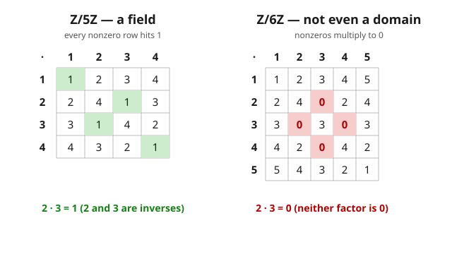

# Abstract Algebra · Lesson 3.2: Integral domains and fields

> ⏱ ~15 min · Module 3: Rings and Fields · Builds on: [3.1 Rings and ring homomorphisms](03-01-rings-ring-homomorphisms.md) · Unlocks: [3.3 Ideals and quotient rings](03-03-ideals-quotient-rings.md)

## Why this matters

A ring gives you $+$ and $\times$, but it makes almost no promises about how they interact. In $\mathbb{Z}/6\mathbb{Z}$ you can multiply two nonzero numbers and get *zero*: $2 \cdot 3 = 0$. That single misbehavior wrecks everything downstream — you can't cancel ($2x = 2y$ no longer forces $x = y$), a quadratic can have more roots than its degree, and "divide both sides" is meaningless. The two best-behaved kinds of ring are named for exactly what they forbid and what they allow: an **integral domain** forbids that zero-product accident, and a **field** additionally lets you divide by anything nonzero. Fields are where linear algebra lives — every vector space needs a field of scalars — and domains are where polynomials behave. This lesson is the pivot from "rings in general" to "the rings worth computing in."

## The idea

Think about the integers $\mathbb{Z}$. Two things are true there that you've used since grade school without naming them:

1. **No zero divisors:** if $ab = 0$ then $a = 0$ or $b = 0$. You can never sneak up on zero by multiplying two nonzero numbers.
2. **Cancellation:** if $ab = ac$ and $a \neq 0$, then $b = c$.

These are the *same fact* wearing two hats — $ab = ac \iff a(b-c) = 0$, and killing zero divisors is exactly what lets you conclude $b - c = 0$. A ring where this holds is an **integral domain**: multiplication is honest, and the model is $\mathbb{Z}$ itself.

But $\mathbb{Z}$ still can't *divide* — $2$ has no multiplicative inverse inside it. A **field** is a domain that fixes this last gap: every nonzero element has an inverse, so division (by anything but $0$) is always available. The model is $\mathbb{Q}$: you get $\mathbb{Q}$ from $\mathbb{Z}$ precisely by inventing the missing inverses, i.e. fractions.

So there's a ladder of niceness:

$$\text{commutative unital ring} \;\supset\; \text{integral domain} \;\supset\; \text{field}.$$

Every field is a domain (a unit can't be a zero divisor). The reverse fails — $\mathbb{Z}$ is a domain but not a field. Except for a beautiful finite surprise: **a finite integral domain has no choice but to be a field.** In finite-land, forbidding zero divisors forces division to exist.

## The formal version

Fix $R$ a **commutative ring with unity** $1 \neq 0$ throughout (so multiplication commutes and there's a multiplicative identity; the $1 \neq 0$ just rules out the silly one-element ring).

**Zero divisor.** A nonzero $a \in R$ is a *zero divisor* if there is a nonzero $b \in R$ with $ab = 0$.
*In words:* a nonzero element that can multiply another nonzero element down to zero.

**Integral domain.** $R$ is an *integral domain* if it has no zero divisors: $ab = 0 \implies a = 0$ or $b = 0$.
*In words:* a product of two nonzero things is nonzero — zero can only come from zero.

**Cancellation is equivalent.** $R$ is a domain $\iff$ cancellation holds ($a \neq 0$ and $ab = ac \implies b = c$).
*In words:* domains are exactly the rings where you're allowed to cancel a common nonzero factor. (Proof of $\Leftarrow$/$\Rightarrow$ is a one-liner in the worked examples.)

**Field.** $R$ is a *field* if it is commutative with $1 \neq 0$ and every nonzero element is a **unit** (has a multiplicative inverse): for each $a \neq 0$ there is $a^{-1}$ with $a a^{-1} = 1$.
*In words:* you can divide by anything except $0$.

**Field $\Rightarrow$ domain.** In a field, if $ab = 0$ and $a \neq 0$, multiply by $a^{-1}$: $b = a^{-1}(ab) = 0$. So no zero divisors.
*In words:* if you can divide, you can never manufacture zero from nonzero factors.

**Finite domain $\Rightarrow$ field.** If $D$ is a *finite* integral domain and $a \neq 0$, the map $\mu_a : D \to D$, $x \mapsto ax$, is injective (that's cancellation). An injective map from a finite set to itself is surjective, so some $x$ hits $1$: $ax = 1$. That $x$ is $a^{-1}$.
*In words:* in a finite domain, "multiply by $a$" shuffles the elements without collisions, so it must land on $1$ — handing you the inverse for free.

**$\mathbb{Z}/n\mathbb{Z}$.** For $n \geq 2$: the ring $\mathbb{Z}/n\mathbb{Z}$ is a field $\iff$ it is an integral domain $\iff$ $n$ is prime.
*In words:* clock arithmetic is a field exactly on prime clocks. (Composite $n = ab$ with $1 < a,b < n$ gives $\bar a \bar b = 0$ — instant zero divisors.)

**Field of fractions.** Every integral domain $D$ embeds in a smallest field $\operatorname{Frac}(D)$, built as formal fractions $a/b$ with $b \neq 0$, where $\tfrac{a}{b} = \tfrac{c}{d} \iff ad = bc$, with the usual $+$ and $\times$.
*In words:* you can always "complete" a domain to a field by allowing division, the same way $\mathbb{Z}$ grows into $\mathbb{Q} = \operatorname{Frac}(\mathbb{Z})$. (This construction *needs* the no-zero-divisor law — see Watch out.)

## Concrete instance

The whole lesson in one image: the multiplication tables of the nonzero elements of $\mathbb{Z}/5\mathbb{Z}$ and $\mathbb{Z}/6\mathbb{Z}$. On the left, **every row contains a $1$** — each element has an inverse, so it's a field. On the right, nonzero entries collapse to $0$ (e.g. $2 \cdot 3 = 0$) — genuine zero divisors, so it isn't even a domain.

## Worked examples

**Example 1 — $\mathbb{Z}/5\mathbb{Z}$ is a field, $\mathbb{Z}/6\mathbb{Z}$ is not.**

To show $\mathbb{Z}/5\mathbb{Z}$ is a field, exhibit an inverse for each nonzero class (all arithmetic mod $5$):

$$1 \cdot 1 = 1, \qquad 2 \cdot 3 = 6 = 1, \qquad 4 \cdot 4 = 16 = 1.$$

So $1^{-1}=1$, $2^{-1}=3$ (hence $3^{-1}=2$), $4^{-1}=4$. Every nonzero element is a unit $\Rightarrow$ field. ✓

For $\mathbb{Z}/6\mathbb{Z}$, the classes $\bar 2$ and $\bar 3$ are nonzero, yet

$$2 \cdot 3 = 6 = 0 \pmod 6.$$

So $\bar 2$ is a zero divisor: $\mathbb{Z}/6\mathbb{Z}$ is not a domain, hence not a field. Concretely $\bar 2$ has *no* inverse — $2x \equiv 1 \pmod 6$ is unsolvable because $2x$ is always even, never $\equiv 1$. ✗

**Example 2 — a finite integral domain is a field.**

*Claim.* If $D$ is a finite commutative ring with $1 \neq 0$ and no zero divisors, then every nonzero $a$ has an inverse.

*Proof.* Fix $a \neq 0$ and define $\mu_a : D \to D$ by $\mu_a(x) = ax$.

- **Injective.** Suppose $ax = ay$. Then $a(x - y) = 0$. Since $a \neq 0$ and $D$ has no zero divisors, $x - y = 0$, i.e. $x = y$. So $\mu_a$ is injective.
- **Surjective.** $\mu_a$ is an injective function from the finite set $D$ to itself; by pigeonhole, an injection on a finite set is a bijection, hence surjective.
- **Invert.** Surjectivity means $1$ is in the image: there is $x \in D$ with $ax = 1$. That $x$ is $a^{-1}$ (and $xa = 1$ too, by commutativity).

Since $a \neq 0$ was arbitrary, every nonzero element is a unit, so $D$ is a field. $\blacksquare$

(This is why $\mathbb{Z}/p\mathbb{Z}$ being a *domain* for prime $p$ automatically upgrades it to a *field* — no inverse-hunting required once you know it's finite and has no zero divisors.)

## Watch out

- **A zero divisor must itself be nonzero.** By convention $0$ is never counted as a zero divisor. The condition is about *two nonzero* elements multiplying to $0$; "$0 \cdot b = 0$" is not the phenomenon.
- **"No zero divisors" and "cancellation" are the same axiom** — don't treat them as two facts to verify. Cancellation *fails* precisely at zero divisors: in $\mathbb{Z}/6$, $2 \cdot 1 = 2 \cdot 4$ (both $= 2$) but $1 \neq 4$.
- **The field-of-fractions construction needs $D$ to be a domain.** If $b$ and $d$ could be zero divisors, the relation $\tfrac{a}{b} = \tfrac{c}{d} \iff ad = bc$ stops being transitive and $\tfrac{1}{b}$ can't be a well-defined inverse. You cannot build $\operatorname{Frac}(\mathbb{Z}/6)$ — the "fractions" collapse.
- **Domain does not mean field.** $\mathbb{Z}$ and $F[x]$ (polynomials over a field) are domains with plenty of non-invertible elements. The finite-forces-field theorem is exactly that — *finite*. Infinitely many domains are not fields.
- **Why $F[x]$ is a domain:** if $f, g \neq 0$ with leading terms $a_m x^m$, $b_n x^n$ (so $a_m, b_n \neq 0$), the top term of $fg$ is $a_m b_n x^{m+n}$, and $a_m b_n \neq 0$ because $F$ is a domain. So $fg \neq 0$, and $\deg(fg) = \deg f + \deg g$. (This degree law is why a polynomial of degree $d$ over a field has at most $d$ roots — no zero divisors, no extra roots.)

## One-liner

> A domain is a ring where $ab = 0$ forces $a = 0$ or $b = 0$ (so you can cancel); a field additionally lets you divide by anything nonzero — and in the finite world, the first condition secretly grants the second.

## Problems

**P1 (🟢)** Confirm $\mathbb{Z}/7\mathbb{Z}$ is a field by finding the inverse of every nonzero element $1, 2, 3, 4, 5, 6$.

**P2 (🟡)** Prove that $\mathbb{Z}/n\mathbb{Z}$ is an integral domain if and only if $n$ is prime. (Handle both directions: composite $\Rightarrow$ has a zero divisor; prime $\Rightarrow$ no zero divisor, using $p \mid ab \Rightarrow p\mid a$ or $p \mid b$.)

**P3 (🔴)** Let $D$ be an integral domain. Build $\operatorname{Frac}(D)$ from formal fractions and verify it is a field. Specifically: define the equivalence $\tfrac{a}{b}\sim\tfrac{c}{d} \iff ad = bc$ (with $b,d\neq 0$) and show (a) it is an equivalence relation — pinpoint where "no zero divisors" is used, (b) addition $\tfrac{a}{b}+\tfrac{c}{d}=\tfrac{ad+bc}{bd}$ and multiplication $\tfrac{a}{b}\cdot\tfrac{c}{d}=\tfrac{ac}{bd}$ are well-defined, and (c) every nonzero element has an inverse.

Solutions

**P1.** All arithmetic mod $7$. Pair each element with the one that multiplies to $1$:

$$1\cdot 1 = 1,\quad 2\cdot 4 = 8 = 1,\quad 3\cdot 5 = 15 = 1,\quad 6\cdot 6 = 36 = 1.$$

So $1^{-1}=1$, $2^{-1}=4$, $4^{-1}=2$, $3^{-1}=5$, $5^{-1}=3$, $6^{-1}=6$. Every nonzero class is a unit, so $\mathbb{Z}/7\mathbb{Z}$ is a field. (Sanity check: $6 \equiv -1$, and $(-1)(-1)=1$. ✓)

**P2.** ($\Leftarrow$, contrapositive) Suppose $n$ is composite, $n = ab$ with $1 < a, b < n$. Then $\bar a, \bar b \neq \bar 0$ in $\mathbb{Z}/n\mathbb{Z}$ (since $0 < a,b < n$), but $\bar a \bar b = \overline{ab} = \bar n = \bar 0$. So $\bar a$ is a zero divisor and $\mathbb{Z}/n\mathbb{Z}$ is not a domain.

($\Rightarrow$) Suppose $n = p$ is prime and $\bar a \bar b = \bar 0$, i.e. $p \mid ab$. Euclid's lemma (a prime dividing a product divides a factor) gives $p \mid a$ or $p \mid b$, i.e. $\bar a = \bar 0$ or $\bar b = \bar 0$. So there are no zero divisors and $\mathbb{Z}/p\mathbb{Z}$ is a domain.

Thus $\mathbb{Z}/n\mathbb{Z}$ is a domain $\iff n$ prime. (And since it's finite, "domain" upgrades to "field" by Example 2 — so $\mathbb{Z}/n\mathbb{Z}$ is a field $\iff n$ prime as well.) $\blacksquare$

*Where Euclid's lemma comes from, if you want it airtight:* if $p \nmid a$ then $\gcd(p,a) = 1$, so Bézout gives $px + ay = 1$ for integers $x,y$; multiply by $b$: $pxb + aby = b$. Now $p \mid pxb$ and $p \mid ab$ (given) so $p \mid aby$, hence $p \mid b$. (This same Bézout identity is exactly how you'd *construct* inverses in $\mathbb{Z}/p$: if $\gcd(a,p)=1$ then $ay \equiv 1 \pmod p$, so $\bar y = \bar a^{-1}$.)

**P3.** Let $S = \{(a,b) : a,b \in D,\ b \neq 0\}$ and write $\tfrac{a}{b}$ for $(a,b)$.

**(a) Equivalence relation.** $\tfrac{a}{b}\sim\tfrac{c}{d} \iff ad = bc$.
- *Reflexive:* $ab = ba$ (commutative), so $\tfrac{a}{b}\sim\tfrac{a}{b}$. ✓
- *Symmetric:* $ad = bc \Rightarrow cb = da$, so $\tfrac{c}{d}\sim\tfrac{a}{b}$. ✓
- *Transitive:* say $\tfrac{a}{b}\sim\tfrac{c}{d}$ and $\tfrac{c}{d}\sim\tfrac{e}{f}$, i.e. $ad = bc$ and $cf = de$. Multiply the first by $f$ and the second by $b$: $adf = bcf$ and $bcf = bde$, so $adf = bde$, i.e. $d(af - be) = 0$. Since $d \neq 0$ **and $D$ has no zero divisors**, $af - be = 0$, i.e. $af = be$, so $\tfrac{a}{b}\sim\tfrac{e}{f}$. ✓ **This is the only place the domain hypothesis is used — cancel the $d$.**

Write $\operatorname{Frac}(D)$ for the set of equivalence classes.

**(b) Operations well-defined.** Note $bd \neq 0$ (no zero divisors), so the results are legal fractions. Suppose $\tfrac{a}{b}\sim\tfrac{a'}{b'}$, i.e. $ab' = a'b$; we check the outputs don't depend on the representative (check the first slot; the second is symmetric).
- *Multiplication:* need $\tfrac{ac}{bd}\sim\tfrac{a'c}{b'd}$, i.e. $ac\cdot b'd = a'c \cdot bd$. Rearranged: $(ab')(cd) = (a'b)(cd)$, which holds because $ab' = a'b$. ✓
- *Addition:* need $\tfrac{ad+bc}{bd}\sim\tfrac{a'd+b'c}{b'd}$, i.e. $(ad+bc)(b'd) = (a'd+b'c)(bd)$. Expand:
$$ (ad+bc)b'd = ab'd^2 + bb'cd,\qquad (a'd+b'c)bd = a'b d^2 + bb'cd.$$
The $bb'cd$ terms match; the first terms match because $ab' = a'b$. ✓

One checks the ring axioms hold (associativity, distributivity, etc.) by routine fraction algebra; the additive identity is $\tfrac{0}{1}$ and the multiplicative identity is $\tfrac{1}{1}$, with $1 \neq 0$ so they differ. It is commutative because $D$ is.

**(c) Inverses.** Take a nonzero element $\tfrac{a}{b}$. "Nonzero" means $\tfrac{a}{b} \neq \tfrac{0}{1}$, i.e. $a\cdot 1 \neq b \cdot 0 = 0$, so $a \neq 0$. Then $\tfrac{b}{a}$ is a legal fraction, and

$$\frac{a}{b}\cdot\frac{b}{a} = \frac{ab}{ba} = \frac{ab}{ab} \sim \frac{1}{1},$$

since $(ab)\cdot 1 = 1\cdot(ba)$. So $\tfrac{b}{a} = \bigl(\tfrac{a}{b}\bigr)^{-1}$. Every nonzero element is a unit.

Therefore $\operatorname{Frac}(D)$ is a field, and $a \mapsto \tfrac{a}{1}$ embeds $D$ into it (injective because $\tfrac{a}{1}=\tfrac{a'}{1} \Rightarrow a = a'$). This is the abstract $\mathbb{Z} \hookrightarrow \mathbb{Q}$. $\blacksquare$

## Flashback

**From Lesson 3.1 (Rings and ring homomorphisms):** In the ring $\mathbb{Z}/12\mathbb{Z}$, which elements are **units** (have a multiplicative inverse), and which nonzero elements are **zero divisors**? Do these two categories account for every nonzero element? Find $7^{-1}$ explicitly.

Solution

A class $\bar a \in \mathbb{Z}/12\mathbb{Z}$ is a **unit** $\iff \gcd(a,12) = 1$. The classes coprime to $12$ are

$$\{\,1,\ 5,\ 7,\ 11\,\},$$

so there are four units. Every *other* nonzero class shares a factor with $12$, and each is a **zero divisor**: e.g. $\bar 2 \cdot \bar 6 = \overline{12} = \bar 0$, $\bar 3 \cdot \bar 4 = \bar 0$, $\bar 8 \cdot \bar 3 = \overline{24}=\bar 0$, $\bar 9 \cdot \bar 4 = \overline{36} = \bar 0$, $\bar{10}\cdot\bar 6 = \overline{60}=\bar 0$. So the nonzero classes split cleanly:

$$\underbrace{\{1,5,7,11\}}_{\text{units}} \ \sqcup\ \underbrace{\{2,3,4,6,8,9,10\}}_{\text{zero divisors}}.$$

Yes — in a *finite* commutative ring every nonzero element is either a unit or a zero divisor (multiplication-by-$a$ is either injective, hence bijective giving an inverse, or non-injective, which produces a zero divisor). That's the same injective-or-not dichotomy behind Example 2.

For $7^{-1}$: solve $7x \equiv 1 \pmod{12}$. Since $7 \cdot 7 = 49 = 48 + 1 \equiv 1$, we get $7^{-1} = 7$. (So $7$ is its own inverse.) ✓

## Connections

- **Backward:** this refines [3.1](03-01-rings-ring-homomorphisms.md)'s notion of a **unit** — a field is a ring where the group of units is *everything nonzero*, and a zero divisor is precisely a nonzero non-unit that actively breaks cancellation. The Flashback's units-vs-zero-divisors split is the finite shadow of that.
- **Forward:** [3.3](03-03-ideals-quotient-rings.md) shows a quotient $R/I$ is a **field** exactly when $I$ is *maximal* (and a **domain** exactly when $I$ is *prime*) — the domain/field ladder becomes a statement about ideals. Then [3.4](03-04-polynomial-rings.md) uses "$F[x]$ is a domain" and builds new fields as $F[x]/(p)$ for irreducible $p$, and [4.3](04-03-finite-fields.md) constructs *all* finite fields $\mathrm{GF}(p^n)$ this way — each is a finite domain, hence (by Example 2) automatically a field.
- **Sideways (linear algebra):** every vector space is defined *over a field* — the field axioms (division by nonzero scalars) are exactly what make Gaussian elimination, inverses, and dimension work. Redo linear algebra over $\mathbb{Z}/6$ and it falls apart the moment you try to scale a pivot by a zero divisor. See [`linalg-refresher`](../../linalg-refresher/syllabus.md).
- **Sideways (the model):** $\operatorname{Frac}(\mathbb{Z}) = \mathbb{Q}$ is nothing more exotic than "the fractions you already know," and $\operatorname{Frac}(F[x])$ is the field of *rational functions* $\tfrac{p(x)}{q(x)}$. The construction in P3 is the machine that manufactures both.
