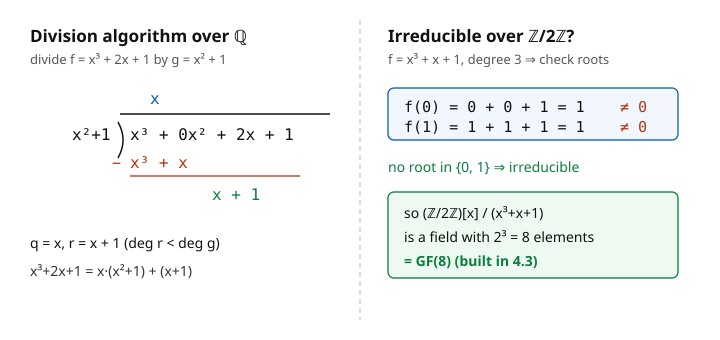

# Abstract Algebra · Lesson 3.4: Polynomial rings

> ⏱ ~15 min · Module 3: Rings and Fields · Builds on: [3.3 Ideals and quotient rings](03-03-ideals-quotient-rings.md) · Unlocks: [3.5 Characteristic and prime fields](03-05-characteristic-prime-fields.md)

## Why this matters

Here is the trick that makes the whole back half of this course go. You want a field where $x^2 + 1 = 0$ has a solution but $\mathbb{R}$ refuses to give you one. Instead of inventing $i$ by fiat, you take the ring of polynomials, quotient by the ideal $(x^2+1)$, and out pops $\mathbb{C}$ — a genuine field, with $i$ now a legal element. The same machine builds every finite field, every algebraic number field, every extension you'll meet in Module 4.

But the machine only works when $x^2+1$ is **irreducible** — a polynomial that can't be factored, the ring-theoretic cousin of a prime number. So this lesson has two jobs: set up the ring $F[x]$ (which turns out to have almost exactly the arithmetic of $\mathbb{Z}$), and learn to spot irreducibles, because *irreducible polynomial* $\Rightarrow$ *new field* is the punchline everything is aiming at.

## The idea

Fix a field $F$ (think $\mathbb{Q}$, $\mathbb{R}$, or $\mathbb{Z}/p\mathbb{Z}$). A **polynomial over $F$** is a finite expression $f = a_n x^n + \cdots + a_1 x + a_0$ with coefficients $a_i \in F$; the set of all of them is $F[x]$. Add coefficient-wise, multiply by the usual FOIL-and-collect. This is a ring, and — crucially — since $F$ is a field, $F[x]$ has no zero divisors: the product of two nonzero polynomials is nonzero (the leading terms multiply to something nonzero). So $F[x]$ is an integral domain.

The single most important structural fact: $F[x]$ behaves like $\mathbb{Z}$. In $\mathbb{Z}$ you can divide with remainder ($17 = 5\cdot 3 + 2$), every ideal is a single multiple $(n)$, and every number factors uniquely into primes. All three carry over to $F[x]$ *word for word*, with "size" measured by **degree** instead of absolute value, and "prime" renamed **irreducible**. The engine driving all of it is polynomial long division — the same long division you did in school, now a theorem.

## The formal version

**Degree.** For nonzero $f = a_n x^n + \cdots + a_0$ with $a_n \neq 0$, the **degree** $\deg f = n$ and the **leading coefficient** is $a_n$. Over a field, $\deg(fg) = \deg f + \deg g$ (leading coefficients can't cancel — no zero divisors). *In words: multiplying polynomials adds their degrees, exactly like counting digits.* The units (invertible elements) of $F[x]$ are precisely the nonzero constants, $\deg 0$.

**Division algorithm.** For any $f, g \in F[x]$ with $g \neq 0$, there exist **unique** $q, r \in F[x]$ with
$$f = qg + r, \qquad r = 0 \ \text{ or } \ \deg r < \deg g.$$
*In words: you can always divide $f$ by $g$ and get a remainder strictly smaller (in degree) than what you divided by.* This needs $F$ to be a field — you divide by the leading coefficient of $g$ at each step, which requires it to be invertible.

**Consequence: $F[x]$ is a PID.** Take any ideal $I \neq \{0\}$. Pick $p \in I$ of *smallest degree*. For any $f \in I$, divide: $f = qp + r$ with $\deg r < \deg p$. Then $r = f - qp \in I$, but $r$ has degree below the minimum, so $r = 0$ — meaning $p \mid f$. Hence $I = (p)$. *In words: every ideal of $F[x]$ is the set of multiples of one polynomial* — the exact analogue of "every ideal of $\mathbb{Z}$ is $(n)$." ($F[x]$ is a **Euclidean domain**, hence a **PID**, hence a unique factorization domain.)

**Factor theorem.** An element $a \in F$ is a **root** of $f$ (i.e. $f(a) = 0$) if and only if $(x - a) \mid f$. *In words: roots are exactly the linear factors.* Proof: divide $f$ by $x - a$ to get $f = q\cdot(x-a) + r$ with $r$ a constant; plug in $x = a$ to see $r = f(a)$.

**At most $n$ roots.** A nonzero polynomial of degree $n$ over a field has at most $n$ roots in $F$. Each root $a$ peels off a factor $(x-a)$; degree is finite and additive, so you run out. *This uses that $F$ is a domain* — over $\mathbb{Z}/8\mathbb{Z}$ (not a domain), the degree-2 polynomial $x^2 - 1$ has **four** roots ($1, 3, 5, 7$, each squaring to $1 \bmod 8$), because a factorization can vanish without either factor doing so. Domains are exactly what guarantee the bound.

**Irreducible polynomials.** A non-constant $p \in F[x]$ is **irreducible over $F$** if it cannot be written $p = gh$ with both $\deg g, \deg h \geq 1$. *In words: it doesn't split into smaller-degree pieces — the "prime" of $F[x]$.* Irreducibility is **field-dependent**: $x^2+1$ is irreducible over $\mathbb{R}$ but factors as $(x-i)(x+i)$ over $\mathbb{C}$; $x^2-2$ is irreducible over $\mathbb{Q}$ but splits as $(x-\sqrt2)(x+\sqrt2)$ over $\mathbb{R}$.

**The punchline (bridge to Module 4).** In the PID $F[x]$, the ideal $(p)$ is **maximal** $\iff$ $p$ is **irreducible**. Combine with 3.3's theorem "$R/M$ is a field $\iff$ $M$ is maximal":
$$\boxed{\ F[x]/(p(x)) \text{ is a field} \iff p(x) \text{ is irreducible over } F.\ }$$
*In words: quotient by an irreducible polynomial and you manufacture a brand-new field.* This is the field-building machine.

### Irreducibility tests (your toolkit)

- **Degree 2 or 3:** $p$ is irreducible over $F$ $\iff$ $p$ has **no root in $F$**. (A factorization would have to include a linear factor, i.e. a root. See P3.) *Fails for degree $\geq 4$*: a quartic can factor into two irreducible quadratics with no roots at all.
- **Rational root test** (over $\mathbb{Q}$): any rational root $p/q$ (in lowest terms) of $a_n x^n + \cdots + a_0$ has $p \mid a_0$ and $q \mid a_n$. Finitely many candidates to check.
- **Eisenstein's criterion** (over $\mathbb{Q}$): if a prime $\pi$ divides every coefficient *except* the leading one, and $\pi^2 \nmid a_0$, then $f$ is irreducible over $\mathbb{Q}$. Example: $x^5 - 6x + 3$ with $\pi = 3$ — $3$ divides $-6$ and $3$, not the leading $1$, and $9 \nmid 3$. Irreducible.
- **Reduction mod $p$:** if a monic integer polynomial stays the same degree and is irreducible over $\mathbb{Z}/p\mathbb{Z}$ for some prime $p$, it's irreducible over $\mathbb{Q}$. (A finite check, since $\mathbb{Z}/p\mathbb{Z}$ has finitely many elements.)

## Concrete instance

The left panel runs the division algorithm on the exact pair from Example 1: subtract $x\cdot(x^2+1)$, then read off the remainder. The right panel is the entire irreducibility test for a cubic over $\mathbb{Z}/2\mathbb{Z}$ — plug in both elements of the field, get nonzero both times, conclude irreducible.

## Worked examples

**Example 1 (division + factor theorem).** Divide $f = x^3 + 2x + 1$ by $g = x^2 + 1$ over $\mathbb{Q}$.

Long division: $x^3 \div x^2 = x$, and $x\cdot(x^2+1) = x^3 + x$. Subtract:
$$f - x(x^2+1) = (x^3 + 2x + 1) - (x^3 + x) = x + 1.$$
Now $\deg(x+1) = 1 < 2 = \deg g$, so we stop. Thus
$$x^3 + 2x + 1 = x\,(x^2+1) + (x+1), \qquad q = x, \ \ r = x + 1.$$

Now a **factor-theorem** demo on a different polynomial: factor $h = x^3 - 4x^2 + x + 6$ over $\mathbb{Q}$. Rational-root candidates are $\pm1, \pm2, \pm3, \pm6$. Test $x = -1$: $-1 - 4 - 1 + 6 = 0$ ✓. So $(x+1) \mid h$. Divide: $h = (x+1)(x^2 - 5x + 6) = (x+1)(x-2)(x-3)$. Three roots for a cubic — the maximum.

**Example 2 (irreducibility, field-dependent — the two headliners).**

*$x^2 + 1$ over $\mathbb{R}$ vs. $\mathbb{C}$.* It's degree 2, so it's irreducible $\iff$ it has no real root. $a^2 + 1 \geq 1 > 0$ for all $a \in \mathbb{R}$ — no root — **irreducible over $\mathbb{R}$**. Over $\mathbb{C}$, though, $i^2 + 1 = 0$, so $x^2+1 = (x-i)(x+i)$ — **reducible**. And $\mathbb{R}[x]/(x^2+1) \cong \mathbb{C}$: the field-building machine's flagship output.

*$x^3 + x + 1$ over $\mathbb{Z}/2\mathbb{Z}$.* Degree 3, so irreducible $\iff$ no root in $\{0, 1\}$. Test both:
$$f(0) = 0 + 0 + 1 = 1 \neq 0, \qquad f(1) = 1 + 1 + 1 = 1 \neq 0 \pmod 2.$$
No roots $\Rightarrow$ **irreducible over $\mathbb{Z}/2\mathbb{Z}$**. Therefore $\mathbb{Z}/2\mathbb{Z}[x]/(x^3+x+1)$ is a field — and since it's a 3-dimensional vector space over $\mathbb{Z}/2\mathbb{Z}$, it has $2^3 = 8$ elements. That's $\mathrm{GF}(8)$, built for you in [4.3](04-03-finite-fields.md).

## Watch out

- **"No root $\Rightarrow$ irreducible" is only for degree 2 and 3.** For degree $\geq 4$ it's false: $(x^2+1)^2 = x^4 + 2x^2 + 1$ has no real root but is obviously reducible over $\mathbb{R}$. A root gives a *linear* factor; a quartic can hide behind quadratic factors.
- **Irreducibility has no meaning without naming the field.** "Is $x^2 - 2$ irreducible?" is only answerable once you say over $\mathbb{Q}$ (yes) or over $\mathbb{R}$ (no). Always carry the field.
- **The division algorithm needs a field.** Over $\mathbb{Z}[x]$ you can't divide $x$ by $2x$ (no $\frac12$), and $\mathbb{Z}[x]$ is *not* a PID — the ideal $(2, x)$ needs two generators. The field hypothesis is doing real work.
- **Eisenstein failing tells you nothing.** No prime fitting the pattern does *not* mean reducible — it means try another test. Eisenstein only ever certifies irreducibility, never the opposite.

## One-liner

> $F[x]$ is $\mathbb{Z}$ with degree for size and irreducibles for primes — and quotienting by an irreducible is the machine that forges new fields.

## Problems

**P1 (🟢)** Over $\mathbb{Q}$, divide $f = 2x^3 + 3x^2 - 1$ by $g = x + 2$ using long division, then use the factor theorem to factor $f$ completely.

**P2 (🟡)** Determine, with justification, whether each is irreducible:
(a) $x^2 + x + 1$ over $\mathbb{Z}/2\mathbb{Z}$;
(b) $x^3 - 3x - 1$ over $\mathbb{Q}$;
(c) $x^4 + 1$ over $\mathbb{Q}$ (hint: Eisenstein doesn't apply directly — try substituting $x \mapsto x+1$).

**P3 (🔴)** Let $F$ be a field and $p \in F[x]$ with $\deg p \in \{2, 3\}$. Prove $p$ is irreducible over $F$ $\iff$ $p$ has no root in $F$. Then give a degree-4 polynomial over $\mathbb{R}$ with no real root that is nonetheless reducible, showing the equivalence breaks.

Solutions

**P1** Long division of $2x^3 + 3x^2 + 0x - 1$ by $x + 2$:
- $2x^3 \div x = 2x^2$; $\ 2x^2(x+2) = 2x^3 + 4x^2$; subtract: $-x^2 + 0x - 1$.
- $-x^2 \div x = -x$; $\ -x(x+2) = -x^2 - 2x$; subtract: $2x - 1$.
- $2x \div x = 2$; $\ 2(x+2) = 2x + 4$; subtract: $-5$.

So $f = (x+2)(2x^2 - x + 2) - 5$, i.e. $q = 2x^2 - x + 2$, $r = -5$. Since $r = -5 \neq 0$, $x = -2$ is **not** a root and $(x+2) \nmid f$.

Factor theorem, done honestly: search for an actual root. Rational-root candidates $\frac{p}{q}$ have $p \mid 1$, $q \mid 2$: $\pm1, \pm\frac12$. Test $x = \frac12$: $2\cdot\frac18 + 3\cdot\frac14 - 1 = \frac14 + \frac34 - 1 = 0$ ✓. So $(x - \frac12)$, equivalently $(2x - 1)$, divides $f$. Divide: $2x^3 + 3x^2 - 1 = (2x-1)(x^2 + 2x + 1) = (2x-1)(x+1)^2$. Complete factorization: $\boxed{(2x-1)(x+1)^2}$.

**P2**
(a) Degree 2 over $\mathbb{Z}/2\mathbb{Z}$, so check roots in $\{0,1\}$: $f(0) = 1$, $f(1) = 1+1+1 = 1 \pmod 2$. No root $\Rightarrow$ **irreducible**. (This builds $\mathrm{GF}(4)$.)

(b) Degree 3 over $\mathbb{Q}$, so check for rational roots. Candidates $\pm1$ (since $a_0 = -1$, $a_n = 1$): $f(1) = 1 - 3 - 1 = -3 \neq 0$; $f(-1) = -1 + 3 - 1 = 1 \neq 0$. No rational root, and for degree 3 that's decisive $\Rightarrow$ **irreducible over $\mathbb{Q}$**.

(c) Rational roots: $\pm1$ give $f(1) = 2$, $f(-1) = 2$ — no roots, but degree 4, so that settles nothing. Substitute $x \mapsto x + 1$:
$$(x+1)^4 + 1 = x^4 + 4x^3 + 6x^2 + 4x + 2.$$
Apply Eisenstein with $\pi = 2$: $2$ divides $4, 6, 4, 2$ (all but the leading $1$) and $2^2 = 4 \nmid 2$. So the shifted polynomial is irreducible over $\mathbb{Q}$. A substitution $x \mapsto x+1$ is an invertible change of variable (a ring automorphism of $\mathbb{Q}[x]$), so it preserves irreducibility. Hence $x^4 + 1$ is **irreducible over $\mathbb{Q}$**. (It factors over $\mathbb{R}$ and splits completely over $\mathbb{C}$ — the 8th roots of unity.)

**P3** ($\Rightarrow$) Contrapositive: if $p$ has a root $a \in F$, then by the factor theorem $(x-a) \mid p$, so $p = (x-a)\,q$ with $\deg q = \deg p - 1 \geq 1$ (since $\deg p \geq 2$). Both factors have degree $\geq 1$, so $p$ is reducible.

($\Leftarrow$) Contrapositive: suppose $p$ is reducible, $p = gh$ with $\deg g, \deg h \geq 1$. Since $\deg g + \deg h = \deg p \leq 3$ and both are $\geq 1$, at least one of $g, h$ has degree exactly $1$ (two factors each of degree $\geq 2$ would force $\deg p \geq 4$). A degree-1 factor $x - a$ (after scaling by its leading coefficient's inverse, legal since $F$ is a field) gives a root $a \in F$. So $p$ has a root.

Both directions established, so for $\deg p \in \{2,3\}$: irreducible $\iff$ no root. $\blacksquare$

*Degree-4 counterexample.* Take $p = (x^2+1)^2 = x^4 + 2x^2 + 1$ over $\mathbb{R}$. It has no real root ($x^2 + 1 > 0$ always), yet $p = (x^2+1)(x^2+1)$ is a nontrivial factorization into degree-2 pieces — reducible. The degree-4 case allows factorizations with *no* linear factor, which is exactly why the argument above (which forced a linear factor) required $\deg p \leq 3$.

## Flashback

**From Lesson 3.3 (Ideals and quotient rings):** In $\mathbb{Z}$, describe the ideal $(6) + (4)$ — the smallest ideal containing both $6$ and $4$ — as a single principal ideal $(d)$, and say what $d$ is in one word. Then state the analogous fact for two ideals $(f), (g)$ in $F[x]$.

Solution

$(6) + (4) = \{6m + 4n : m, n \in \mathbb{Z}\}$. By Bézout these integer combinations are exactly the multiples of $\gcd(6,4) = 2$, so $(6)+(4) = (2)$. In a word, $d$ is the **gcd**.

The analogue: $\mathbb{Z}$ and $F[x]$ are both PIDs, so $(f) + (g) = (d)$ where $d = \gcd(f, g)$ — the smallest ideal containing both is generated by their greatest common divisor, and the division algorithm (this lesson) computes it via the Euclidean algorithm on polynomials. Same theorem, degree replacing absolute value.

## Connections

- **Backward:** the "at most $n$ roots" bound leans on [3.2](03-02-integral-domains-fields.md) — it's the no-zero-divisors property doing the work. The punchline reuses [3.3](03-03-ideals-quotient-rings.md)'s "$R/M$ field $\iff$ $M$ maximal"; this lesson supplies "maximal $\iff$ irreducible" to close the loop.
- **Forward:** [4.1](04-01-field-extensions-degree.md)/[4.2](04-02-adjoining-roots-algebraic-elements.md) realize $F[x]/(p)$ as an extension $F(\alpha)$ where $\alpha$ is a root of $p$ that didn't exist in $F$; [4.3](04-03-finite-fields.md) builds every $\mathrm{GF}(p^n)$ this way (our $x^3+x+1$ gives $\mathrm{GF}(8)$).
- **Sideways (linear algebra):** the **minimal polynomial** of a matrix or operator is the monic generator of the ideal of polynomials that annihilate it — a principal ideal in $F[x]$ by exactly this lesson's PID argument (see [`linalg-refresher`](../../linalg-refresher/syllabus.md)).
- **Sideways (complex analysis):** the identity $\mathbb{C} = \mathbb{R}[x]/(x^2+1)$ is the algebraic definition of the complex numbers behind [`complex-analysis`](../../complex-analysis/syllabus.md) — $i$ is literally the coset $x + (x^2+1)$.
