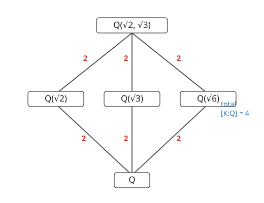

# Abstract Algebra · Lesson 4.1: Field extensions and degree

> ⏱ ~15 min · Module 4: Field extensions and a taste of Galois · Builds on: [3.5 Characteristic and prime fields](03-05-characteristic-prime-fields.md) · Unlocks: [4.2 Adjoining roots and algebraic elements](04-02-adjoining-roots-algebraic-elements.md)

## Why this matters

You already know how to *build* new fields: take a field $F$, a polynomial that won't factor, and form $F[x]/(p)$ — that's how [3.4](03-04-polynomial-rings.md) and [3.5](03-05-characteristic-prime-fields.md) conjured $\mathbb{C}$ from $\mathbb{R}$ and the finite fields out of $\mathbb{F}_p$. This module asks the reverse question: **given that $K$ sits on top of $F$, how big is the gap between them, and what fields can possibly live in between?**

The answer is astonishingly clean. The gap is measured by a single *integer* — a dimension — because $K$ is secretly a vector space over $F$. Suddenly all your linear-algebra reflexes apply to field theory: bases, dimension, "dimensions multiply." That one idea is the engine that will, three lessons from now, prove you *cannot* trisect an angle or double the cube with straightedge and compass. Impossibility theorems, from counting dimensions.

## The idea

Look at $\mathbb{C}$. Every complex number is $a + bi$ with $a, b \in \mathbb{R}$. That's not just notation — it says $\mathbb{C}$ is a **2-dimensional real vector space** with basis $\{1, i\}$: you scale the two basis vectors by real numbers and add. The field $\mathbb{C}$ is bigger than $\mathbb{R}$ by *exactly two dimensions' worth*.

Same story for $\mathbb{Q}(\sqrt{2})$ — the smallest field containing $\mathbb{Q}$ and $\sqrt{2}$. Its elements are $a + b\sqrt{2}$, so it's a 2-dimensional $\mathbb{Q}$-vector space with basis $\{1, \sqrt{2}\}$. You never need $(\sqrt2)^2$ as a new basis vector because $(\sqrt2)^2 = 2$ collapses back into the rationals — the minimal polynomial $x^2 - 2$ is exactly the relation that keeps the dimension at 2.

So the "size of the gap" between $F$ and $K$ is a *dimension*, and we call it the **degree** $[K:F]$. The magic is that these dimensions **multiply along a tower**: stack $\mathbb{Q} \subseteq \mathbb{Q}(\sqrt2) \subseteq \mathbb{Q}(\sqrt2,\sqrt3)$, each step doubling, and the whole tower has degree $2 \times 2 = 4$. Field theory just became bookkeeping with integers.

## The formal version

**Field extension.** If $F$ is a subfield of a field $K$ (same operations, $F \subseteq K$), we call $K/F$ a **field extension** (read "$K$ over $F$"; the slash is *not* a quotient). *In words: $K$ is a bigger field sitting on top of the smaller field $F$.*

**$K$ is an $F$-vector space.** Take $K$'s own addition as vector addition, and let elements of $F$ scale elements of $K$ by ordinary multiplication in $K$. All eight vector-space axioms hold for free — they're just special cases of the field axioms of $K$. *In words: forget that you can multiply any two elements of $K$; remember only that you can add them and scale by $F$. What's left is a vector space.*

**Degree.** The **degree** of the extension is
$$[K:F] \;=\; \dim_F K,$$
the dimension of $K$ as an $F$-vector space. If it's finite, $K/F$ is a **finite extension**; otherwise **infinite**. *In words: $[K:F]$ counts how many $F$-basis vectors you need to reach every element of $K$.* (Example of infinite: $[\mathbb{R}:\mathbb{Q}] = \infty$ — no finite rational basis reaches every real.)

**Tower law.** For fields $F \subseteq K \subseteq L$ with $[L:K]$ and $[K:F]$ finite,
$$[L:F] \;=\; [L:K]\,[K:F].$$
*In words: to go from the bottom field to the top, multiply the two step sizes.* The proof (worked in Problem 3) exhibits an explicit basis: if $\{a_1,\dots,a_m\}$ is an $F$-basis of $K$ and $\{b_1,\dots,b_n\}$ a $K$-basis of $L$, then the $mn$ products $\{a_i b_j\}$ form an $F$-basis of $L$.

**Immediate payoff.** If $F \subseteq K \subseteq L$, then $[K:F]$ **divides** $[L:F]$. So an intermediate field's degree can't be any integer it likes — it must be a divisor. This is the field-theory echo of Lagrange's theorem ([1.5](01-05-cosets-lagrange.md)): subobject sizes divide the whole.

## Picture

The subfield lattice of $\mathbb{Q}(\sqrt2,\sqrt3)/\mathbb{Q}$ — a diamond. Every edge is a degree-2 step; opposite sides multiply to the same total, $4$.

Read any path from $\mathbb{Q}$ to the top: $2 \times 2 = 4$. The three intermediate fields $\mathbb{Q}(\sqrt2)$, $\mathbb{Q}(\sqrt3)$, $\mathbb{Q}(\sqrt6)$ are *forced* to have degree 2 — a divisor of 4 that isn't 1 or 4. The lattice is a picture of the tower law's divisibility constraint.

## Worked examples

**Example 1 — $[\mathbb{Q}(\sqrt2):\mathbb{Q}] = 2$, and dividing in it.**

$\sqrt2$ is a root of $x^2 - 2$, which is irreducible over $\mathbb{Q}$ (no rational root, by the rational-root test from [3.4](03-04-polynomial-rings.md); equivalently $\sqrt2 \notin \mathbb{Q}$). So $\sqrt2$ satisfies a degree-2 relation and nothing smaller. Every element of $\mathbb{Q}(\sqrt2)$ is therefore $a + b\sqrt2$ with $a,b \in \mathbb{Q}$: the basis is $\{1, \sqrt2\}$ and the degree is $2$.

To see this really is a *field*, invert a nonzero element by rationalizing — the same conjugate trick that inverts complex numbers:
$$\frac{1}{1+\sqrt2} \;=\; \frac{1}{1+\sqrt2}\cdot\frac{1-\sqrt2}{1-\sqrt2} \;=\; \frac{1-\sqrt2}{1-2} \;=\; \frac{1-\sqrt2}{-1} \;=\; -1+\sqrt2.$$
Check: $(1+\sqrt2)(-1+\sqrt2) = -1 + \sqrt2 - \sqrt2 + 2 = 1.$ ✓ The inverse landed back inside $\mathbb{Q}(\sqrt2)$ — closure under inverses, exactly what makes the 2-dimensional space a field and not just a vector space.

**Example 2 — $[\mathbb{Q}(\sqrt2,\sqrt3):\mathbb{Q}] = 4$ via the tower.**

Build it in two steps. Bottom step: $[\mathbb{Q}(\sqrt2):\mathbb{Q}] = 2$ from Example 1. Top step: adjoin $\sqrt3$ to $\mathbb{Q}(\sqrt2)$. Is $\sqrt3$ already in $\mathbb{Q}(\sqrt2)$? If $\sqrt3 = a + b\sqrt2$, squaring gives $3 = a^2 + 2b^2 + 2ab\sqrt2$; matching the rational and $\sqrt2$-parts forces $ab = 0$, and neither $a=0$ (needs $\sqrt{3/2}$ rational) nor $b=0$ (needs $\sqrt3$ rational) works. So $\sqrt3 \notin \mathbb{Q}(\sqrt2)$, meaning $x^2 - 3$ stays irreducible over $\mathbb{Q}(\sqrt2)$ and
$$[\mathbb{Q}(\sqrt2,\sqrt3) : \mathbb{Q}(\sqrt2)] = 2.$$
Now multiply:
$$[\mathbb{Q}(\sqrt2,\sqrt3):\mathbb{Q}] = [\mathbb{Q}(\sqrt2,\sqrt3):\mathbb{Q}(\sqrt2)]\,[\mathbb{Q}(\sqrt2):\mathbb{Q}] = 2\cdot 2 = 4.$$
The product basis from the tower law is $\{1,\sqrt2\}\times\{1,\sqrt3\}$:
$$\{\,1,\ \sqrt2,\ \sqrt3,\ \sqrt2\sqrt3\,\} = \{\,1,\ \sqrt2,\ \sqrt3,\ \sqrt6\,\}.$$
Every element of $\mathbb{Q}(\sqrt2,\sqrt3)$ is a rational combination $a + b\sqrt2 + c\sqrt3 + d\sqrt6$ — and that's why $\mathbb{Q}(\sqrt6)$ shows up as a third intermediate field in the picture: $\sqrt6 = \sqrt2\cdot\sqrt3$ is already sitting in the basis.

## Watch out

- **$K/F$ is not a quotient.** The slash just names the pair "$K$ over $F$." Quotient rings used a slash too ($F[x]/(p)$); different operation, same punctuation. Context tells them apart.
- **Degree measures dimension, not element-count.** $[\mathbb{C}:\mathbb{R}] = 2$ even though $\mathbb{C}$ has uncountably many elements. Only for *finite* fields does degree control cardinality (see below), because there the scalar field is finite too.
- **The tower law needs finiteness to multiply as stated**, but the *divisibility* consequence is the real workhorse: an intermediate field's degree must divide the top degree. A would-be degree-3 subfield of a degree-4 extension simply cannot exist — $3 \nmid 4$.
- **Don't assume a basis for the top from bases below without checking the top step is genuinely new.** In Example 2 we had to verify $\sqrt3 \notin \mathbb{Q}(\sqrt2)$; if it had already been there, the second step would have degree 1 and the total would collapse.

## One-liner

> A field extension $K/F$ is a vector space, its degree $[K:F]$ is just $\dim_F K$, and degrees multiply up towers — so field theory becomes linear algebra, and divisibility alone rules out impossible subfields.

## Problems

**P1 (🟢)** Find the degree $[\mathbb{Q}(\sqrt[3]{2}):\mathbb{Q}]$ and give an explicit $\mathbb{Q}$-basis. (Hint: what is the minimal polynomial of $\sqrt[3]{2}$, and is it irreducible?)

**P2 (🟡)** Use the tower law to compute $[\mathbb{Q}(\sqrt2,\sqrt3,\sqrt5):\mathbb{Q}]$. Explain in one or two sentences why adjoining each successive $\sqrt{\ }$ doubles the degree rather than leaving it unchanged.

**P3 (🔴)** Prove the tower law. Let $F \subseteq K \subseteq L$, let $\{a_1,\dots,a_m\}$ be an $F$-basis of $K$ and $\{b_1,\dots,b_n\}$ a $K$-basis of $L$. Show the $mn$ elements $\{a_i b_j\}$ (a) span $L$ over $F$ and (b) are linearly independent over $F$, hence $[L:F] = mn = [L:K][K:F]$.

Solutions

**P1.** $\sqrt[3]{2}$ is a root of $x^3 - 2$. This is irreducible over $\mathbb{Q}$: a degree-3 polynomial factors over $\mathbb{Q}$ only if it has a rational root, and the rational-root candidates $\pm1, \pm2$ all fail ($1-2,\ 8-2,\ -1-2,\ -8-2$ are nonzero); equivalently, Eisenstein at $p=2$ applies directly ($2 \mid 0, 0, -2$; $2 \nmid 1$; $4 \nmid 2$). So the minimal polynomial has degree 3, giving
$$[\mathbb{Q}(\sqrt[3]{2}):\mathbb{Q}] = 3, \qquad \text{basis } \{\,1,\ \sqrt[3]{2},\ \sqrt[3]{4}\,\}.$$
(We need $\sqrt[3]{4} = (\sqrt[3]{2})^2$ as a third basis vector because now the collapsing relation is cubic, $(\sqrt[3]2)^3 = 2$, so powers up to the square are independent.)

**P2.** Build the tower $\mathbb{Q} \subseteq \mathbb{Q}(\sqrt2) \subseteq \mathbb{Q}(\sqrt2,\sqrt3) \subseteq \mathbb{Q}(\sqrt2,\sqrt3,\sqrt5)$. From Example 2 the first two steps give degree $4$. For the top step, $\sqrt5 \notin \mathbb{Q}(\sqrt2,\sqrt3)$: an element there is $a+b\sqrt2+c\sqrt3+d\sqrt6$, and squaring such a thing to get the rational $5$ forces all the "mixed" coefficients to vanish, which drives $a,b,c,d$ to a contradiction with rationality (no combination of $\sqrt2,\sqrt3,\sqrt6$ squares to a rational $5$ with a single surd). So $x^2-5$ is irreducible over $\mathbb{Q}(\sqrt2,\sqrt3)$ and the last step has degree 2. Therefore
$$[\mathbb{Q}(\sqrt2,\sqrt3,\sqrt5):\mathbb{Q}] = 2\cdot 2\cdot 2 = 8, \quad \text{basis } \{1,\sqrt2,\sqrt3,\sqrt5,\sqrt6,\sqrt{10},\sqrt{15},\sqrt{30}\}.$$
Each $\sqrt{\ }$ doubles the degree because the newly adjoined root is *not already in* the field built so far (the primes 2, 3, 5 are independent under square roots), so its minimal polynomial $x^2 - p$ stays degree 2 over the current field — a genuinely new degree-2 step every time, never a collapse to degree 1.

**P3.** *(a) Spanning.* Take any $\ell \in L$. Since $\{b_j\}$ is a $K$-basis of $L$, write $\ell = \sum_{j=1}^n c_j b_j$ with each $c_j \in K$. Each $c_j$, being in $K$, expands in the $F$-basis $\{a_i\}$: $c_j = \sum_{i=1}^m \lambda_{ij} a_i$ with $\lambda_{ij} \in F$. Substitute:
$$\ell = \sum_{j=1}^n\Big(\sum_{i=1}^m \lambda_{ij} a_i\Big) b_j = \sum_{i,j} \lambda_{ij}\,(a_i b_j).$$
So every $\ell$ is an $F$-combination of the $mn$ products $\{a_i b_j\}$ — they span $L$ over $F$.

*(b) Independence.* Suppose $\sum_{i,j} \lambda_{ij}\,(a_i b_j) = 0$ with all $\lambda_{ij} \in F$. Group by $b_j$:
$$\sum_{j=1}^n \Big(\underbrace{\sum_{i=1}^m \lambda_{ij} a_i}_{\;=\,c_j\,\in\,K}\Big) b_j = 0.$$
The inner sums $c_j$ lie in $K$, and $\{b_j\}$ is independent *over $K$*, so every $c_j = 0$. That means $\sum_{i=1}^m \lambda_{ij} a_i = 0$ for each fixed $j$. Now $\{a_i\}$ is independent *over $F$* and the $\lambda_{ij} \in F$, so every $\lambda_{ij} = 0$. Hence the only relation is the trivial one: $\{a_i b_j\}$ is $F$-independent.

Spanning + independence ⇒ $\{a_i b_j\}$ is an $F$-basis of $L$, and it has exactly $mn$ elements (they're distinct: a repeat would itself be a nontrivial dependence). Therefore $[L:F] = mn = [L:K][K:F]$. $\blacksquare$

## Flashback

**From Lesson 3.5 (Characteristic and prime fields):** A finite field $\mathbb{F}_{p^n}$ is a vector space over its prime field $\mathbb{F}_p$. Using that, explain why **every** finite field has exactly $p^n$ elements for some prime $p$ and integer $n \geq 1$ — and in the language of *this* lesson, what is $[\mathbb{F}_{p^n}:\mathbb{F}_p]$?

Solution

A finite field $K$ has some prime characteristic $p$ (characteristic 0 would force an infinite copy of $\mathbb{Q}$ inside it), so its prime field is $\mathbb{F}_p \cong \mathbb{Z}/p\mathbb{Z}$. Then $K$ is a vector space over $\mathbb{F}_p$; being finite, it has finite dimension — call it $n = [\mathbb{F}_{p^n}:\mathbb{F}_p]$. Pick an $\mathbb{F}_p$-basis $\{v_1,\dots,v_n\}$: every element of $K$ is a unique combination $\sum_{i=1}^n c_i v_i$ with each $c_i$ ranging over the $p$ values of $\mathbb{F}_p$. That's $p$ independent choices, $n$ times, so
$$|K| = p^n, \qquad [\mathbb{F}_{p^n}:\mathbb{F}_p] = n.$$
The degree *is* the exponent — which is why "counting basis choices" pins the size of a finite field to a prime power and nothing else.

## Connections

- **Backward:** the extensions here are exactly the fields you built as $F[x]/(p)$ in [3.4](03-04-polynomial-rings.md) and [3.5](03-05-characteristic-prime-fields.md) — the degree $[K:F]$ will turn out to be $\deg p$, the punchline of [4.2](04-02-adjoining-roots-algebraic-elements.md). The divisibility corollary is Lagrange's theorem ([1.5](01-05-cosets-lagrange.md)) wearing a vector-space costume.
- **Sideways (linear algebra):** everything rests on dimension and bases — the [linear algebra refresher](../../linalg-refresher/syllabus.md) is the toolkit, and the tower law is a statement about dimensions of nested spaces.
- **Forward:** [4.2](04-02-adjoining-roots-algebraic-elements.md) shows $F(\alpha) \cong F[x]/(m_\alpha)$ with degree $= \deg m_\alpha$, so "adjoin a root" and "quotient by its minimal polynomial" are the same act; [4.3](04-03-finite-fields.md) reruns the Flashback to classify all finite fields; [4.4](04-04-galois-automorphisms-taste.md) matches the diamond of intermediate fields to a group of symmetries — the start of Galois theory.
- **Sideways (classical impossibility):** a straightedge-and-compass construction can only reach points whose coordinates lie in a tower of degree-2 extensions, so every constructible number has degree a **power of 2** over $\mathbb{Q}$. Doubling the cube demands $\sqrt[3]{2}$, of degree **3** (Problem 1) — and $3$ is not a power of $2$. The construction is impossible, proved by the single fact that degrees multiply.
