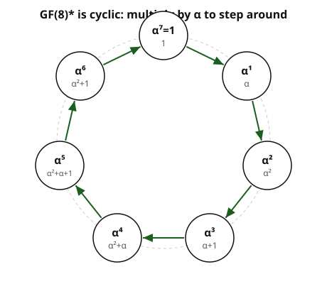

# Abstract Algebra · Lesson 4.3: Finite fields $\mathrm{GF}(p^n)$

> ⏱ ~15 min · Module 4: Fields and extensions · Builds on: [4.2 Adjoining roots and algebraic elements](04-02-adjoining-roots-algebraic-elements.md) · Unlocks: [4.4 A taste of Galois: automorphisms as symmetry](04-04-galois-automorphisms-taste.md)

## Why this matters

Every field you met before Module 3 was infinite: $\mathbb{Q}$, $\mathbb{R}$, $\mathbb{C}$. But the fields that actually run inside your devices are *finite*. When your phone stores a file with a CRC checksum, when a QR code survives a coffee stain, when AES encrypts a message — the arithmetic happening is addition and multiplication in a finite field. There is exactly one finite field of each allowed size, and this lesson builds one with your bare hands and watches its multiplicative group turn out to be a single clock, cycling.

The punchline you'll earn: a finite field is *rigid*. You don't get to choose its size (only prime powers are allowed), and once you fix the size there's essentially only one such field. That rigidity is what makes it a reliable substrate for engineering.

## The idea

Start from a fact you already have (Lesson [3.5](03-05-characteristic-prime-fields.md)): a finite field $F$ has **prime characteristic** $p$, meaning $\underbrace{1+1+\dots+1}_{p}=0$ for some prime $p$, and its **prime subfield** is a copy of $\mathbb{Z}/p$. So $F$ contains $\mathbb{F}_p=\mathbb{Z}/p$, and $F$ is a **vector space over $\mathbb{F}_p$** — addition is vector addition, scaling by $\mathbb{F}_p$ is allowed. A finite vector space over $\mathbb{F}_p$ has some dimension $n$, hence exactly $p^n$ elements (choose each of $n$ coordinates from $p$ options).

So the *only* possible sizes are $p^n$. And there is no field of size $6$, or $10$, or $12$ — those aren't prime powers.

How do you *build* one? Exactly the machine from Lesson [4.2](04-02-adjoining-roots-algebraic-elements.md). Take an irreducible polynomial $f$ of degree $n$ over $\mathbb{F}_p$ and form $\mathbb{F}_p[x]/(f)$. Because $f$ is irreducible, the ideal $(f)$ is maximal, so the quotient is a field; its elements are the polynomials of degree $<n$ in a root $\alpha$, and there are exactly $p^n$ of them. One recipe, every finite field.

The last surprise is about *multiplication*. Strip out $0$ and look at the $p^n-1$ nonzero elements under multiplication. This group is not just abelian — it is **cyclic**. There is a single element whose powers sweep out *everything nonzero*. Multiplication in a finite field is a clock.

## The formal version

**Existence and uniqueness.** For every prime $p$ and every integer $n\ge 1$ there is a field with exactly $p^n$ elements, and any two fields of that size are isomorphic. We write it $\mathrm{GF}(p^n)$ or $\mathbb{F}_{p^n}$ ("GF" = Galois field).

> In words: fix the size to a prime power and the field is *forced* — there's only one, up to relabeling.

**Construction.** For any irreducible $f\in\mathbb{F}_p[x]$ of degree $n$,
$$\mathbb{F}_{p^n}\;\cong\;\mathbb{F}_p[x]/(f),$$
whose elements are $\{c_{n-1}\alpha^{n-1}+\dots+c_1\alpha+c_0 : c_i\in\mathbb{F}_p\}$, where $\alpha$ is the class of $x$ (a root of $f$). Uniqueness says the *choice of $f$ doesn't matter*: different irreducibles of degree $n$ give isomorphic fields.

**The multiplicative group is cyclic.** The group $\mathbb{F}_{p^n}^{*}$ of nonzero elements under multiplication is cyclic of order $p^n-1$:
$$\mathbb{F}_{p^n}^{*}\;\cong\;\mathbb{Z}/(p^n-1).$$
A generator is called a **primitive element**. If $\alpha$ is primitive, every nonzero element is $\alpha^k$ for a unique $k\in\{0,1,\dots,p^n-2\}$.

> In words: pick one lucky element and its powers hit every nonzero element exactly once before returning home.

**Two consequences.** Since every nonzero $\beta$ satisfies $\beta^{\,p^n-1}=1$ (Lagrange, [1.5](01-05-cosets-lagrange.md)), multiplying by $\beta$ and tacking on the zero case gives $\beta^{\,p^n}=\beta$ for *all* $\beta$. So every element of $\mathbb{F}_{p^n}$ is a root of
$$x^{p^n}-x,$$
and these $p^n$ elements are *exactly* its roots — another way to pin the field down. Finally, the map $\mathrm{Frob}:x\mapsto x^{p}$ is a field automorphism (it respects $+$ because $(a+b)^p=a^p+b^p$ in characteristic $p$ — the "freshman's dream" is a theorem here). That's the **Frobenius**, and it's the seed of Galois theory in [4.4](04-04-galois-automorphisms-taste.md).

**A warning up front.** $\mathbb{F}_{p^n}$ is *not* $\mathbb{Z}/(p^n)$ when $n>1$. In $\mathbb{Z}/8$, $2\cdot 4=0$ with neither factor zero — zero divisors, so it isn't even a field. $\mathrm{GF}(8)$ is a genuinely different object, built from a polynomial quotient, not a modular-integer quotient.

## Concrete instance: $\mathrm{GF}(8)$ as a clock

Take $\mathrm{GF}(8)=\mathbb{Z}/2[x]/(x^3+x+1)$ with root $\alpha$, so $\alpha^3=\alpha+1$ (in characteristic 2, $-1=1$). The eight elements are all polynomials of degree $<3$ in $\alpha$. Writing each nonzero one as a power of $\alpha$ gives a **log table** — and the powers march through all seven nonzero elements before closing the loop at $\alpha^7=1$, exactly as $\mathbb{F}_8^{*}\cong\mathbb{Z}/7$ predicts:

| power | polynomial |
|---|---|
| $\alpha^0=1$ | $1$ |
| $\alpha^1$ | $\alpha$ |
| $\alpha^2$ | $\alpha^2$ |
| $\alpha^3$ | $\alpha+1$ |
| $\alpha^4$ | $\alpha^2+\alpha$ |
| $\alpha^5$ | $\alpha^2+\alpha+1$ |
| $\alpha^6$ | $\alpha^2+1$ |
| $\alpha^7$ | $1$ (back to start) |

The log table *is* the whole point of a finite field in practice: to multiply, add exponents mod $7$; to add, fall back to polynomials. That's how hardware does $\mathrm{GF}(2^n)$ arithmetic.

## Worked examples

**Example 1 — warm-up: build $\mathrm{GF}(4)$.** The only degree-2 irreducible over $\mathbb{F}_2$ is $x^2+x+1$ (check: $f(0)=1$, $f(1)=1+1+1=1$, no root in $\mathbb{F}_2$, so no linear factor — irreducible). Let $\alpha$ be a root, so $\alpha^2+\alpha+1=0$, i.e. $\alpha^2=\alpha+1$. The four elements are
$$\{0,\;1,\;\alpha,\;\alpha+1\}.$$
Addition is componentwise mod 2: $(\alpha)+(\alpha+1)=1$. Multiplication reduces using $\alpha^2=\alpha+1$: $\alpha\cdot(\alpha+1)=\alpha^2+\alpha=(\alpha+1)+\alpha=1$, so $\alpha$ and $\alpha+1$ are inverses. Is $\mathbb{F}_4^{*}$ cyclic of order 3? Take powers of $\alpha$: $\alpha^1=\alpha$, $\alpha^2=\alpha+1$, $\alpha^3=\alpha\cdot\alpha^2=\alpha(\alpha+1)=\alpha^2+\alpha=(\alpha+1)+\alpha=1$. Order 3 — $\alpha$ is primitive. ✓

**Example 2 — the boss: build $\mathrm{GF}(8)=\mathbb{Z}/2[x]/(x^3+x+1)$.**

*Step 1 — irreducibility.* $f(x)=x^3+x+1$ has degree 3, so it factors nontrivially over $\mathbb{F}_2$ only if it has a *linear* factor, i.e. a root in $\mathbb{F}_2$. But $f(0)=1$ and $f(1)=1+1+1=1$ — no root. Hence $f$ is irreducible, and $\mathbb{Z}/2[x]/(f)$ is a field with $2^3=8$ elements.

*Step 2 — the eight elements.* With $\alpha^3=\alpha+1$, they are the degree-$<3$ polynomials:
$$\{0,\;1,\;\alpha,\;\alpha+1,\;\alpha^2,\;\alpha^2+1,\;\alpha^2+\alpha,\;\alpha^2+\alpha+1\}.$$

*Step 3 — add.* Just XOR coefficients (characteristic 2):
$$(\alpha^2+\alpha)+(\alpha^2+1)=\alpha+1 \qquad(\text{the }\alpha^2\text{ terms cancel}).$$

*Step 4 — multiply, reducing with $\alpha^3=\alpha+1$.*
$$(\alpha^2+\alpha)(\alpha^2+1)=\alpha^4+\alpha^2+\alpha^3+\alpha.$$
Now $\alpha^4=\alpha\cdot\alpha^3=\alpha(\alpha+1)=\alpha^2+\alpha$ and $\alpha^3=\alpha+1$, so
$$=(\alpha^2+\alpha)+\alpha^2+(\alpha+1)+\alpha=\alpha+1.$$
(Sanity check via the log table: $\alpha^4\cdot\alpha^6=\alpha^{10}=\alpha^{10-7}=\alpha^3=\alpha+1$. ✓)

*Step 5 — $\alpha$ is a generator.* Compute the powers, always reducing $\alpha^3=\alpha+1$:
$$\alpha,\;\alpha^2,\;\underbrace{\alpha+1}_{\alpha^3},\;\underbrace{\alpha^2+\alpha}_{\alpha^4},\;\underbrace{\alpha^2+\alpha+1}_{\alpha^5},\;\underbrace{\alpha^2+1}_{\alpha^6},\;\underbrace{1}_{\alpha^7}.$$
Seven distinct nonzero elements, then $\alpha^7=1$. So $\alpha$ has order $7=|\mathbb{F}_8^{*}|$ — a primitive element, and $\mathbb{F}_8^{*}\cong\mathbb{Z}/7$. Boss cleared.

## Watch out

- **$\mathbb{F}_{p^n}\ne\mathbb{Z}/(p^n)$.** For $n>1$ the ring $\mathbb{Z}/(p^n)$ has zero divisors ($p\cdot p^{n-1}=0$) and is not a field. The field is a *polynomial* quotient. Same size, totally different multiplication.
- **"Cyclic" is about $\times$, not $+$.** The *additive* group of $\mathbb{F}_{2^n}$ is $(\mathbb{Z}/2)^n$ — every nonzero element has order 2, so it is *not* cyclic for $n>1$. It's the *multiplicative* group $\mathbb{F}_{p^n}^{*}$ that's cyclic.
- **Not every element is primitive.** In $\mathbb{F}_8$, $\alpha$ generates — but you must check. Since $7$ is prime, here every non-identity element happens to have order 7; in $\mathbb{F}_{16}^{*}\cong\mathbb{Z}/15$, elements can have order $3$ or $5$ and fail to generate.
- **The root $\alpha$ isn't magic — the relation is.** All the arithmetic flows from the single reduction rule $\alpha^n=(\text{lower terms})$ that $f$ hands you. Get $f$'s reduction wrong and everything downstream is wrong.

## One-liner

> A finite field exists only in prime-power size $p^n$, is unique once you fix that size, and its nonzero elements form one big multiplicative clock — powers of a single primitive element.

## Problems

**P1 (🟢)** In $\mathrm{GF}(4)=\mathbb{F}_2[x]/(x^2+x+1)$ with $\alpha^2=\alpha+1$, compute (a) $(\alpha+1)+\alpha$, (b) $(\alpha+1)\cdot\alpha$, and (c) $(\alpha+1)^2$. Express each answer in the standard form $c_1\alpha+c_0$.

**P2 (🟡)** In $\mathrm{GF}(8)=\mathbb{F}_2[x]/(x^3+x+1)$ with $\alpha^3=\alpha+1$, multiply $(\alpha^2+1)(\alpha^2+\alpha+1)$, reducing to standard form. Then explain why the order of $\alpha^2$ must divide $7$, and determine that order.

**P3 (🔴)** *Boss variant — uniqueness in action.* The polynomial $g(x)=x^3+x^2+1$ is the *other* irreducible cubic over $\mathbb{F}_2$. Build $\mathrm{GF}(8)$ a second way as $\mathbb{F}_2[x]/(g)$ with root $\beta$ (so $\beta^3=\beta^2+1$). (a) Confirm $g$ is irreducible. (b) List all $8$ elements. (c) Compute one sample sum and one sample product (reduced). (d) Show $\beta$ is a primitive element by listing $\beta^1,\dots,\beta^7$. (e) In one sentence, say what "uniqueness of $\mathrm{GF}(8)$" means about this field versus the $x^3+x+1$ version.

Solutions

**P1.** Use $\alpha^2=\alpha+1$ and coefficients mod 2.
(a) $(\alpha+1)+\alpha=(1+1)\alpha+1=1$.
(b) $(\alpha+1)\alpha=\alpha^2+\alpha=(\alpha+1)+\alpha=1$. (So $\alpha+1=\alpha^{-1}$.)
(c) $(\alpha+1)^2=\alpha^2+2\alpha+1=\alpha^2+1$ (cross term $2\alpha=0$) $=(\alpha+1)+1=\alpha$.

**P2.** Expand, then reduce with $\alpha^3=\alpha+1$ (so $\alpha^4=\alpha^2+\alpha$):
$$(\alpha^2+1)(\alpha^2+\alpha+1)=\alpha^4+\alpha^3+\alpha^2+\alpha^2+\alpha+1=\alpha^4+\alpha^3+\alpha+1.$$
Substitute: $\alpha^4=\alpha^2+\alpha$, $\alpha^3=\alpha+1$:
$$=(\alpha^2+\alpha)+(\alpha+1)+\alpha+1=\alpha^2+\alpha.$$
(Log-table check: $\alpha^6\cdot\alpha^5=\alpha^{11}=\alpha^{11-7}=\alpha^4=\alpha^2+\alpha$. ✓)
Order of $\alpha^2$: it lives in $\mathbb{F}_8^{*}$, a group of order $7$, so by Lagrange its order divides $7$. Since $7$ is prime the only divisors are $1$ and $7$; as $\alpha^2\ne 1$, its order is $\boxed{7}$ (it too is a primitive element). Equivalently, order of $\alpha^2=7/\gcd(2,7)=7$.

**P3.** $g(x)=x^3+x^2+1$, root $\beta$, $\beta^3=\beta^2+1$ (char 2).
(a) Degree 3 ⇒ reducible only with a root in $\mathbb{F}_2$. $g(0)=1$, $g(1)=1+1+1=1$ — no root, so **irreducible**. Thus $\mathbb{F}_2[x]/(g)$ is a field of $8$ elements.
(b) Degree-$<3$ polynomials: $\{0,\,1,\,\beta,\,\beta+1,\,\beta^2,\,\beta^2+1,\,\beta^2+\beta,\,\beta^2+\beta+1\}$.
(c) Sum: $(\beta^2+1)+(\beta^2+\beta+1)=\beta$. Product, reducing with $\beta^3=\beta^2+1$: 
$$\beta\cdot\beta^2=\beta^3=\beta^2+1.$$
(d) Powers, always reducing $\beta^3=\beta^2+1$ (and $\beta^4=\beta\cdot\beta^3=\beta^3+\beta=(\beta^2+1)+\beta=\beta^2+\beta+1$):
$$\beta^1=\beta,\quad \beta^2=\beta^2,\quad \beta^3=\beta^2+1,\quad \beta^4=\beta^2+\beta+1,$$
$$\beta^5=\beta\cdot\beta^4=\beta^3+\beta^2+\beta=(\beta^2+1)+\beta^2+\beta=\beta+1,$$
$$\beta^6=\beta\cdot\beta^5=\beta^2+\beta,\qquad \beta^7=\beta\cdot\beta^6=\beta^3+\beta^2=(\beta^2+1)+\beta^2=1.$$
Seven distinct nonzero values, then $\beta^7=1$: $\beta$ has order $7$, a **primitive element**. ✓
(e) Uniqueness of $\mathrm{GF}(8)$ means this field and the $x^3+x+1$ field are **isomorphic** — the same field up to relabeling. (Concretely, $\beta\mapsto$ some power of $\alpha$ of order 7, e.g. $\alpha^3=\alpha+1$, extends to a field isomorphism; there is really only one $\mathrm{GF}(8)$.)

## Flashback

**From Lesson [4.2](04-02-adjoining-roots-algebraic-elements.md) (minimal polynomials / arithmetic in $F(\alpha)$):** Let $\alpha=\sqrt[3]{2}\in\mathbb{R}$. (a) Give the minimal polynomial of $\alpha$ over $\mathbb{Q}$ and the degree $[\mathbb{Q}(\alpha):\mathbb{Q}]$. (b) Write $\dfrac{1}{1+\alpha}$ in the standard basis form $a+b\alpha+c\alpha^2$ with $a,b,c\in\mathbb{Q}$.

Solution

(a) $\alpha^3=2$, so $\alpha$ is a root of $x^3-2$. This is irreducible over $\mathbb{Q}$ (Eisenstein at $p=2$: coefficients $1,0,0,-2$; $2\mid 0,0,-2$, $2\nmid 1$, $4\nmid 2$). So the minimal polynomial is $x^3-2$ and $[\mathbb{Q}(\alpha):\mathbb{Q}]=3$; a $\mathbb{Q}$-basis is $\{1,\alpha,\alpha^2\}$.

(b) Rationalize using $\alpha^3=2$. Seek $(1+\alpha)^{-1}=a+b\alpha+c\alpha^2$, i.e. $(1+\alpha)(a+b\alpha+c\alpha^2)=1$. Expand, using $\alpha^3=2$:
$$a+b\alpha+c\alpha^2+a\alpha+b\alpha^2+c\alpha^3=(a+2c)+(a+b)\alpha+(b+c)\alpha^2.$$
Match to $1+0\cdot\alpha+0\cdot\alpha^2$: $a+2c=1$, $a+b=0$, $b+c=0$. From the last two, $b=-a$ and $c=-b=a$; then $a+2a=1\Rightarrow a=\tfrac13$, $b=-\tfrac13$, $c=\tfrac13$. So
$$\frac{1}{1+\alpha}=\tfrac13-\tfrac13\alpha+\tfrac13\alpha^2=\frac{1-\alpha+\alpha^2}{3}.$$
Check: $(1+\alpha)(1-\alpha+\alpha^2)=1+\alpha^3=1+2=3$. ✓ Dividing by 3 gives the inverse — the same "reduce with the defining relation" move that powers all of today's finite-field arithmetic.

## Connections

- **Backward:** the size $p^n$ comes straight from [3.5](03-05-characteristic-prime-fields.md) (prime characteristic + $\mathbb{F}_p$-vector-space structure), and the construction $\mathbb{F}_p[x]/(\text{irreducible})$ is [4.2](04-02-adjoining-roots-algebraic-elements.md)'s "adjoin a root" applied over a finite base — the very inverse-by-reduction trick from the Flashback.
- **Forward:** [4.4](04-04-galois-automorphisms-taste.md) studies the Frobenius $x\mapsto x^p$; the Galois group of $\mathbb{F}_{p^n}$ over $\mathbb{F}_p$ is *cyclic of order $n$*, generated by Frobenius — finite fields are the cleanest place to see Galois theory work.
- **Sideways (coding theory / information):** Reed–Solomon codes — the workhorse behind CDs, DVDs, QR codes, and deep-space telemetry — are built by evaluating polynomials over $\mathbb{F}_{2^m}$, and their whole error-correcting power rests on $\mathbb{F}_{p^n}^{*}$ being cyclic. See the error-correcting-codes thread in the [information theory](../../information-theory/syllabus.md) course.
- **Sideways (cryptography):** AES does its mixing arithmetic in $\mathrm{GF}(2^8)=\mathbb{F}_2[x]/(x^8+x^4+x^3+x+1)$ — every byte is an element of an 8-dimensional finite field, and the S-box is essentially "take the multiplicative inverse in $\mathrm{GF}(2^8)$." Elliptic-curve cryptography likewise lives over finite fields.
