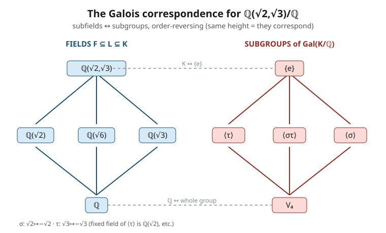

# Abstract Algebra · Lesson 4.4: A taste of Galois — automorphisms as symmetry

> ⏱ ~15 min · Module 4: Field Extensions · Builds on: [4.3 Finite fields GF(p^n)](04-03-finite-fields.md) · Unlocks: **end of the course** — the sequel is [representation theory](../../representation-theory/syllabus.md)

## Why this matters

We opened this course by declaring that a group *is* the symmetries of a thing. We then spent Module 3 building an entirely different-looking object — rings and fields, with two operations and a fresh axiom system — and it might feel like we wandered away from symmetry entirely.

We didn't. This lesson closes the loop. A field, it turns out, has its own symmetries: the ways you can shuffle its elements while respecting both $+$ and $\times$. And those symmetries form a **group**. Not by analogy — literally, a group under composition, of exactly the kind we classified in Module 1. Better still, the *subfields* sitting between $\mathbb{Q}$ and a bigger field are mirrored, one-for-one, by the *subgroups* of that group. Questions about fields (can you trisect an angle? is there a formula for the quintic?) become questions about finite groups. That mirror — the **Galois correspondence** — is the destination the whole subject was walking toward.

This is a taste, not the full theory: one clean idea and the examples that make it click.

## The idea

A symmetry of a field $K$ is a **field automorphism**: a bijection $\sigma: K \to K$ that preserves both operations,
$$\sigma(x+y) = \sigma(x)+\sigma(y), \qquad \sigma(xy) = \sigma(x)\sigma(y).$$
In words: relabel the elements of $K$ any way you like, as long as sums stay sums and products stay products.

Usually we want to hold a base field $F$ *fixed* — leave the rationals alone and only shuffle the new stuff we adjoined. The automorphisms of $K$ that fix every element of $F$ form the **Galois group** $\mathrm{Gal}(K/F)$. Composition of two such maps is another such map, the identity is one, and inverses exist because these are bijections — so this is a genuine group. **The symmetries of a field are a group.** That is Module 1's theme returning in a new costume.

Here is the one fact that makes Galois groups computable, and it's beautiful. Suppose $\alpha$ is a root of some polynomial $p(x)$ with coefficients in $F$. Apply $\sigma \in \mathrm{Gal}(K/F)$ to the equation $p(\alpha)=0$. Since $\sigma$ fixes the coefficients (they live in $F$) and respects $+$ and $\times$, it commutes straight through the polynomial:
$$p(\sigma(\alpha)) = \sigma(p(\alpha)) = \sigma(0) = 0.$$
So $\sigma(\alpha)$ is **also a root of $p$**. An $F$-automorphism can only send a root to another root of the same polynomial. In particular $\sigma$ can only send $\alpha$ to a root of its **minimal polynomial** (4.2) — and once you know where $\sigma$ sends the generators, you know $\sigma$ everywhere. The Galois group *permutes the roots*, and that finite permutation problem is the whole game.

## The formal version

**Definition (Galois group).** For a field extension $K/F$,
$$\mathrm{Gal}(K/F) = \{\, \sigma: K \to K \ \text{field automorphism} \ : \ \sigma(a)=a \ \text{for all } a\in F \,\},$$
a group under composition. *In words:* the symmetries of $K$ that don't move the base field.

**The root-permuting principle.** If $\alpha \in K$ has minimal polynomial $m(x)$ over $F$, then every $\sigma \in \mathrm{Gal}(K/F)$ sends $\alpha$ to another root of $m$. Consequently $\sigma$ is determined by its action on a set of generators, and $|\mathrm{Gal}(K/F)|$ is at most the number of ways to consistently reshuffle those roots. *In words:* automorphisms are just legal permutations of roots.

**Fixed field.** Given a subgroup $H \le \mathrm{Gal}(K/F)$, its **fixed field** is
$$K^{H} = \{\, x \in K : \sigma(x) = x \ \text{for all } \sigma \in H \,\},$$
the elements no symmetry in $H$ disturbs. It is a field sitting between $F$ and $K$. *In words:* freeze a batch of symmetries; the stuff they leave alone is a subfield.

**The Galois correspondence (stated, not proved).** For a nice ("Galois") extension $K/F$, the maps
$$L \ \longmapsto \ \mathrm{Gal}(K/L) \qquad\text{and}\qquad H \ \longmapsto \ K^{H}$$
are mutually inverse bijections between the **subfields** $F \subseteq L \subseteq K$ and the **subgroups** $H \le \mathrm{Gal}(K/F)$, and they **reverse inclusions**: a bigger field corresponds to a smaller group ($[K:L] = |\mathrm{Gal}(K/L)|$). *In words:* the tower of intermediate fields and the lattice of subgroups are the same picture, drawn upside down.

## Picture

The diamond of fields on the left and the diamond of subgroups on the right are the *same lattice*, flipped: the whole field $K$ (top left) pairs with the trivial subgroup $\{e\}$ (top right), the base $\mathbb{Q}$ (bottom) pairs with the entire group, and each intermediate field pairs with the subgroup that fixes it. This is Module 1/4.1's $\mathbb{Q}(\sqrt2,\sqrt3)$ diamond meeting the Klein four-group's subgroup lattice — and discovering they were the same object all along.

## Worked examples

**Example 1 — $\mathrm{Gal}\big(\mathbb{Q}(\sqrt2,\sqrt3)/\mathbb{Q}\big) \cong \mathbb{Z}/2 \times \mathbb{Z}/2$, with the full correspondence.**

The field is generated over $\mathbb{Q}$ by $\sqrt2$ and $\sqrt3$. An automorphism $\sigma$ fixing $\mathbb{Q}$ must send $\sqrt2$ to a root of its minimal polynomial $x^2-2$, i.e. to $\pm\sqrt2$; independently it must send $\sqrt3$ to a root of $x^2-3$, i.e. to $\pm\sqrt3$. That's $2 \times 2 = 4$ candidate sign-choices, and since $[\mathbb{Q}(\sqrt2,\sqrt3):\mathbb{Q}] = 4$ (4.1), all four occur:

| | $\sqrt2 \mapsto$ | $\sqrt3 \mapsto$ |
|---|---|---|
| $e$ | $+\sqrt2$ | $+\sqrt3$ |
| $\sigma$ | $-\sqrt2$ | $+\sqrt3$ |
| $\tau$ | $+\sqrt2$ | $-\sqrt3$ |
| $\sigma\tau$ | $-\sqrt2$ | $-\sqrt3$ |

Every element squares to the identity (flip a sign twice, you're back), and the group is abelian, so this is the **Klein four-group** $\mathbb{Z}/2 \times \mathbb{Z}/2$ — one $\mathbb{Z}/2$ per independent square root.

Now match the three intermediate fields to the three order-2 subgroups by asking *what does each subgroup fix?*
- $\langle \tau \rangle = \{e,\tau\}$: $\tau$ leaves $\sqrt2$ alone, so it fixes $\mathbb{Q}(\sqrt2)$. Fixed field $= \mathbb{Q}(\sqrt2)$.
- $\langle \sigma \rangle = \{e,\sigma\}$: $\sigma$ leaves $\sqrt3$ alone $\Rightarrow$ fixed field $= \mathbb{Q}(\sqrt3)$.
- $\langle \sigma\tau \rangle = \{e,\sigma\tau\}$: $\sigma\tau$ sends $\sqrt6 = \sqrt2\,\sqrt3 \mapsto (-\sqrt2)(-\sqrt3) = \sqrt6$, so it fixes $\mathbb{Q}(\sqrt6)$. Fixed field $= \mathbb{Q}(\sqrt6)$.

Three fields, three subgroups, perfectly paired and inclusion-reversed — exactly the picture above.

**Example 2 — $\mathrm{Gal}(\mathbb{F}_8/\mathbb{F}_2)$ is cyclic of order 3, generated by Frobenius.**

Recall $\mathbb{F}_8 = \mathrm{GF}(8)$ from 4.3, an extension of degree 3 over $\mathbb{F}_2$. The star map is the **Frobenius** $\varphi(x) = x^{2}$ (here $p=2$). It's an automorphism because in characteristic 2 the "freshman's dream" $(x+y)^2 = x^2+y^2$ holds (3.5), it's multiplicative automatically, and it fixes $\mathbb{F}_2$ since $0^2=0$, $1^2=1$ (Fermat's little theorem: $a^2=a$ for $a\in\mathbb{F}_2$).

Its powers are $\varphi^k(x) = x^{2^k}$. Then
$$\varphi^3(x) = x^{2^3} = x^{8} = x \quad\text{for every } x \in \mathbb{F}_8,$$
because the 7 nonzero elements satisfy $x^7=1$, so $x^8=x$ (and $0^8=0$). So $\varphi^3 = \mathrm{id}$. Neither $\varphi$ nor $\varphi^2$ is the identity: $\varphi^k = \mathrm{id}$ would force $x^{2^k}=x$ for all 8 elements, but $x^{2^k}-x$ has only $2^k < 8$ roots when $k<3$. Hence $\varphi$ has order exactly 3, and since $|\mathrm{Gal}(\mathbb{F}_8/\mathbb{F}_2)| = [\mathbb{F}_8:\mathbb{F}_2] = 3$, we get
$$\mathrm{Gal}(\mathbb{F}_8/\mathbb{F}_2) = \langle \varphi \rangle \cong \mathbb{Z}/3.$$
Finite-field Galois groups are always cyclic, always Frobenius-powered — the tidiest Galois groups there are.

## Watch out

- **An automorphism can't send $\sqrt2$ to $\sqrt3$.** It may only move a root to a root of the *same* minimal polynomial. $\sqrt2$ and $\sqrt3$ have different minimal polynomials ($x^2-2$ vs. $x^2-3$), so no $\mathbb{Q}$-automorphism swaps them. This is why the four maps above are the *only* four.
- **"Fixes $F$" means pointwise, not setwise.** $\sigma \in \mathrm{Gal}(K/F)$ must fix every single element of $F$, not merely map $F$ into itself. (Any automorphism already maps $\mathbb{Q}$ into itself — the content is fixing it element-by-element.)
- **The correspondence reverses inclusions.** Bigger field $\leftrightarrow$ smaller group. It's easy to draw the two lattices the same way up and get every pairing backwards; the whole group sits under the *base* field, the trivial subgroup under the *top* field.
- **"Taste" caveat.** The clean bijection needs the extension to be *Galois* (normal + separable). Every example here qualifies, and finite extensions of $\mathbb{Q}$ by roots, and all finite fields, are separable — so you won't be bitten in this course. Just know the fine print exists.

## One-liner

> A field's own symmetries form a group, and its subfields are the mirror image — order-reversed — of that group's subgroups: symmetry, having built rings and fields, comes home as a group again.

## Problems

**P1 (🟢)** Find all field automorphisms of $\mathbb{Q}(\sqrt5)/\mathbb{Q}$ and identify the Galois group up to isomorphism.

**P2 (🟡)** In $\mathbb{Q}(\sqrt2,\sqrt3)/\mathbb{Q}$, match each of the three intermediate fields $\mathbb{Q}(\sqrt2)$, $\mathbb{Q}(\sqrt3)$, $\mathbb{Q}(\sqrt6)$ to the subgroup of $\mathrm{Gal} = \{e,\sigma,\tau,\sigma\tau\}$ (notation as in Example 1) that fixes it — and justify each pairing in one line.

**P3 (🔴)** Show that $\mathrm{Gal}(\mathbb{F}_{p^n}/\mathbb{F}_p)$ is generated by the Frobenius map $\varphi(x)=x^{p}$ and has order exactly $n$. (Check $\varphi$ is an $\mathbb{F}_p$-automorphism, that $\varphi^n = \mathrm{id}$, and that no smaller power is the identity.)

Solutions

**P1.** $\mathbb{Q}(\sqrt5)$ is spanned over $\mathbb{Q}$ by $1$ and $\sqrt5$, so any $\mathbb{Q}$-automorphism $\sigma$ is determined by $\sigma(\sqrt5)$. Since $\sqrt5$ is a root of its minimal polynomial $x^2-5$, $\sigma(\sqrt5)$ must be a root of $x^2-5$ too, i.e. $\sigma(\sqrt5) = \pm\sqrt5$. Both choices give valid automorphisms:
- $\sigma(\sqrt5)=\sqrt5$: the identity;
- $\sigma(\sqrt5)=-\sqrt5$: the "conjugation" $a+b\sqrt5 \mapsto a-b\sqrt5$, which one checks respects $+$ and $\times$.

So there are exactly two automorphisms; the nontrivial one squares to the identity. Hence
$$\mathrm{Gal}(\mathbb{Q}(\sqrt5)/\mathbb{Q}) \cong \mathbb{Z}/2.$$
(Same shape as $\mathrm{Gal}(\mathbb{C}/\mathbb{R}) = \{\mathrm{id}, \text{complex conjugation}\}$: a single quadratic root, a single sign-flip, $\mathbb{Z}/2$.)

**P2.** Using $\sigma:\sqrt2\mapsto-\sqrt2$ (fixes $\sqrt3$) and $\tau:\sqrt3\mapsto-\sqrt3$ (fixes $\sqrt2$):
- $\mathbb{Q}(\sqrt2) \ \leftrightarrow \ \langle\tau\rangle=\{e,\tau\}$: $\tau$ fixes $\sqrt2$, so it fixes all of $\mathbb{Q}(\sqrt2)$; and $\tau$ is the only nonidentity element doing so.
- $\mathbb{Q}(\sqrt3) \ \leftrightarrow \ \langle\sigma\rangle=\{e,\sigma\}$: $\sigma$ fixes $\sqrt3$, hence fixes $\mathbb{Q}(\sqrt3)$.
- $\mathbb{Q}(\sqrt6) \ \leftrightarrow \ \langle\sigma\tau\rangle=\{e,\sigma\tau\}$: $\sigma\tau(\sqrt6)=\sigma\tau(\sqrt2\,\sqrt3)=(-\sqrt2)(-\sqrt3)=\sqrt6$, so $\sigma\tau$ fixes $\mathbb{Q}(\sqrt6)$ — even though it fixes *neither* $\sqrt2$ nor $\sqrt3$ alone.

Each intermediate field is degree 2 over $\mathbb{Q}$, and each fixing subgroup has order 2 — consistent with $[K:L]=|\mathrm{Gal}(K/L)|$.

**P3.** Let $q=p^n$ and $\varphi(x)=x^p$ on $K=\mathbb{F}_q$.

*$\varphi$ is an $\mathbb{F}_p$-automorphism.* Additivity is the characteristic-$p$ identity $(x+y)^p = x^p+y^p$ (all middle binomial coefficients $\binom{p}{k}$, $0<k<p$, are divisible by $p$, from 3.5). Multiplicativity $\varphi(xy)=(xy)^p=x^p y^p$ is immediate. $\varphi$ is injective (a nonzero ring homomorphism of fields has trivial kernel) and, $K$ being finite, therefore bijective. It fixes $\mathbb{F}_p$ pointwise: by Fermat's little theorem $a^p=a$ for every $a\in\mathbb{F}_p$. So $\varphi\in\mathrm{Gal}(\mathbb{F}_q/\mathbb{F}_p)$.

*$\varphi^n=\mathrm{id}$.* Iterating, $\varphi^k(x)=x^{p^k}$. Every element of $\mathbb{F}_q$ satisfies $x^{q}=x^{p^n}=x$ (the nonzero ones form a group of order $q-1$, so $x^{q-1}=1$; multiply by $x$; and $0$ works too). Hence $\varphi^n(x)=x^{p^n}=x$ for all $x$, i.e. $\varphi^n=\mathrm{id}$. So $\mathrm{ord}(\varphi)\mid n$.

*No smaller power is the identity.* If $\varphi^k=\mathrm{id}$ for some $1\le k<n$, then $x^{p^k}=x$ for all $q=p^n$ elements of $K$, so the polynomial $x^{p^k}-x$ has $p^n$ roots. But a nonzero polynomial over a field has at most as many roots as its degree, and $\deg(x^{p^k}-x)=p^k<p^n$ — contradiction. So $\varphi^k\neq\mathrm{id}$ for $0<k<n$, and $\mathrm{ord}(\varphi)=n$ exactly.

Therefore $\langle\varphi\rangle$ has order $n$. Since $|\mathrm{Gal}(\mathbb{F}_{p^n}/\mathbb{F}_p)| = [\mathbb{F}_{p^n}:\mathbb{F}_p] = n$, the cyclic subgroup $\langle\varphi\rangle$ *is* the whole Galois group:
$$\mathrm{Gal}(\mathbb{F}_{p^n}/\mathbb{F}_p) = \langle\varphi\rangle \cong \mathbb{Z}/n. \qquad\blacksquare$$

## Flashback

**From Lesson 4.2 (minimal polynomials) — and watch how it feeds straight into today.** Find the minimal polynomial of $\alpha = \sqrt2 + \sqrt3$ over $\mathbb{Q}$, and then read its four roots as the *orbit of $\alpha$ under $\mathrm{Gal}(\mathbb{Q}(\sqrt2,\sqrt3)/\mathbb{Q})$*.

Solution

Compute up the tower. $\alpha^2 = (\sqrt2+\sqrt3)^2 = 2 + 2\sqrt6 + 3 = 5 + 2\sqrt6$, so $\alpha^2 - 5 = 2\sqrt6$. Square again: $(\alpha^2-5)^2 = 24$, i.e.
$$\alpha^4 - 10\alpha^2 + 25 = 24 \quad\Longrightarrow\quad \alpha^4 - 10\alpha^2 + 1 = 0.$$
So $m(x) = x^4 - 10x^2 + 1$. Its degree is 4, matching $[\mathbb{Q}(\sqrt2,\sqrt3):\mathbb{Q}]=4$ — and one checks it has no rational roots and doesn't factor into rational quadratics, so it is irreducible and thus *is* the minimal polynomial. (In fact $\mathbb{Q}(\alpha)=\mathbb{Q}(\sqrt2,\sqrt3)$: a single element $\sqrt2+\sqrt3$ generates the whole degree-4 field.)

Now the payoff. The four automorphisms from Example 1 send $\alpha = \sqrt2+\sqrt3$ to
$$\sqrt2+\sqrt3,\quad -\sqrt2+\sqrt3,\quad \sqrt2-\sqrt3,\quad -\sqrt2-\sqrt3,$$
i.e. the four sign combinations $\pm\sqrt2\pm\sqrt3$. These are precisely the four roots of $m(x)$. The Galois group's orbit of $\alpha$ **is** the root set of its minimal polynomial — 4.2's algebra and today's symmetry are two faces of one coin.

## Connections

- **Backward — the loop closes.** [1.1](01-01-group-axioms-first-examples.md) said a group is the symmetries of an object; here the object is a field and the symmetries are its automorphisms — a group once more. The root-permuting principle is a [2.5](02-05-orbits-stabilizers-conjugacy.md) **group action** in disguise: $\mathrm{Gal}(K/F)$ acts on the roots of each $F$-polynomial, and the Flashback's four conjugates $\pm\sqrt2\pm\sqrt3$ are literally one *orbit*. The extensions and the Frobenius come from [4.1](04-01-field-extensions-degree.md), [4.2](04-02-adjoining-roots-algebraic-elements.md), [4.3](04-03-finite-fields.md).
- **The arc of the whole course.** Symmetry (Module 1) $\to$ the machinery of homomorphisms, quotients, and actions (Module 2) $\to$ a second axiom system in rings and fields (Module 3) $\to$ and now the field's own automorphisms are a group again, with subfields mirrored by subgroups. That mirror is where the subject was always heading. See the [syllabus](../syllabus.md) for the map.
- **Forward — the sequel.** [Representation theory](../../representation-theory/syllabus.md) is the natural next step: there, group actions stop acting on finite root-sets and start acting *linearly*, on vector spaces — symmetry meets linear algebra, and the two biggest tools you own finally fuse.
- **Sideways.** The simplest Galois group of all lives in analysis: $\mathrm{Gal}(\mathbb{C}/\mathbb{R}) = \{\mathrm{id},\ \text{complex conjugation}\} \cong \mathbb{Z}/2$, conjugation swapping the two roots $\pm i$ of $x^2+1$ (see [complex analysis](../../complex-analysis/syllabus.md)). And the crown jewel this taste points at: the Galois group of a general degree-5 polynomial can be $S_5$, whose subgroup structure is *not* solvable — which is exactly why there is no quintic formula in radicals, the theorem that gave the whole theory its reason to exist.
