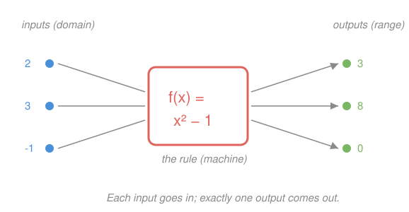

# Algebra I & II · Lesson 2.1: The function concept

> ⏱ ~15 min · Module 2: Functions, lines & systems · Builds on: 1.1 (variables & expressions) · Unlocks: 2.2 (the coordinate plane, slope & lines)

## Why this matters

Up to now a symbol like $3x+2$ was a *thing* — a number in disguise, waiting to be evaluated. A function is a promotion: it's a *rule* that turns any input into exactly one output, a whole relationship rather than a single value. This is the object the rest of mathematics acts on. In `calc-refresher` you'll differentiate functions; in `micro-refresher` demand and cost are functions of price and quantity. Master "one input, one output" now and everything downstream inherits it for free.

## The idea

Think of a function as a vending machine. You put in a code (the **input**), and out comes exactly one snack (the **output**). Press B4 and you always get the same thing — that reliability is the whole point. If pressing B4 sometimes gave chips and sometimes gave gum, you wouldn't call it a function; you'd call it broken.

That's the entire concept: **a function assigns to each input exactly one output.** Same input in, same single output out — every time. The rule can be a formula ($f(x)=x^2-1$), a table (a lookup sheet), or a graph (a picture of the same promise). The **domain** is the set of inputs the machine accepts; the **range** is the set of outputs it can actually produce.

## The formal version

A **function** $f$ from a set $D$ (the domain) to a set is a rule assigning to **each** $x \in D$ **exactly one** value $f(x)$.

In words: no input is left out, and no input gets two answers.

The notation $f(x)$ — read "$f$ of $x$" — means *"apply the rule $f$ to the input $x$."* The letter $f$ is the **name of the machine**, not a quantity multiplying $x$. So $f(2)$ is not $f$ times $2$; it's "feed $2$ into $f$." Evaluating just means substituting: if $f(x)=x^2-1$, then

$$f(2) = 2^2 - 1 = 3.$$

- **Domain:** all inputs allowed. Usually everything except values that would break the rule — dividing by zero or taking an even root of a negative.
- **Range:** all outputs actually attained as $x$ runs over the domain.

## Picture

The **vertical line test** turns this into a picture check: a graph represents a function exactly when **no vertical line crosses it more than once.** A vertical line is "one input $x$"; two crossings would mean that single input produced two outputs — the broken vending machine. A circle fails (most vertical lines hit it twice); a straight, non-vertical line passes.

## Worked examples

**Example 1 (mechanical — evaluate and read a domain).** Let $f(x) = \dfrac{1}{x-3}$.

Evaluate at a couple of inputs: $f(5) = \frac{1}{5-3} = \frac{1}{2}$, and $f(0) = \frac{1}{0-3} = -\frac{1}{3}$.

What's the domain? The rule breaks only when the denominator is zero, i.e. $x-3=0$, so $x=3$ is forbidden. Every other real number is fine. Domain: all real $x$ with $x \ne 3$. (Notice we found the domain by asking "what would *break* the machine?" — the fastest way in.)

**Example 2 (why you'd care — a function from a table).** A ride-share charges a 3-dollar base plus 2 dollars per mile. Let $C(m)$ be the cost for a trip of $m$ miles. The rule is $C(m) = 3 + 2m$, and here's the same function as a table:

| miles $m$ | 0 | 1 | 2 | 5 |
|---|---|---|---|---|
| cost $C(m)$ | 3 | 5 | 7 | 13 |

Each mile-count maps to exactly one cost — a function. The domain is $m \ge 0$ (you can't drive negative miles); the range is $C \ge 3$ (the cheapest possible trip still pays the base fee). Reading "$C(2)=7$" as *"a 2-mile trip costs 7 dollars"* is exactly how you'll read demand and cost curves in economics: the function *is* the relationship, and evaluating it answers a concrete question.

## Watch out

- You might think $f(x)$ means "$f$ times $x$." It doesn't — $f$ is the machine's **name**, and the parentheses mean "apply it." $f(a+b)$ is *not* $f\cdot a + f\cdot b$; you substitute the whole input $a+b$ into the rule.
- You might think any equation with $x$ and $y$ is a function. Not so: $x = y^2$ gives $y = \pm\sqrt{x}$, so the input $x=4$ produces **two** outputs ($2$ and $-2$). It fails the "exactly one" clause — and its graph (a sideways parabola) fails the vertical line test.
- You might think a value being missing from the domain is a mistake. It's a feature: the domain is *part of the definition of the function*. $\frac{1}{x-3}$ simply has nothing to say at $x=3$, and that's fine.

## One-liner

> A function is a reliable machine: one input goes in, exactly one output comes out — and a graph is one only if no vertical line hits it twice.

## Problems

**P1 (🟢)** Let $g(x) = x^2 - 4x + 1$. Compute $g(0)$, $g(3)$, and $g(-1)$.

**P2 (🟡)** State the domain of each rule, in words or as a condition on $x$: (a) $h(x) = \dfrac{x+1}{x-2}$, (b) $k(x) = \sqrt{x-5}$.

**P3 (🔴, optional)** Is $y = |x|$ a function of $x$? Is $x = |y|$ a function of $x$? Justify each with the "exactly one output" rule (a sketch or the vertical line test is fair game).

Solutions

**P1** Substitute each input into the rule:
- $g(0) = 0^2 - 4(0) + 1 = 1$.
- $g(3) = 9 - 12 + 1 = -2$.
- $g(-1) = (-1)^2 - 4(-1) + 1 = 1 + 4 + 1 = 6$.

**P2**
- (a) The denominator $x-2$ must not be zero, so $x \ne 2$. Domain: all real $x$ except $2$.
- (b) An even root needs a non-negative inside: $x - 5 \ge 0$, so $x \ge 5$. Domain: all $x \ge 5$.

**P3** $y = |x|$ **is** a function: each input $x$ has one absolute value (e.g. $x=-3 \Rightarrow y=3$, one output), and its V-shaped graph passes the vertical line test. $x = |y|$ is **not** a function of $x$: take $x = 3$; then $|y| = 3$ gives $y = 3$ *or* $y = -3$ — two outputs for one input. Its graph is a sideways V opening rightward, and a vertical line at $x=3$ crosses it twice.

## Flashback

**From Lesson 1.1 (Variables & expressions):** Simplify $5(2x - 3) - 2(x - 4)$ by distributing and combining like terms.

Solution

Distribute each product first: $5(2x-3) = 10x - 15$ and $-2(x-4) = -2x + 8$ (watch the sign on the $-2 \cdot (-4) = +8$). Now combine like terms:

$$10x - 15 - 2x + 8 = (10x - 2x) + (-15 + 8) = 8x - 7.$$

## Connections

- **Backward:** an expression from Lesson 1.1 (like $x^2-1$) becomes a function the moment you give it a name and treat it as a rule; evaluating $f(2)$ is just the "substitute a value" skill from that lesson, formalized.
- **Forward:** Lesson 2.2 shows the simplest interesting function — a **line** $f(x) = mx + b$ — and reads its slope $m$ as a rate of change; every line (except a vertical one) passes the vertical line test you learned here.
- **Sideways (calculus):** functions are the objects `calc-refresher` acts on — you can't take a derivative of a number, only of a function, so this lesson names calculus's raw material.
- **Sideways (econ):** in `micro-refresher`, demand $q(p)$ and cost $C(q)$ are functions; Example 2's cost-as-a-function-of-miles is the same move you'll make with price and quantity.
