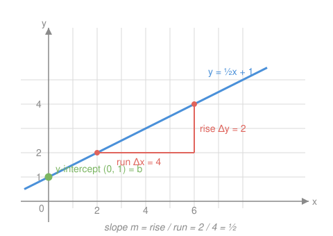

# Algebra I & II · Lesson 2.2: The coordinate plane, slope & lines

> ⏱ ~15 min · Module 2: Functions, lines & systems · Builds on: 2.1 (the function concept) · Unlocks: 2.3 (systems of linear equations)

## Why this matters

A line is the simplest possible function — and its slope is the first number you'll ever compute that answers the question *"when the input changes, how fast does the output move?"* That question never leaves you. In economics it becomes marginal cost; in physics it becomes velocity; in `calc-refresher` it becomes the derivative, which is nothing but the slope of a line you get by zooming in on a curve. Master the straight-line version now and the hard version later is just this idea wearing a costume.

## The idea

Put a grid on the world. Every point gets an address $(x, y)$: walk $x$ steps right, then $y$ steps up. A **line** is what you draw when the output changes at a *constant rate* as the input increases — every step right moves you the same amount up (or down).

That constant rate is the **slope**. It's a ratio: how much $y$ changes divided by how much $x$ changes. "For every 1 to the right, go 2 up" is slope $2$. "For every 4 right, go 2 up" is slope $\tfrac{1}{2}$ — the same tilt described with bigger steps. Steeper line, bigger number. Downhill, negative. Flat, zero.

The other thing a line needs is a *starting height* — where it crosses the $y$-axis. Slope tells you the tilt; the intercept tells you where to pin it. Those two numbers fix the line completely.

## The formal version

A point in the **coordinate plane** is an ordered pair $(x, y)$: the first coordinate is horizontal position, the second vertical. They meet at the **origin** $(0,0)$.

Given two points $(x_1, y_1)$ and $(x_2, y_2)$ on a line, the **slope** is

$$m = \frac{\Delta y}{\Delta x} = \frac{y_2 - y_1}{x_2 - x_1}, \qquad x_1 \neq x_2.$$

In words: rise over run — the change in output per unit change in input. The symbol $\Delta$ ("delta") just means "change in."

Three standard ways to write the line itself:

- **Slope-intercept form:** $\;y = mx + b$. Here $m$ is the slope and $b$ is the $y$-**intercept** (the $y$-value where $x = 0$). *In words: start at height $b$, then climb at rate $m$.*
- **Point-slope form:** $\;y - y_1 = m(x - x_1)$. *In words: if you know the slope $m$ and any one point $(x_1, y_1)$, this is the line — no need to hunt for $b$ first.*
- The **$x$-intercept** is where the line crosses the $x$-axis: set $y = 0$ and solve for $x$.

## Picture

The line is $y = \tfrac{1}{2}x + 1$. The green dot is the $y$-intercept $b = 1$ — where it crosses the vertical axis. The red **slope triangle** reads off the tilt: go $4$ right (run) and the line rises $2$ (rise), so $m = \tfrac{2}{4} = \tfrac{1}{2}$. Slide that triangle anywhere along the line and the ratio never changes — that constancy *is* what makes it a line.

## Worked examples

**Example 1 (mechanical).** Find the slope of the line through $(-1, 4)$ and $(3, -2)$, then write it in slope-intercept form.

Slope first — subtract in the same order top and bottom:

$$m = \frac{-2 - 4}{3 - (-1)} = \frac{-6}{4} = -\frac{3}{2}.$$

Negative, so the line goes downhill. Now use point-slope with $(3, -2)$:

$$y - (-2) = -\tfrac{3}{2}(x - 3) \;\Longrightarrow\; y + 2 = -\tfrac{3}{2}x + \tfrac{9}{2} \;\Longrightarrow\; y = -\tfrac{3}{2}x + \tfrac{5}{2}.$$

So $m = -\tfrac{3}{2}$ and $b = \tfrac{5}{2}$. Check with the other point: at $x = -1$, $y = -\tfrac{3}{2}(-1) + \tfrac{5}{2} = \tfrac{3}{2} + \tfrac{5}{2} = 4$. ✓

**Example 2 (why you'd care).** A phone plan costs 15 dollars a month plus 0.10 per gigabyte of data. Total cost as a function of gigabytes $x$:

$$C(x) = 0.10x + 15.$$

Read the line straight off: the **intercept** $b = 15$ is the fixed cost you pay at $x = 0$ (zero data, still 15 dollars). The **slope** $m = 0.10$ is the *rate* — the cost of one more gigabyte, in dollars per gigabyte. That per-unit rate is exactly what economists call a **marginal cost**, and it's the same object as a derivative: the answer to "what does one more unit cost me?" At $30$ GB the bill is $C(30) = 0.10(30) + 15 = 18$ dollars, but the decision "should I use one more gigabyte?" depends only on the slope, $0.10$ — never on the intercept.

## Watch out

- You might think you can subtract the coordinates in any order, but the *order must match* top and bottom. $\frac{y_2 - y_1}{x_2 - x_1}$ is fine and so is $\frac{y_1 - y_2}{x_1 - x_2}$ — but $\frac{y_2 - y_1}{x_1 - x_2}$ flips the sign and gives you the wrong tilt. Pick a "first" point and stick with it in both slots.
- You might think a vertical line has "infinite slope" you can compute — but its run is $\Delta x = 0$, so $m$ is **undefined** (division by zero), and it's not a function at all. A *horizontal* line is the tame case: $\Delta y = 0$, so $m = 0$.
- You might think $b$ is "the number sitting at the end," but slope-intercept only reads off cleanly when $y$ is **isolated**. From $2y = 6x + 8$ the intercept is $4$, not $8$ — divide by the coefficient on $y$ first.

## One-liner

> A line is fixed by two numbers — a starting height $b$ and a constant rate $m = \Delta y / \Delta x$ — and that rate is the straight-line ancestor of every derivative you'll ever take.

## Problems

**P1 (🟢)** Find the slope of the line through $(2, -3)$ and $(6, 5)$, then write the line in slope-intercept form and state its $y$-intercept.

**P2 (🟡)** A taxi charges a 4-dollar flat fee plus 2.50 per mile. Write the fare $F$ as a function of miles $m$, identify the slope and intercept in words, and find the fare for a 6-mile ride. Then explain what the slope would mean to a rider deciding whether to go one mile farther.

**P3 (🔴, optional)** A line passes through $(0, 7)$ and has the same slope as the line $3x - y = 4$ (rewrite that one in slope-intercept form first). Find its equation, then find its $x$-intercept.

Solutions

**P1** Keep the order consistent: $m = \dfrac{5 - (-3)}{6 - 2} = \dfrac{8}{4} = 2$. Point-slope with $(2, -3)$: $y + 3 = 2(x - 2) = 2x - 4$, so $y = 2x - 7$. The $y$-intercept is $b = -7$. Check the other point: at $x = 6$, $y = 2(6) - 7 = 5$. ✓

**P2** $F(m) = 2.50m + 4$. The intercept $b = 4$ is the fixed base fare you pay before moving (0 miles still costs 4 dollars); the slope $m = 2.50$ is the rate — dollars per mile. A 6-mile ride: $F(6) = 2.50(6) + 4 = 15 + 4 = 19$ dollars. To a rider, the slope is the marginal cost of the trip: going one mile farther adds exactly 2.50, regardless of how far they've already gone — the base fare is already spent and doesn't enter the decision.

**P3** Rewrite $3x - y = 4$ as $-y = 4 - 3x$, i.e. $y = 3x - 4$, so its slope is $3$. The new line has slope $3$ and passes through $(0, 7)$, so its intercept is $b = 7$: $\;y = 3x + 7$. For the $x$-intercept set $y = 0$: $0 = 3x + 7 \Rightarrow x = -\tfrac{7}{3}$. So it crosses the $x$-axis at $\left(-\tfrac{7}{3},\, 0\right)$.

## Flashback

**From Lesson 1.2 (Linear equations & inequalities):** Solve the inequality $\;-3x + 7 \ge 22\;$ and write the solution in interval notation.

Solution

Subtract $7$ from both sides: $-3x \ge 15$. Now divide by $-3$ — and dividing an inequality by a **negative** number flips the direction of the sign:

$$x \le \frac{15}{-3} = -5.$$

Solution: $x \le -5$, or in interval notation $(-\infty,\, -5]$. Spot-check $x = -6$: $-3(-6) + 7 = 18 + 7 = 25 \ge 22$ ✓; and $x = 0$ gives $7 \ge 22$, false — correctly excluded.

## Connections

- **Backward:** this is Lesson 2.1's function concept made concrete — a line is the simplest non-trivial function $f(x) = mx + b$, and its vertical-line test passes for every non-vertical line.
- **Forward:** Lesson 2.3 puts *two* lines on one grid; where they cross is the solution of a system, and the slopes tell you in advance whether they cross once, never (parallel), or everywhere (identical).
- **Sideways (calculus):** in `calc-refresher`, the derivative $f'(a)$ is the slope of the line you get by zooming in on a curve until it looks straight — this lesson is the linear prototype of that entire idea, with $m = \Delta y / \Delta x$ becoming $\lim \Delta y / \Delta x$.
- **Sideways (economics):** slope-as-rate is the "marginal" of everything — marginal cost, marginal revenue, marginal utility — each one the slope of a total curve, previewed here as the per-unit rate in Examples 2 and P2.
