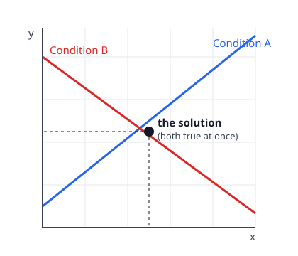

# Algebra I & II · Lesson 2.3: Systems of linear equations

> ⏱ ~15 min · Module 2: Functions, lines & systems · Builds on: 2.2 (the coordinate plane, slope & lines) · Unlocks: 3.1 (exponents & polynomial operations)

## Why this matters

The real world rarely hands you one condition at a time. Supply must equal demand; two pricing plans cost the same at some usage; three forces balance to zero. Each of those is *several requirements holding simultaneously*, and the machinery for pinning down the one scenario that satisfies all of them is the system of equations. It's also the seed of an entire subject: `linalg-refresher` is essentially "systems, industrialized" — matrices exist to solve thousands of these at once.

## The idea

A single linear equation like $2x + y = 8$ has infinitely many solutions — pick any $x$, and $y$ is forced, so the solutions form a whole *line*. That's under-determined: one equation, two unknowns.

A **system** stacks a *second* condition on top: "…and also $x - y = 1$." Now you're not looking for points on one line — you're looking for the point that lies on *both* lines at once. Two conditions, two unknowns, and generically exactly one point survives.

So "solve the system" means: **find the input that makes every equation true simultaneously.** Graphically, that's where the lines cross.

## The formal version

A system of two linear equations in two unknowns:

$$\begin{cases} a_1 x + b_1 y = c_1 \\ a_2 x + b_2 y = c_2 \end{cases}$$

A **solution** is an ordered pair $(x, y)$ satisfying *both* equations. In words: not a number that works for one line, but the single pair that works for the whole set at once.

Two hand tools produce it exactly:

- **Substitution** — solve one equation for one variable, then plug that expression into the other. This collapses two equations in two unknowns into one equation in one unknown.
- **Elimination** — scale the equations so one variable has equal-and-opposite coefficients, then add them; that variable cancels, leaving one equation in one unknown.

Both erase a variable. Substitution erases it by *replacement*; elimination erases it by *cancellation*.

## Picture

Each line is the set of points satisfying one condition. The intersection is the only place both are true — the solution. Reading the graph also tells you *how many* solutions to expect, which is the whole "three cases" story below.

## Worked examples

**Example 1 (mechanical — substitution).** Solve
$$\begin{cases} y = 2x - 1 \\ 3x + y = 14 \end{cases}$$

The first equation already hands us $y$, so substitute it into the second:
$$3x + (2x - 1) = 14 \;\Rightarrow\; 5x - 1 = 14 \;\Rightarrow\; 5x = 15 \;\Rightarrow\; x = 3.$$
Back-substitute: $y = 2(3) - 1 = 5$. Solution $(3, 5)$. **Always check in the equation you didn't just use:** $3(3) + 5 = 14$. ✓

**Example 2 (why you'd care — elimination).** A café's receipts:
- 3 coffees and 2 teas cost 16 dollars.
- 1 coffee and 2 teas cost 8 dollars.

Let $c$ and $t$ be the prices. The system is
$$\begin{cases} 3c + 2t = 16 \\ \phantom{3}c + 2t = 8 \end{cases}$$

The $2t$ terms already match, so subtract the second equation from the first — the tea cancels:
$$(3c - c) + (2t - 2t) = 16 - 8 \;\Rightarrow\; 2c = 8 \;\Rightarrow\; c = 4.$$
Then $4 + 2t = 8 \Rightarrow t = 2$. A coffee is 4 dollars, a tea is 2. Check the first receipt: $3(4) + 2(2) = 16$. ✓ Notice elimination was faster than substitution here precisely *because* a variable already lined up — always scan for that before grinding.

## Watch out

- **You might think a solution is a single number, but it's a pair.** "$x = 3$" is half an answer; the deliverable is $(3, 5)$. A system in two unknowns is solved only when both coordinates are named.
- **You might think "no solution" means you made an error.** Sometimes the algebra collapses to a falsehood like $0 = 5$ — that's not a mistake, it's the system *telling you the lines are parallel* and never meet. Likewise, collapsing to $0 = 0$ means the two equations were the same line in disguise: infinitely many solutions.
- **You might trust an eyeballed intersection from a graph, but graphing only *locates* the answer, it doesn't *certify* it.** A crossing that looks like $(2, 3)$ could be $(2.1, 2.9)$. Use the graph to see how many solutions and roughly where; use substitution or elimination to get them exactly.

## The three cases

Rewrite both equations in slope-intercept form $y = mx + b$ and just compare:

| Slopes | Intercepts | Picture | Solutions |
|---|---|---|---|
| different $m$ | (anything) | lines cross once | **exactly one** |
| same $m$ | different $b$ | parallel, never meet | **none** (inconsistent) |
| same $m$ | same $b$ | identical line | **infinitely many** |

In words: **slope decides whether they cross; intercept breaks the tie when the slopes match.** You can diagnose the case before solving — a 10-second sanity check.

## One-liner

> A system asks for the one point where every condition is true at once; substitution and elimination each kill a variable to find it, and the slopes tell you in advance whether that point is one, none, or all of them.

## Problems

**P1 (🟢)** Solve by substitution and check:
$$\begin{cases} y = 3x - 2 \\ 2x + y = 8 \end{cases}$$

**P2 (🟡)** Market for a good: demand is $p = 50 - 3q$ and supply is $p = 10 + 2q$, where $p$ is price and $q$ is quantity. Find the equilibrium $(q, p)$ where the two conditions hold at once, and say in one sentence what it means. *(This is the same move as Boss Problem 2, and exactly the equilibrium you'll recompute in `micro-refresher`.)*

**P3 (🔴, optional)** For which value of $k$ does the system have **infinitely many** solutions, and what happens for every *other* $k$?
$$\begin{cases} 2x + y = 3 \\ 6x + 3y = k \end{cases}$$

Solutions

**P1** Substitute $y = 3x - 2$ into the second equation: $2x + (3x - 2) = 8 \Rightarrow 5x - 2 = 8 \Rightarrow 5x = 10 \Rightarrow x = 2$. Then $y = 3(2) - 2 = 4$. Solution $(2, 4)$. Check in the second equation: $2(2) + 4 = 8$. ✓

**P2** Both equations give $p$, so set them equal (substitution): $50 - 3q = 10 + 2q \Rightarrow 40 = 5q \Rightarrow q = 8$. Then $p = 50 - 3(8) = 26$ (check with supply: $10 + 2(8) = 26$ ✓). Equilibrium is $(q, p) = (8, 26)$: at a price of 26, the quantity buyers want equals the quantity sellers offer — the one price at which the market clears with no shortage or surplus.

**P3** Put both in slope-intercept form. First: $y = -2x + 3$, slope $-2$, intercept $3$. Second: $y = -2x + \tfrac{k}{3}$, slope $-2$, intercept $\tfrac{k}{3}$. The slopes are *always* equal, so the lines are never crossing — there is never exactly one solution. They coincide (infinitely many solutions) exactly when the intercepts match: $\tfrac{k}{3} = 3 \Rightarrow k = 9$. Equivalently, $k = 9$ makes the second equation just $3\times$ the first. For every other $k$ the lines are parallel and distinct, so there is **no solution**. (Sanity check the algebra: multiply the first equation by 3 to get $6x + 3y = 9$; subtracting from the second gives $0 = k - 9$, true only if $k = 9$, impossible otherwise.)

## Flashback

**From Lesson 2.2 (Slope & lines):** Find the equation of the line passing through the points $(2, 1)$ and $(6, 9)$. Give it in slope-intercept form.

Solution

Slope $m = \dfrac{9 - 1}{6 - 2} = \dfrac{8}{4} = 2$. Use point-slope with $(2, 1)$: $y - 1 = 2(x - 2) \Rightarrow y = 2x - 3$. Check the other point: $2(6) - 3 = 9$. ✓

## Connections

- **Backward:** This is Lesson 2.2's single line, doubled. Each equation is a line you already know how to graph and read the slope of; a system just asks where two of them meet, and the slope-comparison in "the three cases" is 2.2's slope idea doing diagnostic work.
- **Forward (`linalg-refresher`):** Systems are what matrices industrialize — Gaussian elimination is literally the elimination method above, run bookkeeping-style on the coefficients so it scales to $n$ equations in $n$ unknowns. The "one / none / infinitely many" trichotomy becomes the story of a matrix's rank and determinant.
- **Sideways (`micro-refresher`):** Supply-equals-demand equilibrium (Problem 2) *is* a 2×2 system — two conditions on price and quantity, solved for the pair that clears the market. The same shape shows up in **break-even analysis**: cost $= $ fixed $+$ variable, revenue $=$ price $\times$ quantity, and the break-even point is where those two lines cross — solve the system to find the quantity at which you stop losing money.
