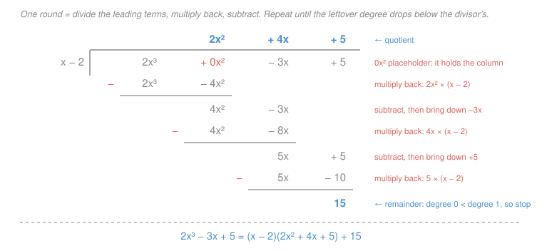

# Algebra I & II · Lesson 3.3: Polynomial long division

> ⏱ ~15 min · Module 3: Polynomials & factoring · Builds on: [3.1 (exponents & polynomial operations)](03-01-exponents-and-polynomial-operations.md), [3.2 (factoring)](03-02-factoring.md) · Unlocks: [4.2 (rational expressions)](04-02-rational-expressions.md), slant asymptotes in `precalculus`

## Why this matters

Lesson 3.2 taught you to factor by *recognizing patterns* — which works beautifully right up to the first cubic that doesn't match one. Division is the tool that keeps going: guess one root, divide it out, and a degree-3 problem collapses into a quadratic you already know how to kill. It's also the move that unlocks two things waiting downstream. In [`precalculus` 2.2](../../precalculus/lessons/02-02-rational-functions.md) a slant asymptote is *literally* the quotient of a polynomial division. In [`calc-refresher` 2.2](../../calc-refresher/lessons/02-02-integration-techniques.md), partial fractions flatly refuses to start until the fraction is **proper** — and "long-divide first" is how you make it proper. Both courses currently ask you to do this. This lesson is where you learn it.

## The idea

You already know this algorithm. You learned it in fourth grade, on numbers.

Divide $17$ by $5$. You get $3$, with $2$ left over — and that leftover is genuinely left over, because it's **too small to divide again**. Written as one honest statement:

$$17 = 5 \cdot 3 + 2, \qquad 0 \le 2 < 5.$$

Dividend equals divisor times quotient, plus a remainder, and the remainder is smaller than the divisor. That last clause is what makes the answer unique — otherwise you could stop early and call $17 = 5\cdot 2 + 7$ a division.

Polynomial division is that sentence with one word swapped: **"smaller than" becomes "lower degree than."** Degree is a polynomial's size. So dividing $2x^3 - 3x + 5$ by $x - 2$ means hunting for a quotient and a leftover such that

$$2x^3 - 3x + 5 = (x-2)\cdot q(x) + r, \qquad \deg r < \deg(x-2) = 1,$$

which forces $r$ to be a plain constant — nothing with an $x$ in it is "too small to divide" by $x - 2$. The algorithm is identical too: at each round you kill the current leading term, subtract, and look at what's left. Numbers use place value to decide "how many times does it go in"; polynomials use the leading term, which is easier — it's one division of monomials.

## The formal version

**The division algorithm for polynomials.** Given polynomials $f(x)$ (the **dividend**) and $d(x) \ne 0$ (the **divisor**), there exist *unique* polynomials $q(x)$ (**quotient**) and $r(x)$ (**remainder**) with

$$f(x) = d(x)\,q(x) + r(x), \qquad r(x) = 0 \ \text{ or } \ \deg r < \deg d.$$

In words: every division has exactly one honest answer, and you know you're finished the moment the leftover's degree drops below the divisor's. Dividing both sides by $d(x)$ gives the form you'll actually use downstream:

$$\frac{f(x)}{d(x)} = q(x) + \frac{r(x)}{d(x)}.$$

In words: any fraction of polynomials splits into a polynomial part plus a **proper** fraction (top degree strictly below bottom degree).

**The long-division algorithm.** Write both polynomials in descending degree order, inserting a zero term for every missing degree. Then repeat:

1. **Divide** the leading term of what's left by the leading term of the divisor → the next quotient term.
2. **Multiply** that quotient term back through the whole divisor.
3. **Subtract** that product from what's left, and bring down the next term.
4. Stop when the leftover's degree is below the divisor's; that leftover is $r(x)$.

**Synthetic division** (shortcut, divisor $x - c$ only). Since the divisor is $x-c$, every "divide the leading terms" step is division by $x$ — pure bookkeeping — so you can drop the symbols and push only the coefficients around. Write $c$ and the dividend's coefficients (**with placeholder zeros**); bring the first one down; then repeatedly multiply by $c$ and add to the next column. The last number is $r$; the rest are the quotient's coefficients, one degree lower than the dividend.

**Remainder theorem.** Dividing by $x - c$ leaves remainder $f(c)$:

$$f(x) = (x-c)q(x) + r \ \Longrightarrow\ f(c) = 0\cdot q(c) + r = r.$$

In words: to find the remainder of a division by $x-c$, don't divide — just plug in $c$. (The proof is one substitution, printed right above.)

**Factor theorem.** Immediately: $r = 0$ exactly when $f(c) = 0$, so

$$(x - c) \text{ is a factor of } f(x) \iff f(c) = 0.$$

In words: **roots and linear factors are the same information.** This is the bridge back to [3.2](03-02-factoring.md) — factoring a cubic stops being a search for patterns and becomes: find one root, divide it out, factor the quadratic that's left.

## Picture

## Worked examples

**Example 1 (mechanical — the tableau above, slowly).** Divide $2x^3 - 3x + 5$ by $x - 2$.

**Set up.** The dividend has no $x^2$ term, so write it in with a zero coefficient: $2x^3 + 0x^2 - 3x + 5$. Skip this and every column below shifts one place left, and the whole computation is wrong. Zeros are not optional decoration; they hold the columns.

**Round 1.** Leading terms: $\dfrac{2x^3}{x} = 2x^2$ — that's the first quotient term. Multiply it back through the divisor: $2x^2(x-2) = 2x^3 - 4x^2$. Subtract:

$$(2x^3 + 0x^2) - (2x^3 - 4x^2) = 4x^2.$$

Note the sign: subtracting $-4x^2$ **adds** $4x^2$. Bring down $-3x$, leaving $4x^2 - 3x$.

**Round 2.** $\dfrac{4x^2}{x} = 4x$. Multiply back: $4x(x-2) = 4x^2 - 8x$. Subtract:

$$(4x^2 - 3x) - (4x^2 - 8x) = 5x.$$

Bring down $+5$, leaving $5x + 5$.

**Round 3.** $\dfrac{5x}{x} = 5$. Multiply back: $5(x-2) = 5x - 10$. Subtract:

$$(5x + 5) - (5x - 10) = 15.$$

Degree $0$ is below the divisor's degree $1$, so we're done: $q(x) = 2x^2 + 4x + 5$ and $r = 15$.

$$2x^3 - 3x + 5 = (x-2)(2x^2 + 4x + 5) + 15.$$

**Two free checks.** Expand the right side: $2x^3 + 4x^2 + 5x - 4x^2 - 8x - 10 + 15 = 2x^3 - 3x + 5$. ✓ And the remainder theorem, without dividing at all: $f(2) = 2(8) - 3(2) + 5 = 15$. ✓

**Now the shortcut.** Same problem, synthetic division with $c = 2$ and coefficients $2,\ 0,\ -3,\ 5$:

$$\begin{array}{r|rrrr} 2 & 2 & 0 & -3 & 5 \\ & & 4 & 8 & 10 \\ \hline & 2 & 4 & 5 & \boxed{15} \end{array}$$

Bring down the $2$; $2\times 2 = 4$, and $0 + 4 = 4$; $4 \times 2 = 8$, and $-3 + 8 = 5$; $5 \times 2 = 10$, and $5 + 10 = 15$. Read off $2x^2 + 4x + 5$ remainder $15$ — the same answer, in about eight seconds. Every number in that grid also appears in the tableau; synthetic division just stops writing the $x$'s.

**Example 2 (why you'd care — two downstream jobs).**

*(a) A slant asymptote.* In [`precalculus` 2.2](../../precalculus/lessons/02-02-rational-functions.md), when the numerator out-degrees the denominator by exactly one, the graph tilts onto a line — and that line is the quotient. For $f(x) = \dfrac{x^2+1}{x-1}$, synthetic-divide with $c = 1$ and coefficients $1,\ 0,\ 1$: bring down $1$; $0 + 1 = 1$; $1 + 1 = 2$. So

$$\frac{x^2+1}{x-1} = x + 1 + \frac{2}{x-1}.$$

Far from the origin the leftover $\frac{2}{x-1}$ shrinks to nothing, so the curve becomes indistinguishable from the line $y = x+1$. That's the slant asymptote — division is the *only* way to find it.

*(b) Making a fraction integrable.* In [`calc-refresher` 2.2](../../calc-refresher/lessons/02-02-integration-techniques.md), partial fractions requires a **proper** fraction. $\dfrac{x^2}{x^2-1}$ isn't proper (degrees tie), so divide first. Here the divisor is a *quadratic*, so synthetic division is off the table; but one round of long division is enough: $\dfrac{x^2}{x^2} = 1$, and $x^2 - 1\cdot(x^2-1) = 1$. Hence

$$\frac{x^2}{x^2-1} = 1 + \frac{1}{x^2-1} = 1 + \frac{1}{(x-1)(x+1)},$$

and *now* the split-into-simple-fractions machinery can start. Same identity, both times: an improper fraction is a polynomial plus a proper remainder.

## Watch out

- **You might think** a missing degree can just be skipped. **Actually** it silently shifts every column and corrupts the whole tableau. $x^3 + 1$ must be written $x^3 + 0x^2 + 0x + 1$ before you divide — and the same zeros go into the synthetic-division row.
- **You might think** step 3 is "combine the rows." **Actually** it is a **subtraction**, and the minus sign hits *every* term of the product, not just the first. This is the single most common error in the whole algorithm: $(4x^2 - 3x) - (4x^2 - 8x)$ is $+5x$, not $-11x$.
- **You might think** synthetic division works on any divisor. **Actually** it only works for a *monic linear* divisor $x - c$ — and you feed it $c$, not the divisor. For $x + 3$ use $c = -3$; for $2x - 3$ or any quadratic, do the long division. (You can force $2x-3$ by dividing by $x - \tfrac32$ and then halving the quotient, but long division is safer than remembering the fix.)
- **You might think** a nonzero remainder means you made a mistake. **Actually** remainders are the normal case; a remainder of **zero** is the special one, and by the factor theorem it's the interesting one — it means the divisor was a genuine factor.

## One-liner

> Polynomial division is fourth-grade long division with *degree* playing the role of *size* — and its zero-remainder case is the factor theorem, which turns "find a root" into "peel off a factor."

## Problems

**P1 (🟢)** Divide $3x^3 - 2x + 7$ by $x + 2$. Write the answer in the form $f(x) = d(x)q(x) + r$, then verify the remainder a second way using the remainder theorem. (Watch the missing degree.)

**P2 (🟡)** Factor $x^3 - 4x^2 + x + 6$ completely. Strategy: any integer root must divide the constant term $6$, so test $c = \pm1, \pm2, \pm3, \pm6$ with the remainder theorem until one gives zero, then divide it out and finish with [3.2](03-02-factoring.md).

**P3 (🔴, optional)** Two downstream setups, one technique.
(a) Find the slant asymptote of $f(x) = \dfrac{2x^2 - 3x - 1}{x-2}$, and say in one sentence why the leftover term doesn't affect it.
(b) Rewrite $\dfrac{x^2+3}{x^2-1}$ as a polynomial plus a proper fraction — the form `calc-refresher` needs before partial fractions. Which of the two parts can synthetic division handle, and why?

Solutions

**P1** Insert the placeholder: $3x^3 + 0x^2 - 2x + 7$. Synthetic division with $c = -2$ (the divisor is $x - (-2)$) and coefficients $3,\ 0,\ -2,\ 7$:

- bring down $3$;
- $3 \times (-2) = -6$, and $0 + (-6) = -6$;
- $-6 \times (-2) = 12$, and $-2 + 12 = 10$;
- $10 \times (-2) = -20$, and $7 + (-20) = -13$.

So $q(x) = 3x^2 - 6x + 10$ and $r = -13$:

$$3x^3 - 2x + 7 = (x+2)(3x^2 - 6x + 10) - 13.$$

Check by expanding: $(x+2)(3x^2-6x+10) = 3x^3 - 6x^2 + 10x + 6x^2 - 12x + 20 = 3x^3 - 2x + 20$, and $20 - 13 = 7$. ✓

Remainder theorem, independently: $f(-2) = 3(-8) - 2(-2) + 7 = -24 + 4 + 7 = -13$. ✓ Same number, no division required.

**P2** Test candidates with the remainder theorem. $f(1) = 1 - 4 + 1 + 6 = 4$ (no). $f(-1) = -1 - 4 - 1 + 6 = 0$ ✓ — so by the factor theorem $(x+1)$ is a factor.

Synthetic-divide by $c = -1$, coefficients $1,\ -4,\ 1,\ 6$: bring down $1$; $1\times(-1) = -1$ and $-4 + (-1) = -5$; $-5 \times (-1) = 5$ and $1 + 5 = 6$; $6 \times (-1) = -6$ and $6 + (-6) = 0$ ✓ (the zero remainder confirms the factor). Quotient: $x^2 - 5x + 6$.

Finish with 3.2's monic trinomial rule — two numbers multiplying to $6$ and adding to $-5$, namely $-2$ and $-3$:

$$x^3 - 4x^2 + x + 6 = (x+1)(x^2 - 5x + 6) = (x+1)(x-2)(x-3).$$

Verify: $(x-2)(x-3) = x^2 - 5x + 6$, and $(x+1)(x^2-5x+6) = x^3 - 5x^2 + 6x + x^2 - 5x + 6 = x^3 - 4x^2 + x + 6$. ✓

**P3** (a) Degrees are $2$ over $1$ — top wins by exactly one, so there is a slant asymptote. Synthetic division with $c = 2$, coefficients $2,\ -3,\ -1$: bring down $2$; $2\times 2 = 4$ and $-3 + 4 = 1$; $1 \times 2 = 2$ and $-1 + 2 = 1$. So

$$f(x) = 2x + 1 + \frac{1}{x-2}, \qquad \text{slant asymptote } y = 2x+1.$$

As $x \to \pm\infty$ the leftover $\frac{1}{x-2}$ goes to zero, so the curve's height converges to the line's — the remainder term is exactly the (vanishing) gap between them. (Check: $(x-2)(2x+1) + 1 = 2x^2 - 3x - 2 + 1 = 2x^2 - 3x - 1$. ✓)

(b) The degrees tie, so one round of long division does it: $\dfrac{x^2}{x^2} = 1$, and $(x^2 + 3) - 1\cdot(x^2 - 1) = 4$. Degree $0 < 2$, stop:

$$\frac{x^2+3}{x^2-1} = 1 + \frac{4}{x^2-1} = 1 + \frac{4}{(x-1)(x+1)}.$$

Only part (a) is a synthetic-division job: its divisor $x - 2$ is monic and linear. Part (b)'s divisor $x^2 - 1$ is quadratic, so the coefficient shortcut doesn't apply — long division (here, a single round) is the tool.

## Flashback

**From Lesson 3.2 (Factoring):** Factor $2x^4 - 32$ completely.

Solution

GCF first, always: $2x^4 - 32 = 2(x^4 - 16)$.

Now $x^4 - 16 = (x^2)^2 - 4^2$ is a difference of squares: $2(x^2-4)(x^2+4)$.

Re-scan the parentheses — "completely" means keep going. The first one splits again: $x^2 - 4 = (x-2)(x+2)$. The second one, $x^2 + 4$, is a **sum** of squares and does not factor over the reals. Final answer:

$$2x^4 - 32 = 2(x-2)(x+2)(x^2+4).$$

Check: $2(x^2-4)(x^2+4) = 2(x^4 - 16) = 2x^4 - 32$. ✓

## Connections

- **Backward:** this is [3.1](03-01-exponents-and-polynomial-operations.md)'s polynomial multiplication run backwards, and it's the missing half of [3.2](03-02-factoring.md). Factoring by pattern-matching tops out at quadratics; the factor theorem plus division handles any degree, one root at a time. Every division you do gets checked by re-multiplying — the same self-verifying habit 3.2 drilled.
- **Forward:** [4.2](04-02-rational-expressions.md) manipulates fractions of polynomials, and division is what puts an improper one into "polynomial plus proper fraction" form. Beyond this course, [`precalculus` 2.2](../../precalculus/lessons/02-02-rational-functions.md) needs the quotient to read off a **slant asymptote**, and [`calc-refresher` 2.2](../../calc-refresher/lessons/02-02-integration-techniques.md) needs it to make a rational function proper before partial fractions — both currently *use* this method, and this lesson is where it's taught.
- **Sideways (number theory):** the division algorithm here is word-for-word the one for integers, with degree in place of magnitude — which is why polynomials support a greatest-common-divisor algorithm and a notion of "remainder class" exactly as integers do. That structure is the whole subject of modular arithmetic in [`discrete-mathematics` 4.3](../../discrete-mathematics/lessons/04-03-modular-arithmetic-and-congruences.md).
