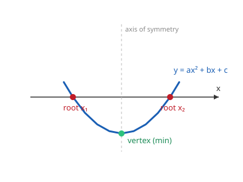

# Algebra I & II · Lesson 4.1: Quadratic equations

> ⏱ ~15 min · Module 4: Quadratics, rationals & radicals · Builds on: 3.2 (factoring) · Unlocks: 4.2 (rational expressions)

## Why this matters

The moment a rate stops being constant, a quadratic shows up. A thrown ball, a projectile's range, revenue as a function of price, the trajectory of anything under gravity — all governed by $ax^2 + bx + c$. And this is your first equation whose graph *curves*, which means it has a **peak or a valley** (the vertex) and can cross the x-axis **twice, once, or never**. Learning to extract those three facts — the roots, the vertex, and how many roots even exist — is the whole job, and each shows up again the instant you take a derivative.

## The idea

A **quadratic equation** is any equation you can arrange into the form

$$ax^2 + bx + c = 0, \qquad a \neq 0.$$

Its graph, $y = ax^2 + bx + c$, is a **parabola**: a symmetric U (or upside-down U if $a < 0$). "Solving the equation" means finding where that U crosses the x-axis — the $x$-values that make $y = 0$. Those crossing points are the **roots**.

Here's the one picture to hold onto: a U can meet a horizontal line in **two** places, **graze** it at exactly one, or **float clear** and miss it entirely. That's why a quadratic has two, one, or zero real solutions — no equation-solving trick can conjure a third crossing that geometry forbids.

You have three tools for finding the roots, and they trade off effort against reliability:

1. **Factoring** — fast when the numbers are friendly, useless when they aren't.
2. **Completing the square** — always works, and hands you the vertex for free.
3. **The quadratic formula** — always works, no thinking required.

## The formal version

**Zero-product property.** If a product equals zero, at least one factor is zero:

$$PQ = 0 \iff P = 0 \ \text{ or } \ Q = 0.$$

In words: zero is the *only* number that forces one of its makers to vanish. So if you can write $ax^2+bx+c = a(x - r_1)(x - r_2)$, the roots are $r_1$ and $r_2$ — read straight off the factors. This is the entire reason factoring solves equations, and it works *only* against zero (see Watch out).

**Completing the square.** Rewrite the trinomial as a perfect square plus a leftover constant:

$$x^2 + bx + c = \left(x + \tfrac{b}{2}\right)^2 + \left(c - \tfrac{b^2}{4}\right).$$

In words: take half the linear coefficient, square it, add-and-subtract it to build a perfect square. The payoff is that a squared term is transparent — you can see its minimum. In **vertex form** $y = a(x-h)^2 + k$, the vertex sits at $(h, k)$, because $a(x-h)^2$ is smallest exactly when $x = h$.

**The quadratic formula.** For $ax^2 + bx + c = 0$,

$$x = \frac{-b \pm \sqrt{b^2 - 4ac}}{2a}.$$

In words: the roots sit symmetrically at $-\frac{b}{2a}$ (the axis of symmetry), stepped left and right by $\frac{\sqrt{b^2-4ac}}{2a}$. It isn't magic — it's completing the square done *once*, in general, so you never have to again. Divide by $a$, complete the square on $x^2 + \frac{b}{a}x$, isolate the square, and take the root; the formula falls out.

**The discriminant.** The quantity under the root,

$$\Delta = b^2 - 4ac,$$

decides everything *before* you solve:

- $\Delta > 0$: two distinct real roots (U crosses twice).
- $\Delta = 0$: one repeated real root (U grazes the axis — the vertex sits on it).
- $\Delta < 0$: no real roots (U floats clear; a negative can't have a real square root).

In words: the discriminant is a one-line reality check — it counts your solutions before you commit to finding them.

## Picture

The two red dots are the roots (where $y = 0$); the green dot is the vertex, the lowest point. The dashed line is the axis of symmetry — the roots are mirror images across it, and the vertex sits right on it at $x = -\frac{b}{2a}$.

## Worked examples

**Example 1 (mechanical — factor, then zero-product).** Solve $x^2 - 5x + 6 = 0$.

Find two numbers multiplying to $+6$ and adding to $-5$: those are $-2$ and $-3$. So

$$x^2 - 5x + 6 = (x-2)(x-3) = 0.$$

By the zero-product property, $x - 2 = 0$ or $x - 3 = 0$, giving $\boxed{x = 2 \text{ or } x = 3}$. Sanity check: $2 + 3 = 5$ matches $-b/a$, and $2 \cdot 3 = 6$ matches $c/a$ — a free verification every time.

**Example 2 (why you'd care — complete the square for the vertex).** A ball's height is $h(t) = -16t^2 + 64t + 8$ feet. When does it land, and how high does it get?

*Landing* — set $h = 0$. The numbers aren't friendly to factor, so reach for the formula with $a=-16,\ b=64,\ c=8$:

$$t = \frac{-64 \pm \sqrt{64^2 - 4(-16)(8)}}{2(-16)} = \frac{-64 \pm \sqrt{4096 + 512}}{-32} = \frac{-64 \pm \sqrt{4608}}{-32} \approx \frac{-64 \pm 67.9}{-32}.$$

The physical root is $t \approx \frac{-64 - 67.9}{-32} \approx 4.12$ s (the other is negative — before the throw). *Max height* — complete the square:

$$h = -16(t^2 - 4t) + 8 = -16\big((t-2)^2 - 4\big) + 8 = -16(t-2)^2 + 72.$$

Vertex form, so the peak is $\boxed{72 \text{ ft at } t = 2 \text{ s}}$. Notice completing the square did what neither factoring nor the formula gives you directly: the maximum. That's why it earns its keep. (And $\Delta = 4608 > 0$ told us there'd be two real times before we lifted a finger — the ball really does cross ground level.)

## Watch out

- **The zero-product trick works against zero and nothing else.** From $(x-2)(x-3) = 6$ you may *not* write $x-2=6$ or $x-3=6$ — infinitely many factor pairs multiply to $6$. You **must** move everything to one side to get $\dots = 0$ first, then factor.
- **Don't drop the $\pm$.** $x^2 = 9$ has *two* solutions, $x = 3$ and $x = -3$, not just the positive root. Every square you undo forks into two branches.
- **$\Delta < 0$ means no *real* roots — not "no answer."** The parabola genuinely misses the axis. (Those roots do exist — they live off the real line, and [`precalculus` 2.4](../../precalculus/lessons/02-04-complex-numbers.md) is where the library builds them: the two roots come back as a conjugate pair $-\frac{b}{2a} \pm i\frac{\sqrt{4ac-b^2}}{2a}$. Until you get there, "no real solution" is the honest and complete answer.)
- **Completing the square: only "half of $b$, squared" works, and mind the $a$.** If $a \neq 1$, factor it out of the $x^2$ and $x$ terms *first* — as in Example 2 — or the perfect-square pattern won't line up.

## One-liner

> A quadratic is a U-shaped story with three facts — two roots, one vertex, and a discriminant that tells you in advance how many times the U touches down.

## Problems

**P1 (🟢)** Solve by factoring: $x^2 + 2x - 15 = 0$. State both roots and verify with the sum/product check.

**P2 (🟡)** For $2x^2 - 3x - 2 = 0$: first compute the discriminant and say how many real roots to expect, then find them with the quadratic formula.

**P3 (🔴, optional)** A rock is thrown so its height is $h(t) = -16t^2 + 48t + 64$ feet. Find when it hits the ground (by factoring), then complete the square to find its maximum height and when that occurs.

Solutions

**P1** Need two numbers with product $-15$ and sum $+2$: those are $+5$ and $-3$. So $x^2 + 2x - 15 = (x+5)(x-3) = 0$, giving $x = -5$ or $x = 3$. Check: sum $-5 + 3 = -2 = -b/a$ ✓; product $(-5)(3) = -15 = c/a$ ✓.

**P2** Discriminant: $\Delta = (-3)^2 - 4(2)(-2) = 9 + 16 = 25 > 0$, so **two distinct real roots**. Formula:
$$x = \frac{-(-3) \pm \sqrt{25}}{2(2)} = \frac{3 \pm 5}{4}.$$
That gives $x = \frac{8}{4} = 2$ or $x = \frac{-2}{4} = -\tfrac{1}{2}$. (Since $\sqrt{25}$ came out clean, this one *was* factorable: $2x^2 - 3x - 2 = (2x+1)(x-2)$ — a rational discriminant is the tell.)

**P3** *Landing:* set $-16t^2 + 48t + 64 = 0$. Divide by $-16$: $t^2 - 3t - 4 = 0 \Rightarrow (t-4)(t+1) = 0$, so $t = 4$ or $t = -1$. Time can't be negative, so it lands at $t = 4$ s. *Max height:* complete the square:
$$h = -16(t^2 - 3t) + 64 = -16\big((t - \tfrac{3}{2})^2 - \tfrac{9}{4}\big) + 64 = -16(t - \tfrac{3}{2})^2 + 36 + 64.$$
So $h = -16(t-\tfrac32)^2 + 100$: maximum height $100$ ft at $t = 1.5$ s.

## Flashback

**From Lesson 3.2 (Factoring):** Factor completely: $2x^2 + 7x + 3$.

Solution

With $a \neq 1$, use the AC method: $a \cdot c = 2 \cdot 3 = 6$, and we need two numbers multiplying to $6$ and adding to $7$: those are $6$ and $1$. Split the middle term and group:
$$2x^2 + 6x + x + 3 = 2x(x+3) + 1(x+3) = (2x+1)(x+3).$$
Verify by re-multiplying (FOIL): $(2x+1)(x+3) = 2x^2 + 6x + x + 3 = 2x^2 + 7x + 3$ ✓.

## Connections

- **Backward:** this is Lesson 3.2's factoring turned into an equation-solver — the zero-product property is the bridge that converts "factored form" into "roots."
- **Forward:** Lesson 4.2 (rational expressions) factors quadratics constantly to cancel and find excluded values; `precalculus` extends the vertex idea into conics and the complex roots hiding behind $\Delta < 0$.
- **Sideways (calculus):** in `calc-refresher`, the vertex is exactly where the derivative vanishes — completing the square and setting $h'(t)=0$ find the *same* peak two ways, and P3's max-height problem is your first taste of optimization.
- **Sideways (physics):** projectile motion in `mechanics-refresher` is $h(t) = h_0 + v_0 t - \tfrac12 g t^2$ — a quadratic in $t$. The roots are launch and landing times; the vertex is the apex. Examples 2 and P3 are that physics, one course early.
