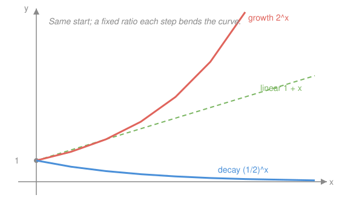

# Algebra I & II · Lesson 5.1: Exponential functions

> ⏱ ~15 min · Module 5: Exponentials & logarithms · Builds on: 4.3 (radicals & rational exponents) · Unlocks: 5.2 (logarithms)

## Why this matters

Anything that grows or shrinks by the *same fraction* every step — money at compound interest, a population, a radioactive sample, a rumor, a cooling coffee — is an exponential. This one shape runs half of finance, most of population biology, and radioactive dating. Get the fingerprint down now (multiply, don't add) and the log machinery in 5.2 — plus continuous growth in `calc-refresher` — clicks into place instead of feeling like new magic.

## The idea

Linear growth **adds** a fixed amount each step: +3, +3, +3. Exponential growth **multiplies** by a fixed factor each step: ×2, ×2, ×2. That's the entire distinction. Start at 5 and add 3 repeatedly: 5, 8, 11, 14 — a straight line. Start at 5 and multiply by 2 repeatedly: 5, 10, 20, 40 — a curve that bends upward faster and faster.

The multiplier is called the **base**, $b$. If $b > 1$ you multiply by more than 1 each step, so the quantity **grows**. If $b$ is between 0 and 1 you multiply by less than 1 each step — you keep a *fraction* of what you had — so it **decays** toward zero. The signature you can spot in a table: divide any value by the one before it and you always get the same number. That constant ratio *is* $b$, and no linear function has it.

## The formal version

$$f(x) = a\,b^x, \qquad a \neq 0,\quad b > 0,\quad b \neq 1.$$

In words: start with an initial amount $a$, then multiply by the base $b$ once for every unit you advance $x$. Reading the pieces:

- $a = f(0)$ is the **initial value** (set $x=0$: $b^0 = 1$, so $f(0) = a$).
- $b$ is the **growth factor per step**: $b > 1$ means growth, $0 < b < 1$ means decay.
- The **constant-ratio test**: $\dfrac{f(x+1)}{f(x)} = \dfrac{a\,b^{x+1}}{a\,b^{x}} = b$ for *every* $x$. Constant ratio ⇒ exponential; constant *difference* ⇒ linear.

**Percent to factor.** A rate of growth $r$ per step gives base $b = 1 + r$; a rate of decay $r$ gives $b = 1 - r$. So 5% growth is $b = 1.05$; losing 20% each step is $b = 0.80$.

**The base $e$.** When growth is *continuous* rather than in discrete steps — interest compounded every instant, not once a year — the natural base $e \approx 2.71828$ shows up, and the model is written $f(x) = a\,e^{kx}$. Intuitively, $e$ is the growth factor you land on if 100% growth is sliced into infinitely many tiny compoundings. You'll meet it properly in `calc-refresher`; for now just know $e$ is a specific number a bit under 3, and $e^{kx}$ is exponential with base $b = e^{k}$.

## Picture

All three curves start at the same height. The linear line adds a fixed amount per step and stays straight. Growth ($b>1$) accelerates upward; decay ($0<b<1$) falls toward the axis but never quite reaches it.

## Worked examples

**Example 1 (mechanical).** Let $f(x) = 3\cdot 2^{x}$. Build the table:

$$f(0)=3,\quad f(1)=6,\quad f(2)=12,\quad f(3)=24.$$

Each value is double the last — the ratio $6/3 = 12/6 = 24/12 = 2$ is exactly the base $b=2$, and $a = f(0) = 3$ is the initial value. Notice $x$ sits in the *exponent*: nudging $x$ by 1 doesn't add a fixed amount, it *scales* by 2. That scaling is why the curve steepens.

**Example 2 (why you'd care).** You deposit 1,000 dollars at 5% interest compounded once a year. Each year the balance is multiplied by $1 + 0.05 = 1.05$, so

$$A(t) = 1000\,(1.05)^{t}.$$

After 3 years: $A(3) = 1000\,(1.05)^3 = 1000\,(1.157625) = 1157.63$ dollars. The base $1.05$ is the whole story — the "1" carries your money forward, the "0.05" adds the interest. Swap growth for decay and the same template covers a car losing 15% of its value a year ($b = 0.85$) or a drug clearing from the blood. This is the model behind Boss Problem 5, and the one you'll reuse constantly in `mathematical-finance`.

## Watch out

- You might think $2^{x}$ and $x^{2}$ are interchangeable — they're opposites. In $x^{2}$ the variable is the **base** (a power function; it's the parabola from Module 4). In $2^{x}$ the variable is the **exponent** (an exponential). At $x = 10$ they're 100 versus 1024; by $x=20$ the exponential has left the polynomial in the dust.
- You might think "grows 5% a year" means base $0.05$ — no. The base is $1 + r = 1.05$; forgetting the "1" throws away all the money you already had. Likewise "loses 5%" is $0.95$, not $-0.05$ (a negative base isn't even allowed).
- You might think you can decide growth-vs-decay-vs-linear by eyeballing the numbers going up. Run the test: constant *difference* between terms ⇒ linear; constant *ratio* ⇒ exponential. Only the ratio test tells exponential from a fast-rising line.

## One-liner

> Exponential means multiply by the same factor every step; the base $b$ is that factor — above 1 it grows, below 1 it decays, and a constant ratio in the data is its fingerprint.

## Problems

**P1 (🟢)** A bacteria culture starts at 200 cells and triples every hour. Write $f(t)$ for the population after $t$ hours, then find the population after 4 hours.

**P2 (🟡)** A quantity takes the values $5,\ 7.5,\ 11.25,\ 16.875$ at $x = 0,1,2,3$. Is this exponential or linear? Justify with the right test, then write the model $f(x) = a\,b^{x}$.

**P3 (🔴)** A 60 mg dose of a drug leaves the bloodstream at 20% per hour. Write $m(t)$, find the amount left after 3 hours, and determine between which two whole hours the amount first drops below half the dose. Why can't you get the *exact* crossing time with the tools you have so far?

Solutions

**P1** "Triples every hour" means multiply by 3 each hour, so $b = 3$ and $a = 200$:
$$f(t) = 200\cdot 3^{t}.$$
After 4 hours: $f(4) = 200\cdot 3^{4} = 200\cdot 81 = \boxed{16{,}200}$ cells.

**P2** Check differences: $7.5 - 5 = 2.5$ but $11.25 - 7.5 = 3.75$ — not constant, so **not linear**. Check ratios: $7.5/5 = 1.5$, $11.25/7.5 = 1.5$, $16.875/11.25 = 1.5$ — constant, so **exponential** with base $b = 1.5$. The initial value is $a = f(0) = 5$, giving
$$f(x) = 5\,(1.5)^{x}.$$
(Check: $5(1.5)^3 = 5(3.375) = 16.875$. ✓)

**P3** Losing 20% per hour keeps 80% each hour, so $b = 1 - 0.20 = 0.80$ and $a = 60$:
$$m(t) = 60\,(0.80)^{t}.$$
After 3 hours: $m(3) = 60\,(0.8)^3 = 60\,(0.512) = \boxed{30.72\text{ mg}}$. Half the dose is 30 mg. Tabulating: $m(3) = 30.72$ (still above 30) and $m(4) = 60(0.8)^4 = 24.576$ (below 30), so the amount first drops below half **between hours 3 and 4**. You can't pin the exact time because that means solving $60(0.8)^t = 30$, i.e. $(0.8)^t = 0.5$ — an equation with the unknown *in the exponent*. Pulling $t$ down out of the exponent is exactly what a logarithm does (Lesson 5.2).

## Flashback

**From Lesson 4.3 (Radicals & rational exponents):** (a) Evaluate $16^{-3/4}$. (b) Simplify $\sqrt{75}$.

Solution

**(a)** A negative exponent means reciprocal; the $3/4$ means "fourth root, then cube":
$$16^{-3/4} = \frac{1}{16^{3/4}} = \frac{1}{\left(\sqrt[4]{16}\right)^{3}} = \frac{1}{2^{3}} = \boxed{\tfrac{1}{8}}.$$

**(b)** Pull out the largest perfect-square factor ($75 = 25\cdot 3$):
$$\sqrt{75} = \sqrt{25}\,\sqrt{3} = \boxed{5\sqrt{3}}.$$

## Connections

- **Backward:** this extends the exponent laws and rational exponents of Lesson 4.3 — $b^x$ makes sense for *every* real $x$, not just fractions, so the whole curve is defined.
- **Forward:** Lesson 5.2 introduces logarithms, the inverse that pulls the variable out of the exponent so you can solve $b^x = c$ (and answer P3 exactly, and Boss Problem 5's doubling time). In `calc-refresher`, $e^x$ returns as the one function that equals its own derivative — the reason $e$ is "natural."
- **Sideways (physics):** radioactive decay is $N(t) = N_0\,(1/2)^{t/T}$ with half-life $T$ — the same decay curve as P3, just parameterized by how long it takes to halve.
- **Sideways (finance):** compound interest $A = P(1+r)^t$ (Example 2) is the workhorse of `mathematical-finance`; continuous compounding turns the base into $e$.
