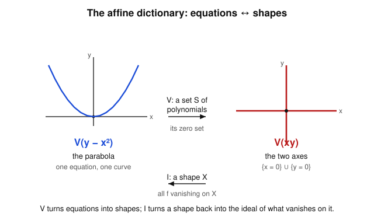

# Algebraic Geometry · Lesson 1.1: The affine dictionary — from equations to shapes

> ⏱ ~15 min · Module 1: Affine varieties & the Nullstellensatz · Builds on: nothing (course start; leans on rings & ideals from [abstract-algebra](../../abstract-algebra/syllabus.md)) · Unlocks: [1.2 Ideals, radicals & when the dictionary is exact](01-02-ideals-radicals.md)

## Why this matters

Algebraic geometry is one long translation exercise between two languages you already half-speak: **algebra** (polynomials, ideals, rings) and **geometry** (curves, surfaces, points). The entire subject hangs on two maps that go back and forth — $V$, which turns a batch of equations into the shape they cut out, and $I$, which turns a shape into the ideal of everything that vanishes on it. Learn to run these two maps fluently and you can compute a geometric fact (is this curve smooth? how many points meet here?) by an algebraic manipulation, and vice versa. This lesson installs the dictionary; the rest of Module 1 sharpens it into an exact correspondence via the Nullstellensatz.

## The idea

Fix a field $k$, and think of $k$-tuples $(a_1,\dots,a_n)$ as *points*. A polynomial $f(x_1,\dots,x_n)$ is a function you can evaluate at a point, and asking "$f=0$" carves out a shape: the points where $f$ vanishes. Hand me a whole *set* of polynomials and I intersect all their zero sets — that's $V(S)$, the **vanishing set**. More equations means more constraints means a *smaller* shape.

Now run it backwards. Hand me a *shape* $X$ — any subset of points — and I collect every polynomial that is identically zero on $X$. That collection is $I(X)$, the **ideal** of $X$. A bigger shape is harder to vanish on, so it admits *fewer* polynomials.

That inversion — bigger inputs give smaller outputs, on both sides — is the first structural fact of the subject. The two maps are like a pair of translators facing each other: $V$ reads algebra and speaks geometry, $I$ reads geometry and speaks algebra. Most of Module 1 is about how close they come to being exact inverses.

## The formal version

Throughout, $k = \bar k$ is an **algebraically closed** field (think $\mathbb{C}$): every non-constant polynomial in one variable has a root. We write $k[x_1,\dots,x_n]$ for the polynomial ring in $n$ variables.

**Definition (affine space).** *Affine $n$-space* over $k$ is the set
$$\mathbb{A}^n = \mathbb{A}^n_k = \{\,(a_1,\dots,a_n) : a_i \in k\,\}.$$

*In words:* it is just $k^n$ as a **set of points** — deliberately *not* a vector space. We forget the addition and the origin; no point is special. (Later, maps between varieties are allowed to move the "origin" anywhere, so privileging it would be a mistake.)

**Definition (vanishing set).** For a set $S \subseteq k[x_1,\dots,x_n]$ of polynomials,
$$V(S) = \{\, p \in \mathbb{A}^n : f(p) = 0 \ \text{ for all } f \in S \,\}.$$
A subset of $\mathbb{A}^n$ of this form is called an **(affine) algebraic set** or **variety**.

*In words:* $V(S)$ is the set of common solutions of all the equations $f = 0$, $f \in S$.

**Definition (ideal of a set).** For any subset $X \subseteq \mathbb{A}^n$,
$$I(X) = \{\, f \in k[x_1,\dots,x_n] : f(p) = 0 \ \text{ for all } p \in X \,\}.$$

*In words:* $I(X)$ is every polynomial that dies on all of $X$. It is genuinely an ideal: if $f, g$ vanish on $X$ so does $f+g$, and if $f$ vanishes on $X$ then so does $hf$ for any $h \in k[x_1,\dots,x_n]$.

Three facts nail down how these maps behave.

**Fact 1 (only the generated ideal matters).** Let $\langle S\rangle$ denote the ideal generated by $S$ (all finite combinations $\sum h_i f_i$ with $f_i \in S$, $h_i \in k[x_1,\dots,x_n]$). Then
$$V(S) = V(\langle S\rangle).$$
*In words:* adding to $S$ any polynomial that is already an algebraic consequence of $S$ changes nothing geometrically — so $V$ really is a map on *ideals*, not on lists of equations. (Proof in the worked examples.)

**Fact 2 (order-reversing).** Both maps flip inclusions:
$$S \subseteq T \ \Rightarrow\ V(S) \supseteq V(T), \qquad X \subseteq Y \ \Rightarrow\ I(X) \supseteq I(Y).$$
*In words:* more equations, fewer solutions; a bigger shape, fewer functions vanishing on it.

**Fact 3 (the Galois connection).** For every ideal $J$ and every subset $X$,
$$J \subseteq I(V(J)) \qquad\text{and}\qquad X \subseteq V(I(X)),$$
and moreover $V(I(X))$ is the **smallest variety containing $X$** — its *Zariski closure* $\bar X$.

*In words:* going out and coming back never shrinks you. Round-tripping a shape through $I$ then $V$ fills it out to the smallest algebraic set around it; round-tripping an ideal through $V$ then $I$ can *enlarge* it (that gap is exactly the radical, and it is the whole story of [Lesson 1.2](01-02-ideals-radicals.md)). A pair of order-reversing maps satisfying Fact 3 is called a **Galois connection** — the same formal skeleton as Galois theory's subgroups-vs-subfields correspondence, which you may recall from [abstract-algebra](../../abstract-algebra/syllabus.md).

One more property we will use constantly:

**$I(X)$ is always radical.** If $f^m \in I(X)$ for some $m \ge 1$, then $f \in I(X)$.
*Why:* at each $p \in X$, $f(p)^m = 0$ in the field $k$; a field has no nonzero nilpotents, so $f(p) = 0$. Thus $f$ vanishes on $X$. This built-in radical-ness is why $I$ can never recover a non-radical ideal — the asymmetry that the Nullstellensatz ([1.5](01-05-nullstellensatz.md)) pins down exactly.

## Picture

The left panel is $V(y - x^2)$, the parabola — one polynomial, one curve. The right panel is $V(xy)$: a product vanishes exactly when a factor does, so $xy = 0$ means $x = 0$ *or* $y = 0$ — the union of the two coordinate axes. The map $V$ runs equations $\to$ shape; the map $I$ runs shape $\to$ ideal-of-what-vanishes. The two arrows are the dictionary.

## Worked examples

**Example 1 (mechanical — three vanishing sets, and why $V(S)=V(\langle S\rangle)$).**

In $\mathbb{A}^2$:
- $V(y - x^2)$ is the parabola $\{(t, t^2) : t \in k\}$: fixing $x = t$ forces $y = t^2$.
- $V(xy) = \{x = 0\} \cup \{y = 0\}$, the union of the axes, since $xy = 0 \iff x = 0$ or $y = 0$.
- $V(x, y) = \{(0,0)\}$: both coordinates must vanish, leaving only the origin.

Two extreme cases pin the range of $V$. The empty ideal's worth of constraints, $V(0)$, is *all* of $\mathbb{A}^n$ (the zero polynomial vanishes everywhere). At the other end, any nonzero constant never vanishes, so
$$V(1) = \varnothing.$$

Now the proof of **Fact 1**, $V(S) = V(\langle S\rangle)$. Since $S \subseteq \langle S\rangle$, Fact 2 gives $V(\langle S\rangle) \subseteq V(S)$. Conversely take $p \in V(S)$ and any $g \in \langle S\rangle$; write $g = \sum_{i=1}^r h_i f_i$ with $f_i \in S$. Then
$$g(p) = \sum_{i=1}^r h_i(p)\, f_i(p) = \sum_{i=1}^r h_i(p)\cdot 0 = 0,$$
so $g$ vanishes at $p$, i.e. $p \in V(\langle S\rangle)$. Both inclusions hold, so the sets are equal. $\blacksquare$ This is the license to treat "a system of equations" and "the ideal it generates" as the same geometric object.

**Example 2 (why you'd care — the ideal of a point is maximal).**

Take the single point $p = (a, b) \in \mathbb{A}^2$ and compute $I(\{p\})$. Certainly $x - a$ and $y - b$ vanish at $p$, so $(x-a,\, y-b) \subseteq I(\{p\})$. For the reverse, given any $f$ vanishing at $p$, do a change of variables $u = x - a$, $v = y - b$ and Taylor-expand: every monomial $u^i v^j$ with $i + j \ge 1$ lies in $(u, v)$, and the constant term is $f(a,b) = 0$. Hence $f \in (x - a,\, y - b)$, giving
$$I(\{(a,b)\}) = (x - a,\ y - b).$$
This ideal is **maximal**: the evaluation-at-$p$ map $k[x,y] \to k$, $f \mapsto f(a,b)$, is a surjective ring homomorphism with kernel exactly $(x-a, y-b)$, so
$$k[x,y]\,/\,(x-a,\ y-b) \ \cong\ k,$$
a field — the defining property of a maximal ideal. So *points of $\mathbb{A}^2$ correspond to maximal ideals of $k[x,y]$.* That correspondence, promoted to a theorem over any $k = \bar k$, is the **weak Nullstellensatz** of [Lesson 1.5](01-05-nullstellensatz.md); meeting it here, by hand, is the point of this example.

## Watch out

- You might think $\mathbb{A}^n$ *is* the vector space $k^n$ — but we deliberately strip out the origin and the linear structure. Affine space is a set of points on which polynomials act; treating $(0,\dots,0)$ as special will mislead you the moment a morphism relocates it.
- You might think $I(V(J)) = J$ always — but going out and back can *grow* the ideal. Example: $V(x^2)$ in $\mathbb{A}^2$ is the $y$-axis $\{x = 0\}$ (a point where $x^2 = 0$ is just a point where $x = 0$), and $I(\{x=0\}) = (x)$. So $I(V(x^2)) = (x) \supsetneq (x^2)$. The map $I$ can only ever return a *radical* ideal, and $\sqrt{(x^2)} = (x)$ — a preview of [1.2](01-02-ideals-radicals.md).
- You might think the dictionary works over any field — but it needs $k = \bar k$. Over $\mathbb{R}$, the proper ideal $(x^2 + 1) \subsetneq \mathbb{R}[x]$ has $V(x^2+1) = \varnothing$ (no real root), so $I(V) = \mathbb{R}[x] \ne \sqrt{(x^2+1)}$. Algebraic closure is what guarantees a nonempty variety for every proper ideal (P3).
- You might think different polynomials give different varieties — but $V$ sees only the generated ideal. $V(x, y)$, $V(x, y, x+y)$, and $V(x^2, xy, y^2, x, y)$ all equal $\{(0,0)\}$.

## One-liner

> $V$ turns equations into shapes and $I$ turns shapes back into ideals; they reverse inclusions, they never quite invert each other, and closing that gap is the whole first module.

## Problems

**P1 (🟢)** Work in $\mathbb{A}^2$ over $k = \bar k$.
(a) Find $V(y - x^2,\ y - 1)$ as an explicit finite list of points.
(b) Write down $I(\{(3, 0)\})$ and prove it is a maximal ideal.

**P2 (🟡)** Let $S \subseteq k[x_1,\dots,x_n]$ be any set of polynomials. Prove that $V$ is order-reversing: if $S \subseteq T$ then $V(T) \subseteq V(S)$. Then combine this with Fact 1 to explain why, *once you know $k[x_1,\dots,x_n]$ is Noetherian* (every ideal is finitely generated — the Hilbert Basis Theorem of [Lesson 1.3](01-03-noetherian-hilbert-basis.md)), **every** variety is the common zero set of *finitely many* polynomials.

**P3 (🔴, optional)**
(a) Prove that for any $X \subseteq \mathbb{A}^n$, the ideal $I(X)$ is radical (i.e. $f^m \in I(X) \Rightarrow f \in I(X)$).
(b) Over $k = \mathbb{R}$ (which is *not* algebraically closed), exhibit a proper ideal $J \subsetneq \mathbb{R}[x]$ with $V(J) = \varnothing$, and compute $I(V(J))$. Explain in one sentence why this cannot happen for a proper ideal over $\bar k$ — i.e. what the weak Nullstellensatz will buy us.

Solutions

**P1** (a) A point lies in $V(y - x^2,\ y - 1)$ iff it satisfies *both* $y = x^2$ and $y = 1$. Substituting, $x^2 = 1$, so $x = 1$ or $x = -1$ (over $k = \bar k$ these are the two roots), and $y = 1$ in each case. The variety is the two points
$$\{(1, 1),\ (-1, 1)\}.$$
(Geometrically: the parabola meets the horizontal line $y = 1$ in two points.)

(b) The polynomials $x - 3$ and $y$ vanish at $(3, 0)$, so $(x - 3,\ y) \subseteq I(\{(3,0)\})$. Conversely, given $f$ with $f(3, 0) = 0$, substitute $x = (x - 3) + 3$ and expand $f$ in powers of $(x-3)$ and $y$: every term with a factor of $(x-3)$ or $y$ lies in $(x-3, y)$, and the remaining constant term is $f(3, 0) = 0$. Hence $f \in (x-3, y)$ and $I(\{(3,0)\}) = (x - 3,\ y)$.
It is maximal because evaluation $\mathrm{ev}_{(3,0)} : k[x,y] \to k$, $f \mapsto f(3,0)$, is a surjective ring homomorphism (it hits every constant) with kernel exactly $(x-3, y)$; by the first isomorphism theorem $k[x,y]/(x-3, y) \cong k$, a field, so the ideal is maximal. $\blacksquare$

**P2** *Order-reversing.* Suppose $S \subseteq T$ and let $p \in V(T)$. Then $f(p) = 0$ for every $f \in T$; since $S \subseteq T$, in particular $f(p) = 0$ for every $f \in S$, so $p \in V(S)$. Thus $V(T) \subseteq V(S)$. $\blacksquare$

*Finiteness.* Let $X = V(S)$ be any variety. By Fact 1, $X = V(S) = V(\langle S\rangle)$, so $X = V(J)$ for the ideal $J = \langle S\rangle$. If $k[x_1,\dots,x_n]$ is Noetherian, $J$ is generated by finitely many polynomials, $J = \langle f_1, \dots, f_r\rangle$. Applying Fact 1 again (now in reverse), $X = V(J) = V(\{f_1,\dots,f_r\}) = V(f_1,\dots,f_r)$. So $X$ is cut out by the finite system $f_1 = \dots = f_r = 0$. In words: no variety ever needs infinitely many equations — the Hilbert Basis Theorem guarantees a finite defining system.

**P3** (a) Suppose $f^m \in I(X)$, i.e. $f^m$ vanishes on all of $X$. Fix any $p \in X$; then $f(p)^m = (f^m)(p) = 0$ in the field $k$. A field is an integral domain, so it has no nonzero nilpotents: $f(p)^m = 0 \Rightarrow f(p) = 0$. As $p \in X$ was arbitrary, $f$ vanishes on $X$, i.e. $f \in I(X)$. Hence $I(X)$ is radical. $\blacksquare$

(b) Take $J = (x^2 + 1) \subseteq \mathbb{R}[x]$. It is proper: $x^2 + 1$ is not a unit (units in $\mathbb{R}[x]$ are the nonzero constants), so $1 \notin J$. Over $\mathbb{R}$ the equation $x^2 + 1 = 0$ has no solution, so $V(J) = \varnothing$. Then $I(V(J)) = I(\varnothing) = \mathbb{R}[x]$ (every polynomial vacuously vanishes on the empty set). So $I(V(J)) = \mathbb{R}[x] \ne \sqrt{J}$ (indeed $\sqrt J = J = (x^2+1)$, since $x^2+1$ is irreducible over $\mathbb{R}$, so already prime hence radical). The dictionary breaks: a proper ideal produced the empty variety.
One-sentence reason it can't happen over $\bar k$: the **weak Nullstellensatz** says over an algebraically closed field every *proper* ideal has a common zero, so $V(J) = \varnothing \Rightarrow J = (1)$ — exactly what fails over $\mathbb{R}$, where $x^2 + 1$ has roots $\pm i$ only after passing to $\mathbb{C} = \bar{\mathbb{R}}$.

## Connections

- **Forward:** [Lesson 1.2](01-02-ideals-radicals.md) measures the exact gap in Fact 3 — $I(V(J)) = \sqrt J$, the radical — so the round trip $J \mapsto I(V(J))$ is understood completely.
- **Forward:** [Lesson 1.4](01-04-zariski-topology-irreducibility.md) upgrades "$V(I(X)) = \bar X$" from a phrase to a theorem by declaring the sets $V(J)$ to be the closed sets of the *Zariski topology*, borrowing the open/closed language of [topology](../../topology/syllabus.md); [Lesson 1.5](01-05-nullstellensatz.md) proves the Nullstellensatz and turns the dictionary into an exact bijection {radical ideals} $\leftrightarrow$ {varieties}, with points $\leftrightarrow$ maximal ideals (the fact you met by hand in Example 2).
- **Sideways (abstract-algebra):** the generated ideal $\langle S\rangle$, quotient rings, and the maximal-ideal test via $R/\mathfrak{m}$ being a field are all straight from [abstract-algebra](../../abstract-algebra/syllabus.md); the $V$–$I$ Galois connection is the same order-reversing skeleton as the Galois correspondence between subgroups and intermediate fields.
