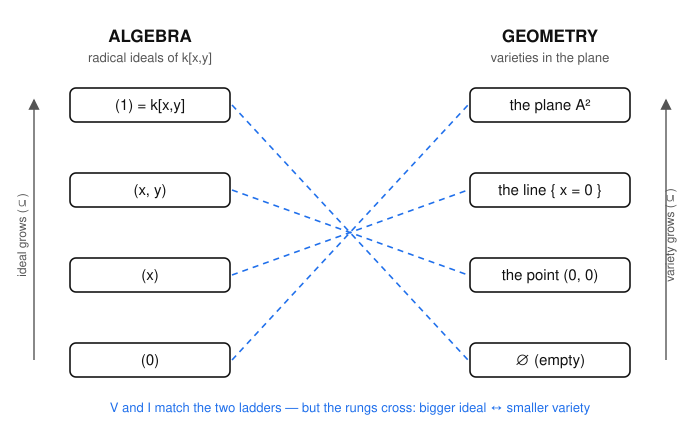

# Algebraic Geometry · Lesson 1.2: Ideals, radicals & when the dictionary is exact

> ⏱ ~15 min · Module 1: Affine varieties & the Nullstellensatz · Builds on: [Lesson 1.1](01-01-affine-dictionary.md) (the $V$–$I$ pairing) · Unlocks: [Lesson 1.3](01-03-noetherian-hilbert-basis.md) (every ideal is finitely generated)

## Why this matters

Last lesson gave us two maps: $V$ turns an ideal into a shape, $I$ turns a shape back into an ideal. The dream is that they're inverse to each other — a perfect dictionary. They're *almost* inverse, and this lesson is about the exact size of the "almost." The gap has a name (the **radical**), a formula, and a fix: throw away the ideals that carry information $V$ can't see. Pin this down now and the Nullstellensatz (Lesson 1.5) becomes a one-line upgrade rather than a mystery.

## The idea

Here is the whole problem in one example. Over a field, $x^2 = 0$ has exactly the same solutions as $x = 0$ — namely, the single point $x=0$. So the ideals $(x)$ and $(x^2)$ in $k[x]$ cut out the *identical* shape $\{0\}$, even though they're different ideals. The map $V$ cannot tell them apart. Algebra remembers that $0$ is a *double* root of $x^2$; geometry, seeing only the point set, forgets the multiplicity.

So $V$ is not injective: many ideals share one variety. The question becomes — which ideals get collapsed together, and is there a canonical representative of each collapsed clump? The answer to both is the **radical**. Passing from $J$ to $\sqrt J$ throws in every function *some power* of which lies in $J$ (like throwing $x$ in because $x^2$ is already there), and it's exactly the operation that undoes the collapse. Restrict attention to ideals that already equal their own radical, and $V$ and $I$ become genuine inverses.

## The formal version

Fix $k = \bar k$ (algebraically closed) and the polynomial ring $k[x_1,\dots,x_n]$, whose ideals are our objects. Recall $V(S)=\{p\in\mathbb{A}^n : f(p)=0 \text{ for all } f\in S\}$ and $I(X)=\{f : f(p)=0 \text{ for all } p\in X\}$ from Lesson 1.1.

**Definition (radical).** For an ideal $J\subseteq k[x_1,\dots,x_n]$,
$$\sqrt J \;=\; \{\, f : f^m\in J \text{ for some integer } m\ge 1 \,\}.$$

*In words:* $\sqrt J$ collects every function that is "eventually in $J$" — some power of it lands inside. Taking $m=1$ shows $J\subseteq\sqrt J$ always.

**$\sqrt J$ is an ideal.** It contains $0$ ($0^1\in J$). If $f\in\sqrt J$, say $f^m\in J$, then for any $g\in k[x_1,\dots,x_n]$ we have $(gf)^m = g^m f^m\in J$ (ideals absorb multiplication), so $gf\in\sqrt J$. The only real work is closure under addition. Suppose $f^m\in J$ and $g^n\in J$; expand
$$(f+g)^{m+n-1} \;=\; \sum_{i=0}^{m+n-1}\binom{m+n-1}{i}\,f^{\,i}\,g^{\,m+n-1-i}.$$
In each term either $i\ge m$ or $i\le m-1$. If $i\ge m$ the factor $f^i$ is divisible by $f^m\in J$; if $i\le m-1$ then $m+n-1-i \ge n$, so the factor $g^{\,m+n-1-i}$ is divisible by $g^n\in J$. Either way every term lies in $J$, so their sum does, giving $f+g\in\sqrt J$. $\blacksquare$

**Definition (radical ideal).** $J$ is a **radical ideal** if $J=\sqrt J$ — equivalently (since $J\subseteq\sqrt J$ is automatic), whenever $f^m\in J$ then already $f\in J$.

Now the two facts that measure the gap between $V$ and $I$.

**Fact 1 — $V$ sees only the radical: $V(J)=V(\sqrt J)$.** Since $J\subseteq\sqrt J$, more equations means fewer solutions, so $V(\sqrt J)\subseteq V(J)$. Conversely take $p\in V(J)$ and $f\in\sqrt J$, say $f^m\in J$. Then $f(p)^m = (f^m)(p)=0$ in $k$; but $k$ is a field, so $f(p)^m=0$ forces $f(p)=0$. Thus $f$ vanishes at $p$, i.e. $p\in V(\sqrt J)$. Hence $V(J)\subseteq V(\sqrt J)$, and the two are equal. $\blacksquare$

*In words:* **a power vanishes exactly when the function itself vanishes**, so enlarging $J$ to $\sqrt J$ never changes the solution set. (This half is free — it needs only that $k$ has no zero-divisors, not that it's algebraically closed.)

**Fact 2 — $I$ always outputs a radical ideal, and it contains $\sqrt J$.** First, for *any* set $X$, the ideal $I(X)$ is radical: if $f^m\in I(X)$ then $f(p)^m=0$ for all $p\in X$, so $f(p)=0$ for all $p\in X$, i.e. $f\in I(X)$. Now feed $J$ through both maps. We know $J\subseteq I(V(J))$ (every $f\in J$ vanishes on $V(J)$ by the definition of $V$ — Lesson 1.1). Since $I(V(J))$ is radical and contains $J$, it contains $\sqrt J$ too:
$$\boxed{\;\sqrt J \;\subseteq\; I(V(J)).\;}$$

*In words:* running an ideal through "solve, then collect everything that vanishes" always recovers **at least** the radical.

**The punchline (previewing Lesson 1.5).** Hilbert's Nullstellensatz says that over $k=\bar k$ this containment is an **equality**:
$$I(V(J)) \;=\; \sqrt J.$$
The radical is not merely contained in $I(V(J))$ — it is *exactly* it. Consequently $V$ and $I$ restrict to mutually inverse, inclusion-reversing bijections
$$\{\text{radical ideals}\}\;\underset{I}{\overset{V}{\longleftrightarrow}}\;\{\text{varieties}\}.$$
Radical ideals are the ideals with no redundancy for $V$ to discard, so on them nothing is lost. Everything below builds the intuition; 1.5 supplies the one hard direction.

## Picture

Read each column as a ladder ordered by inclusion, biggest at the top. The maps $V$ and $I$ pair them rung-for-rung — but the pairing lines **cross**, because $V$ and $I$ reverse order: the biggest ideal $(1)=k[x,y]$ matches the smallest variety $\varnothing$, the smallest ideal $(0)$ matches the biggest variety $\mathbb{A}^2$, and the maximal ideal $(x,y)$ in the middle matches the single point $(0,0)$. Bigger ideal $\leftrightarrow$ smaller variety, every time. (Every ideal shown is already radical — these are honest inverse pairs.)

## Worked examples

**Example 1 (the multiplicity example: $(x^2)$ vs. $(x)$).** In $k[x]$, both cut out the point $\{0\}$: $x^2(p)=0\iff p=0\iff x(p)=0$, so $V\big((x^2)\big)=V\big((x)\big)=\{0\}$. Yet the ideals differ. Their radicals reconcile it. Since $x^2\in(x^2)$, we get $x\in\sqrt{(x^2)}$, so $(x)\subseteq\sqrt{(x^2)}$; and $(x^2)\subseteq(x)$ with $(x)$ prime (hence radical), so $\sqrt{(x^2)}\subseteq\sqrt{(x)}=(x)$. Therefore
$$\sqrt{(x^2)}=(x).$$
And indeed $I(V((x^2)))=I(\{0\})=(x)=\sqrt{(x^2)}$ — the recovered ideal is the *radical* $(x)$, **not** the original $(x^2)$. The Nullstellensatz equality lands on $\sqrt J$ precisely because $V$ threw the multiplicity away. This one example is the entire lesson in miniature.

**Example 2 (a two-variable radical: $\sqrt{(x^2,y)}$).** Work in $k[x,y]$. Geometrically $V(x^2,y)$ needs $x^2=0$ and $y=0$, i.e. $x=0$ and $y=0$: the single point $(0,0)$. So we expect the radical to be $I(\{(0,0)\})=(x,y)$. Prove it both ways:
- $(x,y)\subseteq\sqrt{(x^2,y)}$: from $x^2\in(x^2,y)$ we get $x\in\sqrt{}$, and $y\in(x^2,y)\subseteq\sqrt{}$.
- $\sqrt{(x^2,y)}\subseteq(x,y)$: the ideal $(x,y)$ is maximal (the quotient $k[x,y]/(x,y)\cong k$ is a field), in particular radical, and $(x^2,y)\subseteq(x,y)$, so $\sqrt{(x^2,y)}\subseteq\sqrt{(x,y)}=(x,y)$.

Hence $\sqrt{(x^2,y)}=(x,y)$. The generator $x^2$ contributed the same geometry as $x$; the radical demotes it.

**Example 3 (a reducible one: $\sqrt{(x^2y,\;xy^2)}$).** Factor the generators: $x^2y=x\cdot(xy)$ and $xy^2=y\cdot(xy)$, both multiples of $xy$. Geometrically $x^2y=0$ and $xy^2=0$ each say "$x=0$ or $y=0$," so $V=\{x=0\}\cup\{y=0\}$, the union of the two axes $=V(xy)$. Claim $\sqrt{(x^2y,xy^2)}=(xy)$:
- $(xy)\subseteq\sqrt{}$: $(xy)^2=x^2y^2=y\cdot(x^2y)\in(x^2y,xy^2)$, so $xy\in\sqrt{}$.
- $\sqrt{}\subseteq(xy)$: clearly $(x^2y,xy^2)\subseteq(xy)$, and $(xy)$ is radical because $(xy)=(x)\cap(y)$ is an intersection of two primes. (Intersections of radical ideals are radical: if $f^m\in(x)\cap(y)$ then $f^m\in(x)$ and $f^m\in(y)$, so $f\in(x)$ and $f\in(y)$.) Thus $\sqrt{}\subseteq\sqrt{(xy)}=(xy)$.

So $\sqrt{(x^2y,xy^2)}=(xy)$ — a radical ideal, matching the honest geometry of "two lines."

## Watch out

- You might think $V$ being non-injective means the dictionary is broken — actually it means you were using the wrong left-hand set. On **all** ideals $V$ collapses; restricted to **radical** ideals it's a bijection. The lesson is not "$V$ is bad," it's "radical ideals are the right objects."
- You might think $\sqrt J$ is found by taking literal square roots. No — $\sqrt J$ is about *powers landing in $J$*, at any exponent $m$. In Example 1 the relevant power was a square; in general it can be any $m\ge1$, and it's the exponent, not a root, that matters.
- You might think $J\subseteq I(V(J))$ can be strict only over small fields. Over $k=\bar k$ the strictness is *entirely* explained by the radical: $I(V(J))=\sqrt J$, so $J\subsetneq I(V(J))$ happens **iff** $J$ is not radical. (Drop $k=\bar k$ and a second source of strictness appears — see P3.)
- **Bridge to `abstract-algebra`:** $\sqrt J/J$ is exactly the **nilradical** (the set of nilpotents) of the quotient ring $k[x_1,\dots,x_n]/J$. So "$J$ is radical" $\iff$ "$k[x]/J$ has no nonzero nilpotents" $\iff$ the quotient is a **reduced ring** — the coordinate-ring viewpoint you'll meet in Lesson 1.6.

## One-liner

> $V$ can't see the difference between a function and its powers, so it only sees $\sqrt J$; restrict to radical ideals and the algebra–geometry dictionary becomes a perfect, order-reversing bijection.

## Problems

**P1 (🟢)** Compute each radical and identify the variety it cuts out. (a) $\sqrt{(x^4)}$ in $k[x]$. (b) $\sqrt{(x^3,\,xy)}$ in $k[x,y]$.

**P2 (🟡)** Prove that $\sqrt{\sqrt J}=\sqrt J$ for every ideal $J$. (Conclude $\sqrt J$ is always a radical ideal — so "take the radical" really does produce a legitimate representative, and it's a canonical one: it never needs taking twice.)

**P3 (🔴, optional)** Show the Nullstellensatz genuinely needs $k=\bar k$. Over $k=\mathbb{R}$, let $J=(x^2+1)\subseteq\mathbb{R}[x]$. Compute $V(J)\subseteq\mathbb{A}^1_{\mathbb{R}}$, then $I(V(J))$, and separately $\sqrt J$. Exhibit that $I(V(J))\ne\sqrt J$, and say in one sentence which of Facts 1–2 still holds and which fails.

Solutions

**P1** (a) Since $x^4\in(x^4)$, $x\in\sqrt{(x^4)}$, so $(x)\subseteq\sqrt{(x^4)}$; and $(x^4)\subseteq(x)$ with $(x)$ prime (hence radical) gives $\sqrt{(x^4)}\subseteq(x)$. So $\sqrt{(x^4)}=(x)$, cutting out the point $\{0\}\subseteq\mathbb{A}^1$.

(b) Both generators are divisible by $x$ ($x^3=x\cdot x^2$, $xy=x\cdot y$), so $(x^3,xy)\subseteq(x)$; as $(x)$ is prime, $\sqrt{(x^3,xy)}\subseteq(x)$. Conversely $x^3\in(x^3,xy)$ gives $x\in\sqrt{}$, so $(x)\subseteq\sqrt{}$. Hence $\sqrt{(x^3,xy)}=(x)$. Geometrically: $x^3=0$ forces $x=0$, and then $xy=0$ automatically, so $V=\{x=0\}$, the $y$-axis $=V(x)$. ✓

**P2** The containment $\sqrt J\subseteq\sqrt{\sqrt J}$ holds for any ideal (apply "$K\subseteq\sqrt K$" to $K=\sqrt J$). For the reverse, take $f\in\sqrt{\sqrt J}$: by definition $f^{\,n}\in\sqrt J$ for some $n\ge1$, and then $\big(f^{\,n}\big)^{m}\in J$ for some $m\ge1$. But $\big(f^n\big)^m=f^{\,nm}$, so $f^{\,nm}\in J$ with $nm\ge1$, i.e. $f\in\sqrt J$. Thus $\sqrt{\sqrt J}\subseteq\sqrt J$, and the two are equal. Since $\sqrt J$ equals its own radical, it is a radical ideal. $\blacksquare$

**P3** $V(J)$: solutions of $x^2+1=0$ in $\mathbb{A}^1_{\mathbb{R}}=\mathbb{R}$. There are none (no real square is $-1$), so $V(J)=\varnothing$. Then $I(V(J))=I(\varnothing)=\mathbb{R}[x]=(1)$ — every polynomial vanishes vacuously on the empty set. Meanwhile $x^2+1$ is irreducible over $\mathbb{R}$, so $(x^2+1)$ is maximal, in particular radical, giving $\sqrt J=(x^2+1)$. Therefore
$$I(V(J))=(1)\;\supsetneq\;(x^2+1)=\sqrt J,$$
a strict, proper containment: the equality of Lesson 1.5 fails. Fact 1 ($V(J)=V(\sqrt J)$) still holds — both are $\varnothing$ — since it only needs $k$ to be a field; what fails is the deep direction $I(V(J))\subseteq\sqrt J$, which is exactly where algebraic closure is indispensable ($\mathbb{R}$ has an ideal, $(x^2+1)$, that is proper yet cuts out nothing). $\blacksquare$

## Connections

- **Backward (Lesson 1.1):** we already had $J\subseteq I(V(J))$; this lesson identifies the *shape* of that gap as the radical and shows the recovered ideal is always at least $\sqrt J$.
- **Forward (Lesson 1.5):** the Nullstellensatz turns "$\supseteq\sqrt J$" into "$=\sqrt J$" over $k=\bar k$, making the order-reversing bijection {radical ideals} $\leftrightarrow$ {varieties} exact — P3 shows why the hypothesis $k=\bar k$ can't be dropped.
- **Forward (Lessons 1.4, 1.6):** *prime* ideals are radical, and they'll correspond to *irreducible* varieties (1.4); a coordinate ring $k[X]=k[x]/I(X)$ is reduced precisely because $I(X)$ is radical (1.6).
- **Sideways (`abstract-algebra`):** $\sqrt J/J$ is the nilradical of $k[x_1,\dots,x_n]/J$; "radical ideal" is the geometry-facing name for "the quotient is a reduced ring," and the $(x^2)$-vs-$(x)$ story is nilpotents ($\bar x\ne0$ but $\bar x^2=0$ in $k[x]/(x^2)$) made visible.
