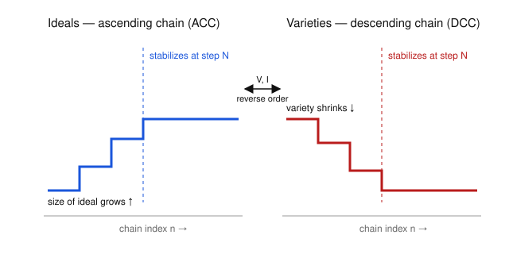

# Algebraic Geometry · Lesson 1.3: Noetherian rings & the Hilbert Basis Theorem

> ⏱ ~15 min · Module 1: Affine varieties & the Nullstellensatz · Builds on: [Lesson 1.2](01-02-ideals-radicals.md) (ideals, radicals, order-reversal) · Unlocks: [Lesson 1.4](01-04-zariski-topology-irreducibility.md) (Zariski topology, irreducible components)

## Why this matters

An ideal $I \subseteq k[x_1,\dots,x_n]$ can be an *infinite* set of polynomials, and a variety is defined as $V(S)$ for a set $S$ that might also be infinite. So a nagging worry hangs over the whole affine dictionary: is a shape ever cut out by *finitely many* equations, or must you sometimes impose infinitely many? Hilbert's answer — yes, always finitely many — is what makes algebraic geometry a subject about equations you can actually write down. It is also the hidden engine behind two things you'll meet soon: every variety splits into finitely many irreducible pieces (Lesson 1.4), and every computational algorithm on ideals (Gröbner bases) is guaranteed to terminate.

## The idea

Two ways to say the same thing, one algebraic and one geometric.

**Algebra.** You can keep enlarging an ideal for a while — but not forever. Build a chain $I_1 \subsetneq I_2 \subsetneq I_3 \subsetneq \cdots$, each strictly bigger than the last, and in $k[x_1,\dots,x_n]$ it *must* run out of room and go flat. This is the **ascending chain condition (ACC)**. A ring where it holds is called **Noetherian** (after Emmy Noether). The magic equivalence: a ring is Noetherian exactly when *every ideal is finitely generated* — no ideal, however complicated, needs more than a finite list of generators.

**Geometry.** Flip it with the order-reversal from [Lesson 1.2](01-02-ideals-radicals.md): bigger ideals cut out smaller varieties. An ascending chain of ideals mirrors a *descending* chain of varieties $X_1 \supsetneq X_2 \supsetneq \cdots$, each a subvariety of the last. ACC on the algebra side becomes "you can't shrink a variety forever" on the geometry side — and *that* is exactly what forces a variety to be built from finitely many indivisible chunks.

The whole lesson is one theorem making "finitely many variables" imply "finitely many equations."

## The formal version

Fix a commutative ring $R$ with $1$ (for us, ultimately $k[x_1,\dots,x_n]$).

**Definition (ACC).** $R$ satisfies the **ascending chain condition** if every ascending chain of ideals $I_1 \subseteq I_2 \subseteq I_3 \subseteq \cdots$ *stabilizes*: there is an $N$ with $I_n = I_N$ for all $n \ge N$.

*In words:* you cannot strictly enlarge an ideal infinitely often.

**Theorem (three faces of Noetherian).** For a commutative ring $R$, the following are equivalent:
1. **(ACC)** every ascending chain of ideals stabilizes;
2. **(Max)** every nonempty set $\Sigma$ of ideals of $R$ has a maximal element (a member contained in no strictly larger member of $\Sigma$);
3. **(FG)** every ideal of $R$ is finitely generated.

A ring satisfying these is **Noetherian**. *In words:* "no infinite climb," "you can always find a biggest ideal in any family," and "every ideal has a finite generating list" are one and the same condition. (We prove the equivalence in **Concrete instance** below.)

**Hilbert Basis Theorem.** If $R$ is Noetherian, then the polynomial ring $R[x]$ is Noetherian.

*In words:* adding one variable to a Noetherian ring keeps it Noetherian — finiteness survives polynomial extension.

**Corollary (the payoff).** $k[x_1,\dots,x_n]$ is Noetherian for every field $k$ and every $n$.

*Proof.* A field $k$ is Noetherian — its only ideals are $(0)$ and $(1)$, both finitely generated. Now induct: $k[x_1,\dots,x_m] = \big(k[x_1,\dots,x_{m-1}]\big)[x_m]$, so if the ring in $m-1$ variables is Noetherian, the Hilbert Basis Theorem makes the ring in $m$ variables Noetherian. After $n$ steps, $k[x_1,\dots,x_n]$ is Noetherian. $\blacksquare$

**Consequence for geometry.** Let $X = V(S)$ for *any* set $S \subseteq k[x_1,\dots,x_n]$. Let $I = (S)$ be the ideal it generates; then $V(S) = V(I)$ (a point kills every polynomial in $S$ iff it kills every $R$-combination of them). By the Corollary $I = (f_1,\dots,f_r)$ is finitely generated, and $V(I) = V(f_1,\dots,f_r)$. So:

$$\boxed{\;\text{every affine variety } X = V(S) \text{ equals } V(f_1,\dots,f_r) \text{ for finitely many } f_i.\;}$$

Every shape in $\mathbb{A}^n$ is cut out by a *finite* system of polynomial equations. That is the sentence this lesson exists to prove.

## Concrete instance

Two proofs — the equivalence, then one turn of the Hilbert Basis crank.

### Proof of the three-faces theorem (ACC ⇔ Max ⇔ FG)

We run the cycle $(1)\Rightarrow(2)\Rightarrow(3)\Rightarrow(1)$.

**$(1)\Rightarrow(2)$.** Contrapositive. Suppose a nonempty family $\Sigma$ has *no* maximal element. Pick any $I_1 \in \Sigma$. Since $I_1$ isn't maximal, some $I_2 \in \Sigma$ has $I_1 \subsetneq I_2$. Since $I_2$ isn't maximal either, pick $I_2 \subsetneq I_3$, and so on. This produces a strictly ascending chain that never stabilizes — so ACC fails. Hence ACC $\Rightarrow$ (Max).

**$(2)\Rightarrow(3)$.** Let $I$ be any ideal; we show it is finitely generated. Let
$$\Sigma = \{\, J \subseteq I : J \text{ is a finitely generated ideal} \,\}.$$
$\Sigma$ is nonempty since $(0)\in\Sigma$. By (Max) it has a maximal element $J = (a_1,\dots,a_m) \subseteq I$. Claim $J = I$. If not, choose $a \in I \setminus J$. Then $J + (a) = (a_1,\dots,a_m,a)$ is finitely generated, still contained in $I$, and *strictly* contains $J$ — contradicting maximality of $J$ in $\Sigma$. So $I = J = (a_1,\dots,a_m)$ is finitely generated.

**$(3)\Rightarrow(1)$.** Let $I_1 \subseteq I_2 \subseteq \cdots$ be an ascending chain. Their union $I = \bigcup_{n} I_n$ is an ideal: given $a,b \in I$ they lie in some common $I_n$ (the chain is nested), so $a+b \in I_n \subseteq I$, and $ra \in I_n \subseteq I$ for $r\in R$. By (FG), $I = (a_1,\dots,a_k)$. Each generator sits in some link: $a_j \in I_{n_j}$. Let $N = \max_j n_j$. Then all of $a_1,\dots,a_k \in I_N$, so $I \subseteq I_N$. For every $n \ge N$ we get $I_N \subseteq I_n \subseteq I \subseteq I_N$, forcing $I_n = I_N$. The chain stabilizes. $\blacksquare$

The middle step is the one to remember: **finite generation is what lets a chain "cap off"** — the finitely many generators of the union all appear by some finite stage $N$, and nothing new can happen past it.

### One step of the Hilbert Basis argument

The full proof of $R\text{ Noetherian} \Rightarrow R[x]$ Noetherian tracks the **leading coefficients** of the polynomials in an ideal $J \subseteq R[x]$: the set of leading coefficients (together with $0$) forms an ideal $L$ of $R$, which is finitely generated because $R$ is Noetherian; a finite set of polynomials realizing those leading coefficients, plus a finite bookkeeping set for the low degrees, generates all of $J$. The engine is a single **degree-reduction move** — let's run it.

Take $R = k[y]$, so $R[x] = k[y][x] = k[x,y]$; here "leading coefficient" means the coefficient of the top power of $x$, an element of $R=k[y]$. Suppose an ideal $J$ contains
$$f_1 = y\,x^2 + 1 \quad(\text{degree } 2 \text{ in } x,\ \text{leading coefficient } y),$$
and we meet a higher-degree member
$$f = y\,x^4 + x \quad(\text{degree } 4 \text{ in } x,\ \text{leading coefficient } y).$$
The leading coefficients match ($y = 1\cdot y$), and $\deg_x f = 4 \ge \deg_x f_1 = 2$, so we can cancel the top term by subtracting the right shift of $f_1$:
$$f - x^{\,4-2} f_1 \;=\; (y x^4 + x) - x^2\big(y x^2 + 1\big) \;=\; y x^4 + x - y x^4 - x^2 \;=\; x - x^2.$$
The result $x - x^2 \in J$ has $x$-degree $2 < 4$. **We replaced $f$ by a strictly lower-degree member of $J$ using a stored generator.** Repeat until the degree drops below the top degree $N$ of your finite generator list, at which point the finitely many low-degree bookkeeping polynomials finish the job. That descent — powered by ACC in $R$, which guarantees the leading-coefficient ideals $L$ are finitely generated — is the whole theorem in miniature.

## Worked examples

**Example 1 (a Noetherian ring, and a non-Noetherian one).**
$k[x]$ is Noetherian because it is a **PID**: every ideal is $(f)$ for a single $f$ (divide with remainder, exactly as $\mathbb{Z}$ does — this is the one-variable base case, borrowed from [abstract-algebra](../../abstract-algebra/syllabus.md)). One generator is certainly a finite list, so (FG) holds.

Contrast the ring $R = k[x_1, x_2, x_3, \dots]$ in *infinitely* many variables. The chain
$$(x_1) \subsetneq (x_1,x_2) \subsetneq (x_1,x_2,x_3) \subsetneq \cdots$$
is strictly increasing — $x_{m+1} \notin (x_1,\dots,x_m)$ because every element of that ideal is a combination whose every monomial is divisible by some $x_i$ with $i\le m$, which $x_{m+1}$ is not. It never stabilizes, so $R$ is **not** Noetherian. The Hilbert Basis Theorem earns its "one variable at a time" hypothesis here: finiteness of variables is exactly what you cannot drop.

**Example 2 (why you'd care — every variety is a finite union of irreducibles).**
Call a variety **irreducible** if it is not the union of two strictly smaller subvarieties (full treatment in [Lesson 1.4](01-04-zariski-topology-irreducibility.md)). Claim: *every* variety $X \subseteq \mathbb{A}^n$ is a finite union of irreducible ones.

First, varieties satisfy the **descending chain condition (DCC)**: a chain $X_1 \supseteq X_2 \supseteq \cdots$ gives, by order-reversal, an ascending chain $I(X_1) \subseteq I(X_2) \subseteq \cdots$ in the Noetherian ring $k[x_1,\dots,x_n]$, which stabilizes; since $V(I(X_i)) = X_i$ for a variety, the $X_i$ stabilize too. Equivalently, **every nonempty family of subvarieties has a minimal element** (the geometric mirror of the Max condition).

Now argue by minimal counterexample. Let $\Sigma$ be the family of subvarieties of $\mathbb{A}^n$ that are *not* finite unions of irreducibles. If $\Sigma \ne \varnothing$, DCC hands us a minimal member $X \in \Sigma$. This $X$ is not irreducible (an irreducible variety is trivially a one-term union of irreducibles, so it wouldn't be in $\Sigma$). So $X = X_1 \cup X_2$ with $X_1, X_2 \subsetneq X$ proper subvarieties. By minimality neither $X_i$ lies in $\Sigma$, so each is a finite union of irreducibles — and then so is $X = X_1 \cup X_2$. That contradicts $X \in \Sigma$. Hence $\Sigma = \varnothing$: no counterexample exists. $\blacksquare$

This is Noetherian induction: DCC replaces "induct on $n$" with "there is a minimal bad case, and it can't survive."

## Watch out

- **Noetherian $\ne$ finitely many ideals.** $k[x]$ has infinitely many ideals — $(x), (x^2), (x^3), \dots$ are all distinct. Noetherian forbids infinite strictly *ascending* chains, nothing more. In fact the *descending* chain $(x) \supsetneq (x^2) \supsetneq (x^3) \supsetneq \cdots$ never stabilizes: rings need not satisfy DCC, even when they satisfy ACC.
- **You might think H-Basis hands you the generators. It doesn't.** The proof is famously non-constructive (Hilbert's contemporaries grumbled it was "theology, not mathematics"): it proves a finite generating set *exists* without exhibiting one, and gives no bound on how many. Finding actual generators is a separate, harder problem — that's what Gröbner bases are for.
- **"Finitely generated ideal" is not "finitely generated algebra."** A ring $R$ can be Noetherian without being finitely generated as an algebra, and $k[x_1,x_2,\dots]$ *is* generated by countably many elements as an algebra yet is not Noetherian. Keep the two finiteness notions apart.
- **Don't confuse $V(S)=V(f_1,\dots,f_r)$ with "$S$ is finite."** The original defining set $S$ can be infinite; the theorem promises a finite set cutting out the *same* variety, not that $S$ itself was finite.

## One-liner

> Finitely many variables force every ideal — and so every variety — to be finitely generated: chains of ideals may climb, but in $k[x_1,\dots,x_n]$ they can never climb forever.

## Problems

**P1 (🟢)** (a) Prove $\mathbb{Z}$ is Noetherian by showing every ideal is finitely generated. (b) In the ring $k[x_1,x_2,x_3,\dots]$ of polynomials in infinitely many variables, exhibit an explicit ascending chain of ideals that never stabilizes, and justify strictness. Conclude the ring is not Noetherian.

**P2 (🟡)** Let $R$ be Noetherian and $I \subseteq R$ an ideal. Prove the quotient $R/I$ is Noetherian. (Consequence: since $k[x_1,\dots,x_n]$ is Noetherian, *every* coordinate ring $k[X] = k[x_1,\dots,x_n]/I(X)$ is Noetherian — the fact [Lesson 1.6](01-06-coordinate-ring-polynomial-maps.md) will lean on.)

**P3 (🔴)** Using only that $k[x_1,\dots,x_n]$ is Noetherian and the order-reversing pairing from [Lesson 1.2](01-02-ideals-radicals.md), prove the **descending chain condition on varieties**: every chain of affine varieties $X_1 \supseteq X_2 \supseteq \cdots$ in $\mathbb{A}^n$ stabilizes. (This is the engine behind Example 2 and the whole of Lesson 1.4.)

Solutions

**P1.** (a) Let $I \subseteq \mathbb{Z}$ be an ideal. If $I = \{0\}$ then $I = (0)$, finitely generated. Otherwise $I$ contains a positive integer, so by well-ordering it has a smallest positive element $d$. For any $a \in I$, the division algorithm gives $a = qd + r$ with $0 \le r < d$; then $r = a - qd \in I$, and minimality of $d$ forces $r = 0$, so $d \mid a$. Thus $I = (d)$, generated by one element. Every ideal is finitely generated, so $\mathbb{Z}$ is Noetherian. (Verbatim, this shows every **PID** is Noetherian — the one-variable / abstract-algebra base case.)

(b) Take
$$(x_1) \subsetneq (x_1,x_2) \subsetneq (x_1,x_2,x_3) \subsetneq \cdots.$$
Each inclusion is strict: $x_{m+1} \notin (x_1,\dots,x_m)$. Indeed any $g \in (x_1,\dots,x_m)$ has the form $g = \sum_{i=1}^m h_i x_i$, so every monomial appearing in $g$ is divisible by some $x_i$ with $i \le m$; the monomial $x_{m+1}$ is not, so it cannot equal such a $g$. The chain therefore never stabilizes, ACC fails, and $k[x_1,x_2,\dots]$ is not Noetherian. $\blacksquare$

**P2.** Let $\pi : R \to R/I$ be the quotient map and let $\bar J \subseteq R/I$ be any ideal. Its preimage $J = \pi^{-1}(\bar J)$ is an ideal of $R$ (preimages of ideals under ring homomorphisms are ideals), and $J \supseteq I$. Since $R$ is Noetherian, $J = (a_1,\dots,a_m)$ is finitely generated. Because $\pi$ is surjective, $\pi(J) = \bar J$, and
$$\bar J = \pi\big((a_1,\dots,a_m)\big) = (\pi(a_1),\dots,\pi(a_m)),$$
so $\bar J$ is generated by the $m$ images $\pi(a_i)$. Every ideal of $R/I$ is finitely generated, hence $R/I$ is Noetherian. $\blacksquare$
(This uses the ideal-correspondence theorem from abstract algebra: ideals of $R/I$ correspond to ideals of $R$ containing $I$.)

**P3.** Let $X_1 \supseteq X_2 \supseteq \cdots$ be a descending chain of affine varieties in $\mathbb{A}^n$. Apply the operator $I(-)$. It is **order-reversing** (Lesson 1.2): $X_i \supseteq X_{i+1}$ gives $I(X_i) \subseteq I(X_{i+1})$. So
$$I(X_1) \subseteq I(X_2) \subseteq I(X_3) \subseteq \cdots$$
is an ascending chain of ideals in $k[x_1,\dots,x_n]$. That ring is Noetherian (Corollary), so the chain stabilizes: there is $N$ with $I(X_n) = I(X_N)$ for all $n \ge N$. Now apply $V(-)$. For a variety, $V(I(X)) = X$ (a Zariski-closed set is recovered by $I$ then $V$ — Lesson 1.2). Hence for $n \ge N$,
$$X_n = V\big(I(X_n)\big) = V\big(I(X_N)\big) = X_N,$$
so the chain of varieties stabilizes. $\blacksquare$
Equivalently: any nonempty collection of subvarieties has a minimal element, for otherwise one could build an infinite strictly descending chain, contradicting what we just proved.

## Flashback

**From [Lesson 1.2](01-02-ideals-radicals.md) (ideals & radicals):** Compute the radical in each case, and note how $\sqrt{\;}$ strips a repeated generator down to its reduced form.
(a) In $k[x]$: find $\sqrt{(x^5)}$.
(b) In $k[x,y]$: find $\sqrt{(x^3,\ x y^2)}$, and identify the variety $V(x^3, xy^2)$.

Solution

(a) $\sqrt{(x^5)} = (x)$. Certainly $x \in \sqrt{(x^5)}$ since $x^5 \in (x^5)$. Conversely $(x)$ is prime (hence radical) and contains $(x^5)$, so $\sqrt{(x^5)} \subseteq \sqrt{(x)} = (x)$. Thus $\sqrt{(x^5)} = (x)$: the radical forgets the multiplicity $5$. (Geometrically $V(x^5) = \{0\}$ with the point counted five times; the radical remembers only the point.)

(b) $\sqrt{(x^3, xy^2)} = (x)$. Both generators lie in $(x)$, and $(x) \subseteq k[x,y]$ is prime (the quotient $k[x,y]/(x) \cong k[y]$ is a domain), hence radical; so $\sqrt{(x^3,xy^2)} \subseteq (x)$. Conversely $x \in \sqrt{(x^3,xy^2)}$ because $x^3 \in (x^3,xy^2)$. Therefore $\sqrt{(x^3,xy^2)} = (x)$.

The variety: $x^3 = 0 \iff x = 0$, and then $xy^2 = 0$ automatically, so $V(x^3, xy^2) = \{x = 0\}$ is the $y$-axis in $\mathbb{A}^2$. Consistently, $I(V(x^3,xy^2)) = I(\{x=0\}) = (x) = \sqrt{(x^3,xy^2)}$ — the Nullstellensatz preview: $I(V(J)) = \sqrt{J}$.

## Connections

- **Backward:** this promotes the order-reversing $V$–$I$ pairing of [Lesson 1.2](01-02-ideals-radicals.md) into a finiteness statement — ascending ideals ⇄ descending varieties, both forced to stabilize. It also puts the [abstract-algebra](../../abstract-algebra/syllabus.md) staples to work: PIDs are precisely the one-variable Noetherian case (every ideal singly generated), quotient rings inherit Noetherianness (P2), and the ideal-correspondence theorem does the lifting.
- **Forward:** ACC/DCC is the whole mechanism of [Lesson 1.4](01-04-zariski-topology-irreducibility.md) — finitely many irreducible components — and Noetherianness of coordinate rings underwrites [Lesson 1.6](01-06-coordinate-ring-polynomial-maps.md) and everything after. The finite-generation guarantee is also the reason the Gröbner-basis algorithms that *compute* with ideals are guaranteed to halt.
- **Sideways (topology):** DCC on varieties says $\mathbb{A}^n$ with its Zariski topology is a **Noetherian topological space** — closed sets satisfy the descending chain condition — which is the topological shadow of the algebraic ACC, and the bridge into the [topology](../../topology/syllabus.md) language Lesson 1.4 adopts.
