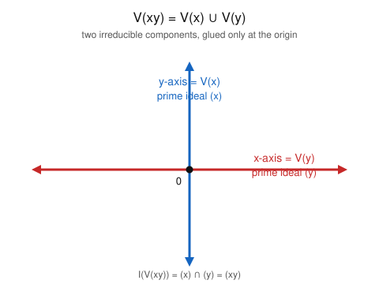

# Algebraic Geometry · Lesson 1.4: The Zariski topology & irreducibility

> ⏱ ~15 min · Module 1: Affine varieties & the Nullstellensatz · Builds on: [1.3 Noetherian rings & the Hilbert Basis Theorem](01-03-noetherian-hilbert-basis.md) · Unlocks: [1.5 Hilbert's Nullstellensatz](01-05-nullstellensatz.md)

## Why this matters

Every geometric word you will use for the rest of this course — *closure*, *dense*, *dimension*, *component*, *continuous map* — is a topological word, so a variety needs a **topology**. The one we build here, the **Zariski topology**, is defined purely from the algebra: its closed sets are the subvarieties themselves. It is a genuine topology, but a strange one — coarse, non-Hausdorff — so your metric-space reflexes must be recalibrated. The payoff is a new organizing idea, **irreducibility**, that replaces "connected" with something far stronger and matches, exactly, *primeness* of the ideal. That match is the single most-used entry in the algebra–geometry dictionary.

## The idea

We already have, from [Lesson 1.1](01-01-affine-dictionary.md), a supply of "solution sets" $V(J)\subseteq\mathbb{A}^n$: the points where a family of polynomials all vanish. The cheapest way to topologize $\mathbb{A}^n$ is to simply **declare these to be the closed sets**. Remarkably, they satisfy the closed-set axioms of a topology on the nose, and the proof is one clean algebraic identity: a union of two vanishing sets is again a vanishing set, because $V(J)\cup V(J')=V(JJ')$.

This topology is *coarse* — it has very few closed sets. On the line $\mathbb{A}^1$ the only closed sets are the finite point-sets and the whole line: there simply aren't enough polynomials in one variable to cut out anything else. Coarseness makes the topology non-Hausdorff (you cannot wrap disjoint open bubbles around two points) but *quasi-compact* (every open cover has a finite subcover), the reverse of the metric world's instincts.

The real prize is **irreducibility**. Call a space irreducible if you cannot break it into two proper closed pieces. This is much stronger than connected: the two coordinate axes joined at the origin form a connected set, yet it obviously splits into "the $x$-axis" and "the $y$-axis." Those pieces are its **irreducible components**. And here is the dictionary entry: a variety is irreducible exactly when its ideal is **prime**. Because the polynomial ring is Noetherian (Lesson 1.3), every variety is a *finite, unique* union of such irreducible pieces — its atoms.

## The formal version

Fix an algebraically closed field $k=\bar k$ and write $R=k[x_1,\dots,x_n]$. For an ideal $J\subseteq R$, $V(J)=\{p\in\mathbb{A}^n : f(p)=0 \text{ for all } f\in J\}$.

**Theorem (the Zariski topology).** The collection $\{V(J) : J\subseteq R \text{ an ideal}\}$ is the set of closed sets of a topology on $\mathbb{A}^n$.

*In words:* declaring "closed = cut out by polynomial equations" really does define a topology.

*Proof.* Three axioms.

- **Whole space and empty set.** $\mathbb{A}^n=V(0)$ and $\emptyset=V(R)=V(1)$.
- **Arbitrary intersections.** For any family of ideals $\{J_\alpha\}$,
$$\bigcap_\alpha V(J_\alpha)=V\!\Big(\textstyle\sum_\alpha J_\alpha\Big).$$
A point $p$ lies in the left side iff every $f\in J_\alpha$ vanishes at $p$ for every $\alpha$; since each element of $\sum_\alpha J_\alpha$ is a *finite* sum of such $f$'s, this holds iff every element of $\sum_\alpha J_\alpha$ vanishes at $p$ — the right side.
- **Finite unions.** It suffices to handle two, and the key identity is
$$V(J)\cup V(J')=V(JJ'),\qquad JJ'=\Big(\{fg : f\in J,\ g\in J'\}\Big).$$
($\subseteq$) If $p\in V(J)$ then $f(p)=0$ for all $f\in J$, so $(fg)(p)=f(p)g(p)=0$ for every generator $fg$ of $JJ'$; hence $p\in V(JJ')$. Same if $p\in V(J')$.
($\supseteq$) Suppose $p\notin V(J)\cup V(J')$. Then some $f\in J$ has $f(p)\ne 0$ and some $g\in J'$ has $g(p)\ne 0$, so the element $fg\in JJ'$ has $(fg)(p)\ne 0$, giving $p\notin V(JJ')$. Contrapositive. $\blacksquare$

(Also $V(J)\cup V(J')=V(J\cap J')$, since $JJ'\subseteq J\cap J'\subseteq J,J'$ squeezes the vanishing sets together.) Notice the order-reversal in play: the **union** of geometry corresponds to a **product/intersection** of ideals, while the **intersection** of geometry corresponds to the **sum** — bigger shape, smaller ideal.

**Coarseness on the line.** In $\mathbb{A}^1$, $R=k[x]$ is a PID, so every ideal is $(f)$ and every closed set is $V(f)$. If $f=0$, $V(f)=\mathbb{A}^1$; if $f\ne 0$, its zero set is finite (at most $\deg f$ roots). So the proper closed sets of $\mathbb{A}^1$ are *exactly the finite sets* — the Zariski topology on the line is the **cofinite topology**. In particular any two nonempty open sets (cofinite sets) meet, so it is **not Hausdorff**.

**Definition (irreducible).** A nonempty topological space $X$ is **irreducible** if it is not the union $X=Z_1\cup Z_2$ of two proper closed subsets $Z_1,Z_2\subsetneq X$. Equivalently: every two nonempty open subsets intersect; equivalently, every nonempty open subset is dense.

*In words:* an irreducible space cannot be cut into two smaller closed slabs — it has no "seams."

**Theorem (irreducible ⇔ prime).** A nonempty closed set $X\subseteq\mathbb{A}^n$ is irreducible iff its ideal $I(X)$ is a prime ideal of $R$.

*In words:* the shape has no seams exactly when its ideal has no zero-divisors modulo it.

*Proof.* We use two facts from Module 1: $I$ is *inclusion-reversing*, and $V(I(X))=X$ for closed $X$, so $I$ is injective on closed sets — a proper inclusion $Z\subsetneq X$ of closed sets forces the strict reversed inclusion $I(X)\subsetneq I(Z)$.

($\Leftarrow$) Let $I(X)=\mathfrak p$ be prime and suppose $X=Z_1\cup Z_2$ with each $Z_i\subsetneq X$ closed. Pick $f_i\in I(Z_i)\setminus I(X)$ (possible by strictness). Then $f_1f_2$ vanishes on $Z_1\cup Z_2=X$, so $f_1f_2\in\mathfrak p$, yet neither $f_i\in\mathfrak p$ — contradicting primeness. So no such splitting exists: $X$ is irreducible.

($\Rightarrow$) Let $X$ be irreducible. Since $X\ne\emptyset$, $1\notin I(X)$, so $I(X)$ is proper. Take $fg\in I(X)$. Then $X\subseteq V(fg)=V(f)\cup V(g)$, so
$$X=\big(X\cap V(f)\big)\cup\big(X\cap V(g)\big),$$
a union of two closed subsets. Irreducibility forces $X=X\cap V(f)$ (say), i.e. $X\subseteq V(f)$, i.e. $f\in I(X)$. Hence $I(X)$ is prime. $\blacksquare$

**Definition (Noetherian space).** $X$ is a **Noetherian topological space** if every descending chain of closed subsets $Y_1\supseteq Y_2\supseteq\cdots$ stabilizes.

$\mathbb{A}^n$ **is Noetherian:** a descending chain of closed sets gives an *ascending* chain of ideals $I(Y_1)\subseteq I(Y_2)\subseteq\cdots$, which stabilizes by the ascending chain condition (Lesson 1.3, via the Hilbert Basis Theorem); applying $V$ and using $V(I(Y_i))=Y_i$ shows the $Y_i$ stabilize.

**Theorem (irreducible decomposition).** In a Noetherian space, every nonempty closed set $X$ is a finite union
$$X=X_1\cup X_2\cup\cdots\cup X_r$$
of irreducible closed sets. If we drop any $X_i$ contained in another (an **irredundant** decomposition), the $X_i$ are unique up to order; they are the **irreducible components** of $X$ (its maximal irreducible closed subsets).

*In words:* every variety is a finite pile of irreducible atoms, and — once you throw out redundancy — that pile is unique.

*Proof.* **Existence** (Noetherian induction). Let $\Sigma$ be the set of nonempty closed sets that are *not* finite unions of irreducibles. If $\Sigma\ne\emptyset$, Noetherianness gives a **minimal** element $Y\in\Sigma$ (a descending chain cannot descend forever). $Y$ is not irreducible — else $Y=Y$ is its own decomposition — so $Y=Y_1\cup Y_2$ with $Y_i\subsetneq Y$ closed. By minimality $Y_1,Y_2\notin\Sigma$, so each is a finite union of irreducibles; then so is $Y$, contradiction. Hence $\Sigma=\emptyset$. Now discard any $X_i\subseteq X_j$ to make it irredundant.

**Uniqueness.** Say $X=\bigcup_i X_i=\bigcup_j Y_j$, both irredundant. Fix $X_i$. Then $X_i=\bigcup_j (X_i\cap Y_j)$ is a finite union of closed subsets of the irreducible $X_i$, so $X_i\subseteq Y_j$ for some $j$. Symmetrically $Y_j\subseteq X_{i'}$ for some $i'$, whence $X_i\subseteq X_{i'}$; irredundancy forces $i=i'$, so $X_i=Y_j$. This pairs the two lists bijectively. $\blacksquare$

## Picture

$V(xy)$ is the classic reducible variety: $xy=0$ means $x=0$ **or** $y=0$, so it is the union of the two coordinate axes. Each axis is irreducible with a prime ideal; the whole thing is their union, and the ideal $(xy)=(x)\cap(y)$ is *not* prime.

## Worked examples

**Example 1 (mechanical — the closed sets of $\mathbb{A}^1$).** Claim: a subset $C\subseteq\mathbb{A}^1$ is Zariski-closed iff $C$ is finite or $C=\mathbb{A}^1$.

Every closed set is $V(J)$ for an ideal $J\subseteq k[x]$. Because $k[x]$ is a PID, $J=(f)$ for a single $f$, and $V(J)=V(f)=\{a\in k : f(a)=0\}$. If $f=0$ this is all of $\mathbb{A}^1$; if $f\ne 0$ it is the root set of a nonzero one-variable polynomial, which has at most $\deg f$ elements — finite. Conversely every finite set $\{a_1,\dots,a_m\}$ is closed, being $V\big((x-a_1)\cdots(x-a_m)\big)$, and $\mathbb{A}^1=V(0)$. So the closed sets are precisely the finite sets together with the whole line. (This also shows $\mathbb{A}^1$ is irreducible: its only proper closed sets are finite, and a finite union of finite sets can never be all of an *infinite* line $k=\bar k$.)

**Example 2 (why you'd care — decomposing $V(xy)$).** Work in $\mathbb{A}^2$, $R=k[x,y]$, and let $X=V(xy)$.

*Geometry.* A point $(a,b)$ satisfies $ab=0$ iff $a=0$ or $b=0$, so
$$X=V(x)\cup V(y)=\{\text{the } y\text{-axis}\}\cup\{\text{the } x\text{-axis}\}.$$

*The pieces are irreducible.* The ideal $(x)$ is prime, because $R/(x)\cong k[y]$ is an integral domain; likewise $(y)$ is prime with $R/(y)\cong k[x]$. By the irreducible ⇔ prime theorem, $V(x)$ and $V(y)$ are each irreducible. Neither contains the other, so both are **irreducible components** of $X$.

*Matching the algebra.* Using $I(A\cup B)=I(A)\cap I(B)$ and $I(V(\mathfrak p))=\mathfrak p$ for a prime $\mathfrak p$,
$$I(X)=I\big(V(x)\cup V(y)\big)=I(V(x))\cap I(V(y))=(x)\cap(y)=(xy).$$
So $I(V(xy))=(xy)$ — the ideal of the whole variety is exactly the **intersection of the component primes**, the geometric decomposition read off in algebra. And $(xy)$ is *not* prime ($x\cdot y\in(xy)$ but $x,y\notin(xy)$), confirming that $X$ itself is reducible.

## Watch out

- **Zariski is not Hausdorff — abandon metric reflexes.** You cannot separate two points by disjoint opens; nonempty opens are enormous (cofinite on a curve) and always overlap. Limits need not be unique, and "closed = contains its limit points" is not a useful picture here. Closed means *cut out by equations*, nothing more.
- **Irreducible is much stronger than connected.** $V(xy)$ is connected — the axes touch at the origin, so you cannot separate it into two disjoint nonempty *open* sets — yet it is reducible. Connected forbids a *disjoint* clopen split; irreducible forbids *any* proper closed cover, disjoint or not.
- **Union ↔ product, intersection ↔ sum — don't swap them.** The union $V(J)\cup V(J')$ is $V(JJ')$ (or $V(J\cap J')$), *not* $V(J+J')$; the sum $J+J'$ gives the *intersection* $V(J)\cap V(J')$. Bigger geometry ⟷ smaller ideal, always.
- **"Quasi-compact," not "compact."** Every subset of $\mathbb{A}^n$ is quasi-compact (finite subcovers exist), but geometers say *quasi*-compact to flag that the space is not Hausdorff — the extra separation that "compact" usually implies is absent.

## One-liner

> Closed sets are the subvarieties; irreducible = ideal prime; and every variety is a unique finite pile of prime-ideal atoms.

## Problems

**P1 (🟢)** In $\mathbb{A}^2$, decompose $X=V(x^2-y^2)$ into its irreducible components and give the prime ideal of each. Is $I(X)$ prime?

**P2 (🟡)** Prove that $\mathbb{A}^n$ is irreducible, directly from the definition, and identify $I(\mathbb{A}^n)$ — confirming the irreducible ⇔ prime theorem. (Hint: what kind of ring is $k[x_1,\dots,x_n]$?)

**P3 (🔴, optional)** In $\mathbb{A}^3$, let $X=V(xz,\,yz)$. Find the irreducible components of $X$, prove each is irreducible, and show that $I(X)$ equals the intersection of the component primes.

Solutions

**P1** Factor: $x^2-y^2=(x-y)(x+y)$, so $V(x^2-y^2)=V(x-y)\cup V(x+y)$ — the two diagonal lines $y=x$ and $y=-x$. The ideal $(x-y)$ is prime since $k[x,y]/(x-y)\cong k[x]$ (send $y\mapsto x$) is a domain; likewise $(x+y)$ is prime with quotient $\cong k[x]$. So both lines are irreducible, and since neither contains the other they are the two irreducible components. Finally $I(X)=(x-y)\cap(x+y)=(x^2-y^2)$, which is **not** prime — $(x-y)(x+y)\in I(X)$ but neither factor is — matching the fact that $X$ is reducible. $\blacksquare$

**P2** $\mathbb{A}^n$ is nonempty. Suppose $\mathbb{A}^n=Z_1\cup Z_2$ with $Z_i=V(J_i)$ proper closed subsets. Because $Z_i\ne\mathbb{A}^n$, there is a nonzero polynomial $f_i\in J_i$ (if $J_i\subseteq\{0\}$ then $Z_i=\mathbb{A}^n$). Then $f_1f_2$ vanishes on $Z_1\cup Z_2=\mathbb{A}^n$, i.e. $f_1f_2$ is the zero function. Over $k=\bar k$ (infinite), a polynomial vanishing at every point is the zero polynomial, so $f_1f_2=0$ in $R=k[x_1,\dots,x_n]$. But $R$ is an integral domain, forcing $f_1=0$ or $f_2=0$ — contradicting $f_i\ne 0$. Hence $\mathbb{A}^n$ has no proper closed cover: it is irreducible. Consistently, $I(\mathbb{A}^n)=(0)$ (only the zero polynomial vanishes everywhere), and $(0)$ is prime precisely because $R$ is a domain — exactly the irreducible ⇔ prime theorem in the top-dimensional case. $\blacksquare$

**P3** Solve $xz=0$ and $yz=0$. If $z=0$, both hold for every $x,y$: the plane $V(z)$. If $z\ne 0$, then $x=0$ and $y=0$: the line $V(x,y)$ (the $z$-axis). So
$$X=V(z)\cup V(x,y).$$
Each is irreducible: $(z)$ is prime because $k[x,y,z]/(z)\cong k[x,y]$ is a domain, and $(x,y)$ is prime because $k[x,y,z]/(x,y)\cong k[z]$ is a domain. Neither contains the other ($V(z)$ is $2$-dimensional, the $z$-axis $1$-dimensional and not inside the plane $z=0$), so both are irreducible components. For the ideal,
$$I(X)=I\big(V(z)\cup V(x,y)\big)=I(V(z))\cap I(V(x,y))=(z)\cap(x,y),$$
the intersection of the two component primes. (Concretely $(z)\cap(x,y)=(xz,\,yz)$: any $h$ in the intersection is a multiple of $z$ lying in $(x,y)$, hence of the form $z(\text{poly in }x,y\text{-ideal})\in(xz,yz)$; the reverse inclusion is clear.) $\blacksquare$

## Flashback

**From Lesson 1.3 (Noetherian rings & the Hilbert Basis Theorem):** Let $S\subseteq k[x_1,\dots,x_n]$ be an **arbitrary, possibly infinite** set of polynomials. Prove that there exist finitely many $f_1,\dots,f_r\in S$ with $V(S)=V(f_1,\dots,f_r)$ — so every variety, however it is presented, is cut out by finitely many equations. (This is the fact that makes "finite unions of closed sets" in this lesson honest.)

Solution

Let $J=(S)$ be the ideal generated by $S$; note $V(S)=V(J)$, since a point kills every element of $S$ iff it kills every $R$-linear combination of them. By the Hilbert Basis Theorem, $R=k[x_1,\dots,x_n]$ is Noetherian, so the ideal $J$ is finitely generated: $J=(g_1,\dots,g_m)$ for some $g_i$. Each $g_i\in J=(S)$ is a finite combination $g_i=\sum_j a_{ij}s_{ij}$ of elements $s_{ij}\in S$; collect all the finitely many $s_{ij}$ appearing (over all $i,j$) into a finite list $f_1,\dots,f_r\in S$. Then every $g_i$ lies in $(f_1,\dots,f_r)$, so $J\subseteq(f_1,\dots,f_r)\subseteq J$, giving $J=(f_1,\dots,f_r)$. Therefore
$$V(S)=V(J)=V(f_1,\dots,f_r).\qquad\blacksquare$$

The engine is exactly the ascending chain condition from Lesson 1.3: finite generation of *every* ideal is what forces "infinitely many equations" to collapse to finitely many. $\blacksquare$

## Connections

- **Backward:** This rests on the Noetherian machinery of [Lesson 1.3](01-03-noetherian-hilbert-basis.md) — the ascending chain condition becomes descending chains of closed sets, which is what makes the finite irreducible decomposition possible — and on the inclusion-reversing $V$–$I$ pairing of [Lessons 1.1–1.2](01-01-affine-dictionary.md).
- **Forward:** [Lesson 1.5](01-05-nullstellensatz.md) upgrades "$I(X)$ prime ⇔ irreducible" into the full Nullstellensatz bijection {radical ideals} ↔ {varieties}, under which irreducible varieties correspond to *prime* ideals and points to *maximal* ideals. [Lesson 1.6](01-06-coordinate-ring-polynomial-maps.md) records irreducibility as: the coordinate ring $k[X]=R/I(X)$ is an integral domain.
- **Sideways (topology):** This is a real topology in the sense of [topology](../../topology/syllabus.md) — same open/closed/closure/quasi-compactness axioms — but deliberately non-Hausdorff, the sharpest contrast with the metric topology you know. "Irreducible" is a purely topological notion that is invisible in Hausdorff spaces (there, only single points are irreducible), so it is genuinely a gift from the algebra.
- **Sideways (abstract algebra):** "Irreducible ⇔ prime" is the geometric face of primeness from [abstract-algebra](../../abstract-algebra/syllabus.md); the unique irreducible decomposition is the topological shadow of the primary decomposition of ideals in a Noetherian ring.
