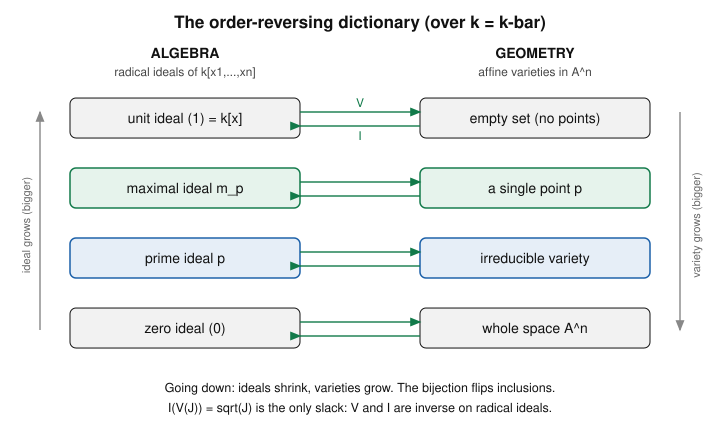

# Algebraic Geometry · Lesson 1.5: Hilbert's Nullstellensatz

> ⏱ ~15 min · Module 1: Affine varieties & the Nullstellensatz · Builds on: [Lesson 1.2](01-02-ideals-radicals.md) (radicals), [Lesson 1.4](01-04-zariski-topology-irreducibility.md) (irreducible ⇔ prime) · Unlocks: [Lesson 1.6](01-06-coordinate-ring-polynomial-maps.md) (the coordinate ring)

## Why this matters

Everything in Module 1 has been building one dictionary: polynomials $\rightsquigarrow$ shapes ($V$) and shapes $\rightsquigarrow$ polynomials ($I$). Lesson 1.2 found the leak — $I(V(J))$ comes back bigger than $J$, equal to the radical $\sqrt J$ — but couldn't yet prove the leak is *all* there is. Hilbert's Nullstellensatz ("zero-locus theorem") plugs it: over an algebraically closed field the dictionary is a perfect, order-reversing bijection between radical ideals and varieties, with maximal ideals sitting exactly over points. This is the theorem that lets you *compute* geometry — decide whether two ideals cut out the same shape, whether a polynomial vanishes on a variety — by pure algebra. Every later structure (coordinate rings, $\operatorname{Spec}$, schemes) is a renovation of this one bridge.

## The idea

Two everyday questions, both answered by the same theorem:

1. **"Which points are the atoms of algebra?"** A point $p=(a_1,\dots,a_n)$ knows exactly which polynomials vanish on it — the ones in $\mathfrak{m}_p=(x_1-a_1,\dots,x_n-a_n)$, a maximal ideal. Could there be *exotic* maximal ideals not coming from any point? Over $\bar k$, no: **points are the maximal ideals, full stop.** That's the **weak** Nullstellensatz. A repackaging: if your equations are *consistent* as algebra (the ideal they generate isn't all of $k[x]$), they have an *actual common solution* — the system $g_1=\dots=g_r=0$ can't secretly be unsolvable the way $x^2+1=0$ is over $\mathbb{R}$.

2. **"When does an equation follow from a system?"** If $f$ vanishes everywhere $g_1,\dots,g_r$ do, must $f$ be an algebraic consequence of them? Not quite $f\in J$ — but $f^m\in J$ for some power $m$. That's the **strong** Nullstellensatz: $I(V(J))=\sqrt J$, the exact statement Lesson 1.2 could only guess at.

The one non-negotiable hypothesis: $k$ must be **algebraically closed**. Over $\mathbb{R}$ both statements fail, for the same reason $x^2+1$ has no real root. Algebraic closure is what guarantees "the shape is never emptier than the algebra thinks."

## The formal version

Throughout, $k=\bar k$ is algebraically closed, $R=k[x_1,\dots,x_n]$, and $\mathbb{A}^n$ is affine $n$-space. Recall $\mathfrak{m}_p=(x_1-a_1,\dots,x_n-a_n)$ for a point $p=(a_1,\dots,a_n)$.

**Weak Nullstellensatz.** Every maximal ideal of $R$ has the form $\mathfrak{m}_p$ for a unique point $p\in\mathbb{A}^n$. Equivalently: if $J\subsetneq R$ is a proper ideal, then $V(J)\neq\varnothing$.

*In words:* over $\bar k$ the only maximal ideals are the "vanish at a point" ideals, so **points $\leftrightarrow$ maximal ideals**; and any consistent-looking system of polynomial equations actually has a common zero.

Why is $\mathfrak{m}_p$ maximal in the first place? It is the kernel of evaluation $\operatorname{ev}_p:R\to k,\ f\mapsto f(p)$, a surjective ring map onto the field $k$, so $R/\mathfrak{m}_p\cong k$ is a field, forcing $\mathfrak{m}_p$ maximal. The *content* of the weak form is the converse — that there are no others.

*The two versions are equivalent.* Given a proper $J$, it lies in some maximal ideal $\mathfrak{m}$ (every proper ideal of a ring with $1$ does; here $R$ is even Noetherian by [Lesson 1.3](01-03-noetherian-hilbert-basis.md)). Writing $\mathfrak{m}=\mathfrak{m}_p$, every $f\in J\subseteq\mathfrak{m}_p$ vanishes at $p$, so $p\in V(J)$ and $V(J)\neq\varnothing$. Conversely, if $\mathfrak{m}$ is maximal it is proper, so $V(\mathfrak{m})\neq\varnothing$; pick $p\in V(\mathfrak{m})$. Then every element of $\mathfrak{m}$ vanishes at $p$, i.e. $\mathfrak{m}\subseteq\mathfrak{m}_p$; since $\mathfrak{m}$ is maximal and $\mathfrak{m}_p\neq R$, equality holds.

**Strong Nullstellensatz.** For every ideal $J\subseteq R$,
$$I(V(J))=\sqrt{J}=\{f\in R : f^m\in J \text{ for some } m\ge 1\}.$$

*In words:* a polynomial vanishes on the whole zero-set of $J$ **iff** some power of it lies in $J$. The radical is the *entire* discrepancy between $J$ and $I(V(J))$ — nothing else leaks.

*Proof of the easy half* ($\sqrt J\subseteq I(V(J))$, valid over any field). If $f\in\sqrt J$ then $f^m\in J$, so $f^m$ vanishes on $V(J)$; at any $p\in V(J)$, $f(p)^m=0$ in the field $k$, and a field has no nilpotents, so $f(p)=0$. Thus $f\in I(V(J))$.

*The hard half via the Rabinowitsch trick (sketch).* Let $f\in I(V(J))$ with $J=(g_1,\dots,g_r)$. Add a fresh variable $y$ and form, in $k[x_1,\dots,x_n,y]$,
$$J'=(g_1,\dots,g_r,\;1-yf).$$
Its zero-set in $\mathbb{A}^{n+1}$ is empty: at any common zero of the $g_i$ the point projects into $V(J)$, where $f=0$, making $1-yf=1\neq 0$. By the **weak** form, empty zero-set forces $J'=(1)$, so
$$1=\sum_{i} h_i(x,y)\,g_i(x)+h_0(x,y)\,(1-yf).$$
Now set $y=1/f$ (work in the fraction field $k(x_1,\dots,x_n)$): the last term dies and $1=\sum h_i(x,1/f)\,g_i$. Clearing denominators by multiplying through by a high power $f^N$ turns each $h_i(x,1/f)$ into a genuine polynomial, giving $f^N=\sum(\text{poly})\,g_i\in J$. Hence $f\in\sqrt J$. $\blacksquare$

**The bijection (the payoff).** Combine strong Nullstellensatz ($I(V(J))=\sqrt J$, so $I(V(\cdot))$ is the identity on *radical* ideals) with $V(I(X))=X$ for varieties $X$ (from Lessons 1.1–1.2) and the fact that $I(X)$ is always radical. The maps $V$ and $I$ become mutually inverse, inclusion-reversing bijections
$$\{\text{radical ideals of } k[x_1,\dots,x_n]\}\;\underset{I}{\overset{V}{\longleftrightarrow}}\;\{\text{affine varieties in } \mathbb{A}^n\},$$
restricting to
$$\{\text{prime ideals}\}\leftrightarrow\{\text{irreducible varieties}\},\qquad \{\text{maximal ideals}\}\leftrightarrow\{\text{points}\}.$$

*In words:* radical ideals and varieties are the *same information* written two ways; primeness reads off as irreducibility, maximality as being a single point, and bigger always swaps to smaller.

## Picture

Read each row as a matched pair related by $V$ (left to right) and $I$ (right to left). The whole ladder flips: the *largest* proper ideals (maximal) sit over the *smallest* nonempty varieties (points), and the *smallest* ideal $(0)$ sits over all of $\mathbb{A}^n$. The two green–blue rows are the restrictions maximal $\leftrightarrow$ point and prime $\leftrightarrow$ irreducible.

## Worked examples

**Example 1 (weak form: a maximal ideal *is* a point).** In $R=\mathbb{C}[x,y]$ take $\mathfrak{m}=(x-2,\,y+1)$. Sending $x\mapsto 2$, $y\mapsto -1$ realizes $R/\mathfrak{m}\cong\mathbb{C}$ (evaluation at $p=(2,-1)$ is surjective onto $\mathbb{C}$ with kernel exactly $\mathfrak m$), a field — so $\mathfrak{m}$ is maximal and corresponds to the point $p=(2,-1)$. The weak Nullstellensatz promises this is *typical*: over $\mathbb{C}$ there are **no** maximal ideals of $\mathbb{C}[x,y]$ except these point-ideals.

Contrast $\mathfrak{a}=\big((x-2)^2,\,y+1\big)$. Its zero-set is still the single point $(2,-1)$, but $\mathfrak{a}$ is **not** maximal — it isn't even radical, since $(x-2)^2\in\mathfrak a$ while $x-2\notin\mathfrak a$. Here $\sqrt{\mathfrak a}=(x-2,y+1)=\mathfrak m$: the radical is exactly what turns the fat, non-radical ideal into the honest maximal ideal of the point. Only radical ideals appear in the bijection.

**Example 2 (strong form: is $x\in I(V((x^2)))$?).** Work in $k[x]$ with $J=(x^2)$. Geometrically $V(J)=\{a\in\mathbb{A}^1 : a^2=0\}=\{0\}$, the single point $0$ (multiplicity is invisible to the *set* of solutions). So
$$I(V(J))=I(\{0\})=\{\text{polynomials vanishing at }0\}=(x).$$
Since $x(0)=0$, indeed $x\in I(V(J))$ — **yes** — even though $x\notin J=(x^2)$. The strong Nullstellensatz says this had to happen: $I(V(J))=\sqrt{(x^2)}$, and $x^2\in(x^2)$ certifies $x\in\sqrt{(x^2)}$, giving $\sqrt{(x^2)}=(x)$. The gap $x\in I(V(J))\setminus J$ is precisely the radical closing — the exact phenomenon Lesson 1.2 flagged, now nailed down.

## Watch out

- You might think $I(V(J))=J$ always — but only when $J$ is **radical**. For $J=(x^2)$, $I(V(J))=(x)\supsetneq(x^2)$. The bijection is with radical ideals, not all ideals.
- You might think the weak form ("proper $\Rightarrow$ has a zero") holds over any field — it needs $\bar k$. Over $\mathbb{R}$, $(x^2+1)\subsetneq\mathbb{R}[x]$ is proper — in fact maximal, since $\mathbb{R}[x]/(x^2+1)\cong\mathbb{C}$ is a field — yet $V(x^2+1)=\varnothing$, and $(x^2+1)$ is a maximal ideal that is *not* of the form $(x-a)$. This is literally the reason the Fundamental Theorem of Algebra insists on $\mathbb{C}$.
- You might think "point = maximal, so every prime is a point." Not so: the zero ideal $(0)$ is **prime** (because $k[x_1,\dots,x_n]$ is a domain) and corresponds to the *whole* space $\mathbb{A}^n$ — irreducible, but hardly a point. Maximal is the special case of prime that lands on a single point.
- Do not read multiplicity into $V$. $V(x^2)$ and $V(x)$ are the *same set* $\{0\}$; the ideals differ, but as *radical* ideals they collapse to the same $(x)$. Varieties see zero-*sets*, not zero-*schemes* (that distinction returns in Module 4).

## One-liner

> Over $\bar k$, taking zero-sets and taking vanishing-ideals are inverse dictionaries between radical ideals and varieties — points are the maximal ideals, and the radical $\sqrt J$ is the one and only slack.

## Problems

**P1 (🟢)** In $\mathbb{C}[x,y]$ let $J=(x^2y,\;y^3)$. (a) Find $V(J)\subseteq\mathbb{A}^2$. (b) Use the strong Nullstellensatz to compute $I(V(J))=\sqrt J$. (c) Decide whether $xy\in I(V(J))$ and whether $x\in I(V(J))$.

**P2 (🟡)** (a) Prove the easy inclusion $\sqrt J\subseteq I(V(J))$ from the definitions, for an ideal $J$ over *any* field. (b) Exhibit an ideal $J\subseteq\mathbb{R}[x]$ for which the reverse inclusion $I(V(J))\subseteq\sqrt J$ **fails**, and identify explicitly which element witnesses the failure. (This is why the strong form needs $\bar k$.)

**P3 (🔴, optional)** *(Certificate of inconsistency.)* Let $k=\bar k$ and $g_1,\dots,g_r\in k[x_1,\dots,x_n]$. Prove: the system $g_1=\dots=g_r=0$ has **no** common solution in $\mathbb{A}^n$ **iff** there exist polynomials $h_1,\dots,h_r$ with $\sum_i h_i g_i=1$. (The forward direction is the engine behind the Rabinowitsch trick.)

Solutions

**P1** (a) A point $(a,b)$ lies in $V(J)$ iff $a^2 b=0$ and $b^3=0$. The second forces $b=0$; then $a^2b=0$ automatically, with $a$ free. So $V(J)=\{(a,0):a\in\mathbb{C}\}$ — the **$x$-axis**, $V(y)$.

(b) By the strong Nullstellensatz $I(V(J))=\sqrt J$, and $I(x\text{-axis})=I(V(y))=(y)$ (a polynomial vanishes identically on the $x$-axis iff it is divisible by $y$). Check directly that $\sqrt J=(y)$: from $y^3\in J$ we get $y\in\sqrt J$, so $(y)\subseteq\sqrt J$; and $\sqrt J\subseteq I(V(J))=(y)$ by part (a). Hence $\sqrt J=(y)$.

(c) $xy\in(y)$? Yes ($xy=x\cdot y$), so $xy\in I(V(J))$ — consistent with $xy$ vanishing on the whole $x$-axis. $x\in(y)$? No: $x$ does not vanish at $(1,0)\in V(J)$, so $x\notin I(V(J))$. (Equivalently, $x$ has no power in $J$.)

**P2** (a) Let $f\in\sqrt J$, so $f^m\in J$ for some $m\ge 1$. Take any $p\in V(J)$: every element of $J$ vanishes at $p$, so $f(p)^m=(f^m)(p)=0$. Since $k$ is a field (no nonzero nilpotents), $f(p)^m=0\Rightarrow f(p)=0$. As $p\in V(J)$ was arbitrary, $f$ vanishes on all of $V(J)$, i.e. $f\in I(V(J))$. Thus $\sqrt J\subseteq I(V(J))$ over any field. $\blacksquare$

(b) Take $J=(x^2+1)\subseteq\mathbb{R}[x]$. Then $V(J)=\varnothing$ (no real root), so $I(V(J))=I(\varnothing)=\mathbb{R}[x]=(1)$. But $x^2+1$ is irreducible over $\mathbb{R}$, and $(x^2+1)$ is already prime, hence radical, so $\sqrt J=(x^2+1)\neq(1)$. The witness is the constant $1$: $1\in I(V(J))$ (it vanishes vacuously on the empty set) but $1\notin\sqrt J$ (no power of $1$ lies in the proper ideal $(x^2+1)$). So $I(V(J))\not\subseteq\sqrt J$. Over $\mathbb{C}$ this can't happen: there $V(x^2+1)=\{\pm i\}\neq\varnothing$.

**P3** ($\Leftarrow$, any field) If $\sum_i h_i g_i=1$, then at any common zero $p$ of the $g_i$ the left side evaluates to $\sum h_i(p)\cdot 0=0$ while the right side is $1$ — contradiction. So no common zero exists.

($\Rightarrow$, needs $\bar k$) Suppose the $g_i$ have no common zero, i.e. $V(J)=\varnothing$ for $J=(g_1,\dots,g_r)$. By the weak Nullstellensatz (contrapositive of "proper $\Rightarrow$ nonempty zero-set"), $V(J)=\varnothing$ forces $J$ to be non-proper: $J=(1)=k[x_1,\dots,x_n]$. Then $1\in J$ means $1=\sum_i h_i g_i$ for some $h_i\in k[x_1,\dots,x_n]$. $\blacksquare$

This is a polynomial analogue of Bézout's identity — and exactly the "add $1-yf$, get a unit" move that powers Rabinowitsch.

## Flashback

**From [Lesson 1.4](01-04-zariski-topology-irreducibility.md) (Zariski topology / irreducible ⇔ prime / components):** In $\mathbb{A}^2$ over $k=\bar k$, let $X=V(xy)$. (a) Show $X$ is the union of the two coordinate axes. (b) Show $X$ is reducible and give its decomposition into irreducible components. (c) Using the dictionary, verify $(xy)$ is radical but **not** prime, and name the prime ideals of the components.

Solution

(a) $(a,b)\in X\iff ab=0\iff a=0$ or $b=0$, so $X=V(x)\cup V(y)$ — the $y$-axis together with the $x$-axis.

(b) Each axis is irreducible: $k[x,y]/(x)\cong k[y]$ and $k[x,y]/(y)\cong k[x]$ are domains, so $(x)$ and $(y)$ are prime, hence $V(x),V(y)$ are irreducible (irreducible ⇔ prime, Lesson 1.4). Neither axis contains the other, so $X=V(x)\cup V(y)$ is the irreducible-component decomposition, and $X$ is **reducible** (two components).

(c) *Radical:* by the strong Nullstellensatz and "$I$ of a union $=$ intersection of $I$'s,"
$$I(V(xy))=I(V(x)\cup V(y))=I(V(x))\cap I(V(y))=(x)\cap(y)=(xy),$$
where $(x)\cap(y)=(xy)$ because in the UFD $k[x,y]$ a polynomial divisible by both $x$ and $y$ is divisible by $xy$. So $\sqrt{(xy)}=I(V(xy))=(xy)$: the ideal is radical. *Not prime:* $x\cdot y\in(xy)$ but neither $x\notin(xy)$ nor $y\notin(xy)$ lies in it — a product in the ideal with neither factor in it. The component primes are $(x)$ and $(y)$, matching the two axes. (Radical-but-not-prime is exactly the algebraic signature of a *reducible* variety.)

## Connections

- **Backward:** this closes the gap opened in [Lesson 1.2](01-02-ideals-radicals.md), where $I(V(J))=\sqrt J$ was asserted; the proof leans on radicals (1.2), on irreducible ⇔ prime ([Lesson 1.4](01-04-zariski-topology-irreducibility.md)), and on every proper ideal sitting inside a maximal one ([Lesson 1.3](01-03-noetherian-hilbert-basis.md)).
- **Forward:** [Lesson 1.6](01-06-coordinate-ring-polynomial-maps.md) builds the coordinate ring $k[X]=k[x]/I(X)$; because $I(X)$ is radical, $k[X]$ is *reduced*, and this lesson's "points $\leftrightarrow$ maximal ideals" becomes "points of $X\leftrightarrow$ maximal ideals of $k[X]$." Taking *all* primes as points (dropping the $\bar k$ crutch) is exactly $\operatorname{Spec}$ in [Lesson 4.1](04-01-spec-of-a-ring.md).
- **Sideways (`abstract-algebra`):** the whole proof is commutative algebra — maximal ideals, quotient *fields* $R/\mathfrak m\cong k$, and "proper ideal $\subseteq$ maximal ideal." The bijection is the geometric face of that machinery.
- **Sideways (`number-theory` / `complex-analysis`):** algebraic closure is load-bearing for the *same* reason the Fundamental Theorem of Algebra needs $\mathbb{C}$ — only over $\bar k$ does every consistent system actually have roots, so zero-sets never come up spuriously empty. Over $\mathbb{R}$ or $\mathbb{Q}$ the dictionary breaks ($x^2+1$), which is precisely where arithmetic geometry over number fields gets hard and interesting.
