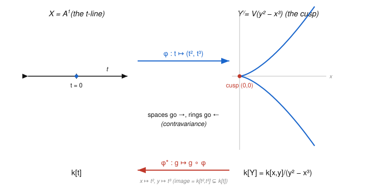

# Algebraic Geometry · Lesson 1.6: The coordinate ring & polynomial maps

> ⏱ ~15 min · Module 1: Affine varieties & the Nullstellensatz · Builds on: [Lesson 1.4](01-04-zariski-topology-irreducibility.md) (prime ↔ irreducible), [Lesson 1.5](01-05-nullstellensatz.md) (Nullstellensatz) · Unlocks: [Lesson 2.1](02-01-rational-functions-function-field.md) (the function field), and all of Module 2

## Why this matters

So far a variety $X$ has been a *set* — the common zeros of some polynomials. This lesson attaches to $X$ a *ring* $k[X]$, its functions, and shows that this single object remembers everything: the variety, its topology, its points, and — the real prize — every map into or out of it. Maps of varieties become ring homomorphisms running **backwards**, and the translation is so faithful that geometry and algebra turn out to be the *same subject read in two directions*. That dictionary, $X \leftrightarrow k[X]$, is the hinge the entire course turns on: replace "variety" by "$\operatorname{Spec}$ of a ring" (Module 4) and you have schemes. It is also your first honest encounter with a **contravariant functor** — the same functoriality that runs [algebraic-topology](../../algebraic-topology/syllabus.md).

## The idea

A polynomial $f \in k[x_1,\dots,x_n]$ eats a point of $X$ and spits out a number — it is a *function* on $X$. But two different polynomials can be the *same function on $X$*: if $f - g$ vanishes everywhere on $X$, they are indistinguishable there. "Vanishes on $X$" is exactly $f - g \in I(X)$. So the honest ring of polynomial functions on $X$ is the polynomial ring with that redundancy quotiented away — that is $k[X] = k[x_1,\dots,x_n]/I(X)$. Nothing exotic: it is grade-school "two formulas agreeing on the domain count as one function," made into a quotient ring.

Now the good part. A map $\phi\colon X \to Y$ given by polynomials lets you **transport functions the other way**: a function $g$ on $Y$ becomes the function $g \circ \phi$ on $X$ (do $\phi$ first, then measure). This *pullback* $\phi^*\colon k[Y] \to k[X]$ points from $Y$'s ring to $X$'s ring — opposite to $\phi$. The slogan: an arrow of spaces $X \to Y$ is the *same data* as an arrow of rings $k[Y] \to k[X]$. Points, being maps from a single dot, are the extreme case: a point of $X$ is exactly a way of evaluating functions, i.e. a $k$-algebra map $k[X] \to k$.

## The formal version

Fix $k = \bar k$ and an affine variety $X \subseteq \mathbb{A}^n$ (a Zariski-closed set, so $X = V(I(X))$).

**Definition (coordinate ring).** The **coordinate ring** of $X$ is
$$k[X] \;:=\; k[x_1,\dots,x_n]\big/ I(X).$$
Its elements are called **regular functions** on $X$. Write $\bar f$ for the class of $f$; it is the function $p \mapsto f(p)$ on $X$.

*In words:* $k[X]$ is polynomials-in-$n$-variables with "differ by something vanishing on $X$" declared to be equality — the genuine ring of polynomial functions $X \to k$.

Two polynomials give the same function on $X$ iff their difference lies in $I(X)$, so this quotient is exactly the ring of restrictions $f|_X$. Three structural facts, each straight from the definition:

- **Finitely generated.** $k[X]$ is generated as a $k$-algebra by the **coordinate functions** $\bar x_1,\dots,\bar x_n$ (the restrictions of the coordinates). So $k[X]$ is a *finitely-generated $k$-algebra*.
- **Reduced** (no nonzero nilpotents). $I(X)$ is a radical ideal — $I$ of any set always equals its own radical. So if $\bar f^{\,m} = 0$, then $f^m \in I(X)$, hence $f \in \sqrt{I(X)} = I(X)$, i.e. $\bar f = 0$.
- **Domain $\iff$ irreducible.** By [Lesson 1.4](01-04-zariski-topology-irreducibility.md), $X$ is irreducible iff $I(X)$ is prime, i.e. iff $k[X]$ is an integral domain.

*In words:* coordinate rings are precisely the **finitely-generated reduced $k$-algebras**, and the irreducible varieties are the ones whose ring is a domain. (These use $k = \bar k$ through the Nullstellensatz, which guarantees $I(X)$ is a genuine radical ideal and that every such algebra arises this way — see below.)

**Definition (polynomial map).** Let $X \subseteq \mathbb{A}^n$, $Y \subseteq \mathbb{A}^m$ be varieties. A **polynomial map** (or **regular map**, or **morphism**) $\phi\colon X \to Y$ is a map of the form
$$\phi(p) = \big(\phi_1(p),\dots,\phi_m(p)\big), \qquad \phi_1,\dots,\phi_m \in k[x_1,\dots,x_n],$$
such that $\phi(X) \subseteq Y$. The last clause is the only real condition, and it is algebraic: $\phi(X)\subseteq Y$ iff every $g \in I(Y)$ satisfies $g \circ \phi \in I(X)$ (i.e. $g(\phi_1,\dots,\phi_m)$ vanishes on $X$).

*In words:* a morphism is an $m$-tuple of regular functions on $X$ whose values always land inside $Y$.

**Definition / Proposition (pullback).** A polynomial map $\phi\colon X \to Y$ induces
$$\phi^*\colon k[Y] \to k[X], \qquad \phi^*(\bar g) = \overline{g \circ \phi},$$
which is a well-defined homomorphism of $k$-algebras, determined by $\phi^*(\bar y_j) = \overline{\phi_j}$.

*Proof.* Well-defined: if $\bar g = \bar h$ in $k[Y]$ then $g - h \in I(Y)$, so $(g-h)\circ\phi \in I(X)$ by the morphism condition, giving $\overline{g\circ\phi} = \overline{h\circ\phi}$. It is a ring map because composition respects sums and products $\big((g_1 g_2)\circ\phi = (g_1\circ\phi)(g_2\circ\phi)\big)$ and fixes constants, so it is a $k$-algebra map. Since $g$ is a polynomial in the $\bar y_j$ and $\phi^*$ is a $k$-algebra map, $\phi^*$ is pinned down by where it sends each $\bar y_j$, namely $\overline{\phi_j}$. $\blacksquare$

*In words:* to know the pullback, you only need to know what it does to the coordinate functions of $Y$ — and that is just "plug in the formulas for $\phi$."

**Contravariant functoriality.** For $X \xrightarrow{\phi} Y \xrightarrow{\psi} Z$,
$$(\psi \circ \phi)^* = \phi^* \circ \psi^*, \qquad (\mathrm{id}_X)^* = \mathrm{id}_{k[X]}.$$
The composite of spaces reverses to a composite of rings in the opposite order — this is what *contravariant* means.

**Theorem (the anti-equivalence).** Over $k = \bar k$, the assignment
$$X \longmapsto k[X], \qquad \phi \longmapsto \phi^*$$
is a **contravariant equivalence** between the category of affine varieties (with polynomial maps) and the category of finitely-generated reduced $k$-algebras (with $k$-algebra maps). Concretely:

- **(Fully faithful.)** For varieties $X, Y$, every $k$-algebra map $\theta\colon k[Y] \to k[X]$ equals $\phi^*$ for a *unique* polynomial map $\phi\colon X \to Y$. (Given $\theta$, set $\phi_j$ to be any representative of $\theta(\bar y_j)$; the tuple $\phi = (\phi_1,\dots,\phi_m)$ satisfies $\phi(X)\subseteq Y$ because for $g\in I(Y)$, $\overline{g\circ\phi} = \theta(\bar g) = 0$.)
- **(Essentially surjective.)** Every finitely-generated reduced $k$-algebra $A$ is $k[X]$ for some variety $X$: write $A = k[x_1,\dots,x_n]/I$; reduced means $I = \sqrt I$; the Nullstellensatz gives $I = I(V(I))$, so $A = k[X]$ with $X = V(I)$.

*In words:* varieties-and-morphisms and f.g.-reduced-algebras-and-maps are **the same category viewed in a mirror**. Every geometric statement has an exact algebraic twin, arrows reversed.

**Corollary (points are evaluations).** The points of $X$ correspond bijectively to $k$-algebra maps $k[X] \to k$:
$$p \in X \;\longleftrightarrow\; \operatorname{ev}_p\colon k[X]\to k,\ \bar f \mapsto f(p),$$
and, via $\ker(\operatorname{ev}_p) = \mathfrak{m}_p$, to the maximal ideals of $k[X]$ — the point-side of the Nullstellensatz from [Lesson 1.5](01-05-nullstellensatz.md). (This is the anti-equivalence applied to $Y = $ a single point, whose ring is $k$ itself.)

*Proof of the bijection.* Each $p$ gives the $k$-algebra map $\operatorname{ev}_p$. Conversely, given $\theta\colon k[X]\to k$, put $a_i = \theta(\bar x_i)$ and $p = (a_1,\dots,a_n)$; then $\theta(\bar f) = f(p)$ for all $f$, and $p \in X$ because every $g \in I(X)$ has $g(p) = \theta(\bar g) = \theta(0) = 0$. So $\theta = \operatorname{ev}_p$, and $p$ is unique since the $a_i$ are forced. $\blacksquare$

## Picture

The map $\phi\colon \mathbb{A}^1 \to Y = V(y^2 - x^3)$, $t \mapsto (t^2, t^3)$, parametrizes the **cuspidal cubic**. Watch the two arrows point opposite ways — spaces forward, rings backward:

The pullback sends $x \mapsto t^2$, $y \mapsto t^3$, so its image is $k[t^2, t^3]$ — everything in $k[t]$ *except* a term $t$ on its own. That missing $t$ is the entire story of the cusp (see Example 2).

## Worked examples

**Example 1 (a conic, and $k[X]$ computed).** Let $X = V(y - x^2) \subseteq \mathbb{A}^2$, the parabola. The polynomial $y - x^2$ is irreducible (degree $1$ in $y$), hence prime, hence radical, so by the Nullstellensatz $I(X) = (y - x^2)$ and
$$k[X] = k[x,y]\big/(y - x^2).$$
In this quotient $\bar y = \bar x^2$, so *every* class is a polynomial in $\bar x$ alone: the $k$-algebra map $k[x,y]/(y-x^2) \to k[t]$, $\bar x \mapsto t,\ \bar y \mapsto t^2$, is an isomorphism (inverse $t \mapsto \bar x$). Thus $k[X] \cong k[t] = k[\mathbb{A}^1]$.

Geometrically this iso *is* the parametrization $\phi\colon \mathbb{A}^1 \to X$, $t \mapsto (t, t^2)$, which is a morphism because its image satisfies $y - x^2 = t^2 - t^2 = 0$, so $\phi(\mathbb{A}^1)\subseteq X$. Its pullback is $\phi^*\colon k[X]\to k[t]$, $\bar x\mapsto t,\ \bar y\mapsto t^2$ — the isomorphism above. The inverse morphism is the projection $\pi\colon X \to \mathbb{A}^1$, $(x,y)\mapsto x$, with $\pi^* = (\phi^*)^{-1}$. So **$\phi$ is an isomorphism of varieties, and $\phi^*$ is an isomorphism of rings** — the two happen together. A "curved" parabola is, as a variety, just the line.

**Example 2 (why you'd care — a bijection that is *not* an isomorphism).** Let $Y = V(y^2 - x^3)$, the cuspidal cubic, and $\phi\colon \mathbb{A}^1 \to Y$, $t \mapsto (t^2, t^3)$. First, $\phi$ is a morphism: $(t^3)^2 - (t^2)^3 = t^6 - t^6 = 0$. It is even a **bijection** onto $Y$: given $(a,b)\in Y$ with $b^2 = a^3$, if $a = 0$ then $b = 0 = \phi(0)$; if $a \neq 0$ set $t = b/a$, so $t^2 = b^2/a^2 = a^3/a^2 = a$ and $t^3 = t\cdot t^2 = (b/a)a = b$. (Injective too: for $t\neq 0$, $t = t^3/t^2$ recovers $t$.)

Now the pullback. First, $y^2 - x^3$ is irreducible: as a monic quadratic in $y$ over $k[x]$ it would factor as $(y-a(x))(y+a(x))$ with $a(x)^2 = x^3$, impossible by degrees. So (Nullstellensatz again) $I(Y) = (y^2 - x^3)$, $k[Y] = k[x,y]/(y^2-x^3)$ is a domain, and
$$\phi^*\colon k[Y]\to k[t], \qquad \bar x \mapsto t^2,\ \bar y \mapsto t^3.$$
Because $\phi$ is *surjective*, $\phi^*$ is **injective** (a function on $Y$ pulling back to $0$ vanishes on $\phi(\mathbb{A}^1) = Y$, so it was $0$). Its image is $k[t^2, t^3] = \{\,c_0 + c_2 t^2 + c_3 t^3 + \cdots\,\}$ — spanned by $1$ and all $t^n$ with $n \ge 2$, but **missing $t$**. So $\phi^*$ is *not surjective*, hence **not an isomorphism** — and therefore $\phi$ is **not an isomorphism of varieties**, even though it is a continuous bijection. The algebra sees the cusp that the naked point-set does not: $k[Y]\cong k[t^2,t^3] \subsetneq k[t]$. (This gap is exactly the singularity you will dissect in [Lesson 3.4](03-04-smoothness-singularities-tangent-cone.md).)

## Watch out

- **A tuple of polynomials is not automatically a morphism $X \to Y$.** You must check $\phi(X)\subseteq Y$, equivalently $g\circ\phi \in I(X)$ for every $g\in I(Y)$. Skip this and $\phi^*$ isn't even defined into $k[Y]$.
- **The pullback runs backwards.** $\phi\colon X\to Y$ gives $\phi^*\colon k[Y]\to k[X]$, never $k[X]\to k[Y]$. If your arrow of rings points the same way as your arrow of spaces, you have made a sign error of category theory.
- **Bijective $\neq$ isomorphism.** For groups or vector spaces a bijective homomorphism is automatically invertible; for varieties it is *not*. The inverse must itself be given by polynomials, equivalently $\phi^*$ must be a ring isomorphism. Example 2's cusp is the standard cautionary tale.
- **Coordinate rings never have nilpotents.** $k[X]$ is always reduced, so the variety $X$ genuinely cannot tell $V(x)$ from $V(x^2)$ (both give $k[x]/\sqrt{\ } = k$-worth of data at $0$). Recovering that lost information is precisely why Module 4 replaces varieties with $\operatorname{Spec}$ of a possibly-non-reduced ring.

## One-liner

> A variety *is* its ring of functions $k[X]$, and a map of varieties *is* a map of rings pointing the other way — geometry is commutative algebra read in a mirror.

## Problems

**P1 (🟢)** Let $X = V(x^2 + y^2 - 1) \subseteq \mathbb{A}^2$ over $k = \bar k$ (with $\operatorname{char} k \neq 2$). (a) Write down $k[X]$. (b) Prove $X$ is irreducible by showing $x^2 + y^2 - 1$ is irreducible in $k[x,y]$, and conclude $k[X]$ is an integral domain.

**P2 (🟡)** Prove the contravariant functoriality laws directly from $\phi^*(\bar g) = \overline{g\circ\phi}$: for $X \xrightarrow{\phi} Y \xrightarrow{\psi} Z$, show $(\psi\circ\phi)^* = \phi^*\circ\psi^*$ and $(\mathrm{id}_X)^* = \mathrm{id}_{k[X]}$. Deduce that if $\phi\colon X\to Y$ is an isomorphism of varieties then $\phi^*$ is an isomorphism of $k$-algebras, with $(\phi^*)^{-1} = (\phi^{-1})^*$.

**P3 (🔴)** Prove the hyperbola $H = V(xy - 1) \subseteq \mathbb{A}^2$ is **not** isomorphic to the affine line $\mathbb{A}^1$. *Hint:* first identify $k[H]$; then use that a $k$-algebra isomorphism must match up the groups of units on both sides.

Solutions

**P1.** (a) Once we know $I(X) = (x^2+y^2-1)$, we get $k[X] = k[x,y]/(x^2+y^2-1)$. (b) View $f = x^2 + y^2 - 1 = y^2 + (x^2 - 1)$ as a monic quadratic in $y$ over the UFD $k[x]$. If it factored nontrivially it would split as $(y - a(x))(y + a(x))$ with $a(x)^2 = -(x^2-1) = 1 - x^2 = (1-x)(1+x)$. But $1 - x^2$ is not a square in $k[x]$: it has distinct simple roots $x = \pm 1$ (here $\operatorname{char} k\neq 2$ keeps them distinct), while any square $a(x)^2$ has all roots of even multiplicity. So no such $a$ exists and $f$ is irreducible. In the UFD $k[x,y]$, irreducible $\Rightarrow$ prime, so $(f)$ is prime — in particular radical — and the Nullstellensatz gives $I(X) = \sqrt{(f)} = (f)$. Hence $k[X] = k[x,y]/(f)$ with $(f)$ prime is an integral domain, and $X$ is irreducible. $\blacksquare$

**P2.** *Functoriality.* For $\bar h \in k[Z]$,
$$(\psi\circ\phi)^*(\bar h) = \overline{h\circ(\psi\circ\phi)} = \overline{(h\circ\psi)\circ\phi} = \phi^*\big(\overline{h\circ\psi}\big) = \phi^*\big(\psi^*(\bar h)\big) = (\phi^*\circ\psi^*)(\bar h),$$
using associativity of composition. And $(\mathrm{id}_X)^*(\bar f) = \overline{f\circ\mathrm{id}_X} = \bar f$, so $(\mathrm{id}_X)^* = \mathrm{id}_{k[X]}$.

*Iso $\Rightarrow$ pullback iso.* Let $\psi = \phi^{-1}\colon Y\to X$, so $\psi\circ\phi = \mathrm{id}_X$ and $\phi\circ\psi = \mathrm{id}_Y$. Apply the two laws:
$$\phi^*\circ\psi^* = (\psi\circ\phi)^* = (\mathrm{id}_X)^* = \mathrm{id}_{k[X]}, \qquad \psi^*\circ\phi^* = (\phi\circ\psi)^* = (\mathrm{id}_Y)^* = \mathrm{id}_{k[Y]}.$$
So $\phi^*$ is a two-sided-invertible $k$-algebra homomorphism, i.e. an isomorphism, with inverse $\psi^* = (\phi^{-1})^*$. $\blacksquare$ *(The converse — $\phi^*$ iso $\Rightarrow \phi$ iso — is the fully-faithful half of the anti-equivalence: $(\phi^*)^{-1}$ is some $\theta^{*}$, and $\theta$ inverts $\phi$.)*

**P3.** First, $xy - 1$ is irreducible (degree $1$ in $y$), hence prime, so $I(H) = (xy-1)$ and $k[H] = k[x,y]/(xy - 1)$. In this ring $\bar x\,\bar y = 1$, so $\bar x$ is a **unit** with inverse $\bar y$; identifying $\bar x = u$, we get $k[H] \cong k[u, u^{-1}]$, the ring of Laurent polynomials. Its unit group is $\{c\,u^n : c \in k^\times,\ n \in \mathbb{Z}\}$ — it contains the **nonconstant** unit $u$.

By contrast $k[\mathbb{A}^1] = k[t]$: from $\deg(fg) = \deg f + \deg g$, any $fg = 1$ forces $\deg f = 0$, so the only units of $k[t]$ are the nonzero constants $k^\times$ — *no* nonconstant units.

If $\phi\colon H \to \mathbb{A}^1$ were an isomorphism, then by P2 $\phi^*\colon k[t] \to k[H]$ would be a $k$-algebra isomorphism. A ring isomorphism carries units bijectively to units, so it would match the unit *groups* $k[t]^\times \cong k[H]^\times$. But $k[t]^\times = k^\times$ has no element of infinite multiplicative order while $u \in k[H]^\times$ generates a copy of $\mathbb{Z}$ (all $u^n$ distinct). No isomorphism can identify these groups. Contradiction — so $H \not\cong \mathbb{A}^1$. $\blacksquare$ *(Geometrically: the line has "no missing points," while the hyperbola is the line with the origin deleted, $H \cong \mathbb{A}^1\setminus\{0\}$ — and that puncture shows up as the extra unit.)*

## Flashback

**From [Lesson 1.5](01-05-nullstellensatz.md) (why $k = \bar k$ is essential):** Work over $k = \mathbb{R}$, which is *not* algebraically closed. Exhibit a maximal ideal of $\mathbb{R}[x]$ that is **not** of the form $(x - a)$ for any $a \in \mathbb{R}$, and explain in one line what this does to the "points $\leftrightarrow$ maximal ideals" bijection.

Solution

Take $\mathfrak{m} = (x^2 + 1)$. Since $x^2 + 1$ is irreducible over $\mathbb{R}$ (no real root) and $\mathbb{R}[x]$ is a PID, the ideal it generates is maximal: $\mathbb{R}[x]/(x^2+1) \cong \mathbb{C}$, a field. It is not $(x - a)$ for any real $a$, because $x^2 + 1$ has no real root — equivalently $\mathfrak{m}$ contains no degree-$1$ factor $x - a$.

Consequence: over $\mathbb{R}$ the maximal ideals of $\mathbb{R}[x]$ are **not** all "evaluate at a point of $\mathbb{A}^1(\mathbb{R})$" — this one has residue field $\mathbb{C} \neq \mathbb{R}$ and corresponds to a *conjugate pair* of complex points $\{\pm i\}$, invisible over $\mathbb{R}$. So the clean bijection {points of $X$} $\leftrightarrow$ {maximal ideals of $k[X]$} needs $k = \bar k$; that hypothesis is exactly what the Nullstellensatz supplies (over $\bar k$, every maximal ideal of $k[x]$ *is* $(x-a)$). $\blacksquare$

## Connections

- **Backward:** this packages [Lesson 1.4](01-04-zariski-topology-irreducibility.md)'s "prime $\iff$ irreducible" and [Lesson 1.5](01-05-nullstellensatz.md)'s "maximal $\iff$ point" into one object, $k[X]$, whose ring theory *is* the geometry of $X$.
- **Forward:** [Lesson 2.1](02-01-rational-functions-function-field.md) inverts the nonzero elements of $k[X]$ to build the function field $k(X)$ and the local rings $\mathcal{O}_{X,p}$ — functions defined only near a point. Example 2's cusp returns as a *singularity* in [Lesson 3.4](03-04-smoothness-singularities-tangent-cone.md), and the whole anti-equivalence is upgraded to arbitrary rings when $\operatorname{Spec}$ arrives in Module 4.
- **Sideways (abstract algebra):** everything here is quotient rings and $k$-algebra homomorphisms from [abstract-algebra](../../abstract-algebra/syllabus.md) — $k[X]$ is a quotient of a polynomial ring, $\phi^*$ is a $k$-algebra map, and "domain $\iff$ irreducible" is just "prime ideal $\iff$ integral-domain quotient."
- **Sideways (category theory / topology):** $X \mapsto k[X]$, $\phi \mapsto \phi^*$ is a genuine *contravariant functor*, and the anti-equivalence is the same shape of statement as the dualities you meet in [algebraic-topology](../../algebraic-topology/syllabus.md) (spaces $\leftrightarrow$ their rings/cohomology, maps reversing direction). Learning to think "arrows reverse" here is transferable currency.
