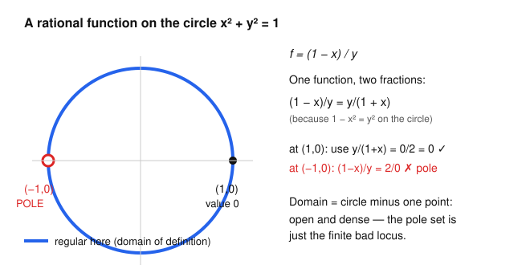

# Algebraic Geometry · Lesson 2.1: Rational functions & the function field

> ⏱ ~15 min · Module 2: Projective varieties & morphisms · Builds on: [Lesson 1.6](01-06-coordinate-ring-polynomial-maps.md) (coordinate ring, pullback) · Unlocks: [Lesson 2.2](02-02-regular-rational-maps.md) (regular & rational maps)

## Why this matters

The coordinate ring $k[X]$ holds the *polynomial* functions on a variety — but polynomials are a stingy supply. To do geometry you want to divide: to write $1/x$, to track where a function blows up, to say two varieties are "the same away from a small bad set." Allowing quotients $f/g$ turns the ring $k[X]$ into a **field** $k(X)$, and that field is one of the deepest invariants a variety has: birational geometry (Lesson 2.2) is the study of varieties *through* their function fields. On a Riemann surface this same field is the field of meromorphic functions, and the local ring we build here is literally the ring of germs of holomorphic functions at a point — the bridge to `complex-analysis` is not an analogy, it is the same objects.

## The idea

A polynomial function on $X$ is defined everywhere but can't have poles. A **rational function** relaxes this: it is a ratio $f/g$ of polynomial functions, and we simply *refuse to evaluate it* at the points where the denominator vanishes. Think of $\tan$ on the real line — a perfectly good function that happens to be undefined at a scattered set of points. The set where it *is* defined is huge (everything but a few points); the bad set is small.

Two subtleties make this rich rather than trivial:

1. **The same rational function has many faces.** $\dfrac{1-x}{y}$ and $\dfrac{y}{1+x}$ are *equal* on the unit circle, yet the first is undefined at $(1,0)$ while the second sails right through it. So the honest "where is $f$ defined?" question means: defined at $p$ if **some** representative has nonvanishing denominator there. Switching representatives can rescue points.

2. **You need $X$ irreducible.** Ratios only form a field when $k[X]$ is an integral domain (no zero-divisors), and — from Lesson 1.4 — $k[X]$ is a domain exactly when $I(X)$ is prime, i.e. when $X$ is **irreducible**. So this whole lesson lives on irreducible varieties.

## The formal version

Throughout, $k=\bar k$ and $X\subseteq\mathbb{A}^n$ is an **irreducible** affine variety, so its coordinate ring $k[X]=k[x_1,\dots,x_n]/I(X)$ is an integral domain.

**Definition (function field).** The **function field** of $X$ is the field of fractions of its coordinate ring:
$$k(X):=\operatorname{Frac}\big(k[X]\big)=\left\{\frac{f}{g}: f,g\in k[X],\ g\neq 0\right\}\Big/\sim,\qquad \frac{f}{g}\sim\frac{f'}{g'}\iff fg'=f'g.$$
Its elements are **rational functions** on $X$.

*In words:* allow yourself to divide by any nonzero regular function, and identify two ratios exactly when they cross-multiply — the same recipe that builds $\mathbb{Q}$ from $\mathbb{Z}$, applied to $k[X]$.

Here "$g\neq 0$" means $g$ is not the zero element of $k[X]$, i.e. $g$ does *not* vanish identically on $X$ — it may still vanish at isolated points. That is precisely where poles come from.

**Definition (regular at a point; domain of definition).** A rational function $\varphi\in k(X)$ is **regular at** $p\in X$ if it has some representative $\varphi=f/g$ with $g(p)\neq 0$; its value there is $\varphi(p):=f(p)/g(p)\in k$ (well-defined, independent of the chosen good representative). The **domain of definition** $\operatorname{dom}(\varphi)$ is the set of points where $\varphi$ is regular.

*In words:* $\varphi$ is defined at $p$ if you can write it as a fraction whose bottom survives at $p$; the domain is every such $p$.

The bad set $X\setminus\operatorname{dom}(\varphi)$ is where **every** representative has a vanishing denominator — a Zariski-closed set with no interior (since $X$ is irreducible, any nonempty open set is dense). So:

> **Domain of definition is open and dense.** A rational function is regular on a large open set and undefined only on a proper closed "pole/indeterminacy locus."

**Definition (local ring at $p$).** The collection of rational functions regular at a fixed point $p\in X$ is
$$\mathcal{O}_{X,p}:=\left\{\frac{f}{g}\in k(X): g(p)\neq 0\right\}\subseteq k(X).$$

*In words:* zoom in on $p$ and keep only the functions that don't blow up there — everything you can legally evaluate at $p$.

**Proposition.** $\mathcal{O}_{X,p}$ is a subring of $k(X)$, and it is a **local ring**: it has a unique maximal ideal
$$\mathfrak{m}_p=\left\{\frac{f}{g}\in\mathcal{O}_{X,p}: f(p)=0\right\}=\ker\big(\operatorname{ev}_p:\mathcal{O}_{X,p}\to k\big).$$

*Proof.* Evaluation $\operatorname{ev}_p(f/g)=f(p)/g(p)$ is a ring homomorphism onto the field $k$ (both $f(p)/g(p)$ make sense since $g(p)\neq0$), so $\mathfrak m_p=\ker\operatorname{ev}_p$ is an ideal with $\mathcal O_{X,p}/\mathfrak m_p\cong k$, hence maximal. Now the key point: any $f/g\notin\mathfrak m_p$ has $f(p)\neq 0$, so its inverse $g/f$ *also* has nonvanishing denominator at $p$, i.e. $g/f\in\mathcal O_{X,p}$ — every element outside $\mathfrak m_p$ is a unit. A ring whose non-units form an ideal has that ideal as its unique maximal ideal. $\blacksquare$

*In words:* near one point, the only "obstruction" a function can have is to vanish at $p$; anything nonzero at $p$ is invertible near $p$. "Local ring" = one maximal ideal, capturing behavior at a single point.

Finally, gluing the local pictures back together recovers the polynomial functions — nothing new was smuggled in:

**Theorem (regular everywhere = polynomial).** For irreducible affine $X$,
$$\bigcap_{p\in X}\mathcal{O}_{X,p}=k[X].$$

*In words:* a rational function regular at **every** point of an affine variety is already a polynomial function. Poles are the only reason to leave $k[X]$; forbid them all and you are back where you started. (Proof sketch: if $\varphi$ is regular everywhere, the ideal of "allowed denominators" $\{h\in k[X]: h\varphi\in k[X]\}$ has a nonvanishing element at every point, so it lies in no maximal ideal, hence is all of $k[X]$; taking $h=1$ gives $\varphi\in k[X]$. Full proof waits for localization in Lesson 3.2.)

## Picture

The circle $V(x^2+y^2-1)$ carries $\varphi=(1-x)/y$. Naively it looks undefined wherever $y=0$, i.e. at $(1,0)$ and $(-1,0)$. But on the circle $1-x^2=y^2$, so $(1-x)/y=y/(1+x)$: at $(1,0)$ this second face gives $0/2=0$, rescuing the point. At $(-1,0)$ neither face survives — $2/0$ and $0/0$ — so that lone point is a genuine pole. The domain of definition is the whole circle minus one point: open, dense, and complement a single bad point.

## Worked examples

**Example 1 (the hyperbola — where $1/x$ has no pole at all).** Let $X=V(xy-1)\subseteq\mathbb{A}^2$, the hyperbola. Since $xy-1$ is irreducible, $I(X)=(xy-1)$ is prime and
$$k[X]=k[x,y]/(xy-1).$$
In this ring $y=x^{-1}$, so $k[X]\cong k[x,x^{-1}]$, the **Laurent polynomials**. Its fraction field is
$$k(X)=\operatorname{Frac}\big(k[x,x^{-1}]\big)=k(x),$$
the field of rational functions in one variable — the hyperbola has the same function field as a line, our first whiff of *birational equivalence* (Lesson 2.2).

Now the point of the example: the rational function $1/x\in k(X)$ *looks* like it should have a pole where $x=0$. But no point of $X$ has $x=0$ — the hyperbola never touches the $y$-axis! Concretely, on $X$ we have the relation $xy=1$, so
$$\frac{1}{x}=y\quad\text{in } k(X).$$
The right side is the honest coordinate function $y\in k[X]$: a polynomial function, regular at every point. So $1/x$ is regular on all of $X$, with $\operatorname{dom}(1/x)=X$. Its apparent pole was an illusion of the representative $1/x$; the representative $y$ has no denominator at all. This is exactly the "switch faces to rescue points" phenomenon — here it rescues *every* point.

**Example 2 (the nodal cubic — a function undefined at the node).** Let $C=V(y^2-x^2(x+1))\subseteq\mathbb{A}^2$, the nodal cubic, which crosses itself at the origin. (It is irreducible: $y^2-x^2(x+1)$ has no factorization in $k[x,y]$, as it is degree $2$ and monic in $y$ with $x^2(x+1)$ not a square.) Consider
$$\varphi=\frac{x}{y}\in k(C).$$
Where is it regular? The denominator $y$ vanishes on $C$ exactly where $x^2(x+1)=0$: at $(-1,0)$ and at the origin $(0,0)$ (a double root — the node). Off the set $\{y=0\}$, $\varphi$ is plainly regular. Examine the two bad points.

- **At $(-1,0)$:** squaring is illuminating. On $C$, $x^2=y^2/(x+1)$, so
$$\varphi^2=\frac{x^2}{y^2}=\frac{1}{x+1}.$$
At $(-1,0)$ the right side is $1/0$: $\varphi^2$ blows up, so $\varphi$ cannot be finite there. Genuine **pole**. No representative can save it.
- **At the node $(0,0)$:** here $\varphi^2=1/(x+1)\to 1/1=1$, so $\varphi\to\pm 1$ — finite, but *which sign?* The node is where two branches of the curve cross. Parametrize by $t\mapsto(t^2-1,\,t^3-t)$ (you'll verify this hits $C$ in the Flashback); then
$$\varphi=\frac{x}{y}=\frac{t^2-1}{t^3-t}=\frac{t^2-1}{t(t^2-1)}=\frac{1}{t},$$
and the node $(0,0)$ is hit by $t=+1$ and $t=-1$, giving $\varphi=1$ and $\varphi=-1$ respectively. The two branches force two different values, so **no single value** works: $\varphi$ is genuinely *undefined* at the node — an **indeterminacy**, not a pole.

So $\operatorname{dom}(x/y)=C\setminus\{(-1,0),(0,0)\}$, an open dense subset, and the node is a point where a rational function refuses to extend. Singular points breed such indeterminacies — the theme of Module 3.

## Watch out

- **"$g\neq 0$" means "not identically zero," not "nowhere zero."** A legal denominator is allowed to vanish at some points — those are exactly the candidate poles. Reading it as "never vanishes" would collapse $k(X)$ back to something like $k[X]$ and kill the whole notion of a pole.
- **A pole and an indeterminacy are different failures.** At $(-1,0)$ above, $x/y$ genuinely diverges (value $\to\infty$). At the node it stays bounded but is multivalued. Both lie outside the domain, but "regular value $\infty$" (poles, meaningful in $\mathbb{P}^1$) and "no coherent value at all" (indeterminacy) are distinct, and telling them apart matters in Lesson 2.2.
- **Don't trust a single representative to report the domain.** $1/x$ "has a pole at $x=0$" is a statement about the *fraction*, not the *function*: on $V(xy-1)$ the function $1/x=y$ has no pole anywhere. Always ask whether another representative extends the domain before declaring a point bad.
- **This needs irreducibility.** On a reducible $X$, $k[X]$ has zero-divisors (a function vanishing on one component, times one vanishing on the other, is $0$), so $\operatorname{Frac}(k[X])$ isn't a field. Function fields are a one-component-at-a-time notion.

## One-liner

> The function field is what you get by allowing division on a variety; a rational function then lives wherever *some* fraction representing it keeps its denominator alive — an open, dense domain punctured only by poles and indeterminacies.

## Problems

**P1 (🟢)** Let $X=V(y-x^2)\subseteq\mathbb{A}^2$ (the parabola). (a) Identify $k[X]$ and $k(X)$ as familiar rings/fields. (b) The rational function $\varphi=y/x$ looks like it might be bad at $x=0$. Using the relation on $X$, simplify $\varphi$ and determine its domain of definition. Is it regular at the origin $(0,0)\in X$?

**P2 (🟡)** On the circle $C=V(x^2+y^2-1)$ with $\operatorname{char} k\neq 2$, let $\varphi=(1-x)/y\in k(C)$ (the function in the Picture). (a) Prove the identity $(1-x)/y=y/(1+x)$ in $k(C)$. (b) Determine $\operatorname{dom}(\varphi)$ exactly, and give $\varphi(1,0)$. (c) Describe $\mathfrak{m}_{(0,1)}\subseteq\mathcal{O}_{C,(0,1)}$: exhibit one rational function that lies in it and one unit that does not.

**P3 (🔴, optional)** Let $X$ be irreducible affine and $p\in X$. Prove that $\mathcal{O}_{X,p}$ is exactly the **localization** $k[X]_{\mathfrak{m}_p}$ of $k[X]$ at the maximal ideal $\mathfrak{m}=\{h\in k[X]:h(p)=0\}$ — that is, the set of fractions $f/g$ with $f,g\in k[X]$ and $g\notin\mathfrak{m}$. (You may use that $\mathfrak m$ is the maximal ideal $I(p)/I(X)$ corresponding to $p$ by the Nullstellensatz, Lesson 1.5.) This identifies the geometric "regular at $p$" ring with a purely algebraic construction — the engine of Lesson 3.2.

Solutions

**P1** (a) $y-x^2$ is irreducible, so $k[X]=k[x,y]/(y-x^2)$. The relation $y=x^2$ lets us eliminate $y$, giving $k[X]\cong k[x]$ (a polynomial ring — the parabola is an isomorphic copy of the affine line $\mathbb{A}^1$, via $x\mapsto(x,x^2)$). Hence $k(X)=\operatorname{Frac}(k[x])=k(x)$, rational functions in one variable.

(b) On $X$, $y=x^2$, so
$$\varphi=\frac{y}{x}=\frac{x^2}{x}=x\quad\text{in }k(X).$$
The representative $x$ is the honest coordinate function — a polynomial, regular everywhere. So $\operatorname{dom}(\varphi)=X$ and in particular $\varphi$ **is** regular at the origin, with $\varphi(0,0)=0$. The apparent pole of $y/x$ at $x=0$ was an artifact of that representative; the face $\varphi=x$ has no denominator. (Compare Example 1: same rescue mechanism.)

**P2** (a) On $C$ we have $x^2+y^2=1$, so $y^2=1-x^2=(1-x)(1+x)$. Cross-multiplying, $(1-x)(1+x)=y\cdot y$, i.e. $(1-x)/y=y/(1+x)$ as elements of $k(C)$ (both denominators $y$ and $1+x$ are nonzero in $k[C]$, since neither $y$ nor $1+x$ vanishes identically on the circle). $\blacksquare$

(b) Bad points require *both* faces to fail. Face $(1-x)/y$ fails where $y=0$: at $(1,0)$ and $(-1,0)$. Face $y/(1+x)$ fails where $1+x=0$: at $(-1,0)$. So:
- $(1,0)$: rescued by the second face, $\varphi(1,0)=y/(1+x)=0/2=0$. Regular.
- $(-1,0)$: both faces fail. And $\varphi=(1-x)/y=2/0$ diverges — genuine pole.

Hence $\operatorname{dom}(\varphi)=C\setminus\{(-1,0)\}$ and $\varphi(1,0)=0$.

(c) At $p=(0,1)$: $\mathfrak{m}_p=\{f/g\in\mathcal{O}_{C,p}:f(p)=0\}$, the functions vanishing at $(0,1)$. The coordinate function $x$ vanishes there ($x(0,1)=0$) and has denominator $1$, so $x\in\mathfrak m_p$. A unit not in $\mathfrak m_p$: the function $y$, since $y(0,1)=1\neq 0$ — it is invertible in $\mathcal{O}_{C,p}$ (inverse $1/y$, whose denominator $y$ is nonzero at $p$). (Indeed $\varphi=(1-x)/y$ itself is a unit at $p$: $\varphi(0,1)=1\neq0$.)

**P3** Write $\mathfrak m=\{h\in k[X]:h(p)=0\}$; by the Nullstellensatz this is the maximal ideal corresponding to $p$. The localization is $k[X]_{\mathfrak m}=\{f/g: f,g\in k[X],\ g\notin\mathfrak m\}\subseteq k(X)$.

($\supseteq$) If $f/g$ has $g\notin\mathfrak m$, then $g(p)\neq 0$ by definition of $\mathfrak m$, so $f/g\in\mathcal O_{X,p}$.

($\subseteq$) Conversely take $\varphi\in\mathcal O_{X,p}$, so $\varphi$ has *some* representative $f/g$ (with $f,g\in k[X]$) and $g(p)\neq 0$. Then $g\notin\mathfrak m$, so this very representative exhibits $\varphi\in k[X]_{\mathfrak m}$.

Both inclusions used only the equivalence "$g(p)\neq 0\iff g\notin\mathfrak m$," which is the content of $\mathfrak m$ being the ideal of functions vanishing at $p$. Therefore $\mathcal O_{X,p}=k[X]_{\mathfrak m}$. $\blacksquare$

This is why $\mathcal O_{X,p}$ deserves the name *local ring*: it is $k[X]$ localized at a maximal ideal, and localizing at a prime always yields a local ring with maximal ideal $\mathfrak m\,k[X]_{\mathfrak m}$.

## Flashback

**From Lesson 1.6 (coordinate ring & pullback):** Define $\phi:\mathbb{A}^1\to\mathbb{A}^2$ by $\phi(t)=(t^2-1,\ t^3-t)$. (a) Show the image of $\phi$ lies in the nodal cubic $C=V(y^2-x^2(x+1))$ by computing the pullback $\phi^*(y^2-x^2(x+1))\in k[t]$ and checking it is $0$. (b) Write down the induced pullback homomorphism $\phi^*:k[C]\to k[t]$ on coordinate rings (where each generator goes). (c) Which parameter values $t$ map to the node $(0,0)$? What does this say about $\phi^*$ being injective?

Solution

(a) With $x=t^2-1$ and $y=t^3-t$, pull back the defining polynomial:
$$\phi^*(y^2-x^2(x+1))=(t^3-t)^2-(t^2-1)^2\big((t^2-1)+1\big).$$
Now $t^3-t=t(t^2-1)$, so $(t^3-t)^2=t^2(t^2-1)^2$, and $(t^2-1)+1=t^2$, so the second term is $(t^2-1)^2 t^2$. The two are equal:
$$t^2(t^2-1)^2-(t^2-1)^2t^2=0.$$
So the defining equation pulls back to $0$, meaning every point $\phi(t)$ satisfies $y^2=x^2(x+1)$: the image lies in $C$. $\blacksquare$

(b) Because $\phi(\mathbb A^1)\subseteq C$, composing with $\phi$ carries functions on $C$ to functions on $\mathbb{A}^1$. Recall $k[C]=k[x,y]/(y^2-x^2(x+1))$ and $k[\mathbb A^1]=k[t]$. The pullback sends each coordinate function to its formula in $t$:
$$\phi^*:k[C]\to k[t],\qquad \phi^*(x)=t^2-1,\quad \phi^*(y)=t^3-t,$$
extended as a $k$-algebra homomorphism (this is well-defined precisely because the defining relation pulls back to $0$, by part (a)). Its image is the subring $k[t^2-1,\ t^3-t]=k[t^2,t^3]\subseteq k[t]$ (since $t^2-1$ and $t^3-t=t(t^2-1)$ generate the same subring as $t^2$ and $t^3$).

(c) The node $(0,0)$ requires $t^2-1=0$ and $t^3-t=0$, i.e. $t\in\{+1,-1\}$ (both satisfy $t^3-t=t(t^2-1)=0$ automatically). So **two** distinct parameter values, $t=1$ and $t=-1$, map to the single node — the two branches crossing there. Consequently $\phi$ is not injective on points. The map $\phi^*$ *is* injective on functions (an inclusion $k[t^2,t^3]\hookrightarrow k[t]$), but it is **not surjective**: $t=\tfrac{1}{2}(\text{...})$ — concretely $t$ itself is not in the image $k[t^2,t^3]$, so $\phi$ is not an isomorphism onto $C$. The parametrization sees the node as two glued points; this failure of $\phi^*$ to be onto is the algebraic shadow of the singularity, and it is exactly why $x/y$ (Example 2) went multivalued at the node.

## Connections

- **Backward:** $k(X)=\operatorname{Frac}(k[X])$ is built directly on the coordinate ring of [Lesson 1.6](01-06-coordinate-ring-polynomial-maps.md), and requires $k[X]$ to be a domain — i.e. $X$ irreducible, i.e. $I(X)$ prime, straight from [Lesson 1.4](01-04-zariski-topology-irreducibility.md). P3 uses the points ↔ maximal ideals bijection of the Nullstellensatz, [Lesson 1.5](01-05-nullstellensatz.md).
- **Forward:** [Lesson 2.2](02-02-regular-rational-maps.md) upgrades rational *functions* to rational *maps* between varieties and defines dominant/birational maps — where "same function field" becomes "birationally equivalent" (foreshadowed by the hyperbola and parabola both having function field $k(x)$). The local ring $\mathcal{O}_{X,p}$ and its maximal ideal $\mathfrak m_p$ return as the whole engine of local structure: dimension via $\mathcal O_{X,p}$ ([Lesson 3.1](03-01-dimension.md)), localization ([Lesson 3.2](03-02-local-rings-localization.md)), and the tangent space $(\mathfrak m_p/\mathfrak m_p^2)^*$ ([Lesson 3.3](03-03-tangent-space.md)).
- **Sideways (`complex-analysis`):** on a Riemann surface, $k(X)$ is the field of **meromorphic functions**, poles are literal poles, and $\mathcal{O}_{X,p}$ is the ring of **germs** of holomorphic functions at $p$ with maximal ideal the germs vanishing at $p$ — the "domain of definition minus poles" picture here is the meromorphic-function picture there, verbatim. This dictionary carries all the way to Riemann–Roch ([Lesson 4.5](04-05-riemann-roch.md)).
- **Sideways (`abstract-algebra`):** the field of fractions and localization at a prime are the commutative-algebra constructions $\operatorname{Frac}(R)$ and $R_{\mathfrak p}$; here they acquire geometric meaning — global rational functions and functions regular near a point.
