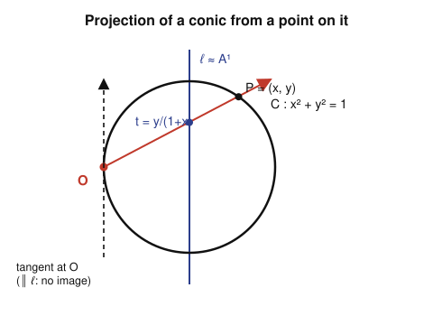

# Algebraic Geometry · Lesson 2.2: Regular & rational maps of affine varieties

> ⏱ ~15 min · Module 2: Projective varieties & morphisms · Builds on: [Lesson 2.1](02-01-rational-functions-function-field.md) · Unlocks: [Lesson 2.3](02-03-projective-space.md)

## Why this matters

A variety without maps is a museum piece. The moment you ask *"are these two varieties the same?"* you need morphisms — and it turns out there are **two** notions of "same," and the gap between them is where all the geometry lives. **Isomorphism** is the strict one. **Birational equivalence** is the loose one: it only remembers what happens on a dense open set, cheerfully forgetting a few bad points. That looseness is not a defect — it is the single most useful classification tool in the subject. Whole swaths of algebraic geometry (resolution of singularities, the classification of surfaces, the minimal model program) are the study of a variety *up to birational equivalence*. This lesson builds both notions and shows you the cleanest example of the gap: a curve with a cusp that is birational to a line but not isomorphic to it.

## The idea

Throughout, $k = \bar k$ and $X \subseteq \mathbb{A}^m$, $Y \subseteq \mathbb{A}^n$ are **irreducible** affine varieties, so their coordinate rings $k[X], k[Y]$ are domains and their function fields $k(X), k(Y)$ (Lesson 2.1) are honest fields.

There are three grades of map, from strict to loose:

- A **regular map** (a *morphism*) is defined **everywhere** and is given by polynomials. It's the strict notion — think "smooth everywhere, nothing hidden."
- A **rational map** is only a *partial* map: given by fractions of polynomials, defined on a dense open set, and allowed to blow up or go undefined on a thin bad locus. Think of $x \mapsto 1/x$ on the line — a perfectly good rational map that just isn't defined at $0$.
- **Dominant** rational maps are the ones whose image is dense; these are exactly the ones you can safely *compose* and pull back functions along.

The organizing miracle — the same functor-of-a-dictionary reflex from Module 1 — is that **maps of varieties are secretly maps of rings, backwards**. A morphism $\phi\colon X\to Y$ turns a function $g$ on $Y$ into the function $g\circ\phi$ on $X$; this "pullback" $\phi^*$ runs $k[Y]\to k[X]$, and *every* algebra map arises this way. Rational maps do the same one level up, on function fields. Read the map off the algebra, read the algebra off the map.

## The formal version

### Regular maps (morphisms)

**Definition (regular map).** A map $\phi\colon X\to Y$ is **regular** (a *morphism*) if writing $\phi=(\phi_1,\dots,\phi_n)$ in the coordinates of $\mathbb{A}^n\supseteq Y$, each component $\phi_i$ is a regular function on all of $X$ — i.e. $\phi_i\in k[X]$ — and $\phi(X)\subseteq Y$.

*In words:* a morphism of affine varieties is just a polynomial map whose image actually lands in the target.

Recall from Lesson 1.6 / 2.1 that the regular functions on **all** of an affine variety are exactly its coordinate ring, $\mathcal{O}_X(X)=k[X]$. So "given by regular functions everywhere" and "given by polynomials" mean the same thing here. Equivalently, $\phi$ is regular iff it **pulls back regular functions to regular functions**: for every $g\in k[Y]$, the composite $g\circ\phi$ lies in $k[X]$.

**Pullback correspondence (Lesson 1.6).** Sending $\phi\mapsto\phi^*$, where $\phi^*(g)=g\circ\phi$, is a bijection
$$\{\text{morphisms } X\to Y\}\ \xrightarrow{\ \sim\ }\ \{k\text{-algebra homomorphisms } k[Y]\to k[X]\},$$
contravariant (it reverses composition: $(\psi\circ\phi)^*=\phi^*\circ\psi^*$).

*In words:* to give a morphism $X\to Y$ is exactly to give an algebra map $k[Y]\to k[X]$ — geometry and algebra are the same data, with the arrow flipped. An **isomorphism** of varieties is a morphism with a two-sided inverse morphism; by the correspondence, $X\cong Y$ **iff** $k[X]\cong k[Y]$ as $k$-algebras.

### Rational maps

**Definition (rational map).** A **rational map** $\phi\colon X\dashrightarrow Y$ is a morphism $\phi_U\colon U\to Y$ defined on *some* dense (nonempty) open $U\subseteq X$, where two such are identified when they agree on the overlap of their domains. Concretely, $\phi=(\phi_1,\dots,\phi_n)$ with each $\phi_i\in k(X)$, defined at every point where all the $\phi_i$ are regular (Lesson 2.1) and the value lands in $Y$. Its **domain of definition** is the largest such open set — always dense.

*In words:* a rational map is a partial map given by fractions; it lives on a dense open set and is allowed to misbehave on a thin closed leftover. The dashed arrow $\dashrightarrow$ is a standing warning: *not defined everywhere.*

**Definition (dominant).** A rational map $\phi\colon X\dashrightarrow Y$ is **dominant** if its image (over its domain) is *dense* in $Y$ for the Zariski topology.

Dominance is exactly the hypothesis that makes pullback work on function fields:

**Theorem (dominant rational maps ↔ field embeddings).** For irreducible affine $X,Y$ over $k$, the assignment $\phi\mapsto\phi^*$ is a bijection
$$\{\text{dominant rational maps } X\dashrightarrow Y\}\ \xrightarrow{\ \sim\ }\ \{k\text{-algebra homomorphisms } k(Y)\to k(X)\}.$$
Every such algebra map is automatically injective (a field has no proper ideals), so $\phi^*\colon k(Y)\hookrightarrow k(X)$ is a **field embedding over** $k$.

*In words:* dominant rational maps are the same thing as inclusions of function fields, backwards. The **dominance ⇔ injectivity** half is the load-bearing one: if the image is dense, then a function $g\in k(Y)$ with $\phi^*g=g\circ\phi=0$ must vanish on a dense set, hence $g=0$; if the image is *not* dense, some nonzero $g$ vanishes on its closure and pulls back to $0$, killing injectivity.

**Caution — composition needs dominance.** You cannot always compose rational maps. If the entire image of $\phi\colon X\dashrightarrow Y$ falls into the bad locus where $\psi\colon Y\dashrightarrow Z$ is undefined, then $\psi\circ\phi$ means nothing. Restrict to **dominant** rational maps and composition is always defined — that's the category you actually work in.

### Birational equivalence

**Definition (birational).** A rational map $\phi\colon X\dashrightarrow Y$ is **birational** if it is dominant and admits a rational inverse $\psi\colon Y\dashrightarrow X$ with $\psi\circ\phi=\mathrm{id}_X$ and $\phi\circ\psi=\mathrm{id}_Y$ **as rational maps** (i.e. on dense opens). Then $X$ and $Y$ are **birationally equivalent**, or *birational*.

**Theorem (birational ⇔ same function field).** Two irreducible affine varieties $X,Y$ over $k$ are birational **iff** $k(X)\cong k(Y)$ as $k$-algebras (equivalently, as field extensions of $k$).

*In words:* birational equivalence sees *exactly* the function field and nothing else. Since $X\cong Y \Rightarrow k[X]\cong k[Y] \Rightarrow k(X)\cong k(Y)$, isomorphism implies birational — but not conversely. **Birational is strictly coarser than isomorphic**, and the coarsening is the whole point: it lets you straighten out singular points that isomorphism would never let you touch.

**Remark (extension over codimension 1 — stated).** A rational map into projective space is far better-behaved than one into $\mathbb{A}^n$: on a *smooth* variety its indeterminacy locus always has codimension $\ge 2$. In particular a rational map from a **smooth curve** to a projective variety is defined at *every* point — automatically a morphism. We can only state this cleanly once $\mathbb{P}^n$ is on the table (Lessons 2.3–2.5); keep it in your pocket, and notice it already peeking out in Worked Example 1 below.

## Picture

Projection **from a point** is the archetype of a rational-but-not-regular map. Fix a smooth conic $C$ and a point $O\in C$. To project, shoot a line from $O$ through another point $P\in C$ and record where it meets a fixed target line $\ell$. This assigns a coordinate $t$ to almost every point of $C$ — but at $O$ itself the "line $OP$" degenerates to the *tangent* at $O$, which runs parallel to $\ell$ and never meets it. That one point is the indeterminacy.

## Worked examples

**Example 1 (projection from a point — rational, not regular).** Assume $\operatorname{char}k\neq 2$ and take the circle $C=V(x^2+y^2-1)\subseteq\mathbb{A}^2$, irreducible, with $O=(-1,0)\in C$. Project from $O$ onto the line $\ell=\{x=0\}\cong\mathbb{A}^1$: the line from $O$ through $P=(x,y)$ has slope $t=\dfrac{y}{x+1}$, and that slope *is* its height where it crosses $\ell$. So
$$\rho\colon C\dashrightarrow \mathbb{A}^1,\qquad (x,y)\longmapsto t=\frac{y}{x+1}.$$
This is a rational map: the fraction is defined off $\{x=-1\}\cap C=\{O\}$. It is **not** regular on all of $C$ — but is the bad locus really just $O$? On $C$ we have $y^2=1-x^2=(1-x)(1+x)$, so
$$\frac{y}{x+1}=\frac{y(1-x)}{(1+x)(1-x)}=\frac{y(1-x)}{y^2}=\frac{1-x}{y}.$$
The second representative is defined off $\{y=0\}\cap C=\{(\pm1,0)\}$. The **domain of definition** is the union of the two, so $\rho$ is regular precisely on $C\setminus\{O\}$ (at $(1,0)$ the first form gives $0/2=0$). It genuinely cannot be extended over $O$: as $P\to O$ the value $\to\infty$, and $\mathbb{A}^1$ has no point at infinity to catch it.

Inverting is the Weierstrass substitution: a line through $O$ of slope $t$ meets $C$ again at
$$\rho^{-1}(t)=\left(\frac{1-t^2}{1+t^2},\ \frac{2t}{1+t^2}\right),$$
a rational map $\mathbb{A}^1\dashrightarrow C$. So $\rho$ is **birational**, and $C$ is *rational* (birational to a line): $k(C)\cong k(t)$. This is the affine shadow of Boss problem 2 — a smooth conic is "just" a line, birationally.

**Example 2 (birational but not isomorphic — verify via the function field).** Let $C=V(y^2-x^3)\subseteq\mathbb{A}^2$, the **cuspidal cubic**. First, $y^2-x^3$ is irreducible (as a polynomial in $y$ over $k(x)$ it's $y^2-x^3$, and $x^3$ is not a square in $k[x]$), so $C$ is irreducible and $k[C]=k[x,y]/(y^2-x^3)$ is a domain.

The **normalization** $\nu\colon\mathbb{A}^1\to C$, $t\mapsto(t^2,t^3)$, is a morphism: $(t^3)^2=(t^2)^3$, so it lands on $C$. Its pullback is
$$\nu^*\colon k[C]\to k[t],\qquad x\mapsto t^2,\ y\mapsto t^3,\quad\text{with image } k[t^2,t^3].$$
This map is injective (reduce any $f$ mod $y^2-x^3$ to the form $g(x)+y\,h(x)$; then $\nu^*f=g(t^2)+t^3h(t^2)$ splits into even- and odd-degree parts, which vanish only if $g=h=0$), so $k[C]\cong k[t^2,t^3]$.

Now compare the two "sames":

- **Not isomorphic.** $\nu^*$ is **not surjective**: $t\notin k[t^2,t^3]$ (no combination of even powers and $\ge 3$ odd powers produces a bare $t$). Since $\nu^*$ isn't an isomorphism of rings, $\nu$ isn't an isomorphism of varieties — even though $\nu$ is a *bijection on points* (given $(x,y)\in C$ with $x\neq0$, recover $t=y/x$; and $(0,0)\leftrightarrow t=0$). A bijective morphism need not be an isomorphism.
- **But birational.** Pass to fractions: $k(C)=\operatorname{Frac}(k[t^2,t^3])$ contains $t=t^3/t^2$, so $k(C)=k(t)=k(\mathbb{A}^1)$. Thus $\nu$ is dominant and
$$\nu^*\colon k(C)\xrightarrow{\ \sim\ }k(\mathbb{A}^1)=k(t)$$
is an **isomorphism of function fields**. The rational inverse is $\psi\colon C\dashrightarrow\mathbb{A}^1$, $(x,y)\mapsto y/x$, defined off the cusp $(0,0)$, and $\psi\circ\nu(t)=t^3/t^2=t$. So $C$ is birational to $\mathbb{A}^1$.

The one point $\mathbb{A}^1$ and $C$ disagree on is the cusp: $\psi$ can't be extended there, and algebraically $k[t^2,t^3]$ is not integrally closed (it misses the integral element $t=y/x$). Birational equivalence looks past that single bad point; isomorphism refuses to.

## Watch out

- **A rational map is not a function on $X$.** It's a partial map on a dense open. "$\phi=(x,y)\mapsto y/x$" is a bona fide rational map $\mathbb{A}^2\dashrightarrow\mathbb{A}^1$ even though it's undefined on the whole $y$-axis. Always ask "what is the domain of definition?" — and remember (Example 1) that a lone representative can *understate* it; simplify before declaring a point bad.
- **Birational $\neq$ isomorphic.** They coincide only when the bad locus is empty. The cuspidal cubic is the standard cautionary tale: same function field as $\mathbb{A}^1$, but not isomorphic. A *bijective* morphism (like $\nu$) is not automatically an isomorphism — check the pullback on **rings**, not just points.
- **Dominant is weaker than surjective, and needed for composition.** Dominant means dense image, not all of $Y$; e.g. $\mathbb{A}^2\to\mathbb{A}^2$, $(x,y)\mapsto(x,xy)$ has dense but non-surjective image. And you may only compose rational maps when the inner one is dominant — otherwise the composite can be undefined.

## One-liner

> A morphism is a polynomial map defined everywhere; a rational map is a fraction defined on a dense open; and "same function field" is birational equivalence — the classification that forgives a cusp.

## Problems

**P1 (🟢)** *The nodal cubic is rational too.* Let $C=V(y^2-x^3-x^2)\subseteq\mathbb{A}^2$ (the nodal cubic, with a node at the origin). Define $\nu\colon\mathbb{A}^1\to C$ by $t\mapsto(t^2-1,\ t^3-t)$. (a) Verify $\nu(t)\in C$ for all $t$. (b) Exhibit a rational inverse and conclude $\nu$ is birational, so $k(C)\cong k(t)$. (c) How many $t$ map to the node $(0,0)$? What does that say about injectivity vs. birationality?

**P2 (🟡)** *Dominant but not birational.* Assume $\operatorname{char}k\neq2$ and let $\phi\colon\mathbb{A}^1\to\mathbb{A}^1$, $t\mapsto t^2$. (a) Show $\phi$ is dominant (indeed surjective, since $k=\bar k$). (b) Compute $\phi^*\colon k(\mathbb{A}^1)\to k(\mathbb{A}^1)$ on function fields and identify its image. (c) Show $\phi$ is **not** birational by computing the field-extension degree $[\,k(t):\phi^*k(y)\,]$. (This degree is the *degree of the map* — the generic number of preimages.)

**P3 (🔴, optional)** *Projection, and codimension-1 extension in action.* Consider $\pi\colon\mathbb{A}^2\dashrightarrow\mathbb{A}^1$, $(x,y)\mapsto y/x$ (projection from the origin to the slope). (a) Find its domain of definition. (b) Prove it does **not** extend to a morphism $\mathbb{A}^2\to\mathbb{A}^1$. (c) Granting the projective picture $[x:y]$ of Lesson 2.3, explain why the map $\mathbb{A}^2\dashrightarrow\mathbb{P}^1$, $(x,y)\mapsto[x:y]$, is defined at every point of the $x$-axis except the origin — shrinking the indeterminacy from a codimension-1 line to a codimension-2 point.

Solutions

**P1** (a) With $x=t^2-1$, $y=t^3-t=t(t^2-1)$: then $x^3+x^2=x^2(x+1)=(t^2-1)^2\cdot t^2$ and $y^2=t^2(t^2-1)^2$. They're equal, so $y^2-x^3-x^2=0$ and $\nu(t)\in C$. ✓

(b) The construction *is* projection from the node: lines $y=tx$ through $(0,0)$ meet $C$ where $t^2x^2=x^3+x^2$, i.e. (off $x=0$) $t^2=x+1$, giving back $x=t^2-1$, $y=tx=t^3-t$. So the rational inverse is $\psi\colon C\dashrightarrow\mathbb{A}^1$, $(x,y)\mapsto y/x$, defined off $\{x=0\}$; and $\psi(\nu(t))=\dfrac{t^3-t}{t^2-1}=\dfrac{t(t^2-1)}{t^2-1}=t$. Hence $\nu$ is birational and $k(C)\cong k(t)$: $C$ is a rational curve.

(c) The node $(0,0)$ has $x=t^2-1=0$, so $t=\pm1$ (and both give $y=t^3-t=0$). Thus **two** parameters, $t=1$ and $t=-1$, map to the node — $\nu$ is $2$-to-$1$ there, so it is *not injective*. Birationality only needs a dense open on which the map is a bijection (here $C\setminus\{\text{node}\}$); it tolerates finitely many points where injectivity fails. (Geometrically: the two branches of the node correspond to the two tangent directions $t=\pm1$.)

**P2** (a) For any $a\in k=\bar k$ the equation $t^2=a$ has a solution, so $\phi$ is surjective, hence its image is dense: dominant. ✓

(b) Writing the target coordinate as $y$ and source as $t$, $\phi^*(y)=t^2$, so $\phi^*\colon k(y)\to k(t)$ sends a rational function $f(y)\mapsto f(t^2)$. Its image is $k(t^2)$, the subfield of even rational functions.

(c) $k(t)$ over $k(t^2)$ is generated by $t$, a root of $Z^2-t^2\in k(t^2)[Z]$, which is irreducible over $k(t^2)$ (since $t\notin k(t^2)$, as $\operatorname{char}k\neq2$). So $[\,k(t):k(t^2)\,]=2>1$. Because $\phi^*$ is not surjective on function fields, $\phi$ is not birational; the extension degree $2$ is exactly the generic fiber size ($t$ and $-t$ both hit $t^2$).

**P3** (a) $y/x$ is defined wherever $x\neq0$, and no other representative enlarges this on $\mathbb{A}^2$ (unlike Example 1, there is no relation to simplify). **Domain of definition $=\mathbb{A}^2\setminus\{x=0\}$**, the plane minus the $y$-axis — a codimension-1 bad locus.

(b) Suppose $\pi$ extended to a morphism $f\colon\mathbb{A}^2\to\mathbb{A}^1$, i.e. $f\in k[x,y]$ a polynomial with $f=y/x$ on $\{x\neq0\}$. Then $xf(x,y)=y$ as regular functions on the dense open $\{x\neq0\}$, hence (both sides polynomials agreeing on a dense set of the irreducible $\mathbb{A}^2$) as an identity in $k[x,y]$: $x\,f(x,y)=y$. But the left side lies in the ideal $(x)$ while $y\notin(x)$ — contradiction. So no polynomial extension exists; $\pi$ is rational, not regular.

(c) The value $[x:y]$ is a well-defined point of $\mathbb{P}^1$ whenever $(x,y)\neq(0,0)$, since projective coordinates only need *not all* to vanish — the shared factor that plagued $y/x$ no longer matters, because $[x:y]=[1:y/x]=[x/y:1]$ and at least one chart is always available. So on the $x$-axis $\{y=0\}$ the map gives $[x:0]=[1:0]$ for every $x\neq0$, and only the origin $(0,0)$ remains undefined. The indeterminacy drops from the whole line (codim 1) to a single point (codim 2) — the "extension over codimension 1" of the Remark, and the reason projective targets are the right home for rational maps.

## Flashback

**From Lesson 2.1 (domain of definition & the local ring):** On $X=\mathbb{A}^1$ with coordinate $x$, let $f=\dfrac{x^2-x}{x^2-1}\in k(X)$. (a) Find the domain of definition of $f$ — be careful, one apparent pole is removable. (b) For $p=1$ and $p=-1$, decide whether $f$ lies in the local ring $\mathcal{O}_{\mathbb{A}^1,p}$ (the rational functions regular at $p$).

Solution

(a) Factor: $f=\dfrac{x(x-1)}{(x-1)(x+1)}=\dfrac{x}{x+1}$ after cancelling the common factor $x-1$. The reduced form has denominator vanishing only at $x=-1$, so $f$ is regular on $\mathbb{A}^1\setminus\{-1\}$. The apparent trouble at $x=1$ is **removable**: there $f=\tfrac{1}{2}$. **Domain of definition $=\mathbb{A}^1\setminus\{-1\}$.**

(b) $\mathcal{O}_{\mathbb{A}^1,p}=\{g/h : h(p)\neq0\}$. At $p=1$: the representative $x/(x+1)$ has denominator $2\neq0$, so $f\in\mathcal{O}_{\mathbb{A}^1,1}$ (with value $1/2$). At $p=-1$: every representative of $f$ has a pole there ($f\to\infty$), so no representative has non-vanishing denominator at $-1$; thus $f\notin\mathcal{O}_{\mathbb{A}^1,-1}$. The moral of 2.1 restated: "regular at $p$" is a property of the *function*, checkable after cancelling — not of the first formula you write down.

## Connections

- **Backward (Lessons 1.6, 2.1):** the morphism ↔ algebra-map dictionary is the coordinate-ring pullback of 1.6, now run to the finish; rational maps and domains of definition are built directly on the function field and local rings of 2.1.
- **Forward (Lessons 2.3–2.5, 3.4):** the "extend over codimension 1" remark becomes precise once $\mathbb{P}^n$ arrives — a rational map from a smooth curve to projective space is a morphism, the key to Boss problem 2's conic $\cong\mathbb{P}^1$. And birational-but-not-isomorphic is the analytic signature of a **singularity**: Lesson 3.4 will locate exactly the cusp and node that block isomorphism here, via the tangent cone.
- **Sideways (`abstract-algebra`):** $k(C)=\operatorname{Frac}(k[C])$ is the field of fractions of a domain, and "the normalization $\nu$ fails to be an isomorphism" is precisely the failure of $k[t^2,t^3]$ to be **integrally closed** — the integral element $t=y/x$ lies in the fraction field but not the ring.
- **Sideways (`complex-analysis`):** a birational equivalence of curves over $\mathbb{C}$ is an isomorphism of their fields of *meromorphic functions*, i.e. the two smooth models are the same Riemann surface. Birational classification of curves *is* the classification of compact Riemann surfaces — the bridge that carries genus and Riemann–Roch (Module 4) between the two subjects.
