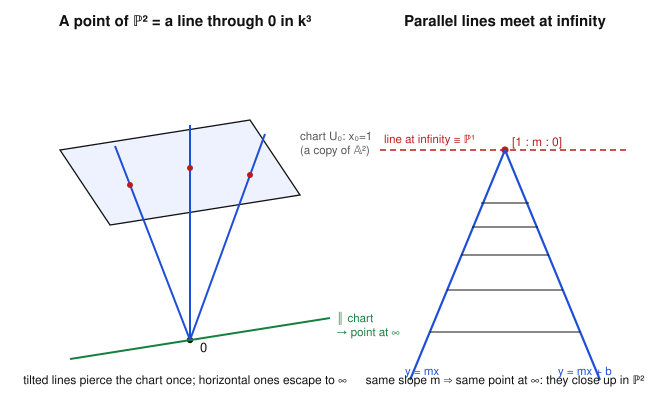

# Algebraic Geometry · Lesson 2.3: Projective space $\mathbb{P}^n$

> ⏱ ~15 min · Module 2: Projective varieties & morphisms · Builds on: [Lesson 1.1](01-01-affine-dictionary.md) (affine space $\mathbb{A}^n$), [Lesson 2.2](02-02-regular-rational-maps.md) (rational maps) · Unlocks: [Lesson 2.4](02-04-projective-varieties-homogeneous-nullstellensatz.md) (projective varieties & the homogeneous Nullstellensatz)

## Why this matters

Affine space leaks. Two parallel lines in $\mathbb{A}^2$ have no common point; a curve of degree $d$ and a curve of degree $e$ ought to meet in $de$ points but the count keeps coming up short; a conic runs off to the edge of the plane and never comes back. Every one of these failures is the *same* failure — $\mathbb{A}^n$ is missing its horizon. Projective space $\mathbb{P}^n$ glues that horizon back on: one clean point for each *direction* you could run off to. Once you do, parallel lines meet, Bézout's theorem ($de$ intersection points, on the nose) becomes true, and varieties become **compact** — the algebraic-geometry version of "no points escape to infinity," which is why nearly all serious geometry happens in $\mathbb{P}^n$, not $\mathbb{A}^n$.

## The idea

Here is the whole construction in one move. In $\mathbb{A}^{n+1}$, take every line through the origin and **declare each such line to be a single point**. The resulting set of points is $\mathbb{P}^n$.

Why lines? Think of the plane $\mathbb{A}^2$ sitting inside $\mathbb{A}^3$ as the chart $\{x_0 = 1\}$ — a tilted slab floating above the origin (left panel of the figure). A line through the origin in $\mathbb{A}^3$ pierces that slab in exactly one point, *unless* the line is parallel to the slab. So the lines split into two kinds:

- **Tilted lines** hit the chart once — these recover the ordinary points of $\mathbb{A}^2$.
- **Horizontal lines** (parallel to the chart) never hit it — these are the brand-new **points at infinity**, one for each direction in the plane.

That is the entire payload: $\mathbb{P}^n$ is $\mathbb{A}^n$ (the tilted lines) **plus** a smaller projective space $\mathbb{P}^{n-1}$ worth of directions (the horizontal lines). The horizon isn't a vague "edge"; it is itself a genuine projective space of one dimension lower, cataloguing directions.

## The formal version

Fix $k = \bar k$. On $k^{n+1}\setminus\{0\}$ declare $v \sim \lambda v$ for every scalar $\lambda \in k^* = k\setminus\{0\}$.

**Definition (projective space).**
$$\mathbb{P}^n_k \;=\; \bigl(k^{n+1}\setminus\{0\}\bigr)\big/\!\sim.$$

*In words:* a point of $\mathbb{P}^n$ is a line through the origin in $k^{n+1}$ — an $(n+1)$-tuple, where rescaling everything by one nonzero constant changes nothing.

**Homogeneous coordinates.** The class of $(x_0,\dots,x_n)$ is written
$$[x_0 : x_1 : \cdots : x_n], \qquad [x_0:\cdots:x_n] = [\lambda x_0 : \cdots : \lambda x_n]\ \text{ for all } \lambda\in k^*.$$
Not all $x_i$ may be zero, and only the **ratios** are meaningful: $[2:4:6]=[1:2:3]$. An individual coordinate $x_i$ is *not* a number attached to the point — but the condition "$x_i = 0$" is well-defined, since rescaling can't turn a zero into a nonzero.

**Standard affine charts.** For each $i$ let
$$U_i = \{[x_0:\cdots:x_n] \in \mathbb{P}^n : x_i \neq 0\}.$$
On $U_i$ we may rescale by $\lambda = 1/x_i$ to force the $i$-th coordinate to $1$ — **dehomogenize**. This gives a bijection
$$\varphi_i : U_i \xrightarrow{\ \sim\ } \mathbb{A}^n, \qquad [x_0:\cdots:x_n]\ \longmapsto\ \Bigl(\tfrac{x_0}{x_i},\dots,\widehat{\tfrac{x_i}{x_i}},\dots,\tfrac{x_n}{x_i}\Bigr)$$
(the hat means the $i$-th slot, which is $1$, is dropped). Its inverse **homogenizes**: $(a_1,\dots,a_n)\mapsto[a_1:\cdots:1:\cdots:a_n]$ with the $1$ in slot $i$.

*In words:* each chart $U_i$ is a faithful copy of ordinary $\mathbb{A}^n$; you get into it by setting $x_i=1$, and back out by remembering that the $1$ was really $x_i$.

**The charts cover everything.** Every point has *some* nonzero coordinate, so $\mathbb{P}^n = U_0\cup U_1\cup\cdots\cup U_n$. Fixing the chart $U_0$ and looking at its complement:

**Decomposition (affine part + hyperplane at infinity).**
$$\mathbb{P}^n \;=\; \underbrace{U_0}_{\{x_0\neq 0\}\,\cong\,\mathbb{A}^n} \ \sqcup\ \underbrace{\{x_0 = 0\}}_{\cong\,\mathbb{P}^{n-1}}.$$

*In words:* $\mathbb{P}^n$ is an affine $\mathbb{A}^n$ together with a hyperplane at infinity, and that hyperplane is itself a $\mathbb{P}^{n-1}$ recording directions. The points $[0:x_1:\cdots:x_n]$ carry no $x_0$, so they *are* just a direction $[x_1:\cdots:x_n]\in\mathbb{P}^{n-1}$.

For $\mathbb{P}^2 = \mathbb{A}^2 \sqcup \mathbb{P}^1$: the finite plane plus a $\mathbb{P}^1$ of directions. An affine line of slope $m$ runs off toward the single direction $m$, so **all lines of slope $m$ share one point at infinity** — parallel lines meet (right panel).

## Picture

## Worked examples

**Example 1 (converting coordinates, both directions).** Work in $\mathbb{P}^2$ with chart $U_0=\{x_0\neq0\}$.

- The point $[3:6:9]$. Its $x_0=3\neq0$, so it lies in $U_0$; dehomogenize by dividing through by $3$: $\varphi_0[3:6:9]=(6/3,\,9/3)=(2,3)\in\mathbb{A}^2$.
- Backwards: the affine point $(2,3)$ homogenizes to $[1:2:3]$ — and indeed $[1:2:3]=[3:6:9]$, so the round trip is the identity.
- The point $[0:2:5]$ has $x_0=0$: it is **not** in $U_0$. It lives on the line at infinity, encoding the direction $[2:5]\in\mathbb{P}^1$ — the slope $5/2$. (It *is* visible in the other charts, e.g. $\varphi_1[0:2:5]=(0/2,\,5/2)=(0,\tfrac52)\in U_1$.)

**Example 2 (parallel lines meet at infinity).** Take the two parallel affine lines
$$\ell:\ y = x \qquad\text{and}\qquad \ell':\ y = x+1 \qquad\text{in } \mathbb{A}^2 = U_0.$$
Homogenize. A point of $U_0$ is $[X_0:X_1:X_2]$ with affine coordinates $x=X_1/X_0,\ y=X_2/X_0$. Substituting and clearing denominators:
$$\ell:\ \frac{X_2}{X_0}=\frac{X_1}{X_0}\ \Longrightarrow\ X_1 - X_2 = 0, \qquad \ell':\ \frac{X_2}{X_0}=\frac{X_1}{X_0}+1\ \Longrightarrow\ X_1 + X_0 - X_2 = 0.$$
Now intersect the two homogeneous equations. From the first, $X_1=X_2$; feeding that into the second, $X_1 + X_0 - X_1 = 0$, i.e. $X_0 = 0$. With $X_0=0$ and $X_1=X_2$ the common point is
$$[\,0 : 1 : 1\,].$$
It has $X_0=0$, so it is at infinity — the direction of slope $1$, shared by both lines. In $\mathbb{A}^2$ they never met; in $\mathbb{P}^2$ they meet at exactly one point. (Two lines of *different* slope would instead solve to $X_0\neq0$ and meet at a finite point — so in $\mathbb{P}^2$, **any** two distinct lines meet in exactly one point, no exceptions. That clean statement is impossible in $\mathbb{A}^2$.)

**Example 3 (counting $\mathbb{P}^1$ over a finite field — a sanity check).** Let $k=\mathbb{F}_q$, the field with $q$ elements (drop $k=\bar k$ just for this count). How many points does $\mathbb{P}^1(\mathbb{F}_q)$ have?

*Directly, via the decomposition* $\mathbb{P}^1 = \mathbb{A}^1 \sqcup \mathbb{P}^0$: the chart $U_0=\{[1:t]\}$ is a copy of $\mathbb{A}^1$ with $q$ points, and $\{X_0=0\}=\{[0:1]\}=\mathbb{P}^0$ is a single point at infinity. Total: $q+1$.

*As a cross-check, counting lines:* there are $q^2-1$ nonzero vectors in $\mathbb{F}_q^2$, and each line through $0$ contains $q-1$ of them (the nonzero scalar multiples). So
$$\bigl|\mathbb{P}^1(\mathbb{F}_q)\bigr| = \frac{q^2-1}{q-1} = q+1.\ \checkmark$$
For $q=2$: the three points $[1:0],\,[1:1],\,[0:1]$ — exactly $q+1=3$. The two counts agree, which is the point of running both.

## Watch out

- **Homogeneous coordinates are not numbers.** You might think $[x_0:\cdots:x_n]$ lets you read off "$x_0$." It does not — $[1:2:3]=[2:4:6]$. Only ratios $x_i/x_j$ and the boolean "$x_i=0$?" survive rescaling. A "function" on $\mathbb{P}^n$ must be blind to the scaling; that's exactly why polynomials won't do and *homogeneous* ones will (next lesson).
- **The origin is thrown out.** $\mathbb{P}^n$ comes from $k^{n+1}\setminus\{0\}$; $[0:0:\cdots:0]$ is not a point — there is no line "through the origin in the direction $0$." At least one coordinate is always nonzero.
- **"At infinity" is not absolute.** The point $[0:2:5]$ is at infinity *for the chart $U_0$*, but it is a perfectly finite, interior point of $U_1$. Which points are "infinite" depends on which chart you pin down as your affine plane. Infinity is a choice of horizon, not an intrinsic edge.
- **Dimension drops by one.** $\mathbb{P}^n$ is built inside $k^{n+1}$ but has dimension $n$: quotienting lines-to-points spends one dimension. $\mathbb{P}^1$ is a curve, not a surface.

## One-liner

> $\mathbb{P}^n$ is $\mathbb{A}^n$ with its horizon restored — one point per direction — so parallel lines meet, degrees multiply, and nothing escapes to infinity.

## Problems

**P1 (🟢)** In $\mathbb{P}^2$ with chart $U_0=\{x_0\neq0\}$: (a) Dehomogenize $[4:2:-6]$ to a point of $\mathbb{A}^2$, then homogenize it back and confirm you recover the same projective point. (b) Which of $[0:3:7]$ and $[5:0:1]$ lies on the line at infinity of $U_0$, and what direction (slope) does it encode? (c) Homogenize the affine line $2x - y = 3$ and find its point at infinity.

**P2 (🟡)** Show that in $\mathbb{P}^2$ the three affine lines $y=2x-1$, $y=2x+4$, and $y=-x$ do the following: the first two meet each other only at a single point at infinity, while the third meets each of them at a *finite* point. Identify the shared infinity point of the first two and one of the finite intersection points. (This is the mechanism behind "parallel $\Leftrightarrow$ same point at infinity.")

**P3 (🔴, optional)** Prove $\bigl|\mathbb{P}^n(\mathbb{F}_q)\bigr| = 1 + q + q^2 + \cdots + q^n = \dfrac{q^{n+1}-1}{q-1}$, two ways: (i) by the line-counting argument, and (ii) by induction using $\mathbb{P}^n = \mathbb{A}^n \sqcup \mathbb{P}^{n-1}$. Check both give $|\mathbb{P}^2(\mathbb{F}_2)| = 7$.

Solutions

**P1** (a) $x_0=4\neq0$, so dehomogenize by dividing through by $4$: $\varphi_0[4:2:-6]=(2/4,\,-6/4)=(\tfrac12,\,-\tfrac32)$. Homogenizing $(\tfrac12,-\tfrac32)$ gives $[1:\tfrac12:-\tfrac32]$, and scaling by $4$ returns $[4:2:-6]$ — the same point. $\checkmark$

(b) The line at infinity of $U_0$ is $\{x_0=0\}$. Of the two, $[0:3:7]$ has $x_0=0$, so it lies at infinity; $[5:0:1]$ has $x_0=5\neq0$ and is finite (it dehomogenizes to $(0,\tfrac15)\in\mathbb{A}^2$). The infinite point $[0:3:7]$ encodes the direction $[3:7]\in\mathbb{P}^1$, i.e. slope $7/3$.

(c) With $x=X_1/X_0,\ y=X_2/X_0$, the equation $2x-y=3$ becomes $2\tfrac{X_1}{X_0}-\tfrac{X_2}{X_0}=3$, i.e. $2X_1 - X_2 - 3X_0 = 0$. Its point at infinity sets $X_0=0$: then $2X_1 = X_2$, giving $[0:1:2]$ — the direction of slope $2$, as expected for a line $y=2x-3$.

**P2** Homogenize each with $x=X_1/X_0,\ y=X_2/X_0$ (clearing $X_0$):
$$\ell_1:\ X_2 = 2X_1 - X_0,\quad \ell_2:\ X_2 = 2X_1 + 4X_0,\quad \ell_3:\ X_2 = -X_1.$$
*$\ell_1\cap\ell_2$:* subtracting the two equations gives $0 = -5X_0$, so $X_0=0$, and then $X_2=2X_1$. The only solution is $[0:1:2]$ — a single point at infinity (slope $2$), shared because both have slope $2$. No finite intersection exists: the lines are parallel.

*$\ell_1\cap\ell_3$:* set $2X_1 - X_0 = -X_1$, so $X_0 = 3X_1$; with $X_2=-X_1$, take $X_1=1$ to get $[3:1:-1]$, which has $X_0=3\neq0$ — a finite point, dehomogenizing to $(\tfrac13,-\tfrac13)$. (Sanity: on $y=2x-1$, $x=\tfrac13\Rightarrow y=-\tfrac13$. $\checkmark$) Likewise $\ell_2\cap\ell_3$: $2X_1+4X_0=-X_1\Rightarrow X_0=-\tfrac34 X_1$, giving the finite point $[-3:4:-4]\sim(-\tfrac43,\tfrac43)$. So $\ell_3$, having a different slope, meets each of $\ell_1,\ell_2$ at a genuine finite point.

**P3** (i) *Line-counting.* $\mathbb{F}_q^{n+1}$ has $q^{n+1}$ vectors, so $q^{n+1}-1$ nonzero ones. Each line through the origin is a $1$-dimensional subspace, containing $q$ vectors, hence $q-1$ nonzero vectors, and distinct lines share only $0$. The nonzero vectors partition into lines of size $q-1$, so the number of lines is
$$\bigl|\mathbb{P}^n(\mathbb{F}_q)\bigr| = \frac{q^{n+1}-1}{q-1} = 1+q+\cdots+q^n.$$

(ii) *Induction.* Base case $n=0$: $\mathbb{P}^0$ is one point, and $\frac{q^{1}-1}{q-1}=1$. $\checkmark$ Inductive step: the decomposition $\mathbb{P}^n = \mathbb{A}^n \sqcup \mathbb{P}^{n-1}$ is a disjoint union, and $|\mathbb{A}^n(\mathbb{F}_q)| = q^n$, so
$$\bigl|\mathbb{P}^n(\mathbb{F}_q)\bigr| = q^n + \bigl|\mathbb{P}^{n-1}(\mathbb{F}_q)\bigr| = q^n + (1+q+\cdots+q^{n-1}) = 1+q+\cdots+q^n,$$
using the induction hypothesis. Both routes agree.

Check: $|\mathbb{P}^2(\mathbb{F}_2)| = 1+2+4 = 7$, matching $\frac{2^3-1}{2-1}=7$. $\checkmark$ (These counts are the first values of the *zeta function of $\mathbb{P}^n$* — the same point-counting that runs through arithmetic geometry; see the Connections.)

## Flashback

**From [Lesson 2.2](02-02-regular-rational-maps.md) (regular & rational maps; dominant $\Leftrightarrow$ function-field injection; birational equivalence):** Let $C = V(y^2 - x^3)\subseteq\mathbb{A}^2$ be the cuspidal cubic over $k=\bar k$, and consider the polynomial map
$$\varphi:\mathbb{A}^1 \to C, \qquad t \longmapsto (t^2,\ t^3).$$
(a) Verify $\varphi$ lands in $C$ and is **dominant** (its image is Zariski-dense in $C$). (b) A dominant map induces an injection of function fields $\varphi^*: k(C)\hookrightarrow k(\mathbb{A}^1)=k(t)$. Show this $\varphi^*$ is in fact an **isomorphism**, so $C$ is birational to $\mathbb{A}^1$. (c) Despite that, explain in one line why $\varphi$ is *not* an isomorphism of varieties.

Solution

(a) $(t^3)^2 - (t^2)^3 = t^6 - t^6 = 0$, so $\varphi(t)\in C$ for all $t$. The image is infinite (distinct $t$ give distinct points off the cusp), and $C$ is an irreducible curve, so its only proper closed subsets are finite; an infinite subset is therefore dense. Hence $\varphi$ is dominant.

(b) $\varphi^*$ sends a rational function on $C$ to its pullback: $x\mapsto t^2$, $y\mapsto t^3$. So the image of $\varphi^*$ contains $t^2$ and $t^3$, hence their ratio
$$\frac{y}{x}\ \longmapsto\ \frac{t^3}{t^2} = t.$$
Thus $t\in\operatorname{im}(\varphi^*)$, so $\varphi^*$ is **surjective** onto $k(t)$; combined with the injectivity that comes free from dominance, $\varphi^*: k(C)\xrightarrow{\sim}k(t)$ is an isomorphism. Equal function fields $\Rightarrow$ $C$ and $\mathbb{A}^1$ are **birationally equivalent**. (Concretely, $t=y/x$ is the inverse *rational* map $C\dashrightarrow\mathbb{A}^1$.)

(c) The inverse $t = y/x$ is undefined at the origin (where $x=0$), so it is only a rational map, not a regular one — $\varphi$ is birational but **not** an isomorphism. The cusp at $0$ is precisely the point where the two curves fail to match up: birational equivalence sees the generic behavior and ignores such a lower-dimensional defect.

## Connections

- **Backward:** each chart $U_i\cong\mathbb{A}^n$ is the affine space of [Lesson 1.1](01-01-affine-dictionary.md), so everything you built there — $V(S)$, $I(X)$, the coordinate ring — is still available locally; projective space is affine space *reassembled* with a horizon.
- **Forward:** [Lesson 2.4](02-04-projective-varieties-homogeneous-nullstellensatz.md) cuts out varieties **inside** $\mathbb{P}^n$. The catch flagged in "Watch out" — coordinates aren't numbers — forces the equations to be *homogeneous* polynomials, and the "$V$–$I$" dictionary returns in homogeneous form (with a new wrinkle, the irrelevant ideal). Projective **closure** will add the points at infinity to an affine variety, exactly as Example 2 added $[0:1:1]$ to a line.
- **Sideways (topology):** $\mathbb{P}^n$ is the [topology](../../topology/syllabus.md) quotient of $k^{n+1}\setminus\{0\}$ by scaling. Over $\mathbb{C}$ it is **compact** (a quotient of a sphere) — the precise sense in which "no points escape to infinity," and the reason projective varieties are so much better-behaved than affine ones.
- **Sideways (number theory):** the count $|\mathbb{P}^n(\mathbb{F}_q)| = 1+q+\cdots+q^n$ from P3 is the opening term of the theory of varieties over finite fields — point-counting and zeta functions — that [number-theory](../../number-theory/syllabus.md) and arithmetic geometry are built on.
