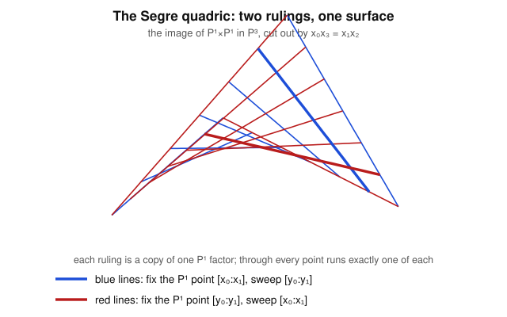

# Algebraic Geometry · Lesson 2.5: Morphisms of projective varieties

> ⏱ ~15 min · Module 2: Projective varieties & morphisms · Builds on: [Lesson 2.4](02-04-projective-varieties-homogeneous-nullstellensatz.md), [Lesson 2.3](02-03-projective-space.md), [Lesson 2.2](02-02-regular-rational-maps.md) · Unlocks: [Lesson 3.1](03-01-dimension.md) (dimension)

## Why this matters

We can now build varieties inside $\mathbb{P}^n$ (Lesson 2.4). The next question is the one that turns a pile of objects into a *category*: what is a **map** between them? In affine land a morphism was "polynomials in, polynomials out" (Lesson 2.2). Projectively that can't be literal — a point has no canonical coordinates, only coordinates up to scaling — so we have to say what a well-defined map *in homogeneous coordinates* even means. The reward is enormous: two named maps, the **Veronese** and the **Segre**, let us fold high-degree geometry into linear geometry and give the product $\mathbb{P}^m\times\mathbb{P}^n$ a projective structure it doesn't obviously have. These aren't curiosities — the Veronese is why "a conic is a line in disguise," and the Segre underlies every statement about bilinear forms, rank, and product varieties you'll ever meet.

## The idea

A point of $\mathbb{P}^n$ is a nonzero vector *up to scaling*: $[a_0:\dots:a_n]=[\lambda a_0:\dots:\lambda a_n]$ for all $\lambda\neq 0$. So if you want to send it somewhere in $\mathbb{P}^m$ by plugging into polynomials $F_0,\dots,F_m$, two things must hold. First, the output must survive scaling: replacing the input by $\lambda\cdot$(input) should only *rescale* the output, never move it to a different projective point. That forces every $F_i$ to be **homogeneous of one common degree $d$** — then $F_i(\lambda a)=\lambda^d F_i(a)$, and the shared factor $\lambda^d$ dies in $\mathbb{P}^m$. Second, the output $[F_0(a):\dots:F_m(a)]$ has to be an actual point, i.e. not all zero — so the $F_i$ must have **no common zero** on the source.

That's the whole definition of a map $\mathbb{P}^n\to\mathbb{P}^m$: a list of same-degree homogeneous polynomials with no common zero. Everything else in this lesson is two brilliant choices of such a list.

**Veronese:** take *all* monomials of degree $d$ as your $F_i$. Plugging a point in loses no information (you can recover the ratios of the original coordinates), so this *embeds* $\mathbb{P}^n$. The magic: a degree-$d$ hypersurface in the source becomes a single *linear* equation in the target, because each degree-$d$ monomial is now its own coordinate.

**Segre:** to multiply $\mathbb{P}^m\times\mathbb{P}^n$ into one projective space, use the products $x_iy_j$ as coordinates. A pair of points becomes the matrix $(x_iy_j)$ — a rank-$1$ matrix — and "rank $1$" is cut out by the vanishing of all $2\times2$ minors. So the product *is* a projective variety, carved out by quadrics.

## The formal version

Throughout $k=\bar k$. Write $\mathbb{P}^n$ with homogeneous coordinates $[x_0:\dots:x_n]$.

**Definition (morphism, local form).** A **morphism** $\varphi\colon X\to Y$ of projective varieties is a continuous map that is, near every point, given by regular functions in an affine chart — exactly the affine notion of Lesson 2.2 read chart-by-chart. Concretely for maps *into* $\mathbb{P}^m$ we use the following packaged form.

**Definition (map by homogeneous forms).** Let $F_0,\dots,F_m\in k[x_0,\dots,x_n]$ be homogeneous **of the same degree $d$**, with no common zero on $X\subseteq\mathbb{P}^n$ (i.e. $V_+(F_0,\dots,F_m)\cap X=\varnothing$). Then
$$\varphi\colon X\to\mathbb{P}^m,\qquad \varphi([a])=[F_0(a):\dots:F_m(a)]$$
is a morphism.

*In words:* same-degree forms with no shared zero on $X$ define an honest map, because scaling the input by $\lambda$ multiplies every output coordinate by the *same* $\lambda^d$, which is invisible in $\mathbb{P}^m$.

*Why it's well-defined.* If $[a]=[b]$ then $b=\lambda a$ with $\lambda\neq0$, so $F_i(b)=F_i(\lambda a)=\lambda^d F_i(a)$; hence $[F_0(b):\dots:F_m(b)]=[\lambda^d F_0(a):\dots:\lambda^d F_m(a)]=[F_0(a):\dots:F_m(a)]$. The "no common zero" clause guarantees the output vector is nonzero, so it names a genuine point. $\blacksquare$

One warning built into the definition: a *single* tuple of forms may fail to have "no common zero," yet the map still exist as a morphism because near a bad point you can switch to a **different** tuple that agrees where both are defined (multiply through, cancel). We'll see this in the Veronese inverse. The clean packaged form above is *sufficient*, not the full story.

**Definition (Veronese embedding).** Fix $n,d\ge1$ and let $M_0,\dots,M_N$ be *all* monomials of degree $d$ in $x_0,\dots,x_n$, where
$$N=\binom{n+d}{d}-1.$$
The **Veronese map** is $\nu_d\colon\mathbb{P}^n\hookrightarrow\mathbb{P}^N$, $[a]\mapsto[M_0(a):\dots:M_N(a)]$. Its image is the **Veronese variety**.

*In words:* record every degree-$d$ monomial of the point at once; the count $\binom{n+d}{d}$ is just the number of such monomials.

$\nu_d$ has no common zero (some monomial, e.g. $x_i^d$ for whichever $a_i\neq0$, is nonzero) and is injective — it separates points and is an isomorphism onto its image. Its defining feature: **degree-$d$ hypersurfaces pull back to hyperplanes.** If $G=\sum c_\alpha x^\alpha$ is homogeneous of degree $d$, then on the image $G=0$ becomes the *linear* equation $\sum c_\alpha z_\alpha=0$ in the target coordinates $z_\alpha$.

**Definition (Segre embedding).** The **Segre map** is
$$\sigma\colon\mathbb{P}^m\times\mathbb{P}^n\hookrightarrow\mathbb{P}^{(m+1)(n+1)-1},\qquad ([x],[y])\mapsto[\,x_iy_j\,]_{0\le i\le m,\,0\le j\le n}.$$
Its image, the **Segre variety** $\Sigma_{m,n}$, is cut out by the $2\times2$ minors of the matrix $Z=(z_{ij})$: $\;z_{ij}z_{kl}-z_{il}z_{kj}=0$.

*In words:* the coordinates of the product are all products $x_iy_j$; arranged as a matrix these have rank $1$, and "rank $\le1$" is exactly "all $2\times2$ minors vanish."

This is what *gives* $\mathbb{P}^m\times\mathbb{P}^n$ its structure as a projective variety — the product is not a priori sitting in any $\mathbb{P}^N$, and $\sigma$ is the embedding that puts it there. (The Zariski topology on the product is the subspace topology from $\Sigma_{m,n}$, strictly finer than the product topology.)

**Theorem (regular functions on a projective variety are constant).** If $X$ is an irreducible projective variety, every global regular function $X\to k$ is constant.

*In words:* the projective analog of Liouville's theorem — a projective variety is "compact," so a globally defined function with no poles can't vary. This is *why* interesting maps out of projective varieties land in another projective space, not in $\mathbb{A}^1$: there's nowhere for a nonconstant scalar function to go. (Compare $k(X)$ from [Lesson 2.1](02-01-rational-functions-function-field.md): rational functions are plentiful, but *globally regular* ones are not.)

## Picture

The Segre image $\sigma(\mathbb{P}^1\times\mathbb{P}^1)\subseteq\mathbb{P}^3$ is the quadric surface $V_+(x_0x_3-x_1x_2)$. Freezing the first factor $[x_0:x_1]$ and letting the second vary traces out a *straight line* on the surface (blue); freezing the second and varying the first traces the other family (red). Through every point runs exactly one line of each ruling — a quadric surface is **doubly ruled**, and the two rulings are the two $\mathbb{P}^1$ factors made visible.

## Worked examples

**Example 1 (the degree-2 Veronese $\mathbb{P}^1\to\mathbb{P}^2$).** Take $n=1$, $d=2$. The degree-$2$ monomials in $x_0,x_1$ are $x_0^2,\,x_0x_1,\,x_1^2$, so $N=\binom{3}{2}-1=2$ and
$$\nu_2\colon\mathbb{P}^1\to\mathbb{P}^2,\qquad [s:t]\mapsto[s^2:st:t^2]=:[x:y:z].$$
No common zero: if $s\neq0$ then $s^2\neq0$, and if $t\neq0$ then $t^2\neq0$ — one of the two always holds. **Image lies on a conic:** with $x=s^2,\ y=st,\ z=t^2$,
$$xz=s^2t^2=(st)^2=y^2,\qquad\text{so } xz-y^2=0.$$
Thus $\nu_2(\mathbb{P}^1)\subseteq C:=V_+(xz-y^2)$. **Image is all of $C$:** given $[x:y:z]\in C$, at least one of $x,z$ is nonzero; say $x\neq0$. Then $[s:t]=[x:y]$ maps to $[x^2:xy:y^2]=[x^2:xy:xz]=x\cdot[x:y:z]=[x:y:z]$ (using $y^2=xz$). So $\nu_2$ surjects onto $C$, and one checks the two chart formulas $[s:t]=[x:y]$ (on $x\neq0$) and $[s:t]=[y:z]$ (on $z\neq0$) agree on the overlap since $[x:y]=[y:z]\iff xz=y^2$. Hence **$\nu_2$ is an isomorphism $\mathbb{P}^1\xrightarrow{\ \sim\ }C$: the smooth conic is a projective line in disguise.** Notice the payoff advertised above: the source conic-condition is invisible, and the degree-$2$ curve $C$ is *linearly* the image — its own coordinate hyperplane sections are the degree-$2$ divisors on $\mathbb{P}^1$.

**Example 2 (the Segre quadric $\mathbb{P}^1\times\mathbb{P}^1\to\mathbb{P}^3$).** Take $m=n=1$. With $[x_0:x_1]$ and $[y_0:y_1]$,
$$\sigma([x],[y])=[x_0y_0:x_0y_1:x_1y_0:x_1y_1]=:[z_{00}:z_{01}:z_{10}:z_{11}].$$
The single $2\times2$ minor of $\begin{pmatrix}z_{00}&z_{01}\\ z_{10}&z_{11}\end{pmatrix}$ is $z_{00}z_{11}-z_{01}z_{10}$, and indeed
$$z_{00}z_{11}-z_{01}z_{10}=(x_0y_0)(x_1y_1)-(x_0y_1)(x_1y_0)=x_0x_1y_0y_1-x_0x_1y_0y_1=0.$$
So the image lies in the quadric $Q=V_+(z_{00}z_{11}-z_{01}z_{10})$ — the surface $x_0x_3-x_1x_2$ of the Picture after renaming $(z_{00},z_{01},z_{10},z_{11})=(x_0,x_1,x_2,x_3)$. Conversely a rank-$1$ matrix $(z_{ij})$ factors as an outer product $x_i y_j$ with $[x],[y]$ recovered up to scale from any nonzero row/column, so $\sigma$ maps *onto* $Q$ bijectively. The **rulings** are literal: fixing $[x_0:x_1]=[1:0]$ gives $[y_0:y_1:0:0]$, the line $z_{10}=z_{11}=0$ in $Q$; fixing $[y_0:y_1]=[1:0]$ gives $[x_0:0:x_1:0]$, the line $z_{01}=z_{11}=0$. Two families of lines, one through each point — the doubly-ruled quadric.

## Watch out

- **You might think** any list of polynomials defines a projective map — **but** they must be *homogeneous of a single common degree* (else scaling the input changes the output point) *and* have *no common zero on the source* (else some point maps to the illegal $[0:\dots:0]$). Both conditions are essential.
- **You might think** a projective morphism is *globally* one fixed tuple of forms — **but** it need only be *locally* of that form. A map like $[s:t]\mapsto[s:t]$ extended over $\mathbb{P}^1$ can require *different* tuples on different charts that agree on overlaps; multiplying through by a coordinate and cancelling is the standard trick. (On $\mathbb{P}^1$ you can always clear to a single tuple; in higher dimension you sometimes genuinely cannot.)
- **You might think** the product $\mathbb{P}^m\times\mathbb{P}^n$ carries the product Zariski topology — **but** its topology is the one pulled back from the Segre embedding, which is *strictly finer*. The diagonal $V_+(z_{00}z_{11}-z_{01}z_{10})\cap\dots$ contains closed sets like $\{x=y\}$ that are not closed in the product topology.
- **You might think** you can build a nonconstant map $\mathbb{P}^n\to\mathbb{A}^1$ — **but** every global regular function on a projective variety is constant. Maps *out* of projective space go to other projective spaces.

## One-liner

> A projective morphism is a list of equal-degree forms with no common zero; the Veronese uses *all* degree-$d$ monomials to linearize hypersurfaces, and the Segre uses *all* products $x_iy_j$ to make the product a rank-$1$-matrix quadric.

## Problems

**P1 (🟢)** For $\nu_2\colon\mathbb{P}^1\to\mathbb{P}^2$, $[s:t]\mapsto[s^2:st:t^2]=[x:y:z]$: (a) find the three image points of $[1:0]$, $[0:1]$, $[1:1]$; (b) the line $\ell:\,x-z=0$ in $\mathbb{P}^2$ pulls back to which degree-$2$ equation in $s,t$, and what are its two roots in $\mathbb{P}^1$? (This is the "hypersurfaces $\to$ hyperplanes" slogan run in reverse.)

**P2 (🟡)** Compute the target dimension $N$ of the Veronese $\nu_3\colon\mathbb{P}^2\to\mathbb{P}^N$ (cubics in three variables). Then explain, in one sentence, why "the space of plane cubics is a $\mathbb{P}^9$" is the *same* count, and what a hyperplane section of the Veronese image corresponds to downstairs.

**P3 (🔴, optional)** Let $Q=V_+(z_{00}z_{11}-z_{01}z_{10})\subseteq\mathbb{P}^3$ be the Segre quadric. Prove directly (no appeal to $\sigma$ being a bijection) that through the point $p=[1:0:0:0]\in Q$ there pass exactly two lines lying entirely in $Q$, and identify them with the two rulings.

Solutions

**P1** (a) $[1:0]\mapsto[1^2:1\cdot0:0^2]=[1:0:0]$; $[0:1]\mapsto[0:0:1]$; $[1:1]\mapsto[1:1:1]$.
(b) The pullback of $x-z$ is $s^2-t^2$: substitute $x=s^2,z=t^2$, giving the degree-$2$ form $s^2-t^2=(s-t)(s+t)$. Its zeros in $\mathbb{P}^1$ are $[1:1]$ and $[1:-1]$. So the *line* $\ell$ meets the conic $C$ in two points, which pull back to these two points of $\mathbb{P}^1$ — a hyperplane upstairs = a degree-$2$ divisor (two points) downstairs, exactly the Veronese dictionary. (Consistency check: $[1:1]\mapsto[1:1:1]$ indeed satisfies $x-z=0$.)

**P2** Monomials of degree $3$ in $x_0,x_1,x_2$ number $\binom{2+3}{3}=\binom{5}{3}=10$, so $N=10-1=9$: $\nu_3\colon\mathbb{P}^2\hookrightarrow\mathbb{P}^9$. A plane cubic is $\sum_{|\alpha|=3}c_\alpha x^\alpha$, determined by its $10$ coefficients $c_\alpha$ up to overall scale — i.e. a point of $\mathbb{P}^9$; same $10$ monomials, same count. Under $\nu_3$ a cubic curve $\{\sum c_\alpha x^\alpha=0\}\subseteq\mathbb{P}^2$ becomes the *hyperplane* $\{\sum c_\alpha z_\alpha=0\}$ intersected with the Veronese image: **hyperplane sections of the Veronese variety $\leftrightarrow$ cubic curves in the plane.** (This is the trick behind linear systems: nonlinear curves become linear slices.)

**P3** A line through $p=[1:0:0:0]$ has the form $L=\{[\,1:as:bs:cs\,]\}$ direction-parametrized, more cleanly: write a general line through $p$ as $\{s\cdot p + t\cdot q : [s:t]\in\mathbb{P}^1\}$ for some $q=[q_0:q_1:q_2:q_3]\neq p$. Points on it are $[s+tq_0:tq_1:tq_2:tq_3]$. Plug into $F=z_{00}z_{11}-z_{01}z_{10}$:
$$F=(s+tq_0)(tq_3)-(tq_1)(tq_2)=t\big[s\,q_3 + t(q_0q_3-q_1q_2)\big].$$
For $L\subseteq Q$ we need this to vanish for *all* $[s:t]$, i.e. the bracket $\equiv 0$ as a form in $s,t$. The coefficient of $st$ (from $s\,q_3\cdot t$) forces $q_3=0$; the coefficient of $t^2$ then forces $q_0q_3-q_1q_2=-q_1q_2=0$, so $q_1=0$ or $q_2=0$. Thus (taking $q_0=0$ WLOG since adding a multiple of $p$ doesn't change the line):
- $q=[0:1:0:0]$: the line $z_{10}=z_{11}=0$, i.e. $\{[s:t:0:0]\}$ — one ruling;
- $q=[0:0:1:0]$: the line $z_{01}=z_{11}=0$, i.e. $\{[s:0:t:0]\}$ — the other ruling.

Exactly two lines, and they are the two rulings meeting at $p$. $\blacksquare$

## Flashback

**From [Lesson 2.4](02-04-projective-varieties-homogeneous-nullstellensatz.md) (projective varieties & homogenization):** Let $C\subseteq\mathbb{A}^2$ be the affine cubic $y=x^3$. (a) Homogenize its defining polynomial with respect to $z$ (the chart $z=1$) to get a homogeneous $F(x,y,z)$, and write the projective closure $\bar C=V_+(F)\subseteq\mathbb{P}^2$. (b) Find the points of $\bar C$ **at infinity** (the line $z=0$). (c) Why must every homogeneous ideal you'd use to cut out a nonempty projective variety avoid being the whole irrelevant ideal $\mathfrak{m}=(x,y,z)$?

Solution

(a) Write the affine equation as $y-x^3=0$. Its top degree is $3$; homogenize by inserting powers of $z$ to make every term degree $3$: $y\cdot z^2 - x^3=0$, so $F(x,y,z)=x^3-yz^2$ and $\bar C=V_+(x^3-yz^2)$. Check: setting $z=1$ recovers $x^3-y=0$, i.e. $y=x^3$. ✓

(b) At infinity means $z=0$. Then $F=x^3-y\cdot0=x^3$, so $x^3=0\Rightarrow x=0$. With $z=0,x=0$ the remaining coordinate $y\neq0$, giving the single point $[0:1:0]$. So the projective cubic $y=x^3$ acquires **one point at infinity**, $[0:1:0]$ (the "vertical direction"), where the curve heads off as $x\to\infty$.

(c) By the *homogeneous* Nullstellensatz, $V_+(J)=\varnothing$ iff $J\supseteq\mathfrak{m}=(x,y,z)$ up to radical (the irrelevant ideal cuts out the empty projective variety, since the only common zero of $x,y,z$ is the origin $0\in\mathbb{A}^{n+1}$, which is *not* a point of $\mathbb{P}^n$). So to describe a **nonempty** projective variety your homogeneous ideal must have a homogeneous zero other than the origin — equivalently, its radical must not contain $\mathfrak{m}$. This is the projective correction to the affine Nullstellensatz: over $\mathbb{P}^n$ the irrelevant ideal plays the role the unit ideal $(1)$ played in $\mathbb{A}^n$. $\blacksquare$

## Connections

- **Backward:** this is the projective upgrade of regular maps from [Lesson 2.2](02-02-regular-rational-maps.md) — "same-degree forms, no common zero" is what "regular in each chart" (Lesson 2.4's charts) becomes when you demand scale-invariance. The Veronese isomorphism $\mathbb{P}^1\cong C$ is the promised payoff of the projective-closure machinery of [Lesson 2.4](02-04-projective-varieties-homogeneous-nullstellensatz.md).
- **Forward:** [Lesson 3.1](03-01-dimension.md) asks how big these varieties are — the Segre variety $\Sigma_{m,n}$ has dimension $m+n$ (a product's dimensions add), and the Veronese $\nu_d(\mathbb{P}^n)$ still has dimension $n$ despite living in a huge $\mathbb{P}^N$; the tools of this lesson set that up. The "regular functions are constant" theorem is the seed of why *complete* varieties behave like compact spaces.
- **Sideways (`abstract-algebra`):** the Segre equations are precisely "a matrix has rank $\le 1$ $\iff$ all $2\times2$ minors vanish" — the determinantal ideal you met with rings and ideals, now realized as the ideal of a variety.
- **Sideways (`complex-analysis`):** "every global regular function on a projective variety is constant" is the algebraic mirror of **Liouville's theorem** — a bounded (here: pole-free, on a compact space) holomorphic function is constant. Projective varieties over $\mathbb{C}$ are compact complex manifolds, and this is the same rigidity seen through two lenses.
