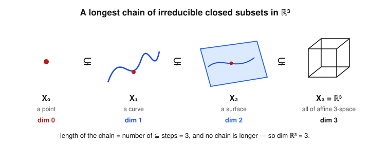

# Algebraic Geometry · Lesson 3.1: Dimension of a variety

> ⏱ ~15 min · Module 3: Local structure — dimension, smoothness & sheaves · Builds on: [Lesson 1.4](01-04-zariski-topology-irreducibility.md) (irreducibility), [Lesson 1.6](01-06-coordinate-ring-polynomial-maps.md) (coordinate ring), [Lesson 2.1](02-01-rational-functions-function-field.md) (function field) · Unlocks: [Lesson 3.2](03-02-local-rings-localization.md) (local rings)

## Why this matters

"Dimension" is the first number you want to attach to any shape — a curve is $1$-dimensional, a surface is $2$-dimensional — and your intuition already knows the answers. The trouble is that a variety has no metric, no notion of "small ball," and lives inside an ambient $\mathbb{A}^n$ whose $n$ is *not* the answer (the twisted cubic sits in $\mathbb{A}^3$ but is a curve). So we need a definition of dimension built purely from the two things a variety comes with: its Zariski topology and its ring of functions. Remarkably, three very different-looking definitions — one topological, one ring-theoretic, one field-theoretic — all give the same number. That agreement is the backbone of every later dimension count: the degree of a hypersurface, the dimension of a tangent space at a smooth point, the "$\dim L(D)$" in Riemann–Roch.

## The idea

Three honest ways to say "how many independent directions does $X$ have?"

1. **Stack subvarieties.** In $\mathbb{A}^3$ you can nest a point inside a curve inside a surface inside all of space: $\{p\}\subsetneq C\subsetneq S\subsetneq\mathbb{A}^3$. Each step goes up by one honest dimension, and you can't do better than three steps. So **dimension = the length of the longest such tower of irreducible closed subsets.** Purely topological — no coordinates.

2. **Translate the tower into algebra.** The $V$–$I$ dictionary turns each irreducible closed subset into a prime ideal and *reverses* inclusions. A tower of subvarieties becomes a tower of primes. So the same number is the **longest chain of prime ideals in the coordinate ring** — its *Krull dimension*.

3. **Count free coordinates.** A point of a curve is pinned by one parameter; a point of a surface needs two. Algebraically: the function field $k(X)$ is generated by the coordinate functions, but they satisfy relations. **Dimension = the number of them that are genuinely algebraically independent** — the *transcendence degree* $\operatorname{trdeg}_k k(X)$.

The first two match almost for free (the dictionary is literally built to reverse inclusions). The third matching the others is the deep theorem — it says the geometry (towers) and the field theory (free coordinates) compute the same integer, and it is what makes dimension *computable*: you rarely find longest towers by hand, but you can always count independent coordinates.

## The formal version

Throughout, $k=\bar k$ and $X$ is an irreducible affine variety with coordinate ring $k[X]=k[x_1,\dots,x_n]/I(X)$ (a finitely generated domain, since $I(X)$ is prime — [Lesson 1.4](01-04-zariski-topology-irreducibility.md)) and function field $k(X)=\operatorname{Frac}k[X]$ ([Lesson 2.1](02-01-rational-functions-function-field.md)).

**Definition (topological dimension).** $\dim X$ is the supremum of all integers $d$ for which there is a chain of irreducible closed subsets
$$X_0\subsetneq X_1\subsetneq\dots\subsetneq X_d\subseteq X .$$

*In words:* the longest strictly-growing tower of subvarieties you can stack inside $X$; its **length** is the number of $\subsetneq$ steps, one less than the number of terms.

**Definition (Krull dimension).** For a ring $R$, $\dim R$ is the supremum of $d$ for which there is a chain of prime ideals
$$\mathfrak p_0\subsetneq\mathfrak p_1\subsetneq\dots\subsetneq\mathfrak p_d\subseteq R .$$

*In words:* the longest strictly-growing tower of primes.

**Definition (transcendence degree).** $\operatorname{trdeg}_k k(X)$ is the size of a maximal set of elements of $k(X)$ that are *algebraically independent* over $k$ (no nonzero polynomial over $k$ vanishes on them). Equivalently: $k(X)$ is an algebraic extension of a purely transcendental subfield $k(t_1,\dots,t_d)$, and $d$ is well-defined.

*In words:* how many independent "coordinates" the points of $X$ really have.

**Theorem (the three agree).** For $X$ an irreducible affine variety over $k=\bar k$,
$$\dim X \;=\; \dim k[X] \;=\; \operatorname{trdeg}_k k(X).$$

**Why $\dim X=\dim k[X]$ (the easy equality).** The $V$–$I$ correspondence, restricted to $X$ and combined with the Nullstellensatz ([Lesson 1.5](01-05-nullstellensatz.md)), is an *order-reversing bijection*
$$\{\text{irreducible closed subsets of }X\}\;\longleftrightarrow\;\{\text{prime ideals of }k[X]\},\qquad Y\mapsto I(Y)/I(X).$$
(Closed subset $\leftrightarrow$ radical ideal; irreducible $\leftrightarrow$ prime, from [Lesson 1.4](01-04-zariski-topology-irreducibility.md).) A chain $X_0\subsetneq\dots\subsetneq X_d$ maps to a *reversed* chain of primes $\mathfrak p_0\supsetneq\dots\supsetneq\mathfrak p_d$ of the same length, and conversely. Taking suprema, the two dimensions are equal. $\blacksquare$

**Why $\dim k[X]=\operatorname{trdeg}_k k(X)$ (the deep equality — sketch).** This is the Noether-normalization input. **Noether normalization** says: for a finitely generated domain $A=k[X]$ there exist algebraically independent $y_1,\dots,y_d\in A$ such that $A$ is a *module-finite* extension of the polynomial ring $k[y_1,\dots,y_d]$ (i.e. finitely generated as a module). Then:

- $d=\operatorname{trdeg}_k k(X)$, because $k(X)$ is algebraic over $k(y_1,\dots,y_d)$ (finite ring extension $\Rightarrow$ algebraic field extension), and the $y_i$ are independent.
- A module-finite extension of domains preserves Krull dimension (the going-up and incomparability theorems: primes of $A$ lie over primes of $k[\underline y]$ with chains matching), so $\dim A=\dim k[y_1,\dots,y_d]$.
- And $\dim k[y_1,\dots,y_d]=d$: the chain $(0)\subsetneq(y_1)\subsetneq(y_1,y_2)\subsetneq\dots\subsetneq(y_1,\dots,y_d)$ gives $\dim\ge d$, and $\dim\le d$ is the nontrivial half (it is *itself* a form of this theorem for polynomial rings).

Chaining the two equalities: all three numbers equal $d$. $\blacksquare$

**Corollaries (the values you memorize).**

- $\dim\mathbb{A}^n=n$: here $k[X]=k[x_1,\dots,x_n]$, function field $k(x_1,\dots,x_n)$, trdeg $n$.
- $\dim\mathbb{P}^n=n$: its function field is $k(x_1/x_0,\dots,x_n/x_0)$, again $n$ independent ratios.
- **A hypersurface has dimension $n-1$:** if $f\in k[x_1,\dots,x_n]$ is nonconstant and irreducible, $\dim V(f)=n-1$ (one polynomial relation kills exactly one degree of freedom — proved in P3).
- A single point has dimension $0$ ($k[X]=k$, no free coordinate); a finite set is $0$-dimensional.

**Dimension is a birational invariant.** Since $\dim X=\operatorname{trdeg}_k k(X)$ depends *only on the function field*, and a birational equivalence $X\dashrightarrow Y$ is exactly a $k$-isomorphism $k(X)\cong k(Y)$ ([Lesson 2.2](02-02-regular-rational-maps.md)), birational varieties have equal dimension. In particular every variety birational to $\mathbb{A}^n$ (a *rational* variety) has dimension $n$.

## Picture

The topological definition made visible: each $\subsetneq$ is one honest dimension of growth. The tower has three steps and none is longer, so $\dim\mathbb{A}^3=3$. Under the $V$–$I$ dictionary this same tower reads as a length-$3$ chain of primes $(0)\subsetneq(x_3)\subsetneq(x_2,x_3)\subsetneq(x_1,x_2,x_3)$ in $k[x_1,x_2,x_3]$ — the topological and algebraic pictures are the one theorem seen from two sides.

## Worked examples

**Example 1 — $\mathbb{A}^2$, all three ways.** Let $X=\mathbb{A}^2$, so $k[X]=k[x,y]$ and $k(X)=k(x,y)$.

- *Transcendence degree.* $x,y$ are algebraically independent over $k$ (no nonzero polynomial in two variables is the zero polynomial), and they generate $k(x,y)$, so $\operatorname{trdeg}_k k(x,y)=2$.
- *Krull.* The chain of primes $(0)\subsetneq(x)\subsetneq(x,y)$ has length $2$, so $\dim k[x,y]\ge 2$; the theorem caps it at trdeg $=2$, so it *equals* $2$.
- *Topological.* Dictionary-dual to the prime chain: $\{(0,0)\}\subsetneq V(x)\subsetneq \mathbb{A}^2$ — point $\subsetneq$ the $y$-axis $\subsetneq$ the plane. Length $2$.

All three give $\boxed{2}$.

**Example 2 — a plane curve.** Let $C=V(y-x^2)\subseteq\mathbb{A}^2$, the parabola (irreducible: $y-x^2$ is degree $1$ in $y$, hence prime).

- *Coordinate ring / trdeg.* $k[C]=k[x,y]/(y-x^2)\cong k[x]$ via $y\mapsto x^2$ (substitute the relation). So $k(C)\cong k(x)$, and $\operatorname{trdeg}_k k(x)=1$.
- *Krull.* $\dim k[x]=1$: primes are $(0)$ and the maximal ideals $(x-a)$, giving the chain $(0)\subsetneq(x-a)$ — length $1$, and none longer in a PID.
- *Topological.* $\{p\}\subsetneq C$ for any point $p\in C$: a point inside the curve. Length $1$.

All three give $\boxed{1}$ — and $1=n-1$ with $n=2$, the hypersurface rule. *Any* irreducible plane curve is $1$-dimensional, for the same reason.

**Example 3 — the twisted cubic.** Let $X=V(y-x^2,\,z-x^3)\subseteq\mathbb{A}^3$, the image of $t\mapsto(t,t^2,t^3)$.

- *Coordinate ring / trdeg.* The map $k[x,y,z]\to k[t]$, $x\mapsto t,\ y\mapsto t^2,\ z\mapsto t^3$, is surjective with kernel exactly $(y-x^2,z-x^3)$, so $k[X]\cong k[t]$ (this is Boss-problem-1 territory). Hence $k(X)\cong k(t)$ and $\operatorname{trdeg}_k k(X)=1$.
- *Krull.* $\dim k[t]=1$, exactly as in Example 2.
- *Topological.* $\{p\}\subsetneq X$: a point inside the curve, length $1$.

All three give $\boxed{1}$. The variety lives in $\mathbb{A}^3$, yet its dimension is $1$ — dimension is *intrinsic*, not the ambient $n$. Note also $X\cong\mathbb{A}^1$ here, so birational invariance instantly recovers $\dim X=\dim\mathbb{A}^1=1$.

## Watch out

- **You might think** dimension is the number of terms in the tower — **actually** it's the number of $\subsetneq$ *steps*. The chain $\{p\}\subsetneq C\subsetneq S\subsetneq\mathbb{A}^3$ has four terms but length $3$, so $\dim=3$.
- **You might think** a variety in $\mathbb{A}^n$ has dimension close to $n$ — **actually** the ambient $n$ is irrelevant. The twisted cubic and the parabola are both curves ($\dim 1$) regardless of whether they sit in $\mathbb{A}^2$ or $\mathbb{A}^3$. Only the intrinsic function field matters.
- **You might think** more coordinate generators means bigger dimension — **actually** trdeg counts the *independent* ones. $k[X]\cong k[t]$ for the twisted cubic is generated by three functions $x,y,z$, but $y=x^2,z=x^3$ are algebraic over $x$, so only one is free.
- **You might confuse** Krull dimension with vector-space dimension: $k[x]$ is infinite-dimensional as a $k$-vector space but has Krull dimension $1$. Krull dimension counts *prime chains*, not a basis.

## One-liner

> Dimension is the length of the longest tower of subvarieties = the longest chain of primes in $k[X]$ = the number of algebraically independent coordinates in $k(X)$ — one integer, three faces, and it only depends on the function field.

## Problems

**P1 (🟢)** Let $X=V(z-xy)\subseteq\mathbb{A}^3$, the graph of $z=xy$. Compute $\dim X$ (a) by identifying $k[X]$ and reading off $\operatorname{trdeg}_k k(X)$, and (b) by exhibiting a chain of irreducible closed subsets of $X$ realizing that length. Confirm the hypersurface rule.

**P2 (🟡)** Let $Y\subsetneq X$ be irreducible varieties with $Y$ a *proper* closed subset of the irreducible variety $X$. Prove $\dim Y<\dim X$. (Hint: extend a longest tower inside $Y$ by one more step.)

**P3 (🔴, optional)** Let $f\in k[x_1,\dots,x_n]$ be nonconstant and irreducible, so $V(f)$ is an irreducible hypersurface. Prove $\dim V(f)=n-1$ using transcendence degree. (Hint: the images $\bar x_i$ generate $k(V(f))$ and satisfy $f(\bar x)=0$; show some $n-1$ of them are algebraically independent.)

Solutions

**P1** (a) $k[X]=k[x,y,z]/(z-xy)\cong k[x,y]$ via $z\mapsto xy$ (substitute the relation, which is linear in $z$; the quotient is a domain, so $(z-xy)$ is prime and $X$ is irreducible). Hence $k(X)\cong k(x,y)$ and $\operatorname{trdeg}_k k(X)=2$, so $\dim X=2$.

(b) Transport the prime chain $(0)\subsetneq(x)\subsetneq(x,y)$ of $k[x,y]$ back through the isomorphism, or directly stack subvarieties of $X$: take the origin $\{(0,0,0)\}\subsetneq \{x=0,\,z=0\}=\{(0,y,0):y\in k\}\subsetneq X$. The middle set is the $y$-axis-in-$X$ (a line, irreducible), giving a length-$2$ tower point $\subsetneq$ line $\subsetneq X$. So $\dim X\ge 2$, matching (a): $\dim X=2$. This is $n-1$ with $n=3$ — $V(z-xy)$ is an irreducible hypersurface. ✓

**P2** Let $d=\dim Y$ and pick a longest tower of irreducible closed subsets of $Y$:
$$Y_0\subsetneq Y_1\subsetneq\dots\subsetneq Y_d=Y.$$
(The top term may be taken to be $Y$ itself: $Y$ is irreducible and closed in $Y$, and appending it to any tower not already ending at $Y$ only lengthens it, so a longest tower ends at $Y$.) Each $Y_i$ is closed in $Y$ and $Y$ is closed in $X$, so each $Y_i$ is closed in $X$, and each is irreducible. Since $Y\subsetneq X$ properly, we may append $X$:
$$Y_0\subsetneq Y_1\subsetneq\dots\subsetneq Y_d=Y\subsetneq X$$
is a tower of irreducible closed subsets of $X$ of length $d+1$. Therefore $\dim X\ge d+1=\dim Y+1>\dim Y$. $\blacksquare$

**P3** Since $f$ is irreducible, $(f)$ is prime in the UFD $k[x_1,\dots,x_n]$, so $A:=k[x_1,\dots,x_n]/(f)$ is a domain and $V(f)$ is irreducible with $k[V(f)]=A$. Let $\bar x_i$ be the image of $x_i$; these generate $A$, hence generate the function field $K=k(V(f))=\operatorname{Frac}(A)$ over $k$. They satisfy the nontrivial relation $f(\bar x_1,\dots,\bar x_n)=0$, so the full set $\{\bar x_1,\dots,\bar x_n\}$ is algebraically *dependent*; thus $\operatorname{trdeg}_k K\le n-1$.

For the reverse, $f$ is nonconstant, so it genuinely involves some variable — relabel so that $\deg_{x_n}f\ge 1$. Claim: $\bar x_1,\dots,\bar x_{n-1}$ are algebraically independent. Suppose $g(\bar x_1,\dots,\bar x_{n-1})=0$ in $A$ for some polynomial $g$ in $n-1$ variables. Then $g(x_1,\dots,x_{n-1})\in(f)$, i.e. $f\mid g$ in $k[x_1,\dots,x_n]$. But $g$ does not involve $x_n$ ($\deg_{x_n}g=0$), while every nonzero multiple $hf$ has $\deg_{x_n}(hf)\ge\deg_{x_n}f\ge 1$. The only escape is $g=0$. Hence $\bar x_1,\dots,\bar x_{n-1}$ are algebraically independent, giving $\operatorname{trdeg}_k K\ge n-1$.

Combining, $\operatorname{trdeg}_k K=n-1$, so $\dim V(f)=n-1$. $\blacksquare$

## Flashback

**From [Lesson 2.2](02-02-regular-rational-maps.md) (birational maps) & [Lesson 2.1](02-01-rational-functions-function-field.md) (the function field):** A birational equivalence $X\dashrightarrow Y$ induces a $k$-isomorphism $k(X)\cong k(Y)$. Use this to compute the dimension of the *cuspidal cubic* $C=V(y^2-x^3)\subseteq\mathbb{A}^2$ without touching a prime chain, and confirm $C$ is a curve.

Solution

Parametrize $C$ by $\varphi:\mathbb{A}^1\dashrightarrow C$, $t\mapsto(t^2,t^3)$ (indeed $(t^3)^2=(t^2)^3$, so the image lands in $C$). A rational inverse is $\psi:C\dashrightarrow\mathbb{A}^1$, $(x,y)\mapsto y/x$: on $C$ where $x\ne0$,
$$\frac{y}{x}=\frac{t^3}{t^2}=t,$$
so $\psi\circ\varphi=\mathrm{id}$ on a dense open set, and $\varphi$ is birational. Concretely, setting $s=y/x\in k(C)$, the relation $y^2=x^3$ gives $s^2=y^2/x^2=x^3/x^2=x$, hence $x=s^2$ and $y=sx=s^3$; therefore
$$k(C)=k(x,y)=k(s)\cong k(t).$$
Since dimension is a birational invariant (it is $\operatorname{trdeg}_k$ of the function field), $\dim C=\operatorname{trdeg}_k k(t)=1$. So the cuspidal cubic is a curve — dimension $1$ — even though it is *not* isomorphic to $\mathbb{A}^1$ (the cusp at the origin is singular; birational is weaker than isomorphic). This is also the hypersurface rule: $C=V(y^2-x^3)$ with $y^2-x^3$ irreducible, $n=2$, so $\dim=n-1=1$. ✓

## Connections

- **Backward:** this rests entirely on the $V$–$I$ dictionary and prime $\leftrightarrow$ irreducible from [Lesson 1.4](01-04-zariski-topology-irreducibility.md)/[1.5](01-05-nullstellensatz.md), the coordinate ring from [Lesson 1.6](01-06-coordinate-ring-polynomial-maps.md), and the function field from [Lesson 2.1](02-01-rational-functions-function-field.md). The three definitions are those objects measured three ways.
- **Forward:** [Lesson 3.2](03-02-local-rings-localization.md) localizes $k[X]$ at a point to get the local ring $\mathcal{O}_{X,p}$, whose Krull dimension is again $\dim X$ (dimension is local); [Lesson 3.3](03-03-tangent-space.md)/[3.4](03-04-smoothness-singularities-tangent-cone.md) call a point *smooth* exactly when the tangent space has dimension equal to $\dim X$ — the number defined here is the yardstick for smoothness. Divisors and Riemann–Roch ([Lesson 4.3](04-03-divisors-on-a-curve.md)–[4.5](04-05-riemann-roch.md)) live on curves, i.e. dimension-$1$ varieties.
- **Sideways (`abstract-algebra`):** Krull dimension, Noether normalization, and going-up are pure commutative algebra — the same machinery that governs integral extensions and Nullstellensatz proofs. **Sideways (`topology`):** the topological definition works for *any* sober space via irreducible closed sets, and is why $\dim$ is a genuine topological invariant of the Zariski space. **Sideways (`complex-analysis`):** for a complex curve, this algebraic $\dim 1$ is the *complex* dimension — the Riemann surface is real-$2$-dimensional, and $\operatorname{trdeg}_{\mathbb{C}}$ of its field of meromorphic functions is $1$, the bridge to genus and Riemann–Roch.
