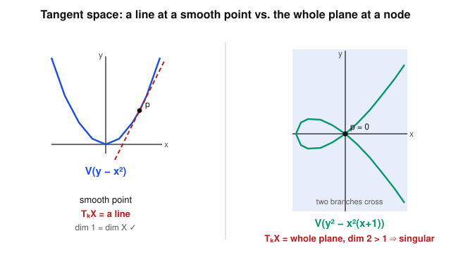

# Algebraic Geometry · Lesson 3.3: The tangent space

> ⏱ ~15 min · Module 3: Local structure — dimension, smoothness & sheaves · Builds on: [Lesson 3.1](03-01-dimension.md), [Lesson 3.2](03-02-local-rings-localization.md) · Unlocks: [Lesson 3.4](03-04-smoothness-singularities-tangent-cone.md)

## Why this matters

In calculus you linearize a function near a point to get its best linear approximation — the tangent line. Here we linearize a whole *variety*: replace the curved shape $X$ near $p$ by the flat vector space that best hugs it. The punchline is that this tangent space is computable two completely different ways — from **partial derivatives** (calculus you already know) and from the **local ring** (pure algebra, no derivatives in sight) — and they always agree. Its dimension is the single number that decides whether $p$ is a smooth point or a singular one, which is the entire subject of the next lesson. This is also the exact place where physics' "configuration space near equilibrium" and economics' "first-order conditions" live: a tangent space is a linearized constraint.

## The idea

Take $X=V(f_1,\dots,f_r)\subseteq\mathbb{A}^n$ and a point $p\in X$. Each equation $f_i=0$ is a curved constraint. Near $p$, replace it by its **linear approximation**: $f_i(p+v)\approx f_i(p)+(\text{linear part in }v)$. Since $f_i(p)=0$, the constraint "$f_i$ vanishes to first order in the direction $v$" is a single *linear* equation in $v$. The tangent space is the set of directions $v$ satisfying all of them at once — a linear subspace of $k^n$. Geometrically: at a smooth point of a curve you get a line; at a smooth point of a surface, a plane.

Now the twist that makes this algebraic geometry and not calculus. A "direction in which every function's first-order change is recorded" is exactly a **linear functional on functions-vanishing-at-$p$, modulo functions vanishing to second order.** That quotient, $\mathfrak{m}_p/\mathfrak{m}_p^2$, lives purely inside the local ring $\mathcal{O}_{X,p}$ from [Lesson 3.2](03-02-local-rings-localization.md) — no coordinates, no derivatives. Its dual is the tangent space. So the *shape* of $X$ near $p$ and the *algebra* of the local ring are two faces of one object.

## The formal version

Fix $k=\bar k$, $X=V(f_1,\dots,f_r)\subseteq\mathbb{A}^n$, and $p=(p_1,\dots,p_n)\in X$.

**Definition (geometric / Jacobian tangent space).** The **Jacobian** of $(f_1,\dots,f_r)$ at $p$ is the $r\times n$ matrix
$$J_p=\left(\frac{\partial f_i}{\partial x_j}(p)\right)_{i,j},$$
and the tangent space is its kernel:
$$T_pX=\ker J_p=\Big\{\,v\in k^n:\ \sum_{j=1}^n \frac{\partial f_i}{\partial x_j}(p)\,v_j=0\ \text{ for all }i\,\Big\}.$$

*In words:* linearize each defining equation at $p$; a tangent vector is a direction killed by every linearized equation. (Partial derivatives of polynomials are purely formal — $\partial(x^m)/\partial x=mx^{m-1}$ — so this needs no limits and works over any field.)

Why this is the right linear part: for each $f_i$, Taylor-expand around $p$ with $x=p+v$,
$$f_i(p+v)=\underbrace{f_i(p)}_{=0}+\sum_{j}\frac{\partial f_i}{\partial x_j}(p)\,v_j+\big(\text{terms of order}\ge 2\text{ in }v\big).$$
The linear coefficient vector is exactly the $i$-th row of $J_p$; setting it to zero is "the constraint holds to first order."

**Definition (Zariski cotangent and tangent space).** Let $\mathcal{O}_{X,p}$ be the local ring at $p$ with maximal ideal $\mathfrak{m}_p$ (functions vanishing at $p$). The **cotangent space** is the $k$-vector space $\mathfrak{m}_p/\mathfrak{m}_p^2$, and the **Zariski tangent space** is its dual
$$T_pX=(\mathfrak{m}_p/\mathfrak{m}_p^2)^*=\operatorname{Hom}_k(\mathfrak{m}_p/\mathfrak{m}_p^2,\,k).$$

*In words:* $\mathfrak{m}_p/\mathfrak{m}_p^2$ is "functions vanishing at $p$, forgetting everything past their first-order behavior" — the space of differentials $df_p$; a tangent vector is a rule that eats such a differential and returns a number (a directional derivative).

That $\mathfrak{m}_p/\mathfrak{m}_p^2$ is a $k$-vector space is automatic: it is a module over $\mathcal{O}_{X,p}/\mathfrak{m}_p\cong k$ (the residue field, by [Lesson 3.2](03-02-local-rings-localization.md)), since $\mathfrak{m}_p$ acts as zero on it.

**Theorem (the two agree).** There is a canonical isomorphism $\ker J_p\ \cong\ (\mathfrak{m}_p/\mathfrak{m}_p^2)^*$. In particular
$$\dim_k T_pX=n-\operatorname{rank}J_p=\dim_k \mathfrak{m}_p/\mathfrak{m}_p^2.$$

*In words:* the Jacobian computes $\mathfrak{m}/\mathfrak{m}^2$; derivatives and the local ring give the same number.

*Sketch.* A vector $v\in k^n$ defines the **directional derivative** $D_v:k[x_1,\dots,x_n]\to k$, $D_v(g)=\sum_j v_j\,\partial g/\partial x_j(p)$. This is a *point derivation*: it is $k$-linear and satisfies Leibniz $D_v(gh)=g(p)D_v(h)+h(p)D_v(g)$. It descends to the coordinate ring $k[X]=k[x]/I(X)$ — i.e. kills $I(X)$ — precisely when $D_v(f_i)=0$ for all generators, which is $v\in\ker J_p$. Any point derivation kills constants (from Leibniz on $1=1\cdot1$) and kills $\mathfrak{m}_p^2$ (Leibniz again, since both factors vanish at $p$), so it restricts to a linear functional on $\mathfrak{m}_p/\mathfrak{m}_p^2$; conversely every such functional comes from a unique derivation. Thus $\ker J_p\cong\{\text{point derivations at }p\}\cong(\mathfrak{m}_p/\mathfrak{m}_p^2)^*$. $\blacksquare$

**Dimension bound (the smoothness inequality).** Always
$$\dim_k T_pX\ \ge\ \dim_p X,$$
where $\dim_p X$ is the dimension of the component through $p$ ([Lesson 3.1](03-01-dimension.md)). *Reason:* $\dim_k\mathfrak{m}_p/\mathfrak{m}_p^2$ equals the minimal number of generators of $\mathfrak{m}_p$ (Nakayama), and a local ring of Krull dimension $d$ needs at least $d$ generators for its maximal ideal. **Equality is the definition of a smooth (nonsingular) point** — the whole story of [Lesson 3.4](03-04-smoothness-singularities-tangent-cone.md). When $\dim_k T_pX>\dim_p X$, the point is **singular**: the variety is "too curved to linearize into the right dimension."

## Picture

Left: at the smooth point $p$ of the parabola $V(y-x^2)$, the linearized equation cuts $k^2$ down to a **line** — $\dim T_pX=1=\dim X$. Right: at the node of $V(y^2-x^2(x+1))$ the Jacobian vanishes entirely, imposing *no* linear constraint, so the tangent space is the **whole plane** — $\dim T_pX=2>1$, the algebraic fingerprint of a singularity.

## Worked examples

**Example 1 (a smooth conic, both ways).** Let $X=V(f)$, $f=y-x^2\subseteq\mathbb{A}^2$ (a parabola — a conic), at $p=(1,1)\in X$.

*Jacobian way.* $\dfrac{\partial f}{\partial x}=-2x$, $\dfrac{\partial f}{\partial y}=1$, so $J_p=(-2,\ 1)$. Then
$$T_pX=\ker(-2,1)=\{(a,b):-2a+b=0\}=\operatorname{span}\{(1,2)\},\qquad \dim_k T_pX=1.$$
The tangent *line* sits at $p+T_pX$: $y-1=2(x-1)$ — slope $2$, exactly the calculus tangent to $y=x^2$ at $x=1$. Since $\dim X=1$ too, $p$ is smooth.

*Local-ring way.* In $k[X]=k[x,y]/(y-x^2)$ the maximal ideal at $p$ is $\mathfrak{m}_p=(x-1,\,y-1)$. Use the relation $y=x^2$:
$$y-1=x^2-1=(x-1)(x+1)=(x-1)\big((x-1)+2\big)=\underbrace{(x-1)^2}_{\in\ \mathfrak{m}_p^2}+\,2(x-1).$$
So modulo $\mathfrak{m}_p^2$, $\ y-1\equiv 2(x-1)$: the two apparent generators are *linearly dependent* in $\mathfrak{m}_p/\mathfrak{m}_p^2$, which is therefore spanned by the single class $[x-1]$. Hence $\dim_k\mathfrak{m}_p/\mathfrak{m}_p^2=1$ and its dual has dimension $1$ — agreeing perfectly with $\ker J_p$.

**Example 2 (the node — dimension jumps).** Let $X=V(f)$, $f=y^2-x^2(x+1)=y^2-x^2-x^3\subseteq\mathbb{A}^2$, at the origin $p=0$. (This curve is irreducible and $1$-dimensional.)

*Jacobian way.* $\dfrac{\partial f}{\partial x}=-2x-3x^2$, $\dfrac{\partial f}{\partial y}=2y$; at $0$ both vanish, so $J_0=(0,\ 0)$, $\operatorname{rank}J_0=0$, and
$$T_0X=\ker(0,0)=k^2,\qquad \dim_k T_0X=2.$$
Since $\dim X=1<2=\dim_k T_0X$, the origin is **singular**.

*Local-ring way.* Here $\mathfrak{m}_0=(x,y)$ in $k[X]=k[x,y]/(y^2-x^2-x^3)$. The only relation is $f=0$, and $f=y^2-x^2-x^3$ has **no linear part** — every term lies in $\mathfrak{m}_0^2$. So it imposes no linear relation between $x$ and $y$, and $\mathfrak{m}_0/\mathfrak{m}_0^2$ is spanned freely by $[x],[y]$: dimension $2$. Same answer. The lowest-degree part $y^2-x^2=(y-x)(y+x)$ splits into two distinct lines — the two branches you see crossing, the reason this singularity is called a **node** (contrast the cusp in P2 and the tangent cone in [Lesson 3.4](03-04-smoothness-singularities-tangent-cone.md)).

## Watch out

- **The tangent space is a vector space through the origin, not the tangent line sitting in $\mathbb{A}^n$.** $T_pX\subseteq k^n$ always contains $0$; the geometric tangent line/plane you'd draw is the *affine translate* $p+T_pX$. In Example 1, $T_pX=\operatorname{span}\{(1,2)\}$ passes through the origin; the drawn tangent $y-1=2(x-1)$ passes through $p$.
- **Feed the Jacobian generators of $I(X)$, not just any polynomials that happen to vanish.** The intrinsic definition uses $\mathfrak{m}_p$ inside $k[X]=k[x]/I(X)$, so the theorem's equality holds when the $f_i$ generate the ideal $I(X)$. Using a non-radical ideal (e.g. $(f^2)$ instead of $(f)$) changes the ring and gives a *different, wrong* tangent space. Over $k=\bar k$, $I(X)$ is radical by the Nullstellensatz.
- **A big tangent space doesn't mean "no tangent" — it means too much tangent.** $\dim_k T_pX\ge\dim_p X$ never fails; a singular point is where the inequality is *strict*. At the node the "tangent space" is all of $k^2$ precisely because no single line captures the two crossing branches.

## One-liner

> The tangent space is the kernel of the Jacobian — equivalently the dual of $\mathfrak{m}_p/\mathfrak{m}_p^2$ — and it drops to the dimension of $X$ exactly at the smooth points.

## Problems

**P1 (🟢)** Let $X=V(x^2+y^2-1)\subseteq\mathbb{A}^2$ be the circle, and $p=(0,1)$. (a) Compute $T_pX=\ker J_p$ and its dimension; write the geometric tangent line $p+T_pX$. (b) Confirm the same dimension from $\mathfrak{m}_p/\mathfrak{m}_p^2$ by finding a linear dependence between $[x-0]=[x]$ and $[y-1]$ in $k[X]$.

**P2 (🟡)** The cuspidal cubic $X=V(y^2-x^3)\subseteq\mathbb{A}^2$. (a) Show the origin is singular by computing $\dim_k T_0X$. (b) Show that at the point $q=(1,1)\in X$ the tangent space is $1$-dimensional, so $q$ is smooth. (Same curve, opposite verdicts — smoothness is local.)

**P3 (🔴, optional)** For a hypersurface $X=V(f)\subseteq\mathbb{A}^n$ (so $I(X)=(f)$ with $f$ irreducible, hence $\dim X=n-1$), prove that $p\in X$ is singular **iff** $f(p)=0$ and $\partial f/\partial x_j(p)=0$ for all $j$. Then find every singular point of the quadric cone $X=V(z^2-xy)\subseteq\mathbb{A}^3$ and give $\dim_k T_pX$ at each.

Solutions

**P1** (a) $f=x^2+y^2-1$, $J_p=(2x,\,2y)\big|_{(0,1)}=(0,\ 2)$. Then $T_pX=\ker(0,2)=\{(a,b):2b=0\}=\operatorname{span}\{(1,0)\}$, dimension $1=\dim X$ — smooth. Geometric tangent: $p+T_pX$ is the horizontal line $y=1$ (indeed tangent to the circle at its top). 

(b) In $k[X]=k[x,y]/(x^2+y^2-1)$, $\mathfrak{m}_p=(x,\,y-1)$. From the relation $x^2+y^2-1=0$: $\ 0=x^2+(y-1)^2+2(y-1)$, since $y^2-1=(y-1)(y+1)=(y-1)^2+2(y-1)$. Thus $2(y-1)=-x^2-(y-1)^2\in\mathfrak{m}_p^2$, so $[y-1]=0$ in $\mathfrak{m}_p/\mathfrak{m}_p^2$ (as $\operatorname{char}k\neq 2$; over $k=\bar k$ we take $\operatorname{char}\neq2$ here). The cotangent space is spanned by $[x]$ alone: dimension $1$, dual dimension $1$. Matches (a). ✓

**P2** (a) $f=y^2-x^3$, $J_p=(-3x^2,\,2y)\big|_0=(0,0)$, rank $0$, so $T_0X=k^2$ and $\dim_k T_0X=2>1=\dim X$: singular. (Algebra check: $\mathfrak{m}_0=(x,y)$ and $f=y^2-x^3\in\mathfrak{m}_0^2$ imposes no linear relation, so $\dim_k\mathfrak{m}_0/\mathfrak{m}_0^2=2$.)

(b) At $q=(1,1)$: $J_q=(-3\cdot1^2,\ 2\cdot1)=(-3,\,2)$, rank $1$, so $T_qX=\ker(-3,2)=\{(a,b):-3a+2b=0\}=\operatorname{span}\{(2,3)\}$, dimension $1=\dim X$: smooth. Same variety, so smoothness genuinely depends on the point, not the curve.

**P3** With $I(X)=(f)$, the Jacobian at $p\in X$ is the single row $J_p=\big(\partial f/\partial x_1(p),\dots,\partial f/\partial x_n(p)\big)$. Then $\dim_k T_pX=n-\operatorname{rank}J_p$, and $\operatorname{rank}J_p\in\{0,1\}$: it is $1$ (giving $\dim T_pX=n-1=\dim X$, smooth) iff some $\partial f/\partial x_j(p)\neq0$, and $0$ (giving $\dim T_pX=n>n-1$, singular) iff **all** $\partial f/\partial x_j(p)=0$. Combined with $p\in X\iff f(p)=0$: $p$ is singular iff $f(p)=0$ and every $\partial f/\partial x_j(p)=0$. $\blacksquare$

*Application.* $f=z^2-xy$ on $\mathbb{A}^3$. Partials: $\partial f/\partial x=-y$, $\partial f/\partial y=-x$, $\partial f/\partial z=2z$. All vanish $\iff x=y=z=0$, and the origin does lie on $X$ ($0=0$). So the **only singular point is the origin**. There $J_0=(0,0,0)$, rank $0$, giving $\dim_k T_0X=3>2=\dim X$. At any other point of $X$ some partial is nonzero, so $\operatorname{rank}J_p=1$ and $\dim_k T_pX=2=\dim X$ (smooth). The quadric cone is a smooth surface away from its apex — the apex is a genuine singular point, geometrically the vertex where the cone pinches.

## Flashback

**From [Lesson 3.2](03-02-local-rings-localization.md) (local rings & localization):** On the affine line $X=\mathbb{A}^1$ over $k=\bar k$, let $p=0$ and consider the local ring $\mathcal{O}_{X,0}$. (a) Describe $\mathcal{O}_{X,0}$ as a subring of the function field $k(x)$, and its maximal ideal $\mathfrak{m}_0$. (b) Decide which of $\dfrac{x+1}{x-1}$ and $\dfrac{1}{x}$ is a germ in $\mathcal{O}_{X,0}$. (c) Identify the residue field $\mathcal{O}_{X,0}/\mathfrak{m}_0$.

Solution

(a) $\mathcal{O}_{X,0}=k[x]_{(x)}=\Big\{\dfrac{g}{h}:g,h\in k[x],\ h(0)\neq0\Big\}$ — rational functions whose denominator doesn't vanish at $0$, i.e. germs of functions regular near $0$. Its maximal ideal is $\mathfrak{m}_0=\Big\{\dfrac{g}{h}\in\mathcal{O}_{X,0}:g(0)=0\Big\}=x\,\mathcal{O}_{X,0}$ (numerator vanishing at $0$). It is the unique maximal ideal because everything outside it — $g(0)\neq0$ — is a unit.

(b) $\dfrac{x+1}{x-1}$: denominator at $0$ is $-1\neq0$, so it **is** in $\mathcal{O}_{X,0}$ (and since its numerator is $1\neq0$ at $0$, it's a unit). $\dfrac{1}{x}$: denominator $x$ vanishes at $0$, so it is **not** a germ at $0$ (it has a pole there).

(c) Evaluation at $0$, $\dfrac{g}{h}\mapsto\dfrac{g(0)}{h(0)}$, is a surjective ring map $\mathcal{O}_{X,0}\to k$ with kernel exactly $\mathfrak{m}_0$; hence $\mathcal{O}_{X,0}/\mathfrak{m}_0\cong k$. (This residue field being $k$ is what makes $\mathfrak{m}_0/\mathfrak{m}_0^2$ a $k$-vector space in this lesson.)

## Connections

- **Backward:** this is built directly on the local ring $\mathcal{O}_{X,p}$ and its maximal ideal $\mathfrak{m}_p$ from [Lesson 3.2](03-02-local-rings-localization.md), and it reads its verdict against $\dim X$ from [Lesson 3.1](03-01-dimension.md). The residue-field fact $\mathcal{O}_{X,p}/\mathfrak{m}_p\cong k$ (Nullstellensatz, [Lesson 1.5](01-05-nullstellensatz.md)) is what makes $\mathfrak{m}_p/\mathfrak{m}_p^2$ a vector space.
- **Forward:** [Lesson 3.4](03-04-smoothness-singularities-tangent-cone.md) turns $\dim_k T_pX\ge\dim_p X$ into the definition of smoothness and refines a singular point's type via the tangent cone (node vs. cusp — the lowest-degree part we glimpsed in Example 2). The cotangent space $\mathfrak{m}/\mathfrak{m}^2$ globalizes into the cotangent sheaf once sheaves arrive in [Lesson 3.5](03-05-sheaves-first-treatment.md).
- **Sideways (abstract-algebra):** the whole computation is Nakayama's lemma plus minimal generators of a maximal ideal — $\dim_k\mathfrak{m}/\mathfrak{m}^2$ counts the minimal generators of $\mathfrak{m}$. This is the same [abstract-algebra](../../abstract-algebra/syllabus.md) local-ring machinery that governs regular local rings and discrete valuation rings (the smooth-curve case).
- **Sideways (economics / physics):** "linearize the constraints and take the common kernel" is precisely the first-order-condition / linearized-equilibrium move — the tangent space to a constraint surface is where Lagrange multipliers and small-oscillation normal modes live.
