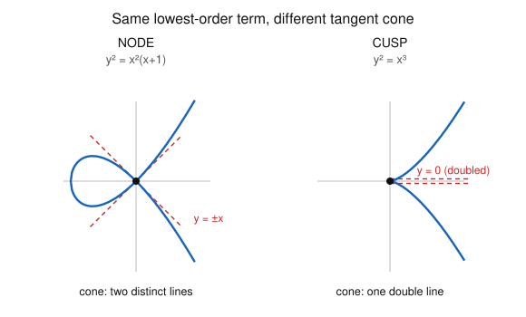

# Algebraic Geometry · Lesson 3.4: Smoothness, singularities & the tangent cone

> ⏱ ~15 min · Module 3: Local structure — dimension, smoothness & sheaves · Builds on: [Lesson 3.1](03-01-dimension.md), [Lesson 3.3](03-03-tangent-space.md) · Unlocks: [Lesson 3.5](03-05-sheaves-first-treatment.md)

## Why this matters

A smooth point is where a variety looks like a manifold — calculus works, the implicit function theorem applies, and all the geometric intuition you have from surfaces in $\mathbb{R}^3$ is legal. A singular point is where that picture tears: a crossing, a pinch, a sharp corner. Physics lives on the smooth side almost always (configuration spaces, phase spaces, gauge moduli are manifolds), and the interesting drama — phase transitions, the conifold in string theory, collisions in moduli spaces — happens exactly at the singular points. This lesson gives you two tools: a one-line test (the Jacobian) for *whether* a point is singular, and a finer one (the tangent cone) for *what kind* of singularity it is.

## The idea

In [Lesson 3.3](03-03-tangent-space.md) we built the Zariski tangent space $T_pX$: the best linear approximation to $X$ at $p$, cut out by the *linear parts* of the defining equations. A curve is $1$-dimensional, a surface is $2$-dimensional — and if the linear approximation has the *same* dimension, the approximation is honest and $p$ is **smooth**. When the linearization *overshoots* — the tangent space is bigger than the variety — the linear terms have collapsed to zero and the point is **singular**. Singularity is exactly "the first-order approximation is too big."

The tangent space is blunt: at *every* singular point of a plane curve it just returns the whole plane, telling you nothing about *how* the curve is singular. The **tangent cone** is the sharper instrument. Translate the point to the origin and keep the *lowest-degree* terms of the defining polynomial instead of the linear ones. That lowest form is what the curve looks like under infinite zoom — and it distinguishes a **node** (two branches crossing, so the cone is two distinct lines) from a **cusp** (a single branch with a sharp point, so the cone is one *doubled* line). Same tangent space, different tangent cone.

## The formal version

Throughout, $X\subseteq\mathbb{A}^n$ is an irreducible variety over $k=\bar k$ with $\dim X=d$, and $p\in X$. Recall from 3.3 that if $X=V(f_1,\dots,f_r)$ then $T_pX=\ker J(p)$, where $J(p)=\big(\partial f_i/\partial x_j\,(p)\big)$ is the $r\times n$ **Jacobian**, so $\dim_k T_pX = n-\operatorname{rank}J(p)$.

**Definition (smooth / singular).** $p$ is **smooth** (nonsingular) if $\dim_k T_pX = \dim X$, and **singular** otherwise.

*In words:* smooth means the tangent space has exactly the dimension it "should"; singular means it is too big.

A basic fact (from 3.3 / dimension theory) is that $\dim_k T_pX\ge \dim X$ *always* — the tangent space never undershoots. So singular means strictly bigger, and smoothness is the extremal, generic case.

**Jacobian criterion.** $p$ is smooth $\iff \operatorname{rank}J(p)=n-d$.

*In words:* $p$ is smooth exactly when the Jacobian has the *largest* rank it can — enough independent linear conditions to cut the ambient $\mathbb{A}^n$ down from dimension $n$ to dimension $d$. Since $\dim_k T_pX=n-\operatorname{rank}J(p)$, "rank $=n-d$" is literally "$\dim_k T_pX=d$."

**Theorem (the singular locus is a proper closed subset).** The set $\operatorname{Sing}(X)=\{p\in X: p\text{ singular}\}$ is Zariski-closed in $X$, and $\operatorname{Sing}(X)\neq X$. Hence $X$ is smooth on a dense open set.

*In words:* singular points are rare — carved out by extra equations — so a variety is smooth almost everywhere. *Why closed:* $\operatorname{rank}J(p)<n-d$ says every $(n-d)\times(n-d)$ minor of $J$ vanishes at $p$; those minors are polynomials, so $\operatorname{Sing}(X)$ is a vanishing set. *Why proper:* over $k=\bar k$ the function field $k(X)$ is separably generated (automatic in characteristic $0$), which forces the Jacobian to attain rank $n-d$ somewhere — the generic-smoothness theorem. We take this on statement here.

**The tangent cone.** Assume $p=0$ (translate coordinates so $p$ is the origin). For a hypersurface $X=V(f)$, expand $f$ into homogeneous pieces
$$f = f_m + f_{m+1} + \cdots + f_D, \qquad f_m\neq 0,$$
where $f_j$ is the degree-$j$ part and $f_m$ is the **lowest-degree** nonzero form. The integer $m=\operatorname{mult}_p(X)$ is the **multiplicity** of $X$ at $p$, and the **tangent cone** is
$$C_pX = V(f_m)\subseteq \mathbb{A}^n = T_p\mathbb{A}^n.$$

*In words:* zoom in on $p$; the tangent cone is the shape the lowest-order terms cut out — the leading silhouette of $X$ at $p$. (For a general variety $V(f_1,\dots,f_r)$ one takes the ideal generated by *all* leading forms — the initial ideal in the associated graded ring; for a hypersurface it's just $V(f_m)$.)

Two facts tie it together:

- $m=1 \iff f_1\neq 0 \iff p$ **smooth**, and then $C_pX = V(f_1) = T_pX$: the cone *is* the tangent hyperplane. Singular means $m\ge 2$, i.e. $f_1=0$ and the tangent space jumps to all of $k^n$.
- For a plane curve with $m=2$: factor the binary quadratic $f_2$ over $k=\bar k$ into two linear forms. **Node** $=$ two *distinct* lines ($f_2=(y-x)(y+x)$ from $y^2-x^2$); **cusp** $=$ a *repeated* line ($f_2=y^2$, a doubled $y=0$).

**Smoothness $=$ regularity (stated).** $p$ is smooth $\iff$ the local ring $\mathcal{O}_{X,p}$ (Lesson 3.2) is a **regular local ring**: a Noetherian local ring whose maximal ideal $\mathfrak{m}_p$ satisfies $\dim_k \mathfrak{m}_p/\mathfrak{m}_p^2 = \dim \mathcal{O}_{X,p}$. This is the same equation as smoothness, because $\dim_k \mathfrak{m}_p/\mathfrak{m}_p^2 = \dim_k T_pX$ (the intrinsic description of the tangent space from 3.3) and $\dim\mathcal{O}_{X,p}=\dim X$. Smoothness is thus a purely ring-theoretic condition on $\mathcal{O}_{X,p}$ — no embedding required. This bridges to the commutative algebra of [abstract-algebra](../../abstract-algebra/syllabus.md): regular local rings are exactly the "nonsingular" rings, and they are integrally closed UFDs.

## Picture

Both curves pass through the origin with the *whole plane* as tangent space (both singular). The tangent cone separates them: the node $y^2=x^2(x+1)$ has lowest form $y^2-x^2=(y-x)(y+x)$ — two crossing lines matching the two branches; the cusp $y^2=x^3$ has lowest form $y^2$ — a single line counted twice, matching its one pinched branch.

## Worked examples

**Example 1 (node vs. cusp at the origin).** Compare $C:\,y^2=x^2(x+1)$ and $C':\,y^2=x^3$ in $\mathbb{A}^2$; both pass through $p=(0,0)$, both are irreducible curves so $\dim=1$.

*Tangent space.* Write $C=V(f)$, $f=y^2-x^2-x^3$. Then $J=(f_x,f_y)=(-2x-3x^2,\,2y)$, and $J(0)=(0,0)$: rank $0$, so $\dim_k T_pC = 2-0 = 2 > 1$. **Singular.** For $C'=V(g)$, $g=y^2-x^3$, $J=(-3x^2,2y)$, again $J(0)=(0,0)$, $\dim_k T_pC'=2$. **Singular.** The tangent space cannot tell them apart.

*Tangent cone.* Both points are already at the origin, so just read off the lowest form.
- $f = \underbrace{(y^2-x^2)}_{\deg 2} \;\underbrace{-\,x^3}_{\deg 3}$. Lowest form $f_2 = y^2-x^2=(y-x)(y+x)$: two **distinct** lines. $C$ has a **node**, $\operatorname{mult}_0=2$.
- $g = \underbrace{y^2}_{\deg 2} \;\underbrace{-\,x^3}_{\deg 3}$. Lowest form $g_2=y^2$: the line $y=0$ **doubled**. $C'$ has a **cusp**, $\operatorname{mult}_0=2$.

Same multiplicity, same tangent space — the factorization of the leading form is the whole story. (This is Boss problem 3 in miniature.)

**Example 2 (singular locus of a surface).** Let $S=V(f)\subseteq\mathbb{A}^3$, $f=x^2+y^2-z^2$ — the quadric cone; $\dim S = 2$. The Jacobian is $J=(2x,2y,-2z)$, of rank $1$ except where all three entries vanish, i.e. at $(0,0,0)$. So
$$\operatorname{Sing}(S)=V(2x,2y,-2z)\cap S = \{(0,0,0)\}.$$
At the vertex $\dim_k T_0S = 3-0 = 3 > 2$: singular. Everywhere else rank $J=1=3-2$: smooth. And the tangent cone at $0$? Since $f$ is *already* homogeneous of degree $2$, its lowest form is $f$ itself, so $C_0S = S$ — the surface literally is its own tangent cone at the vertex, which is why "cone" is the right word. Note $\operatorname{Sing}(S)$ is a single point: a proper closed subset of the $2$-dimensional $S$, as the theorem promised.

## Watch out

- You might think "the Jacobian vanishes, so the point is singular" — but you must compare $\operatorname{rank}J(p)$ to $n-d$, not to zero. On a hypersurface ($d=n-1$) smoothness needs rank $1$, so a *single* nonvanishing partial derivative suffices; only $J(p)=0$ (rank $0$) is singular there. On a higher-codimension variety you need several independent rows.
- You might think the tangent cone lives inside the tangent space always the same way — it does sit inside ($C_pX\subseteq T_pX$), but they're equal *only* when $p$ is smooth. At a singular point $T_pX$ balloons up while $C_pX$ stays a genuine cone of the right dimension $d$ — the cone is the informative one.
- You might read a repeated linear factor as "the same as a node." A repeated factor ($y^2$) is a cusp, a *distinct* pair ($(y-x)(y+x)$) is a node. Factor over $k=\bar k$ before deciding, and remember $x^2+y^2=(y-ix)(y+ix)$ splits into distinct lines over an algebraically closed field — so $x^2+y^2$ is a node, not a "point."
- Multiplicity and smoothness are about the *lowest* form, never the top-degree form. $y^2-x^{100}$ still has a cusp at the origin: the leading form is $y^2$ regardless of the $x^{100}$.

## One-liner

> Smooth means the linear part already cuts $X$ down to size; singular means it collapsed — and the *lowest-degree* form left standing (two lines = node, one doubled line = cusp) tells you which singularity you're looking at.

## Problems

**P1 (🟢)** Let $C=V(x^3+y^3-3xy)\subseteq\mathbb{A}^2$ (the folium of Descartes), a curve so $\dim C=1$. (a) Show the origin is a singular point. (b) Show it is the *only* singular point of $C$. (c) Compute the tangent cone at the origin and classify the singularity as a node or a cusp.

**P2 (🟡)** Let $S=V(x^2-y^2z)\subseteq\mathbb{A}^3$ (the Whitney umbrella), a surface so $\dim S=2$. Using the Jacobian criterion, compute $\operatorname{Sing}(S)$. (You should find a whole *line* of singular points — a positive-dimensional, but still proper and closed, singular locus.)

**P3 (🔴, optional)** Let $X=V(f)\subseteq\mathbb{A}^n$ be a hypersurface ($\dim X=n-1$) with the origin $p=0\in X$, and write $f=f_1+f_2+\cdots$ with $f_j$ the degree-$j$ part. Prove directly from the definitions that $p$ is smooth $\iff f_1\neq 0$, and that in the smooth case the tangent cone $C_pX$ equals the tangent space $T_pX$ (a hyperplane). Conclude $\operatorname{mult}_p(X)=1 \iff p$ is smooth.

Solutions

**P1.** Write $C=V(f)$, $f=x^3+y^3-3xy$.

(a) $J=(f_x,f_y)=(3x^2-3y,\;3y^2-3x)$, so $J(0,0)=(0,0)$. Then $\dim_k T_0C = 2-\operatorname{rank}J(0)=2-0=2 > 1=\dim C$, so the origin is singular.

(b) A singular point must lie on $C$ *and* kill both partials. Set $f_x=f_y=0$: $y=x^2$ and $x=y^2$. Substituting, $x=(x^2)^2=x^4$, so $x^4-x=x(x^3-1)=0$, giving $x=0$ or $x^3=1$. For $x=0$: $y=0$, and $(0,0)\in C$ since $f(0,0)=0$. For $x^3=1$ (so $x$ a cube root of unity, $y=x^2$): check membership, $f(x,x^2)=x^3+x^6-3x\cdot x^2 = 1+1-3 = -1\neq 0$ (using $x^3=1$, $x^6=1$). So none of these lie on $C$. Hence $\operatorname{Sing}(C)=\{(0,0)\}$.

(c) The origin is already at $p$; the lowest-degree part of $f=x^3+y^3-3xy$ is the degree-$2$ term $f_2=-3xy$. So $C_0C = V(-3xy)=V(xy)=V(x)\cup V(y)$: the two coordinate axes, **two distinct lines**. Therefore the origin is a **node** ($\operatorname{mult}_0 C = 2$). $\blacksquare$

**P2.** $S=V(g)$, $g=x^2-y^2z$. Jacobian $J=(g_x,g_y,g_z)=(2x,\;-2yz,\;-y^2)$. Since $\dim S=2$ and $n=3$, smoothness needs $\operatorname{rank}J=n-d=1$, i.e. $J\neq 0$. So $p$ is singular $\iff J(p)=0$:
$$2x=0,\quad -2yz=0,\quad -y^2=0 \;\Longrightarrow\; x=0,\ y=0,\ z\text{ free}.$$
(From $-y^2=0$ we get $y=0$, which also kills $-2yz$; then $2x=0$ gives $x=0$.) Every such point satisfies $g(0,0,z)=0$, so it lies on $S$. Hence
$$\operatorname{Sing}(S)=\{(0,0,z):z\in k\}=V(x,y),$$
the $z$-axis — a $1$-dimensional closed subset, still a *proper* closed subset of the $2$-dimensional surface. At any of these points $J=0$ so $\dim_k T_pS=3>2$, confirming singularity. (Geometrically the umbrella pinches to a line along the "handle.") $\blacksquare$

**P3.** Write $f=f_1+f_2+\cdots$. Because $0\in X$ there is no constant term ($f_0=f(0)=0$). The linear part is $f_1=\sum_j \frac{\partial f}{\partial x_j}(0)\,x_j$, since the degree-$1$ Taylor coefficients of $f$ at the origin are exactly the partials $\partial f/\partial x_j(0)$.

The Jacobian at $0$ is the single row $J(0)=\big(\tfrac{\partial f}{\partial x_1}(0),\dots,\tfrac{\partial f}{\partial x_n}(0)\big)$, i.e. the coefficient vector of $f_1$. So:
$$\operatorname{rank}J(0)=\begin{cases}1,& f_1\neq 0,\\ 0,& f_1=0,\end{cases}\qquad\Longrightarrow\qquad \dim_k T_0X = n-\operatorname{rank}J(0)=\begin{cases}n-1,& f_1\neq 0,\\ n,& f_1=0.\end{cases}$$
Since $\dim X=n-1$, smoothness is $\dim_k T_0X=n-1$, which holds $\iff f_1\neq 0$. That proves the first claim, and $f_1\neq 0$ is precisely $\operatorname{mult}_0(X)=1$ (the lowest nonzero form is $f_1$), giving the last equivalence.

In the smooth case $f_1\neq 0$ is the lowest form, so $C_0X=V(f_1)$. But $T_0X=\ker J(0)=\{v: f_1(v)=0\}=V(f_1)$ as well (the kernel of the linear map $f_1$). Hence $C_0X=T_0X$, a single hyperplane. $\blacksquare$

*Takeaway:* on a hypersurface the entire smooth/singular dichotomy is "is the linear term present?", and multiplicity $\ge 2$ is exactly the failure of the tangent cone to be a hyperplane.

## Flashback

**From [Lesson 3.3](03-03-tangent-space.md) (the tangent space):** Let $X=V(x^2-yz)\subseteq\mathbb{A}^3$, an irreducible surface so $\dim X=2$. Compute the Zariski tangent space $T_pX$ (as $\ker J(p)$) at $p=(1,1,1)$ and at $q=(0,0,0)$, and decide at each whether the point is smooth or singular.

Solution

$X=V(f)$, $f=x^2-yz$, so $J=(f_x,f_y,f_z)=(2x,\,-z,\,-y)$.

At $p=(1,1,1)$: $J(p)=(2,-1,-1)$, rank $1$. Then $\dim_k T_pX = 3-1 = 2 = \dim X$, so $p$ is **smooth**. Concretely $T_pX=\ker(2,-1,-1)=\{(a,b,c): 2a-b-c=0\}$, a $2$-plane.

At $q=(0,0,0)$: $J(q)=(0,0,0)$, rank $0$. Then $\dim_k T_qX = 3-0 = 3 > 2$, so $q$ is **singular** — indeed $f$ is homogeneous of degree $2$, so its tangent cone at $0$ is $V(x^2-yz)=X$ itself, a quadric cone with vertex at the origin (compare Example 2). $\blacksquare$

## Connections

- **Backward:** this is the payoff of [Lesson 3.3](03-03-tangent-space.md) (the tangent space $\ker J(p)=(\mathfrak{m}_p/\mathfrak{m}_p^2)^*$) measured against [Lesson 3.1](03-01-dimension.md) (dimension) — smoothness is the equation "tangent-space dimension $=$ Krull dimension," and via [Lesson 3.2](03-02-local-rings-localization.md) it becomes regularity of the local ring $\mathcal{O}_{X,p}$.
- **Forward:** the smooth/singular split is what makes [Lesson 4.3](04-03-divisors-on-a-curve.md) possible — Weil divisors and the whole Riemann–Roch story ([Lesson 4.5](04-05-riemann-roch.md)) require a *smooth* curve so that local rings at points are DVRs and orders of vanishing are well-defined.
- **Sideways (abstract-algebra):** "smooth point $=$ regular local ring" ports the geometry into commutative algebra — regular local rings are the integrally closed UFDs of [abstract-algebra](../../abstract-algebra/syllabus.md), and the Jacobian criterion is the algebraic-geometry face of the implicit function theorem.
- **Sideways (complex-analysis):** over $\mathbb{C}$ a node and a cusp are exactly the two simplest ways a plane curve fails to be a Riemann surface; blowing them up (resolving the singularity) changes the geometry that feeds the genus in [complex-analysis](../../complex-analysis/syllabus.md) and Riemann–Roch — a cusp and a node contribute differently to how a singular curve's genus drops from its smooth model.
