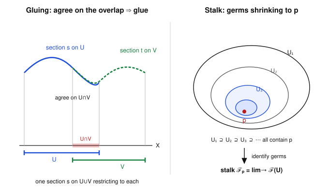

# Algebraic Geometry · Lesson 3.5: Sheaves — a first treatment

> ⏱ ~15 min · Module 3: Local structure — dimension, smoothness & sheaves · Builds on: [3.2 Local rings & localization](03-02-local-rings-localization.md), the open-set language of [topology](../../topology/syllabus.md) · Unlocks: [3.6 The structure sheaf](03-06-structure-sheaf.md)

## Why this matters

Everything so far attaches *one* algebraic object to a *whole* variety: the coordinate ring $k[X]$, the function field $k(X)$. But the deep facts of Module 3 — dimension, tangent spaces, smoothness — are **local**: they live at a point and its neighbors. A sheaf is the bookkeeping device that lets you carry a different ring on every open set at once and still glue them into one coherent object. It is the single idea that turns "variety" into "scheme": every scheme is a topological space plus a sheaf of rings. Master the two gluing axioms now, in the friendly setting of functions, and Lesson 3.6 and all of Module 4 are just this pattern applied over and over.

## The idea

A sheaf answers one question: **when does local data patch into global data?**

Think of functions. To each open set $U$ you can attach the set of *nice* functions on $U$ — continuous, or (on a variety) regular. Two things are obviously true of functions and secretly define a sheaf:

1. **You can restrict.** A function nice on $U$ is still nice on any smaller open $V\subseteq U$ — just forget the rest.
2. **Niceness is checked locally, and functions patch.** If you have nice functions on each patch of a cover, and they *agree wherever they overlap*, you can staple them into one nice function on the union — and there is only one way to do it.

An assignment-with-restriction that only satisfies (1) is a **presheaf**: it stores data over opens but makes no promise that the data is local. Add the patching guarantee (2) and you have a **sheaf**. The whole subtlety is that plenty of natural assignments *fail* (2) — "bounded" functions, or *constant* functions — precisely because those properties are **global**, not checkable patch-by-patch. Sheaves are the assignments whose defining property is genuinely local.

## The formal version

Fix a topological space $X$. Write its opens as a category $\mathrm{Open}(X)$: objects are open sets, and there is exactly one arrow $V\to U$ whenever $V\subseteq U$.

**Definition (presheaf).** A presheaf $\mathcal{F}$ of sets on $X$ assigns to each open $U$ a set $\mathcal{F}(U)$ (its **sections over $U$**), and to each inclusion $V\subseteq U$ a **restriction map**
$$\rho^U_V:\mathcal{F}(U)\longrightarrow\mathcal{F}(V),\qquad \text{written } s\mapsto s|_V,$$
such that $\rho^U_U=\mathrm{id}_{\mathcal{F}(U)}$ and, for $W\subseteq V\subseteq U$, $\ \rho^V_W\circ\rho^U_V=\rho^U_W$.

*In words:* to each open set you glue on a box of data; to each shrinking of opens you glue on a "forget the extra part" map, and forgetting in two steps equals forgetting in one. Those two conditions say exactly: **a presheaf is a contravariant functor $\mathrm{Open}(X)^{\mathrm{op}}\to\mathbf{Set}$** (or to $\mathbf{Ab}$, $\mathbf{Ring}$ if the boxes are groups/rings and restrictions are homomorphisms). "Contravariant" because $V\subseteq U$ produces an arrow *out of* $\mathcal{F}(U)$ — restriction reverses the inclusion.

Now the two axioms that upgrade a presheaf to a sheaf. Let $U=\bigcup_i U_i$ be an open cover.

**(Sheaf-1) Locality (separatedness).** If $s,t\in\mathcal{F}(U)$ satisfy $s|_{U_i}=t|_{U_i}$ for all $i$, then $s=t$.

*In words:* a section is completely determined by its restrictions to any cover — no hidden global information.

**(Sheaf-2) Gluing.** If sections $s_i\in\mathcal{F}(U_i)$ agree on overlaps, i.e. $s_i|_{U_i\cap U_j}=s_j|_{U_i\cap U_j}$ for all $i,j$, then there exists $s\in\mathcal{F}(U)$ with $s|_{U_i}=s_i$ for all $i$.

*In words:* compatible local sections actually come from a global one. (By (Sheaf-1) that $s$ is then unique.)

**Definition (sheaf).** A presheaf satisfying (Sheaf-1) and (Sheaf-2) for *every* open $U$ and *every* open cover is a **sheaf**.

**Definition (stalk / germ).** For a point $p\in X$, the **stalk** of $\mathcal{F}$ at $p$ is the directed colimit over open neighborhoods of $p$:
$$\mathcal{F}_p \;=\; \varinjlim_{U\ni p}\mathcal{F}(U).$$
Concretely a **germ** at $p$ is an equivalence class of pairs $(U,s)$ with $p\in U$ and $s\in\mathcal{F}(U)$, where $(U,s)\sim(V,t)$ iff $s|_W=t|_W$ on some open $W$ with $p\in W\subseteq U\cap V$.

*In words:* the stalk is "the value of $\mathcal{F}$ at $p$ after zooming in infinitely far" — two sections define the same germ exactly when they agree on *some* neighborhood of $p$, however small. The colimit is **directed** because any two neighborhoods of $p$ have a smaller common one (their intersection), so any finite set of germs can be compared on one shared open. This is precisely the colimit / functor language of [algebraic-topology](../../algebraic-topology/syllabus.md), now indexed by shrinking opens.

**Morphisms and the stalk-wise criterion.** A **morphism** $\varphi:\mathcal{F}\to\mathcal{G}$ is a family of maps $\varphi_U:\mathcal{F}(U)\to\mathcal{G}(U)$ commuting with restriction ($\varphi_V\circ\rho^U_V=\rho^U_V\circ\varphi_U$) — a natural transformation of functors. It induces $\varphi_p:\mathcal{F}_p\to\mathcal{G}_p$ on each stalk.

> **Fact (stated).** A morphism of *sheaves* $\varphi:\mathcal{F}\to\mathcal{G}$ is an isomorphism **iff** $\varphi_p$ is an isomorphism for every $p\in X$.

*In words:* for sheaves, being the same is a purely local matter — check it point by point. (This spectacularly *fails* for presheaves, which is one more reason the gluing axioms are the whole game.)

## Picture

Left, the gluing axiom: a blue section on $U$ and a green section on $V$ that match on $U\cap V$ staple into one section on $U\cup V$. Right, the stalk: shrink through ever-smaller neighborhoods of $p$ and pass to the colimit — what survives is the germ.

## Worked examples

**Example 1 (the leading example: regular functions form a sheaf).** Let $X$ be a variety over $k=\bar k$ (or any topological space, reading "regular" as "continuous"). Define $\mathcal{O}_X(U)=\{\text{regular functions }U\to k\}$ with honest restriction of functions. We check all the axioms.

- *Presheaf.* Restricting a regular function to a smaller open is regular, and $\rho^U_U=\mathrm{id}$, $\rho^V_W\circ\rho^U_V=\rho^U_W$ hold because these are literal restrictions of functions. $\mathcal{O}_X(U)$ is even a ring (add/multiply pointwise) and restriction is a ring homomorphism, so $\mathcal{O}_X$ is a presheaf of rings.
- *(Sheaf-1) Locality.* Suppose $f,g\in\mathcal{O}_X(U)$ agree on every $U_i$ of a cover. Any $x\in U$ lies in some $U_i$, and there $f(x)=g(x)$. So $f=g$ pointwise on $U$, hence as sections. ✓
- *(Sheaf-2) Gluing.* Given regular $f_i$ on $U_i$ with $f_i=f_j$ on each $U_i\cap U_j$, define $f:U\to k$ by $f(x)=f_i(x)$ for any $i$ with $x\in U_i$. This is **well-defined** exactly because of the overlap-agreement (if $x\in U_i\cap U_j$, both give the same value). Is $f$ regular? Regularity is a **local** property: a function is regular on $U$ iff it is regular in a neighborhood of each point (Lesson 3.2). Near any $x$, $f$ agrees with the regular function $f_i$, so $f$ is regular. Thus $f\in\mathcal{O}_X(U)$ and $f|_{U_i}=f_i$. ✓

Notice *why* it worked: the defining property ("regular") is checkable near each point. The stalk is the punchline — $\mathcal{O}_{X,p}=\varinjlim_{U\ni p}\mathcal{O}_X(U)$ is precisely the **local ring** $\mathcal{O}_{X,p}$ of germs of regular functions at $p$ from Lesson 3.2, with maximal ideal $\mathfrak{m}_p=\{\text{germs vanishing at }p\}$. The sheaf packages *all* those local rings into one object; the stalk pulls one back out.

**Example 2 (constant functions: a presheaf that fails gluing).** On a space $X$, let $\mathcal{C}(U)=\{\text{constant functions }U\to k\}$ (functions with a single value everywhere on $U$), with restriction of functions.

This is a genuine presheaf — restricting a constant function keeps it constant. But it is **not a sheaf**. Take $U=U_1\sqcup U_2$ a *disconnected* open (two disjoint opens; e.g. $U_1,U_2\subseteq\mathbb{A}^1$ two disjoint basic opens). Let $s_1\equiv a$ on $U_1$ and $s_2\equiv b$ on $U_2$ with $a\neq b$. The overlap $U_1\cap U_2=\varnothing$, so the compatibility hypothesis $s_1|_{U_1\cap U_2}=s_2|_{U_1\cap U_2}$ is **vacuously true**. Gluing demands a *constant* $s$ on $U$ with $s|_{U_1}=a$ and $s|_{U_2}=b$ — impossible, since a constant function can't take two values. **Gluing fails.** (Locality, by contrast, holds: constant functions are honest functions, determined pointwise.)

The cure names the difference: replace "constant" by **locally constant** — constant on a neighborhood of each point. Then the two-valued $s$ *is* locally constant, gluing succeeds, and $\underline{k}(U)=\{\text{locally constant }U\to k\}$ **is** a sheaf (the *constant sheaf* $\underline{k}$). Same slogan as Example 1: "locally constant" is local; "constant" is a global constraint a sheaf can't see. The same failure kills the presheaf of **bounded** functions on $\mathbb{R}$: cover $\mathbb{R}$ by $U_n=(-n,n)$; the identity $x\mapsto x$ is bounded on each $U_n$ and the pieces agree on overlaps, but they glue to the *unbounded* $x\mapsto x$ — no global section exists.

## Watch out

- **You might think** the compatibility hypothesis in gluing is a mild formality — **actually it is the entire content.** Drop "agree on overlaps" and gluing becomes false even for the sheaf of regular functions (two functions disagreeing on $U_i\cap U_j$ have no common extension). And when the overlap is empty, compatibility is automatic, which is exactly why *disconnected* opens are the sharpest test — Example 2.
- **You might think** a presheaf that fails only *one* axiom is a minor defect — **but the two axioms are independent and mean different things.** (Sheaf-1) says "no redundancy" (sections are determined by local data); (Sheaf-2) says "no obstruction" (compatible local data assembles). The constant-functions presheaf satisfies (Sheaf-1) but not (Sheaf-2). Both are needed before "$\mathcal{F}$ is local" is honest.
- **You might think** the stalk $\mathcal{F}_p$ remembers the value $s(p)$ and little else — **but a germ remembers the entire behavior in an arbitrarily small punctured neighborhood** (all derivatives, the local ring structure, vanishing order), while forgetting everything far from $p$. Two global sections agreeing near $p$ but nowhere else share a germ at $p$.
- **You might think** "iso on every stalk $\Rightarrow$ iso" holds for any presheaf — **it holds only for sheaves.** Stalks are colimits; they can't detect a failure of gluing, so a presheaf and its "sheafification" have identical stalks yet are not isomorphic.

## One-liner

> A sheaf is an assignment of data to open sets whose defining property is *local* — determined by, and reconstructible from, arbitrarily small patches — and the stalk is that data read off after zooming infinitely far into a point.

## Problems

**P1 (🟢)** On $X=\mathbb{R}$ (usual topology), work in the sheaf $\mathcal{C}$ of continuous real functions. Let $U_1=(-1,1)$, $U_2=(0,2)$, so $U_1\cap U_2=(0,1)$. Put $f_1(x)=x^2$ on $U_1$ and $f_2(x)=x^2$ on $U_2$. (a) Verify the gluing hypothesis and write down the glued section on $U_1\cup U_2$. (b) Now change $f_2$ to $f_2(x)=x^2+1$. Explain precisely which axiom's hypothesis fails and why no glued section exists. (c) Explain how (Sheaf-1) guarantees the section you built in (a) is the *only* one.

**P2 (🟡)** Stalks forget global data. On $X=\mathbb{R}$ with the sheaf $\mathcal{C}$ of continuous functions, let $g$ be continuous with $g(x)=0$ for $|x|\le 1$ and $g(x)=x-1$ for $x\ge 1$ (glued continuously). (a) Show the germ $g_0\in\mathcal{C}_0$ at the origin equals the germ of the zero function $0_0$, by exhibiting an explicit neighborhood witnessing the equivalence. (b) Show that the germ $g_2\in\mathcal{C}_2$ at $p=2$ is *not* zero. (c) In one sentence, say what this shows about how much of $g$ a single stalk sees.

**P3 (🔴, optional)** *Sections are determined by their germs.* Let $\mathcal{F}$ be a sheaf of abelian groups on $X$, let $U$ be open, and let $s\in\mathcal{F}(U)$. Prove that $s=0$ **iff** the germ $s_p=0$ in $\mathcal{F}_p$ for every $p\in U$. (Then reflect: which single sheaf axiom did the "$\Leftarrow$" direction use, and why does the statement fail for a mere presheaf?)

Solutions

**P1** (a) On the overlap $(0,1)$ both functions are $x^2$, so $f_1|_{(0,1)}=f_2|_{(0,1)}$ — the compatibility hypothesis holds. The glued section on $U_1\cup U_2=(-1,2)$ is $f(x)=x^2$; it is continuous and restricts to $f_1,f_2$ on the two pieces.
(b) With $f_2(x)=x^2+1$, on the overlap $(0,1)$ we have $f_1(x)=x^2\neq x^2+1=f_2(x)$ for every $x$. The **hypothesis of (Sheaf-2) gluing** — "agree on overlaps" — fails. A putative glue $f$ would need $f|_{U_1}=x^2$ and $f|_{U_2}=x^2+1$; at any point of $(0,1)$ these demand two different values, so no function, let alone a continuous one, exists.
(c) (Sheaf-1) locality: $\{U_1,U_2\}$ covers $U_1\cup U_2$; if $f,\tilde f$ both restrict to $f_1$ on $U_1$ and $f_2$ on $U_2$, then $f|_{U_i}=\tilde f|_{U_i}$ for all $i$, hence $f=\tilde f$. So the glue is unique.

**P2** (a) Take the neighborhood $W=(-1,1)$ of $0$. On $W$, $g\equiv 0=0|_W$. Since $g$ and the zero function agree on the open set $W\ni 0$, by definition of germ $(U,g)\sim(\mathbb{R},0)$, i.e. $g_0=0_0$ in $\mathcal{C}_0$.
(b) A germ at $2$ is zero iff the function vanishes on *some* neighborhood of $2$. But for every $\varepsilon>0$, the interval $(2-\varepsilon,2+\varepsilon)$ contains points $x>1$ where $g(x)=x-1>0$; indeed $g(2)=1\neq 0$. No neighborhood of $2$ kills $g$, so $g_2\neq 0$.
(c) A stalk sees only the behavior of $g$ in arbitrarily small neighborhoods of that one point: $g$ is "zero at the origin" and "nonzero at $2$" simultaneously, even though it is one function — each stalk forgets everything outside its own shrinking neighborhoods.

**P3** ($\Rightarrow$) If $s=0$ then every restriction $s|_W=0$, so each germ $s_p$ is the class of $(U,0)$, which is $0$ in $\mathcal{F}_p$.
($\Leftarrow$) Suppose $s_p=0$ for all $p\in U$. Fix $p$. Saying $s_p=0$ means $(U,s)\sim(U,0)$ near $p$: there is an open $W_p$ with $p\in W_p\subseteq U$ and $s|_{W_p}=0$. As $p$ ranges over $U$, the sets $\{W_p\}$ form an open cover of $U$, and $s|_{W_p}=0=0|_{W_p}$ for every $p$. By **(Sheaf-1) locality** applied to the two sections $s$ and $0$ over this cover, $s=0$.
*Reflection:* the "$\Leftarrow$" direction is exactly (Sheaf-1). For a mere presheaf, locality can fail — two distinct sections can have identical restrictions to a cover, hence identical germs everywhere — so a nonzero presheaf section can have all germs zero. This is the precise sense in which stalks "see everything" for sheaves but not for presheaves.

## Flashback

**From Lesson 3.4 (smoothness, singularities & the tangent cone):** In $\mathbb{A}^2$ over $k=\bar k$, let $C=V(f)$ with $f=y^2-x^2-x^4$. (a) Show the origin is a singular point of $C$ by computing the Jacobian there. (b) Compute the tangent cone of $C$ at $0$ and use it to decide whether $0$ is a node or a cusp.

Solution

(a) $f=y^2-x^2-x^4$, so $\partial_x f=-2x-4x^3$ and $\partial_y f=2y$. At the origin both vanish: $\partial_x f(0,0)=0$, $\partial_y f(0,0)=0$. The Zariski tangent space is cut out by the linear part $\mathrm{d}f_0=\partial_x f(0)\,x+\partial_y f(0)\,y=0$, which is the trivial equation $0=0$ — so the tangent space is all of $\mathbb{A}^2$, dimension $2$. Since $C$ is a curve ($\dim C=1$) and $\dim T_0C=2>1$, the origin is **singular**.

(b) The tangent cone at $0$ is $V$ of the **lowest-degree homogeneous part** of $f$. The terms of $f$ have degrees $2$ ($y^2$ and $-x^2$) and $4$ ($-x^4$); the lowest-degree part is
$$f_2=y^2-x^2=(y-x)(y+x).$$
So the tangent cone is $V(y^2-x^2)=\{y=x\}\cup\{y=-x\}$: **two distinct lines** through the origin. Two distinct tangent lines ⇒ the singularity is a **node** (a cusp would give a single doubled line, $\ell^2$). So $0$ is a node of $C$.

## Connections

- **Backward:** the stalk $\mathcal{O}_{X,p}=\varinjlim_{U\ni p}\mathcal{O}_X(U)$ *is* the local ring of germs from [Lesson 3.2](03-02-local-rings-localization.md); a sheaf is the global organizer of all the local rings you built there one point at a time.
- **Forward:** [Lesson 3.6](03-06-structure-sheaf.md) makes $\mathcal{O}_X$ — the sheaf of regular functions verified in Example 1 — official, turning a variety into a *ringed space*; [Lesson 4.2](04-02-structure-sheaf-gluing-schemes.md) uses the gluing axiom in the *other* direction, stapling affine spectra $\operatorname{Spec}R$ into schemes (e.g. $\mathbb{P}^1$ from two charts).
- **Sideways (topology):** presheaves and sheaves live on the open-set lattice of a space — the same $\mathrm{Open}(X)$ from [topology](../../topology/syllabus.md); "checkable on a basis / near each point" is the topological reflex driving both examples.
- **Sideways (algebraic topology):** "presheaf = contravariant functor" and "stalk = directed colimit" are the functor-and-colimit language of [algebraic-topology](../../algebraic-topology/syllabus.md); the stalk-wise iso criterion is the sheaf-theoretic cousin of "a map is an equivalence iff it is on every fiber."
