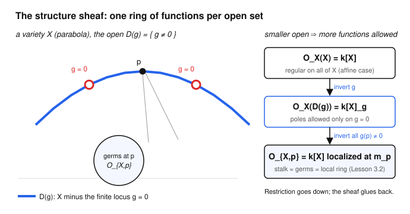

# Algebraic Geometry · Lesson 3.6: The structure sheaf of a variety

> ⏱ ~15 min · Module 3: Local structure — dimension, smoothness & sheaves · Builds on: [Lesson 3.5](03-05-sheaves-first-treatment.md), [Lesson 3.2](03-02-local-rings-localization.md) · Unlocks: Module 4 — [Lesson 4.1 (Spec of a ring)](04-01-spec-of-a-ring.md)

## Why this matters

You now have two ways to talk about functions on a variety $X$: the global coordinate ring $k[X]$ from [Lesson 1.6](01-06-coordinate-ring-polynomial-maps.md), and the local ring $\mathcal{O}_{X,p}$ at a single point $p$ from [Lesson 3.2](03-02-local-rings-localization.md). Neither alone is the right object. The **structure sheaf** $\mathcal{O}_X$ is the bookkeeping device that holds *all* the intermediate rings — one ring of functions for every open set — in a single package, wired together by restriction. This is the last thing you need before schemes: a scheme is literally a topological space carrying such a sheaf. And it is where the affine/projective divide finally bites — on a projective variety the *global* ring collapses to constants, so the only way to see the geometry is through the sheaf. Physically it is the same move as a field theory: not one number, but a consistent assignment of "the fields regular here" to every region, that patches.

## The idea

Ask a variety a local question: *which functions are regular on this open set $U$?* Regular means (Lesson 3.2) locally a ratio $f/g$ of coordinate-ring elements whose denominator does not vanish. The answer is a ring, call it $\mathcal{O}_X(U)$. Two facts drive everything:

- **The answer shrinks as $U$ grows.** A bigger open set has more points where a would-be pole could sit, so fewer rational functions survive. On all of $\mathbb{A}^1$ only polynomials are regular; delete the origin and suddenly $1/x$ is allowed too.
- **Restriction is free.** If $U' \subseteq U$, a function regular on $U$ is regular on $U'$ — just forget the extra points. So we get restriction maps $\mathcal{O}_X(U) \to \mathcal{O}_X(U')$ for nothing.

That is exactly a presheaf of rings. And because "regular" was *defined pointwise* — checked one point at a time — it is automatically a **sheaf**: regular functions that agree on overlaps glue to a regular function, since regularity at each point only ever needed a neighborhood of that point. That is the whole payoff of [Lesson 3.5](03-05-sheaves-first-treatment.md) cashing in. Zoom all the way down to a single point and the sheaf's stalk *is* the local ring of germs from Lesson 3.2. One object, $\mathcal{O}_X$, sees the global ring, every open piece, and every point at once.

## The formal version

Fix an irreducible variety $X$ over $k=\bar k$ with coordinate ring $k[X]$ and function field $k(X)$ (Lesson 2.1). Recall from Lesson 3.2:

**Definition (regular function).** A function $\varphi : U \to k$ on an open $U \subseteq X$ is **regular at** $p \in U$ if there is an open neighborhood $V \subseteq U$ of $p$ and elements $f, g \in k[X]$ with $g$ nowhere zero on $V$ and $\varphi = f/g$ on $V$. It is **regular on $U$** if regular at every point of $U$.

*In words:* near every point, $\varphi$ is an honest ratio of polynomials whose denominator you have checked is nonzero right there.

**Definition (structure sheaf).** Let $\mathcal{O}_X(U)$ be the set of all regular functions $U \to k$, a ring under pointwise $+$ and $\times$. For $U' \subseteq U$ let the **restriction** $\rho^U_{U'} : \mathcal{O}_X(U) \to \mathcal{O}_X(U')$ be literal restriction of functions, $\varphi \mapsto \varphi|_{U'}$. The assignment $U \mapsto \mathcal{O}_X(U)$ with these maps is the **structure sheaf** $\mathcal{O}_X$.

**Proposition (it is a sheaf).** $\mathcal{O}_X$ satisfies the two sheaf axioms of Lesson 3.5.

*Proof.* Restrictions are ordinary function restriction, so functoriality is automatic. **Identity/locality:** if $\varphi \in \mathcal{O}_X(U)$ restricts to $0$ on every $U_i$ of an open cover, then $\varphi(p)=0$ for every $p$ (each $p$ lies in some $U_i$), so $\varphi = 0$. **Gluing:** given regular $\varphi_i$ on $U_i$ agreeing on overlaps, define $\varphi$ on $U=\bigcup U_i$ by $\varphi(p) := \varphi_i(p)$ for any $i$ with $p \in U_i$ (well-defined by agreement). To see $\varphi$ is *regular* at $p$: pick $i$ with $p \in U_i$; since $\varphi_i$ is regular at $p$ it equals some $f/g$ on a neighborhood, and $\varphi$ agrees with $\varphi_i$ there, so $\varphi = f/g$ there too. $\blacksquare$

*In words:* being a sheaf is not a lucky accident — it holds precisely because "regular" was a **local** condition. A property you can only check globally (bounded, say) would fail this.

**Definition (stalk).** The **stalk** at $p$ is the colimit over shrinking neighborhoods,
$$\mathcal{O}_{X,p} \;=\; \varinjlim_{U \ni p} \mathcal{O}_X(U),$$
whose elements are **germs**: pairs $(U,\varphi)$ with $p \in U$, identifying two if they agree near $p$.

**Proposition (stalk = local ring).** $\mathcal{O}_{X,p}$ is exactly the local ring of Lesson 3.2:
$$\mathcal{O}_{X,p} \;=\; k[X]_{\mathfrak{m}_p} \;=\; \{\, f/g \in k(X) : g(p)\neq 0 \,\}, \qquad \mathfrak{m}_p = \{\varphi : \varphi(p)=0\}.$$

*In words:* the sheaf's infinitesimal snapshot at $p$ recovers the local ring — germ of a regular function = rational function defined at $p$, and the ones vanishing at $p$ form the unique maximal ideal.

**Global and basic-open sections (the computable cases).** For $X$ *affine* irreducible and $g \in k[X]$ nonzero, on the **distinguished open** $D(g)=\{p \in X : g(p)\neq 0\}$:
$$\boxed{\ \mathcal{O}_X\big(D(g)\big) \;=\; k[X]_g \;=\; \Big\{\, \tfrac{f}{g^{\,n}} : f\in k[X],\ n\ge 0 \Big\},\qquad \mathcal{O}_X(X) = k[X].\ }$$

*In words:* inverting $g$ (allowing $g$ in denominators) is exactly "allow poles only where $g$ vanishes." Taking $g=1$ gives $\mathcal{O}_X(X)=k[X]$: on an affine variety the global sections *are* the coordinate ring.

**Ringed spaces and morphisms (the preview).** The pair $(X, \mathcal{O}_X)$ is a **ringed space**: a topological space plus a sheaf of rings. A **morphism** $(X,\mathcal{O}_X)\to(Y,\mathcal{O}_Y)$ is a continuous map $\pi : X\to Y$ *together with* a compatible pullback $\pi^\# : \mathcal{O}_Y(V) \to \mathcal{O}_X(\pi^{-1}V)$ for each open $V$, sending a regular function $\psi$ on $V$ to $\psi\circ\pi$ on $\pi^{-1}V$.

*In words:* a map of varieties is not just a set map — it must drag regular functions back to regular functions. That single idea, with "variety" replaced by "$\operatorname{Spec}$ of a ring," is the definition of a morphism of schemes ([Lesson 4.1](04-01-spec-of-a-ring.md), [4.2](04-02-structure-sheaf-gluing-schemes.md)).

## Picture

As the open set shrinks — from all of $X$, to $D(g)$ (delete the finite locus $g=0$), to the point $p$ — the ring of regular functions *grows*: $k[X] \subseteq k[X]_g \subseteq \mathcal{O}_{X,p}$. Restriction maps run downward; the sheaf axioms say the data glues back consistently.

## Worked examples

**Example 1 (a distinguished open on the line).** Take $X=\mathbb{A}^1$, so $k[X]=k[x]$, and $g=x$. Then $D(x)=\mathbb{A}^1\setminus\{0\}=\{x\neq 0\}$ and
$$\mathcal{O}_{\mathbb{A}^1}(D(x)) = k[x]_x = k[x,x^{-1}] = \Big\{\, \textstyle\sum_{n} a_n x^n : \text{finite}, n\in\mathbb{Z} \Big\},$$
the **Laurent polynomials**. Indeed $1/x$ is now regular — its only pole sits at the deleted point $0$. But $1/(x-1)$ is *not* in $\mathcal{O}_{\mathbb{A}^1}(D(x))$: it has a pole at $1\in D(x)$, a point we kept. Inverting $x$ buys you exactly the poles you deleted, no others.

**Example 2 (why projective is different: $\mathbb{A}^1$ vs $\mathbb{P}^1$).** The affine line has an enormous ring of global regular functions, $\mathcal{O}_{\mathbb{A}^1}(\mathbb{A}^1)=k[x]$, one dimension of new functions for every degree. The projective line has almost none:
$$\mathcal{O}_{\mathbb{P}^1}(\mathbb{P}^1) = k \quad (\text{constants only}).$$
*Proof.* Cover $\mathbb{P}^1$ (Lesson 2.3) by the two charts $U_0=\{[x_0:x_1]:x_0\neq0\}\cong\mathbb{A}^1$ with coordinate $t=x_1/x_0$, and $U_1=\{x_1\neq0\}\cong\mathbb{A}^1$ with coordinate $s=x_0/x_1=1/t$. A global $\varphi\in\mathcal{O}_{\mathbb{P}^1}(\mathbb{P}^1)$ restricts to a regular function on each chart, hence (Example-1 logic, but with no deleted points) to a *polynomial*: $\varphi|_{U_0}=P(t)$ and $\varphi|_{U_1}=Q(s)$. On the overlap $U_0\cap U_1=\{t\neq0\}$ we have $s=1/t$, so $P(t)=Q(1/t)$ as rational functions. A polynomial in $t$ that also equals a polynomial in $1/t$ can have no positive powers of $t$ *and* no negative powers — it is constant. Hence $\varphi$ is constant. $\blacksquare$

This is the algebraic shadow of a fact you may know from `complex-analysis` (see [complex-analysis](../../complex-analysis/syllabus.md)): a global holomorphic function on the Riemann sphere $\mathbb{P}^1(\mathbb{C})$ is constant (Liouville). The moral: **on a projective variety the global ring $\mathcal{O}_X(X)=k$ throws away all the geometry** — the information now lives in the *sheaf* $\mathcal{O}_X$ (and later in line bundles, Lesson 4.4), which is precisely why we bother building it.

## Watch out

- **The structure sheaf is not the coordinate ring.** $k[X]$ is only the *global sections*, one value $\mathcal{O}_X(X)$ of the sheaf. The sheaf is the whole family $\{\mathcal{O}_X(U)\}_U$. For projective $X$ the global sections are just $k$, yet the sheaf is rich — do not confuse "trivial global ring" with "trivial variety."
- **A section is a function, not a fraction.** An element of $\mathcal{O}_X(U)$ is a single regular function; its *presentation* as $f/g$ can differ from point to point (recall $(1-x)/y = y/(1+x)$ on the circle, Lesson 2.1). "Regular on $U$" means *some* valid local ratio exists at each point, not one global formula.
- **$D(g)\subseteq D(h)$ does not mean $g\mid h$.** Inclusions of distinguished opens correspond to *radical* containments $\sqrt{(g)}\subseteq\sqrt{(h)}$, i.e. $g$ vanishes wherever $h$ does — a Nullstellensatz statement (Lesson 1.5), not literal divisibility. And $D(g)=\varnothing \iff g$ is nilpotent, which on a variety ($k[X]$ reduced) means $g=0$.

## One-liner

> The structure sheaf is a variety's ring of functions computed *per open set* — global on the affine chart, collapsing to constants on the projective whole, and germs at each point — with the sheaf axiom guaranteeing all of it glues.

## Problems

**P1 (🟢)** Let $X=\mathbb{A}^1$ and $g=x(x-1)$. (a) Describe the open set $D(g)$ as a subset of $\mathbb{A}^1$. (b) Write down $\mathcal{O}_X(D(g))$ as a localization, and decide which of $\dfrac{1}{x}$, $\dfrac{1}{x-1}$, $\dfrac{1}{x-2}$ belong to it, with reasons.

**P2 (🟡)** The stalk sees strictly more than global sections. On an irreducible $X$, show the germ map $\mathcal{O}_X(X)\to\mathcal{O}_{X,p}$ is (a) **injective**, but (b) generally **not surjective** — exhibit a germ at $p=0\in\mathbb{A}^1$ that is not the germ of any global regular function on $\mathbb{A}^1$.

**P3 (🔴)** The distinguished open $D(x)\subseteq\mathbb{A}^1$ is not obviously an affine *variety*, yet its ring of functions looks like a coordinate ring. Prove it: show $D(x)$ is isomorphic (as a ringed space) to the hyperbola $H=V(xy-1)\subseteq\mathbb{A}^2$ via $a\mapsto(a,1/a)$, and deduce $k[H]\cong k[x]_x=\mathcal{O}_{\mathbb{A}^1}(D(x))$ — confirming the localization formula geometrically. (This is the fact that makes every $D(g)$ affine, the seed of the affine-cover definition of a scheme.)

Solutions

**P1** (a) $g=x(x-1)$ vanishes exactly at $x=0$ and $x=1$, so $D(g)=\mathbb{A}^1\setminus\{0,1\}=\{x\neq0,\ x\neq1\}$.

(b) $\mathcal{O}_X(D(g))=k[x]_g=\Big\{\dfrac{f(x)}{\big(x(x-1)\big)^n}:f\in k[x],\ n\ge0\Big\}$ — rational functions whose poles lie only in $\{0,1\}$.
- $\dfrac1x$: its only pole is at $0\notin D(g)$, and $\dfrac1x=\dfrac{x-1}{x(x-1)}=\dfrac{x-1}{g}\in k[x]_g$. **Yes.**
- $\dfrac1{x-1}$: only pole at $1\notin D(g)$, and $\dfrac1{x-1}=\dfrac{x}{x(x-1)}=\dfrac{x}{g}\in k[x]_g$. **Yes.**
- $\dfrac1{x-2}$: pole at $2\in D(g)$, a point we kept — not regular there. Algebraically, $x-2$ is a unit in $k[x]_g$ only if it divides a power of $g$, but $x-2$ is coprime to $x(x-1)$, so $\dfrac1{x-2}\notin k[x]_g$. **No.**

The lesson: inverting $g$ buys precisely the poles at $g$'s zero set, nothing more.

**P2** *Injectivity.* $X$ irreducible means every nonempty open is dense. If $\varphi\in\mathcal{O}_X(U)$ has zero germ at $p$, then $\varphi=0$ on some neighborhood $V\ni p$; being regular, $\varphi$ is in particular a rational function on the irreducible $X$, and a rational function vanishing on the nonempty (hence dense) open $V$ is the zero of $k(X)$. So $\varphi=0$ on $U$: the map $\mathcal{O}_X(U)\to\mathcal{O}_{X,p}$ is injective. (Equivalently: distinct regular functions can't share a germ on an irreducible variety.)

*Non-surjectivity.* Take $X=\mathbb{A}^1$, $U=X$, $p=0$. The germ of $\dfrac{1}{x-1}$ at $0$ lies in $\mathcal{O}_{X,0}=k[x]_{(x)}$ since $x-1$ is a unit there ($(x-1)|_{x=0}=-1\neq0$). But no *global* regular function on $\mathbb{A}^1$ has this germ: global sections are polynomials $k[x]$, and a polynomial agreeing with $\dfrac1{x-1}$ near $0$ would satisfy $(x-1)P(x)=1$ identically (both sides regular and equal on a dense open of the irreducible line), impossible by degree. So $\mathcal{O}_X(X)\to\mathcal{O}_{X,0}$ is not onto: the stalk genuinely sees more than any global function. This is the sheaf/stalk distinction of Lesson 3.5 made concrete — germs are strictly more local data than global sections.

**P3** Define $\phi:D(x)\to H$, $\phi(a)=(a,1/a)$; this lands in $H$ since $a\cdot(1/a)=1$, and $a\neq0$ on $D(x)$ makes it defined. Define $\psi:H\to D(x)$, $\psi(a,b)=a$; here $a\neq0$ because $ab=1$ forces $a\neq0$, so the image is in $D(x)$. They are mutually inverse: $\psi(\phi(a))=a$, and $\phi(\psi(a,b))=(a,1/a)=(a,b)$ using $b=1/a$ on $H$.

Both are morphisms (regular maps): $\phi$'s components $a\mapsto a$ and $a\mapsto1/a$ are regular on $D(x)$ (the second because $x$ is invertible there); $\psi$ is a coordinate projection, visibly regular. Hence $\phi$ is an isomorphism of ringed spaces $D(x)\cong H$.

On coordinate rings, $k[H]=k[x,y]/(xy-1)$. The relation $xy=1$ says $y=x^{-1}$, so every element is a polynomial in $x$ and $x^{-1}$:
$$k[H]=k[x,y]/(xy-1)\;\cong\;k[x,x^{-1}]=k[x]_x=\mathcal{O}_{\mathbb{A}^1}(D(x)).$$
Explicitly the isomorphism is $\phi^\#: k[H]\to k[x]_x$, $x\mapsto x$, $y\mapsto 1/x$, well-defined since $xy-1\mapsto x\cdot\tfrac1x-1=0$, with inverse $x\mapsto x$, $1/x\mapsto y$. So the "non-affine-looking" open $D(x)$ is really the affine hyperbola, and its structure-sheaf value $k[x]_x$ is a genuine coordinate ring. Every distinguished open is affine this way — the fact Module 4 builds schemes on. $\blacksquare$

## Flashback

**From Lesson 3.5 (presheaves, sheaves, the gluing axiom):** On $X=\mathbb{R}$ with its usual topology, define a presheaf of rings $\mathcal{F}$ by
$$\mathcal{F}(U)=\{\text{bounded functions } U\to\mathbb{R}\},$$
with restriction = ordinary restriction. (a) Check $\mathcal{F}$ is a presheaf and satisfies the *identity* axiom. (b) Show it **fails** the *gluing* axiom, so $\mathcal{F}$ is not a sheaf. Contrast this with why $\mathcal{O}_X$ *is* a sheaf.

Solution

(a) Restriction of a bounded function to a smaller set is still bounded, and restriction is functorial ($\rho^U_U=\mathrm{id}$, restrictions compose), so $\mathcal{F}$ is a presheaf. *Identity:* if $\varphi\in\mathcal{F}(U)$ restricts to $0$ on every $U_i$ of a cover of $U$, then $\varphi(p)=0$ for all $p\in U$ (each $p$ is in some $U_i$), so $\varphi=0$. Holds.

(b) Cover $\mathbb{R}$ by $U_n=(-n,n)$, $n\ge1$. The function $\varphi_n(x)=x$ is **bounded on each $U_n$** (by $n$), so $\varphi_n\in\mathcal{F}(U_n)$, and the family agrees on overlaps ($\varphi_n=\varphi_m$ where both defined — they're all "$x$"). The gluing axiom would demand a single $\varphi\in\mathcal{F}(\mathbb{R})$ with $\varphi|_{U_n}=\varphi_n$ for all $n$; the only function restricting to $x$ on every $U_n$ is $\varphi(x)=x$, which is **unbounded** on $\mathbb{R}$, hence *not* in $\mathcal{F}(\mathbb{R})$. No valid gluing exists — the gluing axiom fails.

*Why the contrast.* "Bounded" is a **global** condition: you cannot certify it by looking near each point separately, so local pieces need not assemble into a global element. "Regular," by design, *is* local — checkable in a neighborhood of each point — which is exactly what made the gluing proof for $\mathcal{O}_X$ go through. Sheafiness is a statement that a property is local; boundedness isn't, regularity is.

## Connections

- **Backward:** this fuses [Lesson 3.2](03-02-local-rings-localization.md) (local ring = stalk) and [Lesson 1.6](01-06-coordinate-ring-polynomial-maps.md) (coordinate ring = global sections) into one object using the sheaf machinery of [Lesson 3.5](03-05-sheaves-first-treatment.md). The $\mathcal{O}_X(D(g))=k[X]_g$ formula is the localization of `abstract-algebra` ([abstract-algebra](../../abstract-algebra/syllabus.md)) seen geometrically as "delete a hypersurface."
- **Forward:** [Lesson 4.1](04-01-spec-of-a-ring.md) replaces the point set $X$ with $\operatorname{Spec} R$ (all primes), and [Lesson 4.2](04-02-structure-sheaf-gluing-schemes.md) puts the *same* structure sheaf on it via $\mathcal{O}(D(g))=R_g$ and glues affine pieces into a scheme — with $\mathbb{P}^1$ built exactly as the two charts of Example 2. Line bundles ([Lesson 4.4](04-04-line-bundles-picard.md)) are the sheaves that finally carry the geometry a projective variety's constant global ring hides.
- **Sideways (`complex-analysis`):** $\mathcal{O}_{\mathbb{P}^1}(\mathbb{P}^1)=k$ is the algebraic Liouville theorem — a global regular/holomorphic function on the compact Riemann sphere is constant. The structure sheaf is the exact analogue of the sheaf of holomorphic functions on a Riemann surface, the setting Module 4's divisors and Riemann–Roch ([Lesson 4.5](04-05-riemann-roch.md)) live in.
