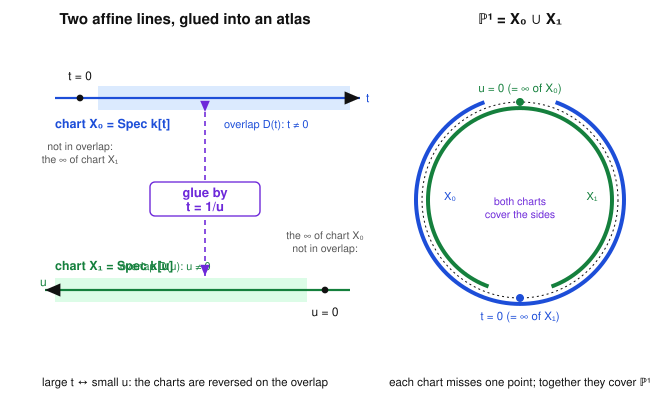

# Algebraic Geometry · Lesson 4.2: The structure sheaf & gluing schemes

> ⏱ ~15 min · Module 4: Schemes & a first look at curves · Builds on: [Lesson 4.1](04-01-spec-of-a-ring.md) ($\operatorname{Spec}$ of a ring), [Lesson 3.6](03-06-structure-sheaf.md) (the structure sheaf of a variety), [Lesson 3.5](03-05-sheaves-first-treatment.md) (sheaves & gluing), [Lesson 2.3](02-03-projective-space.md) (projective space by charts) · Unlocks: [Lesson 4.3](04-03-divisors-on-a-curve.md) (divisors on a curve)

## Why this matters

In [Lesson 4.1](04-01-spec-of-a-ring.md) you turned a ring $R$ into a *space* $\operatorname{Spec} R$ — its primes as points, with the Zariski topology. But a bare topological space is not geometry: geometry lives in the **functions**. This lesson equips $\operatorname{Spec} R$ with its sheaf of functions $\mathcal{O}_{\operatorname{Spec} R}$, turning it into the atom of algebraic geometry — the **affine scheme**. Then it does the one move that lets you leave affine space behind: **gluing**. Exactly as a manifold is charts stitched along overlaps, a scheme is affine spectra glued along open subschemes. The flagship payoff is $\mathbb{P}^1$ built honestly — two lines glued by $t=1/u$ — recovering the projective line of [Lesson 2.3](02-03-projective-space.md) from pure ring theory, and revealing that its only global functions are the constants.

## The idea

You already met this idea for a variety in [Lesson 3.6](03-06-structure-sheaf.md): a *regular function* near a point is a ratio $f/g$ with $g$ not vanishing there. Do the same on $\operatorname{Spec} R$. The basic open $D(f)=\{\mathfrak{p}:f\notin\mathfrak{p}\}$ is "where $f\neq 0$," so on it you should be allowed to divide by $f$ — the ring of functions there is $R_f=R[1/f]$, the localization inverting $f$. That single rule, $\mathcal{O}(D(f))=R_f$, pins down the whole sheaf: the basic opens $D(f)$ form a basis of the topology (Lesson 4.1), and a sheaf is determined by its values on a basis.

Zoom all the way in to a single point $\mathfrak{p}$ and you invert *everything* not vanishing there — every $f\notin\mathfrak{p}$ — and land in the local ring $R_\mathfrak{p}$ from [Lesson 3.2](03-02-local-rings-localization.md). So every stalk is a **local ring**. A space whose sheaf-of-functions has local stalks is a **locally ringed space**, and that "locally ringed" adjective is not decoration: it is precisely the structure that remembers, at each point, which functions vanish there — the algebraic shadow of "value at a point."

Once each affine piece is a locally ringed space, you build bigger geometry the way a cartographer builds a globe: take charts, and declare how they overlap. Glue $\operatorname{Spec} R$ and $\operatorname{Spec} S$ along an isomorphism between an open piece of each. The compatibility you need on triple overlaps — the **cocycle condition** — is exactly the transition-map bookkeeping of a manifold atlas. That is a **scheme**: a locally ringed space that is *locally* one of these affine spectra.

## The formal version

**The structure sheaf on basic opens.** For a commutative ring $R$ and $f\in R$, set
$$\mathcal{O}_{\operatorname{Spec} R}\big(D(f)\big):=R_f=R[1/f]=\Big\{\tfrac{r}{f^n}:r\in R,\ n\ge 0\Big\}.$$
If $D(f)\subseteq D(g)$ (equivalently $f\in\sqrt{(g)}$, so $g$ is invertible wherever $f$ is), the localization map $R_g\to R_f$ is the **restriction**. On a general open $U$, a section is a compatible family of these local fractions — the sheafification of the basic-open rule.

*In words:* on "where $f\neq 0$," a function is anything you can write with $f$'s in the denominator; restricting to a smaller basic open just allows more denominators.

**Stalks are local rings.** At a prime $\mathfrak{p}$,
$$\mathcal{O}_{\operatorname{Spec} R,\,\mathfrak{p}}=\varinjlim_{f\notin\mathfrak{p}}R_f=R_\mathfrak{p},$$
the localization at $\mathfrak{p}$, whose unique maximal ideal is $\mathfrak{p}R_\mathfrak{p}$.

*In words:* the germ of a function at $\mathfrak{p}$ is a fraction you may divide by anything not in $\mathfrak{p}$ — and the germs that "vanish at $\mathfrak{p}$" form the one maximal ideal. That is why the stalk is *local*.

**Definition (locally ringed space).** A **ringed space** is a topological space $X$ with a sheaf of rings $\mathcal{O}_X$. It is a **locally ringed space** if every stalk $\mathcal{O}_{X,x}$ is a local ring. A **morphism** $(X,\mathcal{O}_X)\to(Y,\mathcal{O}_Y)$ is a continuous map $\varphi:X\to Y$ together with a sheaf map $\varphi^\#:\mathcal{O}_Y\to\varphi_*\mathcal{O}_X$ such that each induced stalk map $\mathcal{O}_{Y,\varphi(x)}\to\mathcal{O}_{X,x}$ is **local** (sends the maximal ideal into the maximal ideal).

*In words:* a map of spaces-with-functions must also say how to pull back functions, and pulling back a function that vanishes at $\varphi(x)$ must give one that vanishes at $x$ — "value at a point" is respected.

**Definition (affine scheme, scheme).** An **affine scheme** is a locally ringed space isomorphic to $(\operatorname{Spec} R,\mathcal{O}_{\operatorname{Spec} R})$ for some ring $R$. A **scheme** is a locally ringed space $(X,\mathcal{O}_X)$ admitting an open cover $X=\bigcup U_i$ with each $(U_i,\mathcal{O}_X|_{U_i})$ an affine scheme. Morphisms of schemes are morphisms of locally ringed spaces.

*In words:* an affine scheme is $\operatorname{Spec}$ of a ring; a scheme is anything that looks like one of those in a neighborhood of each point — locally affine, exactly like "locally Euclidean" for a manifold.

**Global sections recover the ring.** Taking $f=1$ gives $D(1)=\operatorname{Spec} R$ and
$$\mathcal{O}_{\operatorname{Spec} R}(\operatorname{Spec} R)=R_1=R.$$
So on an *affine* scheme the global functions are the whole ring $R$ — no information is lost. (This fails spectacularly for non-affine schemes; see $\mathbb{P}^1$ below.)

**Gluing (the atlas construction).** Given schemes $X_1,\dots,X_n$, open subschemes $U_{ij}\subseteq X_i$, and isomorphisms $\varphi_{ij}:U_{ij}\xrightarrow{\ \sim\ }U_{ji}$ with
$$\varphi_{ii}=\mathrm{id},\qquad \varphi_{ji}=\varphi_{ij}^{-1},\qquad \varphi_{ik}=\varphi_{jk}\circ\varphi_{ij}\ \text{ on }U_{ij}\cap U_{ik}\ \ (\textbf{cocycle}),$$
there is a scheme $X$, unique up to isomorphism, with an open cover by copies of the $X_i$ glued along the $\varphi_{ij}$.

*In words:* stitch charts along overlaps by isomorphisms that agree on triple overlaps — precisely a manifold atlas, now with rings instead of $\mathbb{R}^n$. With only two charts there is no triple overlap, so the cocycle condition is free.

## Picture

Left: the two charts $X_0=\operatorname{Spec} k[t]$ and $X_1=\operatorname{Spec} k[u]$, each an affine line. Their overlaps $D(t)$ (all of $X_0$ except $t=0$) and $D(u)$ (all of $X_1$ except $u=0$) are identified by $t=1/u$ — note the orientation reverses, large $t\leftrightarrow$ small $u$. Right: the glued result $\mathbb{P}^1$. The point $t=0$ lives only in $X_0$; it is the point at infinity of chart $X_1$. The point $u=0$ lives only in $X_1$; it is the point at infinity of chart $X_0$. Neither chart alone is the whole line — together they cover it.

## Worked examples

**Example 1 (evaluate the sheaf on a basic open, and take a stalk).** Let $R=k[x]$, so $\operatorname{Spec} R=\mathbb{A}^1_k$. Take $f=x$. Then $D(x)=\{\mathfrak{p}:x\notin\mathfrak{p}\}$ is "the line minus the origin," and
$$\mathcal{O}\big(D(x)\big)=R_x=k[x]_x=k[x,x^{-1}]=\Big\{\textstyle\sum_{i=-N}^{M}a_i x^i\Big\},$$
the **Laurent polynomials** — regular functions on $\mathbb{A}^1\setminus\{0\}$, allowed poles only at $0$. Restricting to the smaller basic open $D(x^2-x)=D\big(x(x-1)\big)$ (the line minus $\{0,1\}$) allows a denominator at $1$ too:
$$\mathcal{O}\big(D(x^2-x)\big)=k[x]_{x^2-x}=k[x][\tfrac{1}{x(x-1)}].$$
Now the **stalk** at the prime $\mathfrak{p}=(x)$ (the origin) inverts *every* $g$ with $g(0)\neq 0$:
$$\mathcal{O}_{\mathbb{A}^1,(x)}=k[x]_{(x)}=\Big\{\tfrac{f}{g}:g(0)\neq 0\Big\},$$
the local ring of [Lesson 3.2](03-02-local-rings-localization.md) — one maximal ideal $(x)k[x]_{(x)}$, everything else a unit. The sheaf's global sections are $\mathcal{O}(\mathbb{A}^1)=R_1=k[x]$: polynomials, no poles anywhere. Each shrinking of the open set buys you more denominators.

**Example 2 (glue two lines into $\mathbb{P}^1$ and find its global functions).** Take $X_0=\operatorname{Spec} k[t]$ and $X_1=\operatorname{Spec} k[u]$. The gluing data:
$$U_{01}=D(t)=\operatorname{Spec} k[t,t^{-1}],\qquad U_{10}=D(u)=\operatorname{Spec} k[u,u^{-1}],$$
with $\varphi_{01}:U_{01}\to U_{10}$ the isomorphism induced by the ring map $k[u,u^{-1}]\to k[t,t^{-1}]$, $u\mapsto t^{-1}$ (this is the transition $t=1/u$). Two charts, no triple overlap, cocycle automatic — so the glue is legal and produces a scheme $\mathbb{P}^1_k$.

What is a **global section**? By the sheaf gluing axiom it is a pair: a regular function on each chart agreeing on the overlap. On $X_0$ that is a polynomial $p(t)\in k[t]$; on $X_1$ a polynomial $q(u)\in k[u]$. Agreement on $U_{01}$ means, after substituting $u=1/t$,
$$p(t)=q(1/t)\qquad\text{in } k[t,t^{-1}].$$
Write $p(t)=\sum_{i\ge 0}a_i t^i$ (only non-negative powers of $t$) and $q(1/t)=\sum_{j\ge 0}b_j t^{-j}$ (only non-positive powers of $t$). Two such can be equal only in the overlap of their supports, the constant term: all $a_i=0$ for $i>0$, all $b_j=0$ for $j>0$, and $a_0=b_0$. Hence
$$\boxed{\ \mathcal{O}(\mathbb{P}^1)=k.\ }$$
The only global regular functions on $\mathbb{P}^1$ are the constants — a polynomial that is bounded (no poles) at *every* point, including both infinities, has nowhere to grow. This is the algebraic twin of a fact from [complex-analysis](../../complex-analysis/syllabus.md): the only global holomorphic functions on the compact Riemann sphere are constant. It also proves $\mathbb{P}^1$ is **not affine**: if it were $\operatorname{Spec} R$ then $R=\mathcal{O}(\mathbb{P}^1)=k$, forcing $\mathbb{P}^1=\operatorname{Spec} k=$ a single point — but $\mathbb{P}^1$ has a whole line of points. Gluing genuinely made something new.

## Watch out

- You might think $\mathcal{O}(U)=R_f$ for *every* open $U$ — but that formula is guaranteed only on **basic** opens $D(f)$. On a general open, a section is a *compatible family* of local fractions and need not be a single localization. (For "nice" $R$ many opens are basic, which hides the distinction; do not rely on it.)
- You might think a morphism of schemes is just a continuous map plus any pullback of functions — but the **local** condition on stalk maps is essential. Drop it and $\operatorname{Spec}$ stops being faithful: with it, morphisms $\operatorname{Spec} R\to\operatorname{Spec} S$ correspond exactly to ring homomorphisms $S\to R$ (the anti-equivalence hinted at in Lesson 4.1). "Locally ringed" is the whole point.
- You might think $\mathcal{O}(X)=k$ forces $X$ to be a point — false, and $\mathbb{P}^1$ is the counterexample. On non-affine schemes, global sections see almost nothing; the geometry hides in the *local* rings and how the charts glue, not in $\mathcal{O}(X)$.
- You might think any choice of transition isomorphism glues to $\mathbb{P}^1$ — but the map matters. Gluing the same two lines by the *identity* $t=u$ (instead of $t=1/u$) produces the **line with two origins**, a non-separated scheme (P2). Same charts, different $\varphi$, different world.

## One-liner

> A scheme is affine spectra $\operatorname{Spec} R$ — each carrying $\mathcal{O}(D(f))=R_f$ and local-ring stalks $R_\mathfrak{p}$ — stitched along overlaps like a manifold atlas; glue two lines by $t=1/u$ and you get $\mathbb{P}^1$, whose only global functions are constants.

## Problems

**P1 (🟢)** Let $R=\mathbb{Z}$, so $\operatorname{Spec}\mathbb{Z}$ is the arithmetic line of [Lesson 4.1](04-01-spec-of-a-ring.md). (a) Identify the ring $\mathcal{O}(D(6))$ concretely as a subring of $\mathbb{Q}$, and describe which points of $\operatorname{Spec}\mathbb{Z}$ lie in $D(6)$. (b) What is $\mathcal{O}(\operatorname{Spec}\mathbb{Z})$? (c) Compute the stalk of $\mathcal{O}$ at the prime $(5)$.

**P2 (🟡)** Glue $X_0=\operatorname{Spec} k[t]$ and $X_1=\operatorname{Spec} k[u]$ along $D(t)\cong D(u)$, but this time by the **identity** transition $t=u$ (ring map $u\mapsto t$). (a) Describe the resulting scheme $Y$ and explain why it has *two* origins that cannot be separated by disjoint opens. (b) Compute $\mathcal{O}(Y)$, its ring of global sections, and contrast with $\mathcal{O}(\mathbb{P}^1)=k$.

**P3 (🔴, optional)** Using $\mathcal{O}(\mathbb{P}^1)=k$ from Example 2 and the two structural facts about affine schemes (global sections recover $R$; points are the primes of $R$), give a clean proof that $\mathbb{P}^1$ is not affine. Then explain in one sentence why the *affine chart* $X_0\subseteq\mathbb{P}^1$ *is* affine, so "not affine" is a global, not local, failure.

Solutions

**P1** (a) $\mathcal{O}(D(6))=\mathbb{Z}_6=\mathbb{Z}[1/6]=\big\{\tfrac{a}{6^n}:a\in\mathbb{Z},\,n\ge 0\big\}$ — equivalently the rationals whose denominator (in lowest terms) is only divisible by $2$ and $3$, i.e. $\mathbb{Z}[\tfrac12,\tfrac13]$. The points of $D(6)=\{\mathfrak{p}:6\notin\mathfrak{p}\}$ are the primes not containing $6$: the generic point $(0)$ and every $(p)$ with $p\nmid 6$, i.e. all $(p)$ except $(2)$ and $(3)$. (Inverting $6$ throws out exactly the primes $2$ and $3$.)

(b) $\mathcal{O}(\operatorname{Spec}\mathbb{Z})=\mathcal{O}(D(1))=\mathbb{Z}_1=\mathbb{Z}$ — global sections recover the ring.

(c) The stalk at $(5)$ inverts every integer not in $(5)$, i.e. every integer coprime to $5$:
$$\mathcal{O}_{\operatorname{Spec}\mathbb{Z},(5)}=\mathbb{Z}_{(5)}=\Big\{\tfrac{a}{b}\in\mathbb{Q}:5\nmid b\Big\},$$
the local ring of $\mathbb{Z}$ at $5$ — one maximal ideal $(5)\mathbb{Z}_{(5)}$, and every fraction with numerator coprime to $5$ is a unit. (This is the localization-at-a-prime of [Lesson 3.2](03-02-local-rings-localization.md), now for $\mathbb{Z}$.)

**P2** (a) $Y$ is covered by two copies of $\mathbb{A}^1$, $X_0$ (coordinate $t$) and $X_1$ (coordinate $u$), and the identity $t=u$ identifies $D(t)\subseteq X_0$ with $D(u)\subseteq X_1$ point-for-point — every point *except* the origin of each chart. So on the punctured line the two charts are welded into one, but the two origins ($t=0$ in $X_0$ and $u=0$ in $X_1$) are **never** identified (the gluing map is defined only away from them). Thus $Y$ is "the affine line with the origin doubled." Any open neighborhood of the $t$-origin contains a punctured disk that also lies in every neighborhood of the $u$-origin, so the two origins share every pair of would-be-disjoint neighborhoods — they cannot be separated. (This is the standard non-*separated* scheme; it fails the algebraic analog of Hausdorff.)

(b) A global section is $p(t)\in k[t]$ on $X_0$ and $q(u)\in k[u]$ on $X_1$ agreeing on the overlap under $t=u$: $p(t)=q(t)$ in $k[t,t^{-1}]$. Since both are honest polynomials, $p=q$ as elements of $k[t]$, and *any* polynomial works. Hence
$$\mathcal{O}(Y)=k[t].$$
Contrast: with the *reversing* glue $t=1/u$ the two chart-polynomials could only match in the constant term, giving $\mathcal{O}(\mathbb{P}^1)=k$; with the *identity* glue they match completely, giving $\mathcal{O}(Y)=k[t]$. Note $Y$ still is not affine — $\operatorname{Spec} k[t]=\mathbb{A}^1$ has *one* origin, while $Y$ has two — so even though $\mathcal{O}(Y)=k[t]=\mathcal{O}(\mathbb{A}^1)$, $Y\not\cong\mathbb{A}^1$. Global sections do not determine a non-affine scheme.

**P3** Suppose for contradiction $\mathbb{P}^1\cong\operatorname{Spec} R$ as schemes. For an affine scheme, global sections recover the ring: $R=\mathcal{O}(\operatorname{Spec} R)=\mathcal{O}(\mathbb{P}^1)=k$ by Example 2. But then $\operatorname{Spec} R=\operatorname{Spec} k$, and $k$ is a field — its only prime ideal is $(0)$ — so $\operatorname{Spec} k$ is a **single point**. Yet $\mathbb{P}^1$ has infinitely many points (e.g. the closed points $[a:1]$ for $a\in k$, or in scheme language the maximal ideals $(t-a)\subseteq k[t]$ in the chart $X_0$, plus the point at infinity). A one-point space cannot be homeomorphic to an infinite one — contradiction. Hence $\mathbb{P}^1$ is not affine. $\blacksquare$

Why the failure is global: the chart $X_0=\operatorname{Spec} k[t]=\mathbb{A}^1$ *is* affine by construction, and likewise $X_1$ — so $\mathbb{P}^1$ is *locally* affine (as every scheme is). Being affine is a property of the *whole* space, and gluing two affine lines by $t=1/u$ destroys it while preserving local affineness. That gap between "locally affine" and "affine" is exactly why schemes are more than $\operatorname{Spec}$'s.

## Flashback

**From [Lesson 4.1](04-01-spec-of-a-ring.md) ($\operatorname{Spec}$ of a ring):** For $\operatorname{Spec} k[x]$ with $k=\bar k$, (a) list all the points, (b) identify the generic point and describe its closure, and (c) compute the closed set $V\big((x^2-x)\big)$.

Solution

(a) The points are the primes of $k[x]$. Since $k[x]$ is a PID, they are: the zero ideal $(0)$, and the maximal ideals $(x-a)$ for each $a\in k$ (irreducible polynomials over $\bar k$ are exactly the linear $x-a$, by the Nullstellensatz / algebraic closure). So $\operatorname{Spec} k[x]=\{(0)\}\cup\{(x-a):a\in k\}$ — one closed point per element of the line $\mathbb{A}^1$, plus one extra.

(b) The **generic point** is $(0)$: it is contained in every other prime, so it lies in every nonempty basic open $D(f)$ (for $f\neq 0$, $f\notin(0)$). Its closure is $\overline{\{(0)\}}=V((0))=\{\mathfrak{p}:\mathfrak{p}\supseteq(0)\}=$ *all* of $\operatorname{Spec} k[x]$ — the generic point is dense, its closure the whole line. That density is what "generic" means: a property holding on a neighborhood of $(0)$ holds "generically," i.e. off a proper closed set.

(c) $V((x^2-x))=V((x(x-1)))=\{\mathfrak{p}:x(x-1)\in\mathfrak{p}\}$. A prime contains $x(x-1)$ iff it contains $x$ or $x-1$ (primeness). Among our points: $(0)$ does not contain it; $(x-a)$ contains $x(x-1)$ iff $a=0$ or $a=1$. So
$$V\big((x^2-x)\big)=\{(x),\,(x-1)\},$$
the two closed points $0$ and $1$ — the vanishing locus of $x^2-x$, matching the classical variety $\{0,1\}\subseteq\mathbb{A}^1$.

## Connections

- **Backward:** this completes [Lesson 4.1](04-01-spec-of-a-ring.md) — $\operatorname{Spec} R$ got its points and topology there; here it gets its functions. The sheaf on basic opens is built from the localizations $R_f$ and the stalk-at-a-prime $R_\mathfrak{p}$ of [Lesson 3.2](03-02-local-rings-localization.md), and it is the exact scheme-theoretic upgrade of the variety structure sheaf $\mathcal{O}_X$ of [Lesson 3.6](03-06-structure-sheaf.md). The gluing axiom is the one from [Lesson 3.5](03-05-sheaves-first-treatment.md), and the two-chart cover of $\mathbb{P}^1$ is the affine-chart cover of [Lesson 2.3](02-03-projective-space.md), now with rings attached.
- **Forward:** [Lesson 4.3](04-03-divisors-on-a-curve.md) works on exactly this object — a smooth curve like $\mathbb{P}^1$, covered by affine charts — tracking zeros and poles of rational functions as divisors. That $\mathcal{O}(\mathbb{P}^1)=k$ (no non-constant global functions) is *why* divisors and line bundles ([Lesson 4.4](04-04-line-bundles-picard.md)) carry the geometry that global functions cannot.
- **Sideways (complex-analysis):** "$\mathbb{P}^1$'s only global regular functions are constants" is the algebraic mirror of Liouville-on-the-sphere in [complex-analysis](../../complex-analysis/syllabus.md): a global holomorphic function on the compact Riemann sphere is constant. Same rigidity of a compact/complete object, once from analysis, once from ring theory.
- **Sideways (abstract-algebra & topology):** the whole construction is a dictionary — a scheme is a *ringed space* ([topology](../../topology/syllabus.md) supplies the sheaf-and-gluing language, [abstract-algebra](../../abstract-algebra/syllabus.md) the localizations $R_f,R_\mathfrak{p}$) — and morphisms of schemes are *local*-ring-respecting maps of ringed spaces, which is what makes $\operatorname{Spec}$ an anti-equivalence between rings and affine schemes.
