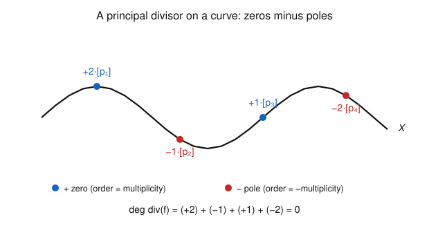

# Algebraic Geometry · Lesson 4.3: Divisors on a curve

> ⏱ ~15 min · Module 4: Schemes & a first look at curves · Builds on: [Lesson 2.1](02-01-rational-functions-function-field.md) (function field), [Lesson 3.2](03-02-local-rings-localization.md) (local rings), [Lesson 3.4](03-04-smoothness-singularities-tangent-cone.md) (smoothness) · Unlocks: [Lesson 4.4](04-04-line-bundles-picard.md) (line bundles & the Picard group)

## Why this matters

A rational function on a curve does two things: it vanishes at some points and blows up at others. Almost everything about the geometry of curves — the Riemann–Roch theorem ([Lesson 4.5](04-05-riemann-roch.md)), the classification of maps to projective space, the group law on an elliptic curve — is bookkeeping about *which* points and *to what order*. A **divisor** is exactly that bookkeeping device: a ledger with one integer per point. The single fact that makes the whole ledger balance — a rational function on a compact curve has as many zeros as poles — is the algebraic twin of the residue theorem you met in `complex-analysis`, and the language here is the same one number theorists use for divisors on curves over $\mathbb{Q}$. This lesson builds the ledger and proves it balances.

## The idea

Fix a nice curve $X$ (one-dimensional, smooth). Near any point $p$, [Lesson 3.2](03-02-local-rings-localization.md) told us the local ring $\mathcal{O}_{X,p}$ has a single "coordinate" $t_p$ vanishing at $p$ — a **uniformizer** — and every nonzero rational function looks like
$$f = (\text{unit}) \cdot t_p^{\,n}$$
near $p$, for a unique integer $n$. That integer is the whole story of $f$ at $p$: if $n>0$, $f$ has a **zero** of order $n$; if $n<0$, a **pole** of order $-n$; if $n=0$, $f$ is finite and nonzero there. Call it $\operatorname{ord}_p(f)$.

A **divisor** records this for every point at once: it's a formal sum $\sum_p n_p\,[p]$ with an integer $n_p$ at each point, almost all zero. The **divisor of $f$**, written $\operatorname{div}(f)$, puts $n_p=\operatorname{ord}_p(f)$ — a picture of all of $f$'s zeros (positive) and poles (negative) on one sheet.

The punchline, and it is a genuine theorem: on a *projective* (compact) curve, the coefficients of $\operatorname{div}(f)$ **always sum to zero**. Every zero is paid for by a pole. On a Riemann surface this is the statement that a meromorphic function has equally many zeros and poles counted with multiplicity; the rational function $t$ on the sphere has a zero at $0$ and a matching pole "at infinity." Forgetting the point at infinity is the one mistake this lesson is designed to stop you from making.

## The formal version

Throughout, $k=\bar k$ and $X$ is a **smooth projective curve**: an irreducible projective variety of dimension $1$, smooth at every point. Its function field $k(X)$ ([Lesson 2.1](02-01-rational-functions-function-field.md)) is where our functions live.

**The local rings are DVRs.** On a curve, smoothness at $p$ means $\mathcal{O}_{X,p}$ is a regular local ring of dimension $1$ ([Lesson 3.4](03-04-smoothness-singularities-tangent-cone.md)) — equivalently, its maximal ideal $\mathfrak{m}_p$ is *principal*, $\mathfrak{m}_p=(t_p)$. Such a ring is a **discrete valuation ring (DVR)**: every nonzero element of $k(X)$ is uniquely $u\,t_p^{\,n}$ with $u\in\mathcal{O}_{X,p}^\times$ a unit and $n\in\mathbb{Z}$. (This is the "$x^n\cdot(\text{unit})$" factorization from [Lesson 3.2](03-02-local-rings-localization.md), Example 1, now guaranteed at *every* point because $X$ is smooth.)

**Definition (order).** For $f\in k(X)^*$ and $p\in X$, the **order of $f$ at $p$** is the exponent
$$\operatorname{ord}_p(f):=n,\qquad\text{where } f=u\,t_p^{\,n},\ u\in\mathcal{O}_{X,p}^\times.$$

*In words:* count how many times the uniformizer divides $f$ near $p$; positive means a zero, negative means a pole.

It is independent of which uniformizer you pick (any two differ by a unit) and satisfies, for all $f,g\in k(X)^*$,
$$\operatorname{ord}_p(fg)=\operatorname{ord}_p(f)+\operatorname{ord}_p(g),\qquad \operatorname{ord}_p(f+g)\ge\min\big(\operatorname{ord}_p(f),\operatorname{ord}_p(g)\big).$$
So $\operatorname{ord}_p\colon k(X)^*\to\mathbb{Z}$ is a group homomorphism (a *valuation*): products add orders, and $f$ is regular and nonvanishing at $p$ exactly when $\operatorname{ord}_p(f)=0$.

**Definition (Weil divisor).** A **divisor** on $X$ is a finite formal integer combination of points,
$$D=\sum_{p\in X} n_p\,[p],\qquad n_p\in\mathbb{Z},\ \ n_p=0\text{ for all but finitely many }p.$$
Divisors form a free abelian group $\operatorname{Div}(X)=\bigoplus_{p\in X}\mathbb{Z}\,[p]$ (add coefficient-wise). Its **degree** is the sum of coefficients,
$$\deg D:=\sum_{p} n_p\ \in\mathbb{Z},$$
and $\deg\colon\operatorname{Div}(X)\to\mathbb{Z}$ is a homomorphism.

*In words:* a divisor is one integer per point (almost all zero); its degree is the running total.

**Definition (principal divisor).** For $f\in k(X)^*$,
$$\operatorname{div}(f):=\sum_{p\in X}\operatorname{ord}_p(f)\,[p]=\underbrace{\sum_{\operatorname{ord}_p(f)>0}\operatorname{ord}_p(f)[p]}_{\text{zeros}}\ -\ \underbrace{\sum_{\operatorname{ord}_p(f)<0}\big(-\operatorname{ord}_p(f)\big)[p]}_{\text{poles}}.$$
This is a legitimate (finite) divisor: a nonzero rational function has only finitely many zeros and poles, since its zero/pole locus is a proper closed subset of the $1$-dimensional $X$, hence finite. A divisor of this form is called **principal**. Because $\operatorname{ord}_p$ is a homomorphism, so is $\operatorname{div}$:
$$\operatorname{div}(fg)=\operatorname{div}(f)+\operatorname{div}(g),\qquad \operatorname{div}(1/f)=-\operatorname{div}(f).$$

*In words:* $\operatorname{div}(f)$ is "all the zeros minus all the poles of $f$," each weighted by its order.

**Theorem (degree of a principal divisor).** If $X$ is a smooth projective curve and $f\in k(X)^*$, then
$$\deg\operatorname{div}(f)=0.$$

*In words:* on a compact curve, a rational function has exactly as many zeros as poles, counted with multiplicity. This is the algebraic residue theorem.

*Proof sketch.* A nonconstant $f$ is a morphism $f\colon X\to\mathbb{P}^1$, finite of some degree $d=[k(X):k(f)]$. Its zeros are the fiber $f^{-1}(0)$ and its poles the fiber $f^{-1}(\infty)$, each counted with the multiplicity that is exactly $\operatorname{ord}_p(f)$; a finite morphism of smooth curves has every fiber of total length $d$. Thus the zeros total $d$ and the poles total $d$, and $\deg\operatorname{div}(f)=d-d=0$. (We verify this from scratch on $\mathbb{P}^1$ below, where "$d=\max(\deg\text{num},\deg\text{den})$" is visible.) A constant $f\in k^*$ has $\operatorname{div}(f)=0$ trivially. $\blacksquare$

**Both hypotheses are load-bearing.** *Smooth* makes every $\mathcal{O}_{X,p}$ a DVR, so $\operatorname{ord}_p$ is defined and single-valued at every point. *Projective* is what forces the balance: on the affine line $\mathbb{A}^1$ the function $t$ has a zero at $0$ and no pole — degree $1$, not $0$ — because the pole ran off to infinity, which $\mathbb{A}^1$ doesn't contain. Compactifying to $\mathbb{P}^1$ puts that point back.

**Definition (linear equivalence).** Divisors $D,D'$ are **linearly equivalent**, $D\sim D'$, if their difference is principal:
$$D\sim D'\iff D-D'=\operatorname{div}(f)\text{ for some }f\in k(X)^*.$$

*In words:* two divisors are equivalent when you can slide one to the other along the zeros and poles of a single rational function.

This is an equivalence relation (principal divisors form a subgroup, since $\operatorname{div}(f)-\operatorname{div}(g)=\operatorname{div}(f/g)$), and the theorem gives the payoff that runs [Lesson 4.4](04-04-line-bundles-picard.md):

**Corollary.** Degree is well-defined on linear-equivalence classes: if $D\sim D'$ then $\deg D=\deg D'$.

*Proof.* $\deg D-\deg D'=\deg(D-D')=\deg\operatorname{div}(f)=0$. $\blacksquare$

## Picture

The curve $X$ carries a principal divisor $\operatorname{div}(f)=2[p_1]-[p_2]+[p_3]-2[p_4]$: at $p_1$ the function $f$ has a double zero, at $p_4$ a double pole, and so on. Zeros (blue, positive) and poles (red, negative) are two colors of the same ledger. Because $X$ is projective, the coefficients sum to $0$: the two units of zero at $p_1$ and one at $p_3$ are exactly cancelled by the pole of order $1$ at $p_2$ and order $2$ at $p_4$. A generic (non-principal) divisor need not balance — only the ones that come from a function do.

## Worked examples

We work on $X=\mathbb{P}^1$, the projective line, with homogeneous coordinates $[X_0:X_1]$. The standard chart $X_0\neq0$ has affine coordinate $t=X_1/X_0$, and $k(\mathbb{P}^1)=k(t)$. There is exactly one point off this chart, $\infty=[0:1]$. Its uniformizers:

- at a **finite** point $t=a$, the uniformizer is $t-a$ (it vanishes to first order there);
- at $\infty$, the uniformizer is $s:=1/t$ (the coordinate on the other chart $X_1\neq0$, where $\infty$ is $s=0$).

The one computation you must always do at $\infty$: rewrite $f$ in terms of $s=1/t$ and read off $\operatorname{ord}_{s=0}$.

**Example 1 (the coordinate function $t$).** Compute $\operatorname{div}(t)$.

- At $t=0$: $t=t-0$ is the uniformizer, so $\operatorname{ord}_0(t)=+1$ — a simple zero.
- At $t=a\neq0$ (finite): $t=a+(t-a)$ has value $a\neq0$ at $p$, so it is a unit in $\mathcal{O}_{\mathbb{P}^1,a}$; $\operatorname{ord}_a(t)=0$.
- At $\infty$: substitute $t=1/s$. Then $t=s^{-1}$, so $\operatorname{ord}_\infty(t)=\operatorname{ord}_{s=0}(s^{-1})=-1$ — a simple pole.

Hence
$$\operatorname{div}(t)=[0]-[\infty],\qquad \deg\operatorname{div}(t)=1+(-1)=0.\ \checkmark$$
The zero at the origin is paid for by a pole at infinity — exactly the point $\mathbb{A}^1$ was blind to.

**Example 2 (a Möbius ratio — every two points are equivalent).** For distinct $a\neq b$ in $k$, compute $\operatorname{div}\!\big(\tfrac{t-a}{t-b}\big)$.

- At $t=a$: numerator $t-a$ is the uniformizer (order $+1$); denominator $t-b$ has value $a-b\neq0$, a unit. So $\operatorname{ord}_a=+1$.
- At $t=b$: denominator vanishes to first order, numerator is a unit ($b-a\neq0$). So $\operatorname{ord}_b=-1$.
- At any other finite $t=c$ ($c\neq a,b$): both factors are units, $\operatorname{ord}_c=0$.
- At $\infty$: substitute $t=1/s$:
$$\frac{t-a}{t-b}=\frac{1/s-a}{1/s-b}=\frac{1-as}{1-bs}.$$
At $s=0$ this is $\tfrac{1}{1}=1$, a unit — the poles of numerator and denominator cancelled. So $\operatorname{ord}_\infty=0$.

Therefore
$$\operatorname{div}\!\Big(\frac{t-a}{t-b}\Big)=[a]-[b],\qquad \deg=0.\ \checkmark$$
Read as linear equivalence, this says $[a]\sim[b]$: **any two points of $\mathbb{P}^1$ are linearly equivalent.** Sliding one point to another is precisely the job of a Möbius transformation, and it is why $\mathbb{P}^1$ has essentially one divisor class per degree — the seed of $\operatorname{Pic}(\mathbb{P}^1)\cong\mathbb{Z}$ in P2 and [Lesson 4.4](04-04-line-bundles-picard.md).

**The general check on $\mathbb{P}^1$.** For $f=p(t)/q(t)$ in lowest terms with $\deg p=m$, $\deg q=n$: the finite zeros of $f$ total $m$ and the finite poles total $n$ (with multiplicity), while at infinity $\operatorname{ord}_\infty(f)=n-m$ (substitute $t=1/s$: $f=s^{\,n-m}\cdot(\text{unit})$). The total is $m-n+(n-m)=0$ — the theorem, seen by hand, with the point at infinity supplying the balancing term.

## Watch out

- **The pole at infinity is real.** On $\mathbb{P}^1$, a polynomial of degree $d$ has a pole of order $d$ at $\infty$; $t^2$ is not "pole-free," it has a double pole at infinity. Every degree check that "fails" is almost always a forgotten $[\infty]$. Always convert to $s=1/t$ and inspect $s=0$.
- **Order is about the uniformizer, not the coordinate.** At $\infty$ the right local coordinate is $s=1/t$, so $\operatorname{ord}_\infty(t)=-1$, *not* $+1$. Using $t$ to measure order near $\infty$ inverts every sign there.
- **Smoothness is what makes $\operatorname{ord}_p$ meaningful.** At a singular point the local ring is not a DVR (its maximal ideal isn't principal — recall the node in [Lesson 3.4](03-04-smoothness-singularities-tangent-cone.md)), and "$f=u\,t_p^{\,n}$" fails: order can be fractional or ill-defined. Weil divisors as defined here live on smooth curves.
- **Principal is stronger than degree-$0$.** Every principal divisor has degree $0$, but the converse can fail on curves of positive genus: on an elliptic curve $[p]-[q]$ (degree $0$) is principal only when $p=q$. On $\mathbb{P}^1$ they coincide (P2), which is exactly what makes $\mathbb{P}^1$ special.

## One-liner

> A divisor is one integer per point; $\operatorname{div}(f)$ writes down a rational function's zeros minus its poles — and on a projective curve that ledger always sums to zero.

## Problems

**P1 (🟢)** On $\mathbb{P}^1$ with coordinate $t$, compute $\operatorname{div}(f)$ for $f=\dfrac{t^2}{t-1}$, being explicit about the point at infinity, and verify $\deg\operatorname{div}(f)=0$.

**P2 (🟡)** On $\mathbb{P}^1$: (a) Using Example 2, show that any two points (finite or $\infty$) are linearly equivalent. (b) Deduce that every divisor $D$ on $\mathbb{P}^1$ satisfies $D\sim(\deg D)\,[\infty]$. (c) Conclude that for divisors on $\mathbb{P}^1$, $D\sim D'\iff\deg D=\deg D'$ — so the degree map is an isomorphism $\operatorname{Div}(\mathbb{P}^1)/\!\sim\ \xrightarrow{\ \cong\ }\mathbb{Z}$.

**P3 (🔴, optional)** Let $R$ be a DVR (the local ring $\mathcal{O}_{X,p}$ of a smooth point) with uniformizer $t$ and valuation $v=\operatorname{ord}_p$ on $k(X)^*$. Prove the two valuation laws and one refinement:
(i) $v(fg)=v(f)+v(g)$; (ii) $v(f+g)\ge\min\big(v(f),v(g)\big)$; (iii) if $v(f)\neq v(g)$ then equality holds in (ii). Then interpret (iii) geometrically: if $f$ has a pole of order $3$ and $g$ a pole of order $5$ at $p$, what is $\operatorname{ord}_p(f+g)$?

Solutions

**P1** Factor the zeros and poles by inspecting each point.
- $t=0$: numerator $t^2$ contributes order $+2$ (uniformizer $t$, squared); denominator $t-1$ has value $-1\neq0$, a unit. So $\operatorname{ord}_0(f)=+2$.
- $t=1$: denominator $t-1$ is the uniformizer (order $+1$ in the denominator ⇒ $-1$ overall); numerator $t^2$ has value $1\neq0$, a unit. So $\operatorname{ord}_1(f)=-1$.
- other finite $t=c\neq0,1$: numerator and denominator both units, $\operatorname{ord}_c=0$.
- $\infty$: substitute $t=1/s$:
$$f=\frac{(1/s)^2}{1/s-1}=\frac{1/s^2}{(1-s)/s}=\frac{1}{s^2}\cdot\frac{s}{1-s}=\frac{1}{s}\cdot\frac{1}{1-s}=s^{-1}\cdot(\text{unit at }s=0).$$
So $\operatorname{ord}_\infty(f)=-1$. (Consistent with the shortcut: $\deg\text{num}-\deg\text{den}=2-1=1$, so $\operatorname{ord}_\infty=n-m=1-2=-1$.)

Hence
$$\operatorname{div}(f)=2[0]-[1]-[\infty],\qquad \deg=2-1-1=0.\ \checkmark$$
Two units of zero at the origin, cancelled by simple poles at $1$ and at infinity.

**P2** (a) For finite $a\neq b$, Example 2 gives $\operatorname{div}\!\big(\tfrac{t-a}{t-b}\big)=[a]-[b]$, so $[a]\sim[b]$. For a finite $a$ versus $\infty$: from Example 1's method, $\operatorname{div}(t-a)$ has a simple zero at $a$ and (since $t-a=(1-as)/s$ in the $s$-chart) a simple pole at $\infty$, i.e.
$$\operatorname{div}(t-a)=[a]-[\infty]\ \Rightarrow\ [a]\sim[\infty].$$
By transitivity all points are mutually linearly equivalent. $\blacksquare$

(b) Write $D=\sum_i n_i[p_i]$. Replacing each $[p_i]$ by the equivalent $[\infty]$ costs a principal divisor: $[p_i]-[\infty]=\operatorname{div}(g_i)$ (with $g_i=t-p_i$ for finite $p_i$, and $g_i=1$ for $p_i=\infty$). Then
$$D-(\deg D)[\infty]=\sum_i n_i\big([p_i]-[\infty]\big)=\operatorname{div}\Big(\prod_i g_i^{\,n_i}\Big),$$
which is principal. Hence $D\sim(\deg D)[\infty]$.

(c) ($\Rightarrow$) If $D\sim D'$ then $\deg D=\deg D'$ by the Corollary. ($\Leftarrow$) If $\deg D=\deg D'=:m$, then by (b) both are $\sim m[\infty]$, so $D\sim D'$ by transitivity. Thus $[D]\mapsto\deg D$ is a well-defined injective homomorphism $\operatorname{Div}(\mathbb{P}^1)/\!\sim\ \to\mathbb{Z}$; it is surjective since $\deg\,[\infty]=1$. Therefore it is an isomorphism, and every class is determined by its degree — this group is $\operatorname{Pic}(\mathbb{P}^1)\cong\mathbb{Z}$ of [Lesson 4.4](04-04-line-bundles-picard.md). $\blacksquare$

**P3** Write $f=u\,t^{m}$ and $g=w\,t^{n}$ with units $u,w\in R^\times$ and $m=v(f)$, $n=v(g)$; WLOG $m\le n$.

(i) $fg=(uw)\,t^{m+n}$ and $uw\in R^\times$ (product of units), so $v(fg)=m+n=v(f)+v(g)$. $\blacksquare$

(ii) Factor out the smaller power: $f+g=t^{m}\big(u+w\,t^{\,n-m}\big)$. Since $n-m\ge0$, the bracket lies in $R$, so $f+g\in t^m R$ and $v(f+g)\ge m=\min(m,n)$. $\blacksquare$

(iii) Suppose $m<n$ (strict). In the bracket $u+w\,t^{\,n-m}$, the term $w\,t^{\,n-m}\in\mathfrak{m}=(t)$ (as $n-m\ge1$), while $u$ is a unit, i.e. $u\notin\mathfrak{m}$. Reducing modulo $\mathfrak{m}$, the bracket $\equiv\bar u\neq0$ in the residue field, so it is *not* in $\mathfrak{m}$ — hence itself a unit. Therefore $f+g=t^{m}\cdot(\text{unit})$ and $v(f+g)=m=\min(m,n)$ exactly. $\blacksquare$

*Geometric reading:* poles of orders $3$ and $5$ mean $v(f)=-3$, $v(g)=-5$. Since $-5\neq-3$, (iii) applies and $\operatorname{ord}_p(f+g)=\min(-3,-5)=-5$: the sum has a pole of order $5$ — the worse pole wins, and it cannot be cancelled because the orders differ. (Equal orders can cancel: that is why (iii) needs $v(f)\neq v(g)$.)

## Flashback

**From [Lesson 3.2](03-02-local-rings-localization.md) (local rings & order of vanishing):** In the DVR $\mathcal{O}_{\mathbb{A}^1,0}=k[x]_{(x)}$ with uniformizer $x$, every nonzero element of $k(x)$ is $x^{n}\cdot(\text{unit})$. Find $n=\operatorname{ord}_0(\varphi)$ for
$$\varphi=\frac{x^2(x-3)}{x^5-x^4},$$
and say whether $\varphi$ is regular at $0$.

Solution

Factor top and bottom and cancel: $x^5-x^4=x^4(x-1)$, so
$$\varphi=\frac{x^2(x-3)}{x^4(x-1)}=\frac{x-3}{x^2(x-1)}.$$
Now read the order at $0$: the numerator $x-3$ has value $-3\neq0$ (a unit), and the denominator carries the factor $x^2$ (the other factor $x-1$ has value $-1\neq0$, a unit). So
$$\varphi=x^{-2}\cdot\underbrace{\frac{x-3}{x-1}}_{\text{unit at }0},\qquad \operatorname{ord}_0(\varphi)=-2.$$
The order is negative, so $\varphi$ has a **pole of order $2$** at $0$ and is **not regular** there: $\varphi\notin\mathcal{O}_{\mathbb{A}^1,0}$, though it certainly lives in the fraction field $k(x)$, where $\operatorname{ord}_0$ still makes sense as the DVR valuation extended to $k(x)^*$. This is exactly the extension of "$x^n\cdot(\text{unit})$" from the ring to the whole function field that defines $\operatorname{ord}_p$ in this lesson.

## Connections

- **Backward:** $\operatorname{ord}_p$ is the "$x^n\cdot(\text{unit})$" factorization of the local ring $\mathcal{O}_{X,p}$ from [Lesson 3.2](03-02-local-rings-localization.md), promoted to every point by the smoothness criterion of [Lesson 3.4](03-04-smoothness-singularities-tangent-cone.md) (smooth curve point ⟺ regular local ring of dimension $1$ ⟺ DVR). Functions come from the function field $k(X)$ of [Lesson 2.1](02-01-rational-functions-function-field.md), and the point at infinity on $\mathbb{P}^1$ is the two-chart picture of [Lesson 4.2](04-02-structure-sheaf-gluing-schemes.md).
- **Forward:** [Lesson 4.4](04-04-line-bundles-picard.md) turns the linear-equivalence classes $\operatorname{Div}(X)/\!\sim$ into the **Picard group** $\operatorname{Pic}(X)$ and attaches to each divisor $D$ the vector space $L(D)=\{f: \operatorname{div}(f)+D\ge0\}\cup\{0\}$ of functions with poles bounded by $D$; [Lesson 4.5](04-05-riemann-roch.md) computes $\dim L(D)$ via Riemann–Roch, where $\deg D$ (well-defined by today's Corollary) is the leading term.
- **Sideways (`complex-analysis`):** on a compact Riemann surface, $\operatorname{ord}_p(f)$ is the order of the zero/pole of a meromorphic function, and $\deg\operatorname{div}(f)=0$ *is* the residue theorem applied to $df/f$ (whose residue at $p$ equals $\operatorname{ord}_p(f)$). The whole divisor–function-field–Riemann–Roch story is one dictionary shared by algebra and analysis.
- **Sideways (`number-theory`):** divisors on curves over $\mathbb{Q}$ or a number field are the geometric core of arithmetic geometry — the group law on an elliptic curve is defined by linear equivalence of degree-$0$ divisors, and $\operatorname{Pic}^0$ is the Jacobian. The bookkeeping built here is the same object number theorists count rational points with.
- **Sideways (`abstract-algebra`):** a DVR is the cleanest nontrivial local ring — a local PID that is not a field — and $\operatorname{ord}_p$ is a discrete valuation. Divisors package the collection of all these valuations on $k(X)$ into a single free abelian group.
