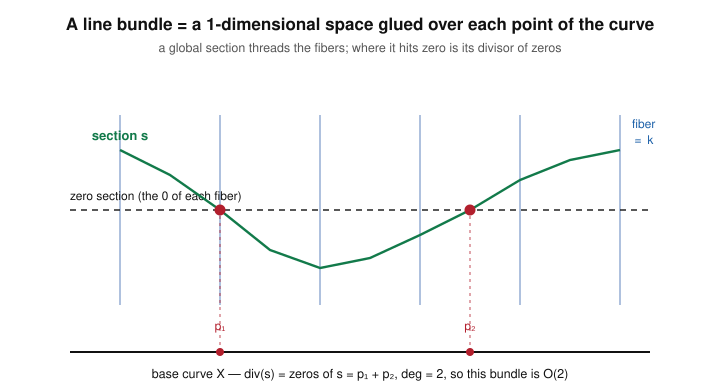

# Algebraic Geometry · Lesson 4.4: Line bundles & the Picard group

> ⏱ ~15 min · Module 4: Schemes & a first look at curves · Builds on: [Lesson 4.3](04-03-divisors-on-a-curve.md) (divisors, degree, linear equivalence), [Lesson 3.5](03-05-sheaves-first-treatment.md) (sheaves) & [Lesson 3.6](03-06-structure-sheaf.md) (the structure sheaf) · Unlocks: [Lesson 4.5](04-05-riemann-roch.md) (Riemann–Roch)

## Why this matters

A divisor $D$ on a curve is a bookkeeping device: it says "you may have a pole of order up to $2$ here, but you must vanish there." The natural question is: **how many functions obey that bookkeeping?** The answer is a vector space $L(D)$, and its dimension $\ell(D)$ is the single number the whole endgame of this course — Riemann–Roch ([Lesson 4.5](04-05-riemann-roch.md)) — computes. This lesson builds $L(D)$, shows it is finite-dimensional, and then reveals that the divisor $D$ was only ever a *coordinate description* of a more intrinsic object: a **line bundle**. Line bundles are how modern geometry, and every gauge theory in physics, packages "a one-dimensional space varying over a base."

## The idea

Fix a smooth projective curve $X$ over $k=\bar k$, with function field $k(X)$ and divisor group $\operatorname{Div}(X)$ from [Lesson 4.3](04-03-divisors-on-a-curve.md). A divisor $D=\sum_p n_p[p]$ is a target: it grants each point $p$ a **pole budget** $n_p$ (poles up to order $n_p$ allowed if $n_p>0$; a forced zero of order $\ge -n_p$ if $n_p<0$). Collect every rational function that lives within budget everywhere at once — that is $L(D)$.

Two facts make it tractable. First, "within budget" is a *linear* condition — sums and scalar multiples of budget-respecting functions still respect the budget — so $L(D)$ is a $k$-vector space. Second, on a projective curve the budget is finite and the space is small: $\ell(D):=\dim_k L(D)<\infty$.

Now the reframing. Instead of tracking the budget $D$ globally, hand each little open set $U$ its own copy of "functions that clear the budget on $U$." That assignment is a sheaf, and because the budget pins down exactly *one* pole order per point, each stalk is a free rank-one module — the sheaf is a **line bundle** $\mathcal{O}_X(D)$: a one-dimensional vector space (a *line*) attached to each point, twisting as you move along the curve. The divisor is just one coordinate chart's worth of data; the line bundle is the coordinate-free object, and $L(D)$ is exactly its space of *global sections*.

## The formal version

**Definition (the Riemann–Roch space).** For $D\in\operatorname{Div}(X)$,
$$L(D)=\{\,f\in k(X)^{*}: \operatorname{div}(f)+D\ge 0\,\}\cup\{0\},\qquad \ell(D):=\dim_k L(D).$$

*In words:* $L(D)$ is the rational functions whose poles are "no worse than $D$ permits." The inequality $\operatorname{div}(f)+D\ge0$ reads coefficient-by-coefficient: at every point $p$, $\operatorname{ord}_p(f)\ge -n_p$, i.e. a pole at $p$ of order at most $n_p$ (and, where $n_p<0$, a forced zero).

It is a $k$-vector space: if $\operatorname{div}(f)+D\ge0$ and $\operatorname{div}(g)+D\ge0$ then $\operatorname{ord}_p(f+g)\ge\min(\operatorname{ord}_p f,\operatorname{ord}_p g)\ge -n_p$, so $f+g\in L(D)$; scaling is immediate. Three facts you can read straight off the definition:

- **$\ell(D)=0$ when $\deg D<0$.** A nonzero $f\in L(D)$ gives $\operatorname{div}(f)+D\ge0$, an effective divisor, so $0\le\deg(\operatorname{div}(f)+D)=\deg\operatorname{div}(f)+\deg D=0+\deg D=\deg D$ (principal divisors have degree $0$ — [Lesson 4.3](04-03-divisors-on-a-curve.md)). Thus $\deg D\ge0$; contrapositive gives the claim.
- **$L(0)=k$, so $\ell(0)=1$.** Here $\operatorname{div}(f)\ge0$ forces $f$ to have no poles at all; a global pole-free rational function on a projective curve is a constant. So $L(0)$ is exactly the constants $k$.
- **$L(D)\cong L(D')$ when $D\sim D'$.** Linear equivalence $D'=D+\operatorname{div}(h)$ ([Lesson 4.3](04-03-divisors-on-a-curve.md)) gives an isomorphism $L(D)\to L(D')$, $f\mapsto f/h$: then $\operatorname{div}(f/h)+D'=\operatorname{div}(f)-\operatorname{div}(h)+D+\operatorname{div}(h)=\operatorname{div}(f)+D\ge0$. Hence **$\ell$ depends only on the linear-equivalence class.**

**Definition (line bundle / invertible sheaf).** Sheafify the budget: for open $U\subseteq X$ set
$$\mathcal{O}_X(D)(U)=\{\,f\in k(X)^{*}:(\operatorname{div}(f)+D)|_U\ge0\,\}\cup\{0\}.$$
This is a sheaf of $\mathcal{O}_X$-modules, **locally free of rank $1$**: near any point $p$, pick a local function $t$ with $\operatorname{ord}_p(t)=1$ (a uniformizer); then $t^{-n_p}$ trivializes the budget and $\mathcal{O}_X(D)$ looks like $\mathcal{O}_X$ itself. A rank-one locally free sheaf is a **line bundle** (equivalently, an **invertible sheaf**). Its **global sections** recover the Riemann–Roch space:
$$\Gamma\!\left(X,\mathcal{O}_X(D)\right)=\mathcal{O}_X(D)(X)=L(D).$$

*In words:* $\mathcal{O}_X(D)$ is "functions with poles bounded by $D$," but now organized open-set-by-open-set. Locally it is indistinguishable from ordinary functions; the divisor's global data is what makes it twist. Its sections over all of $X$ are exactly $L(D)$.

**The correspondence.** Invertible sheaves multiply by tensor product, $\mathcal{O}_X(D)\otimes\mathcal{O}_X(D')\cong\mathcal{O}_X(D+D')$, with inverse $\mathcal{O}_X(D)^{-1}\cong\mathcal{O}_X(-D)$ (hence "invertible"). Their isomorphism classes form an abelian group, the **Picard group** $\operatorname{Pic}(X)$. The map $D\mapsto\mathcal{O}_X(D)$ is then a group homomorphism $\operatorname{Div}(X)\to\operatorname{Pic}(X)$, and:

$$\boxed{\;\mathcal{O}_X(D)\cong\mathcal{O}_X(D')\iff D\sim D'\;}\qquad\Longrightarrow\qquad \operatorname{Div}(X)/\!\sim\;\;\xrightarrow{\ \cong\ }\;\operatorname{Pic}(X).$$

*In words:* two divisors give the same line bundle exactly when they are linearly equivalent, and on a smooth curve **every** line bundle comes from a divisor — so the Picard group *is* the group of divisor classes. Because degree is constant on a class ($\deg\operatorname{div}(h)=0$), it descends to a homomorphism $\deg:\operatorname{Pic}(X)\to\mathbb{Z}$.

## Picture

Each point of the base curve $X$ carries its own line (a copy of $k$, the *fiber*). A global **section** $s$ chooses one point in each fiber, continuously. Where $s$ meets the zero level is its **divisor of zeros** — here $\operatorname{div}(s)=p_1+p_2$, degree $2$, so this is the bundle $\mathcal{O}(2)$. Different sections of the *same* bundle vanish on *different but linearly equivalent* divisors: that is the divisor class the bundle remembers.

## Worked examples

**Example 1 ($L(n[\infty])$ on $\mathbb{P}^1$ — a clean, verifiable count).** Take $X=\mathbb{P}^1$ with affine coordinate $t$, the point $\infty$ at infinity, and $D=n[\infty]$ for an integer $n\ge0$. A function $f\in L(D)$ must satisfy $\operatorname{div}(f)+n[\infty]\ge0$: it may have a pole **only at $\infty$**, of order $\le n$, and must be regular (no poles) at every finite point. A rational function on $\mathbb{P}^1$ with no finite poles is a **polynomial** in $t$. And the order of the pole of a polynomial at $\infty$ is its degree: with local coordinate $u=1/t$ at $\infty$, $t^{d}=u^{-d}$ has a pole of order $d$. So
$$L(n[\infty])=\{\text{polynomials in }t\text{ of degree}\le n\}=\operatorname{span}_k\{1,t,t^2,\dots,t^{n}\},$$
$$\ell(n[\infty])=n+1.$$
Check against the master facts: $n=0$ gives $L(0)=k$, $\ell=1$ ✓; and $D=n[\infty]$ has degree $n\ge0$, so $\ell>0$ ✓. The corresponding line bundle is the celebrated $\mathcal{O}(n)=\mathcal{O}_{\mathbb{P}^1}(n[\infty])$, and this count $\dim\Gamma(\mathbb{P}^1,\mathcal{O}(n))=n+1$ is one you will use constantly.

**Example 2 ($\operatorname{Pic}(\mathbb{P}^1)\cong\mathbb{Z}$).** Claim: every line bundle on $\mathbb{P}^1$ is $\mathcal{O}(n)$ for a unique $n\in\mathbb{Z}$, and $\deg:\operatorname{Pic}(\mathbb{P}^1)\to\mathbb{Z}$ is an isomorphism. By the correspondence it suffices to show $\deg:\operatorname{Div}(\mathbb{P}^1)/\!\sim\;\to\mathbb{Z}$ is a bijection.
*Surjective:* $\deg(n[\infty])=n$ hits every integer.
*Injective:* we show a degree-$0$ divisor is principal, hence $\sim0$. Let $D=\sum_a n_a[a]+n_\infty[\infty]$ (finite points $a\in k$) with $\deg D=0$. Set $f=\prod_a (t-a)^{n_a}$. Since $\operatorname{div}(t-a)=[a]-[\infty]$,
$$\operatorname{div}(f)=\sum_a n_a\big([a]-[\infty]\big)=\sum_a n_a[a]-\Big(\textstyle\sum_a n_a\Big)[\infty].$$
Then $D-\operatorname{div}(f)=\big(n_\infty+\sum_a n_a\big)[\infty]=(\deg D)[\infty]=0$, so $D=\operatorname{div}(f)$ is principal. Thus $\deg$ is injective on classes. Both together: $\operatorname{Pic}(\mathbb{P}^1)\cong\mathbb{Z}$, and the bundle of degree $n$ is exactly $\mathcal{O}(n)$.

## Watch out

- **You might think $\ell(D)=\deg D+1$ always** (it does hold on $\mathbb{P}^1$) — but that is a genus-$0$ accident. On a curve of genus $g$, $\ell(D)$ is only *bounded* by $\deg D+1$, and the exact value needs the correction term $\ell(K-D)$: that is precisely the content of Riemann–Roch ([Lesson 4.5](04-05-riemann-roch.md)). Do not extrapolate the $\mathbb{P}^1$ formula.
- **You might conflate the section $s$ with a function.** A section of $\mathcal{O}_X(D)$ is a function only *after* trivializing — globally it is a twisting object with an honest divisor of zeros $\operatorname{div}(s)\ge0$ (an *effective* divisor linearly equivalent to $D$). The zeros move as you change section; only their class is fixed.
- **You might expect $\mathcal{O}_X(D)$ to depend on $D$, not its class.** It depends only on $D$ up to linear equivalence: $D\sim D'\Rightarrow\mathcal{O}_X(D)\cong\mathcal{O}_X(D')$. That collapse is exactly what makes $\operatorname{Pic}(X)=\operatorname{Div}(X)/\!\sim$ well-defined.

## One-liner

> A divisor sets a pole budget; the functions that meet it form the finite-dimensional space $L(D)$, and the budget's coordinate-free shadow is a line bundle — divisor classes and line bundles are the same group, $\operatorname{Pic}(X)$.

## Problems

**P1 (🟢)** On $\mathbb{P}^1$ with coordinate $t$: (a) Compute $\ell(3[\infty])$ and give an explicit basis of $L(3[\infty])$. (b) Let $D=-2[0]$. Compute $\ell(D)$ and justify it two ways — once from the degree, once directly from the budget condition.

**P2 (🟡)** On $\mathbb{P}^1$, compute $L\big([0]+[\infty]\big)$: find its dimension and an explicit basis of rational functions in $t$, and name the line bundle $\mathcal{O}(n)$ it corresponds to. (Hint: which Laurent monomials $t^k$ clear a simple-pole budget at *both* $0$ and $\infty$?)

**P3 (🔴, optional)** Prove that on $\mathbb{P}^1$, two divisors of the same degree are linearly equivalent, and deduce $\deg:\operatorname{Pic}(\mathbb{P}^1)\to\mathbb{Z}$ is an isomorphism. (You may use that $\operatorname{div}(t-a)=[a]-[\infty]$ for finite $a$.)

Solutions

**P1** (a) By Example 1 with $n=3$: $L(3[\infty])$ is the polynomials of degree $\le 3$, so $\ell(3[\infty])=4$ with basis $\{1,t,t^2,t^3\}$.
(b) $\deg D=-2<0$, so $\ell(D)=0$ by the master fact. Directly: a nonzero $f\in L(-2[0])$ would need $\operatorname{div}(f)-2[0]\ge0$, i.e. $\operatorname{ord}_0(f)\ge2$ and $\operatorname{ord}_p(f)\ge0$ at every other point — so $f$ has a double zero at $0$ and no poles anywhere. A pole-free rational function on $\mathbb{P}^1$ is a constant, and a nonzero constant has no zeros; contradiction. Hence $L(D)=\{0\}$, $\ell(D)=0$.

**P2** $D=[0]+[\infty]$ has $\deg D=2$. A function $f\in L(D)$ may have a pole of order $\le1$ at $0$, a pole of order $\le1$ at $\infty$, and no poles elsewhere. Functions on $\mathbb{P}^1$ with poles confined to $\{0,\infty\}$ are the Laurent polynomials $\sum_k c_k t^k$. The monomial $t^k$ has $\operatorname{ord}_0(t^k)=k$ (pole at $0$ iff $k<0$, of order $-k$) and $\operatorname{ord}_\infty(t^k)=-k$ (pole at $\infty$ iff $k>0$, of order $k$). The budget "pole order $\le1$ at each" forces $-k\le1$ and $k\le1$, i.e. $-1\le k\le1$. So
$$L\big([0]+[\infty]\big)=\operatorname{span}_k\{t^{-1},\,1,\,t\},\qquad \ell=3.$$
Check: $\ell=3=\deg D+1$, consistent with genus $0$. The bundle has degree $2$, so it is $\mathcal{O}(2)$. (Indeed $[0]+[\infty]\sim 2[\infty]$ since $\operatorname{div}(t)=[0]-[\infty]$, and $\mathcal{O}(2[\infty])=\mathcal{O}(2)$.)

**P3** *Every degree-$0$ divisor is principal.* Let $D=\sum_a n_a[a]+n_\infty[\infty]$ with finite points $a\in k$ and $\deg D=\sum_a n_a+n_\infty=0$. Put $f=\prod_a(t-a)^{n_a}\in k(t)^{*}$. Using $\operatorname{div}(t-a)=[a]-[\infty]$ and additivity of $\operatorname{div}$,
$$\operatorname{div}(f)=\sum_a n_a[a]-\Big(\sum_a n_a\Big)[\infty].$$
Subtracting, $D-\operatorname{div}(f)=\big(n_\infty+\sum_a n_a\big)[\infty]=(\deg D)[\infty]=0$, so $D=\operatorname{div}(f)$ is principal, i.e. $D\sim0$.
*Same degree $\Rightarrow$ equivalent.* If $\deg D_1=\deg D_2$ then $\deg(D_1-D_2)=0$, so $D_1-D_2$ is principal by the above, i.e. $D_1\sim D_2$.
*Isomorphism.* $\deg:\operatorname{Pic}(\mathbb{P}^1)\to\mathbb{Z}$ is a homomorphism (degree adds under $+$, hence under $\otimes$). It is surjective ($\deg n[\infty]=n$) and injective: $\deg[D]=0\Rightarrow D\sim0\Rightarrow[D]=0$ in $\operatorname{Pic}$. Hence $\operatorname{Pic}(\mathbb{P}^1)\cong\mathbb{Z}$, the class of degree $n$ being $\mathcal{O}(n)$. $\blacksquare$

## Flashback

**From [Lesson 4.3](04-03-divisors-on-a-curve.md) (principal divisors have degree $0$; linear equivalence):** On $\mathbb{P}^1$ let $f(t)=\dfrac{t^{2}(t-1)}{t+2}$. Compute $\operatorname{div}(f)$ (include the behavior at $\infty$), verify $\deg\operatorname{div}(f)=0$, and use it to exhibit a linear equivalence between two *effective* divisors.

Solution

Zeros: $t=0$ with multiplicity $2$, and $t=1$ with multiplicity $1$. Finite pole: $t=-2$, order $1$. At infinity, compare degrees: $\deg(\text{num})=3$, $\deg(\text{den})=1$, so $f\sim t^{3-1}=t^{2}$ as $t\to\infty$ — a **pole of order $2$** at $\infty$. Therefore
$$\operatorname{div}(f)=2[0]+[1]-[-2]-2[\infty].$$
Degree: $2+1-1-2=0$ ✓ (as any principal divisor must be). Since $\operatorname{div}(f)\sim0$, moving the negative part to the other side,
$$2[0]+[1]\ \sim\ [-2]+2[\infty],$$
a linear equivalence between two effective divisors, each of degree $3$.

## Connections

- **Backward:** this rests entirely on [Lesson 4.3](04-03-divisors-on-a-curve.md) — degree, principal divisors (degree $0$), and linear equivalence are what make $\ell(D)$ a class invariant and $\deg$ descend to $\operatorname{Pic}$. The sheaf packaging $\mathcal{O}_X(D)$ is the [structure sheaf](03-06-structure-sheaf.md) of [Lesson 3.6](03-06-structure-sheaf.md) twisted by a budget, built on the sheaf axioms of [Lesson 3.5](03-05-sheaves-first-treatment.md).
- **Forward:** [Lesson 4.5](04-05-riemann-roch.md) computes $\ell(D)$ in general via $\ell(D)-\ell(K-D)=\deg D+1-g$; the $\mathbb{P}^1$ count $\ell(n[\infty])=n+1$ here is the $g=0$ special case, and $\operatorname{Pic}$ is where the canonical class $K$ will live.
- **Sideways (complex-analysis):** over $k=\mathbb{C}$ a smooth projective curve is a compact [Riemann surface](../../complex-analysis/syllabus.md), $L(D)$ is the space of meromorphic functions with prescribed pole bounds, and $\operatorname{Pic}$ / line bundles are the holomorphic line bundles of that theory — the same Riemann–Roch, read analytically.
- **Sideways (abstract-algebra):** for a number ring $\mathcal{O}_K$, the analogue of $\operatorname{Pic}$ is the ideal class group from [abstract-algebra](../../abstract-algebra/syllabus.md) / [number-theory](../../number-theory/syllabus.md) — "divisor classes modulo principal" is one idea serving both geometry and arithmetic.
