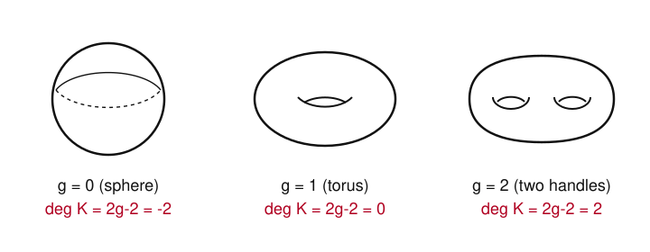

# Algebraic Geometry · Lesson 4.5: Riemann–Roch for curves

> ⏱ ~15 min · Module 4: Schemes & a first look at curves · Builds on: [Lesson 4.4](04-04-line-bundles-picard.md) (line bundles & $L(D)$), [Lesson 4.3](04-03-divisors-on-a-curve.md) (divisors) · Unlocks: nothing — course complete

## Why this matters

In Lesson 4.4 you learned to ask, of a divisor $D$ on a curve, *how many rational functions have poles no worse than $D$ allows* — the number $\ell(D)=\dim_k L(D)$. That single count controls almost everything concrete about a curve: whether it embeds in $\mathbb{P}^2$ or $\mathbb{P}^3$, how many independent differentials it carries, whether it is rational, how many parameters a linear system has. Riemann–Roch is the master formula that *computes* $\ell(D)$ from two pieces of pure bookkeeping — the degree of $D$ and one integer $g$, the **genus**, attached to the curve once and for all. It is the theorem that turns "count the sections" from a case-by-case struggle into arithmetic, and it is where the algebra–geometry dictionary of this whole course finally pays a dividend you can add and subtract.

## The idea

Here is the naive guess. A divisor $D=\sum_p n_p[p]$ of degree $d=\deg D$ permits a function to have, in total, $d$ "units" of pole. Prescribing a pole looks like $d$ free coefficients, plus one for the constant — so you might expect $\ell(D)=d+1$.

On $\mathbb{P}^1$ that guess is exactly right (you saw $\ell(n[\infty])=n+1$ in Lesson 4.4). On any other curve it *overcounts*, and it overcounts by the same fixed amount every time you push the degree high enough. That amount is the **genus** $g$. Topologically $g$ is the number of handles on the curve viewed as a surface — a sphere has $g=0$, a doughnut has $g=1$, a pretzel-ish two-holed surface has $g=2$. Each handle is one obstruction, one relation the naive count didn't see, one section you don't get.

Riemann–Roch makes the correction exact by adding a symmetric partner term. Alongside $D$ sits a special divisor $K$, the **canonical divisor**, and the theorem reads
$$\ell(D)-\ell(K-D)=\deg D+1-g.$$
The left side is your count minus a "dual" count; the right side is the naive $d+1$ knocked down by $g$. When $D$ is large the partner term vanishes and you get a clean formula; when $D$ is small the partner carries the correction. The genus is precisely the failure of $\ell(D)=\deg D+1$, packaged as one number.

## The formal version

Fix a smooth projective curve $X$ over $k=\bar k$ (irreducible, dimension $1$, no singular points). Recall from 4.3–4.4: a **divisor** is a finite formal sum $D=\sum_p n_p[p]$ of points with integer coefficients, $\deg D=\sum_p n_p$, and
$$L(D)=\{f\in k(X)^*:\operatorname{div}(f)+D\ge 0\}\cup\{0\},\qquad \ell(D)=\dim_k L(D),$$
the (finite-dimensional) space of rational functions whose poles are bounded by $D$. Linearly equivalent divisors ($D\sim D'$ when $D-D'=\operatorname{div}(f)$) have the same degree and the same $\ell$.

**Differentials and the canonical divisor.** A *rational differential* $\omega$ on $X$ is a formal object $f\,dg$ with $f,g\in k(X)$, manipulated by the Leibniz rule $d(gh)=g\,dh+h\,dg$; in a local coordinate $t$ at a point it looks like $\varphi(t)\,dt$, and its order at that point is $\operatorname{ord}_p(\varphi)$. Its divisor $\operatorname{div}(\omega)=\sum_p\operatorname{ord}_p(\omega)\,[p]$ records zeros and poles just as for a function.

**Definition (canonical divisor).** $K:=\operatorname{div}(\omega)$ for any nonzero rational differential $\omega$.

*In words:* $K$ is the zeros-minus-poles divisor of a "generic 1-form." Any two rational differentials differ by multiplication by a rational function ($\omega'=f\omega$), so their divisors differ by $\operatorname{div}(f)$: **$K$ is well-defined up to linear equivalence** — the *canonical class*.

**Definition (genus).** $g:=\ell(K)=\dim_k\{\text{global regular differentials}\}$.

*In words:* the genus counts the everywhere-holomorphic 1-forms on $X$. Over $\mathbb{C}$ this equals the topological number of handles — the two notions coincide, which is the miracle linking algebra to topology.

**Theorem (Riemann–Roch).** For every divisor $D$ on a smooth projective curve $X$ of genus $g$,
$$\boxed{\;\ell(D)-\ell(K-D)=\deg D+1-g.\;}$$

*In words:* the section count of $D$, corrected by the section count of its canonical complement $K-D$, is the naive $\deg D+1$ minus the genus.

**Two facts the theorem forces on itself.** Plug in $D=0$: since $L(0)=k$ (only constants have no poles), $\ell(0)=1$, and RR gives $1-\ell(K)=0+1-g$, i.e. $\ell(K)=g$ — consistent with the definition of $g$. Plug in $D=K$: RR gives $\ell(K)-\ell(0)=\deg K+1-g$, i.e. $g-1=\deg K+1-g$, hence
$$\deg K=2g-2.$$
*In words:* the canonical divisor always has degree $2g-2$ — a number you can read straight off the handle count.

**Corollaries (the ones you actually use).**

1. **Large-degree formula.** If $\deg D>2g-2=\deg K$, then $\deg(K-D)<0$. A divisor of negative degree has no sections (a nonzero $f\in L(K-D)$ would make $\operatorname{div}(f)+(K-D)\ge 0$ an *effective* divisor of negative degree, impossible). So $\ell(K-D)=0$ and
$$\ell(D)=\deg D+1-g\quad\text{exactly.}$$
2. **Riemann's inequality.** Since $\ell(K-D)\ge 0$ always, $\ell(D)\ge \deg D+1-g$ for every $D$.
3. **Genus of a smooth plane curve.** A smooth curve of degree $d$ in $\mathbb{P}^2$ has $g=\binom{d-1}{2}=\tfrac{(d-1)(d-2)}{2}$ (stated; e.g. lines and conics $\Rightarrow g=0$, cubics $\Rightarrow g=1$, quartics $\Rightarrow g=3$).

## Picture

Handles are the genus, and the genus fixes $\deg K=2g-2$:

Read it left to right: no handles ($g=0$) gives $\deg K=-2$, so a canonical differential has *net* two more poles than zeros; one handle ($g=1$) gives $\deg K=0$, a differential with as many zeros as poles (in fact a nowhere-zero one — the holomorphic $dx/y$ on an elliptic curve); two handles push $\deg K$ up to $2$. Every extra handle costs $+2$ in canonical degree and $-1$ in the section count $\ell(D)$.

## Worked examples

**Example 1 ($\mathbb{P}^1$, and matching Lesson 4.4).** Take $X=\mathbb{P}^1$ with affine coordinate $t$. It is a sphere, so $g=0$ and $\deg K=2g-2=-2$. (Concretely $K=\operatorname{div}(dt)$: on the affine line $dt$ has no zeros or poles, but in the coordinate $s=1/t$ at infinity, $dt=-s^{-2}\,ds$ has a double pole, so $\operatorname{div}(dt)=-2[\infty]$, degree $-2$. ✓)

Now take any $D$ with $\deg D\ge 0$. Then $\deg D>-2=2g-2$, so Corollary 1 applies:
$$\ell(D)=\deg D+1-g=\deg D+1.$$
The naive guess is *correct* on $\mathbb{P}^1$ — precisely because $g=0$, there is nothing to subtract. Specialize to $D=n[\infty]$ with $n\ge 0$:
$$\ell(n[\infty])=n+1,$$
which is exactly the count Lesson 4.4 got by hand, where $L(n[\infty])=\operatorname{span}_k(1,t,t^2,\dots,t^n)$ — the polynomials of degree $\le n$. Riemann–Roch reproduces the bare-hands answer in one line and, better, tells you it would have held for *any* degree-$n$ divisor, not just $n[\infty]$.

**Example 2 (a degree-$3$ divisor on a genus-$1$ curve).** Let $X$ be a smooth plane cubic, e.g. $y^2=x^3+ax+b$ with distinct roots. By Corollary 3, $g=\binom{3-1}{2}=\binom{2}{2}=1$, so $\deg K=2(1)-2=0$. Because $\deg K=0$ and $\ell(K)=g=1>0$, $K$ is linearly equivalent to an effective divisor of degree $0$, which can only be $0$: on a genus-$1$ curve $K\sim 0$ (the differential $dx/y$ is nowhere-zero, confirming $\deg K=0$).

Let $D$ be any divisor with $\deg D=3$. Then $\deg D=3>0=2g-2$, so Corollary 1 gives
$$\ell(K-D)=0\quad(\deg(K-D)=0-3=-3<0),\qquad \ell(D)=3+1-1=3.$$
So a degree-$3$ divisor on an elliptic curve always has $\ell(D)=3$. Take $D=3[O]$ where $O$ is the origin: a basis of $L(3[O])$ is $\{1,\,x,\,y\}$ — the constant, the function with a double pole at $O$, and the one with a triple pole — and these three sections are exactly the coordinates that embed the curve as a cubic in $\mathbb{P}^2$. The number $3$ that Riemann–Roch spat out *is* the reason an elliptic curve lives in the plane.

Contrast the small-degree behavior that makes genus-$1$ different from $\mathbb{P}^1$: for $D=[p]$ a single point, $\deg(K-[p])=-1<0$, so RR gives $\ell([p])=1+1-1=1$ — only constants. There is **no** nonconstant function with a single simple pole, which is exactly why an elliptic curve is not rational (not isomorphic to $\mathbb{P}^1$). On $\mathbb{P}^1$, by contrast, $\ell([\infty])=2$.

## Watch out

- **The naive count $\deg D+1$ is an upper-ish fiction, and Riemann's inequality points the *other* way.** You do not have $\ell(D)\le\deg D+1$ in general reasoning; what always holds is $\ell(D)\ge\deg D+1-g$ (Corollary 2). Equality $\ell(D)=\deg D+1-g$ needs $\ell(K-D)=0$, guaranteed once $\deg D>2g-2$ but *not* automatic below that — the range $0\le\deg D\le 2g-2$ is where the correction term $\ell(K-D)$ is genuinely alive and the formula stays a difference of two unknowns.
- **$K$ is a class, not a divisor.** "The" canonical divisor is only defined up to linear equivalence; every statement about $K$ ($\deg K=2g-2$, $\ell(K)=g$, $K-D$) is an equivalence-class statement. That is fine because $\ell$ and $\deg$ are invariants of the class.
- **Effective divisors have nonnegative degree — that one line does most of the work.** The whole "negative degree $\Rightarrow$ no sections" argument (Corollary 1) rests on it. If $\deg E<0$ then $E$ cannot be effective, so no $f$ can satisfy $\operatorname{div}(f)+E\ge 0$. Keep this reflex.
- **Genus is a birational invariant, degree is not.** Two curves that are isomorphic (even just birational) share $g$; but $\deg D$ depends on the divisor, and $\deg K$ is determined by $g$, not by any embedding. Don't confuse the embedding degree of a plane model with the genus — Corollary 3 relates them but they are different numbers.

## One-liner

> Riemann–Roch says $\ell(D)-\ell(K-D)=\deg D+1-g$: the number of sections is the naive $\deg D+1$ minus one debt per handle, and the genus is exactly that debt.

## Problems

**P1 (🟢)** Let $X$ be a smooth projective curve of genus $g=3$, and let $D$ be a divisor with $\deg D=10$. (a) Compute $\deg K$. (b) Show $\ell(K-D)=0$, and compute $\ell(D)$.

**P2 (🟡)** Riemann–Roch determines two invariants from internal consistency alone. Using only the theorem and the fact $\ell(0)=1$: (a) plug in $D=0$ to prove $\ell(K)=g$; (b) plug in $D=K$ to prove $\deg K=2g-2$. State clearly which corollary each computation is.

**P3 (🔴, optional)** Let $X$ be a smooth projective curve of genus $g\ge 1$ and $p\in X$ a point. (a) Use Riemann–Roch (or Riemann's inequality) together with the negative-degree fact to prove $\ell([p])=1$. (b) Interpret this geometrically: explain why it means $X$ carries no nonconstant rational function with a single simple pole, and why that is exactly the statement "$X$ is not rational" ($X\not\cong\mathbb{P}^1$). (Hint for (b): a nonconstant $f\in L([p])$ would be a degree-$1$ map $X\to\mathbb{P}^1$.)

Solutions

**P1** (a) $\deg K=2g-2=2(3)-2=4$.

(b) $\deg(K-D)=\deg K-\deg D=4-10=-6<0$. A divisor of negative degree cannot be effective, so no nonzero $f$ satisfies $\operatorname{div}(f)+(K-D)\ge 0$; hence $\ell(K-D)=0$. This is Corollary 1 ($\deg D=10>4=2g-2$). Riemann–Roch then gives
$$\ell(D)=\deg D+1-g+\ell(K-D)=10+1-3+0=8.$$

**P2** (a) With $D=0$: $L(0)$ consists of functions with no poles at all, i.e. the constants, so $\ell(0)=1$. Riemann–Roch reads
$$\ell(0)-\ell(K-0)=\deg 0+1-g\ \Longrightarrow\ 1-\ell(K)=0+1-g\ \Longrightarrow\ \ell(K)=g.$$
So the genus, defined as $\ell(K)$, is forced to equal the $g$ appearing in the formula — the two are the same integer.

(b) With $D=K$: $K-D=0$, so $\ell(K-D)=\ell(0)=1$, and using $\ell(K)=g$ from part (a),
$$\ell(K)-\ell(0)=\deg K+1-g\ \Longrightarrow\ g-1=\deg K+1-g\ \Longrightarrow\ \deg K=2g-2.$$
Both are pure consistency computations — no geometry beyond $\ell(0)=1$.

**P3** (a) By Riemann's inequality (Corollary 2), $\ell([p])\ge\deg[p]+1-g=1+1-g=2-g$; for $g\ge 1$ this only says $\ell([p])\ge 1$, which we already know since the constants lie in $L([p])$. For the reverse bound use RR directly:
$$\ell([p])-\ell(K-[p])=1+1-g=2-g.$$
Now $\deg(K-[p])=(2g-2)-1=2g-3$. For $g=1$ this is $-1<0$, so $\ell(K-[p])=0$ and $\ell([p])=2-1=1$ immediately. For $g\ge 1$ in general, suppose toward contradiction $\ell([p])\ge 2$: then there is a *nonconstant* $f\in L([p])$, i.e. $f$ has at most a simple pole at $p$ and no other poles. Such an $f$, viewed as a map $f:X\to\mathbb{P}^1$, has exactly one simple pole, so it takes the value $\infty$ once — it is a degree-$1$ map, hence an isomorphism, forcing $g=0$. This contradicts $g\ge 1$. Therefore $\ell([p])=1$.

(b) $\ell([p])=1$ means $L([p])$ contains only constants: the *only* rational functions with poles bounded by a single simple pole at $p$ are the constants, which have no pole at all. So no nonconstant function has just one simple pole. Since a nonconstant $f\in L([p])$ would be precisely a degree-$1$ (one-to-one) map $X\to\mathbb{P}^1$ — an isomorphism onto $\mathbb{P}^1$ — its nonexistence says $X\not\cong\mathbb{P}^1$. A curve is *rational* iff it is isomorphic to $\mathbb{P}^1$; thus every positive-genus curve is non-rational, and the genus is exactly the obstruction Riemann–Roch reveals.

## Flashback

**From Lesson 4.4 (line bundles & $L(D)$):** On $\mathbb{P}^1$ with affine coordinate $t$, let $D=[0]+[\infty]$ (a simple pole allowed at $0$ and at $\infty$). Compute a basis and the dimension of $L(D)$ **directly** — without invoking Riemann–Roch — and check the answer against the naive $\deg D+1$.

Solution

A function $f\in L([0]+[\infty])$ must be regular away from $0$ and $\infty$ (so a Laurent polynomial in $t$), with at most a simple pole at $t=0$ and at most a simple pole at $t=\infty$.
- At $t=0$: pole order $\le 1$ means the lowest power of $t$ is $\ge -1$.
- At $t=\infty$ (coordinate $s=1/t$): pole order $\le 1$ means the highest power of $t$ is $\le 1$.

So $f=c_{-1}t^{-1}+c_0+c_1t$ with $c_{-1},c_0,c_1\in k$. Check each term: $t^{-1}$ has a simple pole at $0$, regular (in fact a zero) at $\infty$ — allowed; $1$ is regular everywhere — allowed; $t$ has a simple pole at $\infty$, a zero at $0$ — allowed. These are linearly independent, so
$$L([0]+[\infty])=\operatorname{span}_k\{\,t^{-1},\,1,\,t\,\},\qquad \ell([0]+[\infty])=3.$$
The naive count is $\deg D+1=2+1=3$. They match — as they must, since $g=0$ on $\mathbb{P}^1$ leaves nothing to subtract. (This is the same phenomenon as $\ell(n[\infty])=n+1$, just with the poles split between two points.)

## Connections

- **Backward:** this closes Module 4 by turning the section space $L(D)$ of [Lesson 4.4](04-04-line-bundles-picard.md) and the divisor degree of [Lesson 4.3](04-03-divisors-on-a-curve.md) into a single computable formula. Everything upstream feeds in: divisors and linear equivalence (4.3), the space $L(D)$ and the Picard group (4.4), and — under the hood — the function field $k(X)$ of Module 2 and the local rings of Module 3, which is where "order of a pole at a point" lives.
- **Forward:** nothing in this course — it is the finale. The natural sequel is *sheaf cohomology*: $\ell(D)=\dim H^0(X,\mathcal{O}(D))$ and $\ell(K-D)=\dim H^1(X,\mathcal{O}(D))$ by Serre duality, and Riemann–Roch becomes the statement $h^0-h^1=\deg D+1-g$ — the door this course deliberately stopped at.
- **Sideways (complex analysis):** for a curve over $\mathbb{C}$, $X$ *is* a compact Riemann surface, the genus is literally the number of handles, and global regular differentials are the holomorphic $1$-forms. The identity $\deg K=2g-2$ is the algebraic face of the Gauss–Bonnet / Euler-characteristic count $\chi=2-2g$. See `complex-analysis` for the analytic construction of these differentials.
- **Sideways (number theory):** Riemann–Roch holds for smooth curves over *any* field, not just $\bar k$ — over $\mathbb{Q}$ or a finite field $\mathbb{F}_q$ it governs the rational points and function-field analogues of the Riemann zeta function, and it is the geometric prototype of the arithmetic Riemann–Roch used throughout `number-theory`.
- **Course close:** with this lesson the **Dangerous Checklist is complete** — the final box, "compute a divisor's degree, form $L(D)$, and use Riemann–Roch to find $\dim L(D)$ with an explicit basis," is exactly what you just did. Over twenty-two lessons the course built one reflex: pass freely between a variety, its coordinate ring, its function field, its local rings, its divisors, and its sheaves — reading algebra off geometry and geometry off algebra. Riemann–Roch is that dictionary paying out a number.
