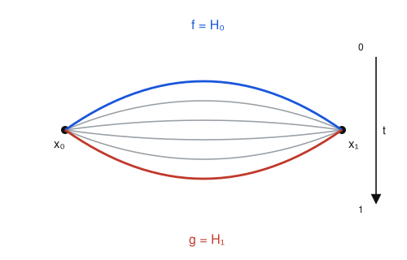
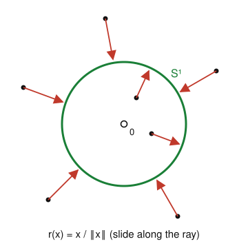

# Algebraic Topology · Lesson 1.1: Homotopy of maps

> ⏱ ~15 min · Module 1: Homotopy & the Fundamental Group · Builds on: point-set topology ([topology](../../topology/syllabus.md)) · Unlocks: [1.2 Paths, loops, and $\pi_1$](01-02-paths-loops-pi1.md)

## Why this matters

Algebraic topology's whole game is to attach algebra to spaces so that *genuinely different* spaces get *different* algebra. But before we can say "the invariant didn't change," we need to pin down the equivalence it's allowed to ignore. That relation is **homotopy**: continuous deformation. Every invariant in this course — $\pi_1$, homology, cohomology — is by design blind to it, so a torus and a coffee mug, or the punctured plane and a circle, will be *the same* to all our machinery. Getting this relation exactly right now is what lets a hard question ("are these spaces different?") collapse into a finite computation later.

## The idea

Two maps are **homotopic** if you can slide one to the other without tearing — through a continuous family of maps parametrized by time $t \in [0,1]$, starting at the first map and ending at the second. Two curves drawn between the same two dots are homotopic if you can sweep one across to the other (see the picture).

Two *spaces* are the "same shape" — **homotopy equivalent** — if there are maps back and forth whose round trips are each *homotopic to doing nothing*, rather than literally equal to doing nothing. That single relaxation (homotopic-to-identity instead of equal-to-identity) is what makes this relation coarser than homeomorphism: it lets you fatten, thin, and collapse a space as long as you don't puncture or glue. A solid ball is homotopy equivalent to a single point; a thick annulus is homotopy equivalent to a thin circle. The circle in the annulus is a **deformation retract** — a subspace you can continuously reel the whole space onto.

## The formal version

Throughout, $I := [0,1]$, and $X, Y$ are topological spaces; all maps are continuous.

**Definition (homotopy).** A **homotopy** between maps $f, g \colon X \to Y$ is a continuous map
$$H \colon X \times I \to Y, \qquad H(x,0) = f(x), \quad H(x,1) = g(x).$$
Writing $H_t(x) := H(x,t)$, we get a family of maps with $H_0 = f$ and $H_1 = g$. If one exists we say $f$ is **homotopic** to $g$, written $f \simeq g$.

*In words:* $H$ is a movie whose first frame is $f$, last frame is $g$, and which never jumps — continuous jointly in point *and* time.

**Proposition.** $\simeq$ is an equivalence relation on maps $X \to Y$.

*Proof.* **Reflexive:** $H(x,t) = f(x)$ gives $f \simeq f$. **Symmetric:** if $H$ realizes $f \simeq g$, then $\bar H(x,t) := H(x, 1-t)$ (continuous, as $t \mapsto 1-t$ is) runs the movie backward, giving $g \simeq f$. **Transitive:** if $H \colon f \simeq g$ and $K \colon g \simeq h$, splice them at double speed,
$$(H * K)(x,t) = \begin{cases} H(x, 2t), & 0 \le t \le \tfrac12,\\[2pt] K(x, 2t-1), & \tfrac12 \le t \le 1.\end{cases}$$
The two formulas agree at $t = \tfrac12$ (both equal $g(x)$), and $X \times [0,\tfrac12]$, $X \times [\tfrac12,1]$ are closed, so the **pasting lemma** makes $H * K$ continuous. Thus $f \simeq h$. $\blacksquare$

*In words:* homotopic-ness genuinely partitions maps into classes; "do nothing," "reverse," and "splice" are the three moves.

**Definition (homotopy equivalence).** A map $f \colon X \to Y$ is a **homotopy equivalence** if there is $g \colon Y \to X$ with
$$g \circ f \simeq \operatorname{id}_X \qquad \text{and} \qquad f \circ g \simeq \operatorname{id}_Y.$$
Then $g$ is a **homotopy inverse**, and $X, Y$ are **homotopy equivalent**, $X \simeq Y$ — they have the same **homotopy type**.

*In words:* going over and coming back is *deformable* to the identity, not equal to it. (A homeomorphism demands $g \circ f = \operatorname{id}_X$ and $f \circ g = \operatorname{id}_Y$ exactly, so every homeomorphism is a homotopy equivalence, but not conversely.)

**Definition (contractible).** $X$ is **contractible** if $\operatorname{id}_X \simeq c$ for some constant map $c \colon X \to X$, $c(x) \equiv x_0$. Equivalently, $X$ is homotopy equivalent to a one-point space.

*In words:* the whole space can be swept continuously into a single one of its points.

**Definition (deformation retract).** Let $A \subseteq X$ with inclusion $i \colon A \hookrightarrow X$. A **deformation retraction** of $X$ onto $A$ is a homotopy $H \colon X \times I \to X$ with
$$H_0 = \operatorname{id}_X, \qquad H_1(X) \subseteq A, \qquad H_1|_A = \operatorname{id}_A,$$
and (the *strong* version, which we adopt) $H_t|_A = \operatorname{id}_A$ for all $t$. Then $A$ is a **deformation retract** of $X$, and $r := H_1 \colon X \to A$ is a **retraction** ($r \circ i = \operatorname{id}_A$).

*In words:* run time forward and the whole space flows onto $A$, with $A$ held fixed the entire time. Problem 3 shows this forces $A \simeq X$.

## Picture

A homotopy $H$ from $f$ to $g$ (endpoints pinned): the grey curves are the intermediate frames $H_t$ as $t$ runs $0 \to 1$.

The punctured plane $\mathbb{R}^2 \setminus \{0\}$ reeling radially onto the unit circle $S^1$: every point slides along its own ray to where the ray meets the circle. Points outside move in, points inside move out; points already on $S^1$ never move.

## Worked examples

**Example 1 ($\mathbb{R}^n$ is contractible — the straight-line homotopy).** Define
$$H \colon \mathbb{R}^n \times I \to \mathbb{R}^n, \qquad H(x,t) = (1-t)\,x.$$
It is continuous (each coordinate is a polynomial in $x$ and $t$), and $H_0(x) = x = \operatorname{id}(x)$, $H_1(x) = 0 = c(x)$, the constant map at the origin. So $\operatorname{id}_{\mathbb{R}^n} \simeq c$, and $\mathbb{R}^n$ is contractible.

The same works for **any convex** $C \subseteq \mathbb{R}^n$: fix $x_0 \in C$ and set $H(x,t) = (1-t)x + t\,x_0$. Convexity says the whole segment from $x$ to $x_0$ stays in $C$, so $H$ lands in $C$; hence every convex set is contractible. Convexity is doing exactly one job here — keeping the sliding path inside the space.

**Example 2 (the punctured plane deformation-retracts onto $S^1$ — why you'd care).** Let $X = \mathbb{R}^2 \setminus \{0\}$ and $A = S^1 = \{x : \|x\| = 1\}$. Define
$$H(x,t) = (1-t)\,x + t\,\frac{x}{\|x\|} = \Big[\,(1-t) + \tfrac{t}{\|x\|}\,\Big]\,x .$$
The bracketed scalar equals $\dfrac{(1-t)\|x\| + t}{\|x\|}$. Its numerator $(1-t)\|x\| + t$ is a sum of two nonnegative terms that are never both zero (if $t=0$ it is $\|x\| > 0$; if $t>0$ it is $\ge t > 0$), so the scalar is strictly positive. Hence $H(x,t)$ is a **positive multiple of $x$** — in particular never $0$ — so $H$ maps into $X$, and it is continuous because $\|x\|$ is continuous and nonzero on $X$. Now check the three conditions:
$$H_0(x) = x = \operatorname{id}, \qquad H_1(x) = \frac{x}{\|x\|} \in S^1, \qquad \text{and for } a \in S^1:\ H(a,t) = (1-t)a + t\,a = a.$$
So $H$ is a (strong) deformation retraction onto $S^1$. By Problem 3 this makes the inclusion $S^1 \hookrightarrow \mathbb{R}^2 \setminus \{0\}$ a homotopy equivalence: **the punctured plane and the circle have the same homotopy type.** The identical computation with $\|x\|$ in $\mathbb{R}^n$ gives $\mathbb{R}^n \setminus \{0\} \simeq S^{n-1}$ — the fact that later powers the degree and hairy-ball theorems (Lesson [4.3](04-03-degree-applications.md)).

## Watch out

- **Homotopy equivalence is much weaker than homeomorphism.** A point and $\mathbb{R}^2$ are homotopy equivalent (both contractible) but *not* homeomorphic — they don't even have the same cardinality. So homotopy type forgets dimension, compactness, and cardinality. When our invariants fail to distinguish two spaces, that's a *feature*: they were the same up to homotopy all along.
- **A retraction is not a deformation retraction.** A retraction $r \colon X \to A$ (with $r|_A = \operatorname{id}$) only needs to *exist* pointwise; a *deformation* retraction additionally supplies the homotopy from $\operatorname{id}_X$ that gets you there. The map $\mathbb{R}^2 \setminus \{0\} \to S^1$, $x \mapsto x/\|x\|$ is a retraction, but it's the *homotopy* in Example 2 that certifies $S^1 \simeq \mathbb{R}^2\setminus\{0\}$.
- **"Continuous at each frozen $t$" is not enough.** A homotopy must be continuous *jointly* on $X \times I$. A family $H_t$ that is continuous in $x$ for each fixed $t$, but where the frames jerk discontinuously as $t$ varies, is not a homotopy. Always check joint continuity of $H(x,t)$.

## One-liner

> Homotopy is "the same after a continuous deformation" — the equivalence our algebra is built to ignore, under which a fat blob is a point and the punctured plane is a circle.

## Problems

**P1 (🟢)** Let $C \subseteq \mathbb{R}^n$ be convex and $f, g \colon X \to C$ any two continuous maps. Prove $f \simeq g$. (So *all* maps into a convex set are homotopic — a fact you'll use constantly to kill homotopies into "flat" targets.)

**P2 (🟡)** Prove that homotopy equivalence is **transitive**: if $X \simeq Y$ and $Y \simeq Z$, then $X \simeq Z$. (Hint: first show homotopy respects composition — if $u \simeq u'\colon X\to Y$ and $h \colon Y \to Z$, then $h \circ u \simeq h \circ u'$, and symmetrically on the other side. Then build a homotopy inverse by composing the given ones.)

**P3 (🔴, optional)** Suppose $A$ is a deformation retract of $X$, with retraction $r = H_1$ and inclusion $i \colon A \hookrightarrow X$. Prove that $i$ is a homotopy equivalence with homotopy inverse $r$. (This is the fact that turns every "reel it in" picture into an honest $A \simeq X$.)

Solutions

**P1.** Define $G \colon X \times I \to C$ by $G(x,t) = (1-t)f(x) + t\,g(x)$. For each $x$, the value $G(x,t)$ runs along the segment from $f(x)$ to $g(x)$, both of which lie in $C$; by convexity the whole segment lies in $C$, so $G$ maps into $C$. It is continuous as a sum of products of the continuous maps $f, g$ and the scalars $1-t, t$. Finally $G(x,0) = f(x)$ and $G(x,1) = g(x)$, so $G$ is a homotopy $f \simeq g$. $\blacksquare$

**P2.** *Composition lemma.* Suppose $H \colon u \simeq u'$ for maps $X \to Y$, and let $h \colon Y \to Z$, $k \colon W \to X$. Then $h \circ H \colon X \times I \to Z$ is continuous (composite of continuous maps) with $(h\circ H)_0 = h\circ u$ and $(h\circ H)_1 = h \circ u'$, so $h\circ u \simeq h \circ u'$. Likewise $H \circ (k \times \operatorname{id}_I) \colon W \times I \to Y$ shows $u \circ k \simeq u' \circ k$. So homotopy of maps is preserved by pre- and post-composition.

*Transitivity.* Say $f \colon X \to Y$, $g \colon Y \to X$ realize $X \simeq Y$ ($g f \simeq \operatorname{id}_X$, $fg \simeq \operatorname{id}_Y$), and $p \colon Y \to Z$, $q \colon Z \to Y$ realize $Y \simeq Z$ ($qp \simeq \operatorname{id}_Y$, $pq \simeq \operatorname{id}_Z$). Take $p f \colon X \to Z$ and $g q \colon Z \to X$. Then
$$(gq)(pf) = g(qp)f \simeq g\,\operatorname{id}_Y\,f = gf \simeq \operatorname{id}_X,$$
where the first $\simeq$ applies the composition lemma to $qp \simeq \operatorname{id}_Y$ (post-compose by $g$, pre-compose by $f$), and both steps are chained by transitivity of $\simeq$ on maps (the Proposition). Symmetrically,
$$(pf)(gq) = p(fg)q \simeq p\,\operatorname{id}_Y\,q = pq \simeq \operatorname{id}_Z.$$
So $pf$ is a homotopy equivalence with inverse $gq$, giving $X \simeq Z$. (Reflexivity via $\operatorname{id}_X$ and symmetry by swapping the roles of $f, g$ complete the check that $\simeq$ is an equivalence relation on spaces.) $\blacksquare$

**P3.** By definition of retraction, $r \circ i = \operatorname{id}_A$ exactly — in particular $r \circ i \simeq \operatorname{id}_A$. For the other composite, note $i \circ r \colon X \to X$ is precisely the map $x \mapsto H_1(x)$ viewed as landing in $X$ (since $H_1(X) \subseteq A$ and then included back). The deformation retraction $H$ is a homotopy from $H_0 = \operatorname{id}_X$ to $H_1 = i \circ r$, so $i \circ r \simeq \operatorname{id}_X$. Having both $r \circ i \simeq \operatorname{id}_A$ and $i \circ r \simeq \operatorname{id}_X$, the inclusion $i$ is a homotopy equivalence with homotopy inverse $r$; hence $A \simeq X$. $\blacksquare$

(Remark: only $H_0 = \operatorname{id}_X$ and $H_1 = i\circ r$ were used — the *plain* deformation retraction already yields the homotopy equivalence. The stronger "$A$ fixed for all $t$" condition is what will let us carry a basepoint along untouched in Lesson [1.3](01-03-basepoints-functoriality.md).)

## Connections

- **Backward (topology):** everything here rests on point-set facts from [topology](../../topology/syllabus.md) — joint continuity on a product, the pasting lemma on closed sets, and the subspace topology on $A \subseteq X$. Nothing algebraic yet; this lesson only fixes the equivalence.
- **Forward:** Lesson [1.2](01-02-paths-loops-pi1.md) specializes homotopy to **paths** (deformations that pin both endpoints) and multiplies loops into the fundamental group $\pi_1$; Lesson [1.3](01-03-basepoints-functoriality.md) proves a homotopy equivalence induces an isomorphism on $\pi_1$, which is the entire reason we defined homotopy type first. The "no retraction of the disk onto its boundary" argument in Lesson [1.5](01-05-first-payoffs.md) is this lesson's retraction idea turned into an impossibility theorem.
- **Sideways (complex-analysis):** the convex/star-shaped straight-line homotopy of Example 1 is the *same* construction behind Cauchy's theorem — two contours in a convex domain are homotopic, so the integral doesn't change. The winding number that Lesson [1.4](01-04-pi1-of-the-circle.md) extracts from $\mathbb{R}^2 \setminus \{0\} \simeq S^1$ is the topological heart of the argument principle in [complex-analysis](../../complex-analysis/syllabus.md).
- **Sideways (differential-geometry):** $\mathbb{R}^n \setminus \{0\} \simeq S^{n-1}$ from Example 2 is what makes the **degree** of a map and the hairy-ball / nonvanishing-vector-field theorems in [differential-geometry](../../differential-geometry/syllabus.md) computable — cashed out here in Lesson [4.3](04-03-degree-applications.md).
