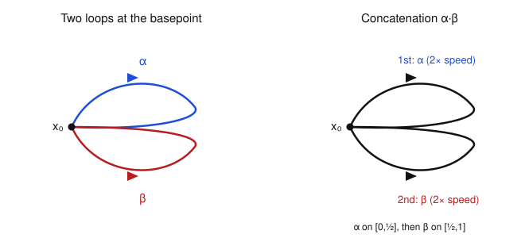
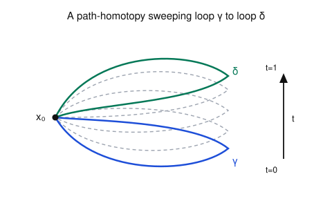

# Algebraic Topology · Lesson 1.2: Paths, loops, and $\pi_1$

> ⏱ ~15 min · Module 1: Homotopy & the Fundamental Group · Builds on: [1.1 Homotopy of maps](01-01-homotopy-of-maps.md) · Unlocks: [1.3 Basepoints and functoriality](01-03-basepoints-functoriality.md)

## Why this matters

Lesson 1.1 gave us a relation — two things are "the same up to deformation" — but a relation isn't yet something you can *compute* with. This lesson makes the leap from a relation to an **algebraic object**: we take the loops in a space, glue them into deformation classes, and discover that they multiply, associate, and invert exactly like elements of a group. That group, $\pi_1(X,x_0)$, is the first genuine algebraic invariant of a space. It is what tells you a disk and a punctured plane are different (one has no holes, the other traps a loop), it is the winding number of complex analysis in disguise, and in physics it classifies vortices, magnetic-flux phases (Aharonov–Bohm), and topological defects. The entire rest of Module 1 is spent building it, proving it's a functor, and computing the one example — $\pi_1(S^1)$ — that powers everything downstream.

## The idea

A **loop** is a journey that starts and ends at the same spot, $x_0$. Two loops count as "the same" if you can slide one onto the other *without ever letting the ends off the pin at $x_0$* — a movie of loops, all anchored at the basepoint. That "sliding, ends pinned" is **path homotopy**.

Now the one genuinely new move: you can **multiply** two loops. To form $\gamma\cdot\delta$, run $\gamma$ first and $\delta$ second — but cram both into the same unit time by running each at double speed. The result is again a loop at $x_0$, so multiplication doesn't leave the room.

The claim of the lesson — and it is not obvious — is that this multiplication, once you pass to deformation classes, satisfies the group axioms:

- **Closure & well-defined:** the product of two classes is a class, independent of representatives.
- **Associativity:** $(\gamma\cdot\delta)\cdot\varepsilon$ and $\gamma\cdot(\delta\cdot\varepsilon)$ differ only in *timing*, and timing washes out under homotopy.
- **Identity:** the loop that just sits at $x_0$ does nothing.
- **Inverses:** running a loop *backwards* undoes it — the out-and-back is contractible.

The recurring trick behind every axiom is the same: **reparametrization is invisible to homotopy.** How fast you traverse a path never matters; only the route, up to sliding, does. Keep that one sentence and you can reconstruct all four proofs.

## The formal version

Throughout, $I = [0,1]$.

**Definition (path, loop, basepoint).** A **path** in a space $X$ is a continuous map $\gamma\colon I \to X$; its endpoints are $\gamma(0)$ and $\gamma(1)$. A **loop based at $x_0$** is a path with $\gamma(0)=\gamma(1)=x_0$. The distinguished point $x_0\in X$ is the **basepoint**.

*In words:* a loop is a continuous round trip that leaves from and returns to $x_0$.

**Definition (path homotopy).** Two paths $\gamma,\delta\colon I\to X$ with the **same endpoints** $\gamma(0)=\delta(0)=a$, $\gamma(1)=\delta(1)=b$ are **path-homotopic**, written $\gamma\simeq\delta$, if there is a continuous $H\colon I\times I\to X$ with
$$H(s,0)=\gamma(s),\quad H(s,1)=\delta(s),\qquad H(0,t)=a,\quad H(1,t)=b\ \text{ for all }t.$$

*In words:* $H$ is a movie ($t$ is time) that morphs $\gamma$ into $\delta$ while both endpoints stay nailed down for the entire movie. For loops, $a=b=x_0$: every frame is a loop at $x_0$.

The endpoint conditions are the whole point — an *unrestricted* homotopy (Lesson 1.1) is allowed to drag the endpoints around; a path homotopy forbids it. That extra rigidity is exactly what will make multiplication well-defined.

**Path homotopy is an equivalence relation** (on paths with fixed endpoints $a,b$). *Reflexive:* $H(s,t)=\gamma(s)$. *Symmetric:* if $H$ realizes $\gamma\simeq\delta$, then $H(s,1-t)$ realizes $\delta\simeq\gamma$. *Transitive:* given $H\colon\gamma\simeq\delta$ and $K\colon\delta\simeq\varepsilon$, stack the movies at double speed,
$$(H*K)(s,t)=\begin{cases}H(s,2t)&0\le t\le\tfrac12\\ K(s,2t-1)&\tfrac12\le t\le 1,\end{cases}$$
continuous by the pasting lemma since both agree ($=\delta(s)$) at $t=\tfrac12$. Write $[\gamma]$ for the class of $\gamma$.

**Definition (concatenation).** If $\gamma(1)=\delta(0)$, their **product** $\gamma\cdot\delta\colon I\to X$ is
$$(\gamma\cdot\delta)(s)=\begin{cases}\gamma(2s)&0\le s\le\tfrac12\\ \delta(2s-1)&\tfrac12\le s\le 1.\end{cases}$$

*In words:* do $\gamma$ on the first half of the time interval and $\delta$ on the second, each sped up by two so the whole thing still runs over $[0,1]$. Continuous by pasting: at $s=\tfrac12$ both give $\gamma(1)=\delta(0)$. For **loops at $x_0$** the condition $\gamma(1)=\delta(0)=x_0$ is automatic, so any two loops at $x_0$ can be multiplied.

**Definition (the fundamental group).** The **fundamental group** of $X$ at $x_0$ is
$$\pi_1(X,x_0)=\{\text{loops at }x_0\}/\simeq,$$
the set of path-homotopy classes of loops based at $x_0$, with product $[\gamma][\delta]:=[\gamma\cdot\delta]$.

*In words:* the elements are deformation classes of loops; you multiply classes by concatenating any representatives.

**Theorem.** $\pi_1(X,x_0)$ is a group.

The proof is four lemmas. Two of them — identity and inverses — are the worked examples below; here are well-definedness and associativity, the two that make the operation *legal*.

**(Well-defined.)** If $\gamma\simeq\gamma'$ and $\delta\simeq\delta'$ (loops at $x_0$), then $\gamma\cdot\delta\simeq\gamma'\cdot\delta'$. *Proof.* Let $F$ realize $\gamma\simeq\gamma'$ and $G$ realize $\delta\simeq\delta'$. Run them side by side, sped up:
$$H(s,t)=\begin{cases}F(2s,t)&0\le s\le\tfrac12\\ G(2s-1,t)&\tfrac12\le s\le 1.\end{cases}$$
At the seam $s=\tfrac12$ the top piece gives $F(1,t)=x_0$ and the bottom gives $G(0,t)=x_0$, so they agree and $H$ is continuous. At $t=0$ it is $\gamma\cdot\delta$, at $t=1$ it is $\gamma'\cdot\delta'$, and the endpoints stay at $x_0$. $\blacksquare$ — Notice the seam matched *only because* endpoints were pinned to $x_0$; this is where fixing endpoints earns its keep.

**(Associativity.)** $(\gamma\cdot\delta)\cdot\varepsilon\simeq\gamma\cdot(\delta\cdot\varepsilon)$. *Proof idea.* Both loops trace the identical route $\gamma$-then-$\delta$-then-$\varepsilon$; they disagree only on *when* the handoffs happen — $\{\tfrac14,\tfrac12\}$ versus $\{\tfrac12,\tfrac34\}$. They are therefore the same map precomposed with two different reparametrizations of $I$, and any two reparametrizations $\varphi,\psi\colon I\to I$ fixing $0,1$ give homotopic composites. Concretely, if $\varphi\colon I\to I$ is continuous with $\varphi(0)=0,\varphi(1)=1$ then $f\circ\varphi\simeq f$ via the straight-line-in-parameter homotopy
$$H(s,t)=f\big((1-t)\varphi(s)+t\,s\big),$$
which fixes endpoints ($\varphi(0)=0,\varphi(1)=1$). Apply this to slide the handoff times of one grouping onto the other. $\blacksquare$

**Triviality on convex/contractible spaces.** If $X$ is convex in some $\mathbb{R}^n$ (or, more generally, contractible), then $\pi_1(X,x_0)=\{[c_{x_0}]\}$ is trivial. *Proof (convex case).* Any loop $\gamma$ at $x_0$ is path-homotopic to the constant loop $c_{x_0}$ via the straight-line homotopy $H(s,t)=(1-t)\gamma(s)+t\,x_0$, which stays in $X$ by convexity and fixes $\gamma(0)=\gamma(1)=x_0$ at every time. So every loop is trivial. $\blacksquare$

*In words:* a space with no holes has nothing for a loop to catch on — every loop shrinks to the basepoint, and the group collapses to one element. This is the base case underneath every $\pi_1$ computation to come.

## Picture

Multiplication and the equivalence relation, in one image each. Left: two loops sharing the basepoint, and the concatenation that runs the first then the second at double speed. Right: a path-homotopy — a movie of loops sweeping $\gamma$ to $\delta$ with the basepoint pinned.

## Worked examples

These are the remaining two group axioms, proved by writing the homotopy down explicitly. Both are pure reparametrization arguments — the movie only ever rescales *time along the loop*, never the route.

**Example 1 — the constant loop is a two-sided identity.** Let $c=c_{x_0}$ be the constant loop $c(s)=x_0$. Claim: $c\cdot\gamma\simeq\gamma$ (and symmetrically $\gamma\cdot c\simeq\gamma$).

The product $c\cdot\gamma$ sits at $x_0$ for $s\in[0,\tfrac12]$, then runs $\gamma$ at double speed on $[\tfrac12,1]$. That is exactly $\gamma$ precomposed with the reparametrization $\varphi(s)=0$ on $[0,\tfrac12]$ and $\varphi(s)=2s-1$ on $[\tfrac12,1]$, which has $\varphi(0)=0,\varphi(1)=1$. Feed it to the reparametrization homotopy above:
$$H(s,t)=\gamma\big((1-t)\varphi(s)+t\,s\big).$$
Check: at $t=0$, $H(s,0)=\gamma(\varphi(s))=(c\cdot\gamma)(s)$; at $t=1$, $H(s,1)=\gamma(s)$. Endpoints: $s=0$ gives $\gamma\big((1-t)\varphi(0)\big)=\gamma(0)=x_0$ for all $t$, and $s=1$ gives $\gamma\big((1-t)+t\big)=\gamma(1)=x_0$ for all $t$. So it is a path homotopy, and $c\cdot\gamma\simeq\gamma$. Passing to classes, $[c][\gamma]=[\gamma]$, so $[c]$ is the identity of $\pi_1(X,x_0)$. $\blacksquare$

**Example 2 — the reversed loop is an inverse.** Define the **reverse** $\bar\gamma(s)=\gamma(1-s)$ (walk the same route backwards). Claim: $\gamma\cdot\bar\gamma\simeq c_{x_0}$.

Intuition: go out along $\gamma$, then immediately retrace your steps home — you never really left, so the whole trip shrinks to standing still. Make it precise with a "turn back sooner and sooner" movie. At time $t$, walk out along $\gamma$ only as far as the parameter value $1-t$, wait there an instant, then return:
$$H(s,t)=\begin{cases}\gamma(2s)&0\le s\le\tfrac{1-t}{2}\\[2pt]\gamma(1-t)&\tfrac{1-t}{2}\le s\le\tfrac{1+t}{2}\\[2pt]\gamma(2-2s)&\tfrac{1+t}{2}\le s\le 1.\end{cases}$$
*Continuity:* at $s=\tfrac{1-t}{2}$ the top gives $\gamma(1-t)$, matching the middle; at $s=\tfrac{1+t}{2}$ the bottom gives $\gamma\big(2-(1+t)\big)=\gamma(1-t)$, matching the middle. Pasting lemma applies. *At $t=0$:* the middle band collapses to the point $s=\tfrac12$, leaving $\gamma(2s)$ on $[0,\tfrac12]$ and $\gamma(2-2s)=\bar\gamma(2s-1)$ on $[\tfrac12,1]$ — precisely $\gamma\cdot\bar\gamma$. *At $t=1$:* every branch equals $\gamma(0)=x_0$, the constant loop $c_{x_0}$. *Endpoints:* $s=0\Rightarrow\gamma(0)=x_0$ and $s=1\Rightarrow\gamma(2-2)=\gamma(0)=x_0$, for all $t$. So $\gamma\cdot\bar\gamma\simeq c_{x_0}$, i.e. $[\gamma][\bar\gamma]=[c]$; the same argument on $\bar\gamma\cdot\gamma$ gives the other side. Thus $[\gamma]^{-1}=[\bar\gamma]$. $\blacksquare$

Together with well-definedness and associativity, that completes the proof that $\pi_1(X,x_0)$ is a group.

## Watch out

- **You might think concatenation is already associative on the nose** — but $(\gamma\cdot\delta)\cdot\varepsilon\ne\gamma\cdot(\delta\cdot\varepsilon)$ *as functions*: they schedule the three pieces over different sub-intervals. Equality holds only after passing to homotopy classes. The group lives on classes, never on loops themselves.
- **You might think you can drop the "fixed endpoints" clause** — but then well-definedness collapses. A *free* homotopy is allowed to let a loop's basepoint wander; the seam-matching in the well-defined proof used $F(1,t)=G(0,t)=x_0$, which is exactly the pinned endpoint. Free homotopy of loops gives a coarser, non-group notion (conjugacy classes — you'll meet it in [1.3](01-03-basepoints-functoriality.md)).
- **You might think $\bar\gamma$ is a "negative loop" you subtract** — no, the group is generally **nonabelian**, so write it multiplicatively: $\bar\gamma$ is the inverse $[\gamma]^{-1}$, and $[\gamma][\delta]\ne[\delta][\gamma]$ in general (figure-eight, [Module 2](02-04-free-groups-presentations.md)).
- **You might read $\gamma\cdot\bar\gamma=c$** — it is only $\simeq c$. As a literal map $\gamma\cdot\bar\gamma$ goes out and back; it is *homotopic* to the constant loop, not equal to it. Identity and inverse laws hold in $\pi_1$, not among loops.

## One-liner

> A loop is a round trip, concatenation multiplies round trips, and because timing is invisible to deformation, the deformation classes of loops form a group — the fundamental group $\pi_1(X,x_0)$.

## Problems

**P1 (🟢)** Let $X$ be convex in $\mathbb{R}^n$ and let $\gamma,\delta$ be any two loops at $x_0\in X$. Show directly (no group theory) that $\gamma\simeq\delta$, and conclude $\pi_1(X,x_0)$ is trivial. Then explain in one sentence why the *same* straight-line formula fails for a loop in the punctured plane $\mathbb{R}^2\setminus\{0\}$ that encircles the origin.

**P2 (🟡)** Prove the second half of the identity law: for the constant loop $c=c_{x_0}$, exhibit an explicit path homotopy showing $\gamma\cdot c\simeq\gamma$. (Mirror Example 1 — find the right reparametrization $\varphi$ and check its endpoints.)

**P3 (🔴, optional)** *Reverse of a product.* Prove $\overline{\gamma\cdot\delta}\simeq\bar\delta\cdot\bar\gamma$ for loops $\gamma,\delta$ at $x_0$. First argue it as a one-line consequence of the group axioms (what is $[\gamma\cdot\delta]^{-1}$?), then verify it *directly* by identifying an explicit reparametrization relating the two maps.

Solutions

**P1.** Define $H(s,t)=(1-t)\gamma(s)+t\,\delta(s)$. For each fixed $s$ this is the straight segment in $\mathbb{R}^n$ from $\gamma(s)$ to $\delta(s)$; convexity of $X$ keeps it inside $X$, and it is jointly continuous. At $t=0$ it is $\gamma$, at $t=1$ it is $\delta$. Endpoints: since $\gamma(0)=\delta(0)=x_0$, $H(0,t)=(1-t)x_0+t\,x_0=x_0$ for all $t$, and likewise $H(1,t)=x_0$. So it is a path homotopy and $\gamma\simeq\delta$. Every loop is thus in one class; with $\delta=c_{x_0}$ we get $[\gamma]=[c]$ for all $\gamma$, so $\pi_1(X,x_0)=\{[c]\}$ is trivial.

Why it fails in $\mathbb{R}^2\setminus\{0\}$: for a loop that winds around the origin, the straight-line segment from $\gamma(s)$ to $x_0$ (or to another loop) passes *through the missing point $0$* for some $s$, so $H$ leaves the space — the formula is no longer a map into $X$. (Indeed $\pi_1(\mathbb{R}^2\setminus\{0\})\cong\mathbb{Z}$, [Lesson 1.4](01-04-pi1-of-the-circle.md), so those loops are genuinely non-trivial.)

**P2.** Now $\gamma\cdot c$ runs $\gamma$ at double speed on $[0,\tfrac12]$ then sits at $x_0$ on $[\tfrac12,1]$. That is $\gamma\circ\varphi$ for
$$\varphi(s)=\begin{cases}2s&0\le s\le\tfrac12\\ 1&\tfrac12\le s\le 1,\end{cases}\qquad \varphi(0)=0,\ \varphi(1)=1.$$
Use the reparametrization homotopy $H(s,t)=\gamma\big((1-t)\varphi(s)+t\,s\big)$. At $t=0$: $\gamma(\varphi(s))=(\gamma\cdot c)(s)$; at $t=1$: $\gamma(s)$. Endpoints: $s=0\Rightarrow\gamma(0)=x_0$; $s=1\Rightarrow\gamma\big((1-t)\cdot 1+t\cdot 1\big)=\gamma(1)=x_0$, all $t$. Hence $\gamma\cdot c\simeq\gamma$, so $[\gamma][c]=[\gamma]$ — the constant loop is a *right* identity too. $\blacksquare$

**P3.** *Algebraic argument.* In the group $\pi_1(X,x_0)$, $[\overline{\gamma\cdot\delta}]=[\gamma\cdot\delta]^{-1}=\big([\gamma][\delta]\big)^{-1}=[\delta]^{-1}[\gamma]^{-1}=[\bar\delta][\bar\gamma]=[\bar\delta\cdot\bar\gamma]$, using Example 2 (reverse = inverse) and the general group identity $(ab)^{-1}=b^{-1}a^{-1}$. So $\overline{\gamma\cdot\delta}\simeq\bar\delta\cdot\bar\gamma$.

*Direct verification.* Compute the reverse of the concatenation:
$$\overline{\gamma\cdot\delta}(s)=(\gamma\cdot\delta)(1-s)=\begin{cases}\gamma(2-2s)&\tfrac12\le s\le 1\\ \delta(1-2s)&0\le s\le\tfrac12,\end{cases}$$
since $1-s\ge\tfrac12\Leftrightarrow s\le\tfrac12$. On $[0,\tfrac12]$ this is $\delta(1-2s)=\bar\delta(2s)$, and on $[\tfrac12,1]$ it is $\gamma(2-2s)=\bar\gamma(2s-1)$. But that is exactly the definition of $\bar\delta\cdot\bar\gamma$: first $\bar\delta$ at double speed, then $\bar\gamma$ at double speed. So $\overline{\gamma\cdot\delta}=\bar\delta\cdot\bar\gamma$ *on the nose* — no homotopy even needed. (This is the rare case where the reparametrizations happen to coincide exactly.) $\blacksquare$

## Connections

- **Backward:** this specializes the free homotopy of [1.1](01-01-homotopy-of-maps.md) by pinning endpoints; the "contractible $\Rightarrow$ trivial" result reuses 1.1's straight-line homotopy, and convexity is the cleanest contractible space. The group axioms lean on the *group* language (associativity, identity, inverses) from [abstract-algebra](../../abstract-algebra/syllabus.md).
- **Forward:** [1.3](01-03-basepoints-functoriality.md) shows the choice of basepoint barely matters (change-of-basepoint isomorphism) and upgrades continuous maps of spaces to homomorphisms of these groups — making $\pi_1$ a *functor*. [1.4](01-04-pi1-of-the-circle.md) computes the first nontrivial example, $\pi_1(S^1)\cong\mathbb{Z}$, by lifting loops to $\mathbb{R}$; [1.5](01-05-first-payoffs.md) cashes that out as Brouwer and the fundamental theorem of algebra. Nonabelian examples arrive with free groups and van Kampen in [Module 2](02-04-free-groups-presentations.md).
- **Sideways (complex analysis):** for a loop in the punctured plane, its class in $\pi_1(\mathbb{R}^2\setminus\{0\})\cong\mathbb{Z}$ is precisely the **winding number** $\frac{1}{2\pi i}\oint \frac{dz}{z}$ from [complex-analysis](../../complex-analysis/syllabus.md) — the same integer that runs the argument principle and residue counting. Concatenating loops adds winding numbers, which is our group law in action.
