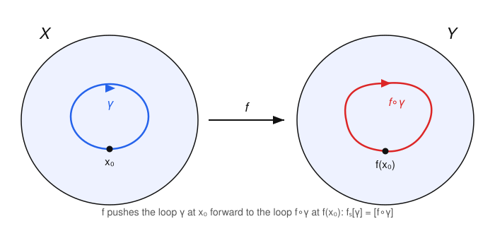
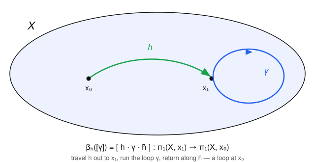

# Algebraic Topology · Lesson 1.3: Basepoints and functoriality

> ⏱ ~15 min · Module 1: Homotopy & the Fundamental Group · Builds on: [1.2 Paths, loops, and $\pi_1$](01-02-paths-loops-pi1.md) · Unlocks: [1.4 $\pi_1(S^1)\cong\mathbb{Z}$](01-04-pi1-of-the-circle.md)

## Why this matters

In [1.2](01-02-paths-loops-pi1.md) we glued a group onto a space at a chosen point. Two loose ends remain, and this lesson ties both. First: the basepoint felt arbitrary — does the answer secretly depend on where we stand? Second, and this is the whole game: a group attached to a space is useless unless *maps of spaces become maps of groups*. Once continuous $f\colon X\to Y$ automatically yields a homomorphism $f_*$, algebra starts doing topology's work — and a homotopy equivalence yields an **iso**morphism, so $\pi_1$ can never tell apart two spaces that are the same up to deformation, but *can* certify that two spaces with different $\pi_1$ are genuinely different. That last sentence is the reason the fundamental group exists. The packaging — "$\pi_1$ is a functor" — is a direct import from `abstract-algebra`.

## The idea

**Moving the basepoint.** Suppose $X$ is path-connected and you computed $\pi_1$ standing at $x_0$, but your friend stood at $x_1$. Hand your friend a path $h$ from $x_0$ to $x_1$. Any loop $\gamma$ based at $x_1$ can be *ferried home*: walk out along $h$, run the loop, walk back along $h$ reversed. That turns a loop at $x_1$ into a loop at $x_0$, and it's a perfect dictionary — a group isomorphism. So on a path-connected space the fundamental group is basepoint-independent **as an abstract group**. The catch: the dictionary depends on which path $h$ you chose, and different paths can give genuinely different isomorphisms (unless the group is abelian, where the ambiguity evaporates).

**Pushing loops through a map.** A continuous $f\colon X\to Y$ can't help but transport loops: if $\gamma$ is a loop at $x_0$, then $f\circ\gamma$ is a loop at $f(x_0)$. Deform $\gamma$ and $f\circ\gamma$ deforms along with it, so the operation descends to homotopy classes. Because $f$ respects the "run this loop, then that one" operation, the result is a group homomorphism $f_*$. And composing maps composes the homomorphisms — nothing is lost or scrambled in the translation. That bookkeeping fact is *functoriality*, and it's what makes the whole apparatus rigid enough to prove theorems.

## The formal version

Recall from [1.2](01-02-paths-loops-pi1.md): for paths, $\gamma\cdot\delta$ is "$\gamma$ then $\delta$" at double speed, $(\gamma\cdot\delta)(s)=\gamma(2s)$ for $s\le\tfrac12$ and $\delta(2s-1)$ for $s\ge\tfrac12$; the reverse is $\bar h(s)=h(1-s)$; and $c_{x_0}$ is the constant loop. All homotopies below are rel endpoints, and $[\,\cdot\,]$ denotes the path-homotopy class.

### Change of basepoint

**Definition.** Let $h\colon[0,1]\to X$ be a path from $x_0=h(0)$ to $x_1=h(1)$. Define
$$\beta_h\colon \pi_1(X,x_1)\longrightarrow \pi_1(X,x_0),\qquad \beta_h([\gamma])=[\,h\cdot\gamma\cdot\bar h\,].$$

*In words:* $\beta_h$ conjugates a loop at $x_1$ by the path $h$ to land it at $x_0$.

**Proposition (change-of-basepoint isomorphism).** $\beta_h$ is a well-defined group isomorphism, with inverse $\beta_{\bar h}$.

*Proof.* Well-defined and a homomorphism: using the group facts from 1.2 that $\bar h\cdot h\simeq c_{x_1}$ and that constant loops are identities,
$$\beta_h([\gamma_1])\,\beta_h([\gamma_2])=[\,h\cdot\gamma_1\cdot\bar h\,]\,[\,h\cdot\gamma_2\cdot\bar h\,]=[\,h\cdot\gamma_1\cdot(\bar h\cdot h)\cdot\gamma_2\cdot\bar h\,]=[\,h\cdot(\gamma_1\cdot\gamma_2)\cdot\bar h\,]=\beta_h([\gamma_1][\gamma_2]),$$
so $\beta_h$ is a homomorphism (and in particular respects homotopy, since it is built from concatenation, which does). Inverse: for any loop $\gamma$ at $x_1$,
$$\beta_{\bar h}\big(\beta_h([\gamma])\big)=[\,\bar h\cdot(h\cdot\gamma\cdot\bar h)\cdot h\,]=[\,(\bar h\cdot h)\cdot\gamma\cdot(\bar h\cdot h)\,]=[\gamma],$$
and symmetrically $\beta_h\circ\beta_{\bar h}=\operatorname{id}$. Hence $\beta_h$ is a bijection, so an isomorphism. $\blacksquare$

**Corollary.** If $X$ is path-connected, $\pi_1(X,x_0)\cong\pi_1(X,x_1)$ for all basepoints; we write $\pi_1(X)$ when the point doesn't matter.

**But the iso is not canonical.** If $h,h'$ are two paths $x_0\to x_1$, then $\beta_{h'}^{-1}\circ\beta_h=\beta_{\bar h'}\circ\beta_h$ is the map $[\gamma]\mapsto[\,(\bar h'\cdot h)\cdot\gamma\cdot(\overline{\bar h'\cdot h})\,]$ — conjugation of $\pi_1(X,x_1)$ by the loop $[\bar h'\cdot h]$. So changing the path changes $\beta_h$ by an **inner automorphism**. When $\pi_1$ is abelian, inner automorphisms are trivial and $\beta_h$ is independent of $h$; in general it is not.

### The induced homomorphism

**Definition.** Let $f\colon X\to Y$ be continuous with $f(x_0)=y_0$. Define
$$f_*\colon \pi_1(X,x_0)\longrightarrow\pi_1(Y,y_0),\qquad f_*([\gamma])=[\,f\circ\gamma\,].$$

*In words:* $f_*$ sends the class of a loop to the class of its image loop.

**Proposition.** $f_*$ is a well-defined group homomorphism.

*Proof.* **Well-defined:** if $\gamma\simeq\gamma'$ rel endpoints via a homotopy $H\colon[0,1]^2\to X$, then $f\circ H$ is a homotopy $f\circ\gamma\simeq f\circ\gamma'$ rel endpoints (composing a continuous map with a homotopy is a homotopy). So the class $[f\circ\gamma]$ depends only on $[\gamma]$. **Homomorphism:** composition distributes over concatenation *on the nose*, because concatenation is defined by reparametrizing the domain:
$$\big(f\circ(\gamma\cdot\delta)\big)(s)=\begin{cases}f(\gamma(2s)),& s\le\tfrac12\\ f(\delta(2s-1)),& s\ge\tfrac12\end{cases}=\big((f\circ\gamma)\cdot(f\circ\delta)\big)(s).$$
Therefore $f_*([\gamma][\delta])=[f\circ(\gamma\cdot\delta)]=[(f\circ\gamma)\cdot(f\circ\delta)]=f_*[\gamma]\,f_*[\delta]$. $\blacksquare$

### Functoriality

**Proposition (the two functor axioms).**
$$(\operatorname{id}_X)_*=\operatorname{id}_{\pi_1(X,x_0)},\qquad (g\circ f)_*=g_*\circ f_*.$$

*In words:* the identity map induces the identity homomorphism, and induced maps compose in the same order as the maps that produced them.

*Proof.* $(\operatorname{id}_X)_*[\gamma]=[\operatorname{id}_X\circ\gamma]=[\gamma]$. For $f\colon X\to Y$, $g\colon Y\to Z$: $(g\circ f)_*[\gamma]=[(g\circ f)\circ\gamma]=[g\circ(f\circ\gamma)]=g_*[f\circ\gamma]=g_*(f_*[\gamma])$. $\blacksquare$

This is precisely the statement that **$\pi_1$ is a functor** from pointed spaces (spaces with a chosen basepoint, and basepoint-preserving continuous maps) to groups. Two immediate dividends:

- If $f$ is a homeomorphism with inverse $f^{-1}$, then $f_*\circ (f^{-1})_*=(\operatorname{id})_*=\operatorname{id}$ and vice versa, so $f_*$ is an isomorphism. **$\pi_1$ is a topological invariant.**
- More is true — it's a *homotopy* invariant:

**Theorem.** A homotopy equivalence $f\colon X\to Y$ induces an isomorphism $f_*\colon\pi_1(X,x_0)\to\pi_1(Y,f(x_0))$.

The subtlety: a homotopy inverse $g$ only gives $g\circ f\simeq\operatorname{id}_X$ as a *free* homotopy (basepoints allowed to drift), so we cannot conclude $(g\circ f)_*=\operatorname{id}$ directly. The drift is exactly repaired by a $\beta_h$. Here is the mechanism, then the proof.

**Lemma (basepoint-drift).** Let $\varphi_t\colon X\to Y$ be a homotopy and let $h$ be the path $h(t)=\varphi_t(x_0)$ traced by the moving image of the basepoint. Then
$$(\varphi_0)_*=\beta_h\circ(\varphi_1)_*\ \colon\ \pi_1(X,x_0)\to\pi_1(Y,\varphi_0(x_0)).$$

*Proof.* Fix a loop $\gamma$ at $x_0$ and look at the square $H(s,t)=\varphi_t(\gamma(s))$ on $[0,1]^2$. Its bottom edge ($t=0$) is $\varphi_0\circ\gamma$; its top edge ($t=1$) is $\varphi_1\circ\gamma$; and since $\gamma(0)=\gamma(1)=x_0$, both side edges ($s=0,1$) equal $h$. Reading the homotopy across the square (slide the bottom edge up to the top, dragging the fixed corners along the sides) shows $\varphi_0\circ\gamma\ \simeq\ h\cdot(\varphi_1\circ\gamma)\cdot\bar h$ rel basepoint. That is exactly $(\varphi_0)_*[\gamma]=\beta_h\big((\varphi_1)_*[\gamma]\big)$. $\blacksquare$

*Proof of the Theorem.* Let $g$ be a homotopy inverse of $f$, so $g\circ f\simeq\operatorname{id}_X$ via some homotopy tracing a path $h$, and $f\circ g\simeq\operatorname{id}_Y$ tracing a path $h'$. Apply the Lemma to $g\circ f\simeq\operatorname{id}_X$ (taking $\varphi_1=g\circ f$, $\varphi_0=\operatorname{id}_X$):
$$g_*\circ f_*=(g\circ f)_*=\beta_h\circ(\operatorname{id}_X)_*=\beta_h,$$
an isomorphism. A composite $g_*\circ f_*$ that is bijective forces $f_*$ **injective** (and $g_*$ surjective). Likewise $f\circ g\simeq\operatorname{id}_Y$ gives $f_*\circ g_*=\beta_{h'}$, an isomorphism, forcing $f_*$ **surjective**. Injective and surjective, so $f_*$ is an isomorphism. $\blacksquare$

## Picture

The induced map $f_*$ transports a loop $\gamma$ at $x_0$ to the loop $f\circ\gamma$ at $f(x_0)$:

The change-of-basepoint map $\beta_h$ ferries a loop at $x_1$ home to $x_0$ along a path $h$ and back:

## Worked examples

**Example 1 (mechanical — a nullhomotopic map kills $\pi_1$).** Suppose $f\colon X\to Y$ is *nullhomotopic*: homotopic to a constant map $c_{y_1}$ (send everything to $y_1$). Then $f_*$ is the trivial homomorphism (every class goes to the identity). Indeed, apply the basepoint-drift Lemma to the homotopy $\varphi_t$ from $\varphi_0=f$ to $\varphi_1=c_{y_1}$, with $h$ the traced path from $f(x_0)$ to $y_1$: $f_*=\beta_h\circ(c_{y_1})_*$. But $(c_{y_1})_*[\gamma]=[c_{y_1}\circ\gamma]=[c_{y_1}]$, the identity of $\pi_1(Y,y_1)$, so $(c_{y_1})_*$ is trivial and therefore so is $f_*=\beta_h\circ(\text{trivial})$. In particular any map that factors through a contractible space induces $0$ on $\pi_1$.

**Example 2 (why you'd care — inclusions and the shape of a hole).** Consider the inclusion $\iota\colon S^1\hookrightarrow \mathbb{R}^2$ of the unit circle into the plane. We haven't computed $\pi_1(S^1)$ yet (that's [1.4](01-04-pi1-of-the-circle.md), where it turns out to be $\mathbb{Z}$), but functoriality already tells us something: $\mathbb{R}^2$ is convex, hence contractible, so $\pi_1(\mathbb{R}^2)=0$ and $\iota_*$ is the zero map — the generating loop of the circle *dies* when you let it move in the whole plane, because there's nothing to catch on. Now delete the origin: $\iota\colon S^1\hookrightarrow\mathbb{R}^2\setminus\{0\}$. The annulus $\mathbb{R}^2\setminus\{0\}$ *deformation retracts* onto $S^1$ (radial projection $r(x)=x/|x|$, with $r\circ\iota=\operatorname{id}_{S^1}$). By the Theorem, $\iota_*\colon\pi_1(S^1)\to\pi_1(\mathbb{R}^2\setminus\{0\})$ is an isomorphism. Same circle, two ambient spaces, opposite verdicts — and $\pi_1$ reads the difference between "hole" and "no hole" straight off the induced map.

## Watch out

- **You might think** the change-of-basepoint iso makes $\pi_1$ canonically the same at every point — **but** the isomorphism $\beta_h$ depends on the path $h$, and two paths differ by conjugation by a loop. Only the *abstract* group is basepoint-free; there is no god-given identification of $\pi_1(X,x_0)$ with $\pi_1(X,x_1)$ unless the group is abelian.
- **You might think** $f_*$ is injective or surjective because $f$ is — **but** neither transfers. A constant map is often neither injective nor surjective on $\pi_1$ (Example 1); an inclusion can be injective as a map yet zero on $\pi_1$ (Example 2, into $\mathbb{R}^2$). $f_*$ is only guaranteed to be a *homomorphism*.
- **You might think** isomorphic $\pi_1$ means homotopy equivalent — **the converse is false.** $\pi_1$ only sees one-dimensional information: $S^2$ and a single point both have trivial $\pi_1$ but are not homotopy equivalent (their higher homology differs, Module 3). $\pi_1$ certifies *difference*, never *sameness*.

## One-liner

> $\pi_1$ is a functor: continuous maps become homomorphisms and homotopy equivalences become isomorphisms, so different fundamental groups guarantee genuinely different spaces.

## Problems

**P1 (🟢)** Prove the two functor axioms *directly from the definition* $f_*[\gamma]=[f\circ\gamma]$: (a) $(\operatorname{id}_X)_*=\operatorname{id}$, and (b) for $f\colon X\to Y$, $g\colon Y\to Z$, $(g\circ f)_*=g_*\circ f_*$. Then deduce that a homeomorphism induces an isomorphism on $\pi_1$.

**P2 (🟡)** Let $h,h'$ be two paths from $x_0$ to $x_1$ in $X$. Show that $\beta_{h'}^{-1}\circ\beta_h$ is conjugation by the loop class $c=[\bar h'\cdot h]\in\pi_1(X,x_1)$, i.e. $[\gamma]\mapsto c\,[\gamma]\,c^{-1}$. Conclude that if $\pi_1(X,x_0)$ is abelian, the change-of-basepoint isomorphism is independent of the chosen path.

**P3 (🔴, optional)** A subspace $A\subseteq X$ is a **retract** of $X$ if there is a continuous $r\colon X\to A$ with $r\circ\iota=\operatorname{id}_A$, where $\iota\colon A\hookrightarrow X$ is the inclusion. Take $a_0\in A$ as basepoint. Prove that $\iota_*\colon\pi_1(A,a_0)\to\pi_1(X,a_0)$ is **injective**. (This is the algebraic engine of the no-retraction lemma in [1.5](01-05-first-payoffs.md): the disk $D^2$ does not retract onto its boundary circle, because that would force an injection $\pi_1(S^1)=\mathbb{Z}\hookrightarrow\pi_1(D^2)=0$.)

Solutions

**P1** (a) For any loop $\gamma$ at $x_0$, $(\operatorname{id}_X)_*[\gamma]=[\operatorname{id}_X\circ\gamma]=[\gamma]$, so $(\operatorname{id}_X)_*$ fixes every class: it is $\operatorname{id}_{\pi_1(X,x_0)}$.

(b) For any loop $\gamma$ at $x_0$, associativity of function composition gives $(g\circ f)\circ\gamma=g\circ(f\circ\gamma)$ as maps $[0,1]\to Z$. Hence
$$(g\circ f)_*[\gamma]=[(g\circ f)\circ\gamma]=[g\circ(f\circ\gamma)]=g_*[f\circ\gamma]=g_*\big(f_*[\gamma]\big)=(g_*\circ f_*)[\gamma].$$

Deduction: if $f$ is a homeomorphism with continuous inverse $f^{-1}$, then $f\circ f^{-1}=\operatorname{id}_Y$ and $f^{-1}\circ f=\operatorname{id}_X$. Applying the two axioms, $f_*\circ (f^{-1})_*=(\operatorname{id}_Y)_*=\operatorname{id}$ and $(f^{-1})_*\circ f_*=(\operatorname{id}_X)_*=\operatorname{id}$. So $f_*$ has a two-sided inverse $(f^{-1})_*$ and is therefore a group isomorphism. $\blacksquare$

**P2** By the Proposition, $\beta_{h'}^{-1}=\beta_{\bar h'}$, and induced/basepoint maps compose in order, so $\beta_{h'}^{-1}\circ\beta_h=\beta_{\bar h'}\circ\beta_h$. For a loop $\gamma$ at $x_1$,
$$\beta_{\bar h'}\big(\beta_h([\gamma])\big)=\beta_{\bar h'}\big([\,h\cdot\gamma\cdot\bar h\,]\big)=[\,\bar h'\cdot(h\cdot\gamma\cdot\bar h)\cdot h'\,]=[\,(\bar h'\cdot h)\cdot\gamma\cdot(\bar h\cdot h')\,].$$
Now $\bar h\cdot h'=\overline{\bar h'\cdot h}$ (reversing a concatenation reverses order and each factor: $\overline{\bar h'\cdot h}=\bar h\cdot\overline{\bar h'}=\bar h\cdot h'$). Writing $c=[\bar h'\cdot h]$, which is a loop at $x_1$ since $\bar h'$ runs $x_1\to x_0$ and $h$ runs $x_0\to x_1$, we get $[\,(\bar h'\cdot h)\cdot\gamma\cdot(\bar h\cdot h')\,]=c\,[\gamma]\,c^{-1}$. So $\beta_{h'}^{-1}\circ\beta_h$ is conjugation by $c$.

If $\pi_1(X,x_0)$ (equivalently $\pi_1(X,x_1)$, they're isomorphic) is abelian, then $c\,[\gamma]\,c^{-1}=[\gamma]$ for all $[\gamma]$, so $\beta_{h'}^{-1}\circ\beta_h=\operatorname{id}$, i.e. $\beta_h=\beta_{h'}$. The change-of-basepoint isomorphism no longer depends on the path. $\blacksquare$

**P3** Apply $\pi_1$ (with basepoint $a_0$) to $r\circ\iota=\operatorname{id}_A$. Functoriality gives
$$r_*\circ\iota_*=(r\circ\iota)_*=(\operatorname{id}_A)_*=\operatorname{id}_{\pi_1(A,a_0)}.$$
So $\iota_*$ has a left inverse $r_*$. A homomorphism with a left inverse is injective: if $\iota_*[\alpha]=\iota_*[\beta]$, apply $r_*$ to both sides to get $[\alpha]=r_*\iota_*[\alpha]=r_*\iota_*[\beta]=[\beta]$. Hence $\iota_*$ is injective. $\blacksquare$

(No surjectivity is claimed — $X$ may have loops that $A$ lacks. The retraction only guarantees $A$'s loops survive undistorted inside $X$.)

## Flashback

**From Lesson 1.2 ($\pi_1$ and contractibility):** Let $C\subseteq\mathbb{R}^n$ be a **convex** set (for any two points, the straight segment between them lies in $C$ — e.g. a disk or a solid cube), and fix $x_0\in C$. Prove that $\pi_1(C,x_0)$ is the trivial group.

Solution

Let $\gamma$ be any loop at $x_0$, so $\gamma(0)=\gamma(1)=x_0$. Define the straight-line homotopy
$$H(s,t)=(1-t)\,\gamma(s)+t\,x_0,\qquad (s,t)\in[0,1]^2.$$
It is continuous (a composition of continuous maps), and for each fixed $s,t$ the point $H(s,t)$ lies on the segment from $\gamma(s)$ to $x_0$, hence in $C$ by convexity — so $H$ genuinely maps into $C$. Check the edges: $H(s,0)=\gamma(s)$ and $H(s,1)=x_0$ for all $s$, so $H$ deforms $\gamma$ to the constant loop $c_{x_0}$; and $H(0,t)=H(1,t)=(1-t)x_0+t\,x_0=x_0$ for all $t$, so the basepoint is fixed throughout. Thus $\gamma\simeq c_{x_0}$ rel basepoint, i.e. $[\gamma]=[c_{x_0}]$ is the identity. Every class is the identity, so $\pi_1(C,x_0)=0$. $\blacksquare$

**Abstract-algebra bridge.** "$\pi_1(C)=0$" is the trivial group $\{e\}$, and in the functor language of this lesson that has teeth: any homomorphism *out of* the trivial group is forced to be trivial, and any map $f\colon C\to Y$ from a convex (indeed any contractible) domain has $f_*=0$ on $\pi_1$ — which is exactly why nullhomotopic maps kill $\pi_1$ in Example 1. A convex domain is the group-theoretic "zero object" feeding the functor.

## Connections

- **Backward:** every step leans on 1.2's group facts — associativity, inverses ($\bar h\cdot h\simeq c$), and the identity role of constant loops. $\beta_h$ and $f_*$ are just those facts pushed through, respectively, a path and a map. Contractibility from [1.1](01-01-homotopy-of-maps.md) reappears as "trivial $\pi_1$."
- **Forward:** [1.4](01-04-pi1-of-the-circle.md) computes the one nontrivial example, $\pi_1(S^1)\cong\mathbb{Z}$; [1.5](01-05-first-payoffs.md) feeds it, plus P3's retract-injectivity, into the no-retraction lemma, Brouwer in dimension 2, and the fundamental theorem of algebra. Induced maps are the language of *every* later chapter: covering maps $p_*$ (Module 2), and the chain-level $f_*$ on homology $H_n$ (Module 3) is the exact same functoriality one dimension up.
- **Sideways (`abstract-algebra`):** "$\pi_1$ is a functor" is the categorical statement $(\operatorname{id})_*=\operatorname{id}$, $(g\circ f)_*=g_*\circ f_*$ — a structure-preserving assignment on objects *and* arrows. The inner-automorphism ambiguity in $\beta_h$ (P2) is the same conjugation-action bookkeeping you meet with normal subgroups and the class equation; it returns in force when covers correspond to conjugacy classes of subgroups (Lesson 2.3).
