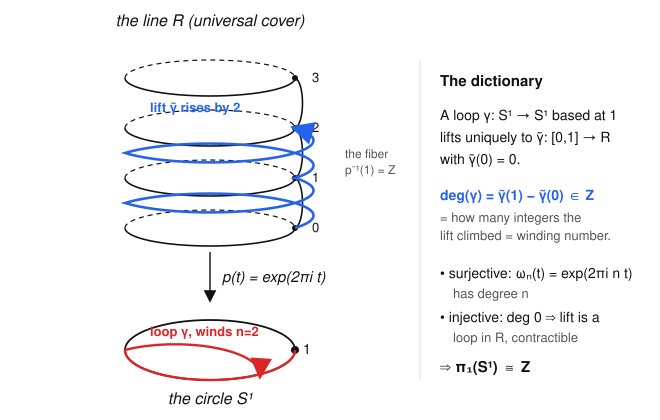

# Algebraic Topology · Lesson 1.4: $\pi_1(S^1)\cong\mathbb{Z}$

> ⏱ ~15 min · Module 1: Homotopy & the Fundamental Group · Builds on: [1.3 Basepoints & functoriality](01-03-basepoints-functoriality.md) · Unlocks: [1.5 First payoffs](01-05-first-payoffs.md)

## Why this matters

So far $\pi_1$ has been a definition with no examples you couldn't guess. This lesson computes the first genuinely non-trivial fundamental group — $\pi_1(S^1)\cong\mathbb{Z}$ — and it is the single most important calculation in the course. Everything downstream in Module 1 is a corollary: no retraction of the disk onto its boundary, Brouwer's fixed-point theorem in dimension 2, the fundamental theorem of algebra, Borsuk–Ulam. The technique — lift the problem to a covering space where the topology is trivial, then read off an integer — is the prototype for the entire covering-space machine of Module 2. And the integer we extract, the **winding number**, is exactly the object complex analysis integrates $\frac{1}{2\pi i}\oint \frac{dz}{z}$ to compute.

## The idea

A loop on a circle can only do one interesting thing: wind around. It might go around twice counterclockwise, once clockwise, or wobble back and forth and end up net-nowhere. Intuitively the *only* thing that survives continuous deformation is the **net number of times it winds** — a single integer. Wobbles cancel; a genuine trip around cannot be undone without cutting.

How do we make "net winding" precise and prove nothing else survives? Unroll the circle. Picture $S^1$ as the ground floor and the real line $\mathbb{R}$ as an infinite spiral staircase hovering above it, with the map $p$ dropping each stair straight down to the floor point below (Figure 1). Each floor point sits below infinitely many stairs, spaced one integer apart. Now walk a loop on the floor and have a shadow-walker climb the staircase so its shadow is always you. If you finish one full counterclockwise lap, your shadow has climbed exactly one floor; two laps, two floors. **The winding number is just how many floors the shadow climbed** — the height difference between where it ended and where it started.

The magic is that once you fix which stair the shadow starts on, its entire climb is *forced* — there is exactly one way to lift your walk. So the loop determines the height change uniquely, and (this is the real theorem) two loops are homotopic **iff** they climb to the same floor. That converts a topological question into subtraction of two integers.

## The formal version

The staircase is the **exponential covering map**
$$p:\mathbb{R}\to S^1,\qquad p(t)=e^{2\pi i t},$$
viewing $S^1=\{z\in\mathbb{C}:|z|=1\}$ with basepoint $1$. Note $p(t)=1$ exactly when $t\in\mathbb{Z}$, so the **fiber** over the basepoint is $p^{-1}(1)=\mathbb{Z}$. The defining feature of $p$: every point of $S^1$ has an open neighborhood $U$ whose preimage $p^{-1}(U)$ is a disjoint union of open intervals, each mapped **homeomorphically** onto $U$ by $p$. We say $U$ is *evenly covered*. (Concretely, take $U=S^1\setminus\{-1\}$; then $p^{-1}(U)=\bigsqcup_{n}(n-\tfrac12,\,n+\tfrac12)$, one interval per integer.) This local-triviality is everything the two lemmas below need.

**Path Lifting Lemma.** For any path $\gamma:[0,1]\to S^1$ and any $\tilde x_0\in\mathbb{R}$ with $p(\tilde x_0)=\gamma(0)$, there is a **unique** path $\tilde\gamma:[0,1]\to\mathbb{R}$ with $p\circ\tilde\gamma=\gamma$ and $\tilde\gamma(0)=\tilde x_0$.

*In words:* once you say which stair to start on, the shadow's entire climb is determined — no choices left.

**Homotopy Lifting Lemma.** For any homotopy $H:[0,1]\times[0,1]\to S^1$ and any lift $\tilde x_0$ of $H(0,0)$, there is a unique lift $\tilde H:[0,1]\times[0,1]\to\mathbb{R}$ with $p\circ\tilde H=H$ and $\tilde H(0,0)=\tilde x_0$.

*In words:* you can lift not just one walk but a whole continuous family of walks, all at once and consistently.

*Proof sketch (both at once).* Cover $S^1$ by evenly covered sets and pull back to a subdivision of the domain (using compactness: the Lebesgue number lemma gives a grid fine enough that each little square maps into one evenly covered $U$). On the first cell, $\gamma$ lands in some evenly covered $U$; among the disjoint intervals (sheets) of $p^{-1}(U)$ exactly one contains $\tilde x_0$, and $p$ restricted to that sheet is a homeomorphism, so $\tilde\gamma:=(p|_{\text{sheet}})^{-1}\circ\gamma$ is the only continuous lift there. Its endpoint is the forced start for the next cell; induct across the grid. Continuity of the assembled lift holds because adjacent pieces agree at the shared boundary. Uniqueness: two lifts agreeing at a point agree on an open-and-closed subset of the connected domain, hence everywhere. $\blacksquare$

Now the payoff. Let $\gamma$ be a **loop** at $1$, so $\gamma(0)=\gamma(1)=1$. Lift it with $\tilde\gamma(0)=0$. Both endpoints lie over $1$, so $\tilde\gamma(0),\tilde\gamma(1)\in\mathbb{Z}$; since $\tilde\gamma(0)=0$,

$$\boxed{\ \deg(\gamma)\ :=\ \tilde\gamma(1)-\tilde\gamma(0)\ =\ \tilde\gamma(1)\ \in\ \mathbb{Z}.\ }$$

*In words:* the **degree** (winding number) is the floor the lifted path climbs to.

**Theorem.** $\deg:\pi_1(S^1,1)\to\mathbb{Z}$ is a well-defined group isomorphism, so $\pi_1(S^1)\cong\mathbb{Z}$.

*Proof, in four checks.*

**(1) Well-defined on homotopy classes.** If $\gamma\simeq\gamma'$ rel endpoints via $H$, lift $H$ to $\tilde H$ starting at $0$. For each fixed $s$, $t\mapsto \tilde H(s,t)$ starts at some point over $1$, but $s\mapsto\tilde H(s,0)$ is a continuous path in the discrete fiber $\mathbb{Z}$, hence constant $=0$; likewise $s\mapsto\tilde H(s,1)$ is continuous into $\mathbb{Z}$, hence **constant**. So the endpoint $\tilde H(s,1)$ never changes as we deform: $\deg(\gamma)=\tilde H(0,1)=\tilde H(1,1)=\deg(\gamma')$. Degree is a homotopy invariant.

**(2) Homomorphism.** Given loops $\gamma,\delta$, lift $\gamma$ to $\tilde\gamma$ starting at $0$, ending at $m=\deg\gamma$. Lift $\delta$ starting at $0$ to $\tilde\delta$, ending at $n=\deg\delta$. Then $t\mapsto m+\tilde\delta(t)$ is a lift of $\delta$ starting at $m$ (because $p(m+s)=e^{2\pi i m}e^{2\pi i s}=p(s)$). Concatenating $\tilde\gamma$ with this shifted lift gives *the* lift of $\gamma\cdot\delta$ starting at $0$, and it ends at $m+n$. Hence $\deg(\gamma\cdot\delta)=m+n=\deg\gamma+\deg\delta$.

**(3) Surjective.** The loop $\omega_n(t)=e^{2\pi i n t}$ lifts to $\tilde\omega_n(t)=nt$ (indeed $p(nt)=e^{2\pi i nt}=\omega_n(t)$ and $nt$ starts at $0$), which ends at $n$. So $\deg(\omega_n)=n$: every integer is hit.

**(4) Injective.** Suppose $\deg\gamma=0$. Then its lift $\tilde\gamma$ is a **loop** in $\mathbb{R}$ ($\tilde\gamma(0)=\tilde\gamma(1)=0$). But $\mathbb{R}$ is convex, hence contractible: the straight-line homotopy $\tilde H(s,t)=(1-s)\,\tilde\gamma(t)$ shrinks $\tilde\gamma$ to the constant loop at $0$ rel endpoints. Push down: $H=p\circ\tilde H$ is a homotopy in $S^1$ from $\gamma$ to the constant loop at $1$. So $[\gamma]$ is trivial, i.e. $\ker\deg$ is trivial. $\blacksquare$

A homomorphism onto $\mathbb{Z}$ with trivial kernel is an isomorphism. So $\pi_1(S^1,1)\cong\mathbb{Z}$, generated by the class of $\omega_1$ (one counterclockwise lap). $\blacksquare$

## Picture

The staircase is $\mathbb{R}$; dropping straight down is $p(t)=e^{2\pi i t}$. The floor is $S^1$. The red loop laps the circle twice; its blue lifted shadow climbs from floor $0$ to floor $2$. The height climbed, $2$, is the degree. Surjectivity says you can climb to any floor; injectivity says a climb ending back at floor $0$ can be reeled straight back down because the staircase itself has no holes.

## Worked examples

**Example 1 (lift a concrete loop, read off winding).** Let $\gamma(t)=e^{2\pi i(3t)}\,e^{-2\pi i\sin(2\pi t)}$, a loop at $1$ (check: at $t=0,1$ the exponent is $0$). Since $p$ is multiplicative, write $\gamma(t)=p\big(3t-\sin(2\pi t)\big)$. The function $\tilde\gamma(t)=3t-\sin(2\pi t)$ is continuous, real-valued, and $\tilde\gamma(0)=0$ — so by uniqueness it *is* the lift starting at $0$. Its endpoint:
$$\tilde\gamma(1)=3\cdot 1-\sin(2\pi)=3-0=3.$$
Hence $\deg(\gamma)=3$. The $-\sin(2\pi t)$ term wobbles the shadow up and down mid-climb but contributes nothing to the *net* height — exactly the intuition that wobbles cancel. The class $[\gamma]$ equals $[\omega_1]^3$ in $\pi_1(S^1)$.

**Example 2 (why you'd care — a self-map has nowhere to hide).** Consider $f:S^1\to S^1$, $f(z)=z^k$ for a fixed integer $k$. What does $f$ do to $\pi_1$? The generator $[\omega_1]$ maps to $[f\circ\omega_1]$, and $f(\omega_1(t))=e^{2\pi i t\cdot k}=\omega_k(t)$, of degree $k$. So under the identification $\pi_1(S^1)\cong\mathbb{Z}$, the induced homomorphism $f_*:\mathbb{Z}\to\mathbb{Z}$ (from Lesson 1.3) is **multiplication by $k$**. This is our first computation of an $f_*$ on a non-trivial group, and it is already sharp enough to prove theorems: a map of degree $\ne 1$ can't be homotopic to the identity, and — chased through the disk — a degree argument on the boundary circle is exactly what forces Brouwer and the fundamental theorem of algebra in Lesson 1.5.

## Watch out

- **You might think** the lift of a loop is again a loop — **but** it usually is *not*. A loop downstairs ends where it started on the circle; upstairs it ends on a possibly *different* stair. That failure to close up is precisely the winding number. Only degree-$0$ loops lift to loops.
- **You might think** the winding number depends on which stair you start the lift from — **but** it doesn't: $\deg=\tilde\gamma(1)-\tilde\gamma(0)$ is a *difference*, and starting on stair $c$ instead of $0$ just adds $c$ to both endpoints (the shifted path $c+\tilde\gamma$ is still a valid lift). The climb *height* is invariant; only the absolute floor labels move.
- **You might think** homotopy invariance of degree needs the loops to share every intermediate point — **but** the only thing pinned is the *endpoints*. The argument is that $s\mapsto\tilde H(s,1)$ is a continuous map into the discrete set $\mathbb{Z}$, so it can't jump; a continuous integer-valued function of $s$ is constant. Discreteness of the fiber is doing the real work.

## One-liner

> Unroll the circle onto the line, lift the loop, and read the winding number as the height it climbed — that integer is all of $\pi_1(S^1)$.

## Problems

**P1 (🟢)** For each loop at $1$, find the lift starting at $0$ and its degree: (a) $\alpha(t)=e^{-6\pi i t}$; (b) $\beta(t)=e^{2\pi i\,(t^2)}\cdot e^{2\pi i t}$. Then state $[\alpha]$ and $[\beta]$ as powers of the generator $[\omega_1]$.

**P2 (🟡)** Use $\pi_1(S^1)\cong\mathbb{Z}$ to prove $S^1$ is **not** simply connected, and then prove the punctured plane $\mathbb{C}\setminus\{0\}$ (equivalently $\mathbb{R}^2\setminus\{0\}$) has $\pi_1\cong\mathbb{Z}$. *(Hint: from Lesson 1.3, homotopy-equivalent spaces have isomorphic $\pi_1$; find a deformation retract.)*

**P3 (🔴, optional)** Prove the fiber-is-discrete step of well-definedness cleanly: if $c:[0,1]\to\mathbb{Z}\subset\mathbb{R}$ is continuous, then $c$ is constant. Then explain in one sentence how this single fact powers both check (1) (invariance) and the uniqueness half of path lifting.

Solutions

**P1.** (a) $\alpha(t)=e^{2\pi i(-3t)}=p(-3t)$, and $-3t$ is continuous with value $0$ at $t=0$, so by uniqueness $\tilde\alpha(t)=-3t$. Endpoint $\tilde\alpha(1)=-3$, so $\deg\alpha=-3$ and $[\alpha]=[\omega_1]^{-3}$ (three clockwise laps).
(b) Multiplicativity of $p$ gives $\beta(t)=p(t^2+t)$; the exponent $\tilde\beta(t)=t^2+t$ is continuous with $\tilde\beta(0)=0$, hence is the lift. Endpoint $\tilde\beta(1)=1+1=2$, so $\deg\beta=2$ and $[\beta]=[\omega_1]^2$. (The $t^2$ term speeds the climb non-uniformly but the net height is what counts.)

**P2.** *Not simply connected:* simply connected means $\pi_1$ trivial. But $\pi_1(S^1)\cong\mathbb{Z}\ne 0$ (e.g. $[\omega_1]$ has infinite order and is $\ne$ identity), so $S^1$ is not simply connected. Concretely, the identity loop $\omega_1$ is not nullhomotopic because its degree is $1\ne 0$, and degree is a homotopy invariant.

*Punctured plane:* the map $r:\mathbb{C}\setminus\{0\}\to S^1$, $r(z)=z/|z|$, is a deformation retract, with straight-line homotopy $H(z,s)=(1-s)z+s\,\dfrac{z}{|z|}$. Check it stays in $\mathbb{C}\setminus\{0\}$: for each fixed $z\ne 0$ this is a positive combination pushing $z$ radially to the unit circle, never passing through $0$ (both $z$ and $z/|z|$ point the same direction, so their positive combination has positive length). At $s=0$ it is the identity; at $s=1$ it lands in $S^1$; and it fixes $S^1$ pointwise. So $\mathbb{C}\setminus\{0\}\simeq S^1$ (homotopy equivalent). By the Lesson 1.3 fact that homotopy equivalences induce isomorphisms on $\pi_1$, $\pi_1(\mathbb{C}\setminus\{0\})\cong\pi_1(S^1)\cong\mathbb{Z}$. The generator is a loop circling the puncture once — this is the winding number of complex analysis. $\blacksquare$

**P3.** Let $c:[0,1]\to\mathbb{R}$ be continuous with $c([0,1])\subseteq\mathbb{Z}$. The domain $[0,1]$ is connected, and the continuous image of a connected set is connected. But the only connected subsets of $\mathbb{Z}$ (with the subspace topology, which is discrete) are singletons: if $c$ took two distinct integer values $m<n$, then $c^{-1}\big((-\infty,m+\tfrac12)\big)$ and $c^{-1}\big((m+\tfrac12,\infty)\big)$ would be two nonempty disjoint open sets covering $[0,1]$, contradicting connectedness. So the image is a single point: $c$ is constant. $\blacksquare$
*How it powers both:* in check (1) the endpoint map $s\mapsto\tilde H(s,1)$ lands in the fiber $\mathbb{Z}$, so this lemma pins it constant and degree can't jump under homotopy; in path lifting, two lifts of the same path agree at $t=0$ and their difference lands in $\ker p=\mathbb{Z}$, so the same discreteness forces them equal everywhere — that's uniqueness.

## Flashback

**From Lesson 1.3 (induced homomorphisms & functoriality):** Let $X$ be any space that deformation-retracts onto a subspace $A$, with inclusion $\iota:A\hookrightarrow X$ and retraction $r:X\to A$. Prove that $\iota_*:\pi_1(A,a_0)\to\pi_1(X,a_0)$ is an **isomorphism**, using only functoriality ($(\!f\circ g)_*=f_*\circ g_*$, $(\operatorname{id})_*=\operatorname{id}$) and homotopy-invariance of $f_*$. Then read off $\pi_1$ of the Möbius band (which deformation-retracts onto its core circle).

Solution

Since $r$ is a retraction, $r\circ\iota=\operatorname{id}_A$. Apply the functor: $r_*\circ\iota_*=(r\circ\iota)_*=(\operatorname{id}_A)_*=\operatorname{id}_{\pi_1(A)}$. So $\iota_*$ has a left inverse and is injective.

For the other side, a *deformation* retract gives a homotopy $H$ from $\iota\circ r$ to $\operatorname{id}_X$ rel $a_0$ (the basepoint is fixed throughout the deformation). Homotopic basepoint-preserving maps induce equal homomorphisms (Lesson 1.3), so $(\iota\circ r)_*=(\operatorname{id}_X)_*=\operatorname{id}_{\pi_1(X)}$, i.e. $\iota_*\circ r_*=\operatorname{id}_{\pi_1(X)}$. So $\iota_*$ also has a right inverse and is surjective.

Injective and surjective $\Rightarrow$ $\iota_*$ is an isomorphism, with inverse $r_*$. $\blacksquare$

*Möbius band:* it deformation-retracts onto its central circle $\cong S^1$, so $\pi_1(\text{Möbius})\cong\pi_1(S^1)\cong\mathbb{Z}$ — the same $\mathbb{Z}$ we just computed, now obtained for free by transport along a homotopy equivalence rather than a fresh lifting argument.

## Connections

- **Backward:** this is the first real use of the induced homomorphism $f_*$ from [Lesson 1.3](01-03-basepoints-functoriality.md) — Example 2 computes $f_*$ for $z\mapsto z^k$ as multiplication by $k$, and the flashback shows the deformation-retract trick that turns "$X\simeq S^1$" into "$\pi_1(X)\cong\mathbb{Z}$" (used on $\mathbb{C}\setminus\{0\}$ in P2).
- **Forward:** [Lesson 1.5](01-05-first-payoffs.md) cashes $\pi_1(S^1)\cong\mathbb{Z}$ into the no-retraction lemma, Brouwer in dimension 2, and the fundamental theorem of algebra — each is a short degree argument. The exponential cover $p:\mathbb{R}\to S^1$ is the first example of the general **covering spaces** and path/homotopy lifting studied throughout Module 2 ([2.1](02-01-covering-spaces-lifting.md)), where $\mathbb{R}$ is revealed as the *universal cover* of $S^1$ and the fiber $\mathbb{Z}$ as its deck group.
- **Sideways (complex analysis):** the degree of a loop $\gamma$ around $0$ is exactly its **winding number** $\dfrac{1}{2\pi i}\oint_{\gamma}\dfrac{dz}{z}$; our "lift and subtract endpoints" is the topological shadow of the argument principle, and this bridge is what makes $\pi_1(S^1)$ the engine behind the fundamental theorem of algebra in the next lesson. The retraction $z\mapsto z/|z|$ in P2 is the same one that puts the winding number on $\mathbb{C}\setminus\{0\}$.
