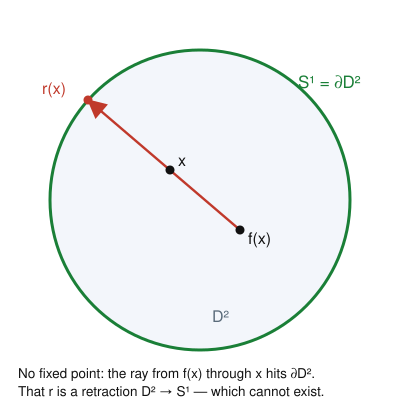

# Algebraic Topology · Lesson 1.5: First payoffs

> ⏱ ~15 min · Module 1: Homotopy & the Fundamental Group · Builds on: [Lesson 1.3](01-03-basepoints-functoriality.md), [Lesson 1.4](01-04-pi1-of-the-circle.md) · Unlocks: [Lesson 2.1](02-01-covering-spaces-lifting.md)

## Why this matters

Last lesson cost us real sweat for a one-line answer: $\pi_1(S^1) \cong \mathbb{Z}$. This lesson is the payday. That single nonzero group forces three theorems that look like they belong to three different subjects — a topological statement (you can't retract a disk onto its rim), an analytic one (every polynomial has a root), and a fixed-point theorem that underwrites the existence of equilibria in economics and dynamics. The point is not just the theorems; it's that **they are all the same proof**. Each says: *if such a continuous map existed, it would induce an impossible homomorphism on $\mathbb{Z}$.* Learn the move once and you own all three.

## The idea

Recall the machinery from [Lesson 1.3](01-03-basepoints-functoriality.md): $\pi_1$ is a **functor**. A continuous map $f\colon X \to Y$ (based) yields a group homomorphism $f_*\colon \pi_1(X) \to \pi_1(Y)$, and two facts hold with no extra work:

- **Composites go to composites:** $(g \circ f)_* = g_* \circ f_*$.
- **The identity goes to the identity:** $(\operatorname{id}_X)_* = \operatorname{id}_{\pi_1(X)}$.

Now the whole trick in one breath: **a group homomorphism cannot smuggle a nonzero group through a zero group.** If $\mathbb{Z} \xrightarrow{\,i_*\,} 0 \xrightarrow{\,r_*\,} \mathbb{Z}$ and the composite is the identity, that's a contradiction — everything factoring through $0$ is the zero map, and the identity on $\mathbb{Z}$ is not zero.

So the strategy for "no such continuous map exists" is always: *suppose it did, feed it to $\pi_1$, and watch the identity on $\mathbb{Z}$ try to factor through $\pi_1(D^2) = 0$.* The disk is contractible, so its fundamental group is trivial — the disk is where loops go to die, and any argument that routes a nontrivial loop through it is doomed.

## The formal version

### The no-retraction lemma

A **retraction** of a space $X$ onto a subspace $A \subseteq X$ is a continuous map $r\colon X \to A$ that fixes $A$ pointwise: $r(a) = a$ for all $a \in A$. Equivalently, $r \circ i = \operatorname{id}_A$ where $i\colon A \hookrightarrow X$ is the inclusion.

**Lemma.** There is no retraction $r\colon D^2 \to S^1$ of the closed disk onto its boundary circle.

*In words:* you cannot continuously squash the disk onto its rim while leaving the rim untouched — something has to tear.

*Proof.* Suppose $r$ exists. Then $r \circ i = \operatorname{id}_{S^1}$, where $i\colon S^1 \hookrightarrow D^2$. Apply the functor $\pi_1$ (basepoint $x_0 \in S^1$) and use functoriality:
$$r_* \circ i_* = (r \circ i)_* = (\operatorname{id}_{S^1})_* = \operatorname{id}_{\pi_1(S^1)}.$$
Reading this off as a diagram of groups:
$$\pi_1(S^1) \xrightarrow{\;i_*\;} \pi_1(D^2) \xrightarrow{\;r_*\;} \pi_1(S^1), \qquad \text{i.e.}\qquad \mathbb{Z} \xrightarrow{\;i_*\;} 0 \xrightarrow{\;r_*\;} \mathbb{Z},$$
because $D^2$ is convex, hence contractible, so $\pi_1(D^2) = 0$ (and $\pi_1(S^1) = \mathbb{Z}$ from [Lesson 1.4](01-04-pi1-of-the-circle.md)). The composite of these two maps is the identity on $\mathbb{Z}$. But every homomorphism out of the trivial group is zero, so $r_* \circ i_*$ is the zero map — which sends the generator $1 \in \mathbb{Z}$ to $0$, not to $1$. Contradiction. $\blacksquare$

Everything below is this lemma wearing a disguise.

### Brouwer's fixed point theorem (dimension 2)

**Theorem.** Every continuous map $f\colon D^2 \to D^2$ has a fixed point: some $x$ with $f(x) = x$.

*In words:* stir a cup of coffee (continuously, no splashing) and at least one molecule ends exactly where it started.

*Proof.* Suppose $f$ has **no** fixed point, so $f(x) \neq x$ for every $x$. Then the two distinct points $f(x)$ and $x$ determine a ray starting at $f(x)$ and passing through $x$; follow it forward until it exits the disk, and call that boundary point $r(x) \in S^1$ (see the Picture). This defines a map $r\colon D^2 \to S^1$.

Two claims finish it.

1. **$r$ is a retraction.** If $x$ already lies on $S^1$, then the ray from $f(x)$ through $x$ leaves the disk *at $x$ itself* (you're already on the rim, heading outward), so $r(x) = x$. Hence $r$ fixes $S^1$ pointwise.
2. **$r$ is continuous.** Write $r(x) = x + t(x)\,u(x)$, where $u(x) = \dfrac{x - f(x)}{\lVert x - f(x)\rVert}$ is the unit direction of the ray and $t(x) \ge 0$ is chosen so that $\lVert r(x)\rVert = 1$. Since $f$ is continuous and $x - f(x) \neq 0$ everywhere (no fixed point!), $u$ is continuous. And $t(x)$ is the nonnegative root of the quadratic $\lVert x + t\,u(x)\rVert^2 = 1$, whose coefficients depend continuously on $x$; the root varies continuously because the leading coefficient is $1 \neq 0$. So $r$ is continuous.

But then $r$ is a retraction of $D^2$ onto $S^1$, contradicting the no-retraction lemma. Therefore $f$ must have a fixed point. $\blacksquare$

Notice the shape: the *would-be counterexample* (a fixed-point-free $f$) is exactly the raw material for the *forbidden map* (the retraction). That is the signature of every argument in this lesson.

### The fundamental theorem of algebra

**Theorem.** Every nonconstant polynomial $p(z) = z^n + a_{n-1}z^{n-1} + \cdots + a_0$ with complex coefficients ($n \ge 1$) has a root in $\mathbb{C}$.

*In words:* over the complex numbers, "degree $n$" and "has $n$ roots" are the same statement — no polynomial can dodge having a zero.

*Proof (winding sketch).* Suppose $p$ has **no** root. Then $p(z) \neq 0$ for all $z$, so for each radius $R \ge 0$ we get a loop into the circle,
$$\gamma_R\colon [0,1] \to S^1, \qquad \gamma_R(s) = \frac{p(Re^{2\pi i s})}{\lvert p(Re^{2\pi i s})\rvert},$$
the normalized image of the circle of radius $R$. Its **winding number** (its class in $\pi_1(S^1) \cong \mathbb{Z}$, from [Lesson 1.4](01-04-pi1-of-the-circle.md)) is an integer $w(R)$.

Two facts pin $w(R)$ from both ends:

- **Small $R$.** At $R = 0$ the map is constant ($\gamma_0(s) = p(0)/\lvert p(0)\rvert$, legal because $p(0) \neq 0$), so $w(0) = 0$. As $R$ grows, the loops $\gamma_R$ vary *continuously* in $R$ — a homotopy of loops in $S^1$ — and the winding number is a homotopy invariant. Since it's an integer that can't jump, $w(R) = 0$ for **every** $R$.
- **Large $R$.** For $\lvert z\rvert = R$ huge, the leading term dominates: $p(z) = z^n\big(1 + a_{n-1}/z + \cdots + a_0/z^n\big)$, and the bracket stays close to $1$, so $\gamma_R$ is homotopic (through the straight-line homotopy in $\mathbb{C}\setminus\{0\}$) to $s \mapsto (Re^{2\pi i s})^n/R^n = e^{2\pi i n s}$, which winds $n$ times. Hence $w(R) = n$ for all large $R$.

So $0 = w(R) = n$, forcing $n = 0$ — contradicting $n \ge 1$. Therefore a nonconstant $p$ must have a root. $\blacksquare$

The bridge is worth naming: that "count how many times $p(z)$ winds around $0$" is precisely the **argument principle** you meet in [complex-analysis](../../complex-analysis/syllabus.md); topology and complex analysis are computing the same integer two ways.

## Picture

The engine of the Brouwer proof. Assuming $f(x) \neq x$, the two points $f(x)$ and $x$ are distinct, so there is exactly one ray from $f(x)$ through $x$; extend it to where it leaves the disk and you land on $r(x) \in S^1$. If $x$ is already on the rim, the ray exits right there, so $r(x) = x$ — that's what makes $r$ a retraction, and a retraction $D^2 \to S^1$ is exactly what can't exist.

## Worked examples

**Example 1 (the one-dimensional shadow).** Before trusting the 2D machine, watch the same move in dimension 1, where it's just the intermediate value theorem. Claim: every continuous $g\colon [-1,1] \to [-1,1]$ has a fixed point. Consider $h(x) = g(x) - x$. Then $h(-1) = g(-1) - (-1) = g(-1) + 1 \ge 0$ (since $g(-1) \ge -1$) and $h(1) = g(1) - 1 \le 0$. A continuous $h$ with $h(-1) \ge 0 \ge h(1)$ has a zero by IVT, i.e. some $x_0$ with $g(x_0) = x_0$. 

The parallel is exact: here the "boundary" is the two-point set $\{-1, 1\}$, and the reason there's no continuous retraction $[-1,1] \to \{-1, 1\}$ is that $[-1,1]$ is connected while $\{-1,1\}$ is not (so no onto continuous map fixing both endpoints). Connectedness is the $H_0$-flavored invariant standing in for $\pi_1$ one dimension down. Brouwer in dimension 2 is the honest upgrade, and $\pi_1(S^1) = \mathbb{Z}$ is doing the job that "$[-1,1]$ is connected" did here.

**Example 2 (a concrete root count).** Take $p(z) = z^3 - 2z + 2$. The FTA guarantees a root; the *proof* even tells you the winding data. On a large circle $\lvert z\rvert = R$, factor out the leading term: $p(z) = z^3\big(1 - 2/z^2 + 2/z^3\big)$. For $R = 10$, the correction $\lvert -2/z^2 + 2/z^3\rvert \le 2/100 + 2/1000 = 0.022 \ll 1$, so the bracket never leaves the right half-disk around $1$ and contributes zero winding; all of the winding comes from $z^3$, giving $w(10) = 3$. Since a root-free $p$ would force $w(R) \equiv 0$, the value $w(10) = 3 \neq 0$ certifies that $p$ has a root inside $\lvert z\rvert < 10$ — in fact, counted with multiplicity, exactly $3$ of them. This "winding on a big circle counts enclosed roots" is the argument principle again, and it's how you'd *localize* a root numerically.

## Watch out

- **Brouwer needs the disk, not just any space.** You might think "continuous self-map ⇒ fixed point" holds broadly, but it depends on the domain being like $D^2$ (compact and contractible). Rotation of the **annulus** $\{1 \le \lvert z\rvert \le 2\}$ by a fixed angle has no fixed point — the annulus is not contractible ($\pi_1 = \mathbb{Z}$), so the argument never gets off the ground. Compactness matters too: translation $x \mapsto x + 1$ on the (non-compact) real line has no fixed point.
- **A retraction must be continuous *and* fix the subspace.** You might think you can obviously map the disk to its rim — sure, $x \mapsto x/\lVert x\rVert$ works away from the center, but it can't be defined continuously at $0$, and *any* fix breaks the "fixes $S^1$" or "continuous" requirement. The lemma says the whole package is impossible, not that maps $D^2 \to S^1$ don't exist (constant maps do — they just don't fix $S^1$).
- **The FTA winding step needs the map to land in $S^1$ (i.e. $p$ never $0$).** The entire contradiction is that a root-free $p$ lets you *define* $\gamma_R$ for all $R$ at once, giving a homotopy from winding $0$ to winding $n$. If $p$ had a root, some $\gamma_R$ would be undefined and the homotopy would snap — which is precisely the honest situation.

## One-liner

> A continuous map you don't want to exist becomes a homomorphism $\mathbb{Z} \to 0 \to \mathbb{Z}$ that has to be the identity — and can't be.

## Problems

**P1 (🟢)** (a) The rotation $f(z) = e^{i\theta} z$ of the disk $D^2$ (fixed angle $\theta$) is continuous; Brouwer promises a fixed point. Find it, and confirm it's the *only* one when $\theta \not\equiv 0 \pmod{2\pi}$. (b) The same formula rotates the annulus $A = \{1 \le \lvert z\rvert \le 2\}$. For $\theta = \pi$ show it has no fixed point, and name exactly which hypothesis of Brouwer's theorem $A$ violates.

**P2 (🟡)** Fill the gap flagged in the winding proof: show that for a monic degree-$n$ polynomial $p$ with **no** root, the loop $\gamma_R(s) = p(Re^{2\pi i s})/\lvert p(Re^{2\pi i s})\rvert$ has winding number $n$ once $R$ is large enough. (Hint: bound the non-leading terms to show $p(z)$ and $z^n$ are joined by a straight-line homotopy that never passes through $0$ on the circle $\lvert z\rvert = R$; a homotopy of loops in $\mathbb{C}\setminus\{0\}$ preserves winding number.)

**P3 (🔴, optional)** A vector-field corollary, straight from the no-retraction move. Let $v\colon D^2 \to \mathbb{R}^2$ be continuous and suppose that on the boundary $v(x)$ never points radially inward and is never zero — precisely, $v(x) \neq c\,x$ for any $c \le 0$ when $x \in S^1$. Prove $v$ has a zero somewhere: some $x_0 \in D^2$ with $v(x_0) = 0$. (Hint: if $v$ never vanishes, then $w = v/\lVert v\rVert$ is a continuous map $D^2 \to S^1$; its restriction to $S^1$ factors through the disk, so it's null-homotopic — yet the boundary condition makes $w|_{S^1}$ homotopic to $\operatorname{id}_{S^1}$. This is the disk shadow of the hairy-ball theorem you'll meet in [Lesson 4.3](04-03-degree-applications.md).)

Solutions

**P1** (a) $f(z) = z$ means $e^{i\theta} z = z$, i.e. $(e^{i\theta} - 1)z = 0$. If $\theta \not\equiv 0 \pmod{2\pi}$ then $e^{i\theta} \neq 1$, so the only solution is $z = 0$: the **center** is the unique fixed point, consistent with Brouwer (and the disk being contractible offers no obstruction). If $\theta \equiv 0$, $f = \operatorname{id}$ and every point is fixed.

(b) On $A$ with $\theta = \pi$, $f(z) = e^{i\pi} z = -z$. A fixed point needs $-z = z$, i.e. $z = 0$, but $0 \notin A$ (the annulus excludes the inner disk). So $f$ has no fixed point on $A$. The violated hypothesis is **contractibility**: $A$ deformation-retracts onto its core circle, so $\pi_1(A) = \mathbb{Z} \neq 0$, and the no-retraction argument that powers Brouwer never applies. (Compactness and continuity are both fine here — it's the "hole" that saves the rotation.)

**P2** Write $q(z) = z^n$ and, for $\lvert z\rvert = R$, define the straight-line homotopy $H(z, u) = (1-u)\,p(z) + u\,q(z)$ for $u \in [0,1]$, so $H(\cdot,0) = p$ and $H(\cdot,1) = q$. I claim $H(z,u) \neq 0$ on $\lvert z\rvert = R$ for $R$ large. Indeed
$$H(z,u) = z^n + (1-u)\big(a_{n-1}z^{n-1} + \cdots + a_0\big),$$
so
$$\lvert H(z,u)\rvert \ge \lvert z\rvert^n - \big(\lvert a_{n-1}\rvert R^{n-1} + \cdots + \lvert a_0\rvert\big) \ge R^n - C R^{n-1} = R^{n-1}(R - C),$$
where $C = \sum_{k} \lvert a_k\rvert$ and we used $(1-u) \le 1$ and $\lvert z\rvert^k \le R^{n-1}$ for $k \le n-1$. For $R > C$ this is strictly positive, so $H$ never hits $0$ on the circle. Normalizing, $u \mapsto H(\,Re^{2\pi i s},u)/\lvert H\rvert$ is a homotopy in $S^1$ from $\gamma_R^{\,p}$ to $\gamma_R^{\,q}$, and homotopic loops have equal winding number (class in $\pi_1(S^1) = \mathbb{Z}$). The normalized $q$-loop is $s \mapsto (Re^{2\pi i s})^n / R^n = e^{2\pi i n s}$, which winds exactly $n$ times. Hence $w(R) = n$ for all $R > C$. $\blacksquare$

**P3** Suppose, for contradiction, that $v(x) \neq 0$ for **every** $x \in D^2$. Then
$$w\colon D^2 \to S^1, \qquad w(x) = \frac{v(x)}{\lVert v(x)\rVert}$$
is well-defined and continuous on the whole disk.

Restrict to the boundary and call the inclusion $i\colon S^1 \hookrightarrow D^2$, so $w|_{S^1} = w \circ i$. Apply $\pi_1$: since $i_*$ factors through $\pi_1(D^2) = 0$, the induced map $(w|_{S^1})_* = w_* \circ i_*$ is the **zero** homomorphism on $\pi_1(S^1) = \mathbb{Z}$. Equivalently, $w|_{S^1}\colon S^1 \to S^1$ is null-homotopic (it extends continuously over the disk).

Now use the boundary hypothesis to compute $w|_{S^1}$ another way. For $x \in S^1$ consider the straight-line homotopy in $\mathbb{R}^2$
$$H(x,t) = (1-t)\,v(x) + t\,x, \qquad t \in [0,1].$$
If $H(x,t) = 0$ for some $t \in [0,1]$, then either $t = 0$ (giving $v(x) = 0$, impossible) or $t \in (0,1]$ and $v(x) = -\tfrac{t}{1-t}\,x$ — a *nonpositive* multiple of $x$, which the hypothesis forbids (for $t=1$ read $v$ off the endpoint $x\neq 0$, fine). So $H$ never vanishes, and $\widehat H(x,t) = H(x,t)/\lVert H(x,t)\rVert$ is a homotopy in $S^1$ from $w|_{S^1}$ (at $t=0$) to $x \mapsto x/\lVert x\rVert = \operatorname{id}_{S^1}$ (at $t=1$). Hence $w|_{S^1} \simeq \operatorname{id}_{S^1}$, so $(w|_{S^1})_* = \operatorname{id}_{\mathbb{Z}}$, which sends $1 \mapsto 1 \neq 0$.

The two computations collide: $(w|_{S^1})_*$ is both the zero map and the identity on $\mathbb{Z}$. Contradiction. Therefore $v$ must vanish somewhere. $\blacksquare$

(The moral: a vector field on the disk that doesn't point inward at the rim must stall somewhere inside — the exact no-retraction move, now with $w|_{S^1}$ playing the role of the impossible map. On the *sphere* the analogue is the hairy-ball theorem — you can't comb $S^2$ — which needs the degree of a self-map of $S^n$, not just $\pi_1$; see [Lesson 4.3](04-03-degree-applications.md) and the [differential-geometry](../../differential-geometry/syllabus.md) bridge.)

## Flashback

**From [Lesson 1.4](01-04-pi1-of-the-circle.md) ($\pi_1(S^1) \cong \mathbb{Z}$ / lift a loop):** Consider the loop $\gamma\colon [0,1] \to S^1$ given by $\gamma(t) = e^{2\pi i\,(t^2 + 2t)}$, based at $1 \in S^1$ (note $\gamma(0) = \gamma(1) = 1$ since $t^2 + 2t$ is an integer at both ends). Lift $\gamma$ through the exponential covering $p\colon \mathbb{R} \to S^1$, $p(x) = e^{2\pi i x}$, starting the lift at $\tilde\gamma(0) = 0$, and read off which class of $\pi_1(S^1) \cong \mathbb{Z}$ the loop represents.

Solution

The unique lift starting at $0$ is just the exponent read as a real-valued path: $\tilde\gamma(t) = t^2 + 2t$, since $p(\tilde\gamma(t)) = e^{2\pi i (t^2 + 2t)} = \gamma(t)$ and $\tilde\gamma(0) = 0$. By the lifting lemma this lift is unique. The winding number (degree) is the net change in the lift over the loop:
$$\deg(\gamma) = \tilde\gamma(1) - \tilde\gamma(0) = (1 + 2) - 0 = 3.$$
So $[\gamma] = 3 \in \mathbb{Z}$. The point of [Lesson 1.4](01-04-pi1-of-the-circle.md): the isomorphism $\pi_1(S^1) \cong \mathbb{Z}$ *is* "lift and subtract endpoints," and it doesn't care that $\gamma$ sped up and slowed down along the way — only the endpoints of the lift matter. This "winding number = net argument change" is exactly the quantity the argument principle in [complex-analysis](../../complex-analysis/syllabus.md) integrates as $\frac{1}{2\pi i}\oint \frac{\gamma'}{\gamma}\,dz$.

## Connections

- **Backward:** every proof here runs on two facts assembled earlier — functoriality of $\pi_1$ ([Lesson 1.3](01-03-basepoints-functoriality.md)) and the computation $\pi_1(S^1) \cong \mathbb{Z}$ ([Lesson 1.4](01-04-pi1-of-the-circle.md)). Swap in a *trivial* group for $\mathbb{Z}$ and all three theorems evaporate; the nonzero-ness of $\mathbb{Z}$ is the entire content.
- **Forward:** the no-retraction lemma is the low-dimensional prototype of the general Brouwer theorem in [Lesson 4.3](04-03-degree-applications.md), where $\pi_1$ is too weak and **homology** $H_n(S^n) = \mathbb{Z}$ plays the role of $\mathbb{Z}$ here — same argument, higher-dimensional invariant. The lifting used in the FTA sketch is the seed of covering-space theory, which starts next in [Lesson 2.1](02-01-covering-spaces-lifting.md).
- **Sideways (complex analysis):** the fundamental theorem of algebra and the winding-number bookkeeping are the topological face of the **argument principle** in [complex-analysis](../../complex-analysis/syllabus.md) — counting zeros by how many times the image winds around the origin.
- **Sideways (economics / dynamics):** Brouwer's fixed point theorem is the existence engine behind market equilibria and Nash equilibria — a continuous "best-response" self-map of a compact convex strategy space must have a fixed point, and that fixed point *is* the equilibrium.
