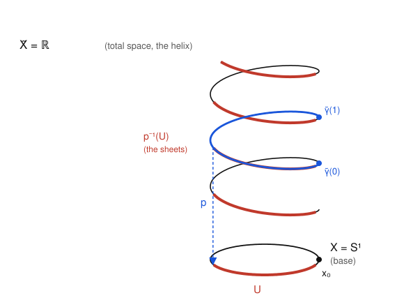

# Algebraic Topology · Lesson 2.1: Covering spaces & lifting

> ⏱ ~15 min · Module 2: Covering Spaces & Seifert–van Kampen · Builds on: [Lesson 1.4](01-04-pi1-of-the-circle.md), the homotopy machinery of Module 1 · Unlocks: [Lesson 2.2](02-02-lifting-criterion-classification.md) (the lifting criterion & classification of covers)

## Why this matters

In Lesson 1.4 you computed $\pi_1(S^1)\cong\mathbb{Z}$ by one trick: unroll the circle onto the line $\mathbb{R}$, and read a loop's homotopy class off the *endpoint* of its unrolled copy. That trick was not a one-off. A **covering space** is exactly "a space unrolled," and lifting a loop upstairs is the universal way to turn a topological question into a bookkeeping one. This lesson makes the trick a theorem — paths and homotopies lift *uniquely* — and the payoff is the entire covering-space dictionary of Module 2: connected covers of $X$ will correspond to subgroups of $\pi_1(X)$, a topological Galois theory. Downstream it powers van Kampen, and it is where the winding number of `complex-analysis` and the quotient topology of `topology` meet.

## The idea

Picture a spiral staircase standing over a circular floor (the figure below). The floor is the base space $X=S^1$; the staircase is the total space $\tilde X=\mathbb{R}$; and the map $p$ that drops each stair straight down to the floor spot beneath it is the **covering map**. Two features make it a *covering*, not just any map:

- **Locally it's a stack of copies.** Stand on any patch $U$ of the floor and look up: directly above $U$ sits a disjoint pile of identical patches (the **sheets**), each a perfect copy of $U$. Nothing is folded, pinched, or torn — just repeated.
- **You can lift, and the lift is forced.** Walk a path on the floor. Starting from one chosen stair, there is exactly one way to walk "the same path" on the staircase: each step you take on the floor lifts to a unique step upstairs, because locally you're just choosing which copy you're standing on, and continuity pins that choice down.

That second bullet — **unique path lifting** — is the workhorse. It says a downstairs path plus a single choice of starting point upstairs determines the whole upstairs path. Homotope the downstairs loop, and its lift slides along with it *without its endpoints moving*, so the endpoint of a lifted loop depends only on the loop's homotopy class. Collecting those endpoints over all loops is the **monodromy** action, the shadow $\pi_1(X)$ casts on the fiber.

## The formal version

**Definition (covering map).** A continuous surjection $p\colon \tilde X\to X$ is a **covering map** if every point $x\in X$ has an open neighborhood $U$ that is **evenly covered**: its preimage decomposes as a disjoint union
$$p^{-1}(U)=\bigsqcup_{\alpha} V_\alpha$$
of open sets $V_\alpha\subseteq\tilde X$ (the **sheets** over $U$), each mapped **homeomorphically** onto $U$ by $p$. We call $\tilde X$ a **covering space** of $X$, and $p^{-1}(x)$ the **fiber** over $x$.

*In words:* over a small enough patch, $p$ looks like the projection $U\times(\text{discrete set})\to U$ — a stack of identical copies. Nothing local distinguishes the sheets from each other; that's the whole point.

**Three examples to keep in your head.**

1. **The exponential cover** $p\colon\mathbb{R}\to S^1$, $\ p(s)=e^{2\pi i s}$ (viewing $S^1\subset\mathbb{C}$). The fiber over any point is a copy of $\mathbb{Z}$ (a discrete set of "floors"). An arc $U$ short of the full circle is evenly covered by the countably many arcs $p^{-1}(U)=\bigsqcup_{n\in\mathbb{Z}}(n+I)$ for a suitable interval $I$. This is the Lesson 1.4 cover — the staircase in the picture.
2. **The $n$-fold cover** $p_n\colon S^1\to S^1$, $\ p_n(z)=z^n$. Now the total space is itself a circle, wrapped $n$ times around the base. Every fiber has exactly $n$ points ($n$ distinct $n$-th roots), and a short arc is evenly covered by $n$ sheets.
3. **The antipodal cover** $q\colon S^n\to\mathbb{RP}^n$, identifying $x\sim -x$. A small open ball on $\mathbb{RP}^n$ lifts to two antipodal balls on $S^n$: a $2$-sheeted cover. (You verify this in P3.)

**Theorem (Unique Path Lifting).** Let $p\colon\tilde X\to X$ be a covering map, let $\gamma\colon[0,1]\to X$ be a path with $\gamma(0)=x_0$, and fix a point $\tilde x_0\in p^{-1}(x_0)$. Then there is a **unique** path $\tilde\gamma\colon[0,1]\to\tilde X$ with $p\circ\tilde\gamma=\gamma$ and $\tilde\gamma(0)=\tilde x_0$.

*In words:* a path downstairs, together with one choice of where to start upstairs, determines exactly one path upstairs.

*Proof.* **Existence (sheet by sheet).** Cover $X$ by evenly covered open sets. Their preimages under $\gamma$ form an open cover of the compact metric space $[0,1]$, so a Lebesgue number gives a partition $0=t_0<t_1<\dots<t_k=1$ with each $\gamma([t_{i},t_{i+1}])$ contained in a single evenly covered $U_i$. Build $\tilde\gamma$ on one subinterval at a time. On $[t_0,t_1]$: the starting point $\tilde x_0$ lies in exactly one sheet $V$ of $p^{-1}(U_0)$; since $p|_V\colon V\to U_0$ is a homeomorphism, set $\tilde\gamma:=(p|_V)^{-1}\circ\gamma$ there. Its terminal value $\tilde\gamma(t_1)$ now sits in a unique sheet of $p^{-1}(U_1)$; repeat. The pieces agree at the shared endpoints by construction, so the pasting lemma glues them into a continuous $\tilde\gamma$ lifting $\gamma$ with $\tilde\gamma(0)=\tilde x_0$.

**Uniqueness (connectedness).** Suppose $\tilde\gamma,\tilde\gamma'$ both lift $\gamma$ and start at $\tilde x_0$. Let $A=\{t\in[0,1]:\tilde\gamma(t)=\tilde\gamma'(t)\}$; note $0\in A$. Fix any $t$ and an evenly covered $U\ni\gamma(t)$, with sheets $\{V_\alpha\}$. For $s$ near $t$ both lifts stay in the sheets over $U$, so each lands in one sheet.
 - If $t\in A$: both lifts occupy the *same* sheet $V$ near $t$, and $p|_V$ is injective, so $\tilde\gamma=\tilde\gamma'$ throughout that neighborhood — hence $A$ is open.
 - If $t\notin A$: the two lifts sit in *different* (disjoint) sheets near $t$ and cannot meet there — hence the complement is open, i.e. $A$ is closed.

So $A$ is nonempty, open, and closed in the connected space $[0,1]$; therefore $A=[0,1]$ and $\tilde\gamma=\tilde\gamma'$. $\blacksquare$

**Theorem (Homotopy Lifting Property).** Let $p\colon\tilde X\to X$ be a covering map and $F\colon Y\times[0,1]\to X$ a homotopy. Any lift $\tilde f_0\colon Y\to\tilde X$ of $F(\cdot,0)$ extends to a **unique** lift $\tilde F\colon Y\times[0,1]\to\tilde X$ of $F$ with $\tilde F(\cdot,0)=\tilde f_0$.

*In words:* not just paths but whole families of paths lift, uniquely, once you fix the lift at time $0$. (Taking $Y$ a point recovers unique path lifting; the general proof is the same sheet-by-sheet argument run continuously in the $Y$-parameter.)

**Corollary (lifted homotopies keep their endpoints — "the monodromy theorem").** Let $\gamma_s$ (for $s\in[0,1]$) be a homotopy of paths **rel endpoints** in $X$, all from $x_0$ to $x_1$. Lift with fixed start: let $\tilde\gamma_s$ be the lift of $\gamma_s$ starting at a fixed $\tilde x_0\in p^{-1}(x_0)$. Then every $\tilde\gamma_s$ ends at the **same** point, and $s\mapsto\tilde\gamma_s(1)$ is constant.

*Proof.* Apply the HLP with $Y=[0,1]$ to the homotopy $F(t,s)=\gamma_s(t)$, lifting the bottom edge $\gamma_0$; call the lift $\tilde F$, so $\tilde\gamma_s(t)=\tilde F(t,s)$. Because the homotopy is rel endpoints, $F(0,s)\equiv x_0$: the left edge is the *constant* path at $x_0$. Its lift $s\mapsto\tilde F(0,s)$ is a lift of a constant path, and by unique path lifting the only such lift starting at $\tilde x_0$ is the constant one — so every $\tilde\gamma_s$ starts at $\tilde x_0$, confirming the lifts share a start. The right edge $F(1,s)\equiv x_1$ is likewise constant, so its lift $s\mapsto\tilde F(1,s)=\tilde\gamma_s(1)$ is a lift of a constant path, hence itself constant. $\blacksquare$

*In words:* homotopic loops (rel basepoint) lift to paths with **identical** endpoints — so the endpoint of a lifted loop is an invariant of its class in $\pi_1(X,x_0)$.

**Definition (monodromy action).** Fix $x_0\in X$, the fiber $F=p^{-1}(x_0)$, and a class $[\gamma]\in\pi_1(X,x_0)$. For $\tilde x\in F$, lift $\gamma$ to the path $\tilde\gamma$ starting at $\tilde x$ and set
$$\tilde x\cdot[\gamma]:=\tilde\gamma(1)\in F.$$
By the corollary this depends only on $[\gamma]$, and it defines a **right action** of $\pi_1(X,x_0)$ on the fiber $F$: the constant loop fixes every point, and $\tilde x\cdot([\gamma][\delta])=(\tilde x\cdot[\gamma])\cdot[\delta]$, because lifting the concatenation $\gamma\cdot\delta$ from $\tilde x$ means first lifting $\gamma$ (ending at $\tilde x\cdot[\gamma]$) and *then* lifting $\delta$ from there. This action is the **monodromy** of the cover.

## Picture

The base circle $X=S^1$ has a highlighted evenly-covered arc $U$ (red). Straight above it the sheets $p^{-1}(U)$ appear as one red arc per turn of the helix $\tilde X=\mathbb{R}$ — a disjoint stack of copies of $U$. A loop that runs once around the base lifts (blue) to a path climbing exactly one turn, from $\tilde\gamma(0)$ to a *different* point $\tilde\gamma(1)$ one floor up: the lift of a loop need not be a loop, and how far it climbs is the winding number.

## Worked examples

**Example 1 (lifting a path through $\mathbb{R}\to S^1$).** Take $p(s)=e^{2\pi i s}$ and the loop $\gamma(t)=e^{2\pi i\, t}$ (once around, counterclockwise), and lift it starting at $\tilde x_0=5\in p^{-1}(1)$.

A lift must satisfy $e^{2\pi i\,\tilde\gamma(t)}=e^{2\pi i\, t}$, i.e. $\tilde\gamma(t)-t\in\mathbb{Z}$; continuity forces the integer to be constant, and $\tilde\gamma(0)=5$ fixes it at $5$. So
$$\tilde\gamma(t)=t+5,\qquad \tilde\gamma(1)=6.$$
The lift climbs from floor $5$ to floor $6$: the endpoint minus the start, $6-5=1$, is the winding number. Change the start to $\tilde x_0=5$ vs. $\tilde x_0=-2$ and you just slide to a different sheet ($\tilde\gamma(t)=t-2$, ending at $-1$); the *displacement* $+1$ never changes, because it's determined by $\gamma$ alone. Now try the non-loop path $\eta(t)=e^{2\pi i\, t/2}$ (a half-turn) from $\tilde x_0=0$: its lift is $\tilde\eta(t)=t/2$, ending at $1/2$ — a genuine path upstairs whose endpoint isn't in the fiber, exactly as allowed.

**Example 2 (lifting through $z\mapsto z^2$, and its monodromy).** Take the $2$-fold cover $p_2(z)=z^2$ of $S^1$. The fiber over the basepoint $1$ is the two square roots $F=\{1,-1\}$. Let $\gamma(t)=e^{2\pi i\,t}$ be the generator of $\pi_1(S^1,1)$ (once around the *base*), and lift it starting at $\tilde x_0=1$.

We need $\tilde\gamma(t)^2=e^{2\pi i\,t}$ with $\tilde\gamma(0)=1$. Take the "half-speed" path
$$\tilde\gamma(t)=e^{\pi i\,t},\qquad \tilde\gamma(0)=1,\quad \tilde\gamma(1)=e^{\pi i}=-1.$$
Once around downstairs is only *half* a lap upstairs, so the lift of this loop is **not** a loop: it ends at the *other* point of the fiber. Reading off the monodromy: the generator $[\gamma]$ sends $1\mapsto -1$. Lifting from $\tilde x_0=-1$ instead gives $\tilde\gamma(t)=-e^{\pi i t}$, ending at $-e^{\pi i}=1$, so $-1\mapsto 1$. Thus $[\gamma]$ acts on $F=\{1,-1\}$ as the **swap**, and since $\pi_1(S^1)\cong\mathbb{Z}$ is generated by $[\gamma]$, the whole monodromy is
$$\mathbb{Z}\longrightarrow \operatorname{Sym}(F)\cong\mathbb{Z}/2,\qquad n\longmapsto (\text{swap})^{n}=n\bmod 2.$$
An even loop lifts to a loop (comes back to where it started); an odd loop switches sheets. The kernel $2\mathbb{Z}$ is precisely the classes of loops that lift to loops — a fact that becomes the **subgroup–cover correspondence** in Lesson 2.2.

## Watch out

- **The lift of a loop is usually not a loop.** It's a *path* whose two endpoints lie in the same fiber but may differ (Example 1 ends a floor up; Example 2 ends at the antipode). Whether it closes up is the entire content of the monodromy — don't assume it does.
- **"Evenly covered" is about a neighborhood, not a point.** You need an open $U$ whose *whole* preimage splits into sheets homeomorphic to $U$. The folding map $[0,1]\to[0,1]$, $t\mapsto$ tent, or $z\mapsto z^2$ on the closed *disk*, fails: preimages of a neighborhood of the branch/boundary point don't split into copies. A covering is a local product, never a fold.
- **Left vs. right action.** With the convention above, $\tilde x\cdot([\gamma][\delta])=(\tilde x\cdot[\gamma])\cdot[\delta]$ makes monodromy a *right* action (do $\gamma$ first, then $\delta$). Some texts (Hatcher) push loops the other way and get a left action; the mathematics is identical, but keep one convention or your composites will come out reversed.

## One-liner

> A covering is a space unrolled into stacked copies; a path plus one starting sheet lifts uniquely, and where the lift of a loop lands is the monodromy — $\pi_1$ acting on the fiber.

## Problems

**P1 (🟢)** Using the exponential cover $p(s)=e^{2\pi i s}$:
(a) Lift the loop $\gamma(t)=e^{-2\pi i\,(2t)}$ (twice around, clockwise) starting at $\tilde x_0=3$. Find $\tilde\gamma$ and $\tilde\gamma(1)$, and state the winding number.
(b) The fiber over the basepoint $1$ is $p^{-1}(1)=\mathbb{Z}$. Lift the *same* loop again, now starting at $\tilde x_0=-1$. How are the two endpoints (from starts $3$ and $-1$) related, and why must the difference of endpoints equal the difference of starts?

**P2 (🟡)** For the $3$-fold cover $p_3(z)=z^3$ of $S^1$, the fiber over $1$ is the cube roots of unity $F=\{1,\omega,\omega^2\}$ with $\omega=e^{2\pi i/3}$. Lift the generator loop $\gamma(t)=e^{2\pi i\,t}$ starting at each point of $F$, describe the resulting monodromy action of the generator on $F$ as a permutation, and identify the induced homomorphism $\pi_1(S^1)\cong\mathbb{Z}\to\operatorname{Sym}(F)$.

**P3 (🔴, optional)** Show the antipodal quotient $q\colon S^2\to\mathbb{RP}^2$, $\ q(x)=\{x,-x\}$, is a $2$-sheeted covering map: for each point of $\mathbb{RP}^2$, exhibit an evenly covered open neighborhood and its two sheets. (Hint: an open "cap" $B\subset S^2$ of angular radius $<\pi/2$ is disjoint from its antipode $-B$; what does $q$ do to $B\sqcup(-B)$?)

Solutions

**P1** (a) A lift satisfies $e^{2\pi i\,\tilde\gamma(t)}=e^{-2\pi i\,(2t)}$, so $\tilde\gamma(t)\equiv -2t \pmod{\mathbb{Z}}$; continuity makes the offset a constant, and $\tilde\gamma(0)=3$ fixes it:
$$\tilde\gamma(t)=3-2t,\qquad \tilde\gamma(1)=1.$$
Winding number $=\tilde\gamma(1)-\tilde\gamma(0)=1-3=-2$ (twice around clockwise), consistent with the loop.

(b) The lift from $-1$ is $\tilde\gamma'(t)=-1-2t$, ending at $-3$. The endpoints differ by $1-(-3)=4$, exactly the difference of starts $3-(-1)=4$. Reason: both $\tilde\gamma,\tilde\gamma'$ lift the *same* $\gamma$, so $e^{2\pi i\,\tilde\gamma'(t)}=e^{2\pi i\,\tilde\gamma(t)}$ gives $\tilde\gamma'(t)-\tilde\gamma(t)\in\mathbb{Z}$ for every $t$; this difference is continuous into the discrete set $\mathbb{Z}$, hence **constant**, equal to its $t=0$ value $-1-3=-4$. So the endpoints differ by the same $-4$ (equivalently the starts differ by $4$). The point: the winding number ($=$ endpoint $-$ start) depends on $\gamma$ alone, so shifting the start shifts the endpoint by exactly the same amount.

**P2** For each $c\in F$ we need $\tilde\gamma(t)^3=e^{2\pi i t}$, $\tilde\gamma(0)=c$. Starting at $c=1$: $\tilde\gamma(t)=e^{2\pi i\,t/3}$, ending at $e^{2\pi i/3}=\omega$. Starting at $\omega$: $\tilde\gamma(t)=\omega\,e^{2\pi i\,t/3}=e^{2\pi i(1+t)/3}$, ending at $e^{2\pi i\cdot 2/3}=\omega^2$. Starting at $\omega^2$: ending at $e^{2\pi i\cdot 3/3}=1$. So the generator acts as the $3$-cycle
$$1\to\omega\to\omega^2\to 1,$$
i.e. multiplication by $\omega$ on the fiber (once around the base advances you one third of a lap upstairs, to the next root). Writing $\operatorname{Sym}(F)$ and restricting to the cyclic subgroup this cycle generates, the induced map is
$$\mathbb{Z}\longrightarrow\mathbb{Z}/3,\qquad n\longmapsto n\bmod 3,$$
with kernel $3\mathbb{Z}$: a loop lifts to a loop iff its winding number is a multiple of $3$.

**P3** Take any class $[x]\in\mathbb{RP}^2$ with representative $x\in S^2$. Let $B=\{y\in S^2:\ y\cdot x>0\}$, the open hemisphere ("cap") centered at $x$ (angular radius $\pi/2$). Its antipode is $-B=\{y:\ y\cdot x<0\}$, and $B\cap(-B)=\varnothing$ since no unit vector has both $y\cdot x>0$ and $y\cdot x<0$. Set $U=q(B)\subseteq\mathbb{RP}^2$, an open set containing $[x]$ (the quotient map $q$ is open, being the quotient by a free action of the finite group $\{\pm 1\}$: for open $W$, $q^{-1}(q(W))=W\cup(-W)$ is open, so $q(W)$ is open).

Then $q^{-1}(U)=B\sqcup(-B)$, a disjoint union of two opens. Each is mapped homeomorphically onto $U$: $q|_B$ is a continuous open bijection onto $U$ (injective because $B$ meets each antipodal pair at most once — it contains at most one of $y,-y$), hence a homeomorphism, and likewise for $q|_{-B}$. So $U$ is evenly covered with exactly two sheets $B$ and $-B$. Since $[x]$ was arbitrary, $q$ is a $2$-sheeted covering map. $\blacksquare$

(Monodromy footnote: the nontrivial loop in $\mathbb{RP}^2$ — the image of a great-circle arc from $x$ to $-x$ — lifts to a path from $x$ to $-x$, swapping the two-point fiber, exactly as $z\mapsto z^2$ did.)

## Flashback

**From [Lesson 1.4](01-04-pi1-of-the-circle.md) ($\pi_1(S^1)\cong\mathbb{Z}$ by winding):** Consider the loop $\gamma(t)=e^{\pi i\,\sin(2\pi t)}$ in $S^1$, based at $1$. Lift it to $\mathbb{R}$ via $p(s)=e^{2\pi i s}$ starting at $0$, and determine its winding number (equivalently, its class in $\pi_1(S^1)\cong\mathbb{Z}$). Does the loop being visibly non-constant mean its class is non-trivial?

Solution

Write $\gamma(t)=e^{2\pi i\, f(t)}$ with $f(t)=\tfrac12\sin(2\pi t)$; then $f$ is continuous, $f(0)=0$, and the lift starting at $0$ is simply $\tilde\gamma(t)=f(t)=\tfrac12\sin(2\pi t)$ (it satisfies $p\circ\tilde\gamma=\gamma$ and $\tilde\gamma(0)=0$, and is unique by the lifting theorem). Its endpoint is
$$\tilde\gamma(1)=\tfrac12\sin(2\pi)=0.$$
Winding number $=\tilde\gamma(1)-\tilde\gamma(0)=0$, so $[\gamma]=0\in\mathbb{Z}$: the loop is **null-homotopic**. It swings up to $s=\tfrac12$ (reaching $-1\in S^1$) and back to $0$ without ever completing a lap — its lift is a path in $\mathbb{R}$ that returns to its start, so it contracts. Moral: winding is *net* wrapping, read off the lift's endpoint, not the amount of wiggling; a busy-looking loop can be trivial.

## Connections

- **Backward:** this is Lesson 1.4 promoted to a theorem. There, lifting to $\mathbb{R}$ and reading endpoints computed $\pi_1(S^1)\cong\mathbb{Z}$; here that is one instance of unique lifting, and the endpoint map is the monodromy of the exponential cover — its action of $\mathbb{Z}$ on the fiber $\mathbb{Z}$ by translation $k\mapsto k+n$ is free and transitive, the fingerprint of a universal cover.
- **Forward:** [Lesson 2.2](02-02-lifting-criterion-classification.md) turns lifting into a decision procedure — a map lifts iff a subgroup condition $f_*\pi_1(Y)\subseteq p_*\pi_1(\tilde X)$ holds — and shows connected covers of $X$ are classified by subgroups of $\pi_1(X)$, with the monodromy action recording the fiber as a $\pi_1$-set. [Lesson 2.3](02-03-deck-transformations-galois.md) reads the deck symmetries off that action.
- **Sideways (`complex-analysis`):** the winding number (the endpoint of the lift, Examples 1–2 and the Flashback) is the topologist's version of the argument-principle count $\frac{1}{2\pi i}\oint \frac{dz}{z}$ — the same integer, computed by unrolling instead of integrating.
- **Sideways (`topology`):** "evenly covered" and the quotient map $S^n\to\mathbb{RP}^n$ (P3) are pure point-set topology — quotient by a free finite group action — and unique lifting is the connectedness-of-$[0,1]$ argument you met for locally constant functions, dressed up for sheets.
