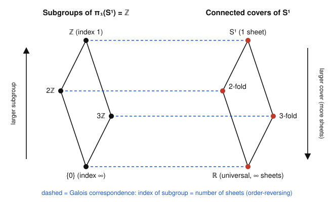

# Algebraic Topology · Lesson 2.3: Deck transformations & the Galois correspondence

> ⏱ ~15 min · Module 2: Covering Spaces & Seifert–van Kampen · Builds on: [Lesson 2.2 (the lifting criterion & classification)](02-02-lifting-criterion-classification.md) · Unlocks: [Lesson 2.4 (free groups & presentations)](02-04-free-groups-presentations.md)

## Why this matters

Lesson 2.2 told you *which* connected covers a space has: one for each subgroup of $\pi_1$. This lesson tells you what those covers **do** — their symmetries. A cover $\tilde X \to X$ has a group of self-symmetries that shuffle the sheets, and that group turns out to be $\pi_1(X)$ (or a quotient of it) staring back at you geometrically. The whole picture is *word-for-word* the Galois correspondence from field theory: covers play the role of intermediate fields, and the symmetry group plays the role of a Galois group. When you later meet the universal cover $\mathbb{R}^2 \to T^2$, or the double cover $SU(2) \to SO(3)$ behind quantum spin, you'll be reading $\pi_1$ off a group of symmetries.

## The idea

Picture the $3$-fold cover of the circle: three loops stacked into one big loop wrapping around three times, projecting down onto $S^1$. Now rotate the big loop by one-third of a turn. Every point lands on a point sitting *over the same base point* — the rotation slides sheet 1 onto sheet 2, sheet 2 onto sheet 3, sheet 3 back to sheet 1, but a fly living on the base circle sees nothing change. That rotation is a **deck transformation**: a symmetry of the total space that is invisible downstairs.

The name is railway-yard slang — the sheets are "decks," and these maps re-stack them. Two facts make them powerful:

- **They are rigid.** A deck transformation is pinned down by where it sends a *single* point (unique lifting from Lessons 2.1–2.2). So the only deck transformation with a fixed point is the identity — the group acts *freely*.
- **They are the fundamental group in disguise.** For the best cover — the universal one — the deck group *is* $\pi_1(X)$, and $X$ is recovered as the orbit space $\tilde X / \pi_1(X)$.

The exact analogy: a field automorphism of $L$ fixing the base field $K$ permutes the roots of a polynomial but doesn't disturb $K$. A deck transformation permutes the sheets over a point but doesn't disturb $X$. "Roots" $\leftrightarrow$ "sheets," "fixes $K$" $\leftrightarrow$ "commutes with $p$." Same theorem, two costumes.

## The formal version

Throughout, $X$ is connected, locally path-connected, and semilocally simply connected (so the classification of Lesson 2.2 applies), $p\colon \tilde X \to X$ is a connected covering, and $x_0 \in X$ with fiber $p^{-1}(x_0)$.

**Definition (deck transformation).** A *deck transformation* (or *covering transformation*) is a homeomorphism $\phi\colon \tilde X \to \tilde X$ with
$$p \circ \phi = p.$$
Under composition these form the **deck group** $\operatorname{Deck}(\tilde X / X)$.

*In words:* a self-homeomorphism of the total space that projects to the identity downstairs — it reshuffles points within each fiber and nothing more.

**Rigidity lemma.** If $\tilde X$ is connected and two deck transformations agree at one point, they are equal. In particular a deck transformation with a fixed point is the identity, so $\operatorname{Deck}(\tilde X/X)$ acts **freely** on $\tilde X$.

*Why:* $\phi$ and $\operatorname{id}_{\tilde X}$ are both lifts of the map $p\colon \tilde X \to X$ through $p$; if they agree at one point, uniqueness of lifts (connected domain) forces them equal. This is exactly the uniqueness half of path/homotopy lifting, applied to the map $p$ itself.

Now the main structural theorem. Let $H = p_*\pi_1(\tilde X, \tilde x_0) \le \pi_1(X, x_0)$ be the subgroup attached to the cover in Lesson 2.2, and let
$$N(H) = \{\, g \in \pi_1(X,x_0) : gHg^{-1} = H \,\}$$
be its **normalizer** (the largest subgroup in which $H$ sits normally).

**Theorem (deck group = normalizer quotient).**
$$\operatorname{Deck}(\tilde X / X) \;\cong\; N(H)/H.$$

*In words:* the symmetries of the cover are measured by how much room $H$ has to be normal — you quotient the normalizer by $H$ itself.

**Definition (regular / normal cover).** The cover is **regular** (or **normal**) if $H \trianglelefteq \pi_1(X,x_0)$. Equivalently, $\operatorname{Deck}$ acts **transitively** on each fiber $p^{-1}(x_0)$ — any sheet can be carried to any other.

For a regular cover $N(H) = \pi_1(X,x_0)$, so the theorem collapses to the clean statement
$$\operatorname{Deck}(\tilde X / X) \;\cong\; \pi_1(X,x_0)\,/\,H.$$

**The universal cover.** Here $\tilde X$ is simply connected, so $H = 1$, hence $N(H) = \pi_1(X)$ and
$$\operatorname{Deck}(\tilde X / X) \;\cong\; \pi_1(X, x_0),$$
acting freely and transitively on every fiber. Consequently $X \cong \tilde X / \pi_1(X)$ as the orbit space of this free action.

**The Galois correspondence.** Assembling this with Lesson 2.2's classification:

| Covering spaces of $X$ | Field extensions of $K$ |
|---|---|
| connected cover $\tilde X_H \to X$ | intermediate field $K \subseteq E \subseteq L$ |
| subgroup $H \le \pi_1(X)$ (up to conjugacy) | subgroup $\operatorname{Gal}(L/E) \le \operatorname{Gal}(L/K)$ |
| **bigger** cover (more sheets) $\leftrightarrow$ **smaller** $H$ | bigger field $E$ $\leftrightarrow$ smaller Galois subgroup |
| number of sheets $= [\pi_1(X) : H]$ | $[E:K] = $ index of the subgroup |
| regular cover ($H \trianglelefteq \pi_1$) | Galois (normal) extension |
| $\operatorname{Deck} \cong \pi_1(X)/H$ | $\operatorname{Gal}(E/K) \cong \operatorname{Gal}(L/K)/\operatorname{Gal}(L/E)$ |
| universal cover ($H = 1$) | algebraic closure / splitting field |
| $\pi_1(X)$ itself | absolute Galois group $\operatorname{Gal}(\bar K / K)$ |

The correspondence is an **order-reversing** bijection between the lattice of connected covers and the lattice of subgroups of $\pi_1$ — the same inclusion-reversing dictionary you met (or will meet) in [abstract-algebra](../../abstract-algebra/syllabus.md). This is not an analogy that happens to rhyme; both are instances of one categorical statement (a $\pi_1$/Galois group classifying "connected covers" of a base).

## Picture

The subgroup lattice of $\pi_1(S^1) = \mathbb{Z}$ beside the lattice of connected covers of $S^1$. Reading a dashed line across gives the correspondence; the two outer arrows point in opposite directions because it is order-reversing.

The bottom subgroup $\{0\}$ (index $\infty$) matches the *biggest* cover $\mathbb{R}$ (the universal cover), while the top subgroup $\mathbb{Z}$ (index $1$) matches the *smallest* cover $S^1$ itself. The subgroup $n\mathbb{Z}$ (index $n$) matches the $n$-fold cover.

## Worked examples

**Example 1 (the $n$-fold cover of $S^1$ — mechanical).** Take $S^1 = \{z \in \mathbb{C} : |z| = 1\}$ and the $n$-fold cover
$$p_n\colon S^1 \to S^1, \qquad p_n(z) = z^n.$$
A deck transformation must be a homeomorphism $\phi$ with $\phi(z)^n = z^n$ for all $z$, i.e. $(\phi(z)/z)^n = 1$, so $\phi(z)/z$ is a locally constant $n$-th root of unity; by connectedness it is a *single* root of unity. Hence
$$\phi_k(z) = \zeta^k z, \qquad \zeta = e^{2\pi i/n}, \quad k = 0, 1, \dots, n-1,$$
rotation by $k/n$ of a turn. Check: $p_n(\phi_k(z)) = (\zeta^k z)^n = \zeta^{kn} z^n = z^n = p_n(z)$. ✓ Composition adds exponents mod $n$, so
$$\operatorname{Deck}(S^1/S^1) \cong \mathbb{Z}/n.$$
Consistency with the theorem: $\pi_1(S^1) = \mathbb{Z}$, the subgroup is $H = n\mathbb{Z}$ (index $n$ = number of sheets ✓, from Lesson 2.2). Since $\mathbb{Z}$ is abelian, $H \trianglelefteq \mathbb{Z}$, so the cover is **regular** and $\operatorname{Deck} \cong \mathbb{Z}/n\mathbb{Z}$ — matching the direct computation. The $n$ rotations act transitively on the $n$ sheets over any base point, as regularity demands.

**Example 2 (the universal cover $\mathbb{R} \to S^1$ — why you'd care).** The exponential cover from Lesson 1.4,
$$p\colon \mathbb{R} \to S^1, \qquad p(t) = e^{2\pi i t} = (\cos 2\pi t,\ \sin 2\pi t),$$
has simply connected total space $\mathbb{R}$, so it is the universal cover. What are its deck transformations? A deck transformation $\phi\colon \mathbb{R} \to \mathbb{R}$ satisfies $e^{2\pi i \phi(t)} = e^{2\pi i t}$, i.e. $\phi(t) - t \in \mathbb{Z}$ for all $t$; being continuous and integer-valued, $\phi(t) - t$ is a *constant* integer $m$. Thus
$$\phi_m(t) = t + m, \qquad m \in \mathbb{Z}$$
— translation by an integer. So
$$\operatorname{Deck}(\mathbb{R}/S^1) \cong \mathbb{Z} \cong \pi_1(S^1),$$
exactly the theorem's promise for a universal cover. The action is free (no translation but $0$ fixes a point) and transitive on the fiber $p^{-1}(1) = \mathbb{Z}$. And the orbit space is the base:
$$S^1 \cong \mathbb{R}/\mathbb{Z}.$$
This is the cleanest possible statement that "$\pi_1(S^1) = \mathbb{Z}$": the integers *are* the deck group of the line unwinding onto the circle, and winding number is which deck translation your lifted loop performs.

## Watch out

- **You might think $\operatorname{Deck} \cong \pi_1(X)$ always** — but that only holds for the *universal* cover (or $\pi_1/H$ for a regular one). In general it is $N(H)/H$, which can be much smaller. For a **non-normal** cover the deck group is *strictly smaller* than the number of sheets; there exist $3$-sheeted covers (of a wedge of two circles, once you have the nonabelian $\pi_1$ of Lesson 2.4) whose deck group is *trivial* — no symmetry can swap the asymmetrically-attached sheets.
- **A deck transformation is not an arbitrary permutation of the fiber.** It is rigid: fixing one point forces it to be the identity everywhere (the rigidity lemma). So $|\operatorname{Deck}|$ divides the number of sheets, with equality **iff** the cover is regular.
- **The correspondence is order-*reversing*.** Bigger subgroup $\leftrightarrow$ smaller cover. The trivial subgroup $\{1\}$ (the smallest) sits opposite the universal cover (the largest). Do not expect "bigger goes with bigger."
- **$p \circ \phi = p$ is the whole definition** — you are *not* asking $\phi$ to commute with anything else, and you are not choosing a basepoint-preserving $\phi$. A generic deck transformation moves the basepoint to another point of its fiber.

## One-liner

> The symmetries of a cover are $N(H)/H$ — and for the universal cover that's all of $\pi_1$, so unwinding a space and reading off its self-symmetries *is* the Galois correspondence.

## Problems

**P1 (🟢)** Consider the $6$-fold cover $p_6\colon S^1 \to S^1$, $z \mapsto z^6$. (a) Name its deck group and say whether the cover is regular. (b) Identify the subgroup $H \le \mathbb{Z} = \pi_1(S^1)$ it corresponds to, and confirm $\operatorname{Deck} \cong \pi_1/H$. (c) List all connected covers of $S^1$ *through which $p_6$ factors* (the covers "between" $S^1$ and the $6$-fold cover), and match them to the divisors of $6$. Name the field-theory statement this mirrors.

**P2 (🟡)** Prove the rigidity lemma directly: if $\tilde X$ is connected and $\phi \in \operatorname{Deck}(\tilde X / X)$ fixes some point $\tilde x$, then $\phi = \operatorname{id}_{\tilde X}$. (Use uniqueness of lifts. Then explain in one line why this forces the deck group to act freely.)

**P3 (🔴, optional)** Let $p\colon \mathbb{R}^2 \to T^2 = \mathbb{R}^2/\mathbb{Z}^2$ be the standard universal cover of the torus, $p(x,y) = (e^{2\pi i x}, e^{2\pi i y})$. (a) Compute $\operatorname{Deck}(\mathbb{R}^2/T^2)$. (b) Explain why *every* connected cover of $T^2$ is regular. (c) State the orbit-space description of $T^2$ this gives, and name the object it produces in [differential-geometry](../../differential-geometry/syllabus.md).

Solutions

**P1** (a) By exactly Example 1 with $n = 6$, the deck transformations are the rotations $\phi_k(z) = \zeta^k z$ with $\zeta = e^{2\pi i/6}$, so $\operatorname{Deck}(S^1/S^1) \cong \mathbb{Z}/6$. Since $\pi_1(S^1) = \mathbb{Z}$ is abelian, the corresponding subgroup is automatically normal, so the cover is **regular**.

(b) The subgroup is $H = 6\mathbb{Z}$ (index $6$ = the number of sheets). Then $\pi_1/H = \mathbb{Z}/6\mathbb{Z} \cong \mathbb{Z}/6 = \operatorname{Deck}$. ✓

(c) $p_6$ factors through a cover $\tilde X_K \to S^1$ exactly when $6\mathbb{Z} \le K \le \mathbb{Z}$, i.e. $K = d\mathbb{Z}$ with $d \mid 6$. The divisors are $d \in \{1, 2, 3, 6\}$, giving the $d$-fold covers: $d=1$ is $S^1$ itself, $d=2$ and $d=3$ the double and triple covers, $d=6$ the cover $p_6$. So the intermediate covers correspond bijectively to the divisors of $6$ (order-reversed: larger $d\mathbb{Z}$ = larger index divisor... precisely, $d\mathbb{Z} \subseteq d'\mathbb{Z} \iff d' \mid d$). This mirrors the intermediate fields of a **degree-$6$ cyclic Galois extension**, which likewise correspond to the divisors of $6$ (the subgroup lattice of $\mathbb{Z}/6$) — the classical Galois correspondence for $\operatorname{Gal} \cong \mathbb{Z}/6$.

**P2** $\phi$ is a lift of the map $p\colon \tilde X \to X$ through the cover $p$ (meaning $p \circ \phi = p$). The identity $\operatorname{id}_{\tilde X}$ is *also* such a lift, since $p \circ \operatorname{id} = p$. Both lifts agree at the point $\tilde x$ (by hypothesis $\phi(\tilde x) = \tilde x = \operatorname{id}(\tilde x)$). The uniqueness of lifts for a connected domain (Lesson 2.1–2.2: two lifts of the same map agreeing at one point agree everywhere) gives $\phi = \operatorname{id}_{\tilde X}$. $\blacksquare$

Freeness: if a group element (deck transformation) fixed any point it would be forced to be the identity, so no non-identity element has a fixed point — which is the definition of a free action.

**P3** (a) The cover is a product of two copies of $\mathbb{R} \to S^1$, so its deck transformations are pairs of integer translations: $\phi_{(m,n)}(x,y) = (x+m, y+n)$. Directly: $\phi$ must satisfy $\phi(x,y) - (x,y) \in \mathbb{Z}^2$ everywhere, and continuity + integrality make it a constant vector $(m,n) \in \mathbb{Z}^2$. Hence
$$\operatorname{Deck}(\mathbb{R}^2/T^2) \cong \mathbb{Z}^2 \cong \pi_1(T^2),$$
as it must be for a universal cover ($\mathbb{R}^2$ is simply connected).

(b) $\pi_1(T^2) \cong \mathbb{Z}^2$ is abelian, and *every* subgroup of an abelian group is normal. By the theorem, a cover is regular iff its subgroup $H \trianglelefteq \pi_1$; here that holds for all $H$. So every connected cover of $T^2$ is regular.

(c) Since the universal cover realizes the base as the orbit space of the free deck action,
$$T^2 \cong \mathbb{R}^2 / \mathbb{Z}^2,$$
the quotient of the plane by the integer translation lattice. Geometrically this is the **flat torus** — the plane's Euclidean metric descends to the quotient because the deck group acts by isometries. (In differential-geometry this is the model flat compact surface; the deck lattice $\mathbb{Z}^2$ is what makes it compact with zero curvature.)

## Flashback

**From Lesson 2.2 (the lifting criterion & classification):** A connected cover $p\colon (\tilde X, \tilde x_0) \to (X, x_0)$ has $H := p_*\pi_1(\tilde X, \tilde x_0)$ of index $4$ in $\pi_1(X, x_0)$. (a) How many sheets does the cover have? (b) A based map $f\colon (Y, y_0) \to (X, x_0)$ with $Y$ path-connected and locally path-connected satisfies $f_*\pi_1(Y, y_0) \subseteq H$ — does $f$ lift to $\tilde f\colon (Y, y_0) \to (\tilde X, \tilde x_0)$? (c) If $Y = S^1$ and $f$ is a loop representing $g \in \pi_1(X, x_0)$ with $g \notin H$, does $f$ lift to a *loop* in $\tilde X$ (based at $\tilde x_0$)?

Solution

(a) The number of sheets equals the index $[\pi_1(X,x_0) : H] = 4$.

(b) Yes. The **lifting criterion** says a lift $\tilde f$ (with $\tilde f(y_0) = \tilde x_0$) exists iff $f_*\pi_1(Y,y_0) \subseteq p_*\pi_1(\tilde X, \tilde x_0) = H$, given $Y$ path-connected and locally path-connected. The hypothesis is exactly that inclusion, so the lift exists (and is unique).

(c) No. A loop $f$ lifts to a *path* $\tilde f$ starting at $\tilde x_0$ (path lifting always works), and that path closes up into a loop iff its class lies in $H$: the endpoint $\tilde f(1)$ equals $\tilde x_0$ precisely when $[f] = g \in H$. Since $g \notin H$, the lift ends on a *different* sheet — it is a path, not a loop. (This is the monodromy action of $\pi_1(X)$ permuting the $4$ sheets; the coset $gH$ tells you which sheet you land on.)

## Connections

- **Backward:** This refines Lesson 2.2. There a cover was pinned to a subgroup $H = p_*\pi_1(\tilde X)$; here its *symmetries* come out as $N(H)/H$, and the rigidity behind it all is the uniqueness-of-lifts from [Lesson 2.1](02-01-covering-spaces-lifting.md). The universal cover of Lesson 2.2 now carries a free $\pi_1$-action.
- **Forward:** [Lesson 2.4](02-04-free-groups-presentations.md) builds free groups by letting $\pi_1(\bigvee S^1)$ act as the deck group of a tree (the universal cover of a wedge of circles); regular covers and orbit spaces reappear in [Lesson 2.6](02-06-van-kampen-in-the-wild.md) and throughout homology.
- **Sideways (abstract-algebra):** This *is* the Galois correspondence — $\operatorname{Deck}(\tilde X/X) \leftrightarrow \operatorname{Gal}(E/K)$, regular cover $\leftrightarrow$ normal extension, universal cover $\leftrightarrow$ algebraic closure, and $\pi_1(X) \leftrightarrow$ the absolute Galois group. The subgroup-lattice $\leftrightarrow$ intermediate-object dictionary is one theorem wearing two hats; see [abstract-algebra](../../abstract-algebra/syllabus.md).
- **Sideways (differential-geometry / physics):** Realizing $X = \tilde X/\pi_1(X)$ as an orbit space of a free, isometric action is how flat and hyperbolic manifolds are built (the flat torus $\mathbb{R}^2/\mathbb{Z}^2$ of P3); the double cover $SU(2) \to SO(3)$, deck group $\mathbb{Z}/2$, is the topological source of spin. The orbit-space topology here is the quotient topology from [topology](../../topology/syllabus.md).
