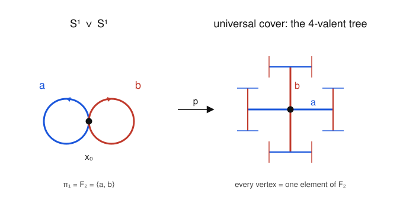

# Algebraic Topology · Lesson 2.4: Free groups & presentations

> ⏱ ~15 min · Module 2: Covering Spaces & Seifert–van Kampen · Builds on: [Lesson 2.3](02-03-deck-transformations-galois.md), [Lesson 1.4](01-04-pi1-of-the-circle.md) · Unlocks: [Lesson 2.5](02-05-seifert-van-kampen.md)

## Why this matters

Seifert–van Kampen (next lesson) is going to hand you a fundamental group as a **presentation** — a list of generators and equations they satisfy — and leave you to figure out *which group that is*. The genus-2 surface will arrive as $\langle a_1,b_1,a_2,b_2 \mid [a_1,b_1][a_2,b_2]\rangle$; a wedge of two circles as $\langle a,b\mid\;\rangle$. Before we can compute, we need the language: what a **free group** is (the group with no relations, the one with maximal room to move), and what it means to impose relations by taking a quotient. This is also the exact spot where covering spaces and abstract algebra fuse — the wedge of circles has $\pi_1$ free, and its universal cover is the group drawn as a graph.

## The idea

Start with an alphabet $S$ — say $\{a,b\}$. The **free group** on $S$ is the group of all *words* you can spell using the letters and their formal inverses $a^{-1},b^{-1}$, with the only rule being the one you can't avoid: a letter next to its own inverse annihilates ($a a^{-1}$ vanishes). Multiply words by writing one after the other and cancelling. There are **no other relations** — $ab \neq ba$, $a^2\neq e$, nothing collapses that isn't forced by the group axioms. It is the group with the fewest coincidences possible on those generators; that emptiness is exactly what makes it "free."

A **presentation** builds every other group by starting from a free group and then *forcing* extra equations. Want $a$ and $b$ to commute? Declare the word $aba^{-1}b^{-1}$ equal to the identity and quotient it away. Want $a^n=e$? Kill the word $a^n$. The generators live in the free group; the relations are words you set to $1$. Almost every group you meet — cyclic, dihedral, the surface groups — is "the free group on these letters, modulo these equations."

The topological punchline: the free group on $n$ letters is literally the fundamental group of a **wedge of $n$ circles**, and unwinding that wedge (its universal cover) draws the free group as an infinite tree.

## The formal version

**Reduced words.** Fix a set $S$. Let $S^{-1}=\{s^{-1}:s\in S\}$ be a disjoint set of formal inverses. A **word** is a finite string of symbols from $S\cup S^{-1}$; the empty string is allowed. A word is **reduced** if it never contains $ss^{-1}$ or $s^{-1}s$ as adjacent letters. Every word reduces to a *unique* reduced word by deleting such pairs (uniqueness is the one thing that takes a proof — the deletions can be done in any order and always land in the same place).

**Definition (free group).** The **free group** $F(S)$ on $S$ is the set of reduced words, with product = "concatenate, then reduce," identity = empty word $e$, and inverse = reverse the string and flip every letter's sign. When $S=\{s_1,\dots,s_n\}$ we write $F_n$.

*In words:* $F(S)$ is "all the strings you can form from the letters and their inverses, with nothing cancelling except a letter meeting its own inverse."

**Theorem (universal property).** For every group $G$ and every set map $\varphi\colon S\to G$, there is a **unique** group homomorphism $\Phi\colon F(S)\to G$ with $\Phi(s)=\varphi(s)$ for all $s\in S$. Explicitly, $\Phi(s_1^{\varepsilon_1}\cdots s_k^{\varepsilon_k})=\varphi(s_1)^{\varepsilon_1}\cdots\varphi(s_k)^{\varepsilon_k}$ (each $\varepsilon_i=\pm1$).

*In words:* to build a homomorphism *out of* a free group you just say where the generators go — **anywhere you like** — and everything else is forced, with no consistency conditions to check. That freedom of choice is what "free" names.

This property *characterizes* $F(S)$: any two groups equipped with a map from $S$ that both satisfy it are canonically isomorphic. (Given two such, $F,F'$, the property produces homomorphisms $F\to F'$ and $F'\to F$ fixing $S$; their composites fix $S$, so by the *uniqueness* clause they are the identities. Hence the maps are inverse isomorphisms.) So we may *define* the free group by the universal property and never mention words again — this is the abstract-algebra notion of a **free object**, the left adjoint to "forget the group structure."

**Normal closure.** For a subset $R\subseteq F(S)$, the **normal closure** $\langle\!\langle R\rangle\!\rangle$ is the smallest normal subgroup of $F(S)$ containing $R$ — equivalently, the subgroup generated by *all* conjugates $w r w^{-1}$ with $w\in F(S)$, $r\in R$. We must conjugate because we want the relations to hold everywhere, not just where they were written; only a *normal* subgroup gives a quotient group.

**Definition (presentation).** Given a set $S$ (**generators**) and a set $R\subseteq F(S)$ (**relators**),
$$\langle S \mid R\rangle \;=\; F(S)\,/\,\langle\!\langle R\rangle\!\rangle.$$
A group $G$ **has** this presentation if $G\cong\langle S\mid R\rangle$. Setting a relator $r$ to $1$ in the quotient is the same as imposing the equation "$r=e$"; we often list relators as equations (write $aba^{-1}b^{-1}$ or, equivalently, "$ab=ba$").

*In words:* a presentation is "the freest group on these generators, then crushed by exactly the equations you demand — and their consequences."

**Examples.**

- $\mathbb{Z}=\langle a\mid\;\rangle=F(\{a\})=F_1$. One generator, no relations: the reduced words are $\dots,a^{-2},a^{-1},e,a,a^2,\dots$, which is $\mathbb{Z}$ under addition of exponents.
- $\mathbb{Z}/n=\langle a\mid a^n\rangle$. Kill $a^n$: the powers of $a$ now cycle with period $n$.
- $\mathbb{Z}^2=\langle a,b\mid aba^{-1}b^{-1}\rangle=\langle a,b\mid [a,b]\rangle$. The single relator forces $ab=ba$; once the two generators commute, every word rearranges to $a^m b^n$, i.e. $\mathbb{Z}^2$ (proved in P2). This is $F_2$'s **abelianization**.
- $F_2=\langle a,b\mid\;\rangle$. No relations: the free group on two letters, nonabelian and infinite.

**Topological anchor.** Let $\bigvee_n S^1$ be the **wedge of $n$ circles** ($n$ circles glued at one point). Then
$$\pi_1\!\Big(\textstyle\bigvee_n S^1\Big)\;\cong\;F_n,$$
one free generator per circle (each loop that goes once around the $i$-th circle). Its **universal cover** is the infinite **$2n$-valent tree** — a graph with no loops in which every vertex meets $2n$ edges (one for $a_i$ and one for $a_i^{-1}$, each direction). For $n=2$ the tree is $4$-valent, and it is exactly the **Cayley graph of $F_2$**: vertices are elements of $F_2$, and each edge multiplies by a generator. Because the cover is universal ($H=1$, trivially normal), Lesson 2.3 says its deck group is all of $\pi_1$: $F_2$ acts freely on the tree, and the vertices *are* the group. Tree = group, drawn.

**A warning to file away.** The **word problem** — given a presentation, decide whether a word equals the identity — is *algorithmically unsolvable* in general (Novikov–Boone). For a *free* group it's trivial (just reduce and check for the empty word); presentations are a compact language, not a decision procedure.

## Picture

On the left, $S^1\vee S^1$: two loops $a,b$ at the basepoint $x_0$, and $\pi_1=F_2$. On the right, a piece of the covering tree: from any vertex, one edge in each of four directions — blue for $a^{\pm1}$, red for $b^{\pm1}$. There are **no cycles**, matching "no relations": the only way a product of generators returns you to the start is if it cancels to the empty word. A relation like $ab=ba$ would demand a square (a loop) in this graph — and the tree has none.

## Worked examples

**Example 1 — a homomorphism out of $F_2$, free of charge.** Define $\Phi\colon F_2=F(\{a,b\})\to S_3$ (the symmetric group on $\{1,2,3\}$) by the *set map* $a\mapsto (1\,2)$, $b\mapsto (2\,3)$. The universal property says: this extends to a homomorphism, **uniquely, with nothing to verify** — because $F_2$ has no relations, there is no relator whose image we must check is trivial. For instance
$$\Phi(ab)=(1\,2)(2\,3)=(1\,2\,3),\qquad \Phi(a b a^{-1})=(1\,2)(2\,3)(1\,2)=(1\,3).$$
Since $(1\,2)$ and $(2\,3)$ generate $S_3$, $\Phi$ is onto. Its kernel $K$ is a normal subgroup of $F_2$ with $F_2/K\cong S_3$ — so $S_3$ *has a presentation* obtained by choosing generators of $K$ as relators. That is exactly the maneuver in Example 2.

**Example 2 — reading a presentation: it's the dihedral group.** Claim: for $n\ge2$,
$$\langle a,b \mid a^2,\;b^2,\;(ab)^n\rangle \;\cong\; D_n,$$
the dihedral group of symmetries of a regular $n$-gon, of order $2n$. Here $a,b$ are two reflections and $r:=ab$ is a rotation.

*Step 1 — build a surjection onto $D_n$.* Let $D_n=\langle \rho,\sigma\rangle$ with $\rho$ a rotation by $2\pi/n$ (order $n$) and $\sigma$ a reflection (order $2$), satisfying $\sigma\rho\sigma^{-1}=\rho^{-1}$. Take the two reflections $\sigma$ and $\sigma\rho$. By the universal property define $\Phi\colon F_2\to D_n$, $a\mapsto\sigma$, $b\mapsto\sigma\rho$. Check the relators die: $\Phi(a^2)=\sigma^2=e$; $\Phi(b^2)=(\sigma\rho)^2=\sigma\rho\sigma\rho=(\sigma\rho\sigma^{-1})\rho=\rho^{-1}\rho=e$; and $\Phi(ab)=\sigma\cdot\sigma\rho=\rho$, so $\Phi((ab)^n)=\rho^n=e$. Every relator maps to $e$, so $\langle\!\langle a^2,b^2,(ab)^n\rangle\!\rangle\subseteq\ker\Phi$ and $\Phi$ **descends** to a homomorphism $\bar\Phi\colon\langle a,b\mid a^2,b^2,(ab)^n\rangle\to D_n$. It is onto because $\sigma=\Phi(a)$ and $\rho=\Phi(ab)$ already generate $D_n$.

*Step 2 — the presented group has at most $2n$ elements.* Call it $G=\langle a,b\mid a^2,b^2,(ab)^n\rangle$. In $G$, $a^2=b^2=e$, so $a^{-1}=a$ and $b^{-1}=b$: every element is a word in $a,b$ with no inverses and no repeats, i.e. an alternating string $ababab\cdots$ or $babab\cdots$. Writing $r=ab$, any such string is $r^k$ or $r^k a$ for some integer $k$ (e.g. $ba=(ab)^{-1}=r^{-1}$, $aba=r a$). The relation $(ab)^n=e$ makes $r^n=e$, so $k$ ranges over $\{0,1,\dots,n-1\}$. Hence $G=\{r^k, r^k a: 0\le k<n\}$ has **at most $2n$** elements.

*Step 3 — squeeze.* We have a surjection $\bar\Phi\colon G\twoheadrightarrow D_n$ with $|G|\le 2n=|D_n|$. A surjection between finite sets with $|G|\le|D_n|$ forces $|G|=2n$ and $\bar\Phi$ **bijective**, hence an isomorphism. So $G\cong D_n$. $\blacksquare$

The moral: to *identify* a presentation, map it onto a group you recognize (that shows the presented group is at least that big), then bound the presented group from above by pushing the relations around (that shows it's no bigger). This exact two-sided pinch is how you cash out every van Kampen computation.

## Watch out

- **Relations vs. relators.** A *relation* is an equation $u=v$; the corresponding *relator* is the single word $uv^{-1}$ you set to $1$. "$ab=ba$" and "$aba^{-1}b^{-1}$" say the same thing. Don't list "$ab=ba$" as if it were two things.
- **You must take the *normal* closure, not just the subgroup generated.** Killing $R$ has to kill every conjugate $wRw^{-1}$ too — a relation is meant to hold throughout the group. Quotienting by the plain subgroup $\langle R\rangle$ usually isn't even legal (it needn't be normal), and would give the wrong group.
- **"Free" is not "abelian," and it's not "small."** You might think the free group is some tidy canonical thing like $\mathbb{Z}^n$ — but $F_n$ for $n\ge2$ is nonabelian, and (P3) even contains free subgroups of *infinite* rank. Free means *no imposed relations*, i.e. maximally floppy, not simple.
- **Different presentations, same group.** $\langle a\mid a\rangle$, $\langle a,b\mid a, b\rangle$, and $\langle\;\mid\;\rangle$ all present the trivial group. A presentation names a group; it is not a normal form for it. (This is the shadow of the unsolvable word/isomorphism problem.)

## One-liner

> A free group is a group of words with nothing cancelling that the axioms don't force; every other group is a free group with equations imposed by quotienting out the normal closure of some relators.

## Problems

**P1 (🟢)** (a) Reduce the word $w=a\,b\,b^{-1}\,a\,b\,a^{-1}\,a$ in $F_2=F(\{a,b\})$. (b) By the universal property there is a unique homomorphism $\Phi\colon F_2\to\mathbb{Z}$ with $a\mapsto 1$, $b\mapsto 1$ (the total exponent sum). Compute $\Phi(w)$, and confirm you get the same value from the reduced word — explaining in one line why the universal property *guarantees* that agreement.

**P2 (🟡)** Prove $\langle a,b\mid aba^{-1}b^{-1}\rangle\cong\mathbb{Z}^2$. (Suggested route: use the universal property to build a surjection $\langle a,b\mid[a,b]\rangle\to\mathbb{Z}^2$, then show every element of the presented group can be written $a^mb^n$, and that this form is unique because the map detects $(m,n)$.)

**P3 (🔴, optional)** Show that $F_2$ contains a subgroup isomorphic to a free group of **infinite** rank. Concretely, prove the elements $c_n:=a^{n}\,b\,a^{-n}$ for $n\in\mathbb{Z}$ freely generate a subgroup (no nontrivial reduced word in the $c_n$ is trivial in $F_2$). *(Topological echo: these $c_n$ live in $\ker(F_2\to\mathbb{Z})$; by the covering dictionary of Lesson 2.3 that kernel is the $\pi_1$ of an infinite cover of $S^1\vee S^1$ — a line carrying infinitely many loops. The solution pins down the right map.)*

Solutions

**P1** (a) Delete adjacent inverse pairs left to right: $a\,\underline{b\,b^{-1}}\,a\,b\,a^{-1}\,a \to a\,a\,b\,\underline{a^{-1}\,a} \to a\,a\,b = a^2b$. Reduced word: $\boxed{a^2 b}$.

(b) On the original word, $\Phi$ sums the exponents: $+1(a)+1(b)-1(b^{-1})+1(a)+1(b)-1(a^{-1})+1(a)=3$. On the reduced word $a^2b$: $1+1+1=3$. They agree. Why they must: $\Phi$ is a well-defined homomorphism on $F_2$, whose elements *are* reduced words; a word and its reduction represent the **same element** of $F_2$ (reduction only cancels $ss^{-1}$, which the axioms already equate with $e$), so $\Phi$ takes one value there. Equivalently, each cancelled pair $ss^{-1}$ contributes $\Phi(s)\Phi(s)^{-1}=0$ to the sum.

**P2** Write $G=\langle a,b\mid [a,b]\rangle$ with $[a,b]=aba^{-1}b^{-1}$, and let $q\colon F_2\to G$ be the quotient map.

*Surjection to $\mathbb{Z}^2$.* By the universal property of $F_2$, the set map $a\mapsto(1,0)$, $b\mapsto(0,1)$ extends to $\psi\colon F_2\to\mathbb{Z}^2$. Since $\mathbb{Z}^2$ is abelian, $\psi([a,b])=(1,0)+(0,1)-(1,0)-(0,1)=(0,0)$, so $[a,b]\in\ker\psi$, hence $\langle\!\langle[a,b]\rangle\!\rangle\subseteq\ker\psi$ and $\psi$ descends to $\bar\psi\colon G\to\mathbb{Z}^2$ with $\bar\psi(q(a))=(1,0)$, $\bar\psi(q(b))=(0,1)$. It is onto since $(1,0),(0,1)$ generate $\mathbb{Z}^2$.

*Every element of $G$ is $a^m b^n$.* In $G$ the relation gives $ab=ba$, and taking inverses/conjugates, $a^{-1}b=ba^{-1}$, $ab^{-1}=b^{-1}a$, etc. — $a^{\pm1}$ and $b^{\pm1}$ commute past each other. So any word can have all its $a$'s shuffled to the front and all its $b$'s to the back, collecting exponents: every element of $G$ equals $a^m b^n$ for some $m,n\in\mathbb{Z}$.

*Injectivity of $\bar\psi$.* $\bar\psi(a^m b^n)=(m,n)$. If $a^m b^n\in\ker\bar\psi$ then $(m,n)=(0,0)$, so $a^m b^n=e$ in $G$. Thus $\ker\bar\psi$ is trivial and $\bar\psi$ is injective. Combined with surjectivity, $\bar\psi\colon G\xrightarrow{\ \cong\ }\mathbb{Z}^2$. $\blacksquare$ (The normal form $a^mb^n$ with $\mathbb{Z}^2$-detected exponents is what pins the group down to $\mathbb{Z}^2$ and not something larger.)

**P3** The clean map is $\pi\colon F_2\to\mathbb{Z}$, $a\mapsto1$, $b\mapsto0$ (exponent sum of $a$ only). Then $\pi(c_n)=n\cdot 1+0-n\cdot1=0$, so every $c_n\in K:=\ker\pi$; the claim is that the $c_n$ freely generate a subgroup (which in fact equals $K$, though we only need freeness).

Take a nonempty reduced word in the $c_n$'s: $W=c_{n_1}^{\varepsilon_1}c_{n_2}^{\varepsilon_2}\cdots c_{n_k}^{\varepsilon_k}$ with each $\varepsilon_i=\pm1$, where "reduced" means we never have $n_i=n_{i+1}$ with $\varepsilon_i=-\varepsilon_{i+1}$ (that would be a $c_n c_n^{-1}$ cancellation). Substitute $c_n^{\varepsilon}=a^{n}b^{\varepsilon}a^{-n}$:
$$W=a^{n_1}b^{\varepsilon_1}a^{-n_1}\,a^{n_2}b^{\varepsilon_2}a^{-n_2}\cdots=a^{n_1}\,b^{\varepsilon_1}\,a^{\,n_2-n_1}\,b^{\varepsilon_2}\,a^{\,n_3-n_2}\cdots b^{\varepsilon_k}\,a^{-n_k}.$$
Now reduce *in $F_2$*. The letters $b^{\pm1}$ never cancel against $a$-powers. The only possible cancellation is between two consecutive $b^{\varepsilon_i}$ and $b^{\varepsilon_{i+1}}$, and that can happen **only if the $a$-power between them is empty**, i.e. $n_{i+1}-n_i=0$, i.e. $n_{i+1}=n_i$ — and then they cancel only if $\varepsilon_{i+1}=-\varepsilon_i$. But that is precisely the forbidden case excluded by reducedness. Hence no $b$ cancels: the fully reduced form of $W$ still contains all $k\ge1$ of the letters $b^{\varepsilon_i}$, so $W\ne e$ in $F_2$.

Therefore no nontrivial reduced word in the $c_n$ is trivial: the $\{c_n\}_{n\in\mathbb{Z}}$ freely generate a subgroup $\cong F_\infty$. In particular the rank-2 free group $F_2$ contains free subgroups of every rank, including infinite rank. $\blacksquare$

(Topology: $K=\ker\pi$ is the subgroup corresponding, via Lesson 2.3's Galois dictionary, to the connected cover of $S^1\vee S^1$ with deck group $F_2/K\cong\mathbb{Z}$ — an infinite "ladder": a line built from the $a$-loop's copies, with a $b$-loop $c_n$ attached at each integer. Its $\pi_1$ is free on those loops, matching $F_\infty$.)

## Flashback

**From Lesson 2.3 (Deck transformations & the Galois correspondence).** Let $X=S^1\vee S^1$, so $\pi_1(X,x_0)\cong F_2=\langle a,b\rangle$.

(a) The universal cover of $X$ is the 4-valent tree $T$ shown above. Using the correspondence "connected cover $\leftrightarrow$ subgroup $H=p_*\pi_1$, with deck group $N(H)/H$ and regularity $\Leftrightarrow$ $H\trianglelefteq\pi_1$," identify the deck transformation group of $T\to X$ and say why the cover is regular.

(b) Let $H=\ker\!\big(F_2\to\mathbb{Z}/2\big)$ where both generators map to the nontrivial element $1$. Is the corresponding cover regular? How many sheets does it have, and what is its deck group?

Solution

(a) The universal cover has $H=p_*\pi_1(T)=1$ (a tree is simply connected). The trivial subgroup is normal in any group, so the cover is **regular**. Its deck group is $N(H)/H=N(1)/1=F_2/1\cong\mathbf{F_2}$. Concretely $F_2$ acts freely and transitively on the vertices of $T$ — the tree is the Cayley graph, and "deck group of the universal cover $=$ the whole fundamental group" is the top of the subgroup–cover lattice.

(b) $H=\ker(F_2\to\mathbb{Z}/2)$ is a kernel, hence **normal**, so the cover is regular. Its index is $[F_2:H]=|\operatorname{im}|=|\mathbb{Z}/2|=2$, so the cover has **2 sheets**. The deck group is $N(H)/H=F_2/H\cong\mathbb{Z}/2$. (Geometrically: the connected double cover of the figure-eight in which a loop lifts to a closed loop iff its total exponent sum $|a|+|b|$ is even.)

## Connections

- **Backward:** This turns [Lesson 2.3](02-03-deck-transformations-galois.md)'s slogan "deck group of the universal cover $=\pi_1$" into a picture: for $S^1\vee S^1$ that group is $F_2$ and the universal cover is its Cayley tree. The exponent-sum maps used here are the same "$\pi_1(S^1)\cong\mathbb{Z}$ counts winding" idea from [Lesson 1.4](01-04-pi1-of-the-circle.md), one circle at a time.
- **Forward:** [Lesson 2.5](02-05-seifert-van-kampen.md) computes $\pi_1$ of a union and delivers the answer *as a presentation* (a pushout / amalgamated free product of groups); [Lesson 2.6](02-06-van-kampen-in-the-wild.md) reads off surface groups like $\langle a_1,b_1,a_2,b_2\mid[a_1,b_1][a_2,b_2]\rangle$. The Example-2 "surject then bound" trick is your identification tool there.
- **Sideways ([abstract-algebra](../../abstract-algebra/syllabus.md)):** free groups are the **free objects** on a set, defined by the universal property (left adjoint to the forgetful functor); presentations are quotients by the **normal closure** of relators — the group-theoretic version of "generators and relations" you'll also meet for modules and algebras. The word problem's unsolvability is a landmark of combinatorial group theory.
