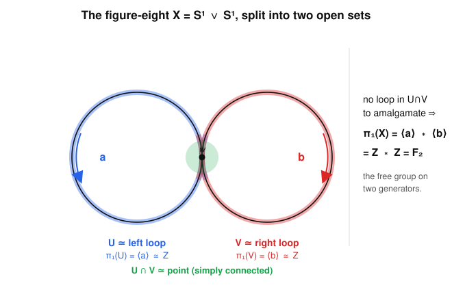
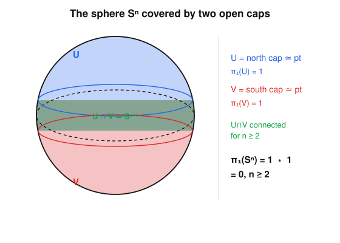

# Algebraic Topology · Lesson 2.5: Seifert–van Kampen

> ⏱ ~15 min · Module 2: Covering Spaces & Seifert–van Kampen · Builds on: [2.4 Free groups & presentations](02-04-free-groups-presentations.md), [1.4 $\pi_1(S^1)\cong\mathbb{Z}$](01-04-pi1-of-the-circle.md) · Unlocks: [2.6 Van Kampen in the wild](02-06-van-kampen-in-the-wild.md)

## Why this matters

So far you can compute exactly one fundamental group, $\pi_1(S^1)\cong\mathbb{Z}$, and everything else by deforming down to a circle. That runs out fast: a wedge of two circles, a surface, a knot complement — none of these retract to a single loop. Seifert–van Kampen is the assembly rule. It says $\pi_1$ of a space you built by *gluing* is determined by the $\pi_1$'s of the pieces and how they overlap — the same "cut it into computable chunks" strategy you'll later see as Mayer–Vietoris for homology ([4.2](04-02-mayer-vietoris.md)). This one theorem is what turns "draw a cell structure" into "read off a group presentation," and it is where topology hands you back a genuinely algebraic object: a [pushout](../../abstract-algebra/syllabus.md) of groups.

## The idea

Cut your space $X$ into two open overlapping pieces $U$ and $V$. Any loop in $X$ can be chopped into finitely many sub-arcs, each living entirely inside $U$ or inside $V$ (that is what "open cover" buys you). So every loop is a *word* in loops-of-$U$ and loops-of-$V$: $\pi_1(X)$ is generated by the generators of $\pi_1(U)$ and $\pi_1(V)$ thrown together.

What are the relations? Two kinds. First, whatever relations already held inside $\pi_1(U)$ and inside $\pi_1(V)$. Second — the only genuinely new idea — a loop that sits in the *overlap* $U\cap V$ can be read two ways: as an element of $\pi_1(U)$, or as an element of $\pi_1(V)$. In $X$ these are the same loop, so we must **declare them equal**. That single family of relations, "glue the two copies of each overlap-loop," is the whole content. Algebraically it is the *amalgamated free product*: free-multiply the two groups, then amalgamate (identify) along the overlap.

Two clean regimes fall out immediately, and they cover most computations you'll ever do:

- **Overlap simply connected** ($\pi_1(U\cap V)=1$): there are no overlap-loops to glue, so you get the plain **free product** $\pi_1(U)*\pi_1(V)$. This is why $\pi_1$ of a wedge of two circles is $\mathbb{Z}*\mathbb{Z}=F_2$.
- **One piece simply connected** ($\pi_1(V)=1$): $V$ contributes no generators, so its only effect is to *kill* the overlap-loops — each loop of $U\cap V$, pushed into $\pi_1(U)$, is now set equal to the trivial loop it becomes in $V$. Gluing a disk onto a space imposes exactly one relation. This is how attaching cells writes down relations, and how $\pi_1(S^n)=0$ for $n\ge2$.

## The formal version

Let $X=U\cup V$ with $U,V$ **open**, and suppose $U$, $V$, and $U\cap V$ are all **path-connected** and contain the basepoint $x_0$. Write the four inclusion-induced maps
$$
\pi_1(U\cap V)\xrightarrow{\;i_*\;}\pi_1(U),\qquad
\pi_1(U\cap V)\xrightarrow{\;j_*\;}\pi_1(V),
$$
and let $k_*\colon\pi_1(U)\to\pi_1(X)$, $\ell_*\colon\pi_1(V)\to\pi_1(X)$ be induced by $U,V\hookrightarrow X$.

**Theorem (Seifert–van Kampen).** The map from the *amalgamated free product* induced by $k_*,\ell_*$,
$$
\Phi\colon\ \pi_1(U,x_0)\ *_{\pi_1(U\cap V,\,x_0)}\ \pi_1(V,x_0)\ \xrightarrow{\ \cong\ }\ \pi_1(X,x_0),
$$
is an isomorphism.

*In words:* $\pi_1(X)$ is built from the two pieces' groups by identifying, for every overlap loop $\gamma$, its image $i_*(\gamma)$ coming from $U$ with its image $j_*(\gamma)$ coming from $V$ — nothing more, nothing less.

**Unpacking the amalgamated free product** (the [abstract-algebra](../../abstract-algebra/syllabus.md) object). Given groups $A,B$ and a group $C$ with homomorphisms $C\xrightarrow{i}A$, $C\xrightarrow{j}B$, define
$$
A*_C B\ :=\ (A*B)\big/\big\langle\!\big\langle\, i(c)\,j(c)^{-1}\ :\ c\in C\,\big\rangle\!\big\rangle,
$$
the free product $A*B$ (from [2.4](02-04-free-groups-presentations.md)) modulo the normal subgroup generated by all $i(c)j(c)^{-1}$. It is the **pushout** of $A\leftarrow C\rightarrow B$: the most efficient group receiving compatible maps from $A$ and $B$ that agree on $C$.

**Presentation form** (how you actually compute). If $\pi_1(U)=\langle S_U\mid R_U\rangle$ and $\pi_1(V)=\langle S_V\mid R_V\rangle$, and $\pi_1(U\cap V)$ is generated by loops $\gamma_1,\dots,\gamma_m$, then
$$
\pi_1(X)=\big\langle\, S_U\sqcup S_V \ \big|\ R_U,\ R_V,\ i_*(\gamma_1)=j_*(\gamma_1),\ \dots,\ i_*(\gamma_m)=j_*(\gamma_m)\,\big\rangle.
$$

*In words:* pool the generators, keep both relation sets, and add one relation per generator of the overlap group, equating its two readings.

The two special cases restated:
- If $\pi_1(U\cap V)=1$ there are no $\gamma_k$, so $\pi_1(X)=\pi_1(U)*\pi_1(V)$ (**free product**).
- If $\pi_1(V)=1$, then $S_V,R_V$ are empty and $j_*(\gamma_k)=1$, so $\pi_1(X)=\pi_1(U)/\langle\!\langle\, i_*(\gamma_1),\dots,i_*(\gamma_m)\,\rangle\!\rangle$: **$V$ normalizes away the image of the overlap.**

**Why "open" is not negotiable.** The proof chops a loop $\gamma\colon[0,1]\to X$ using a Lebesgue number for the open cover $\{\gamma^{-1}(U),\gamma^{-1}(V)\}$ of $[0,1]$ — you need genuine open sets to guarantee a subdivision whose every sub-arc lands *inside* one piece. Same for the homotopies that verify the relations. Closed halves would leave sub-arcs stranded on the seam. In practice this is why you never cut a space bluntly: you **thicken**. To split the figure-eight you don't take "left circle" and "right circle" (their intersection is a single point, and neither is open); you take each loop *plus a small open collar* poking across the wedge point, so both pieces are open and the overlap is an honest open neighborhood.

## Picture

$U$ is the left loop fattened by a collar across the wedge point $w$; it deformation-retracts to the left circle, so $\pi_1(U)=\langle a\rangle\cong\mathbb{Z}$. Symmetrically $\pi_1(V)=\langle b\rangle\cong\mathbb{Z}$. Their overlap $U\cap V$ is a small open cross around $w$ — contractible, hence simply connected. No overlap loops to amalgamate, so $\pi_1(S^1\vee S^1)=\mathbb{Z}*\mathbb{Z}=F_2$.

## Worked examples

**Example 1 — $\pi_1(S^1\vee S^1)=F_2$, explicit about $U\cap V$.**
Write the figure-eight as $X=A\vee B$ with $A,B$ two circles joined at $w$, generating loops $a,b$. Set
$$
U=A\cup(\text{open collar of }w\text{ in }B),\qquad V=B\cup(\text{open collar of }w\text{ in }A).
$$
Both are open in $X$ and contain the basepoint $w$. Each collar is an open arc that contracts to $w$, so $U$ deformation-retracts onto $A$ and $V$ onto $B$: $\pi_1(U)=\langle a\rangle$, $\pi_1(V)=\langle b\rangle$, both $\cong\mathbb{Z}$. The intersection $U\cap V$ is exactly the two collars glued at $w$ — a little "$+$" shape, which contracts to $w$, so $\pi_1(U\cap V)=1$ and $U\cap V$ is path-connected. All hypotheses hold. With no overlap generators, the presentation has no gluing relations:
$$
\pi_1(S^1\vee S^1)=\langle a\rangle*\langle b\rangle=\langle a,b\mid\ \rangle=F_2,
$$
the free group on two generators from [2.4](02-04-free-groups-presentations.md). Note the moral: the loops $a$ and $b$ do **not** commute — $ab\neq ba$ in $F_2$ — you cannot slide one loop past the other through the wedge point. (The same argument with $n$ petals gives $\pi_1\big(\bigvee_{i=1}^n S^1\big)=F_n$; see P1.)

**Example 2 — $\pi_1(S^2)=0$ via van Kampen.**
Cover the $2$-sphere by two open caps overlapping in an equatorial band:
$$
U=\{z>-\tfrac14\}\ (\text{everything but a small south collar}),\qquad V=\{z<\tfrac14\}.
$$
Both are open. Each is an open disk, hence contractible, so $\pi_1(U)=\pi_1(V)=1$. Put the basepoint on the equator. The overlap $U\cap V=\{-\tfrac14<z<\tfrac14\}$ is an open band around the equator; it deformation-retracts to the equatorial circle, so $U\cap V\simeq S^1$ — crucially it is **path-connected** (this is where $n\ge2$ enters: $U\cap V\simeq S^{n-1}$ is connected precisely for $n\ge2$). Van Kampen gives
$$
\pi_1(S^2)=\pi_1(U)*_{\pi_1(U\cap V)}\pi_1(V)=1\ *_{\mathbb{Z}}\ 1=1.
$$
Even though $U\cap V$ has a nontrivial $\pi_1=\mathbb{Z}$, both $U$ and $V$ are trivial, so the single overlap generator maps to $1=1$: the relation is vacuous and the amalgamated product of two trivial groups is trivial. Hence $\pi_1(S^2)=0$. The identical two-cap argument, with $U\cap V\simeq S^{n-1}$ path-connected for all $n\ge2$, gives $\boxed{\pi_1(S^n)=0\ \text{for }n\ge2}$ — spheres above the circle are simply connected. See the second figure.

## Watch out

- **You might think $U\cap V$ can be disconnected — but then the theorem as stated fails.** Path-connectedness of the overlap is essential: try covering $S^1$ by two open arcs, whose intersection is *two* disjoint little arcs. Naive van Kampen would give $1*1=1$, the wrong answer ($\pi_1(S^1)=\mathbb{Z}$). The missing generator is exactly the loop that jumps between the two overlap components; recovering it needs the fundamental-*groupoid* version. Rule of thumb: always arrange a connected overlap.
- **You might think free product means direct product — it does not.** $\mathbb{Z}*\mathbb{Z}=F_2$ is nonabelian and infinite in every word length; $\mathbb{Z}\times\mathbb{Z}$ is abelian. The difference is precisely a commuting relation $[a,b]=1$, which van Kampen supplies only when the overlap carries a loop forcing it (that is how the torus gets its $[a,b]$ in [2.6](02-06-van-kampen-in-the-wild.md)). Wedges give free products; nontrivial gluing gives amalgamation.
- **You might think you may cut along a curve or point — you must thicken to open sets.** Splitting the figure-eight into "left circle" and "right circle" is illegal: neither is open and their intersection is a single point that is not a neighborhood. Always fatten each piece by an open collar so both pieces and the overlap are open.

## One-liner

> $\pi_1$ of a union is the pushout of $\pi_1$ of its (open, connected-overlap) pieces: pool the generators, keep each piece's relations, and glue the two readings of every overlap loop.

## Problems

**P1 (🟢)** Prove that the wedge of $n$ circles has $\pi_1\big(\bigvee_{i=1}^{n}S^1\big)\cong F_n$, the free group on $n$ generators. (Induct on $n$, or split off one petal at a time; be explicit that the overlap you use is simply connected.)

**P2 (🟡, connects to homology)** Let $X$ be the space obtained by attaching a $2$-cell (disk) $D^2$ to the circle $S^1$ along the map $\partial D^2\to S^1$, $z\mapsto z^2$ (wrap the boundary around twice). Using van Kampen with $U=X\setminus\{\text{center of the disk}\}$ and $V=$ the open disk, compute $\pi_1(X)$. Identify the resulting space. *(Hint: $U$ deformation-retracts to $S^1$; find where the overlap loop lands in $\pi_1(U)$.)*

**P3 (🔴, optional — previews [2.6](02-06-van-kampen-in-the-wild.md))** Let $T=S^1\times S^1$ be the torus with $\pi_1(T)=\langle a,b\mid [a,b]\rangle\cong\mathbb{Z}\times\mathbb{Z}$ (take this as given). Compute $\pi_1(T\vee T)$, the wedge of two tori, via van Kampen. Is it abelian?

Solutions

**P1.** Base case $n=1$: $\pi_1(S^1)=\mathbb{Z}=F_1$ ([1.4](01-04-pi1-of-the-circle.md)). Inductive step: write $W_n=\bigvee_{i=1}^n S^1$ as $W_{n-1}\vee S^1$, joined at the common wedge point $w$. Take $U=W_{n-1}\cup(\text{open collar of }w\text{ in the last circle})$ and $V=(\text{last circle})\cup(\text{open collar of }w\text{ in }W_{n-1})$. Both are open, both contain $w$, and each deformation-retracts onto its main piece: $\pi_1(U)=\pi_1(W_{n-1})=F_{n-1}$ (induction), $\pi_1(V)=\mathbb{Z}=\langle a_n\rangle$. The overlap $U\cap V$ is the union of the two collars at $w$, a contractible neighborhood, so $\pi_1(U\cap V)=1$ and it is path-connected. Van Kampen gives a free product with no relations:
$$
\pi_1(W_n)=F_{n-1}*\mathbb{Z}=\langle a_1,\dots,a_{n-1}\mid\ \rangle*\langle a_n\mid\ \rangle=\langle a_1,\dots,a_n\mid\ \rangle=F_n.\quad\blacksquare
$$

**P2.** Set the basepoint on $S^1$. $V=$ open disk is contractible, so $\pi_1(V)=1$. $U=X\setminus\{\text{center}\}$ deformation-retracts (push the punctured disk out to its rim) onto the base circle $S^1$, so $\pi_1(U)=\langle a\rangle\cong\mathbb{Z}$, where $a$ is the base loop. The overlap $U\cap V$ is the punctured open disk, which deformation-retracts to a small circle around the center — an annulus — so $\pi_1(U\cap V)=\mathbb{Z}$, generated by one loop $\gamma$ (going once around the puncture); it is path-connected. Now track $\gamma$'s two images:
- In $V$: $\gamma$ bounds a disk (the center is *in* $V$), so $j_*(\gamma)=1$.
- In $U$: $\gamma$ is a loop in the annulus $U\cap V$; pushed to the retract $S^1$ it traces the *attaching map*, which wraps twice. So $i_*(\gamma)=a^2$.

This is the "$V$ simply connected" special case: $\pi_1(X)=\pi_1(U)/\langle\!\langle i_*(\gamma)\rangle\!\rangle$, i.e.
$$
\pi_1(X)=\langle a\mid a^2\rangle\cong\mathbb{Z}/2.
$$
Attaching a disk along the degree-$2$ map imposes exactly the relation $a^2=1$. The space is the real projective plane $\mathbb{RP}^2$ (its CW structure is one $0$-cell, one $1$-cell, one $2$-cell attached by $z\mapsto z^2$), and indeed $\pi_1(\mathbb{RP}^2)=\mathbb{Z}/2$. $\blacksquare$

**P3.** Join the two tori at a point $w$, generators $a,b$ on the first and $c,d$ on the second. Fatten as before: $U=T_1\cup(\text{collar of }w\text{ in }T_2)\simeq T_1$, $V=T_2\cup(\text{collar in }T_1)\simeq T_2$, with $U\cap V$ a contractible neighborhood of $w$, so $\pi_1(U\cap V)=1$ (path-connected). No amalgamation relations, so it is a free product:
$$
\pi_1(T\vee T)=\pi_1(T_1)*\pi_1(T_2)=\langle a,b\mid[a,b]\rangle*\langle c,d\mid[c,d]\rangle=\langle a,b,c,d\mid [a,b],\,[c,d]\rangle.
$$
It is **not** abelian: although $a,b$ commute and $c,d$ commute, there is no relation forcing (say) $a$ and $c$ to commute, so $ac\neq ca$. A free product of nontrivial groups is always nonabelian. $\blacksquare$

## Flashback

**From Lesson 2.4 (Free groups & presentations):** Identify the group with presentation $\langle a,b\mid ab=ba,\ a^2,\ b^3\rangle$ — i.e. name a familiar group it is isomorphic to.

Solution

The relation $ab=ba$ makes the group **abelian**, so it is the abelian group generated by $a,b$ subject to $a^2=1$ and $b^3=1$. That is the direct product of a cyclic group of order $2$ and one of order $3$:
$$
\langle a,b\mid ab=ba,\ a^2,\ b^3\rangle\ \cong\ \mathbb{Z}/2\times\mathbb{Z}/3\ \cong\ \mathbb{Z}/6,
$$
the last isomorphism by the Chinese Remainder Theorem ($\gcd(2,3)=1$). Concretely $ab$ has order $\operatorname{lcm}(2,3)=6$ and generates the whole group. (Contrast with dropping the first relation: $\langle a,b\mid a^2,b^3\rangle$ is the free product $\mathbb{Z}/2*\mathbb{Z}/3$, which is infinite and nonabelian — it is the modular group $\mathrm{PSL}_2(\mathbb{Z})$. The commuting relation is doing all the work.) $\blacksquare$

## Connections

- **Backward:** the output is always a group presentation — the free products and amalgamation from [2.4](02-04-free-groups-presentations.md) are exactly the algebra van Kampen produces. Example 2 reuses the winding/degree idea from [1.4](01-04-pi1-of-the-circle.md): the attaching map's degree becomes the exponent in the relation.
- **Forward:** [2.6](02-06-van-kampen-in-the-wild.md) runs this machine on surfaces (the genus-$g$ octagon relation $\prod[a_i,b_i]$), general $2$-complexes, and a knot-complement taste. In Module 4, [Mayer–Vietoris](04-02-mayer-vietoris.md) is the exact-sequence analogue: same "cut into $U,V$, glue over $U\cap V$" strategy, now for homology in every dimension.
- **Sideways (abstract-algebra):** the theorem is literally that $\pi_1$ sends the topological pushout $X=U\cup_{U\cap V}V$ to the group-theoretic pushout $A*_C B$ — the [free product / amalgamated product / pushout](../../abstract-algebra/syllabus.md) construction, made geometric. $\pi_1$ preserves gluing.
